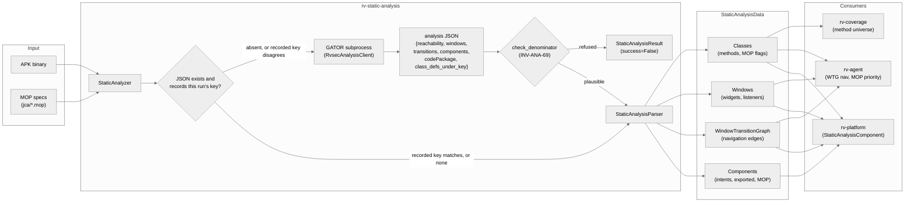
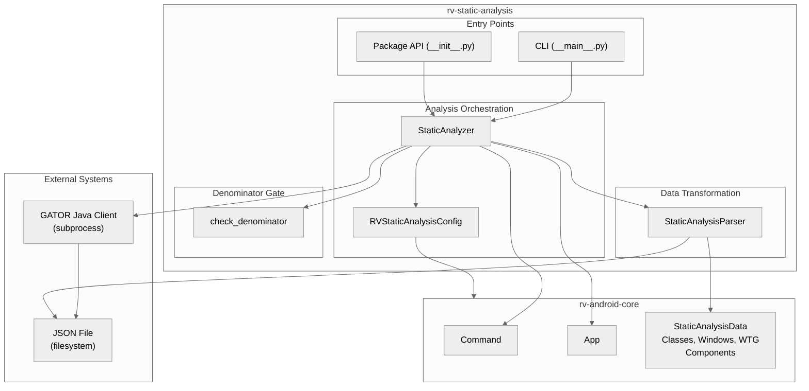
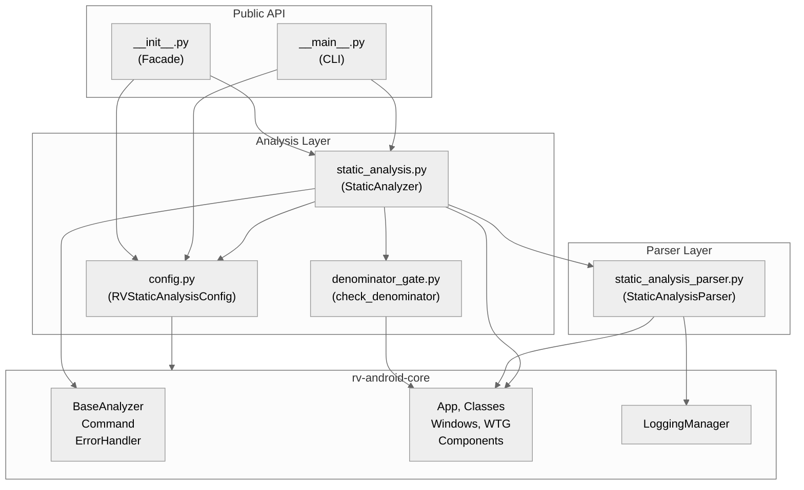
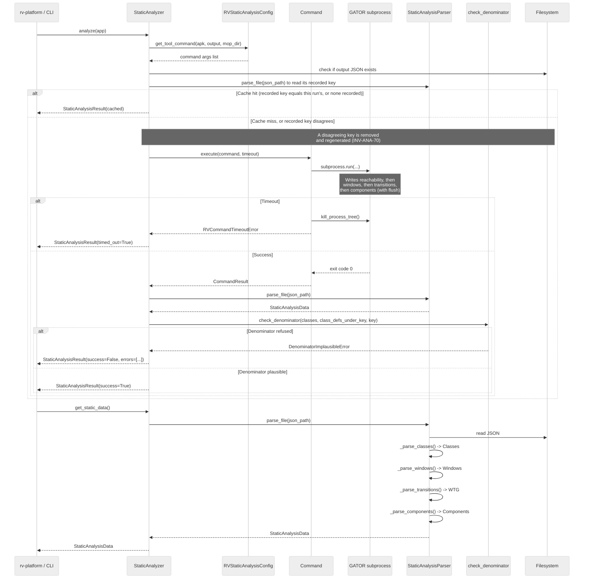
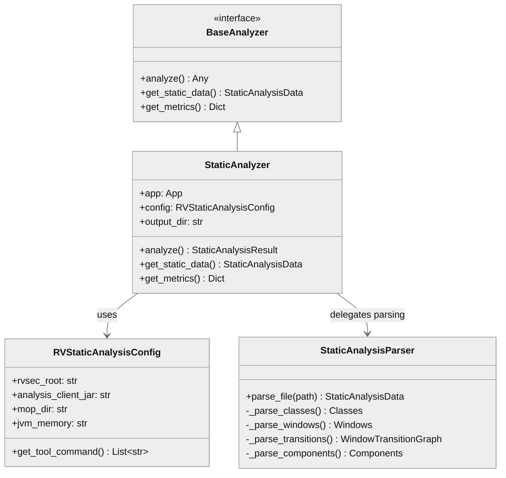

# rv-static-analysis Architecture

## Overview

rv-static-analysis runs unified GATOR-based static analysis on Android APKs and parses the resulting JSON into domain objects consumed by the rest of the RV-Android system. It provides three distinct capabilities: (1) analysis orchestration -- invoking the Java GATOR client as a subprocess with timeout handling and scope-keyed caching, (2) data transformation -- converting the raw JSON output into `StaticAnalysisData` domain objects (Classes, Windows, WindowTransitionGraph, Components), and (3) a denominator gate that refuses to publish a coverage denominator the artefact cannot support. The module occupies the pre-processing phase of the experiment pipeline, producing the method universe for coverage calculations and the navigation graph for LLM-driven exploration.

## Specification Alignment

This module implements requirements from `openspec/specs/analysis/spec.md`.

### Functional Requirements

| FR | Description | Architectural Support |
|----|-------------|----------------------|
| FR04 | GATOR analysis producing Window Transition Graph | `StaticAnalysisParser._parse_transitions()` builds `WindowTransitionGraph` from the `transitions` JSON section |
| FR05 | GESDA analysis extracting GUI elements (activities, widgets, listeners) | `StaticAnalysisParser._parse_windows()` builds `Windows` with widgets, events, inputType, hint, entries from the `windows` JSON section |
| FR06 | REACH analysis computing method reachability relative to MOP | `StaticAnalysisParser._parse_classes()` builds `Classes` with `reachable`, `reaches_target`, `directly_reaches_target` flags from the `reachability` JSON section |

All three FRs are satisfied by a single GATOR client invocation (`RvsecAnalysisClient`) that writes all four JSON sections in one pass. The previous three-tool pipeline (GESDA + GATOR + REACH) was unified into this single-client architecture.

### Key Invariants

| Invariant | Description | Enforcement Mechanism |
|-----------|-------------|----------------------|
| INV-ANA-67 | No identifier is transformed on the consumption path | `_parse_classes()` and `_parse_windows()` store `className` and window `name` exactly as the artefact spells them; the parser imports no normalizer and holds no transformation. Replaces the withdrawn INV-ANA-02, which mandated the opposite |
| INV-ANA-06 | Parser does not propagate exceptions; returns empty domain objects per-section | Each `_parse_*()` method is wrapped in try/except; failures produce `Classes()`, `Windows()`, `WindowTransitionGraph()`, or `Components()` |
| INV-ANA-11 / INV-ANA-70 | An existing output JSON is reused, but only under its own scope key | `StaticAnalyzer._execute_command()` checks file existence and then `_disagreeing_recorded_key()`; a recorded key that is not this run's makes the run regenerate rather than reuse (an artefact recording no key is reused, which is the state of all 162 stored ones) |
| INV-ANA-14 | PackageDetector applies heuristics in priority order, and only when the run enabled it | `PackageDetector` (in rv-android-core) resolves `code_package` via its 7-strategy priority chain under `--package-detector` / `RV_PACKAGE_DETECTOR`; by default `App` reports the declared applicationId and no strategy runs |
| INV-ANA-58 | A run that *performs* an analysis records the key it used; no key is inferred from an artefact | `StaticAnalysisResult.code_package` / `.code_package_source` are set in `analyze()`; nothing reads the JSON's `package` member as a key (it holds the manifest package whatever key filtered the file) |
| INV-ANA-59 | `reachability` is loaded whole; the parsed method universe equals it exactly | `_parse_classes()` has no package parameter and no filter — every entry becomes a `Clazz`. The universe is the coverage denominator |
| INV-ANA-60 | An `ACTIVITY` window is admitted iff its class is present in `reachability`; other window types are admitted unconditionally | `_parse_windows()` tests `classes.get_clazz(window_name)` for `w_type_str == "ACTIVITY"` only, comparing both sides in the artefact's own spelling |
| INV-ANA-61 | No consumption-path function accepts, resolves, or passes a package key | Signatures are `parse_file(file_path)` and `read_static_analysis_files(results_dir, apk)`, both on `StaticAnalysisParser` and on the module-level singleton wrappers; the rv-platform call sites pass no key |
| INV-ANA-66 | The artefact records the key that produced it, that key's origin, and the compiled-class count under it | `get_tool_command()` emits `-clientParam codePackage=` and `-clientParam codePackageSource=`; `parse_file()` reads `codePackage`, `codePackageSource` and `class_defs_under_key` back into `StaticAnalysisData`, mapping the producer's `""`/`-1` sentinels to `None` so *unrecorded* stays distinct from *empty* |
| INV-ANA-69 | A denominator that cannot be right is refused, not published | `denominator_gate.check_denominator()` raises `DenominatorImplausibleError` on a zero compiled universe, an empty parsed side, or a ratio below `MIN_PARSED_RATIO` (0.15); `StaticAnalyzer._check_denominator()` wires it into `analyze()` and turns a refusal into a failed `StaticAnalysisResult` for that APK |

### Specification Scenarios

Scenarios from `openspec/specs/analysis/spec.md` that validate this architecture:

- **Successful static analysis with valid APK**: Traces through `StaticAnalyzer._run_analysis()` -> GATOR subprocess -> JSON file -> `StaticAnalysisParser.parse_file()` -> `StaticAnalysisData` with non-empty Classes, Windows, WTG, and Components
- **Timeout with partial JSON output**: Traces through `Command` timeout -> `kill_process_tree()` -> partial JSON preserved -> `StaticAnalysisParser` truncated JSON recovery via bracket completion -> valid sections parsed, missing sections return empty domain objects
- **Analysis result is cached**: Traces through `StaticAnalyzer._execute_command()` -> file existence check -> `_disagreeing_recorded_key()` -> execution skipped -> `CommandResult(0, b"", b"")` returned with `execution_status='cached'` log. A recorded key that is not this run's removes the file and falls through to execution instead (INV-ANA-70)
- **A degenerate denominator is refused**: Traces through `analyze()` -> `_check_denominator()` -> `parse_file()` -> `check_denominator(classes, class_defs_under_key, key)` -> `DenominatorImplausibleError` -> `StaticAnalysisResult(success=False)` carrying the parsed count, the compiled count and the key
- **Partial JSON parse failure**: Individual section parsing fails -> `_parse_classes()` catches exception, returns empty `Classes()` -> other sections (`_parse_windows()`, `_parse_transitions()`) parse independently and succeed

## Key Architectural Decisions

### ADR-1: Single GATOR Client Instead of Three Separate Tools

The original pipeline ran three separate Java tools in sequence -- GESDA (GUI element extraction), GATOR (window transition graph), and REACH (method reachability). This was replaced by a single `RvsecAnalysisClient` invocation that produces all four data sections (reachability, windows, transitions, components) in one JSON file.

**Why**: Running three Java processes per APK tripled JVM startup overhead (~10s each) and required coordinating intermediate files between tools. A single invocation reduces wall-clock time by 20-30s per APK and eliminates file coordination bugs. The client writes sections in priority order with explicit `flush()` between each, so timeout still preserves the most critical data first.

**Spec reference**: This decision directly enables FR04, FR05, and FR06 from a single process. The priority-ordered output satisfies INV-ANA-06 (parser does not propagate exceptions; returns empty domain objects per-section).

### ADR-2: File-Level Caching, Keyed by the Artefact's Own Scope

`StaticAnalyzer._execute_command()` checks whether the output JSON exists before invoking GATOR, and then asks `_disagreeing_recorded_key()` which scope key that file records. An artefact recording this run's key, or no key at all, is reused; one recording a different key is removed and regenerated, with a warning naming both keys. Nothing else about the content is validated -- no checksum, no schema check.

**Why**: GATOR analysis takes 2-10 minutes per APK. In experiments with 100+ APKs, re-running the pre-processing phase after a crash would waste hours, so the reuse itself is what makes resume cheap. Existence alone was a sufficient signal only while every run scoped by the same rule: (a) a complete run produces valid JSON, and (b) a timed-out run produces truncated JSON the parser recovers via bracket completion. Once a run's key policy can change -- the build-type suffix rule, the package detector -- existence silently reuses an artefact filtered by the *previous* key, and the denominator gate would then judge an old artefact against a new key. The key check is the minimum that makes that mismatch detectable; it costs one parse of a file the run was about to skip. This satisfies INV-ANA-11 as amended by INV-ANA-70.

**Two deliberate reuses.** An artefact recording *no* key is reused rather than regenerated: all 162 artefacts of the article corpus predate INV-ANA-66, and the `package` member holds the manifest package whatever key filtered the file, so resolving a key from it would be the invented measurement INV-ANA-58 forbids. An *unreadable* artefact is reused too -- the parser recovers truncated JSON on purpose (INV-ANA-06), so a parse failure inside the check says something about the check, not about the file.

**Deliberate invalidation** is `--force`, which removes the artefact before `analyze()` runs (`_discard_cached_artifact()`). It is the path for a fresh artefact under the *same* key; the automatic regeneration above fires only when the key changed.

### ADR-3: Two-Layer Architecture (Analysis + Parser)

The module is split into two independent layers: analysis orchestration (`StaticAnalyzer`) and data transformation (`StaticAnalysisParser`). The parser has no dependency on the analyzer and can operate on any JSON file matching the expected schema.

**Why**: This separation serves two use cases. In the experiment pipeline, the analyzer runs GATOR and then the parser transforms the output. In batch/offline scenarios, researchers parse pre-existing JSON files without running GATOR. The parser's independence also enables unit testing with JSON fixtures (76 tests) without requiring GATOR installation.

### ADR-4: Per-Section Independent Parsing with Graceful Degradation

Each JSON section (reachability, windows, transitions, components) is parsed in its own `_parse_*()` method wrapped in try/except. A failure in one section does not prevent parsing of others (INV-ANA-06).

**Why**: The GATOR client writes sections sequentially and flushes between each. On timeout (the most common failure mode at 600s default), the file is truncated mid-section. Reachability is written first because it provides the coverage denominator -- the most critical data for experiment validity. Even if transitions are entirely lost, the coverage calculation and MOP tracking still function. This pattern is validated by the "Timeout with partial JSON output" scenario from the spec.

### ADR-5: SignatureNormalizer as Defensive Safety Net — SUPERSEDED (2026-08-30, gh111)

> **Superseded.** The decision below is kept for the record; its diagnosis is inverted and
> its mechanism is deleted. `SignatureNormalizer` no longer exists, INV-ANA-02 is withdrawn,
> and INV-ANA-67 states the opposite rule: the parser transforms no identifier. See the
> correction after the original text.

*Original decision:* `StaticAnalysisParser` applies `SignatureNormalizer` to all class names (INV-ANA-02), converting `.` inner-class notation to `$` notation. The GATOR client already writes `$` notation via `SootClass.getName()`, so the normalizer is expected to be a no-op on well-formed output. **Why**: the normalizer exists as a guard against upstream changes in the GATOR client. If a future version of Soot or GATOR changes its output format, the parser continues to produce consistent class names. The cost is negligible (string scan per class name), and the safety benefit was validated when a GATOR version briefly produced mixed notation.

**The correction.** A safety net is only harmless if it can be a no-op, and this one could not be. The heuristic converts a dot to a `$` whenever both sides start with an uppercase letter — but `SootClass.getName()` writes the JVM binary name, in which such a dot is *always* a package boundary. So on well-formed GATOR output the rule is not a no-op waiting for a format change; it is wrong every time it fires, and it fired on **465 classes across 7 of the 162 corpus artefacts**. It was applied to one side of an equality test whose other side is the raw logcat, which no normalizer touches, so each firing broke a match that would otherwise have succeeded. `com.hwloc.lstopo.ZoomView.ZoomView` — a class in a capitalized package, not a nested class — published `0.00%` against 1080 `RVSEC-COV` events that named it correctly.

The premise that motivated the guard is also falsified rather than merely unproven: the "future GATOR emitting dotted inner classes" it defended against would contradict `SootClass.getName()`, and the archived logcat shows the spurious `$` never existed upstream — it came from here. Under P1 and P3 the class is deleted rather than disabled; the backup lives at `backup/gh111-removed/`.

### ADR-6: ETL Pipeline Pattern

The module follows an Extract-Transform-Load pattern: `StaticAnalyzer` extracts raw data by running GATOR as a subprocess, `StaticAnalysisParser` transforms the JSON into domain objects, and the resulting `StaticAnalysisData` is loaded into downstream consumers.

**Why**: GATOR is a Java program that cannot be imported as a Python library, so subprocess invocation with file-based I/O is the natural integration pattern. The file-based intermediate step also provides an audit trail -- the raw JSON is preserved in the results directory for post-experiment inspection.

### ADR-7: Scope Belongs to the Producer, Not to the Parser

Choosing which classes count as the application's own is a decision made **once**, when an analysis is run: `RVStaticAnalysisConfig.get_tool_command()` passes `-clientParam codePackage=<key>` and GATOR drops everything outside that key before writing the file. The parser makes no such decision -- it loads the `reachability` member whole (INV-ANA-59) and scopes `ACTIVITY` windows by membership in it (INV-ANA-60), a test the artefact answers on its own. No function on the consumption path accepts a package key (INV-ANA-61).

**Why**: When the parser re-derived the scope from a key resolved at consumption time, it could disagree with the producer, and it did. The artefact does not record the key that filtered it (INV-ANA-58) and no heuristic recovers it: on applications built with an `applicationIdSuffix`, the consumer key carried the suffix while the analysed classes did not, so the prefix test matched nothing and the coverage denominator collapsed to zero. Deriving the ACTIVITY decision from `reachability` instead of from a key preserves the useful half of the old filter -- keeping framework activities such as `androidx.activity.ComponentActivity` out of the activity denominator -- while making disagreement structurally impossible. Verified on the 162-artefact corpus: parsed class count equals `len(reachability)` in 162/162, and the ACTIVITY decision reproduces the producer-key decision on 1526/1526 activities.

**Boundary**: this is a consumption-path decision only. `analyze()` still resolves `app.code_package`, still passes it to GATOR, and still records `code_package` / `code_package_source` on its `StaticAnalysisResult`. An artefact produced under a wrong key still yields a wrong denominator -- ADR-8 is what stops that denominator from being published.

### ADR-8: A Denominator Gate That Refuses Rather Than Publishes

`denominator_gate.check_denominator(classes, compiled_under_key, key)` is a pure predicate over one artefact. It refuses three conditions -- a compiled universe of zero, an empty parsed side, and a ratio of parsed to compiled classes below `MIN_PARSED_RATIO` (0.15) -- by raising `DenominatorImplausibleError`. `StaticAnalyzer.analyze()` calls it after `_run_analysis()` and converts a refusal into a failed `StaticAnalysisResult` for that APK.

**Why refuse at all**: a collapsed denominator does not look wrong to a reader. It publishes a small percentage of a small number, which is indistinguishable from an app that was barely exercised. Four APKs of the 162-artefact corpus reached publication that way, with denominators of 1, 2, 6 and 21 classes against universes of 762, 1952, 3578 and 535. A gate testing only for emptiness would have admitted all four.

**Why a ratio and not a subtraction**: the gate divides and nothing else, because `class_defs_under_key` is recorded already net -- the producer applies `RvsecAnalysisClient.isAppClass`, the same predicate that filtered the parsed side, at write time (INV-ANA-66). One predicate on both terms makes the two counts comparable by construction. The subtraction cannot live here in any case: the gate holds a count, not the names.

**Why 0.15**: with both terms answering to one predicate, the 158 healthy corpus artefacts sit at exactly 1.0 and the four collapsed ones between 0.0010 and 0.0393. The threshold stands 3.8x above the collapsed ceiling and 6.7x below the healthy floor, inside a 25x separation -- calibrated against the gap, not against either band. Once the producer-side guard resolves the same key as the client, the degenerate branch is a tripwire on a stale `lib/gator/` jar and on any regression of INV-ANA-65, rather than a discriminator over healthy applications.

**Why the ordering**: the zero-universe test comes first because `0/0` is not a low ratio but no ratio -- it is the signature of a key matching nothing compiled, the state of 75 of the 162 corpus APKs under the literal manifest key, and the condition the build-type suffix policy exists to resolve before the gate judges anything.

**Why it raises loudly but does not propagate**: `analyze()` catches the error and returns `success=False` with the message in `errors`, rather than letting it escape. The `ErrorHandler` decorator on `analyze()` would swallow a raise and return `None` -- the exact silence the gate exists to end -- and aborting a 200-APK campaign for one artefact is not warranted when the message already names the parsed count, the compiled count and the key. An artefact recording no `class_defs_under_key` is skipped rather than judged: there is no universe to divide by, and inventing one would reintroduce the silent measurement.

**Why the exception lives in `denominator_gate.py`**: `static_analysis.py` imports the gate to wire it, so defining `DenominatorImplausibleError` there and importing it back would close a cycle.

| Decision | Choice | Rationale |
|----------|--------|-----------|
| Application Type | Library with CLI entry point | Consumed programmatically by rv-platform/rv-experiment; CLI for standalone/batch use |
| Structuring | Two-layer (analysis + parser) | Clean separation between GATOR execution orchestration and JSON data transformation |
| Primary Pattern | ETL Pipeline (Extract-Transform-Load) | APK -> GATOR subprocess (extract) -> JSON parsing (transform) -> domain objects (load) |
| Control Strategy | Call-based, synchronous | Single subprocess execution with timeout; no concurrency within the module |
| Distribution | Single machine, subprocess | GATOR runs as a Java subprocess on the same host; no network communication |
| Caching Strategy | File-level existence check, gated by the recorded scope key | An existing output JSON is reused when it records this run's key or no key; a disagreeing key regenerates it (INV-ANA-70). Nothing else about the content is validated |

## Data Flow

The module participates in a linear data pipeline that transforms an APK binary into structured domain objects consumed by three downstream modules.

### End-to-End Data Flow



### Data Transformation Stages

1. **Extract**: `StaticAnalyzer` builds a GATOR command line from `RVStaticAnalysisConfig` paths (JVM, android.jar, MOP dir, analysis client JAR) and invokes it as a subprocess with configurable timeout (default 600s). The GATOR client performs Soot-based analysis of the APK bytecode.

2. **Intermediate file**: The GATOR client writes a single JSON file with four sections in priority order: `reachability` (classes with MOP flags), `windows` (widgets with event listeners and XML attribute extensions `prompt`/`spinnerMode`/`contentDescription`/`tooltipText` plus populated OPTIONSMENU widgets), `transitions` (window-to-window edges), and `components` (non-Activity component data). Each section is flushed before starting the next, so timeout preserves sections in priority order. When `skip_wtg=True` is set, the client returns after writing reachability and windows, leaving `transitions[]` empty by design (not a failure).

3. **Transform**: `StaticAnalysisParser.parse_file()` reads the JSON and produces four domain objects:
   - `Classes`: one `Clazz` per entry of `reachability`, unfiltered (INV-ANA-59) — the artefact was already scoped by GATOR, so this set is the whole coverage denominator. Each contains `Method` objects with `reachable`, `reaches_target`, and `directly_reaches_target` flags.
   - `Windows`: one `Window` per UI screen with `Widget` objects carrying event listeners (`WidgetEvent` with handler signatures).
   - `WindowTransitionGraph`: a `networkx.DiGraph` where nodes are `Window` objects and edges carry `WindowTransition` lists (widget ID, event type, handler method). Widgets referenced in transitions but absent from windows are back-filled on the fly.
   - `Components`: activities, receivers, services, and providers with intent filters, exported status, and MOP reachability data.

4. **Gate**: `StaticAnalyzer._check_denominator()` re-parses the artefact it just wrote and divides the parsed class count by the `class_defs_under_key` the producer recorded. A ratio below `0.15`, an empty parsed side, or a compiled universe of zero fails this APK with `success=False` rather than letting a collapsed denominator publish as a small percentage (INV-ANA-69). An artefact recording no count is not judged.

5. **Load**: The `StaticAnalysisData` aggregate is passed to downstream consumers. rv-coverage uses `Classes.methods` as the denominator for coverage percentages. rv-agent uses the WTG for navigation guidance and MOP flags for action prioritization. rv-platform makes the data available to all task executor components.

### JSON Section Priority and Timeout Behavior

When the GATOR client is killed by timeout, the JSON file is truncated at the point of interruption. The parser's bracket-recovery mechanism finds the last complete `]` and closes the root object with `}`. This yields:

| Timeout point | Reachability | Windows | Transitions | Components | Impact |
|---------------|-------------|---------|-------------|------------|--------|
| After reachability flush | Complete | Empty | Empty | Empty | Coverage denominator preserved; no navigation data |
| During windows write | Complete | Partial | Empty | Empty | Coverage + partial widget data for MOP matching |
| After windows flush | Complete | Complete | Empty | Empty | Coverage + full widget matching; no WTG navigation |
| During transitions write | Complete | Complete | Partial | Empty | Full data except some WTG edges and all components |
| After transitions flush | Complete | Complete | Complete | Empty | Full navigation data; missing component-level MOP |
| Complete | Complete | Complete | Complete | Complete | All data available |
| `skip_wtg=True` (deliberate) | Complete | Complete | Empty | Empty | Reachability + widget data for MOP matching; WTG construction bypassed by client choice (not failure) |

## Architectural Patterns

### Pattern: ETL Pipeline

**Description**: The module follows an Extract-Transform-Load pattern. The `StaticAnalyzer` extracts raw analysis data by running the GATOR Java client as a subprocess, which produces a JSON file. The `StaticAnalysisParser` transforms this JSON into structured domain objects. The resulting `StaticAnalysisData` is loaded into downstream consumers (rv-platform, rv-agent, rv-coverage).

**When Used**: Processing external tool output into internal domain models. The GATOR client is a Java program that cannot be imported as a Python library, so subprocess invocation with file-based I/O is the natural integration pattern.

**Advantages**:
- Clear separation between execution and parsing concerns
- Parser can operate independently on pre-existing JSON files
- Graceful degradation: partial extraction still yields usable data

**Disadvantages**:
- File I/O overhead for intermediate JSON storage
- No streaming -- entire JSON must be written before parsing begins

### Pattern: Facade

**Description**: The `__init__.py` exports four symbols (`StaticAnalyzer`, `StaticAnalysisResult`, `StaticAnalysisException`, `RVStaticAnalysisConfig`), hiding the internal directory structure. Consumers import from `rv_static_analysis` without knowledge of the `analysis/static/` or `parser/static/` subdirectories.

**When Used**: Providing a stable public API while allowing internal restructuring.

**Advantages**:
- Consumers are decoupled from internal package organization
- Adding new analysis types does not change the import surface

**Disadvantages**:
- Parser is not part of the public API and must be imported directly when needed outside `StaticAnalyzer`

### Pattern: Graceful Degradation

**Description**: The parser processes each JSON section (reachability, windows, transitions, components) independently. A failure in one section does not prevent parsing of others. The GATOR client writes sections in priority order with explicit flush, so a timeout preserves the most critical data first (reachability).

**When Used**: Handling timeout scenarios where the GATOR subprocess is killed mid-write. Also handles malformed JSON sections caused by GATOR bugs.

**Advantages**:
- Partial data is always recovered and usable
- Reachability (coverage denominator) is written first and most likely to survive

**Disadvantages**:
- Consumers must handle potentially empty sections in `StaticAnalysisData`

---

## Logical View

### Domain Entities

| Entity | Responsibility |
|--------|----------------|
| `StaticAnalyzer` | Orchestrates GATOR execution with caching, timeout handling, and result packaging |
| `RVStaticAnalysisConfig` | Validates and resolves paths for GATOR tools; generates command lines |
| `StaticAnalysisParser` | Converts GATOR JSON output into `StaticAnalysisData` domain objects |
| `StaticAnalysisResult` | Value object capturing analysis outcome (file path, success, timeout, errors) |
| `StaticAnalysisData` | Aggregate domain object holding Classes, Windows, WTG, Components, and the artefact's recorded scope (`code_package`, `code_package_source`, `class_defs_under_key`); defined in rv-android-core |
| `check_denominator` | Pure predicate over one artefact: refuses an empty, degenerate, or universe-less coverage denominator (`denominator_gate.py`) |
| `DenominatorImplausibleError` | Refusal raised by the gate and turned into a failed `StaticAnalysisResult` by `analyze()` |

### Component Architecture



---

## Development View

### Module Structure

```
rv-static-analysis/
├── src/rv_static_analysis/
│   ├── __init__.py                     # Facade: 4 public exports
│   ├── __main__.py                     # CLI: analyze + batch subcommands
│   ├── config.py                       # RVStaticAnalysisConfig (Pydantic)
│   ├── analysis/
│   │   └── static/
│   │       ├── static_analysis.py      # StaticAnalyzer, StaticAnalysisResult
│   │       └── denominator_gate.py     # check_denominator, DenominatorImplausibleError
│   └── parser/
│       └── static/
│           └── static_analysis_parser.py  # StaticAnalysisParser (JSON -> domain)
├── tests/                              # 163 tests
│   ├── conftest.py                     # Shared fixtures
│   ├── test_config.py                  # Config validation (13)
│   ├── analysis/
│   │   ├── test_targets_file_cli.py    # --targets-file behaviour
│   │   └── static/
│   │       ├── test_static_analysis.py     # Analyzer: caching, timeout, errors
│   │       ├── test_denominator_gate.py    # Gate: refusals, admissions, wiring
│   │       └── test_scope_key_policy.py    # Key travel: run -> GATOR -> artefact -> reuse
│   ├── cli/                            # CLI flag tests (32)
│   ├── parser/                         # Parser tests (76)
│   │   ├── test_sentinel.py
│   │   └── static/test_static_analysis_parser.py
│   └── resources/
│       ├── cryptoapp.apk.json          # Reference analysis output
│       └── baselines/MANIFEST.json     # Baseline checksums
└── pyproject.toml
```

### Package Dependencies



### Build Dependencies

| Dependency | Type | Purpose |
|------------|------|---------|
| rv-android-core | Internal (workspace) | Domain models, base classes, error handling, logging |
| pydantic | External (>=2.9.0) | Configuration validation and model definitions |
| pytest | Dev | Testing framework |
| pytest-cov | Dev | Coverage reporting |

---

## Process View

The module does not use concurrency internally. It executes as a synchronous pipeline: configure -> run subprocess -> parse output. The GATOR Java client runs as a separate process with timeout enforcement via `Command.kill_process_tree()`.

### Execution Flow



---

## Core Components

### StaticAnalyzer

**Purpose**: Orchestrates GATOR execution with scope-keyed caching and timeout handling, and judges the denominator the run produced. Provides `analyze()` for running the analysis and `get_static_data()` for retrieving parsed results.

**Location**: `src/rv_static_analysis/analysis/static/static_analysis.py`

**Key Classes**:
- `StaticAnalyzer(BaseValidatedModel, BaseAnalyzer)`: Dual inheritance -- Pydantic for validated construction, BaseAnalyzer for the `analyze()`/`get_metrics()` interface
- `StaticAnalysisResult(BaseValidatedModel)`: Value object for analysis outcomes
- `StaticAnalysisException(RVAndroidError)`: Domain-specific exception

**Key methods added by the scope-key work**:
- `_disagreeing_recorded_key(result_file)`: the key a stored artefact records when it is not this run's; `None` (reuse) covers an artefact with no key, one with this run's key, and one that cannot be parsed
- `_check_denominator()`: parses the artefact just written and hands `classes`, `class_defs_under_key` and the effective key to the gate; skips artefacts recording no count
- `_run_analysis()`: passes both `code_package` and `code_package_source` to `get_tool_command()`

**Dependencies**:
- Internal: `RVStaticAnalysisConfig`, `StaticAnalysisParser`, `denominator_gate`
- External: rv-android-core (`Command`, `App`, `BaseAnalyzer`, `ErrorHandler`)

### RVStaticAnalysisConfig

**Purpose**: Validates paths for GATOR tools (launcher, analysis JAR, Android SDK, MOP directory) and generates command lines. Uses a 4-level priority chain for path resolution: explicit parameters > rvsec_root layout > RVSEC_HOME env var > CWD parent.

**Location**: `src/rv_static_analysis/config.py`

**Key Classes**:
- `RVStaticAnalysisConfig(BaseValidatedModel)`: Pydantic model with field validators and `model_post_init` for path resolution. Notable fields: `cg_algorithm` (default `spark`), `jvm_memory`, `analysis_timeout`, `skip_wtg` (default `False` — when True the generated command includes `-clientParam skipWtg=true`). `get_tool_command()` resolves the launcher under `sys.executable` (the running interpreter) to remain portable across hosts without `/usr/bin/python`.

**Dependencies**:
- External: rv-android-core (`BaseValidatedModel`, `ConfigurationError`, constants)

### StaticAnalysisParser

**Purpose**: Converts GATOR JSON output into `StaticAnalysisData` domain objects. Handles four JSON sections independently (reachability, windows, transitions, components), enabling graceful degradation when sections are missing or corrupt. Implements truncated JSON recovery for timeout scenarios. Widgets carry XML attribute fields (`prompt`, `spinnerMode`, `contentDescription`, `tooltipText`) which default to `None` when absent.

**Location**: `src/rv_static_analysis/parser/static/static_analysis_parser.py`

**Key Classes**:
- `StaticAnalysisParser`: parser holding only its logger; a module-level singleton (`_instance`) provides convenience functions (`parse_file()`)

**Dependencies**:
- External: rv-android-core (all domain models: `Classes`, `Method`, `Windows`, `Window`, `Widget`, `WidgetEvent`, `WindowTransitionGraph`, `Components`, `ComponentInfo`, `IntentFilter`)

### Denominator Gate

**Purpose**: Refuses a coverage denominator the artefact cannot support, so a collapsed measurement fails loudly instead of publishing as a small percentage. See ADR-8 for the reasoning and the threshold calibration.

**Location**: `src/rv_static_analysis/analysis/static/denominator_gate.py`

**Key names**:
- `check_denominator(classes, compiled_under_key, key) -> None`: raises on a zero compiled universe, an empty parsed side, or a ratio below the threshold; the message always names the key it judged, because a refusal that does not is not actionable
- `MIN_PARSED_RATIO = 0.15`: calibrated over the 162-APK corpus (healthy at 1.0, collapsed at 0.0010-0.0393)
- `DenominatorImplausibleError(RVAndroidError)`: defined here, not in `static_analysis.py`, which imports this module

**Dependencies**:
- External: rv-android-core (`Classes`, `RVAndroidError`) only. It holds no config, no APK and no filesystem access -- everything it judges arrives in its arguments.

### CLI Entry Point

**Purpose**: Provides `analyze` (single APK) and `batch` (directory of APKs) subcommands for standalone use outside the rv-platform pipeline.

**Location**: `src/rv_static_analysis/__main__.py`

**Dependencies**:
- Internal: `StaticAnalyzer`, `RVStaticAnalysisConfig`

**CLI Library**: `argparse` (NOT Click). This matters for env-var handling: `argparse` has no `envvar=` analogue, so this entry-point does NOT honor `RV_SA_TIMEOUT` or `RV_JVM_MEMORY` directly. The env-var bridge only exists through `rv-experiment` (gh55 §9 Click `envvar=` gambiarra). Standalone runs must pass `--analysis-timeout` (gh55 added) or `--jvm-memory` explicitly. The architectural fix that gives every L5 entry-point uniform env-var resolution lives at `openspec/changes/gh-tbd-env-vars-architecture/`.

**CLI Flags (selected)**: `--analysis-timeout SECS` overrides per-APK GATOR timeout; `--skip-wtg` (gh57) propagates to GATOR as `-clientParam skipWtg=true` so the client emits reachability + `windows[]` and returns without invoking `WTGBuilder.build()`; `--jvm-memory SIZE` sets the JVM `-Xmx` for the GATOR subprocess; `--package-detector` / `--strip-build-type-suffix` choose the scope key; `--force` removes the stored artefact so the run regenerates it under the same key.

**Env-var exceptions**: `RV_PACKAGE_DETECTOR` and `RV_STRIP_BUILD_TYPE_SUFFIX` *are* honored here, resolved in `main()` by `resolve_package_detector()` / `resolve_strip_build_type_suffix()` under flag > env > default. Both delegate to `rv_android_core.util.utils.resolve_bool_setting`, the same helper `rv-experiment` uses, so the two CLIs cannot drift on what a given string means; an unparseable value exits nonzero before any APK is opened. This is deliberate (gh98 D4): a standalone invocation is a run, not a step inside one, and only entry points may read the environment (INV-EXP-35).

---

## NFR Support

How the architecture supports non-functional requirements from `docs/PRD.md` Section 7.

| NFR | PRD ID | Priority | Architectural Support |
|-----|--------|----------|----------------------|
| Modularity | NFR01 | P0 | Single uv workspace module with one internal dependency (rv-android-core). Clean Facade API via `__init__.py`. Analysis and parser layers are independent packages. |
| Extensibility | NFR02 | P0 | `BaseAnalyzer` interface allows adding new analysis types. Parser sections are independent -- adding a new JSON section requires only a new `_parse_*()` method. |
| Testability | NFR03 | P1 | Parser tests (76) operate on JSON fixtures without GATOR. Analyzer tests (42) use mocked `Command`. Reference JSON (`cryptoapp.apk.json`) enables baseline equivalence tests. The gate is tested twice over -- as a bare function and through `analyze()` -- because a gate that is written but never called leaves every function-level test green. |
| Resilience | NFR04 | P1 | Graceful degradation: per-section error isolation (INV-ANA-06). Truncated JSON recovery via bracket completion. Scope-keyed caching avoids redundant execution without reusing an artefact filtered by another key. Timeout handling preserves partial results. A refused denominator fails one APK, not the campaign. |
| Configurability | NFR05 | P1 | Pydantic model with 4-level path resolution. Environment variables (`RVSEC_HOME`, `ANDROID_HOME`). CLI arguments for standalone use. Configurable JVM memory and analysis timeout. |
| Reproducibility | NFR08 | P2 | Caching ensures re-runs produce identical results *under the same key*, and regenerate when the key changed (INV-ANA-70). The artefact records the key, its origin and the compiled-class count that produced it (INV-ANA-66), so a stored result can be re-audited without the APK. Deterministic JSON output from GATOR. Reference test fixtures for parser validation. |

---

## Key Interfaces

### BaseAnalyzer Protocol

```python
class BaseAnalyzer(Protocol):
    """Interface for analysis tools that produce structured results."""

    def analyze(self) -> Any:
        """Execute analysis and return result."""
        ...

    def get_static_data(self) -> StaticAnalysisData:
        """Return parsed analysis data."""
        ...

    def get_metrics(self) -> Dict[str, Any]:
        """Return execution metrics."""
        ...
```



---

## Scenarios

### Scenario 1: Pre-Processing in Experiment Pipeline

**Description**: rv-experiment's `PreProcessor` runs static analysis on each APK before test execution begins. The results feed into the coverage tracker (method universe) and rv-agent (navigation guidance).

**Flow**:
1. `PreProcessor` creates `StaticAnalyzer` with `App` and `RVStaticAnalysisConfig`
2. `StaticAnalyzer.analyze()` checks if output JSON exists and whether it records this run's scope key; if it is absent or records another key, it invokes the GATOR subprocess
3. GATOR writes reachability, windows, transitions, components to JSON in priority order, plus the key, its origin and `class_defs_under_key`
4. `_check_denominator()` parses the artefact and divides the parsed class count by `class_defs_under_key`; a refusal ends this APK with `success=False` and the pipeline moves to the next
5. `StaticAnalyzer.get_static_data()` delegates to `StaticAnalysisParser.parse_file()`
6. Parser produces `StaticAnalysisData` with `Classes`, `Windows`, `WTG`, `Components` and the recorded scope
7. `StaticAnalysisComponent` in rv-platform passes data to `CoverageTracker` (method universe) and makes it available to rv-agent (WTG navigation, MOP prioritization)

### Scenario 2: Timeout with Partial Data Recovery

**Description**: GATOR exceeds the configured timeout (default: 600s) and is killed, but the most critical data is preserved.

**Flow**:
1. `Command` detects timeout and calls `kill_process_tree()`
2. GATOR had already flushed the reachability section and part of the windows section
3. `StaticAnalysisResult` is returned with `timed_out=True`
4. `StaticAnalysisParser.parse_file()` attempts to load the truncated JSON
5. `json.loads()` fails; parser finds last complete `]` bracket, truncates, closes JSON
6. Reachability section parses successfully into `Classes` (coverage denominator preserved)
7. Windows section partially recovers; transitions and components return empty domain objects
8. Downstream consumers receive partial but usable `StaticAnalysisData`

### Scenario 3: Batch Analysis via CLI

**Description**: A researcher runs batch analysis on a directory of APKs for offline processing.

**Flow**:
1. CLI receives `batch --apks-dir /apks --output /output` command
2. `handle_batch_command()` iterates APK files in the directory
3. For each APK, creates `StaticAnalyzer` and calls `analyze()`
4. Caching skips previously analyzed APKs whose artefact records this run's scope key (or none); `--force` skips the cache entirely
5. Continue-on-error flag allows the batch to proceed past individual failures
6. Aggregate summary reports total, successful, failed, cached counts

---

## Extension Points

- **New analysis sections**: Add a new `_parse_*()` method to `StaticAnalysisParser` and extend `StaticAnalysisData` in rv-android-core. The per-section independence means existing sections are unaffected.
- **Alternative analysis backends**: Implement `BaseAnalyzer` interface with a different tool (e.g., FlowDroid, Amandroid). The parser layer can be reused if the tool produces compatible JSON.
- **Configuration**: `RVStaticAnalysisConfig` accepts explicit paths at each level, enabling custom tool installations and non-standard directory layouts.
- **Plausibility checks**: `denominator_gate` takes only the parsed classes, a compiled count and a key, so a further check over the same three arguments is a new function in that module plus one call in `_check_denominator()`. A check needing anything else does not belong there -- the gate's value is that it is evaluable at every consumption point, including resume and `--process-results`, which re-parse `.apk.json` with no APK within reach.

## Dependencies

### Internal (rv-android modules)

| Module | Purpose |
|--------|---------|
| rv-android-core | Domain models (`App`, `StaticAnalysisData`, `Classes`, `Windows`, `WTG`, `Components`), base classes (`BaseAnalyzer`, `BaseValidatedModel`), utilities (`Command`, `ErrorHandler`, `LoggingManager`), constants |

### External

| Package | Version | Purpose |
|---------|---------|---------|
| pydantic | >=2.9.0 | Configuration validation and model definitions |
| networkx | (transitive via rv-android-core) | `WindowTransitionGraph` directed graph representation |

### Downstream Consumers

| Module | What It Uses |
|--------|-------------|
| rv-platform | `StaticAnalysisComponent` calls `StaticAnalyzer.analyze()` and `parser.parse_file()` |
| rv-experiment | `PreProcessor` orchestrates static analysis during pre-processing phase |
| rv-agent | `TransitionManager` uses WTG; `MopScorer` uses reachability MOP flags |
| rv-coverage | `CoverageTracker` uses `Classes` as the method universe for coverage % |

## Testing Strategy

| Type | Location | Purpose |
|------|----------|---------|
| Unit (parser) | `tests/parser/static/test_static_analysis_parser.py` | JSON sections, edge cases, truncated JSON recovery, artefact-scoped parsing (INV-ANA-59/60/61) and artefact-spelling preservation (INV-ANA-67) |
| Unit (analyzer) | `tests/analysis/static/test_static_analysis.py` | Caching, timeout handling, error scenarios (mocked Command) |
| Unit (gate) | `tests/analysis/static/test_denominator_gate.py` | The three refusals and the admission that matters (a genuinely small app), plus wiring tests through `StaticAnalyzer.analyze()` -- without those, the gate could be written and never called with every other test still green |
| Integration (scope key) | `tests/analysis/static/test_scope_key_policy.py` | The key's whole journey: what the run tells GATOR, what the artefact carries back, and what a stored artefact is allowed to answer for (INV-ANA-66/70) |
| Unit (CLI) | `tests/cli/` | 32 tests over flag parsing, mutual exclusion, and env-var resolution |
| Unit (config) | `tests/test_config.py` | 13 tests covering path resolution, validation, command generation (including `-clientParam codePackage=` and `codePackageSource=`) |
| Fixture | `tests/resources/cryptoapp.apk.json` | Reference analysis output for baseline equivalence tests |

Total: 163 tests. Run them with the CI contract flags: `uv run pytest tests/ --import-mode=importlib -o "addopts="`.

## Related Documentation

- [Domain Spec](../../openspec/specs/analysis/spec.md) - Requirements, invariants, and scenarios for the Analysis and Coverage domain
- [PRD](../../docs/PRD.md) - Product Requirements Document (FR04-FR06, NFR01-NFR08)
- [CLAUDE.md](../../CLAUDE.md) - Project-wide development guidance
- [Module CLAUDE.md](../CLAUDE.md) - Module-specific development guidance
