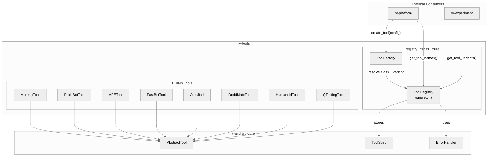
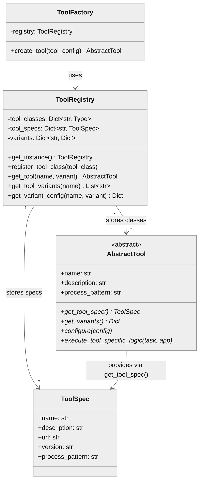
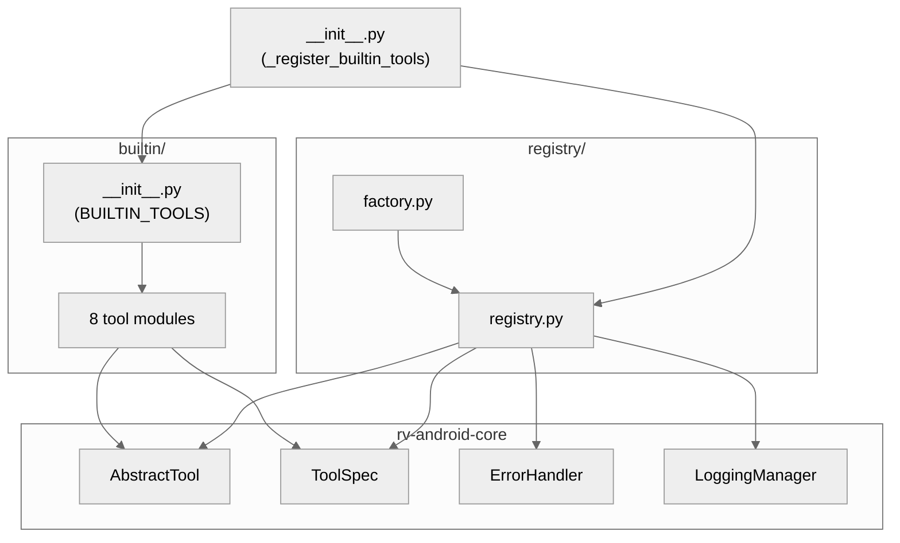
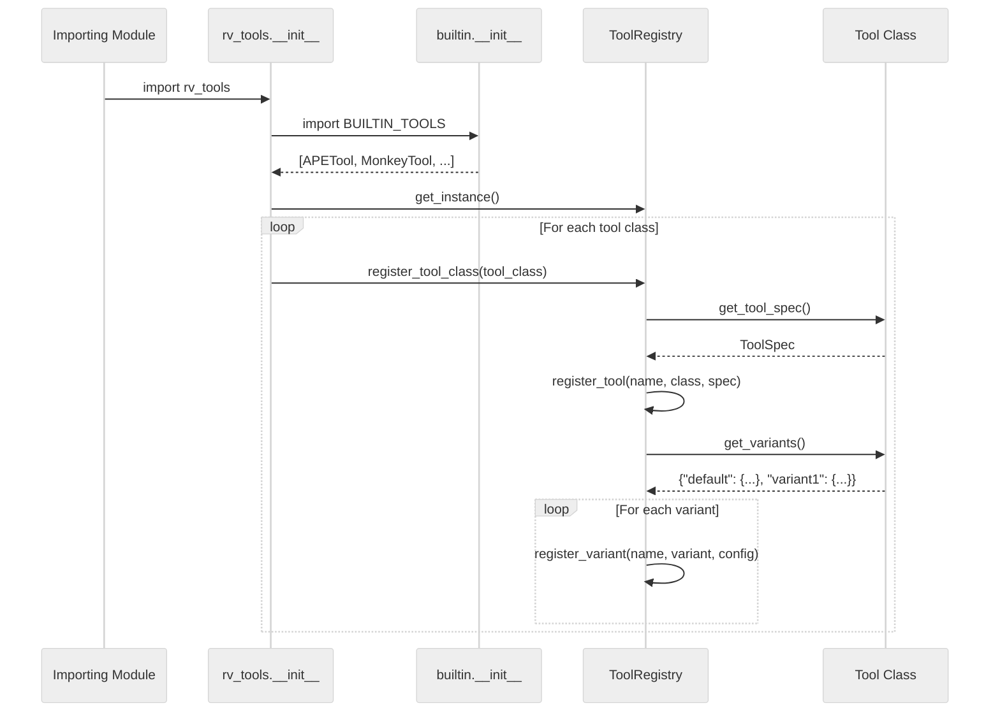
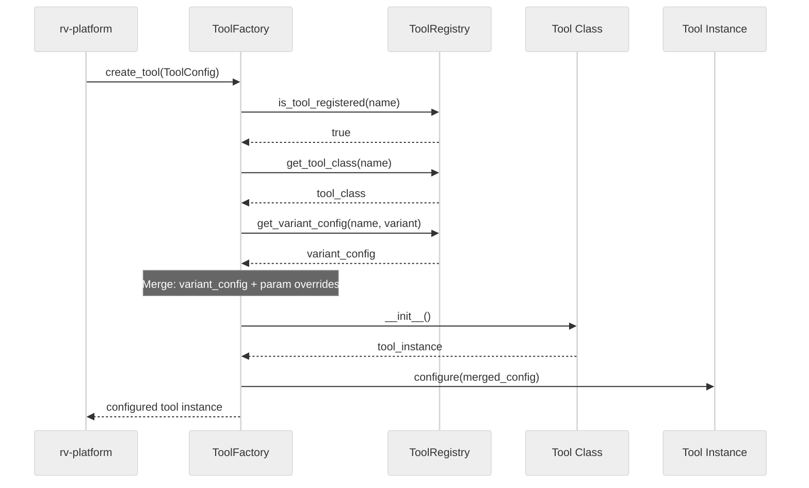
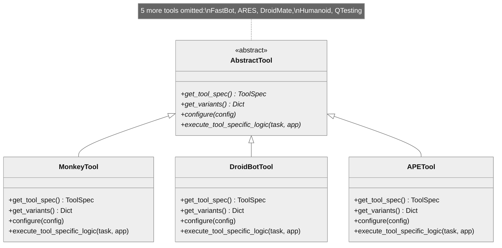

# rv-tools Architecture

## Overview

rv-tools is a Layer 2 module in the RV-Android framework that provides a centralized tool registry and plugin system for Android application testing tools. It manages the lifecycle of 8 built-in testing tools through a Registry/Factory pattern, supporting tool variants for different testing configurations. The module serves as the bridge between tool implementations and the execution engine (rv-platform), enabling tool discovery, registration, instantiation, and configuration with variant support.

## Key Architectural Decisions

| Decision | Choice | Rationale |
|----------|--------|-----------|
| Application Type | Library (imported by rv-platform and rv-experiment) | Tools are created and executed by the platform, not standalone |
| Structuring | Two-package module (registry + builtin) | Separates infrastructure from tool implementations |
| Primary Pattern | Registry + Factory | Centralized tool management with consistent creation workflow |
| Control Strategy | Call-based, data-driven | Configuration flows from ToolConfig through Factory to Tool instance |
| Singleton | ToolRegistry singleton with auto-registration on import | Single source of truth for available tools across the system |
| Tool Abstraction | AbstractTool base class in rv-android-core | Base class lives in core to avoid circular dependencies; tools extend it |
| Variant System | Dict-based variant configs per tool | Each tool declares named configuration presets (e.g., dfs_greedy, bfs_naive) |
| Auto-Registration | Module import triggers `_register_builtin_tools()` | Guarantees all built-in tools are available as soon as rv-tools is imported |

## Architectural Patterns

### Pattern: Registry

**Description**: All tool classes, specifications, and variant configurations are stored in a central `ToolRegistry` singleton. Components query the registry to discover available tools, retrieve tool classes, and access variant configurations.

**When Used**: The system needs a single point of truth for tool metadata that multiple consumers (rv-platform, rv-experiment) can query independently.

**Advantages**:
- Components are decoupled from specific tool implementations
- Tool discovery is centralized and consistent
- Adding a new tool requires only registration, not changes to consumers

**Disadvantages**:
- Singleton creates implicit global state
- All tools must be registered before use (addressed by auto-registration on import)

### Pattern: Factory Method

**Description**: `ToolFactory.create_tool(tool_config)` encapsulates the creation workflow: resolving the tool class from the registry, fetching variant configuration, merging parameter overrides, instantiating the tool, and calling `configure()`.

**When Used**: rv-platform needs to create configured tool instances from a `ToolConfig` specification without knowing the concrete tool class.

**Advantages**:
- Consistent creation workflow across all 8+ tools
- Variant resolution is transparent to the caller
- Configuration merging (variant defaults + parameter overrides) happens in one place

**Disadvantages**:
- Tool creation is indirect (caller cannot construct tools directly without bypassing the factory)

### Pattern: Template Method

**Description**: `AbstractTool` (defined in rv-android-core) defines the execution workflow. Concrete tools implement `get_tool_spec()`, `get_variants()`, `configure()`, and `execute_tool_specific_logic()` as extension points.

**When Used**: All tools share the same lifecycle (registration, configuration, execution, cleanup) but differ in their specific logic.

**Advantages**:
- Uniform execution contract across all tools
- Common concerns (logging, error handling, process cleanup) handled in the base class

**Disadvantages**:
- Tools must conform to the predefined lifecycle even if their execution model differs

---

## Logical View

### Domain Entities

| Entity | Responsibility |
|--------|----------------|
| `ToolRegistry` | Singleton storing tool classes, specs, and variants. Provides discovery and retrieval. |
| `ToolFactory` | Creates configured tool instances from `ToolConfig` by resolving variants from the registry. |
| `AbstractTool` | Base class defining the tool contract: spec, variants, configure, execute. |
| `ToolSpec` | Pydantic model holding tool metadata (name, description, url, version, process_pattern). |
| `ToolConfig` | Input model specifying which tool + variant + parameter overrides to use. |
| Built-in Tools | 8 concrete `AbstractTool` subclasses (Monkey, DroidBot, APE, FastBot, ARES, DroidMate, Humanoid, QTesting). |

### Component Architecture



### Entity Relationships



---

## Development View

### Module Structure

```
rv-tools/
├── src/rv_tools/
│   ├── __init__.py              # Module entry, auto-registers built-in tools
│   ├── registry/
│   │   ├── __init__.py
│   │   ├── registry.py          # ToolRegistry singleton (456 SLOC)
│   │   └── factory.py           # ToolFactory with variant resolution (129 SLOC)
│   └── builtin/
│       ├── __init__.py          # BUILTIN_TOOLS list, imports all 8 tools
│       ├── ape/tool.py          # APE: CEGAR-based exploration
│       ├── ares/tool.py         # ARES: Docker-based systematic
│       ├── droidbot/tool.py     # DroidBot: policy-based exploration
│       ├── droidmate/tool.py    # DroidMate: JAR-based research
│       ├── fastbot/tool.py      # FastBot: reinforcement learning
│       ├── humanoid/tool.py     # Humanoid: DroidBot + inference server
│       ├── monkey/tool.py       # Monkey: random events
│       └── qtesting/            # QTesting: Q-learning (has legacy src/)
│           ├── tool.py
│           └── src/             # Legacy QTesting internals (~1,400 SLOC)
├── tests/
│   └── test_basic.py
└── pyproject.toml
```

### Package Dependencies



---

## Process View

rv-tools has no concurrency concerns. It is a synchronous library that stores state in a singleton registry. All operations (registration, creation, configuration) happen on the caller's thread. The process view is therefore captured by the execution flow below.

### Tool Registration Flow (Module Import)



### Tool Creation Flow (Runtime)



---

## Core Components

### ToolRegistry

**Purpose**: Central repository for tool classes, specifications, and variant configurations. Provides discovery and retrieval operations for all registered tools.

**Location**: `src/rv_tools/registry/registry.py`

**Key Methods**:
- `get_instance()`: Returns the singleton registry instance
- `register_tool_class(tool_class)`: Registers a tool with automatic variant registration
- `get_tool(name, variant)`: Creates and returns a configured tool instance
- `get_tool_class(name)`: Returns the tool class for a given name
- `get_tool_variants(name)`: Lists available variants for a tool
- `get_variant_config(name, variant)`: Returns the configuration dict for a variant
- `has_tool(name)` / `is_tool_registered(name)`: Checks tool existence

**Storage**:
- `tool_classes: Dict[str, Type[AbstractTool]]` -- tool name to class mapping
- `tool_specs: Dict[str, ToolSpec]` -- tool name to specification mapping
- `variants: Dict[str, Dict[str, Dict[str, Any]]]` -- tool name to variant name to config mapping

**Dependencies**:
- Internal: None (root component within rv-tools)
- External: rv-android-core (AbstractTool, ToolSpec, ErrorHandler, LoggingManager, exceptions)

### ToolFactory

**Purpose**: Creates configured tool instances from `ToolConfig` specifications. Encapsulates the variant resolution and configuration merging workflow.

**Location**: `src/rv_tools/registry/factory.py`

**Key Methods**:
- `create_tool(tool_config)`: Full creation workflow -- resolve class, get variant config, merge params, instantiate, configure

**Dependencies**:
- Internal: ToolRegistry
- External: rv-android-core (AbstractTool, ErrorHandler, ConfigurationError, LoggingManager)

### Built-in Tools

**Purpose**: 8 concrete tool implementations that wrap external Android testing tools.

**Location**: `src/rv_tools/builtin/*/tool.py`

Each tool follows the same implementation pattern:

1. Declares `TOOL_SPEC` as a class-level `ToolSpec` constant
2. Implements `get_tool_spec()` returning `TOOL_SPEC`
3. Implements `get_variants()` returning a dict of named configurations (always includes `"default"`)
4. Implements `configure(config)` to apply configuration parameters
5. Implements `execute_tool_specific_logic(task, app)` with tool-specific execution logic

| Tool | Execution Model | Key Variants |
|------|----------------|--------------|
| **Monkey** | Direct `adb shell monkey` command | default, fast, stress |
| **DroidBot** | Direct `droidbot` binary | dfs_greedy, bfs_greedy, dfs_naive, bfs_naive, random |
| **APE** | Direct binary execution | default, sata, bfs, dfs |
| **FastBot** | Direct binary execution | conservative, aggressive, balanced |
| **ARES** | Spawns sibling Docker container | default |
| **DroidMate** | JAR execution | default |
| **Humanoid** | DroidBot with inference server URL | default |
| **QTesting** | Spawns sibling Docker container | default |

ARES and QTesting use Docker-based execution: inside a Docker container (`/.dockerenv` exists), they spawn a sibling container with `--network container:$(hostname)` to share the parent's network namespace. Outside Docker, `--network host` is used.

---

## NFR Support

| NFR | Priority | Architectural Support |
|-----|----------|----------------------|
| Extensibility | P0 | Registry + Factory pattern allows adding new tools by implementing `AbstractTool` and calling `register_tool_class()`. No changes to consumers required. |
| Maintainability | P0 | Each tool is an independent module with its own `tool.py`. Registry infrastructure is separate from tool implementations. |
| Consistency | P1 | Template Method pattern in `AbstractTool` enforces uniform lifecycle (spec, variants, configure, execute) across all tools. |
| Discoverability | P1 | Auto-registration on import ensures all built-in tools are always available. `get_tool_names()` and `get_tool_variants()` provide programmatic discovery. |
| Performance | P2 | Singleton registry avoids repeated initialization. Tool creation is lightweight (dict lookup + instantiation). No overhead during tool execution itself. |

---

## Key Interfaces

### AbstractTool (from rv-android-core)

```python
class AbstractTool(ABC):
    """Base class for all testing tools."""

    def __init__(self, name: str, description: str, process_pattern: str): ...

    @classmethod
    @abstractmethod
    def get_tool_spec(cls) -> ToolSpec: ...

    @classmethod
    @abstractmethod
    def get_variants(cls) -> Dict[str, Dict[str, Any]]: ...

    @abstractmethod
    def configure(self, config: Dict[str, Any]) -> None: ...

    @abstractmethod
    def execute_tool_specific_logic(self, task: Task, app: App) -> None: ...
```

### ToolSpec (from rv-android-core)

```python
class ToolSpec(BaseValidatedModel):
    """Tool metadata for registry and discovery."""

    name: str
    description: str
    url: str
    version: str
    process_pattern: Optional[str]

    @classmethod
    def create_builtin_spec(cls, name, description, url, version, process_pattern) -> ToolSpec: ...
```



---

## Scenarios

### Scenario 1: Built-in Tool Registration on Import

**Description**: When any module imports `rv_tools`, all 8 built-in tools are automatically registered with their specs and variants.

**Flow**:
1. `import rv_tools` triggers `_register_builtin_tools()`
2. `BUILTIN_TOOLS` list is loaded from `builtin/__init__.py` (8 tool classes)
3. `ToolRegistry.get_instance()` returns or creates the singleton
4. For each tool class, `register_tool_class()` calls `get_tool_spec()` and `get_variants()`
5. Tool class, spec, and all variants are stored in the registry dictionaries
6. If any single tool fails to register, a warning is logged but other tools continue

### Scenario 2: Creating a DroidBot Instance with dfs_greedy Variant

**Description**: rv-platform creates a configured DroidBot tool for a task execution.

**Flow**:
1. rv-platform constructs `ToolConfig(name="droidbot", variant="dfs_greedy", parameters={"count": 5000})`
2. `ToolFactory.create_tool(tool_config)` is called
3. Factory verifies `droidbot` is registered, retrieves `DroidBotTool` class
4. Factory fetches variant config: `{"policy": "dfs_greedy", "count": 10000000000, "interval": 3, "ignore_ad": True}`
5. Parameter overrides are merged: `count` becomes `5000`
6. `DroidBotTool()` is instantiated, `configure(merged_config)` is called
7. Configured instance is returned to rv-platform for execution

### Scenario 3: Registering a Custom External Tool

**Description**: A new tool plugin registers itself with the registry.

**Flow**:
1. External module defines a class extending `AbstractTool` with `get_tool_spec()` and `get_variants()`
2. External module calls `ToolRegistry.get_instance().register_tool_class(MyTool)`
3. Registry stores the class, spec, and variants alongside built-in tools
4. rv-platform can now create instances of the custom tool via `ToolFactory`

---

## Extension Points

- **Adding a new built-in tool**: Create a new package under `builtin/` with a `tool.py` implementing `AbstractTool`. Add the class to `BUILTIN_TOOLS` in `builtin/__init__.py`.
- **Adding a new variant**: Modify the tool's `get_variants()` classmethod to include the new variant name and its configuration dictionary.
- **External tool plugins**: Call `ToolRegistry.get_instance().register_tool_class(tool_class)` from any external module. The tool becomes available through the standard Factory workflow.
- **Configuration override**: Pass additional parameters in `ToolConfig.parameters` to override variant defaults at creation time.

## Dependencies

### Internal (rv-android modules)

| Module | Purpose |
|--------|---------|
| rv-android-core | Base class `AbstractTool`, `ToolSpec` model, `ErrorHandler`, `LoggingManager`, exception types |

### External

| Package | Version | Purpose |
|---------|---------|---------|
| pydantic | ^2.9.0 | Validation for ToolSpec and configuration models |

### Depended-on By

| Module | Usage |
|--------|-------|
| rv-platform | Uses `ToolFactory.create_tool()` to instantiate tools for task execution |
| rv-experiment | Uses `ToolRegistry` for tool/variant discovery and configuration validation |

## Testing Strategy

| Type | Location | Purpose |
|------|----------|---------|
| Unit | tests/test_basic.py | Registry initialization and singleton behavior |

Test coverage is minimal. The registry and factory logic, variant resolution, error cases, and tool creation flow lack dedicated tests.

## Related Documentation

- [CLAUDE.md](../../../CLAUDE.md) - Project-wide architectural reference
- [rv-android-core Architecture](../../rv-android-core/docs/architecture.md) - Base class definitions (AbstractTool, ToolSpec)
- [rv-tools CLAUDE.md](../CLAUDE.md) - Module-level quick reference
