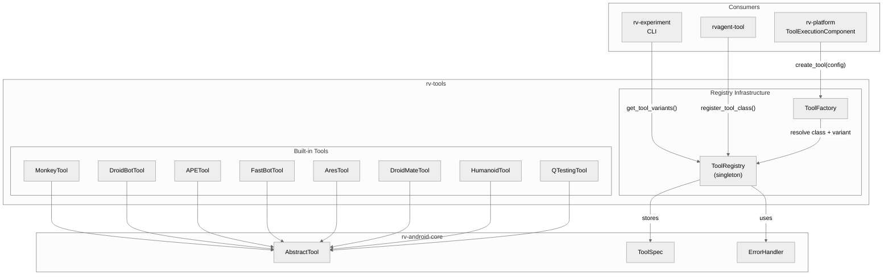
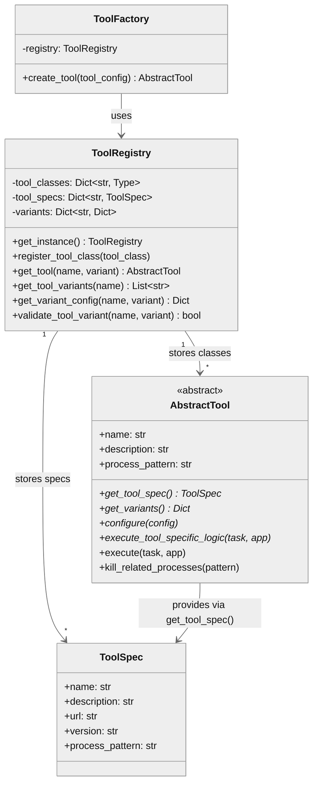
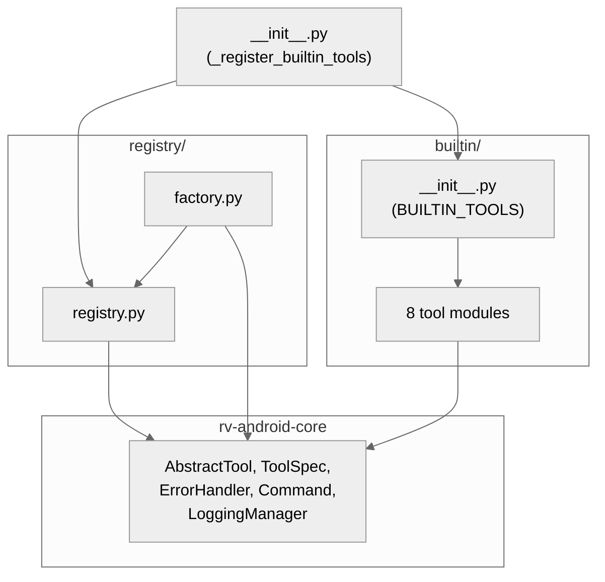
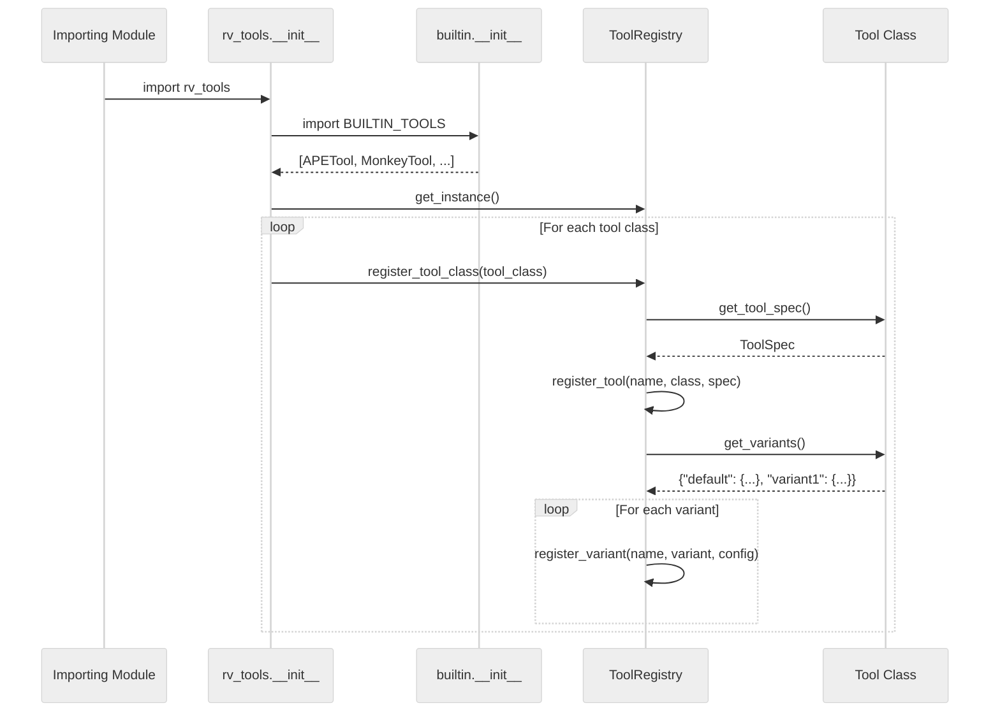
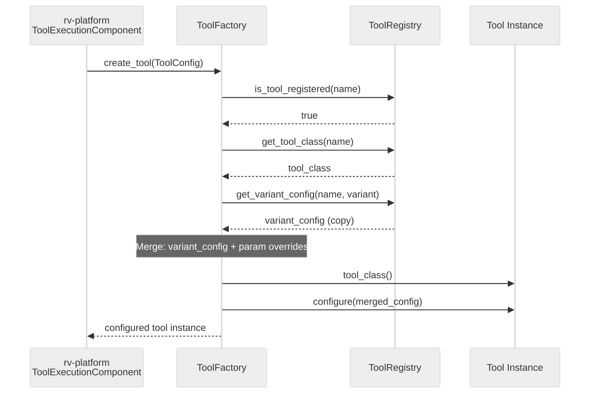
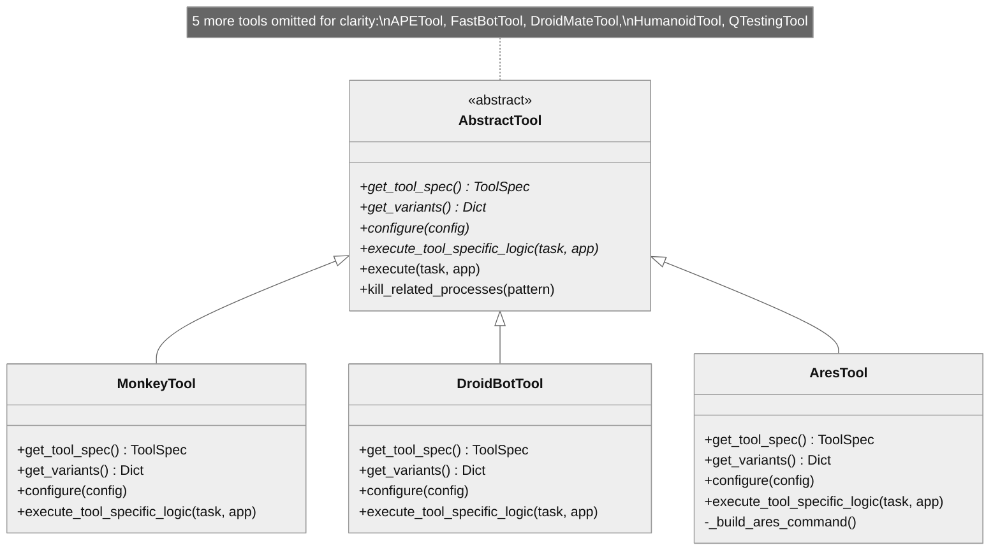
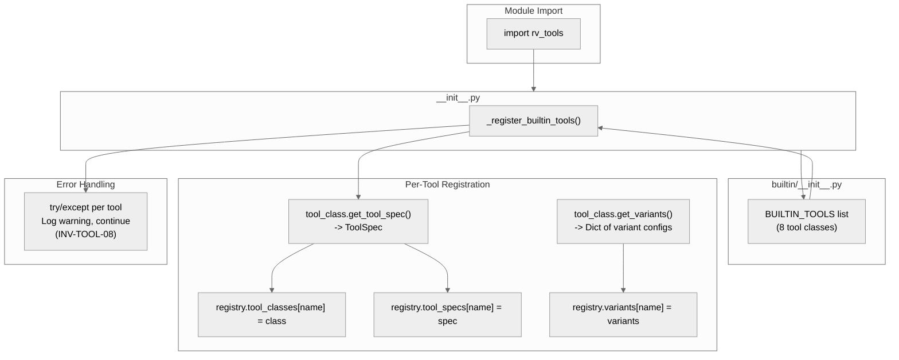

# rv-tools Architecture

## Overview

rv-tools is the tool plugin system for the RV-Android framework. It provides a centralized registry, factory, and variant management system that enable diverse Android testing tools to be discovered, configured, and instantiated through a uniform interface. The module ships 8 built-in tool implementations covering random, model-based, and AI-guided exploration strategies, and supports external tool registration (e.g., rv-agent via rvagent-tool). rv-tools depends only on rv-android-core and is consumed by rv-platform (task execution), rv-experiment (experiment orchestration), and external tool modules.

## Specification Alignment

This module implements requirements from `openspec/specs/tools/spec.md`.

### Functional Requirements

| FR | Description | Architectural Support |
|----|-------------|----------------------|
| FR18 | Tool Registration and Factory System | `ToolRegistry` singleton stores tool classes, specs, and variants; `ToolFactory.create_tool()` resolves variant configuration and returns configured instances |
| FR19 | External Tool Support (8 built-in + external) | 8 tool classes in `builtin/` extending `AbstractTool` with Template Method pattern; external tools register via `register_tool_class()` |
| FR20 | Per-Tool Variant System | Each tool defines variants via `get_variants()`; registry stores variant configs; factory resolves and merges with user parameters |

### Key Invariants

| Invariant | Description | Enforcement Mechanism |
|-----------|-------------|----------------------|
| INV-TOOL-01 | ToolRegistry singleton returns same instance | Class-level `_instance` with `get_instance()` factory method |
| INV-TOOL-02 | Every registered tool has a "default" variant | `get_variants()` contract on all tool classes |
| INV-TOOL-03 | Tool names are unique; re-registration replaces and logs warning | `register_tool()` checks `tool_classes` dict and logs warning on collision |
| INV-TOOL-04 | ToolSpec fields validated by Pydantic | `@validated_model` decorator on ToolSpec (in rv-android-core) |
| INV-TOOL-05 | Factory calls `configure()` before returning | `ToolFactory.create_tool()` calls `tool_instance.configure(final_config)` as last step |
| INV-TOOL-06 | `execute()` converts `RVCommandTimeoutError` to `RVToolTimeoutError` | Template Method in `AbstractTool.execute()` wraps `execute_tool_specific_logic()` |
| INV-TOOL-07 | `execute()` calls `kill_related_processes()` after execution | Template Method in `AbstractTool.execute()` calls cleanup after tool logic |
| INV-TOOL-08 | Built-in registration failures do not block module import | `_register_builtin_tools()` catches exceptions per tool and logs warnings |
| INV-TOOL-13 | `get_variant_config()` returns a copy | `variants[tool_name][variant_name].copy()` in registry |
| INV-TOOL-15 | Docker-based tools use correct network flag inside/outside Docker | `_build_ares_command()` and `_build_qtesting_command()` check for `/.dockerenv` |

### Specification Scenarios

Scenarios from `openspec/specs/tools/spec.md` that validate this architecture:

- **Factory creates configured tool from ToolConfig**: Exercises `ToolFactory.create_tool()` -> registry lookup -> variant resolution -> parameter merge -> `configure()` call. Traces through `ToolFactory`, `ToolRegistry`, and the target tool class.
- **Factory rejects invalid tool or variant**: Validates error paths in `ToolFactory.create_tool()` that raise `ConfigurationError` when the tool or variant is not found in the registry.
- **Tool timeout handled as expected behavior**: Validates the Template Method in `AbstractTool.execute()` converting `RVCommandTimeoutError` to `RVToolTimeoutError` at INFO level.
- **DroidBot policy validation**: Validates `DroidBotTool.configure()` rejecting invalid policy strings with `ConfigurationError`.
- **ARES/QTesting Docker network flag**: Validates INV-TOOL-15 -- `--network container:$(hostname)` inside Docker, `--network host` outside.

## Key Architectural Decisions

| Decision | Choice | Rationale |
|----------|--------|-----------|
| Application Type | Library (imported by rv-platform, rv-experiment) | Tools are created and executed by the platform; no standalone CLI needed |
| Structuring | Two-package modular (`registry/` + `builtin/`) | Separates plugin infrastructure from tool implementations |
| Primary Pattern | Registry + Factory | Decouples tool discovery from instantiation; enables the tool specification DSL (`tool:variant@param=value`) |
| Control Strategy | Call-based (import-time auto-registration) | Module import triggers `_register_builtin_tools()` -- tools are available immediately after `import rv_tools` |
| Singleton vs. DI | Singleton with `reset_instance()` for tests | Single source of truth across all consumers; `reset_instance()` enables test isolation |
| Tool Abstraction | `AbstractTool` base class in rv-android-core | Base class lives in core to avoid circular dependencies; tools extend it |
| External Registration | Deferred, idempotent, at consumer import | External tools (rvagent) register when their own modules are imported, respecting dependency hierarchy |

### Why Singleton for ToolRegistry?

The registry must be the single source of truth for available tools across all consumers: rv-platform (task execution), rv-experiment (experiment validation and tool listing), and the CLI (help output). Without a singleton, each consumer would need a reference passed through the call chain, adding parameter overhead at every level. The tradeoff is global mutable state, which requires `reset_instance()` for test isolation -- but since the registry is populated at import time and read-only during execution, the mutability concern is limited to test teardown.

### Why Auto-Registration at Import Time?

Tools are registered when `rv_tools` is first imported, not lazily on demand. This ensures the registry is fully populated before any consumer code runs. rv-experiment's CLI, for example, validates tool names at argument-parsing time -- if tools were registered lazily, validation would fail because the registry would be empty. Auto-registration also means consumers do not need to call an explicit `initialize()` method, reducing boilerplate and the risk of forgetting initialization.

### Why Two-Step Creation (Constructor + Configure)?

The `ToolFactory` calls `tool_class()` (no arguments) followed by `tool.configure(merged_config)`. This separates instance creation from configuration application because: (1) the constructor sets sane defaults and initializes logging, which is useful even without configuration (e.g., for introspection), (2) the factory needs the instance to exist before applying configuration that may depend on tool-specific validation logic, and (3) it matches the AbstractTool contract where `configure()` is an explicit lifecycle phase that tools can override with validation logic (e.g., DroidBot validates policy strings, APE-RV validates strategy names).

### Why Defensive Copy in get_variant_config?

`get_variant_config()` returns `variants[tool_name][variant_name].copy()` rather than the stored dictionary reference (INV-TOOL-13). This prevents consumers (particularly `ToolFactory.create_tool()`, which merges user parameters into the config) from accidentally mutating the registry's internal state. Without the copy, creating a tool with parameter overrides would permanently modify the variant's default configuration for all subsequent calls.

## Architectural Patterns

### Pattern: Singleton Registry

**Description**: `ToolRegistry` uses a class-level `_instance` attribute with a `get_instance()` factory method to ensure all consumers share the same tool storage. Three parallel dictionaries (`tool_classes`, `tool_specs`, `variants`) store the complete state.

**When Used**: The registry must be the single source of truth for available tools across rv-platform (task execution), rv-experiment (experiment validation), and CLI (tool listing).

**Advantages**:
- All modules see the same set of registered tools without passing references
- Auto-registration at import time populates the registry before any consumer code runs

**Disadvantages**:
- Global mutable state requires `reset_instance()` for test isolation
- Import order matters: rv-platform must be imported before rvagent-tool is available

### Pattern: Factory Method with Variant Resolution

**Description**: `ToolFactory.create_tool(tool_config)` encapsulates the four-step creation workflow: (1) resolve tool class from registry, (2) fetch variant configuration, (3) merge with user parameter overrides, (4) instantiate and call `configure()`.

**When Used**: Every tool instantiation in rv-platform's `ToolExecutionComponent` goes through the factory.

**Advantages**:
- Consistent creation workflow across all tools (built-in and external)
- Variant system enables the DSL `droidbot:dfs_greedy@count=5000` without tool-specific code
- Configuration merging (variant defaults + parameter overrides) happens in one place

**Disadvantages**:
- Two-step creation (constructor + configure) adds a mild protocol overhead

### Pattern: Template Method

**Description**: `AbstractTool.execute()` (defined in rv-android-core) provides a fixed execution workflow: call `execute_tool_specific_logic()`, handle timeout conversion (INV-TOOL-06), call `kill_related_processes()` (INV-TOOL-07). Each tool overrides only `execute_tool_specific_logic()`.

**When Used**: All tools share the same lifecycle (registration, configuration, execution, cleanup) but differ in their specific logic.

**Advantages**:
- Timeout handling and cleanup are guaranteed regardless of tool implementation
- New tools only implement tool-specific logic

**Disadvantages**:
- Rigid execution sequence; tools that need custom cleanup order must work within the template

---

## Logical View

### Domain Entities

| Entity | Responsibility |
|--------|----------------|
| `ToolRegistry` | Singleton storing tool classes, specs, and variants. Provides discovery and retrieval. |
| `ToolFactory` | Creates configured tool instances from `ToolConfig` by resolving variants from the registry. |
| `AbstractTool` | Base class defining the tool contract: spec, variants, configure, execute (from rv-android-core). |
| `ToolSpec` | Tool metadata: name, description, URL, version, process pattern (from rv-android-core). |
| `ToolConfig` | User-facing configuration: tool name, variant name, parameter overrides (from rv-android-core). |
| Built-in Tools | 8 concrete `AbstractTool` subclasses (Monkey, DroidBot, APE, FastBot, ARES, DroidMate, Humanoid, QTesting). |

### Component Architecture



### Entity Relationships



---

## Development View

### Module Structure

```
rv-tools/
├── src/rv_tools/
│   ├── __init__.py              # Module entry, auto-registers built-in tools
│   ├── registry/
│   │   ├── __init__.py          # Exports ToolRegistry, ToolFactory
│   │   ├── registry.py          # ToolRegistry singleton (~481 SLOC)
│   │   └── factory.py           # ToolFactory with variant resolution (~137 SLOC)
│   └── builtin/
│       ├── __init__.py          # BUILTIN_TOOLS list, imports all 8 tools
│       ├── ape/tool.py          # APE: CEGAR-based exploration
│       ├── ares/tool.py         # ARES: Docker-based systematic
│       ├── droidbot/tool.py     # DroidBot: policy-based exploration (6 policies)
│       ├── droidmate/tool.py    # DroidMate: JAR-based research
│       ├── fastbot/tool.py      # FastBot: reinforcement learning
│       ├── humanoid/tool.py     # Humanoid: DroidBot + inference server
│       ├── monkey/tool.py       # Monkey: random events
│       └── qtesting/
│           ├── tool.py          # QTesting tool wrapper
│           └── src/             # Bundled third-party QTesting source (~2000 SLOC)
├── tests/
│   ├── conftest.py              # Test fixtures and registry setup
│   ├── helpers.py               # Test helper utilities
│   ├── test_basic.py            # Registry singleton behavior
│   ├── test_builtin_registration.py  # Auto-registration of 8 built-in tools
│   ├── test_factory.py          # Factory creation and variant resolution
│   └── test_registry.py         # Registry operations (register, query, validate)
└── pyproject.toml
```

### Package Dependencies



---

## Process View

rv-tools is a synchronous library with no concurrency concerns. All operations (registration, creation, configuration) happen on the caller's thread. The process view is captured by the two sequence diagrams below.

### Tool Registration (Import Time)



### Tool Creation (Runtime)



---

## Core Components

### ToolRegistry

**Purpose**: Central repository for tool classes, specifications, and variant configurations. Provides discovery, validation, and retrieval operations for all registered tools.

**Location**: `src/rv_tools/registry/registry.py`

**Key Methods**:
- `get_instance()` / `reset_instance()`: Singleton lifecycle
- `register_tool_class(tool_class)`: Two-phase registration (class + variants)
- `register_variant(tool_name, variant_name, config)`: Stores defensive copy of config
- `get_tool_class(tool_name)`: Returns the tool class for a given name
- `get_variant_config(tool_name, variant_name)`: Returns a defensive copy of variant config (INV-TOOL-13)
- `validate_tool_variant(tool_name, variant_name)`: Boolean validation for CLI/experiment use
- `get_registry_info()`: Returns statistics (total tools, total variants, per-tool variant list)

**Storage**:
- `tool_classes: Dict[str, Type[AbstractTool]]` -- tool name to class mapping
- `tool_specs: Dict[str, ToolSpec]` -- tool name to specification mapping
- `variants: Dict[str, Dict[str, Dict[str, Any]]]` -- tool name to variant name to config mapping

**Dependencies**:
- Internal: None (root component within rv-tools)
- External: rv-android-core (AbstractTool, ToolSpec, ErrorHandler, LoggingManager, exceptions)

### ToolFactory

**Purpose**: Creates configured tool instances from `ToolConfig` specifications. Encapsulates the variant resolution and configuration merging workflow.

**Location**: `src/rv_tools/registry/factory.py`

**Key Methods**:
- `create_tool(tool_config)`: Four-step creation -- resolve class, get variant config, merge params, instantiate and configure

**Dependencies**:
- Internal: ToolRegistry
- External: rv-android-core (AbstractTool, ErrorHandler, ConfigurationError, LoggingManager)

### Built-in Tools

**Purpose**: 8 concrete `AbstractTool` implementations wrapping third-party Android testing tools.

**Location**: `src/rv_tools/builtin/*/tool.py`

Each tool follows the same implementation contract:
1. Declares `TOOL_SPEC` as a class-level `ToolSpec` via `ToolSpec.create_builtin_spec()`
2. Implements `get_tool_spec()` returning `TOOL_SPEC`
3. Implements `get_variants()` returning a dict with named configurations (must include `"default"`)
4. Implements `configure(config)` to validate and apply configuration parameters
5. Implements `execute_tool_specific_logic(task, app)` to build and run tool-specific commands

**Invocation Mechanisms**:

| Tool | Mechanism | Process Pattern | Key Variants |
|------|-----------|-----------------|--------------|
| Monkey | `adb shell monkey` | `com.android.commands.monkey` | default, fast, stress |
| DroidBot | `uv run droidbot` | `droidbot` | dfs_greedy, bfs_greedy, dfs_naive, bfs_naive, random |
| APE | ADB command | `ape` | default, sata, bfs, dfs, random |
| FastBot | ADB command | `fastbot` | conservative, aggressive, balanced |
| ARES | `docker run` (sibling container) | `ares` | default, debug, fast |
| DroidMate | JAR execution | `droidmate` | default, systematic, quick, research |
| Humanoid | DroidBot + inference server | `humanoid` | default, visual, nlp, hybrid |
| QTesting | `docker run` (sibling container) | `qtesting` | default, qlearning, dqn, ddqn |

ARES and QTesting are Docker-based tools that spawn sibling containers. Inside a Docker container (`/.dockerenv` exists), the sibling uses `--network container:$(hostname)` to share the parent's network namespace (INV-TOOL-15). Outside Docker, `--network host` is used.

**Dependencies**:
- Internal: None (tools do not depend on each other)
- External: rv-android-core (AbstractTool, ToolSpec, Command, ErrorHandler, exceptions)

---

## NFR Support

How the architecture supports non-functional requirements from `docs/PRD.md` Section 7.

| NFR | PRD ID | Priority | Architectural Support |
|-----|--------|----------|----------------------|
| Modularity | NFR01 | P0 | Standalone uv workspace module with single dependency (rv-android-core); installed in editable mode via `uv sync` |
| Extensibility | NFR02 | P0 | Registry + Factory pattern enables adding tools without modifying existing code; external tools register at import time via `register_tool_class()` |
| Testability | NFR03 | P1 | `reset_instance()` enables test isolation; stateless `ToolFactory` is straightforward to test; each tool is independently testable |
| Resilience | NFR04 | P1 | Auto-registration catches and logs failures per tool (INV-TOOL-08); Template Method ensures cleanup runs after tool errors; circuit breaker prevents repeated failing commands |
| Configurability | NFR05 | P1 | Variant system provides named presets; parameter overrides enable fine-grained control; tool specification DSL (`tool:variant@param=value`) for CLI |

---

## Key Interfaces

### AbstractTool (from rv-android-core)

```python
class AbstractTool(ABC):
    """Base class for all testing tools. Defines the execution contract."""

    def __init__(self, name: str, description: str, process_pattern: str): ...

    @classmethod
    @abstractmethod
    def get_tool_spec(cls) -> ToolSpec: ...

    @classmethod
    @abstractmethod
    def get_variants(cls) -> Dict[str, Dict[str, Any]]: ...

    @abstractmethod
    def configure(self, config: Dict[str, Any]) -> None: ...

    @abstractmethod
    def execute_tool_specific_logic(self, task: Task, app: App) -> None: ...

    def execute(self, task: Task, app: App) -> None:
        """Template Method: execute_tool_specific_logic -> timeout handling -> cleanup."""
        ...
```

### ToolSpec (from rv-android-core)

```python
class ToolSpec(BaseValidatedModel):
    """Tool metadata for registry and discovery."""

    name: str
    description: str
    url: str
    version: str
    process_pattern: Optional[str]

    @classmethod
    def create_builtin_spec(cls, name, description, url, version, process_pattern) -> ToolSpec: ...
```



---

## Data Flow

This section describes how data flows through the rv-tools module during tool registration and creation.

### Registration Data Flow

At import time, tool classes flow through auto-registration to populate the registry:



### Tool Creation Data Flow

When rv-platform creates a tool, data flows through the factory's four-step workflow:

```mermaid
%%{init: {'theme': 'neutral'}}%%
flowchart LR
    subgraph Input["Input"]
        ToolConfigInput["ToolConfig\nname: droidbot\nvariant: dfs_greedy\nparams: {count: 5000}"]
    end

    subgraph Step1["Step 1: Resolve"]
        CheckReg["is_tool_registered(name)?"]
        GetClass["get_tool_class(name)\n-> DroidBotTool"]
    end

    subgraph Step2["Step 2: Variant"]
        GetVariant["get_variant_config(\nname, variant)\n-> {policy: dfs_greedy,\ncount: 10B, interval: 3}"]
        DefCopy["Returns defensive\ncopy (INV-TOOL-13)"]
    end

    subgraph Step3["Step 3: Merge"]
        MergeConfig["{**variant_config,\n**tool_config.params}\n-> {policy: dfs_greedy,\ncount: 5000, interval: 3}"]
    end

    subgraph Step4["Step 4: Create"]
        Instantiate["DroidBotTool()"]
        ConfigureCall["tool.configure(\nmerged_config)\n(INV-TOOL-05)"]
    end

    subgraph Output["Output"]
        ConfiguredTool["Configured\nDroidBotTool instance"]
    end

    ToolConfigInput --> CheckReg
    CheckReg --> GetClass
    GetClass --> GetVariant
    GetVariant --> DefCopy
    DefCopy --> MergeConfig
    ToolConfigInput --> MergeConfig
    MergeConfig --> Instantiate
    Instantiate --> ConfigureCall
    ConfigureCall --> ConfiguredTool
```



### Tool Execution Data Flow

After creation, the configured tool instance flows through rv-platform's execution pipeline:

1. `ToolExecutionComponent` receives the configured tool from `ToolFactory`
2. `tool.execute(task, app)` invokes the Template Method in `AbstractTool`
3. Template Method calls `execute_tool_specific_logic(task, app)` (tool-specific logic)
4. If `RVCommandTimeoutError` is raised, Template Method converts it to `RVToolTimeoutError` (INV-TOOL-06)
5. Template Method calls `kill_related_processes(process_pattern)` to clean up device processes (INV-TOOL-07)
6. rv-platform's `LogcatComponent` independently captures coverage events during execution

The tool does not return coverage data directly. Coverage is collected by a separate logcat monitor thread that runs in parallel with tool execution.

### External Tool Registration Data Flow

External tools (rvagent-tool, aperv-tool) register at rv-platform import time via `_register_external_tools()`:

1. rv-platform's `__init__.py` calls `_register_external_tools()`
2. For each external tool, it checks `registry.is_tool_registered(name)` for idempotency (INV-TOOL-12)
3. If not registered, it imports the tool class and calls `registry.register_tool_class(tool_class)`
4. Registration follows the same flow as built-in tools: `get_tool_spec()` and `get_variants()` populate the registry

This deferred registration ensures external tool modules are only imported when rv-platform is used, not when rv-tools is imported standalone (e.g., for introspection or testing).

---

## Scenarios

### Scenario 1: Experiment Creates and Executes a Tool

**Description**: rv-experiment orchestrates a task that creates a DroidBot tool with the `dfs_greedy` variant, overriding the `count` parameter, and rv-platform executes it.

**Flow**:
1. rv-experiment CLI parses `"droidbot:dfs_greedy@count=5000"` into a `ToolConfig(name="droidbot", variant="dfs_greedy", parameters={"count": 5000})`
2. rv-platform's `ToolExecutionComponent` calls `ToolFactory.create_tool(tool_config)`
3. Factory resolves `DroidBotTool` class and `dfs_greedy` variant config from registry
4. Factory merges variant defaults (`policy="dfs_greedy"`, `count=10000000000`, `interval=3`, `ignore_ad=True`) with user override (`count=5000`)
5. Factory calls `DroidBotTool()` then `configure({"policy": "dfs_greedy", "count": 5000, "interval": 3, "ignore_ad": True})`
6. `ToolExecutionComponent` calls `tool.execute(task, app)`, which invokes `execute_tool_specific_logic()` (builds and runs `uv run droidbot` command), converts any timeout to `RVToolTimeoutError`, and calls `kill_related_processes("droidbot")`

### Scenario 2: Registering an External Tool

**Description**: rv-platform imports rvagent-tool, which registers the `rvagent` tool in the shared registry.

**Flow**:
1. `import rv_platform` triggers `_register_external_tools()` in rv-platform's `__init__.py`
2. Function checks `registry.is_tool_registered("rvagent")` -- returns `False` (idempotency guard, INV-TOOL-12)
3. Imports `RVAgentTool` from `rvagent_tool` module
4. Calls `registry.register_tool_class(RVAgentTool)`, which registers class, spec, and 5 variants (default, multimode, pure_algorithm, llm_only, thorough)
5. Subsequent calls to `ToolFactory.create_tool(ToolConfig(name="rvagent", variant="pure_algorithm"))` succeed

### Scenario 3: Built-in Tool Registration on Import

**Description**: When any module imports `rv_tools`, all 8 built-in tools are automatically registered.

**Flow**:
1. `import rv_tools` triggers `_register_builtin_tools()`
2. `BUILTIN_TOOLS` list is loaded from `builtin/__init__.py` (8 tool classes)
3. `ToolRegistry.get_instance()` returns or creates the singleton
4. For each tool class, `register_tool_class()` calls `get_tool_spec()` and `get_variants()`
5. Tool class, spec, and all variants are stored in the registry dictionaries
6. If any single tool fails to register, a warning is logged but other tools continue (INV-TOOL-08)

---

## Extension Points

- **New built-in tool**: Add a new package under `builtin/` with a `tool.py` implementing `AbstractTool`, then add the class to `BUILTIN_TOOLS` in `builtin/__init__.py`
- **External tool registration**: Import the tool module and call `ToolRegistry.get_instance().register_tool_class(MyToolClass)` -- typically done in the consuming module's `__init__.py` with an idempotency check via `is_tool_registered()`
- **New variant**: Add entries to the tool's `get_variants()` return dictionary -- no registry or factory changes needed
- **Configuration override**: Use the `parameters` field in `ToolConfig` to override any variant default at runtime

## Dependencies

### Internal (rv-android modules)

| Module | Purpose |
|--------|---------|
| rv-android-core | Base abstractions (`AbstractTool`, `ToolSpec`, `ToolConfig`), error handling (`ErrorHandler`, exception classes), logging (`LoggingManager`), command execution (`Command`, `CommandResult`) |

### External

| Package | Version | Purpose |
|---------|---------|---------|
| pydantic | >=2.9.0 | Configuration validation for tool specs and configs |

## Testing Strategy

| Type | Location | Purpose |
|------|----------|---------|
| Unit | tests/test_basic.py | Registry singleton initialization and behavior |
| Unit | tests/test_registry.py | Registry operations (register, query, validate, clear) |
| Unit | tests/test_factory.py | Factory creation and variant resolution |
| Unit | tests/test_builtin_registration.py | Auto-registration of 8 built-in tools |

Third-party code in `builtin/qtesting/src/` is excluded from test coverage via `pyproject.toml` configuration.

## Related Documentation

- [Domain Spec](../../openspec/specs/tools/spec.md) - Requirements, invariants, and scenarios for the tools domain (FR18-FR20, INV-TOOL-01 through INV-TOOL-15)
- [PRD](../../docs/PRD.md) - Product Requirements Document (FR01-37, NFR01-08)
- [CLAUDE.md](../../CLAUDE.md) - Project-level reference for Claude Code
- [Module CLAUDE.md](../CLAUDE.md) - rv-tools module development reference
