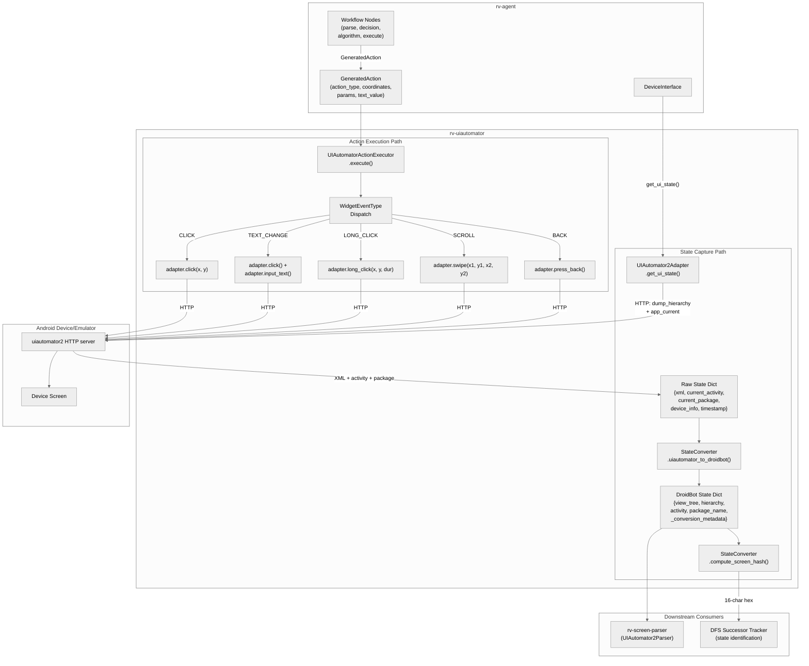
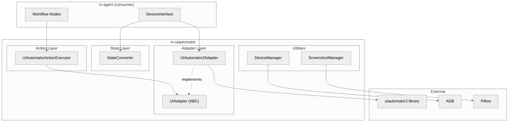
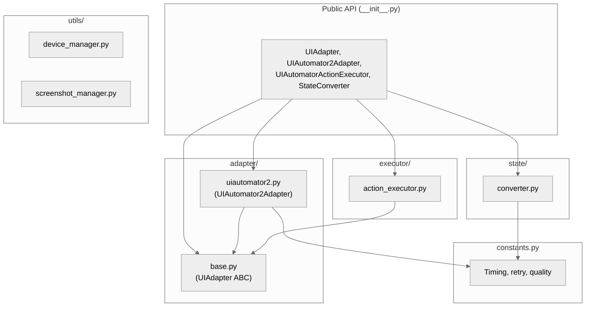
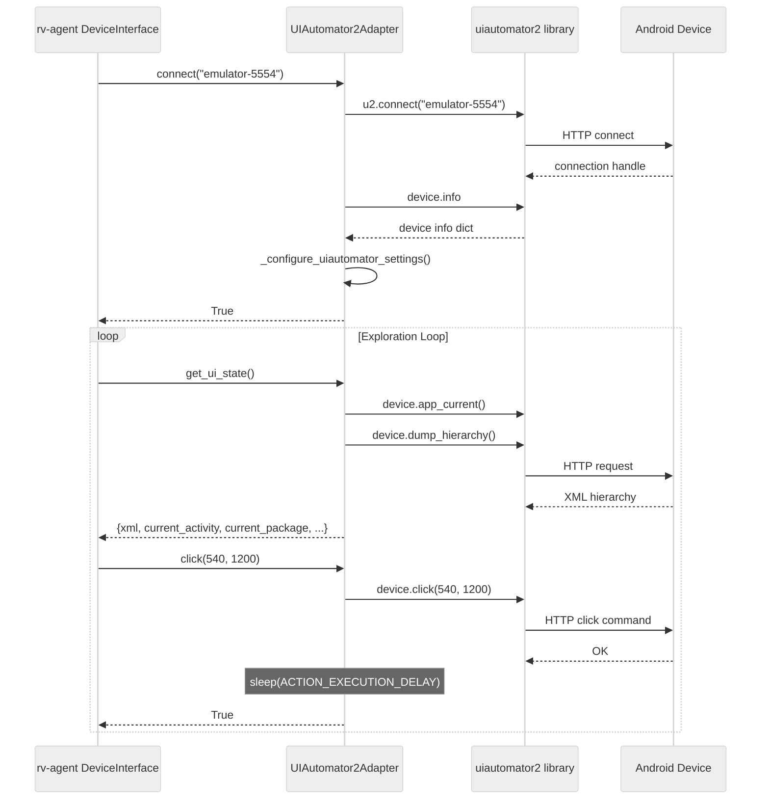
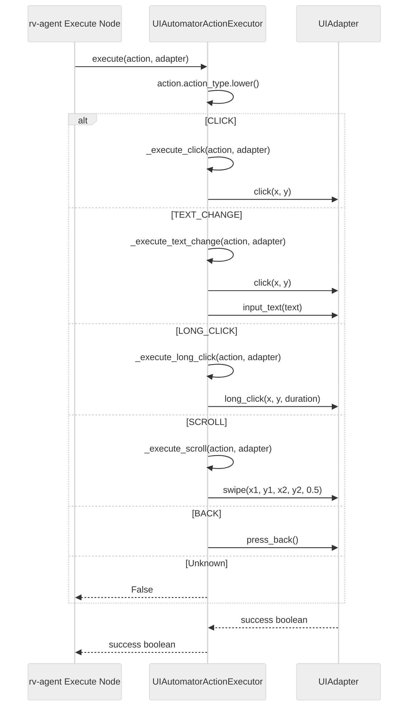
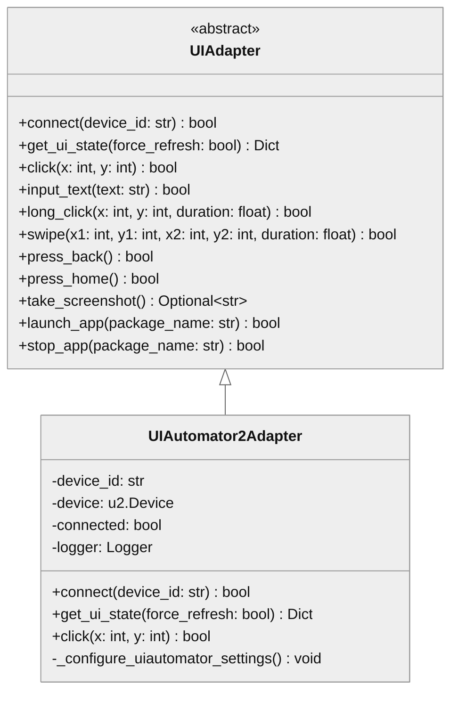

# rv-uiautomator Architecture

## Overview

rv-uiautomator provides the device interaction abstraction layer for RV-Android. It defines a framework-agnostic interface (`UIAdapter`) for Android device operations and provides a concrete implementation using the uiautomator2 Python library. The module also includes action dispatching (translating LLM/algorithm-generated actions into device commands), state format conversion (bridging UIAutomator and DroidBot representations), device discovery via ADB, and screenshot lifecycle management. It is consumed primarily by rv-agent for LLM-driven exploration.

## Specification Alignment

This module implements requirements from `openspec/specs/tools/spec.md`.

### Functional Requirements

| FR | Description | Architectural Support |
|----|-------------|----------------------|
| FR18 | Tool Registration and Factory System | rv-uiautomator is not itself a registered tool, but provides the device interaction layer that tools (especially rv-agent via rvagent-tool) use for execution |
| FR20 | Per-Tool Variant System | Not directly implemented; rv-uiautomator operates below the tool/variant abstraction as shared infrastructure |

The module primarily supports the "Device Interaction Abstraction (UIAdapter and UIAutomator2)" requirement from the spec, which is an unnumbered cross-cutting requirement consumed by FR18 and FR19 tool implementations.

### Key Invariants

| Invariant | Description | Enforcement Mechanism |
|-----------|-------------|----------------------|
| INV-TOOL-09 | UIAutomator2Adapter MUST check `self.connected` and `self.device is not None` before every device operation | Guard clause at the top of every public method in `UIAutomator2Adapter`; returns `False` (actions) or `{}` (state capture) when disconnected |
| INV-TOOL-10 | UIAutomatorActionExecutor.execute() MUST dispatch on WidgetEventType; unknown types MUST return False | Dispatch chain in `execute()` with explicit fallthrough to `return False` for unrecognized action types |
| INV-TOOL-11 | StateConverter.uiautomator_to_droidbot() MUST map `xml` to both `view_tree` and `hierarchy`, `current_activity` to `activity`, `current_package` to `package_name`, and include `_conversion_metadata` | Explicit key mapping in `uiautomator_to_droidbot()` with metadata dict appended to result |
| INV-TOOL-14 | UIAutomator2Adapter.connect() MUST call `_configure_uiautomator_settings()` after successful connection | Called inside `connect()` after `self.connected = True`, before returning |

### Specification Scenarios

Scenarios from `openspec/specs/tools/spec.md` that validate this architecture:

- **Connecting to an Android emulator**: Validates UIAutomator2Adapter.connect() flow -- traces through `u2.connect()`, `device.info` check, `_configure_uiautomator_settings()`, and the `connected` flag
- **Capturing UI state from device**: Validates `get_ui_state()` return structure (device_info, current_package, current_activity, xml, timestamp) and the guard clause for disconnected adapters
- **Executing a click action via UIAutomatorActionExecutor**: Validates the dispatch path from `execute()` through `_execute_click()` to `adapter.click()`
- **State format conversion**: Validates `uiautomator_to_droidbot()` field mapping and `_conversion_metadata` presence
- **Screen hash computation**: Validates `compute_screen_hash()` produces a 16-character hex string from hierarchy or fallback to `{package}/{activity}`
- **Device discovery via DeviceManager**: Validates `get_available_devices()` ADB parsing and status filtering

## Key Architectural Decisions

### ADR-1: Abstract UIAdapter Interface with Single Implementation

`UIAdapter` is an ABC defining 11 methods for device interaction. Only `UIAutomator2Adapter` implements it.

**Why**: The abstraction was introduced to decouple rv-agent's device interaction code from the specific automation framework. Although only one implementation exists, the interface provides two concrete benefits: (1) test code can use mock adapters without requiring a physical device or emulator, enabling unit tests for all of rv-agent's workflow nodes, and (2) if a future requirement demands Appium or direct ADB support, a new adapter can be added without modifying any consumer. The cost is minimal -- one ABC file with 11 abstract method signatures.

### ADR-2: Guard Clause Pattern for Connection Safety

Every public method in `UIAutomator2Adapter` begins with a guard clause checking `self.connected` and `self.device is not None`. Disconnected operations return safe defaults (`False` for actions, `{}` for state capture) without raising exceptions (INV-TOOL-09).

**Why**: Android device connections are inherently unreliable. The emulator may crash, ADB may lose its connection, or the uiautomator2 server may become unresponsive. Without guard clauses, every caller would need try/except blocks around every device operation. The guard clause pattern centralizes this check and ensures a consistent failure mode: operations silently fail with logged warnings rather than propagating exceptions up the call stack. This is critical for rv-agent's exploration loop, which must continue (e.g., retry, fall back to algorithm) rather than crash on transient device failures.

### ADR-3: Mediator Pattern for Action Dispatching

`UIAutomatorActionExecutor` sits between `GeneratedAction` objects (from rv-agent) and `UIAdapter` method calls, dispatching on `WidgetEventType` (INV-TOOL-10).

**Why**: Without the executor, every rv-agent workflow node that needs to execute an action would contain adapter-specific dispatch logic (if click then adapter.click, if scroll then compute swipe coordinates, etc.). Centralizing this in a single class ensures consistent coordinate extraction, duration handling, and error recovery across all action types. The executor also handles the scroll-to-swipe translation (converting a directional scroll into swipe start/end coordinates with configurable distance), which is non-trivial and should not be duplicated.

### ADR-4: State Format Conversion as Temporary Adapter

`StateConverter.uiautomator_to_droidbot()` translates UIAutomator state dictionaries to DroidBot-compatible format (INV-TOOL-11). This is documented as a temporary solution.

**Why**: rv-agent reuses DroidBot's state parsing infrastructure (`DroidBotParser` from rv-screen-parser), which expects specific key names (`view_tree`, `activity`, `package_name`). UIAutomator captures state with different keys (`xml`, `current_activity`, `current_package`). The converter bridges this gap without modifying either the UIAutomator adapter (which uses standard naming) or the DroidBot parser (which is used by DroidBot tool integration too). A typed `DeviceState` model would be the proper solution, but the dictionary-based approach works and the conversion is a single method with explicit key mapping.

### ADR-5: Tuned Constants for Headless Emulator Execution

All timing constants are centralized in `constants.py` with values tuned for headless emulator mode: `ACTION_EXECUTION_DELAY=0.3s`, `TEXT_INPUT_DELAY=0.2s`, `DEFAULT_SWIPE_DURATION=0.25s`, `WAIT_FOR_IDLE_TIMEOUT=5.0s`.

**Why**: The system runs experiments on headless Android emulators where animations are disabled and rendering is faster than on physical devices. The default uiautomator2 timeouts (designed for physical devices with animations) are too conservative, adding unnecessary delay to each of the 200-500 actions in a typical experiment. The tuned constants reduce per-action overhead by 0.5-1.0s while remaining reliable on headless emulators. Centralizing them in `constants.py` makes it easy to adjust for different emulator configurations.

### ADR-6: Screen Hash for DFS State Identification

`StateConverter.compute_screen_hash()` produces a 16-character hex string by SHA-256 hashing the first 500 characters of the UI hierarchy XML, or falling back to `{package}/{activity}` when no hierarchy is available.

**Why**: rv-agent's DFS exploration strategy needs to identify previously visited screens. Full XML comparison is too expensive (5-50KB per screen, hundreds of comparisons per exploration). The first 500 characters of the hierarchy capture the top-level structure (root layout, first few children) which is sufficient to distinguish most screens. The SHA-256 hash reduces this to a constant-size 16-character identifier for O(1) dictionary lookups. The activity-based fallback handles screens where the hierarchy dump fails (rare but possible on custom views).

| Decision | Choice | Rationale |
|----------|--------|-----------|
| Application Type | Library (no CLI entry point) | Consumed programmatically by rv-agent; no standalone use case |
| Structuring | Package-by-layer (adapter, executor, state, utils) | Separates device communication, action translation, format conversion, and utilities into cohesive packages |
| Primary Pattern | Abstract Factory (UIAdapter) | Enables future alternative UI automation backends without changing consumers |
| Secondary Pattern | Adapter (StateConverter) | Bridges incompatible state dict formats between UIAutomator and DroidBot |
| Control Strategy | Synchronous call-based | All operations are blocking request-response; concurrency is managed by the caller (rv-agent) |
| Error Strategy | Guard + Decorator | Guard clauses check connection state; `@ErrorHandler.handle_errors` wraps all public methods for consistent error logging and default returns |

## Data Flow

The module mediates between rv-agent's high-level action decisions and the physical Android device, with data flowing in two directions: state capture (device to agent) and action execution (agent to device).

### Bidirectional Data Flow



### State Capture Path

1. **Device query**: rv-agent's `DeviceInterface` calls `UIAutomator2Adapter.get_ui_state()`. The adapter makes two HTTP calls to the uiautomator2 server: `device.app_current()` (returns current package and activity) and `device.dump_hierarchy()` (returns XML UI tree).

2. **Raw state assembly**: The adapter assembles a dictionary with keys `xml`, `current_activity`, `current_package`, `device_info`, and `timestamp`. The guard clause (INV-TOOL-09) returns `{}` if the adapter is disconnected.

3. **Format conversion**: `StateConverter.uiautomator_to_droidbot()` maps keys to DroidBot-compatible names: `xml` to both `view_tree` and `hierarchy`, `current_activity` to `activity`, `current_package` to `package_name`. Additional keys from the raw state are preserved. Conversion metadata is attached (INV-TOOL-11).

4. **Screen hashing**: `StateConverter.compute_screen_hash()` takes the first 500 characters of the hierarchy XML, computes SHA-256, and truncates to 16 hex characters. This hash identifies the screen for DFS state tracking. If no hierarchy is available, the hash is computed from `{package}/{activity}`.

5. **Downstream parsing**: The DroidBot-format state is passed to `rv-screen-parser`'s `UIAutomator2Parser` or `DroidBotParser` for visitor-based traversal into `ScreenDescription`.

### Action Execution Path

1. **Action receipt**: rv-agent's execute node produces a `GeneratedAction` with `action_type` (WidgetEventType name), `coordinates` (pixel x,y), optional `params` (text, direction, distance, duration), and optional `text_value`.

2. **Type dispatch**: `UIAutomatorActionExecutor.execute()` lowercases the action type and dispatches to the corresponding handler method. Unknown types return `False` (INV-TOOL-10).

3. **Coordinate extraction and adapter call**: Each handler extracts coordinates and parameters from the action object and calls the appropriate `UIAdapter` method. The scroll handler translates a directional scroll into swipe start/end coordinates by adding the configured distance to the start point in the specified direction.

4. **Device execution**: The adapter delegates to the uiautomator2 library, which sends HTTP commands to the on-device uiautomator2 server. After each action, the adapter sleeps for `ACTION_EXECUTION_DELAY` (0.3s) to allow the UI to stabilize.

5. **Result propagation**: The boolean success result propagates back through the executor to the rv-agent execute node, which decides whether to retry, fall back, or proceed to the next exploration step.

## Architectural Patterns

### Pattern: Abstract Factory (UIAdapter)

**Description**: `UIAdapter` is an abstract base class defining 11 methods for Android device interaction. `UIAutomator2Adapter` is the sole concrete implementation, wrapping the `uiautomator2` Python library. Higher-level components (UIAutomatorActionExecutor, rv-agent's DeviceInterface) depend only on the abstract interface.

**When Used**: Chosen to decouple device interaction consumers from the specific automation framework. If a different backend (e.g., Appium, direct ADB) were needed, a new adapter implementation could be added without modifying consumers.

**Advantages**:
- Consumers remain framework-agnostic
- Testing can use mock adapters without device dependencies

**Disadvantages**:
- Only one implementation exists; the abstraction carries overhead without exercised alternatives

### Pattern: Adapter (StateConverter)

**Description**: `StateConverter.uiautomator_to_droidbot()` translates UIAutomator state dictionaries (keys: `xml`, `current_activity`, `current_package`) into DroidBot-compatible dictionaries (keys: `view_tree`/`hierarchy`, `activity`, `package_name`). This allows rv-agent's state enrichment pipeline to consume states from UIAutomator without modification.

**When Used**: Needed because rv-agent reuses DroidBot's state parsing infrastructure, which expects a specific key naming convention.

**Advantages**:
- Avoids modifying upstream DroidBot parsers
- Conversion metadata enables debugging format issues

**Disadvantages**:
- Dictionary-based state passing lacks type safety; a typed `DeviceState` model would be preferable

### Pattern: Mediator (UIAutomatorActionExecutor)

**Description**: `UIAutomatorActionExecutor` mediates between `GeneratedAction` objects (produced by rv-agent's LLM or algorithm nodes) and `UIAdapter` method calls. It dispatches on `WidgetEventType` to select the appropriate adapter method and extracts coordinates, text, and parameters from the action object.

**When Used**: Centralizes the action-to-device-command translation, preventing each rv-agent node from containing adapter-specific logic.

**Advantages**:
- Single point for action dispatching logic
- Supports both standard UI events and custom coordinate actions

**Disadvantages**:
- The `action` parameter is untyped (uses duck typing with `hasattr` checks), which increases cyclomatic complexity

---

## Logical View

### Domain Entities

| Entity | Responsibility |
|--------|----------------|
| UIAdapter | Abstract interface defining 11 device interaction operations (connect, state capture, touch, text, navigation, screenshot, app lifecycle) |
| UIAutomator2Adapter | Concrete adapter using uiautomator2 library for HTTP-based device communication |
| UIAutomatorActionExecutor | Translates GeneratedAction objects into UIAdapter method calls via WidgetEventType dispatch |
| StateConverter | Converts UIAutomator state dicts to DroidBot-compatible format; computes screen hashes for state identification |
| DeviceManager | ADB-based device discovery, connection verification, and property retrieval |
| ScreenshotManager | Screenshot file path generation, image optimization (PNG to JPEG), validation, and old file cleanup |

### Component Architecture



---

## Development View

### Module Structure

```
rv-uiautomator/
├── src/rv_uiautomator/
│   ├── __init__.py                # Public API: UIAdapter, UIAutomator2Adapter,
│   │                              #   UIAutomatorActionExecutor, StateConverter
│   ├── constants.py               # 18 constants: timing, retry, quality
│   ├── adapter/
│   │   ├── base.py                # UIAdapter ABC (11 abstract methods)
│   │   └── uiautomator2.py        # Concrete implementation via uiautomator2
│   ├── executor/
│   │   └── action_executor.py     # GeneratedAction -> UIAdapter dispatch
│   ├── state/
│   │   └── converter.py           # UIAutomator dict -> DroidBot dict + hashing
│   └── utils/
│       ├── device_manager.py      # ADB device discovery and verification
│       └── screenshot_manager.py  # Screenshot path gen, optimization, cleanup
├── tests/
│   └── test_adapter.py            # Unit tests
└── pyproject.toml
```

### Package Dependencies



---

## Process View

### Device Interaction Flow



### Action Execution Flow



---

## Core Components

### UIAdapter

**Purpose**: Abstract interface defining the complete set of Android device interaction operations.

**Location**: `src/rv_uiautomator/adapter/base.py`

**Key Classes**:
- `UIAdapter(ABC)`: 11 abstract methods covering connection, state capture, touch/gesture actions, system navigation, screenshot capture, and app lifecycle management

**Dependencies**:
- Internal: none
- External: `abc` (standard library)

### UIAutomator2Adapter

**Purpose**: Concrete UIAdapter implementation using the uiautomator2 Python library for HTTP-based device communication.

**Location**: `src/rv_uiautomator/adapter/uiautomator2.py`

**Key Classes**:
- `UIAutomator2Adapter(UIAdapter)`: Wraps `u2.connect()` for device connection, delegates all operations to the uiautomator2 device handle, implements guard clause pattern (INV-TOOL-09) for connection checks

**Dependencies**:
- Internal: `UIAdapter`, `constants`
- External: `uiautomator2`, `rv-android-core` (ErrorHandler, LoggingManager)

### UIAutomatorActionExecutor

**Purpose**: Translates GeneratedAction objects from rv-agent into UIAdapter method calls by dispatching on WidgetEventType.

**Location**: `src/rv_uiautomator/executor/action_executor.py`

**Key Classes**:
- `UIAutomatorActionExecutor`: Dispatches actions (CLICK, TEXT_CHANGE, LONG_CLICK, SCROLL, BACK) to adapter methods; supports custom coordinate actions from vision strategy

**Dependencies**:
- Internal: `UIAdapter`
- External: `rv-android-core` (WidgetEventType, ErrorHandler, LoggingManager)

### StateConverter

**Purpose**: Converts UIAutomator state dictionaries to DroidBot-compatible format and computes screen hashes for DFS state identification.

**Location**: `src/rv_uiautomator/state/converter.py`

**Key Classes**:
- `StateConverter`: Performs unidirectional key mapping (`xml` -> `view_tree`/`hierarchy`, `current_activity` -> `activity`, etc.) with conversion metadata
- `StateConversionMetrics(BaseValidatedModel)`: Pydantic model for tracking conversion diagnostics (defined but used internally)

**Dependencies**:
- Internal: `constants` (SCREEN_HASH_LENGTH)
- External: `rv-android-core` (ErrorHandler, LoggingManager, BaseValidatedModel), `hashlib` (standard library)

### DeviceManager

**Purpose**: ADB-based device discovery, connection verification, and device property retrieval.

**Location**: `src/rv_uiautomator/utils/device_manager.py`

**Key Capabilities**:
- `get_available_devices()`: Parses `adb devices` output, filters by "device" status
- `verify_device_connection()`: Checks device responsiveness
- `get_device_info()`: Retrieves model, Android version, screen resolution
- `restart_adb_server()`: Recovery from connection issues

**Dependencies**:
- External: ADB (via subprocess)

### ScreenshotManager

**Purpose**: Screenshot file path generation, image optimization (PNG to JPEG with quality control), validation, and cleanup of old files.

**Location**: `src/rv_uiautomator/utils/screenshot_manager.py`

**Key Capabilities**:
- `generate_screenshot_path()`: Unique timestamped paths
- `optimize_screenshot()`: Image compression and format conversion
- `validate_screenshot()`: Image integrity verification
- `cleanup_old_screenshots()`: Disk space management

**Dependencies**:
- External: `pillow` (PIL)

---

## NFR Support

How the architecture supports non-functional requirements from the PRD (`docs/PRD.md` Section 7).

| NFR | PRD ID | Priority | Architectural Support |
|-----|--------|----------|----------------------|
| Modularity | NFR01 | P0 | Self-contained uv workspace module with clear public API (4 exports in `__init__.py`); package-by-layer structure isolates adapter, executor, state, and utils concerns |
| Extensibility | NFR02 | P0 | UIAdapter ABC allows alternative automation backends; UIAutomatorActionExecutor accepts any UIAdapter implementation |
| Testability | NFR03 | P1 | Abstract UIAdapter enables mock adapters for unit testing without device dependency; stateless service objects (StateConverter, UIAutomatorActionExecutor) are straightforward to test |
| Resilience | NFR04 | P1 | Guard clauses in every UIAutomator2Adapter method prevent operations on disconnected devices; `@ErrorHandler.handle_errors` decorators ensure exceptions are caught, logged, and converted to safe return values (False/{}); configurable retry constants in `constants.py` |
| Observability | NFR06 | P1 | All components use structured logging via `LoggingManager` with component context (`CONTEXT_COMPONENT`); `PerformanceMonitor.measure_time()` available for execution timing |

---

## Key Interfaces

### UIAdapter

```python
class UIAdapter(ABC):
    """Framework-agnostic interface for Android device interaction."""

    @abstractmethod
    def connect(self, device_id: str) -> bool: ...
    @abstractmethod
    def get_ui_state(self, force_refresh: bool = False) -> Dict[str, Any]: ...
    @abstractmethod
    def click(self, x: int, y: int) -> bool: ...
    @abstractmethod
    def input_text(self, text: str) -> bool: ...
    @abstractmethod
    def long_click(self, x: int, y: int, duration: float = 1.0) -> bool: ...
    @abstractmethod
    def swipe(self, x1: int, y1: int, x2: int, y2: int, duration: float = 0.5) -> bool: ...
    @abstractmethod
    def press_back(self) -> bool: ...
    @abstractmethod
    def press_home(self) -> bool: ...
    @abstractmethod
    def take_screenshot(self) -> Optional[str]: ...
    @abstractmethod
    def launch_app(self, package_name: str) -> bool: ...
    @abstractmethod
    def stop_app(self, package_name: str) -> bool: ...
```



---

## Scenarios

### Scenario 1: LLM-Driven Exploration Loop

**Description**: rv-agent connects to a device, captures UI state, decides on an action via LLM, and executes it through the action executor.

**Flow**:
1. rv-agent's DeviceInterface creates `UIAutomator2Adapter` and calls `connect("emulator-5554")`
2. Adapter establishes HTTP connection via `u2.connect()`, verifies with `device.info`, configures wait timeouts
3. DeviceInterface calls `get_ui_state()` to capture XML hierarchy, current activity, and package
4. `StateConverter.uiautomator_to_droidbot()` converts the state for DroidBot-compatible parsing
5. rv-agent's workflow produces a `GeneratedAction` (e.g., CLICK at coordinates [540, 1200])
6. `UIAutomatorActionExecutor.execute(action, adapter)` dispatches to `_execute_click()`, which calls `adapter.click(540, 1200)`
7. Adapter executes click via uiautomator2, sleeps `ACTION_EXECUTION_DELAY` (0.3s), returns True
8. Loop repeats from step 3

### Scenario 2: Disconnected Device Handling

**Description**: Operations on a disconnected adapter return safe defaults without raising exceptions.

**Flow**:
1. `UIAutomator2Adapter.connect()` fails (device unreachable) -- sets `connected = False`, returns `False`
2. Caller attempts `get_ui_state()` -- guard clause detects `not self.connected`, logs warning, returns `{}`
3. Caller attempts `click(100, 200)` -- guard clause returns `False`
4. No exceptions propagate to the caller; all failures are communicated via return values

### Scenario 3: Screen Hash for DFS State Identification

**Description**: rv-agent's DFS strategy uses screen hashes to identify previously visited states.

**Flow**:
1. `StateConverter.compute_screen_hash(state)` receives a converted state dict
2. If `hierarchy` key contains XML, hashes the first 500 characters with SHA-256, truncates to 16 characters
3. If no hierarchy is available, falls back to hashing `"{package}/{activity}"`
4. The 16-character hex string is used by the DFS successor tracker to detect revisited screens

---

## Extension Points

- **New UIAdapter implementation**: Create a class extending `UIAdapter` to support alternative automation frameworks (e.g., Appium). No changes needed in `UIAutomatorActionExecutor` or consumers -- they depend on the abstract interface.
- **New action types**: Add new `WidgetEventType` values and corresponding `_execute_*` methods in `UIAutomatorActionExecutor`.
- **Performance tuning**: All timing constants are centralized in `constants.py` (18 constants covering delays, timeouts, retry counts, and quality settings).

## Dependencies

### Internal (rv-android modules)

| Module | Purpose |
|--------|---------|
| rv-android-core | ErrorHandler, LoggingManager, WidgetEventType, BaseValidatedModel, validated_model decorator |

Note: `rv-screen-parser` is declared in `pyproject.toml` but is not imported anywhere in the codebase. This is an unused dependency.

### External

| Package | Version | Purpose |
|---------|---------|---------|
| uiautomator2 | >=3.3.1 | HTTP-based Android device communication |
| pillow | >=10.0.0 | Image processing for screenshot optimization |
| pydantic | >=2.9.0 | Data validation for StateConversionMetrics model |

## Testing Strategy

| Type | Location | Purpose |
|------|----------|---------|
| Unit | tests/test_adapter.py | Isolated adapter and component tests |

Testing is constrained by device dependency: most meaningful tests require a running Android emulator. The abstract UIAdapter interface enables mock-based unit testing for consumers (rv-agent) without device access.

## Related Documentation

- [Domain Spec](../../openspec/specs/tools/spec.md) - Requirements and invariants for the Tool Infrastructure domain (includes rv-uiautomator)
- [PRD](../../docs/PRD.md) - Product Requirements Document (FR18-FR20 for tools, NFR01-NFR08)
- [CLAUDE.md](../../CLAUDE.md) - Project-level development reference
- [Module CLAUDE.md](../CLAUDE.md) - Module-specific development reference
