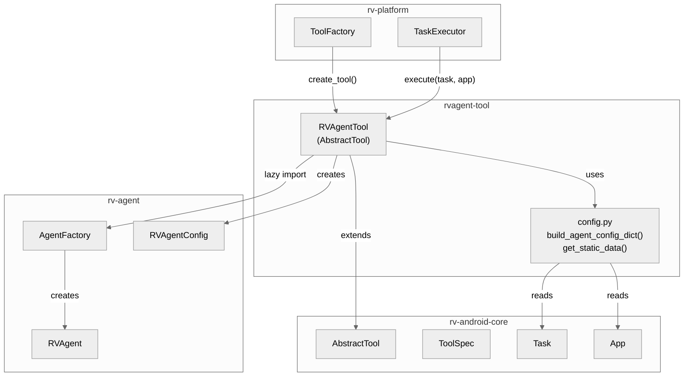
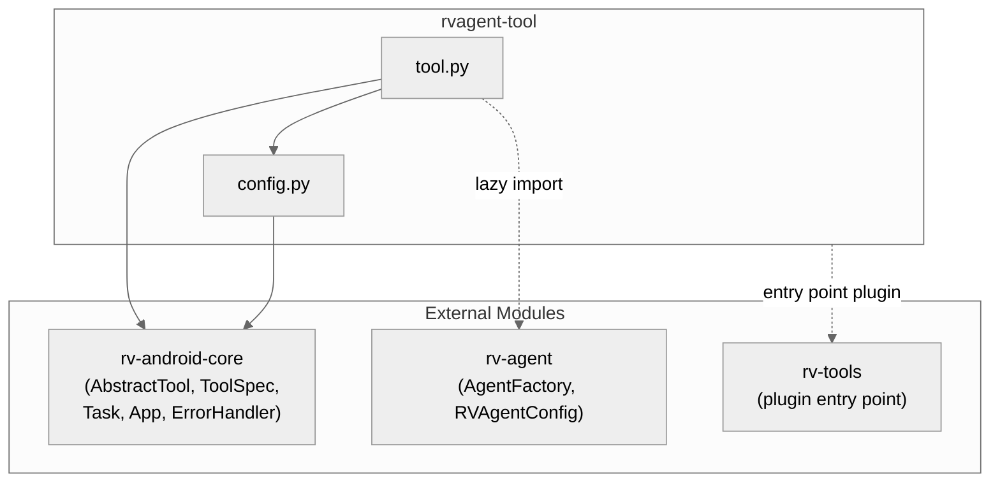
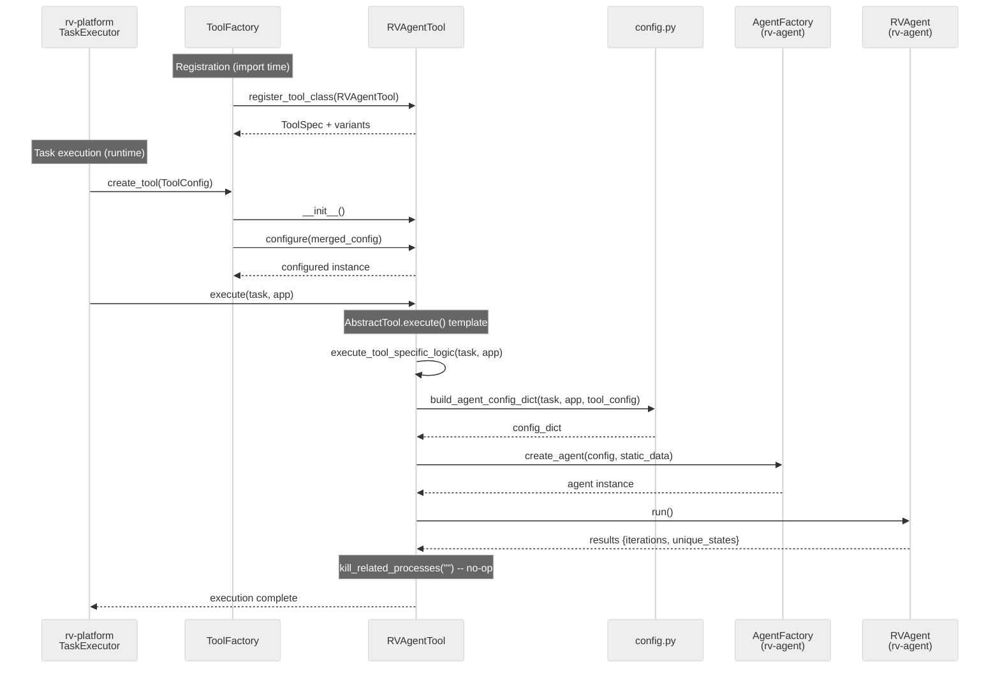
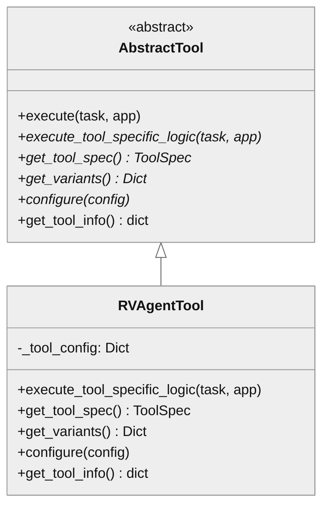
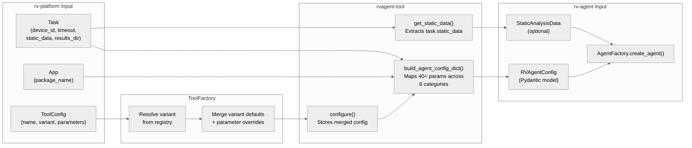

# rvagent-tool Architecture

## Overview

rvagent-tool is a thin adapter module that wraps rv-agent as an `AbstractTool` for integration with rv-platform's task execution framework. It bridges two subsystems: rv-platform (which manages emulators, APK installation, static analysis, and tool dispatch) and rv-agent (which performs LLM-driven Android UI exploration). The module contains a single tool implementation (`RVAgentTool`), a configuration mapper (`config.py`), and the plugin entry point that enables auto-discovery by rv-tools.

## Specification Alignment

This module implements requirements from `openspec/specs/tools/spec.md`.

### Functional Requirements

| FR | Description | Architectural Support |
|----|-------------|----------------------|
| FR19 | External tool support -- tools outside rv-tools registered via rv-platform | `RVAgentTool` extends `AbstractTool`; registered by rv-platform's `_register_external_tools()` on import |
| FR20 | Per-tool variant system -- named variants with configuration parameters | `get_variants()` returns 5 variants (default, multimode, pure_algorithm, llm_only, thorough) mapped to rv-agent execution modes |

### Key Invariants

| Invariant | Description | Enforcement Mechanism |
|-----------|-------------|----------------------|
| INV-TOOL-02 | Every registered tool MUST have a "default" variant | `get_variants()` returns a dictionary containing the key "default" |
| INV-TOOL-05 | `ToolFactory.create_tool()` MUST call `tool.configure(config)` before returning | `configure()` stores a copy of the configuration dictionary |
| INV-TOOL-06 | `AbstractTool.execute()` MUST convert `RVCommandTimeoutError` to `RVToolTimeoutError` | Inherited from `AbstractTool` base class |
| INV-TOOL-07 | `AbstractTool.execute()` MUST call `kill_related_processes()` after execution | Inherited from `AbstractTool`; `process_pattern=""` means no processes to kill (rv-agent uses UIAutomator2 which manages its own cleanup) |
| INV-TOOL-12 | External tool registration MUST be idempotent | rv-platform checks `is_tool_registered("rvagent")` before calling `register_tool_class()` |

### Specification Scenarios

Scenarios from `openspec/specs/tools/spec.md` that validate this architecture:

- **RVAgent tool maps platform context to agent configuration**: Validates that `build_agent_config_dict()` produces correct `RVAgentConfig` parameters, timeout comes from `task.config` (not variant), and static data is passed to `AgentFactory` -- traces through `RVAgentTool` -> `config.py` -> `AgentFactory`
- **RVAgent variants map to execution modes**: Validates that variant configurations contain correct `agent_mode` and `strategy` values -- traces through `get_variants()` -> `ToolRegistry` -> `ToolFactory`

## Key Architectural Decisions

| Decision | Choice | Rationale |
|----------|--------|-----------|
| Application Type | Library (plugin) | Registered as an entry point plugin; no standalone CLI |
| Structuring | Single-class adapter | Only one tool to wrap; additional structure would violate P1 (simplicity) |
| Primary Pattern | Adapter | Translates rv-platform's `Task`/`App` interface to rv-agent's `RVAgentConfig`/`AgentFactory` interface |
| Control Strategy | Call-based (template method) | `AbstractTool.execute()` calls `execute_tool_specific_logic()` following the template method pattern |
| Import Strategy | Lazy imports in `execute_tool_specific_logic()` | Avoids circular dependencies at registration time (rv-tools -> rvagent-tool -> rv-agent) |
| Timeout Ownership | Task controls timeout, not variants | Keeps execution timeout uniform across all tools; prevents variant misconfiguration |

### Why Lazy Imports?

rvagent-tool registers itself with the `ToolRegistry` at import time (when rv-platform starts). At that point, rv-agent's heavy dependencies (LangGraph, LangChain, PIL, scipy) would be loaded even for experiments that use Monkey or DroidBot. Lazy imports in `execute_tool_specific_logic()` defer this cost to execution time, when rv-agent is actually needed. This also breaks a potential circular dependency chain: rv-tools depends on rv-android-core, rvagent-tool depends on rv-tools, and rv-agent depends on rv-android-core -- eagerly importing rv-agent at registration time would pull in the full dependency graph before the registry is ready.

### Why Task Controls Timeout?

In the rv-platform execution model, all tools receive the same timeout from the experiment configuration. If variants could override timeout, an experiment specifying `--timeout 300` might silently run one tool for 600 seconds because a variant redefined it. By making timeout exclusively sourced from `task.config.timeout`, rv-platform controls the execution budget uniformly. The `build_agent_config_dict()` function enforces this by mapping timeout only from the task, never from `tool_config`.

### Why a Separate Config Module?

The `config.py` module exists because the parameter mapping between rv-platform's domain (Task, App, ToolConfig) and rv-agent's domain (RVAgentConfig) spans 40+ parameters across 6 categories (LLM, strategy, scorer, error detection, fallback, metrics). Embedding this mapping in `tool.py` would make the tool class unwieldy and harder to test. The separation allows unit-testing the mapping logic independently from the AbstractTool lifecycle.

### Why Empty Process Pattern?

rv-agent interacts with the Android device through UIAutomator2, which manages its own process lifecycle on the device. Unlike tools like DroidBot (which spawn a persistent process matching a pattern) or APE-RV (which runs as `com.android.commands.monkey`), rv-agent has no device-side process to kill after execution. Setting `process_pattern=""` means `kill_related_processes()` is a no-op, which is the correct behavior.

## Architectural Patterns

### Pattern: Adapter

**Description**: `RVAgentTool` adapts rv-agent's `AgentFactory`/`RVAgentConfig` API to rv-platform's `AbstractTool` interface. The `config.py` module handles the mapping from platform domain objects (`Task`, `App`, tool variant configuration) to rv-agent's `RVAgentConfig` constructor parameters.

**When Used**: rv-platform needs to dispatch rv-agent as a tool without knowing rv-agent internals. The adapter translates between the two module boundaries.

**Advantages**:
- rv-platform and rv-agent remain decoupled -- neither depends on the other directly
- Configuration mapping is centralized in one module rather than scattered

**Disadvantages**:
- Configuration parameters must be enumerated explicitly in `config.py` (lists of parameter names for each category)
- Adding a new `RVAgentConfig` parameter requires updating the corresponding list in `build_agent_config_dict()`

### Pattern: Template Method (inherited)

**Description**: `AbstractTool.execute()` defines the execution skeleton: call `execute_tool_specific_logic()`, handle timeout conversion, call `kill_related_processes()`. `RVAgentTool` overrides only `execute_tool_specific_logic()`.

**When Used**: All tools in rv-android follow this pattern. It provides consistent timeout handling, process cleanup, and error management.

**Advantages**:
- Consistent behavior across all tools (timeout handling, cleanup, error reporting)
- Tool implementations focus only on their specific logic

**Disadvantages**:
- Fixed execution order; cannot customize pre/post steps per tool

---

## Logical View

Shows key domain entities and their relationships.

### Domain Entities

| Entity | Responsibility |
|--------|----------------|
| RVAgentTool | Implements `AbstractTool` to wrap rv-agent for rv-platform dispatch |
| ToolSpec | Metadata (name, description, version, URL, process_pattern) for registry |
| config module | Maps `Task`/`App`/variant config to `RVAgentConfig` constructor parameters |

### Component Architecture



---

## Development View

Shows code organization for developers.

### Module Structure

```
rvagent-tool/
├── src/
│   └── rvagent_tool/
│       ├── __init__.py              # Package root, exports RVAgentTool
│       └── tools/
│           ├── __init__.py          # Re-exports RVAgentTool
│           └── rvagent/
│               ├── __init__.py      # Re-exports RVAgentTool
│               ├── tool.py          # RVAgentTool (AbstractTool implementation)
│               └── config.py        # Configuration mapping functions
├── tests/
│   ├── __init__.py
│   └── unit/
│       ├── __init__.py
│       └── test_tool.py             # Unit tests for tool and config
└── pyproject.toml                   # Dependencies: rv-android-core, rv-agent, rv-tools
```

### Package Dependencies



---

## Process View

### Execution Flow



---

## Core Components

### RVAgentTool

**Purpose**: Implements `AbstractTool` interface so rv-platform can dispatch rv-agent as a first-class exploration tool alongside Monkey, DroidBot, APE, and others.

**Location**: `src/rvagent_tool/tools/rvagent/tool.py`

**Key Classes**:
- `RVAgentTool`: The tool implementation. Defines 5 variants, delegates execution to `AgentFactory`.

**Design Notes**:
- Uses lazy imports of `rv_agent.agent.agent_factory` and `rv_agent.config.agent_config` inside `execute_tool_specific_logic()` to break circular dependency chains at registration time.
- `process_pattern=""` because rv-agent uses UIAutomator2 for device interaction, which manages its own process lifecycle.
- `ErrorHandler.handle_errors` decorator on `execute_tool_specific_logic()` provides consistent error reporting with component and phase context.

**Dependencies**:
- Internal: `config.py` (configuration mapping)
- External: `rv-android-core` (AbstractTool, ToolSpec, ErrorHandler, LoggingManager), `rv-agent` (AgentFactory, RVAgentConfig -- lazy import)

### Configuration Mapper

**Purpose**: Translates rv-platform's `Task`/`App` domain objects and tool variant configuration into `RVAgentConfig` constructor parameters.

**Location**: `src/rvagent_tool/tools/rvagent/config.py`

**Key Functions**:
- `build_agent_config_dict(task, app, tool_config)`: Maps task configuration (device_id, timeout, repetition), variant parameters (agent_mode, llm_probability, strategy), LLM parameters, exploration strategy parameters, scorer weights, error detection parameters, and fallback parameters into a flat dictionary for `RVAgentConfig`.
- `get_static_data(task)`: Extracts static analysis data from `task.static_data` if available.

**Design Notes**:
- Timeout is explicitly mapped from `task.config.timeout` only, never from `tool_config`. This enforces that rv-platform controls execution timeout uniformly.
- Parameters are organized into logical groups (LLM, strategy, scorer, error detection, fallback) with explicit enumeration. This is deliberate: adding a new `RVAgentConfig` parameter requires explicitly adding it to the appropriate list, which makes the mapping visible and auditable.

**Dependencies**:
- External: `rv-android-core` (Task, App domain models)

---

## NFR Support

How the architecture supports non-functional requirements from the PRD.

| NFR | PRD ID | Priority | Architectural Support |
|-----|--------|----------|----------------------|
| Modularity | NFR01 | P0 | Separate uv workspace module with its own `pyproject.toml`; editable mode means source changes are immediate |
| Extensibility | NFR02 | P0 | Registered by rv-platform's `_register_external_tools()` via a direct guarded import, so the module stays out of rv-tools' dependency set; new variants added by modifying `get_variants()` |
| Testability | NFR03 | P1 | Unit tests cover spec, variants, configuration, and info retrieval; mock-friendly design with dependency injection via `Task`/`App` |
| Resilience | NFR04 | P1 | Inherits `AbstractTool` timeout handling (converts `RVCommandTimeoutError` to `RVToolTimeoutError`); `ErrorHandler` decorator on execution |
| Configurability | NFR05 | P1 | 5 named variants map to rv-agent execution modes; tool specification DSL (`rvagent:pure_algorithm@llm_probability=0.8`) supports parameter overrides |

---

## Key Interfaces

### AbstractTool (inherited)

```python
class AbstractTool(ABC):
    """Base class for all testing tools in rv-android."""

    def execute(self, task: Task, app: App) -> None:
        """Template method: execute_tool_specific_logic -> kill_related_processes."""
        ...

    @abstractmethod
    def execute_tool_specific_logic(self, task: Task, app: App) -> None:
        """Tool-specific execution logic."""
        ...

    @classmethod
    @abstractmethod
    def get_tool_spec(cls) -> ToolSpec:
        """Return tool metadata for registry."""
        ...

    @classmethod
    @abstractmethod
    def get_variants(cls) -> Dict[str, Dict[str, Any]]:
        """Return named variant configurations."""
        ...

    @abstractmethod
    def configure(self, config: Dict[str, Any]) -> None:
        """Apply resolved configuration from ToolFactory."""
        ...
```



---

## Scenarios

### Scenario 1: rv-platform dispatches rv-agent for experiment

**Description**: An experiment runs `rvagent:pure_algorithm` against an instrumented APK. rv-platform creates and executes the tool.

**Flow**:
1. rv-platform imports rvagent-tool, triggering `_register_external_tools()` which registers `RVAgentTool` in the `ToolRegistry`
2. `ToolFactory.create_tool(ToolConfig(name="rvagent", variant="pure_algorithm"))` resolves the variant configuration (`agent_mode="pure_algorithm", strategy="rvagent"`)
3. Factory calls `tool.configure(merged_config)` storing the configuration
4. `TaskExecutor` calls `tool.execute(task, app)` which invokes `execute_tool_specific_logic()`
5. `build_agent_config_dict()` maps task context (device_id, timeout) and variant config to `RVAgentConfig` parameters
6. `AgentFactory.create_agent()` creates the agent with static data from the platform
7. `agent.run()` performs LLM-driven exploration; results are logged

### Scenario 2: Configuration override via DSL

**Description**: A user specifies `rvagent:multimode@llm_probability=0.9` in the CLI.

**Flow**:
1. CLI parser extracts `name="rvagent"`, `variant="multimode"`, `parameters={"llm_probability": 0.9}`
2. `ToolFactory` gets variant config (`llm_probability=0.7`) and merges with parameters (`llm_probability=0.9` overrides)
3. `configure()` stores the merged config with `llm_probability=0.9`
4. During execution, `build_agent_config_dict()` includes `llm_probability=0.9` in the config dict

---

## Data Flow

This section describes how data flows through rvagent-tool from rv-platform input to rv-agent execution.

### Configuration Data Flow



### Parameter Mapping Categories

`build_agent_config_dict()` maps parameters in explicit groups. Each group is an enumerated list of parameter names, making the mapping auditable and preventing accidental passthrough of unsupported parameters.

| Category | Source | Parameters | Count |
|----------|--------|------------|-------|
| Core | Task + App | package_name, device_id, timeout, repetition | 4 |
| Mode | ToolConfig variant | agent_mode, llm_probability, strategy, debug_mode | 4 |
| LLM | ToolConfig variant | llm_model, llm_base_url, llm_temperature, llm_top_p, llm_top_k, llm_max_tokens, llm_timeout, prompt_version | 8 |
| Strategy | ToolConfig variant | plateau_window, max_input_variations, stochastic_probability, stochastic_temperature, backtrack_saturation_threshold, multi_value_saturation_threshold, mop_nav_weight, mop_max_input_variations | 8 |
| Scorer | ToolConfig variant | mop_direct_score, mop_transitive_score, wtg_guided_score, unsaturated_bonus, visitation_penalty_factor, strength_weight, gradual_decay_base/rate/min_visits, component_high/medium_priority, max_re_enables, ui_coverage_threshold, coverage_density_weight, reward_gamma, reward_score_weight, scroll_probability | 16 |
| Error Detection | ToolConfig variant | error_detection_confidence, error_max_indicator_size/count, spatial_edittext_boost, spatial_spinner_boost, spatial_min_match_threshold | 6 |
| Fallback | ToolConfig variant | max_short_term_iterations, llm_max_retries | 2 |
| Metrics | Task | metrics_output_dir (from task.results_dir) | 1 |

### Static Analysis Data Flow

Static analysis data flows from rv-platform's `StaticAnalysisComponent` through the task context to rv-agent:

1. rv-platform's pre-processing phase runs GATOR static analysis on the APK
2. Results are stored in `task.static_data` as a `StaticAnalysisData` instance
3. `get_static_data(task)` extracts this data with a safe `hasattr` check
4. `AgentFactory.create_agent(config, static_data)` receives it
5. Inside rv-agent, the data feeds `TransitionManager` (WTG navigation) and `MopScorer` (action prioritization)

When static analysis is unavailable (e.g., `RVSEC_HOME` not set), `get_static_data()` returns None and rv-agent operates without WTG guidance or MOP scoring, relying solely on the algorithmic DFS strategy and UI-based heuristics.

---

## Extension Points

- **Adding variants**: Add entries to `get_variants()` return dictionary. Each variant maps a name to a configuration dictionary.
- **Adding configuration parameters**: Add the parameter name to the appropriate list in `build_agent_config_dict()` (LLM, strategy, scorer, error detection, or fallback).
- **Custom tool configuration**: Use the DSL `@param=value` syntax to override any variant parameter at experiment time.

## Dependencies

### Internal (rv-android modules)

| Module | Purpose |
|--------|---------|
| rv-android-core | `AbstractTool`, `ToolSpec`, `Task`, `App`, `ErrorHandler`, `LoggingManager` |
| rv-agent | `AgentFactory` and `RVAgentConfig` (lazy imported at execution time) |
| rv-tools | Plugin entry point system for tool auto-discovery |

### External

| Package | Version | Purpose |
|---------|---------|---------|
| pydantic | >=2.9.0 | Model validation (transitive via rv-android-core) |

## Testing Strategy

| Type | Location | Purpose |
|------|----------|---------|
| Unit | tests/unit/test_tool.py | Tool spec, variants, configuration, config mapping, tool info |

Tests cover:
- `TestRVAgentToolSpec`: Tool metadata correctness (name, description, version, process_pattern)
- `TestRVAgentToolVariants`: Variant definitions (default exists, mode mappings, timeout absence)
- `TestRVAgentToolConfigure`: Configuration storage (copy semantics, None handling)
- `TestConfigMapping`: `build_agent_config_dict()` with minimal/full task configs, timeout ownership, static data extraction
- `TestRVAgentToolInfo`: `get_tool_info()` output completeness

## Related Documentation

- [Tools Domain Spec](../../openspec/specs/tools/spec.md) - Requirements and invariants for tool infrastructure
- [PRD](../../docs/PRD.md) - Product Requirements Document (FR18-FR20 for tools, NFR01-08)
- [CLAUDE.md](../../CLAUDE.md) - Project-level development reference
