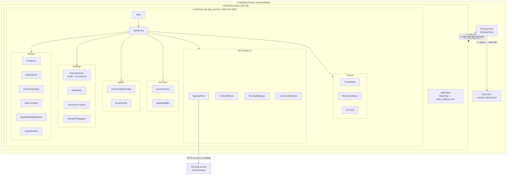
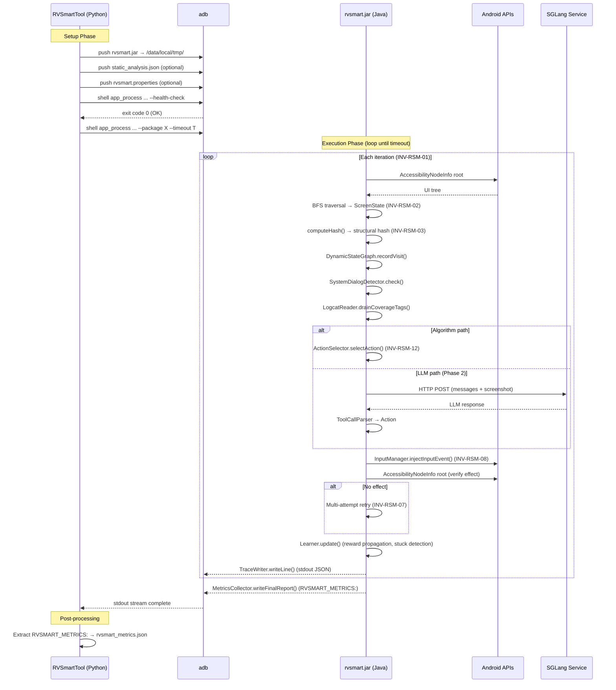
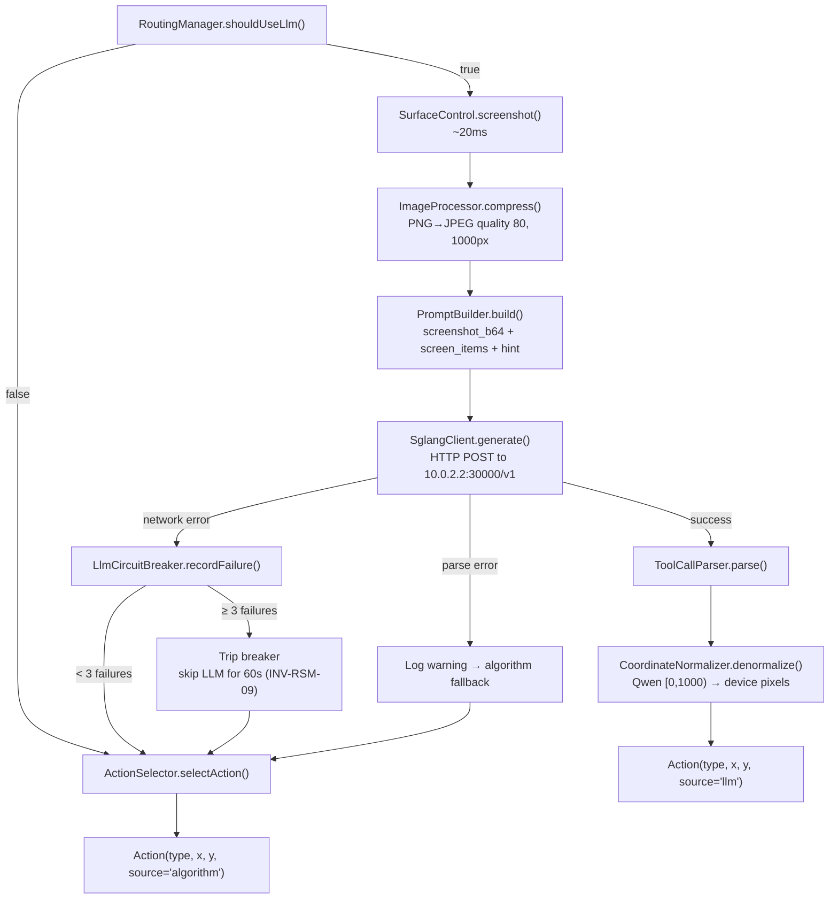

# Design: rvsmart Java Agent

## Context

This design describes rvsmart, a Java exploration agent that runs inside the Android emulator via `app_process`, targeting ~12-16 events/second in pure_algorithm mode — approximately 10x the throughput of the Python RVAgent. The change introduces a new standalone Java module (`$RVSEC_HOME/rvsec-android/rvsmart/`) and a corresponding rv-tools plugin (`RVSmartTool`) for integration with the rv-android platform. See proposal.md and GitHub Issue #29.

The Python RVAgent achieves ~1 iteration/second due to two external communication bottlenecks: UIAutomator2 over ADB (~200ms per UI capture round-trip) and a fixed inter-iteration sleep (500ms). Competing tools like APE achieve ~10 events/second by running inside the emulator via `app_process`, bypassing these bottlenecks entirely. In a 300-second time budget, the Python agent executes ~300 actions while APE executes ~3000 — a direct throughput gap that limits state coverage and the probability of reaching monitored operations (MOP methods).

Beyond raw speed, running externally prevents algorithmic improvements that require sub-millisecond feedback. Multi-attempt cycles (retrying no-effect actions within the same iteration) cost ~8ms internally versus ~700ms externally. Instant crash detection via `ActivityController.appCrashed()` provides a synchronous callback instead of polling. Real-time logcat reading for `RVSEC-COV` tags enables confirmed coverage as a ground-truth reward signal, replacing static proxy estimates.

**Related requirements**: FR18 (plugin system with registry and factory patterns), FR19 (external tool support — rvsmart follows built-in tool pattern like APE), FR20 (per-tool variant system — rvsmart defines 4 variants), FR07 (Android emulator management — rv-platform manages the emulator lifecycle, rvsmart assumes it's running), NFR01 (modularity — rvsmart is a standalone JAR with zero rv-android Python dependency), NFR03 (testability — unit, integration, equivalence, and E2E test layers).

**Constraints**:
- Java 8 (RVSEC ecosystem standard, APE/FastBot/Monkey precedent)
- Maven build (same toolchain as rvsec-gator)
- API 29 android.jar stubs (compile-time only; ART provides actual classes at runtime)
- Shell UID 2000 (no root, but `INJECT_EVENTS` permission via `app_process`)
- Timeout is the ONLY exit condition from the main loop (INV-RSM-01)

## Architecture

The system consists of two parts: a Java agent (`rvsmart.jar`) that runs inside the Android emulator, and a Python plugin (`RVSmartTool`) that integrates it with rv-android. The Java agent is self-contained — it uses internal Android APIs for UI capture, event injection, and crash detection, producing structured trace output on stdout. The Python plugin handles file transfer, process execution, and trace extraction. This separation means the Java agent can be tested independently with a bare `adb shell` command, while the Python plugin ensures it works seamlessly within rv-experiment workflows.

The Java agent's internal architecture follows a main loop pattern where each iteration goes through a fixed sequence: capture the current UI state, update the exploration graph, check for system dialogs, drain logcat for coverage tags, decide between algorithm and LLM paths, select and execute an action, verify its effect, and write a trace line. The loop exits only on timeout. All components are plain Java classes instantiated by `Main` — no dependency injection framework, no reflection-based wiring. The `Config` object (loaded from `java.util.Properties`) is passed to components that need configurable parameters.



The package structure mirrors the component responsibilities: `device/` handles all hardware-level interaction via ServiceManager reflection; `strategy/` implements the exploration algorithm (action selection, scoring, path planning); `graph/` maintains the dynamic state graph that records visits and transitions; `recovery/` detects stuck situations and computes escape plans; `llm/` encapsulates all LLM-related code behind a clean boundary (Phase 2); and `output/` handles trace writing, metrics collection, and structured decision logging. This separation means the `llm/` package can be entirely absent at compile time for Phase 1 builds, and the `strategy/` package can be tested with mock `device/` implementations.

### Key Components

The components fall into three categories: **device interaction** (direct Android API access via reflection), **exploration strategy** (algorithmic decision-making that mirrors the Python RVAgent), and **infrastructure** (configuration, output, monitoring).

| Component | Responsibility | Input | Output |
|-----------|---------------|-------|--------|
| `Main` | Entry point, arg parsing, bootstrap, ServiceManager connections | CLI args | Configured AgentLoop |
| `AgentLoop` | Main while-loop, orchestrates one iteration per cycle (INV-RSM-01) | Config, DeviceController, Strategy | Trace output (stdout) |
| `DeviceController` | ServiceManager reflection, service connections | — | IActivityManager, IWindowManager, InputManager handles |
| `UiCapture` | AccessibilityNodeInfo BFS traversal with recycle() (INV-RSM-02) | Root node | `ScreenState` (items, activity, hash) |
| `InputInjector` | `InputManager.injectInputEvent()` for touch/key (INV-RSM-08) | `Action` | Event injected |
| `CrashInterceptor` | `ActivityController.appCrashed()` callback (INV-RSM-06) | System callback | Crash log entry + auto-restart |
| `SystemDialogDetector` | Detect system dialogs by package name | `ScreenState` | Dismissed or pass-through |
| `LogcatReader` | Non-blocking logcat reader for RVSEC-COV tags (INV-RSM-05) | Logcat stream | `List<String>` covered methods |
| `ActionSelector` | 4-tier action selection + multi-attempt (INV-RSM-12). Tier 4 uses unified priority queue where widget actions (scored by 10 scorers, even saturated) and BACK/RESTART (scored by their own base scores, NOT by widget scorers) compete. BACK has dynamic decay on consecutive no-effect — self-correcting, prevents infinite loops. | Screen, Graph, StaticMap | `Action` (never null) |
| `DynamicStateGraph` | LinkedHashMap-based state graph with transitions (insertion-ordered for deterministic BFS with --seed) | Visit/transition records | Visit counts, rewards, transitions |
| `StuckDetector` | Level 1 (BACK) + Level 2 (BFS to unsaturated ancestor) | Screen hash history | Recovery action |
| `StaticMap` | Loads `static_analysis.json` (nullable) (INV-RSM-04) | JSON file path | Reachability, windows, transitions |
| `RoutingManager` | LLM vs algorithm decision per iteration | Mode, screen, graph | Boolean (use LLM?) |
| `SglangClient` | HTTP POST to OpenAI-compatible API (Phase 2) | Messages + screenshot | LLM response |
| `TraceWriter` | Per-iteration JSON line to stdout (INV-RSM-10) | Iteration data | JSON line |
| `MetricsCollector` | Final metrics JSON report at timeout | Aggregated stats | JSON report |
| `RvTrack` | Structured decision logging via `[RVTRACK:<CATEGORY>]` to logcat. Same prefix convention as Python agent for tooling compatibility. 15 categories, aggregate counters. | Decision data | `Log.i("RVSMART", "[RVTRACK:...] key=value")` |
| `Config` | `java.util.Properties` loader with defaults (~48 params, ~39 calibratable) | Properties file | Typed config values |
| `HeapMonitor` | Runtime memory monitoring (INV-RSM-13) | `Runtime.freeMemory()` | Adaptive throttle adjustments |
| `RVSmartTool` (Python) | rv-tools plugin: push, execute, capture (FR18, FR20) | Task, App | Trace file |

## Mapping: Spec → Implementation → Test

This table traces each requirement from its spec invariant through the Java/Python implementation to the test that validates it. The invariant column links to the rvsmart spec (`specs/rvsmart/spec.md`); FR references link to the PRD (`docs/PRD.md`).

| Requirement | Invariant | Implementation | Test |
|-------------|-----------|---------------|------|
| Timeout-only exit | INV-RSM-01 | `AgentLoop` while-loop condition: `System.currentTimeMillis() < deadline` | `test_loop_exits_only_on_timeout` |
| Node recycling | INV-RSM-02 | `UiCapture.captureScreen()` — BFS with `node.recycle()` in try/finally | `test_ui_capture_recycles_all_nodes` |
| Structural hash compat | INV-RSM-03 | `ScreenState.computeHash()` — sorted JSON → SHA-256[:12] | `test_hash_matches_python_agent` |
| Graceful degradation (static) | INV-RSM-04 | Null `StaticMap`, MopScorer/WtgScorer return 0 | `test_heuristic_mode_no_static_data` |
| Graceful degradation (coverage) | INV-RSM-05 | `ConfirmedCoverageScorer` returns 0 when no logcat data | `test_confirmed_coverage_scorer_zero_without_logcat` |
| Crash detection + restart | INV-RSM-06 | `CrashInterceptor.appCrashed()` → mark action → restart | `test_crash_callback_fires_and_restarts` |
| Multi-attempt cap | INV-RSM-07 | `AgentLoop` retry ≤ `MAX_RETRIES_PER_CYCLE`, skip after 3 failures | `test_multi_attempt_retries_on_no_effect` |
| Source-agnostic execution | INV-RSM-08 | Same `InputInjector.inject()` path for algorithm and LLM actions | `test_inject_ignores_action_source` |
| LLM circuit breaker | INV-RSM-09 | `LlmCircuitBreaker`: 3 failures → trip, 60s cooldown | `test_llm_circuit_breaker_fallback` |
| Metrics prefix | INV-RSM-10 | Last stdout line prefixed `RVSMART_METRICS:` | `test_metrics_prefix_present` |
| UI tree cap | INV-RSM-11 | `UiCapture` stops BFS at `MAX_ITEMS` (default 2000) | `test_ui_capture_caps_at_max_items` |
| Unified Tier 4 queue | INV-RSM-12 | `ActionSelector` — BACK/RESTART as synthetic actions, BACK decay | `test_selector_never_returns_null`, `test_back_decay_promotes_widget_retry` |
| Heap monitoring | INV-RSM-13 | `HeapMonitor` every 100 iterations, adaptive throttle | `test_heap_monitor_increases_throttle` |
| Bootstrap via app_process | — | `Main.main()` + `DeviceController.connect()` | `test_bootstrap_connects_services` |
| UI capture <10ms | — | `UiCapture.captureScreen()` (BFS + recycle) | `test_ui_capture_performance` |
| Event injection <3ms | — | `InputInjector.inject()` | `test_event_injection_performance` |
| System dialog dismiss | — | `SystemDialogDetector.isSystemDialog()` + `.dismiss()` | `test_system_dialog_dismissed` |
| Confirmed coverage rewards | — | `ConfirmedCoverageScorer` + `LogcatReader` | `test_confirmed_coverage_rewards` |
| FR18 (registry) | INV-TOOL-02 | `RVSmartTool` registered in BUILTIN_TOOLS | `test_rvsmart_registered_in_registry` |
| FR20 (variants) | — | Variants: default, mvp, fast, hybrid | `test_rvsmart_variants_resolved` |
| INV-TOOL-06 (timeout = success) | INV-TOOL-06 | `RVSmartTool.execute_tool_specific_logic()` | `test_timeout_is_success` |
| RVTRACK logging | — | `RvTrack` static methods, 15 categories | `test_rvtrack_format`, `test_rvtrack_counters` |

## Goals / Non-Goals

**Goals:**
- Port the DFS exploration strategy from Python to Java with structural hash compatibility (INV-RSM-03), so state graphs from both agents are directly comparable
- Achieve ~12-16 evt/s in pure_algorithm mode (10x improvement over Python), enabling 3600-4800 actions in a 300s budget versus the current ~300
- Integrate with rv-android via rv-tools plugin following the existing APE tool pattern (FR18, FR20), so rvsmart can be used in experiments with `--tools rvsmart:mvp`
- Support 4 graceful degradation modes based on available data — full, MOP-directed, coverage-aware, heuristic (INV-RSM-04, INV-RSM-05)
- Add multi-attempt cycles (INV-RSM-07), instant crash detection (INV-RSM-06), and confirmed coverage rewards (INV-RSM-05) as algorithmic improvements enabled by internal execution
- Maintain standalone usability — `rvsmart.jar` + bare `adb shell` command, no rv-android dependency at runtime
- All ~48 parameters configurable via `java.util.Properties` for Optuna calibration (~39 calibratable), enabling systematic parameter optimization in Phase 3

**Non-Goals:**
- Replacing the Python RVAgent — both coexist; rvsmart is a separate tool option accessible via `--tools rvsmart:<variant>`
- Porting visual error detection (OpenCV) — requires image processing library inside emulator, unwarranted complexity for Phase 1-2
- Porting ShortTermMemory/LongTermMemory — these are LLM context management mechanisms from the Python agent, not needed for the algorithm path
- Supporting API levels other than 29 — our emulator image is fixed at API 29; `app_process` reflection targets vary across levels
- Running on physical devices — `app_process` behavior varies across OEM ROMs; our experiments use emulators exclusively
- Implementing a new exploration algorithm — rvsmart ports the existing Python strategy with one structural improvement (unified Tier 4 queue instead of separate Tier 5)

## Decisions

### D1: Java 8 via app_process (not Kotlin, not native)

**Chosen**: Java 8 with `app_process` bootstrap. **Rationale (P1 Simplicity)**: APE, FastBot, and Monkey all use Java via `app_process` — the approach is battle-tested with years of production use. RVSEC already uses Java for rvsec-gator, so the toolchain is familiar to the team. Future advisees can maintain it without learning a new ecosystem.

**Alternatives considered**:
- **Kotlin**: Less boilerplate and null safety, but no precedent in `app_process` agents. The Kotlin runtime adds ~1.5MB to the JAR and introduces a risk vector — if Kotlin stdlib classes conflict with ART internals, debugging would be extremely difficult. The benefit (syntactic convenience) does not justify the risk.
- **C/C++ (NDK)**: Maximum performance but no access to Java APIs like `AccessibilityNodeInfo` and `ActivityController`. The entire exploration strategy depends on Java reflection to reach `ServiceManager` services, which NDK cannot access. This would require reimplementing the accessibility tree reader from scratch via `/dev/input` events — a fundamentally different approach.
- **Python inside emulator**: Not feasible — no Python interpreter available on Android.

### D2: AccessibilityNodeInfo for UI capture (not UiAutomation, not uiautomator dump)

**Chosen**: `AccessibilityNodeInfo` via `ServiceManager.getService("accessibility")` + reflection. **Rationale (P1 Simplicity)**: Direct access with <10ms latency, same data as UIAutomator2 but without the 200ms ADB round-trip. APE (`GUITree`) and FastBot use the exact same approach, confirming feasibility on API 29.

The key insight is that UIAutomator2 internally does exactly this — it gets the accessibility root node, traverses the tree, and serializes to XML. By cutting out the UIAutomator2 intermediary, we eliminate the ADB transport and XML serialization overhead entirely. The resulting `ScreenState` object contains the same information (class name, resource-id, text, content-desc, bounds, clickable/scrollable flags) but as in-memory Java objects instead of parsed XML.

**Alternatives considered**:
- **UiAutomation via Instrumentation**: Public stable API, but requires an InstrumentationRunner setup and is fundamentally slower due to the binder round-trip between the instrumentation process and the system server.
- **`uiautomator dump`**: ~200-500ms per dump plus XML parsing — this is essentially what the Python agent does, and it's the bottleneck we're eliminating.
- **Accessibility Service (installed APK)**: Requires manual permission grant via Settings, incompatible with the `app_process` execution model.

### D3: InputManager.injectInputEvent() for event injection

**Chosen**: `InputManager.injectInputEvent()` via reflection. **Rationale (P1 Simplicity)**: <1ms latency, programmatic, no process fork. This is the standard approach for `app_process` agents — APE, FastBot, and Monkey all use it. The reflection target is stable across API 29 builds.

**Alternatives considered**:
- **`adb shell input tap`**: ~50ms overhead per command (process fork + adb communication). At 14 events/second, this would consume 700ms of every second just on injection.
- **`Instrumentation.sendPointerSync()`**: Not available outside instrumentation context.
- **minitouch**: Extra binary to push, socket protocol to implement, no clear latency benefit over `InputManager` reflection.

### D4: Gson for JSON (not org.json)

**Chosen**: Gson. **Rationale**: Already in the RVSEC ecosystem (`RvsecAnalysisClient` uses Gson for parsing `static_analysis.json`). The critical property is sorted key serialization for deterministic structural hashes — Gson serializes `TreeMap<String, Object>` keys in natural order. **Important**: this only works when every object in the JSON tree is a `TreeMap`, not a POJO or HashMap. Both the top-level object and each ScreenItem in the items array MUST be constructed as `TreeMap<String, Object>` to ensure recursive key sorting matching Python's `json.dumps(sort_keys=True)`. This directly supports INV-RSM-03 (structural hash compatibility with the Python agent).

The golden test for hash compatibility is: hardcoded `ScreenItem` objects → `TreeMap` per item → canonical JSON → SHA-256[:12] must match the Python agent reference value. Using Gson's `TreeMap` serialization at every level makes this straightforward — no need for custom serializers or post-processing sort steps.

**Alternative**: `org.json` — viable but lacks automatic sorted key output, requiring manual `JSONObject` → `TreeMap` conversion.

### D5: java.util.Properties for configuration (not YAML, not JSON config)

**Chosen**: `java.util.Properties` loaded from `--config rvsmart.properties`. **Rationale (P1 Simplicity)**: Zero dependency, trivially parseable, `key=value` format maps directly to Optuna's parameter space. In the calibration loop (Phase 3), Optuna generates `.properties` files programmatically — each trial writes its parameter values as `key=value` pairs, pushes the file to the emulator, and rvsmart reads them at startup. No YAML parser, no JSON config schema, no configuration framework — just `Properties.load(new FileInputStream(path))`.

The ~48 parameters (listed in the spec's Key Data Models section) cover exploration weights, timing, thresholds, and LLM settings. Each has a sensible default hardcoded in `Config`, so the properties file is entirely optional. The subset of ~39 calibratable parameters maps 1:1 to Optuna's search space definition.

### D6: Socat bridge for LLM networking (not adb reverse)

**Chosen**: `socat TCP-LISTEN:30000,bind=127.0.0.1,fork TCP:sglang:30000` in the container entrypoint. The Java agent connects to `http://10.0.2.2:30000/v1` (Android emulator's alias for host localhost). Bind to localhost only to avoid exposing the port to all container interfaces.

**Rationale**: Socat is more explicit and reliable than `adb reverse`, which can lose its port mapping on emulator restart. The socat bridge is configured once in `docker-entrypoint.sh` and remains active for the entire container lifetime. Both approaches work; socat is the default, `adb reverse` is documented as an alternative for development outside Docker.

**Alternative**: `adb reverse tcp:30000 tcp:30000` — Java agent uses `http://localhost:30000/v1`. Simpler setup but fragile: the mapping must be re-established after any emulator restart, which rv-platform does automatically in some failure recovery scenarios.

### D7: Built-in tool (not external like rvagent)

**Chosen**: `RVSmartTool` as built-in tool in `rv-tools/builtin/rvsmart/`. **Rationale (FR18, FR20)**: rvsmart is a JAR-based tool like APE — it pushes a JAR and runs via `adb shell`. This is the same pattern as all built-in tools in the registry. No separate Python module needed (unlike rvagent which wraps a full LangGraph application).

The `RVSmartTool` follows the exact same contract as `APETool`: `TOOL_SPEC` for registry metadata, `get_variants()` for the 4 variants (default, mvp, fast, hybrid), and `execute_tool_specific_logic()` for the push-and-execute sequence. `JarResolver` finds `rvsmart.jar` using the same priority search as APE's JAR resolution. This means rvsmart works seamlessly with `rv-experiment run --tools rvsmart:mvp` without any platform changes.

### D8: Phased delivery (PoC → MVP → Full → Calibration)

The phased approach de-risks the investment. Phase 0 validates `app_process` fundamentals (bootstrap, UI capture, event injection, crash callback) before committing to the full agent implementation. This is a Go/No-Go gate: if `AccessibilityNodeInfo` reflection fails on our API 29 emulator image, or if `InputManager.injectInputEvent()` doesn't work with Shell UID 2000, we discover this in a few days rather than after weeks of development.

- **Phase 0 (PoC)**: Validate `app_process` fundamentals — bootstrap, UI capture success rate >99%, event injection >99%, crash callback fires on forced crash. Estimated: 3-5 days.
- **Phase 1 (MVP)**: 3-tier selection (path buffer, untested, scored queue), multi-attempt, crash detection, system dialogs, rv-tools plugin, TraceWriter. Target: ≥12 evt/s.
- **Phase 2 (Full)**: 4-tier selection with all 10 scorers, LLM hybrid mode, confirmed coverage, all 4 operational modes. Full algorithm parity with Python agent.
- **Phase 3 (Calibration)**: Optuna integration for ~39 calibratable parameters, equivalence tests (Python vs Java hashes), benchmark vs APE/FastBot/rvagent-python.

## API Design

### Java Agent CLI

```bash
CLASSPATH=/data/local/tmp/rvsmart.jar \
  /system/bin/app_process /data/local/tmp/ \
  br.unb.cic.rvsmart.Main \
  --package <package_name> \
  --timeout <seconds> \
  [--static-data /data/local/tmp/static_analysis.json] \
  [--config /data/local/tmp/rvsmart.properties] \
  [--mode pure_algorithm|multimode|llm_only] \
  [--seed <int>] \
  [--health-check]
```

**Preconditions**: Emulator running, target APK installed, JAR pushed to `/data/local/tmp/`.
**Postconditions**: Stdout contains JSON lines (trace) + final JSON report. Exit code 0.
**Error behavior**: Bootstrap failure → stderr message + exit code 1. Runtime crash → logged, agent restarts app and continues.
**Health check**: `--health-check` validates ServiceManager connections, performs one UI capture, and exits with code 0 (success) or 1 (failure). The rv-tools plugin runs this before full execution for faster failure feedback.

### RVSmartTool (Python plugin)

The Python plugin follows the APETool pattern exactly. It extends `AbstractTool`, defines a `TOOL_SPEC` for registry metadata, implements `get_variants()` with 4 variants, and implements `execute_tool_specific_logic()` for the push-and-execute sequence.

```python
class RVSmartTool(AbstractTool):
    TOOL_SPEC = ToolSpec.create_builtin_spec(
        name="rvsmart",
        description="Java agent running inside emulator via app_process",
        url="https://github.com/PAMunb/rvsec",
        version="1.0.0",
        process_pattern="br.unb.cic.rvsmart"
    )

    @classmethod
    def get_variants(cls) -> Dict[str, Dict[str, Any]]:
        return {
            "default": {"mode": "pure_algorithm", "throttle_ms": 50},
            "mvp": {"mode": "pure_algorithm", "throttle_ms": 50},
            "fast": {"mode": "pure_algorithm", "throttle_ms": 30},
            "hybrid": {"mode": "multimode", "llm_base_url": "http://10.0.2.2:30000/v1"},
        }

    def execute_tool_specific_logic(self, task: Task, app: App) -> None:
        # 1. Resolve JAR via JarResolver (same pattern as APETool)
        # 2. Push JAR to /data/local/tmp/rvsmart.jar
        # 3. Push static_analysis.json if available
        # 4. Push config.properties if available
        # 5. Run health check (--health-check flag)
        # 6. Build adb shell CLASSPATH=... app_process ... command
        # 7. Execute with stdout → trace file
        # 8. Extract RVSMART_METRICS: line → rvsmart_metrics.json
```

**Preconditions**: `rvsmart.jar` available (resolved via JarResolver). Emulator running (managed by rv-platform — see FR07).
**Postconditions**: Trace file written. `rvsmart_metrics.json` written alongside trace (extracted from `RVSMART_METRICS:` line). `RVToolTimeoutError` raised on timeout (expected, handled by platform as success per INV-TOOL-06).

### Trace Output Format

Per-iteration JSON line (stdout):
```json
{"iteration":42,"timestamp_ms":15230,"hash":"a1b2c3d4e5f6","activity":"MainActivity",
 "action_type":"CLICK","action_source":"algorithm","action_had_effect":true,
 "retries":0,"unique_states":12,"elapsed_s":15.2}
```

Final metrics JSON (last stdout line, prefixed with `RVSMART_METRICS:` per INV-RSM-10):
```json
{"metadata":{...},"exploration":{...},"decisions":{...},"ui_coverage":{...},
 "confirmed_coverage":{...},"llm":{...}}
```

## Data Flow

The data flow splits into two phases: **setup** (Python plugin pushes files to emulator) and **execution** (Java agent runs autonomously inside the emulator).



### LLM Path Data Flow (Phase 2)

The LLM integration follows a request-response pattern with circuit breaker protection. When `RoutingManager.shouldUseLlm()` returns true (based on mode and routing strategy), the agent captures a screenshot, compresses it, builds a prompt with the current UI context, and sends it to the SGLang service. The response is parsed for tool calls (click, scroll, type, back) using the same hybrid parsing strategy as the Python agent (native `bind_tools()` first, XML/JSON fallback).



## Error Handling

Each error scenario is designed to keep the agent running. The guiding principle is that the main loop should never exit before timeout (INV-RSM-01), so every error must have a recovery path that returns control to the loop.

| Error | Source | Strategy | Recovery |
|-------|--------|----------|----------|
| Reflection failure at bootstrap | `DeviceController.connect()` — API not found | Log error, exit code 1 | PoC validates all reflection targets; bootstrap is Go/No-Go gate |
| UI tree empty (null root) | `UiCapture` — possible native crash or ANR | Check if app process alive via `getRunningTasks()` | If gone: log native crash, force-stop + restart. If alive: wait one cycle (ANR). |
| App crash (Java exception) | `CrashInterceptor.appCrashed()` callback (INV-RSM-06) | Log crash with stack trace, mark action as crash-causing | `forceStopPackage()` + `startActivity()` (~50-100ms) |
| `RVToolTimeoutError` | `AbstractTool.execute()` wraps `RVCommandTimeoutError` | Expected behavior — tool ran for configured duration (INV-TOOL-06) | Platform returns `True` (success). Results collected. |
| LLM network failure | `SglangClient` — connection refused, timeout | `LlmCircuitBreaker`: 3 consecutive failures → skip LLM for 60s (INV-RSM-09) | Auto-reset after cooldown. Fallback to algorithm path. |
| LLM parse failure | `ToolCallParser` — invalid response format | Log warning, fall back to algorithm action for this iteration | No retry — LLM call is expensive. Algorithm handles it. |
| OOM (heap pressure) | `HeapMonitor` — `Runtime.freeMemory()` below threshold (INV-RSM-13) | Critical (<10%): increase throttle_ms by 50%. Warning (<20%): log. | If pressure persists 3 consecutive checks, reduce MAX_ITEMS to 1000. |
| Static analysis missing | `StaticMap` — file not provided or parse failure (INV-RSM-04) | MopScorer and WtgScorer return 0 | Graceful degradation to heuristic mode. Log info. |
| Multi-attempt exhaustion | All actions on screen ≥3 consecutive failures (INV-RSM-07) | StuckDetector escalation (BACK or RESTART) | Tier 4 unified queue: BACK wins by score, then StuckDetector Level 2 BFS |
| Saturated/low-value screen | All widget actions saturated (INV-RSM-12) | Unified priority queue: BACK/RESTART compete by score alongside widget actions | BACK score decays with consecutive no-effect (`-200/repeat`), self-correcting |

## Risks / Trade-offs

**[Reflection API breakage across API levels]** → Mitigation: API level assertion at bootstrap (`Build.VERSION.SDK_INT != 29` → warn). Target only API 29. PoC validates all reflection targets before investing in full implementation. This is the primary risk — if reflection fails, the entire approach is unviable.

**[OOM from unrecycled AccessibilityNodeInfo]** → Mitigation: BFS traversal with `node.recycle()` in try/finally block (INV-RSM-02). MAX_ITEMS cap of 2000 (INV-RSM-11). HeapMonitor with adaptive throttle on memory pressure (INV-RSM-13). At 14 evt/s, a single missed recycle leaks ~4KB of Binder memory — after 1000 iterations this accumulates to ~4MB, manageable for short runs but catastrophic for 30-minute experiments.

**[LLM latency dominates in multimode]** → Trade-off accepted. In multimode, LLM inference (~1.5-3s) dominates regardless of Java speed. Mitigation: default `llm_probability=0.05` (5%), much lower than Python agent, because algorithm iterations are now 10x more productive. The `new_screen_only` routing strategy is likely optimal — use LLM only on first visit to each unique screen. Calibration via Optuna will find the sweet spot.

**[Widget matching accuracy (static→runtime)]** → Same challenge as Python agent. resource-id matching ~60-75%. No mitigation beyond what Python already does — this is inherent to the approach of mapping static analysis results to runtime UI elements.

**[Structural hash divergence between Python and Java]** → Mitigation: Same algorithm, same fields, same JSON canonicalization (Gson sorted keys via TreeMap), same SHA-256[:12] (INV-RSM-03). Unit test validates hash equivalence for reference UI trees. The golden test is the single most important correctness check.

**[Socat bridge failure in Docker]** → Mitigation: LlmCircuitBreaker (INV-RSM-09) auto-falls back to algorithm. socat healthcheck in entrypoint. Only affects LLM mode — pure_algorithm is entirely unaffected.

**[android.jar stubs vs ART runtime mismatch]** → android.jar API 29 stubs are compile-time only — ART provides the actual classes at runtime. If code references a class/method present in the stubs but missing from the actual ART runtime (hidden API restrictions), the result is `NoClassDefFoundError` or `NoSuchMethodError` at runtime. Mitigation: PoC Phase 0 validates all reflection targets and directly-used Android APIs. The `--health-check` mode catches these failures in seconds.

**[Multi-repo version drift]** → rvsmart Java (rvsec repo) and RVSmartTool Python (rv-android repo) share two interface contracts: (1) `RVSMART_METRICS:` JSON schema (INV-RSM-10), (2) `static_analysis.json` input format. Breaking changes require coordinated PRs. Merge order: Java first (produces JAR), Python second (references JAR). Mitigation: version string in `RVSMART_METRICS` metadata + RVSmartTool logs JAR version at startup.

## Testing Strategy

Testing is organized in four layers for the Java agent, two for the Python plugin, and one cross-language equivalence layer. The hash equivalence tests are the single most critical test category — if structural hashes diverge between Python and Java, state graph comparisons become meaningless.

| Layer | What to test | How | Count |
|-------|-------------|-----|-------|
| Unit (Java) | Structural hash, scorers, graph operations, config parsing, action selection, BACK decay | JUnit 5, mock Android APIs via interfaces | ~40 tests |
| Unit (Python) | RVSmartTool variant resolution, command building, trace parsing, metrics extraction | pytest, mock Command | ~15 tests |
| Integration (Java) | Full AgentLoop with mock DeviceController | JUnit 5 with service mocks, verify iteration sequence | ~10 tests |
| Integration (Python) | RVSmartTool registration, factory resolution, health check flow | pytest with registry | ~5 tests |
| Equivalence | Same `static_analysis.json`, compare structural hashes Python vs Java | Python vs Java hash comparison script with reference UI trees | ~5 tests |
| E2E | rvsmart on cryptoapp via rv-experiment | `rv-experiment run --tools rvsmart:mvp` | ~3 scenarios |

The unit tests for Java use interfaces for all Android API dependencies (`IUiCapture`, `IInputInjector`, `ICrashInterceptor`) so tests can inject mock implementations without requiring an Android environment. This means the ~40 Java unit tests run in a standard JVM with JUnit 5 — no emulator needed.

## Resolved Questions

1. **JAR distribution** (RESOLVED): `JarResolver` searches in priority order: (1) `$RVSEC_HOME/rvsec-android/rvsmart/target/rvsmart.jar` (development — Maven build output), (2) `$TOOLS_DIR/rvsmart/rvsmart.jar` (manual placement), (3) `/opt/rv-android/tools/rvsmart/rvsmart.jar` (Docker image). Development uses (1); Docker image `COPY` from `$RVSEC_HOME` at build time uses (3).

2. **Metrics contract** (RESOLVED): `RVSmartTool` extracts the `RVSMART_METRICS:` line from the trace file after execution and writes it to `rvsmart_metrics.json` alongside the trace file (INV-RSM-10). Standard `coverage_metrics` are populated by rv-platform's `CoverageComponent` from logcat — same pipeline as all other tools. rvsmart-specific metrics (throughput, multi-attempt stats, LLM stats) are in the separate JSON file for Optuna calibration and post-analysis.

3. **Parent POM integration** (RESOLVED): rvsmart is added as a module in `$RVSEC_HOME/rvsec-android/pom.xml`. `android.jar` API 29 stubs are provided as a system-scope dependency pointing to `$ANDROID_HOME/platforms/android-29/android.jar` — same approach as APE. `mvn package` in the rvsmart directory produces the fat JAR via maven-shade-plugin.
