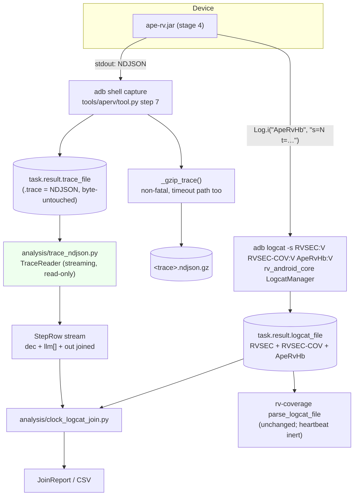

# Design — gh94: native NDJSON trace reader, gzip at collection, heartbeat tag in the capture allowlist

## Context

Stage 4 of the APE-RV re-architecture (`ape`, change `rearch-04-step-ndjson-telemetry`) replaces the jar's `[APE-STEP]` / `[APE-OUTCOME]` / `[APE-LLM-TEL]` `key=value` telemetry with one NDJSON `StepRecord` per exploration step, and adds a write-only logcat heartbeat so that steps and violations land in the same file on the same clock. That change's `event-sink` spec is the authority for the wire format; this change is its rv-android counterpart, and its scope is exactly the group-8 tasks of that plan plus the capture-side precondition its task 5.2a names.

Three facts about the current tree shape everything below.

**The trace has one production consumer of the old format.** `modules/aperv-tool/src/aperv_tool/analysis/clock_logcat_join.py` (615 lines) matches `[APE-STEP] step=N clock=<epoch ms> activity=…` with a regex at `:62-63` and places `RVSEC` violations against that series. Its sibling `analysis/coverage_dump.py` reads only the `[APE-RV] UICOV` / `UICOV-ACT` dump, which stage 4 does not touch. Everything else that parses the legacy family lives in frozen campaign scripts over an archived corpus.

**Most of the join's complexity is a clock reconstruction that the heartbeat retires.** The trace stamps `System.currentTimeMillis()`; logcat stamps local wall time with no year and no zone. `_align_clocks()` (`:348-384`) therefore searches three year candidates around the trace's own clock, rounds the difference to the nearest quarter hour, anchors on the first stamped logcat line, and keeps the remainder as `alignment_residual_ms` so a broken assumption is visible. With a per-step heartbeat inside the logcat, both series are rendered by the same clock and the module never needs an absolute conversion again — only differences between two logcat stamps, which are free of year and zone by construction.

**The heartbeat is inert unless capture admits its tag.** `LogcatManager.start_capture` (`modules/rv-android-core/src/rv_android_core/util/android/logcat_manager.py`, `default_tags` at `:66-70`, command build at `:182-200`) does not dump the ring buffer after the run — it clears the buffer and streams `adb -s <serial> logcat -v threadtime -s RVSEC:V RVSEC-COV:V` for the run's duration. `-s` is a strict device-side allowlist. A heartbeat under any other tag is discarded before it reaches the file, and the failure is silent in both directions: capture succeeds, and a join still holding its reconstruction keeps producing plausible output. Two invariants pin that command byte-for-byte — INV-CORE-37, which spells the string literally, and INV-PLT-21, which requires `LogcatComponent` to pass the baseline set when diagnostics are off — so both are amended rather than circumvented.

Requirements touched: FR11 and FR13 (analysis over recorded artifacts), FR18 and FR19 (tool execution), FR33 and FR34 (logging and diagnostics), NFR03 and NFR06.

## Architecture



The collection path and the analysis path never meet: nothing in `tool.py` imports `trace_ndjson`, and nothing in `trace_ndjson` touches a device. The only new coupling is the tag string, and it exists in exactly one place per repository.

### Key Components

| Component | Responsibility | Input | Output |
|-----------|---------------|-------|--------|
| `analysis.trace_ndjson.TraceReader` | Stream an NDJSON trace once; resolve dictionaries, materialize defaults, join `dec`/`llm[]`/`out` per step | `trace_path: Path` | `Iterator[StepRow]`, `RunStart \| None`, `TraceDiagnostics` |
| `analysis.trace_ndjson.StepRow` | One fully-joined step, dictionary references resolved to strings | — | frozen dataclass |
| `analysis.clock_logcat_join.join_run` | Place `RVSEC` violations on the step timeline using heartbeat lines | `trace_path: Path` | `RunJoin` (no `clock_offset_ms`, no `alignment_residual_ms`) |
| `analysis.clock_logcat_join._read_heartbeats` | Parse `ApeRvHb` lines from the run's `.logcat` | `logcat_path: Path` | `list[tuple[datetime, int, int]]` — stamp, step, `t_rel_ms` |
| `tools.aperv.tool._gzip_trace` | Compress the raw capture beside the trace, non-fatal | `trace_path: Path` | `None` (WARNING on failure) |
| `rv_android_core.util.logging.constants.TAG_APERV_HEARTBEAT` | Single declaration of the heartbeat tag on this side | — | `"ApeRvHb"` |
| `rv_android_core…LogcatManager.default_tags` | The device-side allowlist, now three tags | — | `[TAG_RVSEC, TAG_RVSEC_COV, TAG_APERV_HEARTBEAT]` |

## Mapping: Spec → Implementation → Test

| Requirement / Invariant | Implementation | Test |
|---|---|---|
| aperv: Native NDJSON Trace Reader | `analysis/trace_ndjson.py` `TraceReader` | `test_trace_ndjson.py::test_reader_yields_joined_step_row` (golden fixture) |
| INV-APV-48 (read-only, off the collection path) | no write API; no import from `tool.py` | `test_trace_ndjson.py::test_reader_never_imported_by_collection_path` (import-graph assertion) |
| INV-APV-49 (total defaults; tri-state preserved) | `_materialize_defaults()` over the six boosts + two outcome booleans; `patched`/`cf` left `None` | `test_trace_ndjson.py::test_boost_defaults_materialized`, `::test_tri_state_patched_not_defaulted` |
| INV-APV-50 (malformed skipped and counted) | `TraceReader._read_record()` returns `None` and increments `diagnostics.malformed`; unresolved dictionary ID takes the same branch | `test_trace_ndjson.py::test_malformed_record_skipped_and_counted`, `::test_undefined_dictionary_id_is_malformed` |
| INV-APV-51 (no fabricated clock) | `RunStart` optional; `StepRow.t_epoch_ms is None` when absent | `test_trace_ndjson.py::test_missing_run_start_reports_epoch_unavailable` |
| INV-APV-52 (gzip non-fatal, trace byte-identical) | `tool._gzip_trace()` inside `try/except`; reads the trace, writes only the `.gz` | `test_aperv_tool.py::test_gzip_at_collection_leaves_trace_byte_identical`, `::test_gzip_failure_is_non_fatal` |
| INV-APV-53 (no `RUN_END` control flow) | absence of any `RUN_END` reference in `tools/aperv/` | `test_aperv_tool.py::test_no_collection_path_reads_run_end` (source-level assertion) |
| INV-APV-54 (deletion ordered after observation) | task ordering (group 4 gated on group 3's evidence artifact) | not a unit test — discharged by `tasks.md` 4.1 and its recorded evidence |
| INV-APV-55 (frozen-corpus carve-out) | no edit to the named scripts; carve-out text in `modules/aperv-tool/CLAUDE.md` | `test_aperv_tool.py::test_frozen_corpus_scripts_untouched` (git-tracked path list) |
| aperv: Offline Clock-to-Violation Join (modified) | `clock_logcat_join.join_run` on reader rows + heartbeats | `test_clock_logcat_join.py::test_join_without_offset_reconstruction`, `::test_run_without_heartbeat_is_unaligned` |
| aperv: ApeRVTool Execution Flow step 8/10 | `tool.execute_tool_specific_logic` | `test_aperv_tool.py::test_timeout_path_runs_collection_before_reraise` |
| INV-CORE-37 (amended baseline command) | `LogcatManager.default_tags` + command build at `:182-200` | `test_logcat_manager.py::test_baseline_command_byte_identical` |
| INV-CORE-53 (tag declared once) | `util/logging/constants.py::TAG_APERV_HEARTBEAT` | `test_logcat_manager.py::test_heartbeat_tag_declared_once` |
| INV-CORE-54 (heartbeat inert to parsing) | `logcat_parser` unchanged (dispatches on two tags); `diagnostic_parser.feed_line()` amended so a foreign-tag line is transparent to block assembly instead of closing it | `test_logcat_parser.py::test_heartbeat_lines_change_no_parsed_value`, `::test_fixture_interleaves_a_heartbeat_inside_the_crash_block`, `test_diagnostic_parser.py::test_foreign_tag_line_does_not_close_the_block` |
| INV-PLT-21 (amended baseline tag set) | `components/logcat.py` (unchanged code, new expectation) | `test_logcat.py::test_flag_off_emits_baseline_command` |
| INV-ANA-56 (foreign-tag lines transparent to block assembly) | `parser/log/diagnostic_parser.py::feed_line` | `test_diagnostic_parser.py::test_foreign_tag_line_does_not_close_the_block`, `::test_separator_line_still_closes_an_open_block` |
| INV-ANA-57 (a manual caller must flush at end of input) | no change — `parse_logcat_file` flushes internally; `CoverageTracker` drains then flushes | `test_diagnostic_parser.py::test_flush_emits_last_buffered_event`, `test_result_processor.py::TestGh83TimeRoundTrip` |

## Goals / Non-Goals

**Goals:**
- One read path for stage-4 traces, used by every analysis consumer in this module, with the per-step join done by the reader instead of by each caller.
- A collection path that adds compression and nothing else — no validation, no status coupling, no rewriting of the artifact of record.
- A capture whose allowlist admits the heartbeat, with the two invariants that pin the command amended rather than bypassed, so the guard tests keep guarding.
- A join that is smaller after the change than before it, because the clock reconstruction is deleted rather than kept "just in case".

**Non-Goals:**
- No NDJSON→legacy converter, in either direction, anywhere.
- No reading of `RUN_END` for control flow, no exit contract, no task-status change (owner decision D5).
- No migration of the frozen-corpus scripts, and no change to `coverage_dump.py`.
- No throughput measurement: INV-SNK-13 is an owner-executed gate on the jar side.
- No emulator work in the planning or implementation sessions; the heartbeat-presence evidence is produced through `rv-experiment`/`rv-platform`, which own the emulator lifecycle.
- No touching of the calibration arm tier or `LLM_ARM_KEYS` in the `aperv` spec — that removal belongs to `gh95`.

## Decisions

### D-1 — One streaming pass is enough, because the format guarantees definition before reference

The jar's INV-SNK-06 requires every `ACT` / `STATE` dictionary record to appear on a line earlier than any record referencing its ID, and `RUN_START` is the first record of the trace. So a single forward pass can resolve every reference at the moment it is read: the reader keeps two `dict[int, …]` tables and consults them as it goes. No pre-pass, no seek, no whole-file parse.

*Alternative considered*: read the file twice (collect dictionaries, then rows). Rejected — it doubles I/O on the largest artifact a run produces to defend against an ordering violation that the producing spec forbids, and a violation would in any case be caught by INV-APV-50's unresolved-reference branch rather than silently mishandled.

### D-2 — Frozen dataclasses, not Pydantic models

`StepRow` and its companions follow `coverage_dump.py`: frozen dataclasses with explicit parse functions. The trace is external input, so it does get boundary validation — but the validation this reader needs is not field coercion, it is *"is this record well-formed, and if not, count it and move on"*, which is a control-flow decision Pydantic would express as an exception per record on a hot loop over millions of lines.

*Alternative considered*: Pydantic v2 models with `model_validate`. Rejected on P1 and on consistency: the module's other offline reader would then be the odd one out, and the per-record `ValidationError` path is more machinery than a `None` return.

### D-3 — The compressed copy is `<trace_path>.ndjson.gz`, appended rather than substituted

The counterpart spec names the artifact `<trace>.ndjson.gz`. Appending the suffix to the full trace path yields `<run>.trace.ndjson.gz`, which satisfies that name literally, keeps the `.trace` stem that `_RUN_FILENAME` and every sibling-file lookup key on, and cannot collide with anything.

*Alternative considered*: substituting the suffix (`<run>.ndjson.gz`). Rejected — it breaks the run-identity stem that `clock_logcat_join` and `coverage_dump` use to find a trace's `.logcat` sibling, for a cosmetic gain.

### D-4 — Violations are placed by comparing two logcat stamps, never by converting one to epoch

This is the whole reason the reconstruction dies. After the change, placement needs only:

1. the heartbeat line whose step is the last at or before the violation's stamp — a comparison between two stamps in the *same file*, in the *same rendering*;
2. that step's activity and state, looked up in the reader rows by step number.

A difference between two logcat stamps needs no year and no zone: both are unknown, both are identical, and they cancel. The month and day are present in the stamp, so a run crossing midnight is handled without a year. Where an absolute time is still wanted for reporting, it is composed forward from data the trace already carries — `t0 + hb.t_rel_ms + (violation_stamp − hb.stamp)` — rather than backward from a guessed offset.

Consequently `RunJoin` loses **both** outputs of `_align_clocks()`: `alignment_residual_ms`, which the acceptance criteria name, and `clock_offset_ms`, which holds the reconstructed UTC offset itself and has no producer left once its producer is deleted. Keeping a field whose only writer is gone would be exactly the dead-code shim P3 forbids.

*Alternative considered*: keep the reconstruction as a fallback for runs whose logcat has no heartbeat. Rejected — that is a compatibility shim by another name, and the case it defends is already handled honestly: a run with no heartbeat reports its violations as `UNALIGNED` and stays in the report with its denominator intact, which is what the module already does for arms that emit no telemetry.

### D-5 — The heartbeat stamps the start of step N, and that preserves today's attribution semantics

The jar writes the heartbeat where the step envelope is captured — at selection start, before dispatch. So a violation between heartbeat N and heartbeat N+1 is attributed to step N: "the last step at or before the violation", which is the rule the module already implements against `[APE-STEP] clock=`, itself also emitted before dispatch. The migration therefore changes the *source* of the step series without changing what a placement means, which is what makes the recorded corpus totals a usable regression check.

### D-6 — The tag goes in `default_tags`, globally, and is declared once

There is no per-tool tag channel: `LogcatComponent` builds the list from `default_tags` for every task regardless of tool. Adding the tag anywhere narrower would mean inventing that channel for one string with one subscriber. The tag emits nothing for tools that do not write under it, and INV-CORE-54 pins that it changes no parsed value, so the cost of the global default is a few bytes in the command line.

The string itself is a cross-repository contract — the jar's design D-6 names `Log.i("ApeRvHb", …)` — and a mismatch fails silently rather than loudly. It therefore lives in exactly one constant per repository, beside `TAG_RVSEC` and `TAG_RVSEC_COV` in `util/logging/constants.py`, and a test asserts the literal appears nowhere else.

*Alternative considered*: choosing a tag under the existing `RVSEC` prefix (e.g. `RVSEC-APE`) to avoid touching the allowlist at all, since `RVSEC` is already admitted. Rejected — `-s RVSEC:V` matches the tag exactly, not as a prefix, so `RVSEC-APE` would need the same allowlist edit while additionally inviting confusion with the violation stream that `logcat_parser` dispatches on by exact tag.

### D-7 — Amend the invariants, do not add exceptions to them

INV-CORE-37 and INV-PLT-21 exist to make the flag-off capture command a fixed, tested string, so that a future change cannot alter capture without someone noticing. The right move is to change the pinned string and re-pin it. The alternative — carving out "except the heartbeat tag" — would leave the invariants technically true while removing the property they were written for.

## API Design

### `TraceReader`

```python
@dataclass(frozen=True)
class RunStart:
    run_id: str
    t0_ms: int                      # epoch ms; epoch of a step = t0_ms + StepRow.t_rel_ms
    params: dict[str, str]          # the effective plan, verbatim


@dataclass(frozen=True)
class LlmCall:
    call: int
    mode: str                       # new_state | stagnation | random
    result: str                     # matched | llm_tap | no_match | error | breaker_open
    tool: str | None = None
    qwen: tuple[int, int] | None = None
    px: tuple[int, int] | None = None
    reason: str | None = None       # dead_pair | degenerate | boundary
    repair: str | None = None
    matched_class: str | None = None
    nearest_class: str | None = None
    nearest_dist: float | None = None
    widgets: int | None = None
    tokens: tuple[int, int] | None = None
    ms: int | None = None
    text: str | None = None
    cause: str | None = None        # result == "error"
    detail: str | None = None
    trips: int | None = None        # result == "breaker_open"


@dataclass(frozen=True)
class StepOutcome:
    resolved: bool                  # False only for the teardown-flushed record
    new_state: bool = False
    target_state: str | None = None
    target_activity: str | None = None
    target_activity_has_mop: bool | None = None
    activity_changed: bool = False


@dataclass(frozen=True)
class StepRow:
    step: int
    t_rel_ms: int
    t_epoch_ms: int | None          # None when RUN_START is absent (INV-APV-51)
    activity: str
    activity_has_mop: bool
    state_key: str
    action: str
    decision_source: str
    pick_channel: str
    priority: int | None = None
    mop: int = 0                    # the six boosts, materialized (INV-APV-49)
    mop_frontier: int = 0
    wtg: int = 0
    coverage: int = 0
    menu: int = 0
    form: int = 0
    wtg_source: str | None = None   # wtg | frontier | both
    mop_exposure: tuple[int, int] | None = None
    patched: int | None = None      # tri-state: None means no resolved target
    counterfactual: Counterfactual | None = None
    component: ComponentDispatch | None = None
    llm: tuple[LlmCall, ...] = ()
    outcome: StepOutcome | None = None   # None = legitimately unresolved


@dataclass
class TraceDiagnostics:
    records_read: int = 0
    steps_yielded: int = 0
    malformed: int = 0
    run_start_present: bool = False
    activities: int = 0
    states: int = 0


class TraceReader:
    def __init__(self, trace_path: Path | str) -> None: ...
    def __iter__(self) -> Iterator[StepRow]: ...
    @property
    def run_start(self) -> RunStart | None: ...
    @property
    def diagnostics(self) -> TraceDiagnostics: ...
```

**Preconditions**: `trace_path` exists and is readable. **Postconditions**: iteration yields one `StepRow` per well-formed `StepRecord`, in file order; `diagnostics` is complete once iteration is exhausted, and `run_start` is populated as soon as the `RUN_START` line has been consumed (the first record, INV-SNK-04). **Errors**: `OSError` if the file cannot be opened; nothing else propagates — a malformed line increments `diagnostics.malformed` and is skipped (INV-APV-50). **Never writes**: the reader opens the file read-only and holds no path other than the one it was given (INV-APV-48).

### `_gzip_trace(trace_path: Path) -> None`

Streams `trace_path` into `Path(str(trace_path) + ".ndjson.gz")` with `gzip.open` and `shutil.copyfileobj` (chunked, so a multi-megabyte trace never lands in memory). **Postcondition**: `trace_path` is byte-identical to its pre-call content. **Errors**: every exception is caught, logged at WARNING with the trace path, and swallowed; the `.gz` is not required to exist afterwards and no status changes (INV-APV-52).

### `clock_logcat_join.join_run(trace_path: Path | str) -> RunJoin`

Unchanged signature and unchanged return type except for the two deleted fields. Internally: heartbeats come from `_read_heartbeats(logcat_path)`, step metadata from `TraceReader(trace_path)` reduced to `dict[int, StepRow]`, and placement from `_place(violation_stamp, heartbeats)`. **Errors**: unchanged — a missing `.logcat` sibling means zero violation lines, not a failure; a missing trace path is a usage error with exit status 2 from `main`.

## Data Flow

1. **Run.** The jar writes NDJSON to stdout and one `Log.i("ApeRvHb", "s=<N> t=<tRelMs>")` per step. `tool.py` step 7 captures stdout into `task.result.trace_file`; `LogcatManager` streams the allowlisted tags into `task.result.logcat_file`.
2. **Collection.** On the normal path, step 9 checks for an empty trace and step 10 gzips it. On the timeout path, step 8 runs step 10 first and then re-raises `RVToolTimeoutError` — timeout is how a normal exploration run ends, so this is the majority path, not the exception.
3. **Analysis, trace side.** `TraceReader` streams the trace once. `RUN_START` populates `run_start`; `ACT` / `STATE` records fill the two ID tables; each `StepRecord` is resolved against them, defaulted, and emitted as a `StepRow` with its `llm[]` and `out` already attached.
4. **Analysis, logcat side.** `_read_heartbeats` extracts `(stamp, step, t_rel_ms)` from `ApeRvHb` lines; `_read_violation_lines` extracts `RVSEC` payloads as today.
5. **Join.** Each violation is placed against the last heartbeat at or before its stamp; the matched step number keys into the `StepRow` map for activity and state; the signed distance from the first heartbeat gives `seconds_from_first_step`; an absolute timestamp is composed as `t0 + hb.t_rel_ms + (violation_stamp − hb.stamp)` when `RUN_START` was present. A run with no heartbeat at all yields `UNALIGNED` violations and stays in the report.

## Error Handling

| Error | Source | Strategy | Recovery |
|---|---|---|---|
| Malformed / unparseable line | `TraceReader._read_record` | Skip, increment `diagnostics.malformed` | Row set is complete for well-formed records; the count is reported |
| Truncated final line (SIGKILL mid-write) | `TraceReader` | Same as above — one malformed record | The run's analysis survives its last line |
| Reference to undefined `ACT`/`STATE`/`out.target` ID | `TraceReader` dictionary lookup | Treat the record as malformed; never substitute a placeholder | Counted in diagnostics; no fabricated string enters a row |
| `RUN_START` absent | `TraceReader` | `run_start = None`; every `StepRow.t_epoch_ms` is `None` | Run-relative analysis is unaffected; absolute time is reported unavailable, never guessed |
| gzip failure (disk full, permissions) | `tool._gzip_trace` | Catch, WARNING with the trace path, continue | Uncompressed trace remains; task status unchanged |
| `RVCommandTimeoutError` | `tool` step 7 | Run collection, then re-raise as `RVToolTimeoutError` | Trace and `.gz` both present for a timed-out run |
| Missing `.logcat` sibling | `join_run` | Report zero violation lines for the run | Run stays in the report; the denominator survives |
| Logcat with no heartbeat lines | `join_run` | Violations reported as `UNALIGNED`; no offset reconstructed | Run stays in the report; the gap is visible rather than papered over |
| `LogcatValidationError` | `LogcatManager` tag validator | Unchanged | — |

## Risks / Trade-offs

- **[The tag string drifts between the two repositories, and the failure is a silent empty capture]** → one constant per side (INV-CORE-53), a test asserting the literal appears exactly once, and an apply-phase evidence step that greps a real captured `.logcat` for the tag before anything depends on it.
- **[The reconstruction is deleted before the heartbeat is ever observed end to end]** → encoded as a task ordering constraint (INV-APV-54): the deletion group is gated on a recorded evidence artifact from a captured run, not on a design argument. This is the same hazard, on the analysis path, that stage 4 exists to remove on the runtime path.
- **[`default_tags` is global, so every tool's baseline capture command changes]** → the change is additive and ordered (the two existing tags keep their positions), the heartbeat is inert to `parse_logcat_file` by construction and by test (INV-CORE-54), and both pinning invariants are amended with their new strings rather than weakened.
- **[Heartbeat volume competes for the shared logcat buffer]** → capture is a live stream with the buffer cleared at start, so ring-buffer eviction is not the exposure; volume is. At the measured step distribution for the 1800 s budget (median 1,603, range 150–3,158) and ~100 bytes per line, a run's heartbeat is on the order of 10⁻¹ MB. The throughput question this raises is owned by the jar side's INV-SNK-13 gate, which is why no measurement is duplicated here; AC8 of `docs/20260803_rearch_artifact_vs_code_verification.md` is the finding that put it on the record.
- **[The reader is written against a schema whose producer does not exist yet]** → the `event-sink` spec is the authority and the golden fixture is written from it field by field; the acceptance gate is regenerating the 2026-07-24 calibration report's quantities from a real trace, and any gap found there is filed as a schema fix on the jar side rather than worked around in the reader.
- **[`gh97`'s A/B capture goes dark on step-level panels if it runs between stage 4 landing and the reader existing]** → recorded in the proposal's Impact as a scheduling constraint; the primary outcomes are unaffected because they come from `tasks.json` and logcat.

## Testing Strategy

| Layer | What to test | How | Count |
|---|---|---|---|
| Unit — reader | Dictionary resolution, default materialization, tri-state preservation, `llm[]` ordering, outcome absent vs `resolved:false`, malformed counting, undefined-ID handling, missing `RUN_START` | Golden fixture `tests/fixtures/trace_ndjson_golden.ndjson`, asserted field for field against expected rows | ~14 |
| Unit — collection | Trace byte-identical after gzip; gzip failure non-fatal; timeout path runs collection before re-raising; no `RUN_END` reference on the collection path; reader not importable from `tool.py` | `tmp_path` fixtures, monkeypatched `gzip.open` for the failure case, source/import-graph assertions | ~6 |
| Unit — core | Baseline command byte-identical to the three-tag form; diagnostics flag still additive; tag literal declared once | Existing `LogcatManager` command tests, extended | ~4 |
| Unit — coverage parser | Heartbeat lines change no parsed value | Same logcat file with and without heartbeat lines, metrics compared | ~2 |
| Unit — platform | Flag-off command byte-identical; flag-on order preserved | Existing `test_logcat.py` guards, updated | ~2 |
| Integration — join | New-format trace + heartbeat logcat reproduces the join with no reconstruction; run without heartbeat is `UNALIGNED` and retained; artifacts byte-identical after the run | Fixture pair under `tests/fixtures/`, hash comparison before and after | ~5 |
| Acceptance (apply phase, device) | A captured run contains heartbeat lines under `ApeRvHb`, with `s` values matching the trace | `rv-experiment run` (platform owns the emulator); evidence recorded before the deletion group starts | 1 run |

CI contract for every pytest invocation in this module: `--import-mode=importlib -o "addopts="`.

## Open Questions

1. **Golden fixture provenance.** The stage-4 jar does not exist yet — that change's apply phase has not started — so the fixture is hand-written from the `event-sink` spec. Once a real stage-4 trace exists, is the fixture replaced by a captured sample, or kept hand-written (so it can carry the adversarial cases a real run rarely produces: NUL in an action string, a truncated final line, an undefined dictionary ID) with the captured sample added beside it? The second is the assumption here; it should be confirmed when the sample exists.
2. **Where the heartbeat-presence evidence is recorded.** INV-APV-54 gates the deletion on a captured run, but the artifact that carries that evidence — a note in the change directory, a line in the module docs, or a committed excerpt of the captured `.logcat` — is not fixed. `tasks.md` assumes a short evidence note in the change directory naming the run and the observed line count.
3. **Whether `experimento-*/scripts/*` needs a machine-readable marker.** The carve-out is normative in the spec and repeated in the module docs, but a future automated dead-code sweep reads neither. A one-line header comment in each frozen script would make it visible at the point of temptation; that is a small edit to five directories of scripts and is deliberately not in this change's scope.
