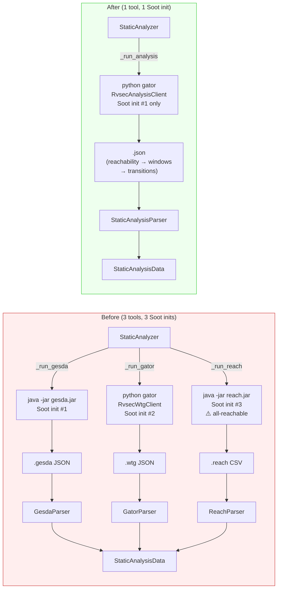
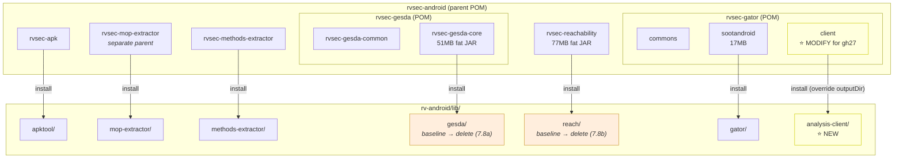
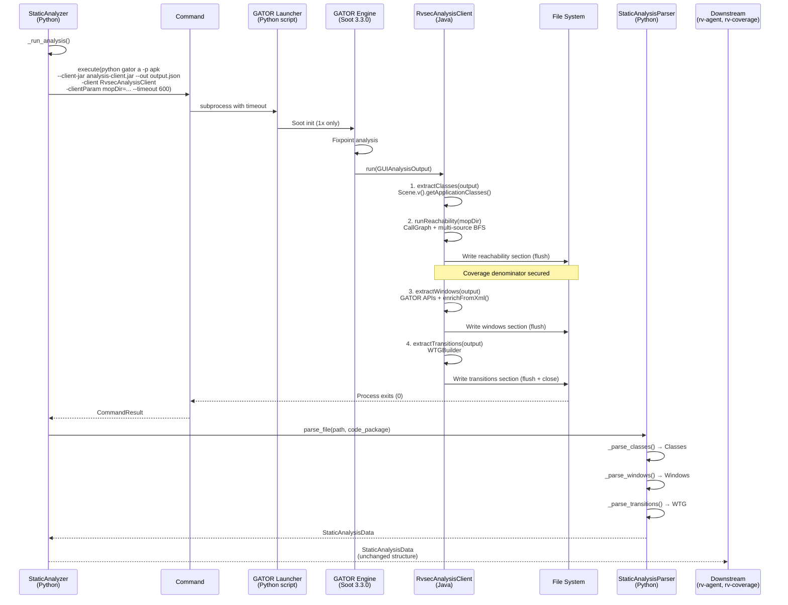
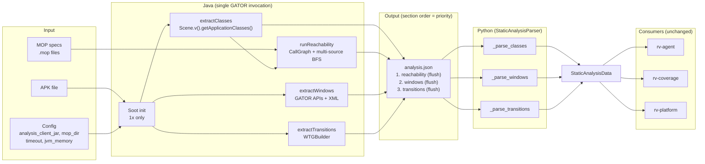

# Design: Unified Static Analysis Tool

**Change**: gh27-unified-static-analysis
**Proposal**: `proposal.md`
**Delta spec**: `specs/analysis/spec.md`
**Detailed analysis**: `plan.md` (Phase 0/1 output preserved as reference)

## Context

Three separate Java tools (GESDA, GATOR, REACH) each initialize Soot independently for every APK analyzed, producing three separate output files (`.gesda`, `.wtg`, `.reach`). This 3x redundancy, combined with the `cg all-reachable` misconfiguration, causes static analysis to timeout in gh26 experiments. See `plan.md` Section 1 for the full root cause analysis.

This design consolidates all three tools into a single GATOR client (`RvsecAnalysisClient`) that produces one analysis JSON file. The Python side is updated with a single `StaticAnalysisParser`, simplified `StaticAnalyzer`, and updated configuration. References: FR04 (GATOR), FR05 (GESDA), FR06 (REACH), NFR01 (Performance).

**Constraints**:
- GATOR uses Soot 3.3.0 (OSU fork); all Java dependencies must exclude their Soot transitive deps
- GATOR's `GUIAnalysisClient.run()` receives a fully-built `GUIAnalysisOutput` — all data extraction happens inside this single method call
- `inputType` and `entries` are not available via GATOR's `PropertyManager` — must be extracted from decoded layout XMLs
- The `StaticAnalysisData` domain model (Classes, Windows, WindowTransitionGraph) must remain unchanged for downstream consumers

## Architecture

### Before vs After



### Maven Module Hierarchy

The Java side lives in the RVSEC parent project. Each module uses `maven-resources-plugin` to copy its JAR to `rv-android/lib/` on `mvn install`.



### Key Components

| Component | Responsibility | Location |
|-----------|---------------|----------|
| `RvsecAnalysisClient` | GATOR client: extracts reachability (first), windows, WTG in single pass with incremental JSON output | `$RVSEC_HOME/rvsec/rvsec-android/rvsec-gator/client/` (Java) |
| `StaticAnalysisParser` | Parses analysis JSON into StaticAnalysisData | `modules/rv-static-analysis/src/rv_static_analysis/parser/static/static_analysis_parser.py` |
| `StaticAnalyzer` | Orchestrates single tool invocation | `modules/rv-static-analysis/src/rv_static_analysis/analysis/static/static_analysis.py` |
| `RVStaticAnalysisConfig` | Configuration with analysis tool paths and timeouts | `modules/rv-static-analysis/src/rv_static_analysis/config.py` |
| `StaticAnalysisComponent` | rv-platform integration, file copy | `modules/rv-platform/src/rv_platform/components/static_analysis.py` |

## Mapping: Spec → Implementation → Test

| Requirement / Invariant | Implementation | Test |
|------------------------|----------------|------|
| FR04+05+06 unified: Successful analysis | `StaticAnalyzer._run_analysis()` | `test_run_analysis_success` |
| FR04+05+06 unified: Windows parsing | `StaticAnalysisParser._parse_windows()` | `test_parse_windows_*` |
| FR04+05+06 unified: Transitions parsing | `StaticAnalysisParser._parse_transitions()` | `test_parse_transitions_*` |
| FR04+05+06 unified: Reachability parsing | `StaticAnalysisParser._parse_classes()` | `test_parse_classes_*` |
| FR04+05+06 unified: Inner class normalization | `StaticAnalysisParser` + `SignatureNormalizer` | `test_inner_class_normalization` |
| FR04+05+06 unified: Missing file | `StaticAnalysisParser.parse_file()` | `test_parse_missing_file` |
| FR04+05+06 unified: Partial failure | `StaticAnalysisParser._parse_*()` try/except | `test_partial_parse_failure` |
| FR04+05+06 unified: Caching | `StaticAnalyzer._execute_command()` | `test_cached_result` |
| FR04+05+06 unified: Timeout | `Command.timeout` + `kill_process_tree()` | `test_timeout_handling` |
| FR04+05+06 unified: Timeout with partial JSON | `StaticAnalysisParser` per-section parsing of truncated file | `test_partial_json_from_timeout` |
| FR04+05+06 unified: Baseline equivalence | Analysis output vs 3-tool baseline comparison | `test_baseline_equivalence` (Task 8.7) |
| FR04+05+06 unified: Coverage denominator | `CoverageTracker` init with `StaticAnalysisData` | Existing tests (unchanged) |
| INV-ANA-02: SignatureNormalizer | `StaticAnalysisParser._normalize()` calls | `test_signature_normalization` |
| INV-ANA-03: code_package filtering | `StaticAnalysisParser._parse_windows()`, `_parse_classes()` | `test_code_package_filter` |
| INV-ANA-06: Graceful degradation | Per-section try/except in `StaticAnalysisParser` | `test_partial_parse_failure` |
| INV-ANA-11: Caching | `StaticAnalyzer._execute_command()` file existence check | `test_cached_result` |

## Goals / Non-Goals

**Goals:**
- Eliminate 3x redundant Soot initialization (1 init instead of 3)
- Remove `cg all-reachable` misconfiguration
- Add process-level timeout (600s) to prevent indefinite hangs
- Produce identical `StaticAnalysisData` for downstream consumers
- Simplify the Python parsing pipeline to a single parser
- Delete old parsers and tool-specific code (P3)

**Non-Goals:**
- Changing the `StaticAnalysisData` domain model (Classes, Windows, WTG remain unchanged)
- Changing how rv-agent, rv-coverage, or rv-screen-parser consume static data
- Optimizing GATOR's fixpoint solver (out of scope — GATOR is third-party)
- Adding new static analysis capabilities beyond what GESDA+GATOR+REACH provide today
- Consolidating the GATOR Python launcher script (it remains as-is)

## Decisions

### D1: Remove `cg all-reachable` — use GATOR's default call graph

**Choice**: Use `Scene.v().getCallGraph()` inside the analysis client without `all-reachable`.

**Rationale**: `all-reachable` forces every concrete method as a CG entry point, producing a graph 10-100x larger than necessary. JCA framework classes (`javax.crypto.Cipher`, etc.) appear as call **targets** in any call graph where application code invokes them — they do not need to be entry points. FlowDroid's callback-based entry point discovery already covers all Android lifecycle callbacks.

**Alternative considered**: Enable `all-reachable` only for REACH-equivalent analysis. Rejected because the performance cost (10-100x) provides no benefit — all JCA reachability queries work correctly with the default CG.

**Fallback**: If testing reveals missing reachability for specific APKs, GATOR supports `-withCHA` which enables CHA (resolves all virtual calls via class hierarchy, no entry points needed, fast).

### D2: Multi-source BFS on JGraphT graph — boolean-only reachability

**Choice**: Build a JGraphT `DefaultDirectedGraph` from Soot's `CallGraph` and compute all three reachability flags via multi-source BFS. No paths stored — only boolean flags per method.

**Rationale**: Downstream consumers (rv-agent, rv-coverage) only use boolean flags (`reachable`, `reachesMop`, `directlyReachesMop`). Paths were never consumed outside the REACH tool itself. Without path requirements, the optimal algorithm is multi-source BFS — not Dijkstra shortest path:

1. **`reachable`**: Multi-source BFS forward from ALL entry points simultaneously. Every visited node is reachable. Single traversal: O(V + E).
2. **`reachesMop`**: Multi-source BFS on the **reverse graph** (`EdgeReversedGraph`) from ALL MOP methods. Every visited node reaches MOP. Single traversal: O(V + E).
3. **`directlyReachesMop`**: For each app method, check if any outgoing edge targets a MOP method. Single scan: O(E).

Total: O(V + E) — optimal for graph reachability. No `ReachabilityStrategy` interface needed (P1: single known-best algorithm, no abstraction for one implementation).

| Approach | Complexity | Context |
|----------|-----------|---------|
| REACH (SootBFS per method) | O(M × E) | M methods × independent BFS each |
| Dijkstra with caching | O(V × (V + E log V)) | All-pairs shortest path — overkill for boolean queries |
| **Multi-source BFS** | **O(V + E)** | 2 traversals + 1 scan — **optimal** |

JGraphT provides `DefaultDirectedGraph` (efficient adjacency structure), `EdgeReversedGraph` (O(1) reverse view without copying), and `Graphs.successorListOf()` (clean iteration API).

**Alternative considered**: JGraphT `DijkstraShortestPath` with caching. Rejected because Dijkstra computes paths, not just reachability — unnecessary overhead when only boolean flags are needed.

### D3: Extract inputType/entries from decoded layout XMLs

**Choice**: Parse `Configs.resourceLocation/layout/{name}.xml` with a standard Java DOM parser.

**Rationale**: GATOR's `PropertyManager` does not expose `inputType` or `entries`. However, GATOR decodes APK resources via apktool, and the decoded XML files are available at `Configs.resourceLocation`. The `android:inputType` attribute is decoded to string names by apktool (e.g., `"textPassword"`), so no integer-to-name mapping is needed. For `android:entries`, the `@array/name` reference must be resolved from `res/values/arrays.xml`.

**Alternative considered**: Skip these fields entirely. Rejected because the user explicitly requested retaining them for LLM prompt enrichment.

### D4: Fat JAR via maven-assembly-plugin

**Choice**: Bundle JGraphT, rvsec-mop-extractor, and rvsec-apk into a single `rvsec-analysis-client.jar` using `maven-assembly-plugin` with `jar-with-dependencies`.

**Rationale**: The GATOR launcher passes a single `--client-jar` path. A fat JAR avoids classpath complexity. The project uses `maven-assembly-plugin` (same pattern as `rvsec-reachability`). Dependencies already on GATOR's classpath (`rvsec-gator-sootandroid` and its transitive Soot 3.3.0) are declared as `<scope>provided</scope>` — the assembly plugin excludes `provided` scope by default.

**Implementation**: Modify `rvsec-gator/client/pom.xml`. The current client is a thin JAR (10KB) with only `rvsec-gator-sootandroid` + Gson. The analysis client adds JGraphT, mop-extractor, and apk-reader. The `maven-resources-plugin` output directory is overridden from the parent's `lib/gator/` to `lib/analysis-client/`.

```xml
<!-- rvsec-gator/client/pom.xml changes -->
<properties>
    <final.jar.name>rvsec-analysis-client</final.jar.name>
</properties>

<dependencies>
    <!-- On GATOR's classpath at runtime (provided = compile-only, not packaged) -->
    <dependency>
        <groupId>br.unb.cic</groupId>
        <artifactId>rvsec-gator-sootandroid</artifactId>
        <scope>provided</scope>
    </dependency>
    <dependency>
        <groupId>com.google.code.gson</groupId>
        <artifactId>gson</artifactId>
    </dependency>
    <!-- New dependencies (bundled in fat JAR) -->
    <dependency>
        <groupId>org.jgrapht</groupId>
        <artifactId>jgrapht-core</artifactId>
    </dependency>
    <dependency>
        <groupId>br.unb.cic</groupId>
        <artifactId>rvsec-mop-extractor</artifactId>
        <exclusions>
            <exclusion>
                <groupId>org.soot-oss</groupId>
                <artifactId>soot</artifactId>
            </exclusion>
            <exclusion>
                <groupId>ca.mcgill.sable</groupId>
                <artifactId>soot</artifactId>
            </exclusion>
        </exclusions>
    </dependency>
    <dependency>
        <groupId>br.unb.cic</groupId>
        <artifactId>rvsec-apk</artifactId>
        <exclusions>
            <exclusion>
                <groupId>de.fraunhofer.sit.sse.flowdroid</groupId>
                <artifactId>soot-infoflow</artifactId>
            </exclusion>
            <exclusion>
                <groupId>de.fraunhofer.sit.sse.flowdroid</groupId>
                <artifactId>soot-infoflow-android</artifactId>
            </exclusion>
        </exclusions>
    </dependency>
</dependencies>

<build>
    <finalName>${final.jar.name}</finalName>
    <plugins>
        <!-- Fat JAR (same pattern as rvsec-reachability) -->
        <plugin>
            <groupId>org.apache.maven.plugins</groupId>
            <artifactId>maven-assembly-plugin</artifactId>
            <configuration>
                <descriptorRefs>
                    <descriptorRef>jar-with-dependencies</descriptorRef>
                </descriptorRefs>
                <finalName>${final.jar.name}</finalName>
                <appendAssemblyId>false</appendAssemblyId>
            </configuration>
            <executions>
                <execution>
                    <phase>package</phase>
                    <goals>
                        <goal>single</goal>
                    </goals>
                </execution>
            </executions>
        </plugin>
        <!-- Override parent copy target: lib/gator/ → lib/analysis-client/ -->
        <plugin>
            <groupId>org.apache.maven.plugins</groupId>
            <artifactId>maven-resources-plugin</artifactId>
            <executions>
                <execution>
                    <id>copy-resource-one</id>
                    <phase>install</phase>
                    <goals><goal>copy-resources</goal></goals>
                    <configuration>
                        <outputDirectory>${main.basedir}/rv-android/lib/analysis-client</outputDirectory>
                        <overwrite>true</overwrite>
                        <resources>
                            <resource>
                                <directory>${project.build.directory}</directory>
                                <includes>
                                    <include>${final.jar.name}.jar</include>
                                </includes>
                            </resource>
                        </resources>
                    </configuration>
                </execution>
            </executions>
        </plugin>
    </plugins>
</build>
```

**Build command**: `cd $RVSEC_HOME/rvsec/rvsec-android/rvsec-gator/client && mvn clean install -DskipTests`
**Result**: `rv-android/lib/analysis-client/rvsec-analysis-client.jar`

### D5: JSON section ordering — reachability first

**Choice**: Write sections in order: `reachability` → `windows` → `transitions`. Flush after each section.

**Rationale**: The `reachability` section defines the method universe — the denominator for all coverage calculations. Coverage.aj (the runtime aspect woven into instrumented APKs) logs `<className: returnType method(params)>` to logcat with tag `RVSEC-COV` using a HashSet for dedup. The coverage module computes `method_coverage = called_methods / total_reachable_methods`. Without the reachability section, coverage is 0/0 — meaningless.

By writing `reachability` first, a timeout that interrupts the tool after the first section still preserves the most critical data: the complete method universe. Windows and transitions are used by rv-agent for navigation guidance, but the agent can function (less optimally) without them. Coverage cannot function at all without the method universe.

The Java client uses `JsonWriter` with explicit `flush()` after each section's closing bracket. On timeout, the outer JSON object may be unclosed (e.g., `{"reachability": [...], "windows": [`), making the file not strictly valid JSON. The `StaticAnalysisParser` must handle this: attempt `json.loads()` first; on `JSONDecodeError`, find the position of the last complete `]` bracket, truncate the content there, close the JSON object with `}`, and retry parsing. This recovers all fully-written sections from a truncated file with ~10 lines of code and no external dependencies.

**Signature format compatibility**: Coverage.aj uses `method.getDeclaringClass().getName()` which produces the same format as `SootMethod.getSignature()`: `<class: returnType name(params)>`. Both use JVM `$` notation for inner classes. The Java client uses these same APIs (D7), so the JSON output matches runtime signatures exactly. `SignatureNormalizer` in Python is applied as defense-in-depth (should be no-op).

### D6: Single `.json` extension for analysis output

**Choice**: Use `.json` extension for the analysis output file.

**Rationale**: The analysis JSON contains all three data sections. Using a descriptive extension avoids confusion with the previous `.gesda`/`.wtg`/`.reach` extensions. The `EXTENSION_STATIC_ANALYSIS = ".json"` constant is added to `rv-android-core/constants.py`.

### D7: Normalize at the source — Java writes `$` notation, Python is safety net

**Choice**: The Java `RvsecAnalysisClient` writes all class names using `SootClass.getName()` (JVM notation with `$` for inner classes). The Python `SignatureNormalizer` remains applied as defense-in-depth but should be a no-op on correctly-generated JSON.

**Context (from `rvsec-regerar-resultados/docs/NOVO/06_normalizacao_inner_classes.md`)**: During result regeneration from legacy experiments, inner class notation mismatches between Soot (`$`) and AspectJ (`.`) caused 10M+ warnings for 2 APKs and 50% performance degradation. The root cause: GESDA and GATOR used different Soot APIs that sometimes returned `.` notation for inner classes (Java source format) instead of `$` (JVM bytecode format). The `SignatureNormalizer` was implemented to convert `.` → `$` with a heuristic (`_is_likely_inner_class()` — both parts start with uppercase and outer part is not a known package name).

**Known edge case — Package.Class where Package == Class**: The `ZoomView.ZoomView` case (package named same as class) causes the heuristic to fail because the normalizer cannot distinguish between `Outer.Inner` (inner class → convert to `$`) and `Package.Class` (package separator → keep `.`). AspectJ incorrectly logs these as `ZoomView$ZoomView`. This cannot be solved by the normalizer alone.

**Why normalize in Java, not Python**:
1. `SootClass.getName()` already returns `$` notation — it's the canonical JVM representation
2. Since we're writing a NEW Java client, we control which Soot API is called for every class name. Using `SootClass.getName()` and `SootMethod.getSignature()` consistently prevents the GESDA/GATOR inconsistency at the source
3. The JSON becomes a reliable artifact — all class names use `$`, matching Coverage.aj runtime output exactly
4. Python `SignatureNormalizer` remains as safety net (INV-ANA-02) but should log a warning if it actually changes anything — that would indicate a bug in the Java client

**Package filtering stays in Python (NOT in Java)**:
- `PackageDetector` (rv-android-core, 653 lines) runs in Python using Androguard to analyze AndroidManifest components
- ~27.5% of APKs have `manifest_package ≠ code_package` (game engines, forks, wrappers — see `rvsec-regerar-resultados/docs/NOVO/07_pacotes.md`)
- The Java client does not have access to `code_package` — Soot loads classes based on its own heuristics which may use the manifest package
- `StaticAnalysisParser` filters by `App.code_package` (INV-ANA-03) — this is the correct layer because Python has access to `PackageDetector`

**Alternative considered**: Pass `code_package` as `-clientParam` to Java for filtering. Rejected because Soot's class loading already happened before the GATOR client runs — if Soot loaded classes using the manifest package (wrong for 27.5% of APKs), filtering in Java wouldn't recover the missing classes. The Python parser filtering is more robust because it acts on whatever Soot did load.

**Validation strategy**: See Task Group 4.7 (Java-side) and 8.10 (Python-side) for concrete normalization validation.

## API Design

### `StaticAnalysisParser.parse_file(file_path: str, package: str) -> StaticAnalysisData`

Parses the static analysis JSON into `StaticAnalysisData`. Standalone class with `LoggingManager` for logging.

- **Preconditions**: `file_path` is a string path (may not exist), `package` is the `code_package` from `App.code_package`
- **Postconditions**: Returns a valid `StaticAnalysisData` (possibly with empty sections on failure)
- **Error behavior**: Missing file → warning log + empty `StaticAnalysisData`. Truncated JSON (from timeout) → attempt recovery by closing at last complete `]` bracket, parse recovered content. Malformed section → error log + empty domain object for that section, other sections parsed normally (INV-ANA-06).

### `StaticAnalyzer._run_analysis() -> None`

Executes the analysis tool as a single `Command` invocation.

- **Preconditions**: `self.config.analysis_client_jar` exists, `self.config.mop_dir` exists
- **Postconditions**: `self.analysis_file` points to the output JSON path (may or may not exist depending on success/timeout)
- **Error behavior**: Non-zero exit → `StaticAnalysisException`. Timeout → `RVCommandTimeoutError` caught, `result.timed_out = True`.

### `RVStaticAnalysisConfig` (Pydantic model changes)

```python
# REMOVED fields:
# gesda_jar: Optional[str]
# gator_dir: Optional[str]
# reach_jar: Optional[str]

# ADDED fields:
analysis_client_jar: Optional[str] = Field(default=None, description="Path to analysis client JAR")
jvm_memory: str = Field(default="8g", description="JVM max heap for analysis tool")
analysis_timeout: float = Field(default=600.0, description="Timeout in seconds")
```

### `StaticAnalysisResult` (Pydantic model changes)

```python
# REMOVED fields:
# gesda_file: str
# gator_file: str
# reach_file: str

# ADDED fields:
analysis_file: str      # Path to analysis JSON output
timed_out: bool        # True if analysis exceeded timeout
```

## Data Flow



### Data Flow (component view)



## Error Handling

| Error | Source | Strategy | Recovery |
|-------|--------|----------|----------|
| `StaticAnalysisException` | Non-zero exit code from analysis tool | Log error, set `result.success = False` | Experiment continues without static data; rv-agent falls back to algorithmic exploration |
| `RVCommandTimeoutError` | `Command.timeout` exceeded | Kill process tree, set `result.timed_out = True` | Same as above |
| `ConfigurationError` | Missing `analysis_client_jar` or `mop_dir` | Raised during config validation | Fail fast — cannot proceed without tool |
| `JSONDecodeError` | Malformed/truncated analysis JSON | Catch in `StaticAnalysisParser`: attempt truncation recovery (find last complete `]`, close JSON), re-parse. If recovery fails, log error | Return recovered `StaticAnalysisData` (partial sections) or empty `StaticAnalysisData` on total failure |
| Per-section parse error | Malformed data in one JSON section | Catch per-section, log error (INV-ANA-06) | Return empty domain object for that section; other sections parsed normally |
| File not found | `.json` output does not exist | Log warning in `StaticAnalysisParser` | Return empty `StaticAnalysisData` |

## Risks / Trade-offs

| Risk | Impact | Mitigation |
|------|--------|------------|
| GATOR CG missing non-GUI reachable methods | Some methods incorrectly marked unreachable | Supplement with CHA via `-withCHA` flag if needed |
| `PropertyManager.getHintOfView()` may not exist | `hint` field empty for all widgets | Extract from decoded XML (same approach as inputType/entries) |
| Soot 3.3.0 vs rvsec-mop-extractor compatibility | Build failure or runtime error | Exclude Soot from transitive deps; test build early (Task Group 1, task 1.4) |
| `Configs.clientParams` may not propagate `-clientParam` | mopDir not available in client | Verify in Task Group 1; fallback: pass via system property |
| Combined inputType flags in XML (e.g., `"textPassword\|textVisiblePassword"`) | Incorrect parsing | Handle pipe-separated flags, take first value |
| JCA classes as phantom refs without rt.jar | `reachesMop`/`directlyReachesMop` broken for instance methods (update, digest, init, doFinal) — only static methods (getInstance) appear | Add `--jre` to GATOR launcher (Spike Q6); reuse existing `rt_jar` config field |
| Reachability differences (no `all-reachable`) | Some methods marked differently than before | Expected and acceptable — document differences against baseline |

## Verification Spike (Pre-Implementation)

Before starting Task Group 1, a lightweight verification spike MUST answer the 6 Open Questions listed below. Each question has a concrete verification command and a fallback strategy already defined in the respective task. The spike prevents wasted implementation effort if assumptions are wrong.

**Reference APK**: All spike verifications use `cryptoapp.apk` — a custom app built by our team for validation. Source code at `examples/cryptoapp/`, pre-built APK at `apks_examples/cryptoapp.apk`, package `br.unb.cic.cryptoapp`. We control the source, so we know exactly what the analysis should produce: 4 Activities, JCA calls (Cipher, MessageDigest, Mac, KeyPairGenerator) with both static and instance methods, unreachable methods (`unreachableEncrypt()`, `unreachableHash()`), XML+programmatic listeners, Spinner with entries. See `plan.md` Section 10 for the full reference.

| Q# | Verification | Expected | Fallback |
|----|-------------|----------|----------|
| Q1 | `grep -r "getHintOfView" $RVSEC_HOME/rvsec/rvsec-android/rvsec-gator/` | Method exists in PropertyManager | Extract hint from decoded XML (Task 2.2) |
| Q2 | Create minimal GATOR client that logs `Scene.v().getCallGraph().size()` | CG size > 0 | Trigger with `PackManager.v().getPack("cg").apply()` (Task 1.6) |
| Q3 | `grep -A 10 "clientParam" lib/gator/gator` | Launcher propagates to `Configs.clientParams` | Pass via `-DmopDir=<path>` system property (Task 1.2) |
| Q4 | `apktool d cryptoapp.apk -o /tmp/cryptoapp && grep -r "android:entries" /tmp/cryptoapp/res/layout/` | `@array/name` reference (not inline) | Parse `res/values/arrays.xml` (Task 3.4) |
| Q5 | `find $RVSEC_HOME/rvsec/rvsec-mop-extractor -name "*.java" -exec grep -h "^import soot\." {} \; \| sort -u` | Only Scene, SootClass, SootMethod (compatible with 3.3.0) | Regex-based `.mop` parser (Task 1.4) |
| Q6 | Add `--jre` to GATOR launcher, run test client on `cryptoapp.apk` with/without rt.jar, compare CG edges for JCA instance methods | `update()`, `digest()`, `init()`, `doFinal()` present WITH rt.jar; absent WITHOUT | Test with Sable `android-platforms` enhanced JARs (Task 0.6) |

**Q6 detail**: Without `rt.jar`, JCA classes are phantom references with no active body. Static calls (`MessageDigest.getInstance()`) are resolved from the call site in app code, but instance calls (`md.update()`, `md.digest()`) require the class hierarchy from the active body for virtual dispatch. REACH and GESDA solve this by passing `rt.jar` via `set_soot_classpath()` + `set_prepend_classpath(true)`. GATOR's `Main.java` accepts `-jre` and includes it in `computeClasspath()`, but the launcher never passes it. The spike must confirm the fix and update all artifacts.

The spike results are recorded as comments in the respective tasks. No separate document needed — answers go directly into the task checklist.

## Dangling References Checklist

After deleting old parsers (Task 7.4-7.5), grep these modules for dangling imports:

```bash
grep -r "gesda_parser\|gator_parser\|reach_parser\|GesdaParser\|GatorParser\|ReachParser" modules/
grep -r "EXTENSION_GESDA\|EXTENSION_GATOR\|EXTENSION_REACH" modules/
grep -r "gesda_file\|gator_file\|reach_file" modules/
```

Critical modules to verify: `rv-android-core` (constants origin — **known hit**: defines `EXTENSION_GESDA`, `EXTENSION_GATOR = ".wtg"`, `EXTENSION_REACH`; task 5.1 adds `EXTENSION_STATIC_ANALYSIS` and old constants must be removed), `rv-static-analysis` (parser + tests + CLI — **known hit**: `__main__.py` has 15+ refs to `--gesda-jar`, `--gator-dir`, `--reach-jar`, tool choices `['gesda', 'gator', 'reach']`, and result display with `result.gesda_file/gator_file/reach_file`; also `base_parser.py` becomes dead code after removing child parsers), `rv-platform` (StaticAnalysisComponent), `rv-experiment` (orchestration — **known hit**: `constants.py` re-exports `EXTENSION_GESDA`/`EXTENSION_REACH` and defines inconsistent `EXTENSION_GATOR = ".gator"`; `get_static_analysis_source_path()` uses extension args; `config.py` `get_static_analysis_config()` must provide new fields `analysis_client_jar`, `jvm_memory`, `analysis_timeout`), `rv-coverage` (static data consumer), `rv-agent` (WTG consumer — **known hit**: 3 unit tests + 1 online test use `StaticAnalysisParser.parse()` with 3-file API and `.reach/.wtg/.gesda` fixtures), `rv-agent-validation` (**known hit**: extensive 3-file pattern in production code — `runner.py` builds 3 paths + calls `parse()`, `config.py` globs for `.reach/.wtg/.gesda`, `instrumentation.py` has 14+ references; tests also affected).

## Testing Strategy

| Layer | What | How | Count |
|-------|------|-----|-------|
| **Java Unit** | MOP signature loading (`loadMopSignatures`) | `.mop` fixture files, assert (class, method) pairs | ~4 tests |
| **Java Unit** | Multi-source BFS (`reachable`, `reachesMop`, `directlyReachesMop`) | Synthetic JGraphT graph, known topology | ~4 tests |
| **Java Unit** | JSON output structure | Serialize mock data, validate keys/types/order | ~3 tests |
| **Java Unit** | XML inputType/entries parsing | Layout XML fixture, pipe flags, @array refs | ~4 tests |
| **Java Integration** | `RvsecAnalysisClient.run()` on `cryptoapp.apk` | Full GATOR run, assert non-empty sections + MOP flags + `$` notation | ~6 assertions |
| **Java Integration** | Baseline comparison (Java side) | Compare counts vs saved 3-tool baseline. Exact: windows, transitions, methods, directlyReachesMop. ±10%: reachable, reachesMop | ~6 assertions |
| Python Unit | `StaticAnalysisParser` parsing logic | JSON fixtures, mock file paths | ~12 tests |
| Python Unit | `RVStaticAnalysisConfig` validation | Direct instantiation with valid/invalid configs | ~4 tests |
| Python Unit | `StaticAnalyzer._run_analysis()` command construction | Mock `Command`, verify args | ~3 tests |
| Python Integration | Full parse pipeline (JSON → StaticAnalysisData) | Real `cryptoapp.apk.json` fixture | ~3 tests |
| Python Integration | `StaticAnalysisParser` full pipeline | End-to-end with fixture | ~2 tests |
| Baseline comparison | Analysis output vs 3-tool output (Python side) | Compare counts against saved baseline. Same tolerances as Java integration | ~3 assertions |
| Baseline comparison | Timeout with partial output | Truncated JSON fixture — valid sections parsed, missing sections return empty | ~2 tests |
| Batch | 5 diverse APKs from gh26 | Full pipeline execution, measure timing | Manual verification |
| **E2E** | **Full rv-experiment run** | **Run complete experiment on `cryptoapp.apk` via Docker, validate entire pipeline** | **Final validation** |

**Java test fixtures**: `rvsec-gator/client/src/test/resources/` — MOP spec files (`test-specs/`), layout XMLs (`test-layouts/`), baseline counts (`baseline/cryptoapp_baseline.json`).

**Python test fixture**: `tests/resources/cryptoapp.apk.json` — generated from a real analysis tool run on `cryptoapp.apk`. This fixture drives all unit and integration tests for the parser.

### E2E Validation (Final Gate)

The last validation step before closing gh27 is a full `rv-experiment` run using the analysis tool. This exercises the entire pipeline: pre-processing (instrumentation + static analysis) → execution (rv-agent with coverage logging) → post-processing (logcat parsing + coverage calculation + result aggregation).

**What to run**:
```bash
uv run rv-experiment run --tools rvagent:pure_algorithm --apks-dir ./apks_examples \
    --specification-set jca --timeout 60 --name gh27_e2e_validation
```

**What to validate**:

| Check | Criteria | How to verify |
|-------|----------|---------------|
| Analysis JSON created | `.json` file exists in `out/static/` | `ls out/static/cryptoapp.apk.json` |
| Coverage denominator > 0 | `StaticAnalysisData.classes` has methods | Check experiment log: `static_analysis_data` summary |
| Coverage > 0% | At least some methods logged by Coverage.aj | Check `results/<id>/cryptoapp.apk/*.logcat` for `RVSEC-COV` lines |
| Coverage calculation correct | `method_coverage` and `mop_method_coverage` computed | Check `results/<id>/cryptoapp.apk/*_results.json` |
| MOP violations detected | `RVSEC` tag lines in logcat (if JCA spec violations present) | `grep "RVSEC" results/<id>/cryptoapp.apk/*.logcat` |
| No regressions vs 3-tool run | Coverage numbers comparable to previous experiment (`cli_experiment_20260219`) | Compare `method_coverage` values |
| Timing improvement | Analysis run < sum of 3 individual tools | Compare `static_analysis_duration` in results |

**Comparison baseline**: `docker/data/results/cli_experiment_20260219_095634_21537073/cryptoapp.apk/` — the most recent experiment run using the 3-tool pipeline. The `.logcat` file there shows 8 methods logged for a 60s run with `rvagent:pure_algorithm`.

## Data Compatibility Matrix

The gh27 JSON is the coverage denominator. The coverage numerator comes from runtime logging (Coverage.aj → logcat). For coverage % to be correct, the signatures in the JSON must **exactly match** the signatures logged at runtime. This section documents the 4 data producers in the pipeline, their output formats, and the 3 matching points where format compatibility is critical.

### Data Producers

| # | Producer | Output | Signature Format | Inner Class Notation | Example |
|---|----------|--------|-----------------|---------------------|---------|
| P1 | `RvsecAnalysisClient` (gh27 Java) | `.json` (reachability section) | Soot signature via `SootMethod.getSignature()` | `$` (Soot native: `SootClass.getName()`) | `<com.example.Outer$Inner: void method(int)>` |
| P2 | `Coverage.aj` (runtime aspect) | `RVSEC-COV` logcat tag | Soot-like via reflection: `method.getDeclaringClass().getName()` + `getReturnType()` + `getName()` | `$` (JVM native: `Class.getName()`) | `<com.example.Outer$Inner: void method(int)>` |
| P3 | MOP monitors / `ErrorCollector` | `RVSEC` logcat tag | `StackTraceElement.toString()` via `ViolationRecorder.getLineOfCode()` | `.` (StackTrace format) | `com.example.Outer$Inner.method(File.java:42)` |
| P4 | `rvsec-mop-extractor` (`MopFacade`) | CSV (class, method columns) | Class+method name only — no params, no return type | `$` (Soot: `SootClass.getName()`) | `com.example.Outer$Inner, getInstance` |

**Key differences**: P1 and P2 produce full Soot signatures with params and return type — they should match exactly. P3 produces `StackTraceElement` format (no params, no return type, includes file:line). P4 produces class+method only — deliberately collapses overloaded methods.

### Matching Points

| Match | Numerator (runtime) | Denominator (static) | Granularity | Format Compatibility |
|-------|---------------------|---------------------|-------------|---------------------|
| **M1: Coverage %** | P2 (RVSEC-COV) | P1 (JSON `reachable_methods`) | Full Soot signature | **Exact match required**. Both use `$` for inner classes. P2 uses `Class.getName()` (JVM) which matches P1's `SootClass.getName()` (Soot). Param types may differ in edge cases (JVM reflection vs Soot analysis — see note below). |
| **M2: MOP Coverage %** | P2 (RVSEC-COV) filtered by `directlyReachesMop` | P1 + P4 (JSON `directlyReachesMop` flag) | Full Soot signature for coverage, class+method for MOP flag | **Exact match for coverage**. The `directlyReachesMop` flag in JSON is set by P4's class+method matching — overloaded methods are ALL marked if ANY overload is monitored. This is by design in `MopFacade.java`. |
| **M3: MOP Errors** | P3 (RVSEC logcat) | P1 (JSON classes) | Class+method only (approximate) | **Approximate match only**. P3 format (`class.method(file:line)`) has no params or return type. Correlation with JSON uses `ErrorDescription` regex `([\w+\.\$]+)[.](\<?\w+\>?)\((.+)\)` to extract class and method. Cannot distinguish overloaded methods. |

**Note on M1 edge cases**: `Coverage.aj` uses Java reflection (`method.getDeclaringClass().getName()`) while `RvsecAnalysisClient` uses Soot's `SootClass.getName()`. Both return `$` for inner classes. For primitive types, Soot uses full names (`int`, `boolean`) while reflection uses the same. For array types, Soot uses `type[]` while reflection uses `[Ltype;` — however, this rarely occurs in practice because the `<class: returnType method(params)>` format is constructed identically by both. The E2E validation (Task Group 10) confirms format compatibility end-to-end.

### MOP Extractor — Overloading Behavior

The `rvsec-mop-extractor` (P4) matches methods by class+method name only (`MopFacade.java` lines 72-75):

```java
mopMethod.getClassName().equals(invokeMethod.getDeclaringClass().getName())
    && mopMethod.getName().equals(invokeMethod.getName())
```

This means overloaded methods are collapsed:
- `Cipher.init(int, Key)` and `Cipher.init(int, Key, AlgorithmParameterSpec)` are BOTH marked `directlyReachesMop = true` if ANY `Cipher.init` variant appears in a MOP spec
- `MessageDigest.getInstance(String)` and `MessageDigest.getInstance(String, Provider)` are BOTH marked as MOP

This is the correct behavior for RV purposes: the MOP monitor instruments ALL overloads of a monitored method. The `directlyReachesMop` flag in the gh27 JSON must reproduce this same class+method-only matching to remain consistent with the MOP monitor's actual instrumentation scope.

### Validation APK Candidates

The legacy analysis (`rvsec-regerar-resultados/docs/NOVO/`) identified concrete APKs where normalization, package detection, or format matching had problems. These APKs are strong validation candidates because they stress the exact boundaries the gh27 pipeline must handle. All are available in `/home/pedro/desenvolvimento/RV_ANDROID/NOVO/APKS/`.

**Inner class normalization (tests D7 — Java `$` normalization + Python safety net):**

| APK | Problem | What to Validate |
|-----|---------|-----------------|
| `org.secuso.privacyfriendlyludo_5.apk` | Parcelable with mixed notation: Soot writes `Map.GameFieldPosition`, AspectJ writes `Map$GameFieldPosition`. 4 methods affected (0.0015%) | Java client must write `$` via `SootClass.getName()`. JSON should have `Map$GameFieldPosition`. Python normalizer should be a no-op (zero changes logged) |
| `com.hwloc.lstopo_271.apk` | **KNOWN LIMITATION**: `ZoomView.ZoomView` — package named same as class. Soot writes `.`, AspectJ writes `$`. Normalizer cannot distinguish `Outer.Inner` from `Package.Class` | Document as known limitation. If this APK appears in experiments, expect ~184 methods with mismatched signatures. Not fixable without Soot metadata |
| `tranquvis.simplesmsremote_140.apk` | Same `ZoomView.ZoomView` pattern | Same as lstopo — known limitation |

**Package mismatch (tests code_package filtering via PackageDetector):**

| APK | Manifest Package | Real Code Package | What to Validate |
|-----|-----------------|-------------------|-----------------|
| `ir.hsn6.trans_4.apk` | `ir.hsn6.trans` | `org.godotengine.godot` | PackageDetector must return `org.godotengine.godot`. JSON filtered by code_package must contain Godot classes, not `ir.hsn6.*` classes |
| `org.fox.tttrss_535.apk` | `org.fox.tttrss` | `org.fox.ttrss` | Subtle typo (3 t's vs 2 t's). PackageDetector must return the correct 2-t variant. Filtering by wrong package → 0 methods |
| `edu.cmu.cylab.starslinger.demo_17301504.apk` | `edu.cmu.cylab.starslinger.demo` | `edu.cmu.cylab.starslinger.demo` + `edu.cmu.cylab.starslinger.exchange` | Multi-package APK. code_package prefix `edu.cmu.cylab.starslinger.demo` should include `demo.*` classes but also `exchange.*` classes (same prefix root). Tests prefix-based filtering behavior |
| `com.easytarget.micopi_32.apk` | `com.easytarget.micopi` | `org.eztarget.micopi.ui` | Complete rebranding. PackageDetector must detect `org.eztarget.*` as code_package, not `com.easytarget.*` |
| `net.yolosec.routerkeygen2_80.apk` | `net.yolosec.routerkeygen2` | `org.exobel.routerkeygen` | Complete rebranding. Same validation as micopi |

**MOP violations (tests M1/M2/M3 matching end-to-end):**

| APK | Known Violations | What to Validate |
|-----|-----------------|-----------------|
| `cryptoapp.apk` | JCA violations (MessageDigest, Cipher, Mac, KeyPairGenerator). **Primary test APK** — custom app built by our team, source at `examples/cryptoapp/`, pre-built at `apks_examples/cryptoapp.apk`. 4 Activities, `unreachableEncrypt()`/`unreachableHash()` for reachability validation, diverse widgets (Spinner with entries, XML+programmatic onClick, OptionsMenu) | All 3 matching points: M1 (RVSEC-COV vs JSON), M2 (directlyReachesMop flag), M3 (RVSEC errors vs JSON classes). Also validates: window/widget extraction, WTG transitions, reachability flags (unreachable methods must be NOT reachable), rt.jar impact (Spike Q6) |

**Batch validation (Task Group 10, batch test):** When running the "5 diverse APKs" batch test, select from this list to maximize coverage of edge cases:
1. `cryptoapp.apk` — baseline, known MOP violations
2. `org.secuso.privacyfriendlyludo_5.apk` — inner class normalization
3. `ir.hsn6.trans_4.apk` — package mismatch (Godot)
4. `org.fox.tttrss_535.apk` — subtle package typo
5. `edu.cmu.cylab.starslinger.demo_17301504.apk` — multi-package

### Verification During Implementation

These checks MUST be performed during E2E validation (Task Group 10) to confirm data compatibility:

1. **M1 format check**: Extract a `RVSEC-COV` line from the `.logcat` and verify it matches a `reachable_methods` entry in the JSON character-for-character (including `$` notation, param types, return type)
2. **M2 MOP flag check**: For a method that appears in both `RVSEC-COV` and a MOP spec (e.g., `MessageDigest.getInstance`), verify `directlyReachesMop = true` in the JSON
3. **M3 error correlation check**: For a `RVSEC` error line in the logcat, extract class+method from `ErrorSummary` and verify the class exists in the JSON's `reachable_methods`
4. **Overload check**: If the JSON contains two overloads of a MOP method (e.g., `Cipher.init(int, Key)` and `Cipher.init(int, Key, AlgorithmParameterSpec)`), verify BOTH have `directlyReachesMop = true`

## Open Questions

1. **Does `PropertyManager.v().getHintOfView(node)` exist in GATOR's codebase?** — If not, `hint` must be extracted from decoded XML (same approach as `inputType`/`entries`). Needs verification in Spike (Q1 → Task 2.2).

2. **Does `Scene.v().getCallGraph()` return a populated CG inside a GATOR client?** — GATOR runs Soot in whole-program mode, so the CG should be available. But if GATOR's analysis phase doesn't trigger CG construction, we may need to build it explicitly with `PackManager.v().getPack("cg").apply()`. Needs verification in Spike (Q2 → Task 1.6).

3. **Does `Configs.clientParams` correctly propagate `-clientParam mopDir=/path`?** — The GATOR launcher should pass this through to the client. Needs verification in Spike (Q3 → Task 1.2). Fallback: pass via `-DmopDir=/path` system property.

4. **Does apktool resolve `@array/name` references inline in decoded XML?** — If not, the client must read `res/values/arrays.xml` separately to resolve spinner entries. Needs verification in Spike (Q4 → Task 3.4).

5. **What is the exact `rvsec-mop-extractor` Soot API surface?** — Need to confirm which Soot classes it imports and whether they exist in Soot 3.3.0. If incompatible, fallback to a simple regex-based `.mop` file parser that extracts method signatures without Soot. Needs verification in Spike (Q5 → Task 1.4).

6. **Does GATOR's call graph include JCA instance method calls when rt.jar is provided?** — Without `rt.jar`, JCA classes are phantom references with no active body. Soot resolves static calls like `MessageDigest.getInstance()` from the app-side call site, but instance calls (`md.update()`, `md.digest()`, `cipher.init()`, `cipher.doFinal()`) require the class hierarchy from the active body for virtual dispatch resolution. REACH and GESDA solve this by passing `rt.jar` via `set_soot_classpath()` + `set_prepend_classpath(true)`. GATOR's `Main.java` accepts `-jre` (L59-60) and includes it in `computeClasspath()`, but the Python launcher never passes this parameter. The spike must: (a) add `--jre` to the launcher, (b) compare CG edges with/without `rt.jar`, (c) verify JCA instance methods appear. Fallback: test with Sable/FlowDroid enhanced `android.jar` (cloned at `/home/pedro/desenvolvimento/aplicativos/android/platforms-sable`). Needs verification in Spike (Q6 → Task 0.6).
