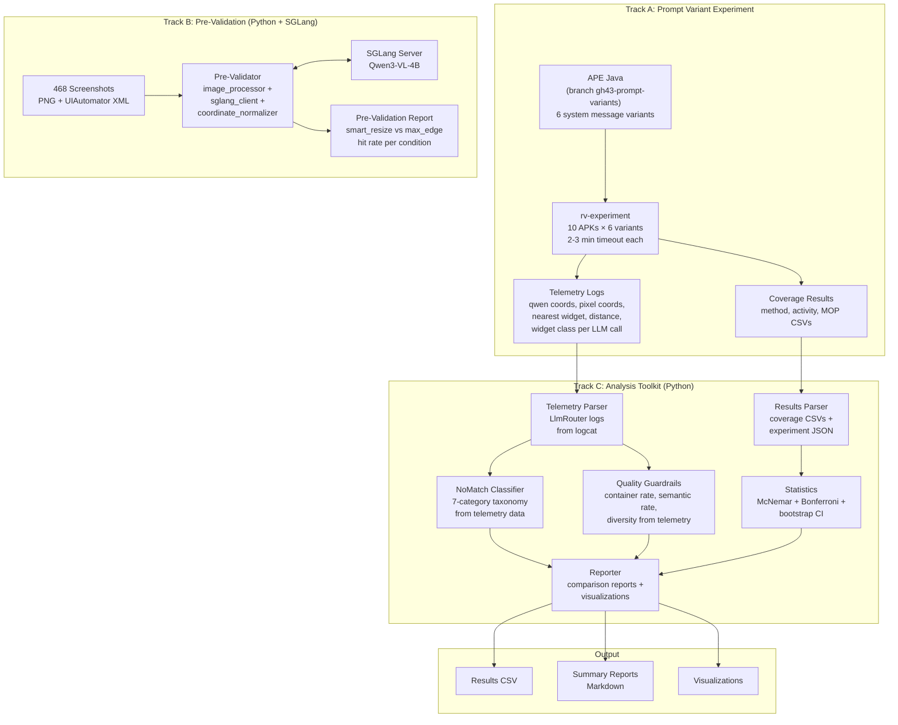
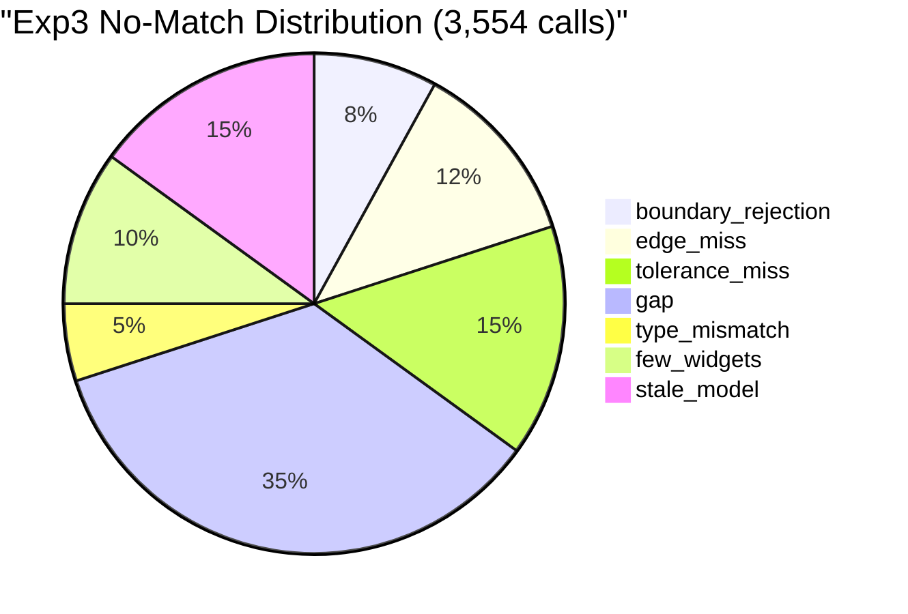
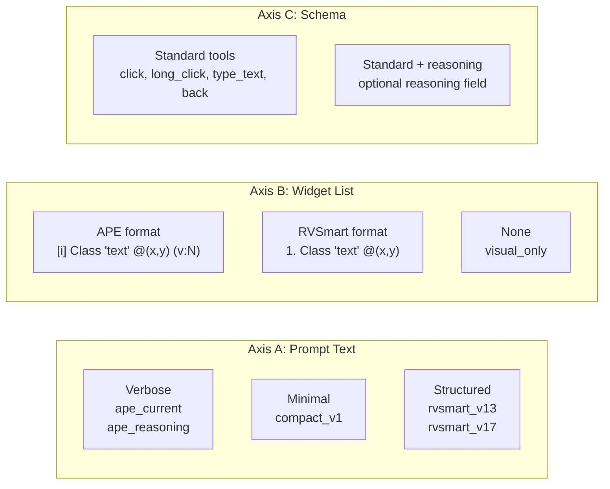

# Design: gh43 — APE-RV LLM Prompt Variant Validation

**Date**: 2026-03-19
**Track**: FF SDD
**GitHub Issue**: #43

---

## Context

APE-RV integrates a multimodal LLM (Qwen3-VL-4B via SGLang) into its Android exploration loop.
The LLM sees a screenshot + widget list and returns normalized coordinates [0, 1000) that are
converted to device pixels and matched against ModelActions via a 5-step algorithm. In exp3
(507 tasks, 169 APKs), 37.3% of LLM calls resulted in no_match, and the LLM variant performed
**worse** than the non-LLM baseline (27.60% vs 28.35% method coverage, p=0.014).

Four independent analyses (Claude, Codex, Gemini, Qwen) identified critical improvements now
incorporated: McNemar statistics, quality guardrails beyond match rate, and reasoning field
validation.

**Strategy pivot**: The original design replicated the APE Java pipeline in Python to test prompt
variants offline against static screenshots. This approach was abandoned because offline match rate
does not capture what matters — real exploration coverage. Instead, prompt variants are implemented
directly in the APE Java codebase (temporary branch `gh43-prompt-variants`, NOT merged to master),
and tested via `rv-experiment` on 10 real instrumented APKs with 2-3 min timeout each. APE Java
commit: `b2852dd` (master). The Python
module becomes an **analysis toolkit** that parses rv-experiment output (coverage CSVs, telemetry
logs) and produces statistical reports. Pre-validation (pure grounding accuracy) remains in Python
as a separate track using SGLang directly.

### Referenced Documents

| Document | Content |
|----------|---------|
| `docs/20260318_aperv_coordenadas_gh46.md` | Investigation plan: no_match rate, mapToModelAction algorithm, timing gap |
| `docs/20260316_aperv_llm.md` | LLM integration modes, 19 calibration parameters |
| `docs/20260317_aperv_llm_rvandroid.md` | rv-android config keys, aperv-tool variants |
| `docs/20260317_aperv_comparacao.md` | Exp3 baseline: sata_mop_llm vs all tools |
| `docs/20260318_rvape_calibracao.md` | Calibration plan: MACRO/MICRO, Optuna TPE |
| `docs/vision/FINAL_REPORT.md` | Qwen3-VL benchmark: 57.7% hit rate on 468 screenshots |
| `docs/vision/004_prompt_engineering.md` | Prompt v2 strict, fallback parser, 100% tool call rate |
| `openspec/changes/gh43-aperv-llm-validation/sota.md` | SOTA survey: 21 LLM Android testing tools, prompt analysis, positioning |

---

## Goals / Non-Goals

### Goals

1. **Compare** 6 coordinate-based prompt variants on REAL coverage metrics (method, activity, MOP) via rv-experiment with 10 instrumented APKs
2. **Classify** no-match causes from enhanced LlmRouter telemetry logged during experiments
3. **Identify** the best prompt for APE Java with statistical rigor (McNemar on coverage, Bonferroni correction)
4. **Provide** quality guardrails computed from telemetry (container rate, semantic rate, diversity)
5. **Pre-validate** VLM coordinate accuracy with smart_resize vs max-edge image processing (Python + SGLang)

### Non-Goals

- **Pipeline replication** — the original design replicated APE Java in Python; this is no longer needed since variants run directly in Java
- **SoM/action_list variants** — deferred to a future change; these require deeper Java changes to tool schema and matching logic in APE
- Calibrating LLM sampling parameters (that is the MICRO phase in D4)
- Fixing the timing gap (that is gh46 scope)
- Supporting models other than Qwen3-VL-4B (single model focus)
- Merging prompt variants to APE master (temporary branch only)

---

## Architecture

### System Overview

The validation operates on three independent tracks:



### Pre-Validation Phase (Group 0.5)

Before running prompt variants, a quick grounding-only test establishes the VLM's baseline
coordinate accuracy and validates the image processing improvement.

**Design**: For each widget with a text label in the 468 UIAutomator dumps, send a prompt
including device dimensions: `"The screen is 1080x1920 pixels. Click on the element labeled
[text]"` with only the screenshot (NO widget coordinates in prompt). The LLM returns
coordinates via `android_click(x, y)` tool with description specifying pixel ranges.

**Hit definition** (two metrics reported):
- **bounds_hit**: predicted pixel coordinates fall within the widget's bounds (strict,
  matches APE-RV's `mapToModelAction` containment check)
- **center_hit**: predicted pixel coordinates within 50px Euclidean distance of widget center
  (matches rvsec-vision-llm benchmark — the 57.7% baseline used this criterion)

Both are reported. The `center_hit` metric enables direct comparison with the rvsec-vision-llm
benchmark. The `bounds_hit` metric shows what APE-RV would actually accept.

**Prompt and tool schema** (aligned with rvsec-vision-llm v2 strict for comparability):
- System message includes **resized image dimensions** (`"Screen is {img_w}x{img_h} pixels"`),
  NOT device dimensions. The model grounds coordinates on the image it actually sees.
  For max_edge: 562×1000, for smart_resize: varies (e.g. 576×1024), for raw: 1080×1920.
- Tool name: `android_click` (matches rvsec-vision-llm)
- Tool description: `"Click at pixel coordinates. Screen is {img_w}x{img_h}. x: 0-{img_w}, y: 0-{img_h}"`
- Coordinates in tool schema described as pixel range for the resized image — the model
  returns normalized [0, 1000) regardless (per Qwen3-VL architecture), but telling it
  "pixels" improved tool call rate in rvsec-vision-llm from 60.7% to 85.7%

**Coordinate conversion** (2-step for pre-validation):
1. Qwen [0, 1000) → resized image pixels: `img_px = int((qwen / 1000) * img_dim)`
2. Resized image pixels → device pixels: `dev_px = int((img_px / img_dim) * dev_dim)`
Then check hit against UIAutomator widget bounds (which are in device pixel space).
This 2-step conversion is the correct approach — it accounts for the fact that the model
grounds on the resized image, not the device resolution. APE-RV currently skips step 1
(converts directly from Qwen to device pixels), which may be the root cause of the
3-space coordinate problem identified in the SOTA analysis.

**Three image processing conditions** (orthogonal to prompt variants):
1. **max-edge 1000px** (current APE-RV) — baseline, expected ~57% (replicating rvsec-vision-llm)
2. **smart_resize(factor=32)** — Qwen3-VL-optimized image preprocessing
3. **raw (no resize)** — device-native resolution (1080x1920), as AppAgent does

**Two temperatures**: 0.01 (near-deterministic) and 0.7 (high variance) — two extremes to
differentiate grounding stability from stochastic exploration.

**Metrics**: bounds_hit rate and center_hit rate (global + per app + per widget class), mean
distance to widget center for misses, error distribution (boundary, edge_miss, gap), resized
dimensions comparison, tool call success rate.

**Decision gate**:
- If smart_resize improves center_hit rate by >=5pp: use in all prompt variants
- If raw (no resize) is best: consider eliminating the resize step entirely
- If both <=50%: pure grounding is fundamentally limited; coordinates in prompt are essential
  (already known from rvsec-vision-llm: 57% without coords -> ~100% with coords)
- If baseline center_hit ~57%: confirms faithful replication of rvsec-vision-llm results
- If temperature 0.01 ~ 0.7: grounding is temperature-insensitive, use 0.01 for reproducibility
- If 0.01 >> 0.7: low temperature is critical for coordinate accuracy

**Prior art**: rvsec-vision-llm validation showed 57.7% hit rate with pure grounding (no
coordinates in prompt), improving to ~100% when widget coordinates were included. This pre-
validation isolates the image processing variable before prompt variant investment.

**Scope**: Per-widget — each visible widget with `text` or `content_desc` gets a separate
LLM call (`"Click on the element labeled [text]"`). This isolates coordinate precision from
action choice, matching the rvsec-vision-llm benchmark methodology (57.7% hit rate).

**Widget selection**: All visible widgets with `text` or `content_desc` that are either
`clickable=true` OR belong to `ALWAYS_CLICKABLE_TYPES` (tabs, spinners, navigation items,
FABs, chips — widgets that UIAutomator reports as non-clickable but are inherently
interactive). Capped at 20 widgets per screenshot to avoid excessive calls on complex screens.
Only `click` actions (type_text uses same coordinates).

`ALWAYS_CLICKABLE_TYPES` (unified from rv-screen-parser + rvsmart): Spinner, AppCompatSpinner,
TabLayout, TabView, BottomNavigationItemView, NavigationBarItemView, Chip,
FloatingActionButton, ActionMenuItemView, MenuItemView, OverflowMenuButton, and their
fully-qualified variants.

**Estimated time**: ~2-20 widgets/screen (avg ~8, cap 20) × 468 screenshots × 3 modes ×
2 temperatures ≈ 8,000-22,000 calls (~4-11h).
Execution window: 2026-03-19 13:30 to 2026-03-20 09:00 (~20h available).

**Output**: `results/000_prevalidation_report.md` — narrative report following P2
(human-readable, self-contained, explains why not just what). CSV data in
`results/data/000_prevalidation_results.csv`.

### Coordinate Space Analysis

APE-RV has a unique 3-space coordinate pipeline — no other surveyed tool uses more than 2
spaces. This introduces error accumulation at each conversion step.

**Space 1 — Resized image pixels**: Screenshot resized from device resolution (1080x1920) to
max-edge 1000px (562x1000). The VLM sees this image. Qwen3-VL's internal coordinate
predictions are relative to this resized image's pixel space.

**Space 2 — Qwen normalized [0, 1000)**: Qwen3-VL outputs coordinates in its standard
normalized range. These may correspond to Space 1 (resized image) rather than the original
device resolution — the model has never seen the original resolution.

**Space 3 — Device pixels**: The matching algorithm operates in device pixel space (1080x1920),
where UIAutomator widget bounds are defined. Conversion:
`pixel = int((qwen_coord / 1000.0) * device_dimension)`.

**The critical question**: When Qwen3-VL returns normalized coordinates, are they relative to
the resized image dimensions or the original device dimensions? If the model grounds
coordinates based on the image it actually sees (Space 1), then the conversion should use
resized dimensions, not device dimensions. The current APE-RV code converts directly to device
pixels (Space 3), potentially introducing systematic spatial errors.

**999 vs 1000 asymmetry**: MobileAgent v3 uses `int(x / width * 999)` for pixel-to-Qwen
conversion but `int(normalized / 1000 * device_size)` for reverse. This asymmetry maps the
full [0, 999] range to [0, device_size), avoiding off-by-one at the maximum boundary. APE-RV
uses 1000 in both directions — this should be investigated as a potential source of boundary
errors.

### Matching Algorithm (5-Step) — APE Java Reference

The following diagram documents the `LlmRouter.mapToModelAction()` algorithm in the APE Java
codebase. This is NOT replicated in Python — it runs in Java during rv-experiment execution.
The diagram serves as reference for understanding the telemetry data that the analysis toolkit
parses.

```mermaid
flowchart TD
    START([LLM returns<br/>action_type, qwen_x, qwen_y]) --> CONV[Convert coordinates<br/>pixel = int&#40;qwen/1000 x dim&#41;]
    CONV --> BACK{action_type<br/>== back?}
    BACK -->|Yes| RET_BACK[Return state.backAction]
    BACK -->|No| BOUND{Boundary check<br/>pixelY < 5% height OR<br/>pixelY > 94% height?}
    BOUND -->|Yes| REJ[BOUNDARY_REJECTION<br/>no_match]
    BOUND -->|No| TYPE{action_type<br/>== type_text?}
    TYPE -->|Yes| INPUT[Filter to<br/>INPUT_CLASS_NAMES only]
    TYPE -->|No| ALL[All widgets]
    INPUT --> CONTAIN{Any widget bounds<br/>contain &#40;pixelX, pixelY&#41;?}
    ALL --> CONTAIN
    CONTAIN -->|Yes, multiple| SMALL[Select smallest area<br/>widget]
    CONTAIN -->|Yes, one| MATCH1[BOUNDS_MATCH]
    SMALL --> MATCH1
    CONTAIN -->|No| LCLICK{Was long_click<br/>with MODEL_LONG_CLICK<br/>filter?}
    LCLICK -->|Yes| RETRY[Retry without<br/>type filter]
    RETRY --> CONTAIN2{Bounds contain<br/>point?}
    CONTAIN2 -->|Yes| MATCH2[BOUNDS_MATCH<br/>after retry]
    CONTAIN2 -->|No| EUCLID
    LCLICK -->|No| EUCLID{Euclidean fallback<br/>nearest center within<br/>max&#40;50, min&#40;w,h&#41;/2&#41; px}
    EUCLID -->|Within tolerance| MATCH3[EUCLIDEAN_MATCH]
    EUCLID -->|Beyond tolerance| CLASS[Classify no_match]
    CLASS --> BREJ{pixelY in<br/>boundary zone?}
    BREJ -->|Yes| BREJ_OUT[BOUNDARY_REJECTION]
    BREJ -->|No| TYPECK{Widget at point<br/>but wrong action type?}
    TYPECK -->|Yes| TYPE_MM[TYPE_MISMATCH]
    TYPECK -->|No| EDGE{Distance to nearest<br/>widget bound <= 20px?}
    EDGE -->|Yes| EDGE_MISS[EDGE_MISS]
    EDGE -->|No| TOL{Distance 50-100px<br/>from nearest center?}
    TOL -->|Yes| TOL_MISS[TOLERANCE_MISS]
    TOL -->|No| FEW{<= 2 clickable<br/>widgets?}
    FEW -->|Yes| FEW_W[FEW_WIDGETS]
    FEW -->|No| GAP[GAP]
```



> **Note on classification order**: `boundary_rejection` appears in two places: (1) as
> step 2 in the 5-step matching algorithm (where it rejects the action before containment
> is attempted), and (2) as the first check in the NoMatchClassifier (which classifies
> actions that already failed all 5 steps). The classifier's `boundary_rejection` catches
> cases where boundary rejection was NOT triggered in step 2 but the coordinates are still
> in the boundary zone (e.g., edge cases near the 5%/94% thresholds). The `stale_model`
> category is assigned post-hoc during reasoning analysis by examining reasoning texts for
> mentions of visible elements absent from the XML widget list.

### No-Match Classification Taxonomy



> Note: percentages above are **estimated** from partial exp3 data. Precise distribution is
> one of the primary outputs of the analysis toolkit, computed from Java telemetry logs.

| Category | Criterion | Actionable? | Root Cause |
|----------|-----------|-------------|------------|
| `boundary_rejection` | `pixelY < height*0.05` or `pixelY > height*0.94` | Prompt improvement (tell LLM to avoid edges) | LLM targeting status/nav bar |
| `edge_miss` | Nearest widget bound <= 20px | Tolerance adjustment or snap-to-nearest | Imprecise grounding |
| `tolerance_miss` | Distance 50-100px from nearest widget center | Prompt/model improvement | Poor spatial reasoning |
| `gap` | Distance > 100px from any widget | Investigate: hallucination or dynamic element | LLM error or timing gap |
| `type_mismatch` | Widget exists but wrong action type | Prompt improvement (action selection) | Wrong action inference |
| `few_widgets` | <= 2 clickable widgets in screen | Structural (few options) | Limited screen content |
| `stale_model` | Element visible in screenshot but not in XML (assigned post-hoc during reasoning analysis, not by the algorithmic classifier) | Timing gap detection | Dump/screenshot temporal mismatch |

---

## Key Components

### Track A: APE Java (branch gh43-prompt-variants)

| Component | File | Responsibility |
|-----------|------|----------------|
| `ApePromptBuilder` | `ape/llm/ApePromptBuilder.java` | Extended with 6 system message constants, selected via `ape.llm.prompt_variant` system property |
| `LlmRouter` (enhanced telemetry) | `ape/llm/LlmRouter.java` | Logs qwen coords, pixel coords, nearest widget, distance, widget class for every LLM call |

### Track B: Pre-Validation (Python)

| Component | File | Responsibility |
|-----------|------|----------------|
| `ImageProcessor` | `pipeline/image_processor.py` | JPEG resize — two modes: (a) max-edge 1000px, (b) smart_resize factor=32. Both output base64. |
| `CoordinateNormalizer` | `pipeline/coordinate_normalizer.py` | `pixel = int((qwen/1000) * dim)`, clamp |
| `SglangClient` | `pipeline/sglang_client.py` | OpenAI-compatible multimodal chat for pre-validation |
| `UIAutomatorParser` | `data/uiautomator_parser.py` | Parse XML -> Widget list with bounds |
| `ResponseCache` | `infrastructure/response_cache.py` | SQLite cache: `hash(screenshot+prompt) -> response` |

### Track C: Analysis Toolkit (Python)

| Component | File | Responsibility |
|-----------|------|----------------|
| `ResultsParser` | `analysis/results_parser.py` | Parse rv-experiment output: coverage CSVs, experiment JSON |
| `TelemetryParser` | `analysis/telemetry_parser.py` | Parse LlmRouter telemetry from logcat logs |
| `NoMatchClassifier` | `analysis/nomatch_classifier.py` | Classify no-match causes from telemetry data (7-category taxonomy) |
| `Statistics` | `analysis/statistics.py` | McNemar test, Bonferroni correction, bootstrap CI |
| `QualityGuardrails` | `analysis/quality_guardrails.py` | Container rate, semantic rate, diversity from telemetry |
| `Reporter` | `analysis/reporter.py` | Generate comparison reports + visualizations |

### Shared (Python)

| Component | File | Responsibility |
|-----------|------|----------------|
| `constants` | `constants.py` | APE-RV constants (device dimensions, boundary thresholds, etc.) |
| `models` | `data/models.py` | Widget, MatchResult, NoMatchCategory (simplified — no PromptConfig) |

---

## Data Models

### Core Dataclasses

```python
@dataclass(frozen=True)
class Widget:
    """Represents a clickable UI element parsed from UIAutomator XML."""
    class_name: str
    text: str
    content_desc: str
    resource_id: str
    bounds: tuple[int, int, int, int]  # left, top, right, bottom
    clickable: bool
    long_clickable: bool
    editable: bool
    checkable: bool
    enabled: bool

    @property
    def center(self) -> tuple[int, int]:
        left, top, right, bottom = self.bounds
        return ((left + right) // 2, (top + bottom) // 2)

    @property
    def area(self) -> int:
        left, top, right, bottom = self.bounds
        return (right - left) * (bottom - top)

    @property
    def width(self) -> int:
        return self.bounds[2] - self.bounds[0]

    @property
    def height(self) -> int:
        return self.bounds[3] - self.bounds[1]


class MatchStep(str, Enum):
    """Which step of the 5-step algorithm produced the result."""
    BACK = "back"
    BOUNDS_MATCH = "bounds_match"
    LONG_CLICK_RETRY = "long_click_retry"
    EUCLIDEAN_MATCH = "euclidean_match"
    NO_MATCH = "no_match"


class NoMatchCategory(str, Enum):
    """Root cause classification for no_match results."""
    BOUNDARY_REJECTION = "boundary_rejection"
    EDGE_MISS = "edge_miss"
    TOLERANCE_MISS = "tolerance_miss"
    GAP = "gap"
    TYPE_MISMATCH = "type_mismatch"
    FEW_WIDGETS = "few_widgets"
    STALE_MODEL = "stale_model"


@dataclass(frozen=True)
class MatchResult:
    """Result of matching an LLM action against widgets — parsed from telemetry."""
    matched: bool
    step: MatchStep
    widget_class: str | None
    action_type: str
    pixel_x: int
    pixel_y: int
    qwen_x: int
    qwen_y: int
    distance_to_nearest: float  # pixels, center-to-point
    nearest_widget_class: str | None
    classification: NoMatchCategory | None  # only for no_match


@dataclass(frozen=True)
class CoverageResult:
    """Coverage metrics for one experiment task (APK x variant)."""
    app_name: str
    prompt_variant: str
    method_coverage: float
    activity_coverage: float
    mop_coverage: float
    total_llm_calls: int
    match_rate: float
    no_match_rate: float
```

### Cache Schema (Pre-Validation)

```python
# SQLite table: llm_responses
# Primary key: hash(screenshot_path + prompt_name + repetition_seed + temperature + resize_mode)
#
# Columns:
#   cache_key     TEXT PRIMARY KEY
#   screenshot    TEXT  -- path
#   prompt_name   TEXT
#   rep_seed      INT
#   temperature   REAL  -- LLM temperature used
#   resize_mode   TEXT  -- max_edge | smart_resize | raw
#   request_hash  TEXT  -- hash of full request payload
#   response_json TEXT  -- full OpenAI response as JSON
#   tokens_in     INT
#   tokens_out    INT
#   latency_ms    INT
#   created_at    TEXT  -- ISO timestamp
```

---

## API Design

### CLI Interface

```
aperv-llm-validate prevalidate
    --screenshots-dir PATH          # Directory with PNG + .uiautomator pairs
    --sglang-url URL                # SGLang endpoint (default: http://192.168.0.36:30000/v1)
    --temperature FLOAT             # LLM temperature (default: 0.01)
    --resize-mode MODE              # Image processing: max_edge | smart_resize | raw (default: all)
    --max-screenshots N             # Limit screenshots (for quick tests)
    --output-dir PATH               # Results directory (default: results/)
    --use-cache / --no-cache        # Enable/disable response cache (default: enabled)
    --cache-dir PATH                # Cache location (default: .cache/)

aperv-llm-validate analyze
    --experiment-dir PATH           # rv-experiment results directory
    --telemetry-dir PATH            # Directory with logcat logs containing LlmRouter telemetry
    --output-dir PATH               # Analysis output directory (default: results/)

aperv-llm-validate report
    --results-dir PATH              # Generate reports from existing analysis data
    --format csv|markdown|both      # Output format (default: both)

aperv-llm-validate list-prompts     # List the 6 prompt variants configured in APE Java
```

### Key Functions

#### `pipeline/image_processor.py`

```python
def calculate_resized_dimensions(orig_w: int, orig_h: int,
                                  max_edge: int = MAX_EDGE_PX) -> tuple[int, int]:
    """Resize calculation matching APE Java ImageProcessor.
    Preconditions: orig_w > 0, orig_h > 0, max_edge > 0.
    Postconditions: max(new_w, new_h) <= max_edge; aspect ratio preserved.
    """

def process_screenshot(png_path: Path, resize_mode: str = "max_edge") -> str:
    """Read PNG, resize per mode, JPEG quality 80, return base64 (no data URI prefix).
    Modes: max_edge (1000px), smart_resize (factor=32), raw (no resize).
    """
```

#### `pipeline/coordinate_normalizer.py`

```python
def qwen_to_pixel(qwen_x: int, qwen_y: int,
                  device_w: int = DEVICE_WIDTH,
                  device_h: int = DEVICE_HEIGHT) -> tuple[int, int]:
    """Convert Qwen3-VL normalized [0,1000) coords to device pixels.
    Formula: pixel = int((qwen / 1000.0) * dim), clamped to [0, dim-1].
    """

def pixel_to_qwen(pixel_x: int, pixel_y: int,
                  device_w: int = DEVICE_WIDTH,
                  device_h: int = DEVICE_HEIGHT) -> tuple[int, int]:
    """Convert device pixels to Qwen3-VL normalized [0,1000) coords.
    Formula: qwen = int((pixel / dim) * 1000), clamped to [0, 999].
    """
```

#### `analysis/results_parser.py`

```python
def parse_experiment_results(experiment_dir: Path) -> list[CoverageResult]:
    """Parse rv-experiment output directory: coverage CSVs, experiment JSON.
    Returns one CoverageResult per APK x prompt variant combination.
    """

def parse_coverage_csv(csv_path: Path) -> dict[str, float]:
    """Parse a single coverage CSV (method, activity, MOP percentages)."""
```

#### `analysis/telemetry_parser.py`

```python
def parse_logcat_telemetry(logcat_path: Path) -> list[MatchResult]:
    """Parse LlmRouter telemetry lines from logcat output.
    Each line contains: qwen coords, pixel coords, nearest widget, distance, widget class.
    Returns one MatchResult per LLM call.
    """

def extract_telemetry_from_experiment(experiment_dir: Path) -> dict[str, list[MatchResult]]:
    """Extract telemetry from all logcat files in an experiment directory.
    Returns dict keyed by app_name.
    """
```

#### `analysis/nomatch_classifier.py`

```python
def classify_from_telemetry(match_results: list[MatchResult]) -> dict[NoMatchCategory, int]:
    """Classify no-match causes from parsed telemetry data.
    Uses the 7-category taxonomy. Returns counts per category.
    """

def compute_nomatch_distribution(match_results: list[MatchResult]) -> dict[str, float]:
    """Compute percentage distribution of no-match categories."""
```

#### `analysis/statistics.py`

```python
def mcnemar_test(variant_a: list[float], variant_b: list[float]) -> tuple[float, float]:
    """McNemar test on paired coverage outcomes.
    Returns (chi2, p_value).
    """

def bonferroni_correction(p_values: list[float], alpha: float = 0.05) -> list[bool]:
    """Apply Bonferroni correction. Returns list of significance flags."""

def bootstrap_ci(values: list[float], n_resamples: int = 10000,
                 confidence: float = 0.95) -> tuple[float, float]:
    """Bootstrap confidence interval for a metric. Returns (lower, upper)."""
```

#### `analysis/quality_guardrails.py`

```python
def compute_guardrails(match_results: list[MatchResult]) -> dict:
    """Compute guardrail metrics from telemetry: container_click_rate, semantic_widget_rate,
    action_diversity, per_app_consistency."""

def quality_score(coverage: CoverageResult, guardrails: dict) -> float:
    """Composite: 0.60 x coverage_metric + 0.20 x semantic_rate +
    0.10 x type_text_coverage + 0.10 x diversity."""
```

#### `analysis/reporter.py`

```python
def generate_comparison_report(results: list[CoverageResult],
                                telemetry: dict[str, list[MatchResult]],
                                output_dir: Path) -> Path:
    """Generate full comparison report: coverage table, no-match analysis,
    guardrail metrics, statistical tests. Returns path to markdown report."""

def generate_visualizations(results: list[CoverageResult],
                             telemetry: dict[str, list[MatchResult]],
                             output_dir: Path) -> list[Path]:
    """Generate visualization figures: coverage bar charts, no-match heatmaps,
    per-app breakdown. Returns paths to generated figures."""
```

#### `infrastructure/response_cache.py`

```python
class ResponseCache:
    """SQLite-backed cache for LLM responses (pre-validation track). Thread-safe.
    Key: hash(screenshot_basename + prompt_name + rep_seed + temperature + resize_mode).
    Provides reproducibility (re-run reports without LLM) and resilience (SGLang restart).
    """

    def __init__(self, cache_dir: Path): ...
    def get(self, screenshot: str, prompt: str, rep_seed: int,
            temperature: float, resize_mode: str) -> dict | None: ...
    def put(self, screenshot: str, prompt: str, rep_seed: int,
            temperature: float, resize_mode: str,
            response: dict, tokens_in: int, tokens_out: int, latency_ms: int) -> None: ...
    def stats(self) -> dict: ...  # hits, misses, size
```

---

## Prompt Variant Architecture

### Design Rationale

The 6 coordinate-based variants test orthogonal prompt design dimensions. All variants are
implemented as system message string constants in `ApePromptBuilder.java` on the temporary
branch `gh43-prompt-variants`. The active variant is selected at runtime via the system
property `ape.llm.prompt_variant` (default: `ape_current`).

SoM (`som_overlay`) and action-list (`action_list`) variants are **deferred** to a future
change — they require modifications to the tool schema (element_id/action_id instead of x,y)
and the matching logic in LlmRouter, which are too invasive for a temporary branch.



| Variant | Axis A | Axis B | Axis C | Tests | Location |
|---------|--------|--------|--------|-------|----------|
| `ape_current` | Verbose (APE production) | APE format | Standard | Production baseline | `ApePromptBuilder.SYSTEM_APE_CURRENT` |
| `ape_reasoning` | Verbose (APE production) | APE format | + reasoning | Impact of reasoning field | `ApePromptBuilder.SYSTEM_APE_REASONING` |
| `compact_v1` | Minimal (v2 strict) | APE format | + reasoning | Token efficiency | `ApePromptBuilder.SYSTEM_COMPACT_V1` |
| `rvsmart_v13` | Structured (dialog handling) | RVSmart | + reasoning | Cross-tool transfer | `ApePromptBuilder.SYSTEM_RVSMART_V13` |
| `rvsmart_v17` | Structured (6-step reasoning) | RVSmart | + reasoning | MOP-aware prompting | `ApePromptBuilder.SYSTEM_RVSMART_V17` |
| `visual_only` | Minimal | None | + reasoning | Widget list value | `ApePromptBuilder.SYSTEM_VISUAL_ONLY` |

### Reasoning Field Validation Gate

Before using `reasoning` texts for no-match analysis, validate that adding the reasoning
field to the tool schema does not alter LLM behavior. Since both `ape_current` and
`ape_reasoning` are tested as full rv-experiment variants (Group 2), validation happens
naturally by comparing their coverage results:

1. Compare method coverage: `ape_reasoning` within ±2pp of `ape_current` across 10 APKs
2. Compare match rate (from telemetry): within ±2pp
3. If validation passes: use reasoning texts from `ape_reasoning` runs for no-match analysis
4. If validation fails: report as finding, use only `ape_current` as baseline, do not use
   reasoning texts for classification

### APE Java Changes (branch gh43-prompt-variants)

The following changes are made on a temporary branch. They are NOT merged to APE master.

1. **ApePromptBuilder.java**: Add 6 `static final String` constants with system messages.
   Add `getPromptVariant()` method that reads `System.getProperty("ape.llm.prompt_variant", "ape_current")`.

2. **LlmRouter.java**: Enhanced telemetry logging in `mapToModelAction()`. For every LLM call,
   log a structured line to Android `Log.d("APE-LLM-TEL", ...)` containing:
   - `qwen_x`, `qwen_y` (raw LLM output)
   - `pixel_x`, `pixel_y` (converted coordinates)
   - `nearest_widget_class` (class name of nearest widget)
   - `nearest_widget_distance` (Euclidean distance in pixels)
   - `matched_widget_class` (class of matched widget, or "none")
   - `match_step` (which algorithm step matched)
   - `action_type` (click, long_click, type_text, back)

3. **Configuration**: The variant is passed via rv-experiment's tool configuration, which sets
   the system property before APE starts.

**Statistical comparison**: The 6 coordinate-based variants form the **main comparison set**
(C(6,2) = 15 pairwise McNemar tests with Bonferroni correction at 0.05/15 = 0.0033).

---

## Quality Guardrails

Match rate alone is a dangerous optimization target. A prompt could increase match rate by
biasing the LLM toward large, easy-to-hit containers (e.g., always clicking the biggest
FrameLayout) while producing worse exploration coverage. These guardrails are computed from
Java telemetry logs parsed by the analysis toolkit.

### Guardrail Metrics

| Metric | What It Detects | Threshold |
|--------|-----------------|-----------|
| Container click rate | % of matches on generic containers (FrameLayout, LinearLayout, RelativeLayout, ConstraintLayout) | Flag if > 30% |
| Semantic widget rate | % of matches on widgets with text/content_desc/resource_id | Flag if < 50% |
| Back action rate | % of LLM calls returning back | Flag if > 15% |
| type_text coverage | % of calls using type_text when EditText present | Report (higher is better) |
| Action diversity | Shannon entropy of action type distribution | Report (higher is better) |
| Per-app consistency | Std dev of coverage across apps | Flag if > 25pp |

### Quality Score (Composite)

```python
def quality_score(coverage: CoverageResult, guardrails: dict) -> float:
    """Composite metric that balances coverage with action quality.
    quality = 0.60 x method_coverage + 0.20 x semantic_rate + 0.10 x type_text_coverage + 0.10 x diversity
    """
```

---

## Statistical Methodology

### Primary Comparison: McNemar Test

For comparing two prompt variants on the same APKs, the outcome per APK is binary
(improvement/no improvement in coverage). McNemar test compares discordant pairs:

```
                 Variant B: higher    Variant B: lower/equal
Variant A: higher      a                  b
Variant A: lower       c                  d

chi2 = (b - c)^2 / (b + c)    with continuity correction
p-value from chi2 distribution with 1 df
```

### Confidence Intervals

Bootstrap 95% CI for coverage metrics per variant (10,000 resamples, stratified by app).

### Multiple Comparisons

The **main comparison set** includes the 6 coordinate-based variants. With 6 variants, there
are C(6,2) = 15 pairwise comparisons. Apply Bonferroni correction: significance threshold =
0.05 / 15 = 0.0033.

### Repetition Analysis

Each rv-experiment run is deterministic for a given APK x variant combination (same emulator
snapshot, same seed). To assess variance, run 3 repetitions of the top-2 variants:
- Report mean +/- std of coverage across reps
- If std > 3pp within a variant: flag as unstable
- Compare variants using all reps: Wilcoxon signed-rank on per-APK means

---

## Error Handling

| Error | Source | Strategy | Recovery |
|-------|--------|----------|----------|
| SGLang unavailable (pre-validation) | Network/server down | Health check before run; retry 3x with exponential backoff | Pause run, log, resume with `--use-cache` |
| SGLang timeout (pre-validation) | Slow inference | Per-call timeout (15s default) | Skip screenshot, record as `SERVER_ERROR` |
| Invalid PNG | Corrupted file | Catch Pillow error | Skip, log warning |
| Missing XML pair | PNGs vs XMLs mismatch | Check for matching `.uiautomator` file | Skip orphan PNGs, log |
| Malformed XML | Bad UIAutomator dump | defusedxml parse error | Skip, log warning |
| Missing experiment results | rv-experiment dir not found | Validate path before analysis | Abort with clear error message |
| Malformed telemetry | Unexpected logcat format | Skip unparseable lines | Log warning, continue with valid lines |
| Cache corruption | SQLite error | Catch, delete entry | Re-fetch from LLM |

---

## Decisions

### D1: Analysis Toolkit (not pipeline replica)

**Decision**: The Python module is an analysis toolkit that parses rv-experiment output,
not a replica of the APE Java pipeline.

**Rationale**: The original design replicated the full APE Java pipeline in Python to test
prompt variants offline. This was pivoted because: (a) offline match rate does not capture
real exploration coverage; (b) replication fidelity is a high risk with no mitigation that
fully eliminates drift; (c) testing with real instrumented APKs produces coverage metrics
directly comparable to exp3 results. The Python module now focuses on what Python does well:
parsing structured data, computing statistics, and generating reports.

**Alternative considered**: Full pipeline replication (original design). Rejected due to
Python/Java drift risk and inability to measure real coverage.

### D2: SQLite Cache (not diskcache or filesystem)

**Decision**: Use SQLite for pre-validation response caching.

**Rationale**: Single-file database, no external dependencies, supports atomic operations,
easy to inspect with `sqlite3` CLI. Only used for Track B (pre-validation), not for Track A
experiments.

### D3: McNemar Test (not t-test or Wilcoxon)

**Decision**: Use McNemar test for pairwise prompt variant comparison.

**Rationale**: The per-APK outcome is binary (coverage improvement or not). McNemar is the
standard test for comparing binary outcomes on paired samples. Applied to coverage metrics
from rv-experiment, not to offline match rate.

### D4: 7-Category Taxonomy (adds `stale_model` to original 6)

**Decision**: Add `stale_model` category for elements visible in screenshot but absent from XML.

**Rationale**: The timing gap between UIAutomator dump and screenshot is a known architectural
issue. Without this category, timing-gap failures are misclassified as `gap` (LLM error).
In the new design, `stale_model` is detected from Java telemetry data where the LlmRouter
logs the reasoning text.

### D5: No Holdout Set (report per-app variance instead)

**Decision**: Use all 10 APKs for evaluation. No holdout.

**Rationale**: With only 10 APKs, holding out any would be too few for meaningful analysis.
Instead, report per-app coverage to detect variants that overfit to specific apps.

### D6: `reasoning` as Optional Field with Validation Gate

**Decision**: Include `reasoning` in tool schema as optional parameter. Validate that it does
not alter match rate before using in analysis.

**Rationale**: `reasoning` provides invaluable diagnostic data ("correct intent, wrong coords"
vs "wrong intent"). But adding a field to the schema can change LLM behavior. The validation
gate (50 screenshots, delta < 2pp) ensures we detect and document any impact.

### D9: SoM and Action-List Deferred

**Decision**: Defer `som_overlay` and `action_list` variants to a future change.

**Rationale**: Both require modifications to the APE Java tool schema (element_id/action_id
instead of x,y coordinates) and the matching logic in LlmRouter. These changes are too
invasive for a temporary branch. The 6 coordinate-based variants provide sufficient data
to evaluate prompt quality. SoM and action-list remain architecturally interesting
(see sota.md Section 8.1) and should be tested in a dedicated change with proper Java
refactoring.

### D10: Pivot to rv-experiment (not offline screenshots)

**Decision**: Test prompt variants via rv-experiment with real instrumented APKs instead of
offline evaluation against static screenshots.

**Rationale**: The key insight is that match rate (offline) does not predict coverage
(production). A prompt with higher match rate could produce worse exploration if it matches
low-value widgets. Testing with rv-experiment produces the metrics that actually matter:
method coverage, activity coverage, MOP coverage. The cost is higher (10 APKs x 6 variants x
2-3 min = ~3h vs ~4h for offline) but the results are directly actionable.

**Trade-off**: Offline evaluation would have provided per-screenshot granularity (468 data
points per variant). rv-experiment provides per-APK granularity (10 data points per variant).
This is mitigated by the telemetry logs, which provide per-LLM-call data for no-match
analysis and quality guardrails.

---

## Risks / Trade-offs

| Risk | Probability | Impact | Mitigation |
|------|-------------|--------|------------|
| **APE branch management** — temporary branch diverges from master or accidentally merged | Medium (30%) | High | Branch naming convention (`gh43-prompt-variants`), no PR created, branch deleted after experiment |
| **Experiment time cost** — 10 APKs x 6 variants x 2-3 min x 3 reps = ~9h | High (80%) | Medium | Run overnight; prioritize single-rep first, repeat only top-2 |
| **SGLang availability** — server needed for pre-validation track | Medium (30%) | Medium | Response cache + resume capability + health check |
| **Match rate != exploration quality** — optimizing wrong metric | Medium (40%) | High | Quality guardrails (container rate, semantic rate, diversity) |
| **Small sample size** — 10 APKs may not be representative | Medium (50%) | Medium | Select diverse APKs (different categories, UI complexity); report per-app |
| **Telemetry parsing fragility** — logcat format changes or logs truncated | Low (20%) | High | Pin telemetry format in branch; validate parser against sample logs |
| **Coordinate space mismatch** — VLM grounds on resized image but coords mapped to device pixels | Medium (50%) | High | Pre-validation + coordinate space analysis |
| **`reasoning` alters behavior** — changes match rate | Medium (30%) | Medium | Validation gate: 50-screenshot comparison before full run |

---

## Limitations

1. **Small APK sample**: 10 APKs provide limited statistical power compared to exp3's 169 APKs.
   Results identify trends but may not generalize to the full dataset. Per-app breakdown
   mitigates but does not eliminate this.

2. **Short timeout**: 2-3 minute timeout per APK may not capture full exploration dynamics.
   Prompt variants that improve late-stage exploration (e.g., better backtracking decisions)
   may not differentiate in short runs. This is a pragmatic choice — 10 APKs x 6 variants x
   5 min would take ~5h per repetition.

3. **No stale_model in pre-validation**: The pre-validation track uses static screenshots,
   so the timing gap `stale_model` category is not observable. This category is only
   detectable in Track A (rv-experiment) via telemetry analysis.

4. **Temporary Java branch**: The prompt variants exist only on `gh43-prompt-variants`. If
   the best variant is identified, it must be ported to APE master in a separate change with
   proper review. The branch is intentionally NOT merged.

5. **No SoM/action_list comparison**: These variants are deferred, so this change cannot
   quantify the cost of coordinate prediction vs element selection. That comparison requires
   a future change with tool schema modifications.

---

## Success Criteria

Quantitative thresholds for interpreting gh43 results and deciding next steps:

| Result | Interpretation | Action |
|--------|---------------|--------|
| Best variant > baseline (ape_current) by >= 3pp method coverage, p < 0.0033 | Prompt improvement viable | Port best prompt to APE Java master |
| Best variant within +/- 3pp of baseline | Prompt is not the bottleneck | Prioritize gh46 (timing gap fix) |
| All variants < baseline | Prompt changes hurt exploration | Keep ape_current, investigate other factors |
| smart_resize improves pre-validation hit rate by >= 5pp | Image processing is a bottleneck | Apply smart_resize in APE Java |
| No-match telemetry shows `gap` > 40% | Coordinate prediction fundamentally limited | Consider action-list approach (future change) |
| No-match telemetry shows `stale_model` > 30% | Timing gap is primary cause | Confirms gh46 priority |
| Container rate > 40% for best variant | Quality guardrail violation | Reassess variant or add container penalty |

---

## Testing Strategy

| Layer | What | How | Count |
|-------|------|-----|-------|
| **Unit** | ImageProcessor dimensions | Known dimension pairs, smart_resize factor=32 | ~5 |
| **Unit** | CoordinateNormalizer conversions | Known coordinate pairs | ~6 |
| **Unit** | UIAutomatorParser XML parsing | Cryptoapp `.uiautomator` fixture | ~5 |
| **Unit** | ResultsParser coverage CSV | Synthetic CSV with known values | ~5 |
| **Unit** | TelemetryParser logcat lines | Synthetic telemetry lines | ~8 |
| **Unit** | NoMatchClassifier from telemetry | Synthetic MatchResult lists | ~8 |
| **Unit** | QualityGuardrails metrics | Synthetic telemetry data | ~5 |
| **Unit** | Statistics (McNemar, bootstrap) | Known statistical outcomes | ~5 |
| **Integration** | Full analysis pipeline (parse -> classify -> report) | Synthetic experiment directory | ~3 |
| **Smoke** | Live SGLang round-trip (pre-validation) | 3 screenshots x 1 mode | ~3 |
| **Total** | | | **~53** |

---

## File Inventory

```
modules/aperv-llm-validation/
├── pyproject.toml
├── src/
│   └── aperv_llm_validation/
│       ├── __init__.py
│       ├── constants.py                        # APE-RV constants (device dims, thresholds)
│       ├── pipeline/
│       │   ├── __init__.py
│       │   ├── image_processor.py              # JPEG resize (max_edge + smart_resize)
│       │   ├── coordinate_normalizer.py        # qwen <-> pixel conversion
│       │   └── sglang_client.py                # OpenAI-compatible client (pre-validation)
│       ├── data/
│       │   ├── __init__.py
│       │   ├── uiautomator_parser.py           # Parse .uiautomator XML -> Widget list
│       │   └── models.py                       # Widget, MatchResult, CoverageResult, enums
│       ├── analysis/
│       │   ├── __init__.py
│       │   ├── results_parser.py               # Parse rv-experiment coverage CSVs + JSON
│       │   ├── telemetry_parser.py             # Parse LlmRouter telemetry from logcat
│       │   ├── nomatch_classifier.py           # 7-category classification from telemetry
│       │   ├── statistics.py                   # McNemar, Bonferroni, bootstrap CI
│       │   ├── quality_guardrails.py           # Container rate, semantic rate, diversity
│       │   └── reporter.py                     # Comparison reports + visualizations
│       ├── infrastructure/
│       │   ├── __init__.py
│       │   └── response_cache.py               # SQLite response cache (pre-validation)
│       └── cli.py                              # CLI: prevalidate, analyze, report
├── results/                                    # All reports, data, and visualizations
│   ├── 000_prevalidation_report.md             # Track B: pure grounding + smart_resize
│   ├── 001_experiment_comparison_report.md     # Track A: 6 variants coverage comparison
│   ├── 002_nomatch_analysis_report.md          # Track C: no-match classification from telemetry
│   ├── 003_final_report.md                     # Executive summary + recommendations
│   ├── data/                                   # CSV data files backing the reports
│   │   ├── 000_prevalidation_results.csv       # Per-widget grounding results
│   │   ├── 001_coverage_results.csv            # Per-APK coverage per variant
│   │   └── 002_telemetry_results.csv           # Per-LLM-call telemetry data
│   └── figures/                                # Visualizations referenced by reports
│       ├── coverage_comparison.png
│       ├── nomatch_distribution.png
│       └── per_app_breakdown.png
└── tests/
    ├── __init__.py
    ├── fixtures/                               # Test data
    │   └── cryptoapp/                          # Cryptoapp test fixtures
    ├── test_image_processor.py
    ├── test_coordinate_normalizer.py
    ├── test_uiautomator_parser.py
    ├── test_results_parser.py
    ├── test_telemetry_parser.py
    ├── test_nomatch_classifier.py
    ├── test_quality_guardrails.py
    ├── test_statistics.py
    └── test_response_cache.py
```

---

## Open Questions

| # | Question | Impact | When to Resolve |
|---|----------|--------|-----------------|
| Q1 | Which 10 APKs to use for rv-experiment? Criteria: include cryptoapp, diverse UI complexity, apps with known JCA usage for MOP coverage, subset of exp3 APKs for comparison. | High — determines sample representativeness | Before running experiments |
| Q2 | How to pass variant config to APE via rv-experiment? Options: (a) system property via tool config JSON, (b) environment variable, (c) APE config file. System property via `-D` is simplest. | Medium — determines experiment setup | Before APE branch implementation |
| Q3 | Should `stale_model` detection use only reasoning text, or add visual diff analysis? If reasoning validation gate fails, `stale_model` cannot be detected via reasoning — fallback to 6 algorithmic categories only. | Medium — affects complexity | During telemetry analysis |
| Q4 | Is 0.3 the right temperature for all prompts, or should each variant use its own? Group 0.5 tests 0.01 vs 0.7 extremes; if 0.01 >> 0.7, use 0.01 for all experiments. | Low — can test in repetition runs | After pre-validation |
