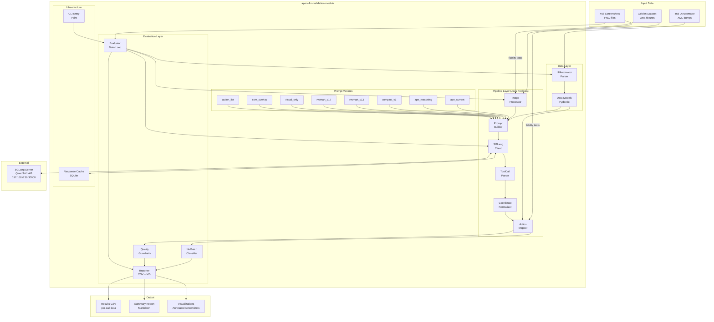
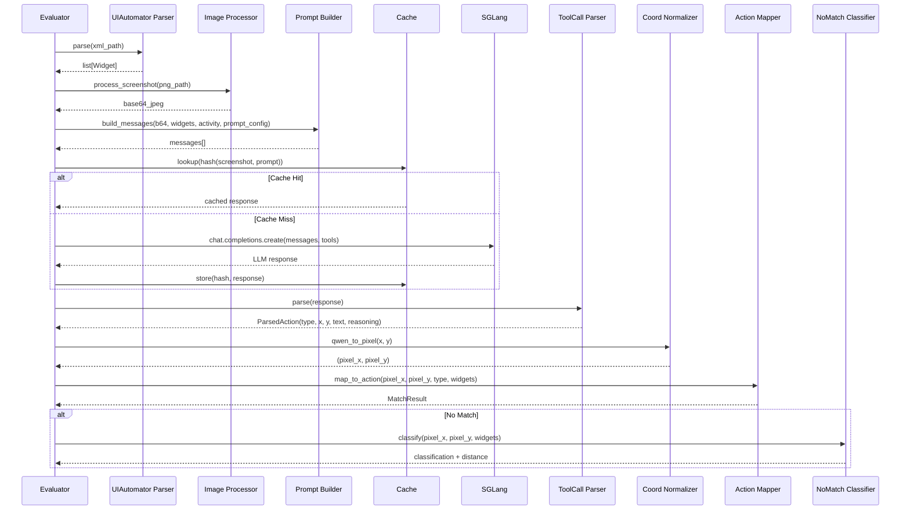
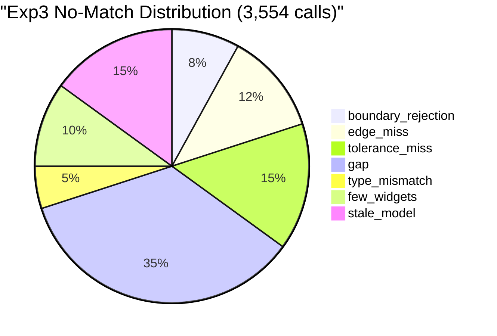
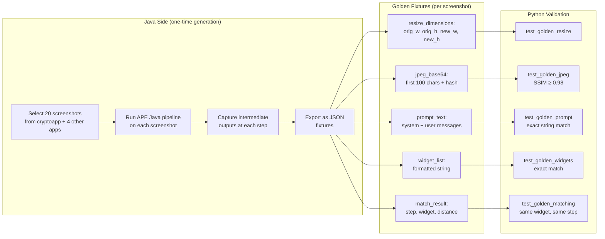
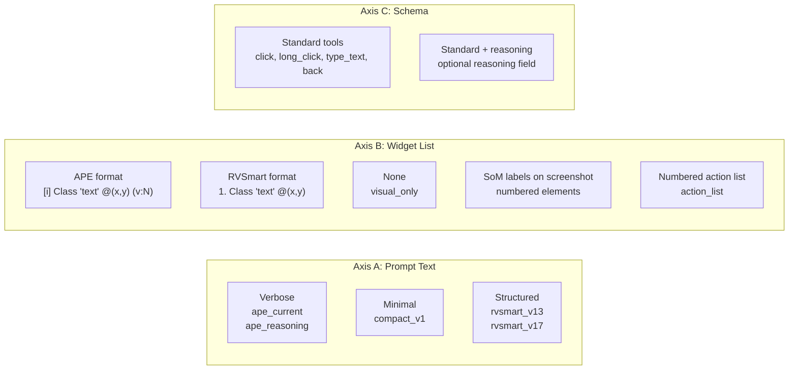

# Design: gh43 — APE-RV LLM Coordinate Mapping Validation

**Date**: 2026-03-19
**Track**: FF SDD
**GitHub Issue**: #43

---

## Context

APE-RV integrates a multimodal LLM (Qwen3-VL-4B via SGLang) into its Android exploration loop.
The LLM sees a screenshot + widget list and returns normalized coordinates [0, 1000) that are
converted to device pixels and matched against ModelActions via a 5-step algorithm. In exp3
(507 tasks, 169 APKs), 37.3% of LLM calls resulted in no_match, and the LLM variant performed
**worse** than the non-LLM baseline (27.60% vs 28.35% method coverage, p=0.014).

This module creates an offline replica of the entire APE-RV LLM pipeline in Python, running
against 468 static screenshots with UIAutomator XML ground truth. The goal is to isolate prompt
quality from architectural issues (timing gap, over-abstraction) and identify the best prompt
before modifying Java production code.

Four independent analyses (Claude, Codex, Gemini, Qwen) identified critical improvements now
incorporated: golden dataset for fidelity verification, LLM response cache, McNemar statistics,
quality guardrails beyond match rate, and reasoning field validation.

### Referenced Documents

| Document | Content |
|----------|---------|
| `docs/20260318_aperv_coordenadas_gh46.md` | Investigation plan: no_match rate, mapToModelAction algorithm, timing gap |
| `docs/20260316_aperv_llm.md` | LLM integration modes, 19 calibration parameters |
| `docs/20260317_aperv_llm_rvandroid.md` | rv-android config keys, aperv-tool variants |
| `docs/20260317_aperv_comparacao.md` | Exp3 baseline: sata_mop_llm vs all tools |
| `docs/20260318_rvape_calibracao.md` | Calibration plan: MACRO/MICRO, Optuna TPE |
| `docs/vision/FINAL_REPORT.md` | Qwen3-VL benchmark: 57.7% hit rate on 468 screenshots |
| `docs/vision/004_prompt_engineering.md` | Prompt v2 strict, fallback parser, 100% tool call rate |
| `openspec/changes/gh43-aperv-llm-validation/sota.md` | SOTA survey: 21 LLM Android testing tools, prompt analysis, positioning |

---

## Goals / Non-Goals

### Goals

1. **Replicate** the APE-RV Java LLM pipeline in Python with verified fidelity (golden dataset)
2. **Compare** 8 prompt variants on match rate, action quality, token efficiency, and latency
3. **Classify** no_match causes with a 7-category taxonomy (including `stale_model`)
4. **Identify** the best prompt for APE Java implementation with statistical rigor (McNemar)
5. **Provide** quality guardrails that prevent optimizing match rate at the cost of exploration

### Non-Goals

- Modifying the APE Java codebase (this module is read-only analysis)
- Replacing the online exp3 pipeline (this is offline validation only)
- Calibrating LLM sampling parameters (that is the MICRO phase in D4)
- Fixing the timing gap (that is gh46 scope)
- Supporting models other than Qwen3-VL-4B (single model focus)

---

## Architecture

### System Overview



### Pipeline Flow (Replicating APE Java)



### Pre-Validation Phase (Group 0.5)

Before running prompt variants, a quick grounding-only test establishes the VLM's baseline
coordinate accuracy and validates the image processing improvement.

**Design**: For each widget with a text label in the 468 UIAutomator dumps, send a simple
prompt: `"Click on the element labeled [text]"` with only the screenshot (NO coordinates in
prompt). The LLM returns coordinates via `click(x, y)` tool. Hit = returned coordinates fall
within the widget's bounds.

**Three image processing conditions** (orthogonal to prompt variants):
1. **max-edge 1000px** (current APE-RV) — baseline, expected ~57% (replicating rvsec-vision-llm)
2. **smart_resize(factor=32)** — Qwen3-VL-optimized image preprocessing
3. **raw (no resize)** — device-native resolution (1080×1920), as AppAgent does

**Two temperatures**: 0.01 (near-deterministic) and 0.7 (high variance) — two extremes to
differentiate grounding stability from stochastic exploration.

**Metrics**: Hit rate global, hit rate per app, mean distance to widget center for misses,
error distribution (boundary, edge_miss, gap), resized dimensions comparison.

**Decision gate**:
- If smart_resize improves hit rate by ≥5pp → use in all prompt variants
- If raw (no resize) is best → consider eliminating the resize step entirely
- If both ≤50% → pure grounding is fundamentally limited; coordinates in prompt are essential
  (already known from rvsec-vision-llm: 57% without coords → ~100% with coords)
- If baseline ≈57% → confirms faithful replication of rvsec-vision-llm results
- If temperature 0.01 ≈ 0.7 → grounding is temperature-insensitive, use 0.01 for reproducibility
- If 0.01 >> 0.7 → low temperature is critical for coordinate accuracy

**Prior art**: rvsec-vision-llm validation showed 57.7% hit rate with pure grounding (no
coordinates in prompt), improving to ~100% when widget coordinates were included. This pre-
validation isolates the image processing variable before prompt variant investment.

**Estimated time**: Depends on scope (see Q6 in Open Questions):
- Per-screenshot (1 prompt per screenshot): 468 × 3 modes × 2 temps = 2,808 calls (~1.5h)
- Per-widget (each text widget → separate call): ~5 widgets/screen × 468 × 6 conditions ≈ 14,040 calls (~7h)
Execution window: 2026-03-19 13:30 to 2026-03-20 09:00 (~20h available).

**Output**: `results/000_prevalidation_report.md` — narrative report following P2
(human-readable, self-contained, explains why not just what). CSV data in
`results/data/000_prevalidation_results.csv`.

### Coordinate Space Analysis

APE-RV has a unique 3-space coordinate pipeline — no other surveyed tool uses more than 2
spaces. This introduces error accumulation at each conversion step.

**Space 1 — Resized image pixels**: Screenshot resized from device resolution (1080×1920) to
max-edge 1000px (562×1000). The VLM sees this image. Qwen3-VL's internal coordinate
predictions are relative to this resized image's pixel space.

**Space 2 — Qwen normalized [0, 1000)**: Qwen3-VL outputs coordinates in its standard
normalized range. These may correspond to Space 1 (resized image) rather than the original
device resolution — the model has never seen the original resolution.

**Space 3 — Device pixels**: The matching algorithm operates in device pixel space (1080×1920),
where UIAutomator widget bounds are defined. Conversion:
`pixel = int((qwen_coord / 1000.0) * device_dimension)`.

**The critical question**: When Qwen3-VL returns normalized coordinates, are they relative to
the resized image dimensions or the original device dimensions? If the model grounds
coordinates based on the image it actually sees (Space 1), then the conversion should use
resized dimensions, not device dimensions. The current APE-RV code converts directly to device
pixels (Space 3), potentially introducing systematic spatial errors.

**999 vs 1000 asymmetry**: MobileAgent v3 uses `int(x / width * 999)` for pixel-to-Qwen
conversion but `int(normalized / 1000 * device_size)` for reverse. This asymmetry maps the
full [0, 999] range to [0, device_size), avoiding off-by-one at the maximum boundary. APE-RV
uses 1000 in both directions — this should be investigated as a potential source of boundary
errors.

### Matching Algorithm (5-Step)

This is the exact replica of `LlmRouter.mapToModelAction()` from the APE Java codebase:

```mermaid
flowchart TD
    START([LLM returns<br/>action_type, qwen_x, qwen_y]) --> CONV[Convert coordinates<br/>pixel = int&#40;qwen/1000 × dim&#41;]
    CONV --> BACK{action_type<br/>== back?}
    BACK -->|Yes| RET_BACK[Return state.backAction]
    BACK -->|No| BOUND{Boundary check<br/>pixelY < 5% height OR<br/>pixelY > 94% height?}
    BOUND -->|Yes| REJ[BOUNDARY_REJECTION<br/>no_match]
    BOUND -->|No| TYPE{action_type<br/>== type_text?}
    TYPE -->|Yes| INPUT[Filter to<br/>INPUT_CLASS_NAMES only]
    TYPE -->|No| ALL[All widgets]
    INPUT --> CONTAIN{Any widget bounds<br/>contain &#40;pixelX, pixelY&#41;?}
    ALL --> CONTAIN
    CONTAIN -->|Yes, multiple| SMALL[Select smallest area<br/>widget]
    CONTAIN -->|Yes, one| MATCH1[BOUNDS_MATCH]
    SMALL --> MATCH1
    CONTAIN -->|No| LCLICK{Was long_click<br/>with MODEL_LONG_CLICK<br/>filter?}
    LCLICK -->|Yes| RETRY[Retry without<br/>type filter]
    RETRY --> CONTAIN2{Bounds contain<br/>point?}
    CONTAIN2 -->|Yes| MATCH2[BOUNDS_MATCH<br/>after retry]
    CONTAIN2 -->|No| EUCLID
    LCLICK -->|No| EUCLID{Euclidean fallback<br/>nearest center within<br/>max&#40;50, min&#40;w,h&#41;/2&#41; px}
    EUCLID -->|Within tolerance| MATCH3[EUCLIDEAN_MATCH]
    EUCLID -->|Beyond tolerance| CLASS[Classify no_match]
    CLASS --> BREJ{pixelY in<br/>boundary zone?}
    BREJ -->|Yes| BREJ_OUT[BOUNDARY_REJECTION]
    BREJ -->|No| TYPECK{Widget at point<br/>but wrong action type?}
    TYPECK -->|Yes| TYPE_MM[TYPE_MISMATCH]
    TYPECK -->|No| EDGE{Distance to nearest<br/>widget bound ≤ 20px?}
    EDGE -->|Yes| EDGE_MISS[EDGE_MISS]
    EDGE -->|No| TOL{Distance 50-100px<br/>from nearest center?}
    TOL -->|Yes| TOL_MISS[TOLERANCE_MISS]
    TOL -->|No| FEW{≤ 2 clickable<br/>widgets?}
    FEW -->|Yes| FEW_W[FEW_WIDGETS]
    FEW -->|No| GAP[GAP]
```



> **Note on classification order**: `boundary_rejection` appears in two places: (1) as
> step 2 in the 5-step matching algorithm (where it rejects the action before containment
> is attempted), and (2) as the first check in the NoMatchClassifier (which classifies
> actions that already failed all 5 steps). The classifier's `boundary_rejection` catches
> cases where boundary rejection was NOT triggered in step 2 but the coordinates are still
> in the boundary zone (e.g., edge cases near the 5%/94% thresholds). The `stale_model`
> category is assigned post-hoc during reasoning analysis in Group 10 by examining
> reasoning texts for mentions of visible elements absent from the XML widget list.

### No-Match Classification Taxonomy



> Note: percentages above are **estimated** from partial exp3 data. Precise distribution is
> one of the primary outputs of this module.

| Category | Criterion | Actionable? | Root Cause |
|----------|-----------|-------------|------------|
| `boundary_rejection` | `pixelY < height×0.05` or `pixelY > height×0.94` | Prompt improvement (tell LLM to avoid edges) | LLM targeting status/nav bar |
| `edge_miss` | Nearest widget bound ≤ 20px | Tolerance adjustment or snap-to-nearest | Imprecise grounding |
| `tolerance_miss` | Distance 50-100px from nearest widget center | Prompt/model improvement | Poor spatial reasoning |
| `gap` | Distance > 100px from any widget | Investigate: hallucination or dynamic element | LLM error or timing gap |
| `type_mismatch` | Widget exists but wrong action type | Prompt improvement (action selection) | Wrong action inference |
| `few_widgets` | ≤ 2 clickable widgets in screen | Structural (few options) | Limited screen content |
| `stale_model` | Element visible in screenshot but not in XML (assigned post-hoc during reasoning analysis in Group 10, not by the algorithmic classifier) | Timing gap detection | Dump/screenshot temporal mismatch |

---

## Key Components

| Component | Java Source | Python Replica | Responsibility |
|-----------|------------|----------------|----------------|
| `ImageProcessor` | `ape/llm/ImageProcessor.java` | `pipeline/image_processor.py` | JPEG resize — two modes: (a) APE legacy: longest edge ≤1000px, quality 80; (b) smart_resize: factor=32 (Qwen3-VL patch 16 × merge 2), quality 80. Both output base64. |
| `PromptBuilder` | `ape/llm/ApePromptBuilder.java` | `pipeline/prompt_builder.py` | Widget list format, system message, multimodal assembly |
| `ToolCallParser` | `ape/llm/ToolCallParser.java` | `pipeline/tool_call_parser.py` | 3-level fallback: native → XML tags → inline JSON |
| `CoordinateNormalizer` | `ape/llm/CoordinateNormalizer.java` | `pipeline/coordinate_normalizer.py` | `pixel = int((qwen/1000) × dim)`, clamp |
| `ActionMapper` | `ape/llm/LlmRouter.mapToModelAction()` | `pipeline/action_mapper.py` | 5-step matching: back → boundary → containment → retry → Euclidean |
| `SglangClient` | `ape/llm/SglangClient.java` | `pipeline/sglang_client.py` | OpenAI-compatible multimodal chat |
| `UIAutomatorParser` | (GUITreeBuilder) | `data/uiautomator_parser.py` | Parse XML → Widget list with bounds |
| `NoMatchClassifier` | (new) | `evaluation/nomatch_classifier.py` | 7-category root cause classification |
| `ResponseCache` | (new) | `infrastructure/response_cache.py` | SQLite cache: `hash(screenshot+prompt) → response` |
| `QualityGuardrails` | (new) | `evaluation/quality_guardrails.py` | Widget class distribution, container rate, back rate |

---

## Replication Fidelity Strategy

### The Problem

Replicating Java behavior in Python is the highest-risk aspect of this module. Differences in
image libraries (Pillow vs Java ImageIO), JPEG compression, floating-point arithmetic, and
string formatting can produce subtle divergences that invalidate the entire comparison.

All four LLM analyses flagged this as the #1 risk.

### Golden Dataset Approach



### Tolerance Table

| Component | Criterion | Tolerance | Rationale |
|-----------|-----------|-----------|-----------|
| `ImageProcessor` | Resize dimensions | **Exact** (same integers) | Deterministic calculation |
| `ImageProcessor` | JPEG base64 | **SSIM ≥ 0.98** or perceptual hash | Pillow/Java JPEG codecs differ |
| `CoordinateNormalizer` | qwen_to_pixel | **Exact** (same integers) | Pure integer arithmetic |
| `CoordinateNormalizer` | pixel_to_qwen | **Exact** (same integers) | Pure integer arithmetic |
| `ActionMapper` | Boundary rejection thresholds | **Exact** (5%/94%) | Fixed ratios |
| `ActionMapper` | Bounds containment result | **Exact** (same widget selected) | Deterministic containment test |
| `ActionMapper` | Euclidean fallback result | **±1px** in computed tolerance | Float rounding differences |
| `ToolCallParser` | Parse result | **Exact** (same parsed values) | String parsing, deterministic |
| `PromptBuilder` | Widget list format | **Exact string match** | Format replication |
| `PromptBuilder` | System message | **Exact string match** | Copied verbatim from Java |

---

## Data Models

### Core Dataclasses

```python
@dataclass(frozen=True)
class Widget:
    """Represents a clickable UI element parsed from UIAutomator XML."""
    class_name: str
    text: str
    content_desc: str
    resource_id: str
    bounds: tuple[int, int, int, int]  # left, top, right, bottom
    clickable: bool
    long_clickable: bool
    editable: bool
    checkable: bool
    enabled: bool

    @property
    def center(self) -> tuple[int, int]:
        left, top, right, bottom = self.bounds
        return ((left + right) // 2, (top + bottom) // 2)

    @property
    def area(self) -> int:
        left, top, right, bottom = self.bounds
        return (right - left) * (bottom - top)

    @property
    def width(self) -> int:
        return self.bounds[2] - self.bounds[0]

    @property
    def height(self) -> int:
        return self.bounds[3] - self.bounds[1]


class MatchStep(str, Enum):
    """Which step of the 5-step algorithm produced the result."""
    BACK = "back"
    BOUNDS_MATCH = "bounds_match"
    LONG_CLICK_RETRY = "long_click_retry"
    EUCLIDEAN_MATCH = "euclidean_match"
    NO_MATCH = "no_match"


class NoMatchCategory(str, Enum):
    """Root cause classification for no_match results."""
    BOUNDARY_REJECTION = "boundary_rejection"
    EDGE_MISS = "edge_miss"
    TOLERANCE_MISS = "tolerance_miss"
    GAP = "gap"
    TYPE_MISMATCH = "type_mismatch"
    FEW_WIDGETS = "few_widgets"
    STALE_MODEL = "stale_model"


@dataclass(frozen=True)
class ParsedAction:
    """Result of parsing an LLM response into an action."""
    action_type: str  # click, long_click, type_text, back
    x: int  # Qwen normalized [0, 1000)
    y: int
    text: str | None = None
    reasoning: str | None = None
    parse_level: str = "native"  # native, xml_tag, inline_json


@dataclass(frozen=True)
class MatchResult:
    """Full result of matching an LLM action against widgets."""
    matched: bool
    step: MatchStep
    widget: Widget | None
    action_type: str
    pixel_x: int
    pixel_y: int
    qwen_x: int
    qwen_y: int
    distance_to_nearest: float  # pixels, center-to-point
    nearest_widget: Widget | None
    classification: NoMatchCategory | None  # only for no_match
    reasoning: str | None


@dataclass(frozen=True)
class EvaluationResult:
    """One row of evaluation output."""
    screenshot_id: str
    app_name: str
    prompt_variant: str
    repetition: int
    # LLM interaction
    tool_call_success: bool
    parse_level: str
    tokens_in: int
    tokens_out: int
    latency_ms: int
    # Matching
    match_result: MatchResult
    # Quality guardrails
    widget_class: str | None  # class of matched widget
    is_container: bool  # matched widget is generic container
    has_text: bool  # matched widget has text/content_desc


@dataclass
class PromptConfig:
    """Configuration for a prompt variant."""
    name: str
    description: str
    build_system_message: Callable[[bool, bool], str]  # (include_type_text, include_reasoning)
    build_widget_list: Callable[[list[Widget], int, int], str]  # (widgets, dev_w, dev_h)
    build_tool_schema: Callable[[bool, bool], list[dict]]  # (include_type_text, include_reasoning)
```

### Cache Schema

```python
# SQLite table: llm_responses
# Primary key: hash(screenshot_path + prompt_name + repetition_seed + temperature + resize_mode)
#
# Columns:
#   cache_key     TEXT PRIMARY KEY
#   screenshot    TEXT  -- path
#   prompt_name   TEXT
#   rep_seed      INT
#   temperature   REAL  -- LLM temperature used
#   resize_mode   TEXT  -- max_edge | smart_resize | raw
#   request_hash  TEXT  -- hash of full request payload
#   response_json TEXT  -- full OpenAI response as JSON
#   tokens_in     INT
#   tokens_out    INT
#   latency_ms    INT
#   created_at    TEXT  -- ISO timestamp
```

---

## API Design

### CLI Interface

```
aperv-llm-validate run
    --screenshots-dir PATH          # Directory with PNG + .uiautomator pairs
    --prompts NAME[,NAME,...]       # Prompt variants (default: all)
    --repetitions N                 # Repetitions per screenshot×prompt (default: 1)
    --max-screenshots N             # Limit screenshots (for quick tests)
    --sglang-url URL                # SGLang endpoint (default: http://192.168.0.36:30000/v1)
    --temperature FLOAT             # LLM temperature (default: 0.3)
    --resize-mode MODE              # Image processing: max_edge | smart_resize | raw (default: max_edge)
    --output-dir PATH               # Results directory (default: results/)
    --use-cache / --no-cache        # Enable/disable response cache (default: enabled)
    --cache-dir PATH                # Cache location (default: .cache/)
    --seed INT                      # Base seed for reproducibility

aperv-llm-validate report
    --results-dir PATH              # Generate reports from existing CSV data
    --format csv|markdown|both      # Output format (default: both)

aperv-llm-validate list-prompts     # List available prompt variants with descriptions

aperv-llm-validate validate-golden
    --fixtures-dir PATH             # Run golden dataset fidelity checks
```

### Key Functions

#### `pipeline/image_processor.py`

```python
def calculate_resized_dimensions(orig_w: int, orig_h: int,
                                  max_edge: int = MAX_EDGE_PX) -> tuple[int, int]:
    """Exact replica of ImageProcessor.calculateResizedDimensions().
    Preconditions: orig_w > 0, orig_h > 0, max_edge > 0.
    Postconditions: max(new_w, new_h) <= max_edge; aspect ratio preserved.
    """

def process_screenshot(png_path: Path) -> str:
    """Read PNG, resize, JPEG quality 80, return base64 (no data URI prefix).
    Error: FileNotFoundError if png_path missing. ValueError if not a valid image.
    """

def process_screenshot_bytes(png_bytes: bytes) -> str:
    """Same as process_screenshot but from in-memory bytes. Used by tests."""
```

#### `pipeline/action_mapper.py`

```python
def map_to_action(pixel_x: int, pixel_y: int,
                  action_type: str, text: str | None,
                  widgets: list[Widget],
                  device_w: int = DEVICE_WIDTH,
                  device_h: int = DEVICE_HEIGHT) -> MatchResult:
    """5-step matching algorithm — exact replica of LlmRouter.mapToModelAction().
    Preconditions: 0 <= pixel_x < device_w, 0 <= pixel_y < device_h.
    Postconditions: MatchResult.step indicates which algorithm step produced the result.
    """
```

#### `evaluation/evaluator.py`

```python
class Evaluator:
    def __init__(self, config: EvaluatorConfig): ...

    def run(self, screenshots_dir: Path,
            prompt_names: list[str],
            repetitions: int = 1,
            max_screenshots: int | None = None) -> list[EvaluationResult]:
        """Main evaluation loop. Resumes from existing results.
        For each screenshot × prompt × rep:
          1. Check cache → skip if cached response exists
          2. Parse XML → widgets
          3. Process image → base64
          4. Build prompt → messages
          5. Call LLM (or use cache)
          6. Parse response → ParsedAction
          7. Normalize coordinates → pixels
          8. Match against widgets → MatchResult
          9. Classify no_match if applicable
          10. Compute quality guardrails
          11. Record EvaluationResult
        """

    def health_check(self) -> bool:
        """Verify SGLang is available and serving the expected model."""
```

#### `pipeline/coordinate_normalizer.py`

```python
def qwen_to_pixel(qwen_x: int, qwen_y: int,
                  device_w: int = DEVICE_WIDTH,
                  device_h: int = DEVICE_HEIGHT) -> tuple[int, int]:
    """Convert Qwen3-VL normalized [0,1000) coords to device pixels.
    Formula: pixel = int((qwen / 1000.0) * dim), clamped to [0, dim-1].
    """

def pixel_to_qwen(pixel_x: int, pixel_y: int,
                  device_w: int = DEVICE_WIDTH,
                  device_h: int = DEVICE_HEIGHT) -> tuple[int, int]:
    """Convert device pixels to Qwen3-VL normalized [0,1000) coords.
    Formula: qwen = int((pixel / dim) * 1000), clamped to [0, 999].
    """
```

#### `pipeline/prompt_builder.py`

```python
def build_widget_list(widgets: list[Widget], device_w: int, device_h: int) -> str:
    """Format widget list in APE format: [i] ClassName "text" @(normX,normY) (v:0)."""

def build_system_message(include_type_text: bool, include_reasoning: bool = False) -> str:
    """Exact replica of ApePromptBuilder.buildSystemMessage()."""

def build_user_text(activity: str, widgets: list[Widget],
                    device_w: int, device_h: int) -> str:
    """Screen header + widget list + exploration context."""

def build_messages(screenshot_b64: str, widgets: list[Widget], activity: str,
                   device_w: int, device_h: int, prompt_config: PromptConfig) -> list[dict]:
    """Assemble 2-message multimodal prompt (system + user with image)."""

def build_tool_schema(include_type_text: bool, include_reasoning: bool = False) -> list[dict]:
    """OpenAI tools array with click, long_click, type_text (conditional), back."""
```

#### `evaluation/nomatch_classifier.py`

```python
def classify_nomatch(pixel_x: int, pixel_y: int, action_type: str,
                     widgets: list[Widget],
                     device_w: int = DEVICE_WIDTH,
                     device_h: int = DEVICE_HEIGHT) -> NoMatchCategory:
    """Classify no_match root cause using canonical order:
    boundary_rejection → type_mismatch → edge_miss → tolerance_miss → few_widgets → gap.
    Note: stale_model is assigned post-hoc during reasoning analysis (Group 10).
    """

def compute_nearest_widget_distance(pixel_x: int, pixel_y: int,
                                     widgets: list[Widget]) -> tuple[Widget, float]:
    """Distance from point to nearest widget center. Returns (widget, distance_px)."""

def compute_nearest_bound_distance(pixel_x: int, pixel_y: int,
                                    widgets: list[Widget]) -> tuple[Widget, float]:
    """Distance from point to nearest widget bound edge. Returns (widget, distance_px)."""
```

#### `evaluation/quality_guardrails.py`

```python
def compute_guardrails(results: list[EvaluationResult]) -> dict:
    """Compute all guardrail metrics: container_click_rate, semantic_widget_rate,
    back_rate, type_text_coverage, action_diversity, per_app_consistency."""

def quality_score(results: list[EvaluationResult]) -> float:
    """Composite: 0.60 × match_rate + 0.20 × semantic_rate +
    0.10 × type_text_coverage + 0.10 × diversity."""
```

#### `infrastructure/response_cache.py`

```python
class ResponseCache:
    """SQLite-backed cache for LLM responses. Thread-safe.
    Key: hash(screenshot_basename + prompt_name + rep_seed + temperature + resize_mode).
    Provides reproducibility (re-run reports without LLM) and resilience (SGLang restart).
    """

    def __init__(self, cache_dir: Path): ...
    def get(self, screenshot: str, prompt: str, rep_seed: int,
            temperature: float, resize_mode: str) -> dict | None: ...
    def put(self, screenshot: str, prompt: str, rep_seed: int,
            temperature: float, resize_mode: str,
            response: dict, tokens_in: int, tokens_out: int, latency_ms: int) -> None: ...
    def stats(self) -> dict: ...  # hits, misses, size
```

---

## Prompt Variant Architecture

### Design Rationale

The 8 variants test orthogonal dimensions:



| Variant | Axis A | Axis B | Axis C | Tests |
|---------|--------|--------|--------|-------|
| `ape_current` | Verbose (APE production) | APE format | Standard | Production baseline |
| `ape_reasoning` | Verbose (APE production) | APE format | + reasoning | Impact of reasoning field |
| `compact_v1` | Minimal (v2 strict) | APE format | + reasoning | Token efficiency |
| `rvsmart_v13` | Structured (dialog handling) | RVSmart | + reasoning | Cross-tool transfer |
| `rvsmart_v17` | Structured (6-step reasoning) | RVSmart | + reasoning | MOP-aware prompting |
| `visual_only` | Minimal | None | + reasoning | Widget list value |
| `som_overlay` | Minimal | SoM labels | + reasoning + element_id | SoM grounding accuracy |
| `action_list` | Minimal | Numbered list | + reasoning + action_id | SOTA upper bound (100% match by construction) |

### Reasoning Field Validation Gate

Before using `reasoning` in analysis, validate it does not alter LLM behavior:

1. Run 50 screenshots × `ape_current` (no reasoning) and `ape_reasoning` (with reasoning)
2. Compare coordinates: must be identical in ≥ 95% of cases
3. Compare match rate: `ape_reasoning` within ± 2pp of `ape_current`
4. If validation fails: report as finding, proceed with `ape_current` as baseline

**Variant 7: `som_overlay`** — Comparison variant that tests whether eliminating coordinate
prediction improves match rate while preserving visual context. Numbered labels are drawn on
the screenshot at each widget's center using Pillow (semi-transparent background, dedup at
30px). The tool schema changes: instead of `click(x, y)`, tools receive `click(element_id)`.
This is NOT the primary approach (APE-RV is agentic and uses coordinate-based tools for
dynamic elements not in UIAutomator dump), but serves as a comparison point to isolate
coordinate prediction quality from action selection quality.

**Variant 8: `action_list`** — SOTA upper-bound variant that tests action-list selection,
the dominant approach in mature tools (DroidBot-GPT, LLMDroid, VisionDroid — see sota.md
Section 8.1). The LLM receives a screenshot + numbered list of clickable widgets and returns
`select_action(action_id: int)`. Match is 100% by construction (any valid ID maps to a widget),
so the metric shifts from match rate to **action quality**: does the LLM select the most
exploration-productive widget? This variant establishes the ceiling for what element selection
can achieve without coordinate prediction, informing the architectural decision of whether to
invest in coordinate accuracy or switch to action-list selection.

**Statistical comparison**: The 6 coordinate-based variants (ape_current through visual_only)
form the **main comparison set** (15 pairwise McNemar tests with Bonferroni correction).
`som_overlay` and `action_list` use different action spaces (element_id/action_id vs x,y)
and are analyzed **separately** — their "match" has a different meaning, making McNemar
comparison with coordinate variants invalid.

---

## Quality Guardrails

Match rate alone is a dangerous optimization target. A prompt could increase match rate by
biasing the LLM toward large, easy-to-hit containers (e.g., always clicking the biggest
FrameLayout) while producing worse exploration coverage.

### Guardrail Metrics

| Metric | What It Detects | Threshold |
|--------|-----------------|-----------|
| Container click rate | % of matches on generic containers (FrameLayout, LinearLayout, RelativeLayout, ConstraintLayout) | Flag if > 30% |
| Semantic widget rate | % of matches on widgets with text/content_desc/resource_id | Flag if < 50% |
| Back action rate | % of LLM calls returning back | Flag if > 15% |
| type_text coverage | % of calls using type_text when EditText present | Report (higher is better) |
| Action diversity | Shannon entropy of action type distribution | Report (higher is better) |
| Per-app consistency | Std dev of match rate across apps | Flag if > 25pp |

### Quality Score (Composite)

```python
def quality_score(results: list[EvaluationResult]) -> float:
    """Composite metric that balances match rate with action quality.
    quality = 0.60 × match_rate + 0.20 × semantic_rate + 0.10 × type_text_coverage + 0.10 × diversity
    """
```

---

## Statistical Methodology

### Primary Comparison: McNemar Test

For comparing two prompts on the same screenshots, the outcome per screenshot is binary
(match/no_match). Standard paired tests (t-test, Wilcoxon) are inappropriate for binary data.

**McNemar test** compares discordant pairs:

```
                 Prompt B: match    Prompt B: no_match
Prompt A: match       a                  b
Prompt A: no_match    c                  d

chi2 = (b - c)^2 / (b + c)    with continuity correction
p-value from chi2 distribution with 1 df
```

### Confidence Intervals

Bootstrap 95% CI for match rate per prompt (10,000 resamples, stratified by app).

### Multiple Comparisons

The **main comparison set** includes the 6 coordinate-based variants (ape_current,
ape_reasoning, compact_v1, rvsmart_v13, rvsmart_v17, visual_only). With 6 prompts, there
are C(6,2) = 15 pairwise comparisons. Apply Bonferroni correction: significance threshold =
0.05 / 15 = 0.0033.

`som_overlay` and `action_list` use different action spaces (element_id/action_id vs x,y
coordinates) and are analyzed **separately** — not included in the pairwise McNemar
comparisons. Their metrics (action quality, semantic coverage) are reported alongside the
main comparison but without statistical pairing.

### Repetition Analysis (Group 9)

For top-2 prompts with 3 repetitions:
- Report mean ± std of match rate across reps
- If std > 3pp within a prompt: flag as unstable (LLM nondeterminism)
- Compare prompts using all reps: Wilcoxon signed-rank on per-screenshot means

---

## Error Handling

| Error | Source | Strategy | Recovery |
|-------|--------|----------|----------|
| SGLang unavailable | Network/server down | Health check before run; retry 3× with exponential backoff | Pause run, log, resume with `--use-cache` |
| SGLang timeout | Slow inference | Per-call timeout (15s default) | Skip screenshot, record as `SERVER_ERROR` |
| Invalid PNG | Corrupted file | Catch Pillow error | Skip, log warning |
| Missing XML pair | 469 PNGs vs 468 XMLs | Check for matching `.uiautomator` file | Skip orphan PNGs, log |
| Malformed XML | Bad UIAutomator dump | defusedxml parse error | Skip, log warning |
| No tool call in response | LLM replied conversationally | 3-level fallback parser | Record as `NO_TOOL_CALL` |
| Cache corruption | SQLite error | Catch, delete entry | Re-fetch from LLM |
| Disk full | Large cache/results | Check space before run | Warn and abort |

---

## Decisions

### D1: Standalone Module (not integrated with existing modules)

**Decision**: Create `modules/aperv-llm-validation/` as a standalone uv workspace module with
no dependencies on rv-android-core, rv-platform, or rv-agent.

**Rationale**: This is an investigation tool, not production code. It may be removed after
analysis. Keeping it isolated prevents coupling and simplifies cleanup.

**Alternative considered**: Reusing `rv-agent`'s LLM client and screen parser. Rejected because
rv-agent uses LangGraph/LangChain patterns that differ from APE's raw OpenAI-compatible calls.

### D2: SQLite Cache (not diskcache or filesystem)

**Decision**: Use SQLite for response caching.

**Rationale**: Single-file database, no external dependencies, supports atomic operations,
easy to inspect with `sqlite3` CLI. `diskcache` adds a dependency for minimal benefit.

**Alternative considered**: `diskcache` (simpler API but adds dependency), filesystem
(harder to query/inspect).

### D3: McNemar Test (not t-test or Wilcoxon)

**Decision**: Use McNemar test for pairwise prompt comparison.

**Rationale**: The per-screenshot outcome is binary (match/no_match). McNemar is the standard
test for comparing binary outcomes on paired samples. t-test assumes continuous data; Wilcoxon
assumes ordinal data with meaningful ranks.

**Alternative considered**: Chi-square (ignores pairing), Fisher exact (ignores pairing),
bootstrap (valid but McNemar is standard and interpretable).

### D4: 7-Category Taxonomy (adds `stale_model` to original 6)

**Decision**: Add `stale_model` category for elements visible in screenshot but absent from XML.

**Rationale**: The timing gap between UIAutomator dump and screenshot is a known architectural
issue. Without this category, timing-gap failures are misclassified as `gap` (LLM error).

**Detection**: A `gap` classification where reasoning mentions a visible element that does not
appear in the widget list. Manual inspection of top-N gap cases in the reasoning analysis.

### D5: No Holdout Set in Phase B (but report in-sample vs per-app variance)

**Decision**: Use all 468 screenshots for evaluation. No holdout.

**Rationale**: Phase B is exploratory (identifying best prompt), not predictive (deploying a
model). Overfitting risk is low because: (a) we compare 8 fixed prompts, not tuning parameters;
(b) the true validation is Phase A' (re-run on live APKs). Instead of holdout, report per-app
match rate to detect prompts that overfit to specific apps.

**Alternative considered**: 10% holdout (Qwen's AMB-04). Rejected: 47 screenshots is too few
for meaningful per-app analysis on the holdout set.

### D6: `reasoning` as Optional Field with Validation Gate

**Decision**: Include `reasoning` in tool schema as optional parameter. Validate that it does
not alter match rate before using in analysis.

**Rationale**: `reasoning` provides invaluable diagnostic data ("correct intent, wrong coords"
vs "wrong intent"). But adding a field to the schema can change LLM behavior. The validation
gate (50 screenshots, Δ < 2pp) ensures we detect and document any impact.

### D7: smart_resize(factor=32) for Qwen3-VL Image Preprocessing

**Decision**: Test smart_resize(factor=32) as alternative to max-edge 1000px resize.

**Rationale**: Deep SOTA analysis revealed that Qwen3-VL uses patch_size=16 with
spatial_merge_size=2, requiring image dimensions divisible by 32 for optimal ViT processing.
APE-RV's current 562×1000 resize is not divisible by 32, causing padding/truncation. MobileAgent
v3 (Alibaba) uses the analogous smart_resize for Qwen2.5-VL with factor=28. Sources:
[Qwen3-VL architecture](https://deepwiki.com/QwenLM/Qwen3-VL/4.2-model-architecture),
[Issue #1831](https://github.com/QwenLM/Qwen3-VL/issues/1831).

**Alternative considered**: Keep max-edge 1000px (simpler). Rejected because the SOTA analysis
shows every tool using Qwen-VL models applies dimension alignment to the patch size.

### D8: Pre-Validation Phase (Group 0.5) Before Prompt Variants

**Decision**: Run a quick grounding-only test (no coordinates in prompt) with 2 image
processing conditions before the full prompt variant evaluation.

**Rationale**: rvsec-vision-llm showed 57.7% hit rate with pure grounding, 100% with
coordinates in prompt. Testing smart_resize vs max-edge on pure grounding isolates the image
processing variable and avoids wasting 3.7h of SGLang if the improvement is marginal.

**Alternative considered**: Skip pre-validation, go directly to prompt variants. Rejected
because a ~1h test can validate a variable that affects ALL prompt variants.

### D9: SoM and Action-List as Comparison Variants (Not Primary)

**Decision**: Include `som_overlay` (variant 7) and `action_list` (variant 8) as comparison
variants. APE-RV's primary approach remains coordinate-based tool calling.

**Rationale**: APE-RV is designed to be agentic — the LLM receives tools and decides which to
use. The multimodal VLM is specifically used for dynamic elements not in UIAutomator dumps.
However, the SOTA survey (sota.md Section 8.1) is unambiguous: action-list selection achieves
100% match rate by construction and is the dominant approach in mature tools (DroidBot-GPT,
LLMDroid, VisionDroid). Not testing this empirically would be a significant gap.

Action-list selection was the project's first approach (rvandroid tool, now in backup/), but
was abandoned because it did not leverage multimodal capabilities and produced lower-quality
exploration than the agentic approach. The conditions have changed since then (different model,
different prompts, different evaluation criteria), so re-testing with current infrastructure is
warranted as a comparison point. Both SoM and action-list serve to quantify the cost of
coordinate prediction vs element selection, establishing upper bounds that inform whether the
coordinate approach is worth optimizing or should be replaced.

**Statistical note**: SoM and action-list use different action spaces (element_id/action_id vs
x,y coordinates). They are analyzed **separately** from the 6 coordinate-based variants and do
not participate in the pairwise McNemar comparison.

---

## Risks / Trade-offs

| Risk | Probability | Impact | Mitigation |
|------|-------------|--------|------------|
| **Python/Java drift** — replica diverges from Java pipeline | High (70%) | High | Golden dataset with per-component tolerance checks (see Replication Fidelity) |
| **Match rate ≠ exploration quality** — optimizing wrong metric | Medium (40%) | High | Quality guardrails (container rate, semantic rate, diversity) |
| **SGLang downtime** — 3.7h run interrupted | Medium (30%) | Medium | Response cache + resume capability + health check before each group |
| **`reasoning` alters behavior** — changes match rate | Medium (30%) | Medium | Validation gate: 50-screenshot comparison before full run |
| **Dataset bias** — 468 screenshots not representative of production | Medium (40%) | Medium | Report per-app match rate; Phase A' validates on live APKs |
| **Stale golden fixtures** — Java code changes after fixture generation | Low (10%) | High | Pin Java commit hash in golden fixtures metadata |
| **468 vs 469 file mismatch** — orphan PNG causes errors | Certain | Low | Skip PNGs without matching `.uiautomator`, log warning |
| **Coordinate space mismatch** — VLM grounds on resized image but coords mapped to device pixels | Medium (50%) | High | Pre-validation + coordinate space analysis in Group 10 |

---

## Limitations

This module is an **offline investigation** with known limitations relative to the online
APE-RV pipeline:

1. **No timing gap**: In exp3, UIAutomator dumps and screenshots are captured at different
   moments, creating temporal mismatch (`stale_model` category). Offline, both come from the
   same static capture — the `stale_model` category effectively disappears, and overall match
   rate will be systematically **higher** than online. The difference between offline and online
   match rate is itself a useful metric: it estimates the timing gap contribution.

2. **Static screenshots**: In the real pipeline, LLM decisions affect exploration, which
   generates subsequent screenshots (feedback loop). Offline evaluation breaks this loop — a
   prompt that appears worse offline (e.g., more backtrack) might be better online (discovers
   new states). Prompt comparison remains valid in relative terms (same dataset), but absolute
   match rate does not transfer directly.

3. **Partial app coverage**: 468 screenshots from 28 F-Droid apps represent ~16.5% of the
   169 apps in exp3. Apps with unusual UI patterns (games, media players) may be
   under-represented. Per-app analysis mitigates but does not eliminate this bias.

4. **Visit count always v:0**: In APE-RV, widgets carry visit counts (`v:N`) that influence
   prompt priority. Offline, all widgets have `v:0` since there is no exploration history.
   Prompts that rely on visit counts for decision-making (e.g., rvsmart_v17) may behave
   differently offline.

5. **No coverage correlation**: This module measures match rate and action quality, but not
   the downstream effect on method/activity/MOP coverage. Phase A' (live APK validation) is
   required to confirm that prompt improvements translate to better exploration outcomes.

---

## Success Criteria

Quantitative thresholds for interpreting gh43 results and deciding next steps:

| Result | Interpretation | Action |
|--------|---------------|--------|
| Best coordinate variant ≥ 75% match rate AND quality score ≥ 0.70 | Prompt improvement viable | Port best prompt to APE Java |
| Best coordinate variant 65-75% match rate | Marginal gain; timing gap likely dominates | Prioritize gh46 (timing gap fix) before prompt changes |
| Best coordinate variant < 65% match rate | Coordinate prediction fundamentally limited with Qwen3-VL-4B | Recommend architectural change to action-list/SoM |
| smart_resize improves hit rate by ≥ 5pp | Image processing is a bottleneck | Apply smart_resize in APE Java |
| `stale_model` accounts for > 30% of no_match | Timing gap is primary cause | Confirms gh46 priority |
| `action_list` action quality ≥ coordinate-based quality | Action-list viable as replacement | Plan migration from coordinate prediction |
| Container rate > 40% for best variant | Optimizing wrong metric | Reassess quality guardrail weights |

---

## Testing Strategy

| Layer | What | How | Count |
|-------|------|-----|-------|
| **Unit** | ImageProcessor dimensions | Known dimension pairs | ~5 |
| **Unit** | CoordinateNormalizer conversions | Known coordinate pairs | ~6 |
| **Unit** | ActionMapper 5-step algorithm | Cryptoapp fixtures + synthetic widgets | ~10 |
| **Unit** | ToolCallParser 3-level fallback | Real malformed responses from exp3 | ~10 |
| **Unit** | UIAutomatorParser XML parsing | Cryptoapp `.uiautomator` fixture | ~5 |
| **Unit** | PromptBuilder format | Compare against APE Java output | ~5 |
| **Unit** | NoMatchClassifier categories | Synthetic positions + known classifications | ~8 |
| **Unit** | QualityGuardrails metrics | Synthetic result sets | ~5 |
| **Golden** | Per-component Java fidelity | Golden fixtures from 20 screenshots | ~20 |
| **Integration** | End-to-end pipeline (mocked LLM) | Cryptoapp: XML → match with known response | ~5 |
| **Smoke** | Live SGLang round-trip | 3 screenshots × 1 prompt × 1 rep | ~3 |
| **Total** | | | **~82** |

---

## File Inventory

```
modules/aperv-llm-validation/
├── pyproject.toml
├── src/
│   └── aperv_llm_validation/
│       ├── __init__.py
│       ├── constants.py                        # APE-RV constants
│       ├── pipeline/
│       │   ├── __init__.py
│       │   ├── image_processor.py              # Replica: ImageProcessor.java
│       │   ├── prompt_builder.py               # Replica: ApePromptBuilder.java
│       │   ├── tool_call_parser.py             # Replica: ToolCallParser.java
│       │   ├── coordinate_normalizer.py        # Replica: CoordinateNormalizer.java
│       │   ├── action_mapper.py                # Replica: LlmRouter.mapToModelAction()
│       │   └── sglang_client.py                # OpenAI-compatible client
│       ├── data/
│       │   ├── __init__.py
│       │   ├── uiautomator_parser.py           # Parse .uiautomator XML → Widget list
│       │   └── models.py                       # Widget, MatchResult, EvaluationResult, etc.
│       ├── prompts/
│       │   ├── __init__.py
│       │   ├── registry.py                     # Prompt variant registry
│       │   ├── ape_current.py                  # APE production prompt
│       │   ├── ape_reasoning.py                # APE + reasoning parameter
│       │   ├── compact_v1.py                   # Minimal strict prompt
│       │   ├── rvsmart_v13.py                  # RVSmart V13 format
│       │   ├── rvsmart_v17.py                  # RVSmart V17 format
│       │   ├── visual_only.py                  # No widget list baseline
│       │   ├── som_overlay.py                  # SoM numbered labels (comparison)
│       │   └── action_list.py                 # Action-list selection (SOTA upper bound)
│       ├── evaluation/
│       │   ├── __init__.py
│       │   ├── evaluator.py                    # Main evaluation loop
│       │   ├── nomatch_classifier.py           # 7-category root cause classification
│       │   ├── quality_guardrails.py           # Action quality metrics
│       │   └── reporter.py                     # CSV + Markdown + visualizations
│       ├── infrastructure/
│       │   ├── __init__.py
│       │   └── response_cache.py               # SQLite response cache
│       └── cli.py                              # CLI entry point
├── results/                                    # All reports, data, and visualizations
│   ├── 000_prevalidation_report.md             # Group 0.5: pure grounding + smart_resize
│   ├── 001_baseline_report.md                  # Group 7: ape_current + ape_reasoning baseline
│   ├── 002_prompt_comparison_report.md         # Group 8: all 8 prompt variants
│   ├── 003_deep_evaluation_report.md           # Group 9: top-2 prompts × 3 reps
│   ├── 004_nomatch_analysis_report.md          # Group 10: classification + reasoning
│   ├── 005_final_report.md                     # Group 10: executive summary + recommendations
│   ├── data/                                   # CSV data files backing the reports
│   │   ├── 000_prevalidation_results.csv       # Per-widget grounding results
│   │   ├── 001_baseline_results.csv            # ape_current + ape_reasoning per-call data
│   │   └── 002_evaluation_results.csv          # All prompt variants per-call data
│   └── figures/                                # Visualizations referenced by reports
│       ├── nomatch_heatmap.png
│       └── annotated/                          # Annotated screenshot examples
├── tests/
│   ├── __init__.py
│   ├── fixtures/                               # Golden dataset + test data
│   │   ├── golden/                             # Java pipeline outputs (20 screenshots)
│   │   │   └── README.md                       # Java commit hash + generation instructions
│   │   └── cryptoapp/                          # Cryptoapp test fixtures
│   ├── test_image_processor.py
│   ├── test_coordinate_normalizer.py
│   ├── test_action_mapper.py
│   ├── test_tool_call_parser.py
│   ├── test_uiautomator_parser.py
│   ├── test_prompt_builder.py
│   ├── test_nomatch_classifier.py
│   ├── test_quality_guardrails.py
│   ├── test_response_cache.py
│   └── test_golden_fidelity.py                 # Golden dataset validation
└── scripts/
    ├── generate_golden_fixtures.sh             # Instructions for Java fixture generation
    └── prevalidation.py                        # Standalone pre-validation script (Group 0.5)
```

---

## Open Questions

| # | Question | Impact | When to Resolve |
|---|----------|--------|-----------------|
| Q1 | Which Java commit to pin for golden fixtures? | High — determines baseline | Before Group 1 |
| Q2 | Can we extract golden fixtures from APE Java programmatically or manually? | Medium — affects fixture generation effort | Before Group 2 |
| Q3 | Should `stale_model` detection use only reasoning text, or add visual diff analysis? If reasoning validation gate fails, `stale_model` cannot be detected via reasoning — fallback to 6 algorithmic categories only. | Medium — affects complexity | During Group 10 analysis |
| Q4 | Is 0.3 the right temperature for all prompts, or should each variant use its own? Group 0.5 tests 0.01 vs 0.7 extremes; if 0.01 >> 0.7, use 0.01 for Groups 7-9. | Low — can test in Group 9 | After Group 0.5 |
| Q5 | Should we include exp3 trace replay (Phase A) in this module or keep it separate? | Low — scope question | After Phase B completion |
| Q6 | Group 0.5 scope: is grounding per-widget (each widget with text → separate LLM call) or per-screenshot (one prompt per screenshot)? Per-widget: ~14,040 calls (~7h). Per-screenshot: ~2,808 calls (~1.5h). | Medium — affects execution time | Before Group 0.5 |
