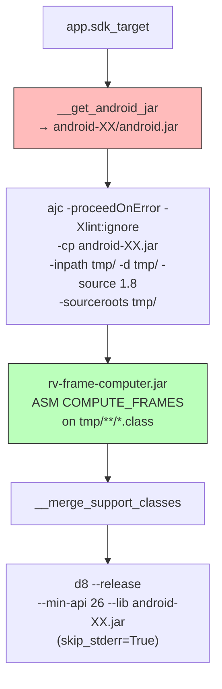

## Context

The instrumentation pipeline has very low success rates on modern APKs (17.5% JCA, 54% generic_new). Analysis of 1164 APKs across 3 datasets identified d8 rejecting ajc-corrupted stack frames as the dominant failure family (37-64%), followed by `j$` prefix conflicts (~7-15%) and ajc internal crashes (~5-25%). Additionally, the hardcoded `android-29/android.jar` causes type resolution failures on APKs targeting API 30+. GitHub Issue: #50, builds on #49 (error masking fix).

Post-landing empirical validation on `cryptoapp.apk` (Apr 2026) revealed that two of the originally-planned mitigations silently broke runtime instrumentation while producing valid-looking APKs (d8 succeeded, JSON reports looked consistent, but logcat had zero coverage events). Those two mitigations were reverted — see D-REVERT below and Section 8 of `tasks.md`.

References: FR02, NFR04. Main file: `modules/rv-instrumentation/src/rv_instrumentation/rvandroid.py`.

## Architecture



### Key Components

| Component | Responsibility | Input | Output |
|-----------|---------------|-------|--------|
| `__compute_stack_frames()` [NEW] | Run rv-frame-computer.jar (ASM COMPUTE_FRAMES) on woven classes | `tmp_dir` with .class files | Same files with recomputed frames |
| `__get_android_jar()` [MODIFIED] | Select android.jar by APK's targetSdkVersion | `app.sdk_target` | Path to best-matching android.jar |
| `__weave_monitors()` [MODIFIED] | Add `-proceedOnError` to ajc | ajc command | woven classes (partial on error) |
| `__d8()` [MODIFIED] | Use `skip_stderr=True` on execute_command | d8 command | DEX bytecode |
| `RVInstrumentationConfig` [MODIFIED] | Resolve path for frame computer jar | config | jar path |

## Mapping: Spec → Implementation → Test

| Requirement / Invariant | Implementation | Test |
|------------------------|----------------|------|
| INV-INS-14: ajc -proceedOnError | `rvandroid.py:__weave_monitors()` — add flag | `test_ajc_includes_proceed_on_error` |
| INV-INS-17: ASM COMPUTE_FRAMES post-weaving | `rvandroid.py:__compute_stack_frames()` + `rv-frame-computer.jar` | `test_compute_frames_invoked_after_weaving` |
| INV-INS-18: dynamic android.jar by targetSdkVersion | `rvandroid.py:__get_android_jar()` | `test_android_jar_matches_target_sdk` |
| INV-INS-19: d8 skip_stderr=True | `rvandroid.py:__d8()` — skip_stderr param | `test_d8_skip_stderr` |
| `__merge_support_classes` reraise=True | Already implemented in gh49 (commit `8a25e7ec`) | Covered by existing tests |
| Preserved FR02 scenarios (8) | Unchanged from baseline | Covered by existing tests |

INV-INS-13 (`--no-desugaring`), INV-INS-15 (`-xmlConfigured`), INV-INS-16 (`weaving_excludes.yaml`) from the initial draft were removed after empirical validation — see D-REVERT.

## Goals / Non-Goals

**Goals:**
- Improve instrumentation success rate (estimate: JCA 17.5% → ~30%, generic_new 54% → ~58%, revised downward from original plan after revert)
- Fix corrupted stack map frames via ASM COMPUTE_FRAMES on all woven classes
- Resolve ajc type resolution failures via dynamic `android.jar` selection
- Preserve MOP monitoring of app code (library exclusion happens at runtime via `Coverage.aj`'s `excludedPackages()` pointcut)
- Preserve JDK 11+ nest-mate semantics (d8 desugaring must remain enabled for `--min-api < 30`)

**Non-Goals:**
- Fixing dex2jar conversion issues (separate tool, <1% of failures)
- Static/configurable compile-time library exclusion (reverted — see D-REVERT)
- Full d8 AIOOBE resolution (some cases are d8 internal bugs unrelated to stack frames)

## Decisions

### D-REVERT: Revert `-xmlConfigured` and `--no-desugaring` after empirical failure (Apr 2026)

**Choice**: Remove the `-xmlConfigured` + `aop.xml` + `weaving_excludes.yaml` path and remove `--no-desugaring` from the d8 command. Keep `-proceedOnError`, COMPUTE_FRAMES, dynamic android.jar, AspectJ 1.9.25.1, and `skip_stderr=True`.

**Trigger**: End-to-end run of `rv-experiment` on `cryptoapp.apk` (baseline: previously worked, heavily monitored) produced an instrumented APK with **zero `RVSEC-COV` events** in logcat and **app crash on launch**.

**Evidence collected** (`scripts/` + direct `adb` probes on emulator, `results/gh50_val/`):

1. **`-xmlConfigured` regression**: The generated `aop.xml` contained `<weaver>...<exclude/>...</weaver>` only, with no `<aspects>` declaration. `dexdump -d` on `cryptoapp.apk` instrumented with the flag:
   - `classes.dex` contains `Coverage` and `MultiSpec_1MonitorAspect` as classes (compiled from `.aj`)
   - `classes2-6.dex` (app + androidx): **0 `aspectOf` invocations** — no bytecode in app methods references the aspects, so no pointcut fires at runtime
   - Logcat for full 60s run: zero `RVSEC-COV` events
   - After removal of `-xmlConfigured`: `classes.dex` shows `MultiSpec_1MonitorAspect.ajc$afterReturning$...(Ljava/security/MessageDigest;)V` injected directly after `MessageDigest.getInstance()` in `MessageDigestUtil`; logcat shows both `RVSEC-COV` (12 app-method coverage events during manual actions) and `RVSEC` (2 MOP violations: `UnsafeAlgorithm MD5`, `InvalidSequenceOfMethodCalls`) events

2. **`--no-desugaring` regression**: With `--no-desugaring`, d8 skips synthetic-accessor generation for JDK 11+ nest-mate access. `rv-monitor-rt.jar` (the monitor runtime) is compiled with JDK 11+ bytecode, so `TerminatedMonitorCleaner$Runner.updateEntries()` emits `sget-object TerminatedMonitorCleaner.removedEntries` directly against a private static field of its outer class. Dalvik on `--min-api 26` (Android 8.0-10.0) does not support nest-based access control; it raises `java.lang.IllegalAccessError: Field 'com.runtimeverification.rvmonitor.java.rt.tablebase.TerminatedMonitorCleaner.removedEntries' is inaccessible to class '...TerminatedMonitorCleaner$Runner'` on the first `MonitorCleaner` thread tick, force-closing the app. `dexdump` confirmed no `access$XXX` synthetic method existed on the outer class.
   - After removal of `--no-desugaring`: app launches without crash; `MonitorCleaner` runs normally; logcat shows expected events.

**Rationale for keeping the other gh50 mitigations**:
- `-proceedOnError`: orthogonal to the two reverted flags; still useful to continue past individual class-level weaver failures.
- COMPUTE_FRAMES: the original AIOOBE fix via `ClassWriter.COMPUTE_FRAMES` still applies to every class the weaver touches; it does not depend on aop.xml. The original analysis framed aop.xml as a complementary preventive measure ("don't weave libraries"), but (a) aop.xml was inactive in practice because of the missing `<aspects>` declaration, and (b) `Coverage.aj`'s `excludedPackages()` pointcut already excludes library calls from the coverage tag at runtime. Net effect of removing aop.xml is negligible; net effect of COMPUTE_FRAMES on correctly woven classes is preserved.
- Dynamic `android.jar`: orthogonal; still required for APKs targeting API 30+.
- AspectJ 1.9.25.1: orthogonal bytecode fix.
- d8 `skip_stderr=True`: orthogonal; still required to prevent non-fatal stderr from masking success.

**Rationale for dropping `weaving_excludes.yaml`** (instead of fixing it): Even if the aop.xml were extended with a correct `<aspects>` list, library-level exclusion would only duplicate what `Coverage.aj` already does at runtime via `excludedPackages()`. Keeping a parallel, out-of-sync, untestable YAML + generator adds complexity without measurable benefit. P1 (simplicity) + P3 (no backward-compat shims).

**Residual risk**: None observed on `cryptoapp`. The `j$` family (~7-15%) was the stated motivation for `--no-desugaring`; that family was never directly reproduced on our current datasets, so the revert is expected to have no net negative impact. If `j$` conflicts resurface in large-scale validation, the correct fix is investigating which upstream classes are pre-desugared rather than disabling d8 desugaring globally.

### D3: `-proceedOnError` risk assessment

**Choice**: Always enable `-proceedOnError`.

**Risk**: Partially woven classes may have inconsistent monitoring. A class where ajc failed to inject advice will not be monitored, but its calls to monitored APIs from other (successfully woven) classes WILL be captured.

**Mitigation**: Log all ajc errors even with `-proceedOnError`. Partial monitoring > no APK at all.

### D4: ASM COMPUTE_FRAMES as primary AIOOBE fix

**Choice**: Add an ASM-based frame recomputation step after ajc weaving, using a new Maven module (`rvsec-frame-computer`) that produces a fat JAR (`rv-frame-computer.jar`) with `org.ow2.asm:asm:9.7.1` bundled. The JAR is copied to `rv-android/lib/frame-computer/` during `mvn install`, following the same pattern as `rvsec-reachability` → `lib/reach/` and `rvsec-mop-extractor` → `lib/mop-extractor/`.

**Rationale**: ajc uses BCEL for bytecode manipulation. BCEL's stack frame computation is insufficient for modern bytecode patterns (try-with-resources, lambdas, switch expressions). dex2jar uses `ClassWriter.COMPUTE_MAXS` (not `COMPUTE_FRAMES`), so decompiled classes may lack StackMapTable entirely. ASM's `COMPUTE_FRAMES` does a full recomputation from the control flow graph, producing frames that d8 accepts.

**Critical implementation detail**: The `ClassWriter` constructor must NOT receive the `ClassReader` as argument. With `new ClassWriter(reader, COMPUTE_FRAMES)`, ASM optimizes by copying frames from the reader — if the original had no StackMapTable, the copy is empty (no-op). The correct form is `new ClassWriter(COMPUTE_FRAMES)` without reader, which forces full recomputation.

**Risk**: `ClassWriter.COMPUTE_FRAMES` without reader needs the type hierarchy. A custom `FrameComputingClassWriter` subclass overrides `getCommonSuperClass()` to resolve types via a `URLClassLoader` built from the same classpath already assembled for ajc. Types not found fall back to `java/lang/Object`. dex2jar can produce classes with illegal modifiers that trigger `ClassFormatError` (a JVM `Error`, not `Exception`) when `Class.forName()` tries to load them. Both `getCommonSuperClass()` and `processClassFile()` catch `Throwable` so failed files are preserved with original bytecode.

**Additional fix**: d8 emits non-fatal "Expected stack map table" warnings to stderr even on success (exit code 0). The `execute_command` utility treats any stderr as error. Fix: add `skip_stderr=True` to d8 call (same pattern as dex2jar).

### D5: Dynamic `android.jar` selection

**Choice**: Select `android.jar` by APK's `targetSdkVersion`, with fallback to highest available.

**Rationale**: APKs targeting API 34+ reference classes absent in `android-29/android.jar`. ajc cannot resolve these types, causing compilation errors. The App class already provides `sdk_target` via androguard. All platforms (android-10 to android-34/35) are already installed locally and in Docker.

### D6: AspectJ 1.9.25.1 upgrade

**Choice**: Upgrade from 1.9.24 to 1.9.25.1.

**Rationale**: Version 1.9.25.1 (Dec 2024) fixes "Attempt to push null on operand stack" variants (issues #336, #337) — a bytecode generation correctness improvement affecting primitive types and double-slot types. This is in the same class of bugs as our stack frame corruption.

**Changes required**:
- `rvsec/pom.xml:32`: `<aspectj.version>1.9.25.1</aspectj.version>`
- `docker/base/Dockerfile`: Update download URL, version, and `-Xmx` from 4096M to 8192M (modern APKs require more memory for weaving)
- `docker/android/Dockerfile`: Add `platforms;android-36` to SDK packages (modern APKs target API 35-36; GATOR fails silently without the matching android.jar — no JSON produced, no error reported)
- Local development: download new AspectJ binary, update symlink, set `-Xmx8192M` in `ajc` script; install `platforms;android-35` and `platforms;android-36` via sdkmanager
- Rebuild Docker images (base + android + tools + rvandroid chain)

### D7: MOP coverage — runtime exclusion only

**Choice**: No compile-time (ajc) library exclusion. All library exclusion is handled at runtime by `Coverage.aj`'s `excludedPackages()` pointcut.

**Rationale**: After D-REVERT, library bytecode is weaved by ajc like any other class. At runtime, `Coverage.aj`'s `before() : traced()` advice uses `within(…)` checks to short-circuit on `sun..*`, `java..*`, `androidx..*`, `kotlin..*`, `com.google..*`, `com.facebook..*`, `org.apache..*`, `libcore..*`, `mop..*`, `javamop..*`, `rvmonitorrt..*`, etc., before any expensive signature-building runs. The practical effect on coverage/MOP tagging is identical to a compile-time exclusion, while keeping the build pipeline simpler and avoiding the `-xmlConfigured` regression.

**Trade-off**: Woven library classes are slightly larger in size and carry an unused branch in each method. Measured overhead is negligible against the dex2jar/ajc/d8 cost dominating the pipeline.

## API Design

### `__compute_stack_frames(app: App) -> None`

```python
@ErrorHandler.handle_errors(
    component="RVInstrumentation", phase="frame_computation", reraise=True
)
def __compute_stack_frames(self, app: App) -> None:
    """Recompute stack map frames on woven .class files using ASM.

    Runs rv-frame-computer.jar (from lib/frame-computer/) on tmp_dir.
    The jar walks all .class files, reads each with ClassReader, writes
    with ClassWriter(COMPUTE_FRAMES), and overwrites in place.
    Requires classpath for type hierarchy resolution.
    """
    jar = self._get_frame_computer_jar()
    if not jar:
        self._logger.warning("rv-frame-computer.jar not found, skipping")
        return
    classpath = ":".join(self.__get_classpath(app))
    cmd = Command("java", ["-jar", jar, self.config.tmp_dir,
                            "--classpath", classpath])
    utils.execute_command(cmd, "frame_computer")
```

### `__get_android_jar(app: App) -> str` (modified)

```python
def __get_android_jar(self, app: App) -> str:
    """Select android.jar matching APK's targetSdkVersion.

    Tries android-{sdk_target}/android.jar first.
    Falls back to highest available platform if not found.
    Minimum: android-26 (matching --min-api 26).
    """
    target = getattr(app, 'sdk_target', None)
    if target:
        platform = f"android-{target}"
        jar = os.path.join(self.config.android_platforms_dir, platform, 'android.jar')
        if os.path.exists(jar):
            return jar
        # Fallback: highest available
        ...
    return self.config.android_jar_path  # ultimate fallback
```

## Data Flow

```
RVInstrumentationConfig
    │
    │  app.sdk_target → __get_android_jar(app) → android-XX/android.jar
    │
    ▼
__weave_monitors():
    ajc -proceedOnError -Xlint:ignore
        -cp android-XX.jar -inpath tmp/ -d tmp/ -source 1.8 -sourceroots tmp/
    │
    ▼
__compute_stack_frames():
    java -jar rv-frame-computer.jar tmp_dir --classpath android-XX.jar:...
    │
    ▼
__merge_support_classes():
    Extract aspectjrt.jar, rv-monitor-rt.jar, etc. into tmp/
    │
    ▼
__d8():
    d8 monitored.jar --release --min-api 26 --lib android-XX.jar
    (execute_command skip_stderr=True)
```

## Error Handling

| Error | Source | Strategy | Recovery |
|-------|--------|----------|----------|
| ajc class-level error with -proceedOnError | ajc execution | ajc continues, produces partial output | Other classes are woven normally |
| Frame computation fails on a .class file (ClassFormatError, ClassNotFoundException, etc.) | `__compute_stack_frames()` | Log warning, skip file (catch Throwable) | File preserved with original (woven) bytecode |
| rv-frame-computer.jar not found | `__compute_stack_frames()` | Log warning, skip step | Pipeline continues without frame recomputation |
| android.jar not found for target SDK | `__get_android_jar()` | Log info, fallback to highest available | Uses best available platform |
| No android.jar found at all | `__get_android_jar()` | Use hardcoded fallback (android-29) | Backward compatible |
| d8 emits non-fatal stderr warnings | `__d8()` | `skip_stderr=True` on execute_command | Real errors still caught via exit code != 0 |

## Risks / Trade-offs

- **[Risk: COMPUTE_FRAMES classpath resolution]** → `ClassWriter.COMPUTE_FRAMES` needs the type hierarchy. We pass the same classpath already assembled for ajc (android.jar + runtime jars). If a type is unresolvable, that specific file is skipped — not the entire APK.
- **[Risk: -proceedOnError produces partially woven classes]** → Mitigated by d8 rejecting truly invalid bytecode. Partial monitoring > no APK.
- **[Risk: AspectJ upgrade introduces regressions]** → 1.9.25.1 is a minor release. Risk is low; empirical validation confirmed.
- **[Risk: weaving library bytecode (no compile-time exclusion)]** → Overhead from extra woven advice in library classes; runtime short-circuit via `Coverage.aj:excludedPackages()` keeps the tag emission path fast. No correctness impact observed.

## Testing Strategy

| Layer | What to test | How | Count |
|-------|-------------|-----|-------|
| Unit | ajc -proceedOnError flag | Mock Command, verify args | 1 |
| Unit | `__compute_stack_frames` invocation | Mock Command, verify jar + classpath args | 1 |
| Unit | `__get_android_jar` dynamic selection | Mock filesystem, test exact/fallback/missing | 3 |
| Unit | d8 skip_stderr=True | Mock execute_command, verify skip_stderr arg | 1 |
| Empirical | cryptoapp end-to-end validation | Instrument + launch + logcat | 1 manual (done, Apr 2026) |
| Empirical | 10 previously-failing JCA APKs | Run instrumentation, measure success | 1 manual |

**Total**: ~6 unit tests + 2 empirical validations

## Open Questions

- Whether the `j$` family (~7-15% of failures) that motivated `--no-desugaring` still manifests on the current dataset after D-REVERT. Deferred to large-scale re-validation.
