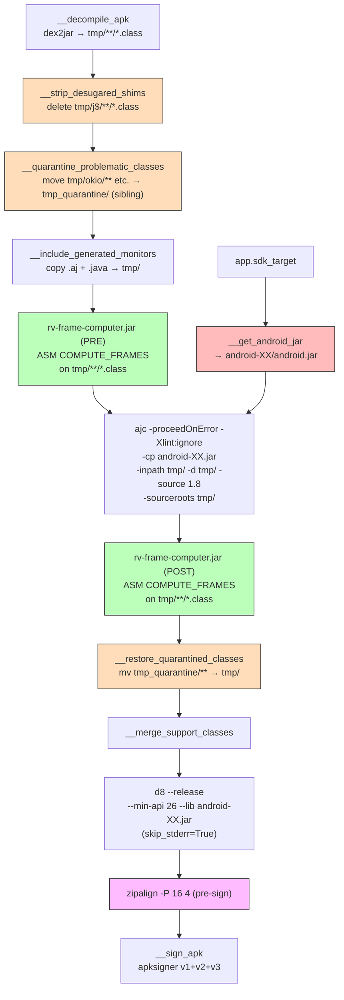

## Context

The instrumentation pipeline has very low success rates on modern APKs (17.5% JCA, 54% generic_new). Analysis of 1164 APKs across 3 datasets identified d8 rejecting ajc-corrupted stack frames as the dominant failure family (37-64%), followed by `j$` prefix conflicts (~7-15%) and ajc internal crashes (~5-25%). Additionally, the hardcoded `android-29/android.jar` causes type resolution failures on APKs targeting API 30+. GitHub Issue: #50, builds on #49 (error masking fix).

Post-landing empirical validation on `cryptoapp.apk` (Apr 2026) revealed that two of the originally-planned mitigations silently broke runtime instrumentation while producing valid-looking APKs (d8 succeeded, JSON reports looked consistent, but logcat had zero coverage events). Those two mitigations were reverted — see D-REVERT below and Section 8 of `tasks.md`.

References: FR02, NFR04. Main file: `modules/rv-instrumentation/src/rv_instrumentation/rvandroid.py`.

## Architecture



### Key Components

| Component | Responsibility | Input | Output |
|-----------|---------------|-------|--------|
| `__compute_stack_frames()` [NEW] | Run rv-frame-computer.jar (ASM COMPUTE_FRAMES) on woven classes | `tmp_dir` with .class files | Same files with recomputed frames |
| `__get_android_jar()` [MODIFIED] | Select android.jar by APK's targetSdkVersion | `app.sdk_target` | Path to best-matching android.jar |
| `__weave_monitors()` [MODIFIED] | Add `-proceedOnError` to ajc | ajc command | woven classes (partial on error) |
| `__d8()` [MODIFIED] | Use `skip_stderr=True` on execute_command | d8 command | DEX bytecode |
| `RVInstrumentationConfig` [MODIFIED] | Resolve path for frame computer jar | config | jar path |

## Mapping: Spec → Implementation → Test

| Requirement / Invariant | Implementation | Test |
|------------------------|----------------|------|
| INV-INS-14: ajc -proceedOnError | `rvandroid.py:__weave_monitors()` — add flag | `test_ajc_includes_proceed_on_error` |
| INV-INS-17: ASM COMPUTE_FRAMES post-weaving | `rvandroid.py:__compute_stack_frames()` + `rv-frame-computer.jar` | `test_compute_frames_invoked_after_weaving` |
| INV-INS-18: dynamic android.jar by targetSdkVersion | `rvandroid.py:__get_android_jar()` | `test_android_jar_matches_target_sdk` |
| INV-INS-19: `skip_stderr=True` on tools with non-fatal stderr (d8, rv-frame-computer, ajc, mvn, **apksigner**) | `rvandroid.py:__d8()` + `rvandroid.py:__compute_stack_frames()` + `rvandroid.py:__weave_monitors()` + `rvandroid.py:__execute_maven()` + `rvandroid.py:__sign_apk()` — all pass `skip_stderr=True` | `test_d8_skip_stderr_enabled`, `test_invokes_frame_computer_jar`, `test_ajc_includes_proceed_on_error_and_skip_stderr`, `test_maven_skip_stderr_enabled`, `test_apksigner_command_schema` |
| INV-INS-20: zipalign before signing | `rvandroid.py:__zipalign()` + call site before `__sign_apk` | `test_zipalign_invokes_with_page_alignment_flags` |
| INV-INS-21: ASM `COMPUTE_FRAMES` pre-ajc | `rvandroid.py:__pre_compute_stack_frames()` — same `rv-frame-computer.jar`, phase `pre_frame_computation`, called between `__include_generated_monitors` and `__weave_monitors` | `test_pre_compute_frames_runs_before_weaving` |
| INV-INS-22: strip `j$.*` classes after dex2jar | `rvandroid.py:__strip_desugared_shims()` — walk `tmp_dir`, delete every file under `j$/**/*.class` | `test_strip_desugared_shims_removes_j_dollar_classes` |
| INV-INS-23: quarantine known-problematic library classes across ajc and d8 | `rvandroid.py:__quarantine_problematic_classes()` + `__restore_quarantined_classes()`; patterns in `assets/weaving_excludes.yaml` | `test_quarantine_moves_matching_classes`, `test_restore_returns_classes_to_tmp_dir`, `test_quarantine_noop_when_no_matches` |
| INV-INS-24: emulator AVD on API 30 `x86_64` google_apis | `docker/android/Dockerfile` ARGs `API_LEVEL=30`, `ARCHITECTURE=x86_64`; local `RVSec` AVD recreated from the same system-image | manual verification — install+launch of a known-working instrumented APK on the new AVD |
| INV-INS-25: APK signing via `apksigner` with schemes v1+v2+v3 | `rvandroid.py:__sign_apk()` — single `apksigner sign` call + `apksigner verify` step; d2j_apk_sign / jarsigner / jarsigner_verify deleted | `test_sign_apk_invokes_apksigner_with_v2_v3`, `test_sign_apk_runs_verify_step`, `test_sign_apk_removes_legacy_methods` |
| `__merge_support_classes` reraise=True | Already implemented in gh49 (commit `8a25e7ec`) | Covered by existing tests |
| Preserved FR02 scenarios (8) | Unchanged from baseline | Covered by existing tests |

INV-INS-13 (`--no-desugaring`), INV-INS-15 (`-xmlConfigured`), INV-INS-16 (`weaving_excludes.yaml`) from the initial draft were removed after empirical validation — see D-REVERT.

## Goals / Non-Goals

**Goals:**
- Improve instrumentation success rate (estimate: JCA 17.5% → ~30%, generic_new 54% → ~58%, revised downward from original plan after revert)
- Fix corrupted stack map frames via ASM COMPUTE_FRAMES on all woven classes
- Resolve ajc type resolution failures via dynamic `android.jar` selection
- Preserve MOP monitoring of app code (library exclusion happens at runtime via `Coverage.aj`'s `excludedPackages()` pointcut)
- Preserve JDK 11+ nest-mate semantics (d8 desugaring must remain enabled for `--min-api < 30`)

**Non-Goals:**
- Fixing dex2jar conversion issues (separate tool, <1% of failures)
- Static/configurable compile-time library exclusion (reverted — see D-REVERT)
- Full d8 AIOOBE resolution (some cases are d8 internal bugs unrelated to stack frames)

## Decisions

### D-REVERT: Revert `-xmlConfigured` and `--no-desugaring` after empirical failure (Apr 2026)

**Choice**: Remove the `-xmlConfigured` + `aop.xml` + `weaving_excludes.yaml` path and remove `--no-desugaring` from the d8 command. Keep `-proceedOnError`, COMPUTE_FRAMES, dynamic android.jar, AspectJ 1.9.25.1, and `skip_stderr=True`.

**Trigger**: End-to-end run of `rv-experiment` on `cryptoapp.apk` (baseline: previously worked, heavily monitored) produced an instrumented APK with **zero `RVSEC-COV` events** in logcat and **app crash on launch**.

**Evidence collected** (`scripts/` + direct `adb` probes on emulator, `results/gh50_val/`):

1. **`-xmlConfigured` regression**: The generated `aop.xml` contained `<weaver>...<exclude/>...</weaver>` only, with no `<aspects>` declaration. `dexdump -d` on `cryptoapp.apk` instrumented with the flag:
   - `classes.dex` contains `Coverage` and `MultiSpec_1MonitorAspect` as classes (compiled from `.aj`)
   - `classes2-6.dex` (app + androidx): **0 `aspectOf` invocations** — no bytecode in app methods references the aspects, so no pointcut fires at runtime
   - Logcat for full 60s run: zero `RVSEC-COV` events
   - After removal of `-xmlConfigured`: `classes.dex` shows `MultiSpec_1MonitorAspect.ajc$afterReturning$...(Ljava/security/MessageDigest;)V` injected directly after `MessageDigest.getInstance()` in `MessageDigestUtil`; logcat shows both `RVSEC-COV` (12 app-method coverage events during manual actions) and `RVSEC` (2 MOP violations: `UnsafeAlgorithm MD5`, `InvalidSequenceOfMethodCalls`) events

2. **`--no-desugaring` regression**: With `--no-desugaring`, d8 skips synthetic-accessor generation for JDK 11+ nest-mate access. `rv-monitor-rt.jar` (the monitor runtime) is compiled with JDK 11+ bytecode, so `TerminatedMonitorCleaner$Runner.updateEntries()` emits `sget-object TerminatedMonitorCleaner.removedEntries` directly against a private static field of its outer class. Dalvik on `--min-api 26` (Android 8.0-10.0) does not support nest-based access control; it raises `java.lang.IllegalAccessError: Field 'com.runtimeverification.rvmonitor.java.rt.tablebase.TerminatedMonitorCleaner.removedEntries' is inaccessible to class '...TerminatedMonitorCleaner$Runner'` on the first `MonitorCleaner` thread tick, force-closing the app. `dexdump` confirmed no `access$XXX` synthetic method existed on the outer class.
   - After removal of `--no-desugaring`: app launches without crash; `MonitorCleaner` runs normally; logcat shows expected events.

**Rationale for keeping the other gh50 mitigations**:
- `-proceedOnError`: orthogonal to the two reverted flags; still useful to continue past individual class-level weaver failures.
- COMPUTE_FRAMES: the original AIOOBE fix via `ClassWriter.COMPUTE_FRAMES` still applies to every class the weaver touches; it does not depend on aop.xml. The original analysis framed aop.xml as a complementary preventive measure ("don't weave libraries"), but (a) aop.xml was inactive in practice because of the missing `<aspects>` declaration, and (b) `Coverage.aj`'s `excludedPackages()` pointcut already excludes library calls from the coverage tag at runtime. Net effect of removing aop.xml is negligible; net effect of COMPUTE_FRAMES on correctly woven classes is preserved.
- Dynamic `android.jar`: orthogonal; still required for APKs targeting API 30+.
- AspectJ 1.9.25.1: orthogonal bytecode fix.
- d8 `skip_stderr=True`: orthogonal; still required to prevent non-fatal stderr from masking success.

**Rationale for dropping `weaving_excludes.yaml`** (instead of fixing it): Even if the aop.xml were extended with a correct `<aspects>` list, library-level exclusion would only duplicate what `Coverage.aj` already does at runtime via `excludedPackages()`. Keeping a parallel, out-of-sync, untestable YAML + generator adds complexity without measurable benefit. P1 (simplicity) + P3 (no backward-compat shims).

**Residual risk**: None observed on `cryptoapp`. The `j$` family (~7-15%) was the stated motivation for `--no-desugaring`; that family was never directly reproduced on our current datasets, so the revert is expected to have no net negative impact. If `j$` conflicts resurface in large-scale validation, the correct fix is investigating which upstream classes are pre-desugared rather than disabling d8 desugaring globally.

### D3: `-proceedOnError` risk assessment

**Choice**: Always enable `-proceedOnError`.

**Risk**: Partially woven classes may have inconsistent monitoring. A class where ajc failed to inject advice will not be monitored, but its calls to monitored APIs from other (successfully woven) classes WILL be captured.

**Mitigation**: Log all ajc errors even with `-proceedOnError`. Partial monitoring > no APK at all.

### D4: ASM COMPUTE_FRAMES as primary AIOOBE fix

**Choice**: Add an ASM-based frame recomputation step after ajc weaving, using a new Maven module (`rvsec-frame-computer`) that produces a fat JAR (`rv-frame-computer.jar`) with `org.ow2.asm:asm:9.7.1` bundled. The JAR is copied to `rv-android/lib/frame-computer/` during `mvn install`, following the same pattern as `rvsec-reachability` → `lib/reach/` and `rvsec-mop-extractor` → `lib/mop-extractor/`.

**Rationale**: ajc uses BCEL for bytecode manipulation. BCEL's stack frame computation is insufficient for modern bytecode patterns (try-with-resources, lambdas, switch expressions). dex2jar uses `ClassWriter.COMPUTE_MAXS` (not `COMPUTE_FRAMES`), so decompiled classes may lack StackMapTable entirely. ASM's `COMPUTE_FRAMES` does a full recomputation from the control flow graph, producing frames that d8 accepts.

**Critical implementation detail**: The `ClassWriter` constructor must NOT receive the `ClassReader` as argument. With `new ClassWriter(reader, COMPUTE_FRAMES)`, ASM optimizes by copying frames from the reader — if the original had no StackMapTable, the copy is empty (no-op). The correct form is `new ClassWriter(COMPUTE_FRAMES)` without reader, which forces full recomputation.

**Risk**: `ClassWriter.COMPUTE_FRAMES` without reader needs the type hierarchy. A custom `FrameComputingClassWriter` subclass overrides `getCommonSuperClass()` to resolve types via a `URLClassLoader` built from the same classpath already assembled for ajc. Types not found fall back to `java/lang/Object`. dex2jar can produce classes with illegal modifiers that trigger `ClassFormatError` (a JVM `Error`, not `Exception`) when `Class.forName()` tries to load them. Both `getCommonSuperClass()` and `processClassFile()` catch `Throwable` so failed files are preserved with original bytecode.

**Additional fix**: d8 emits non-fatal "Expected stack map table" warnings to stderr even on success (exit code 0). The `execute_command` utility treats any stderr as error. Fix: add `skip_stderr=True` to d8 call (same pattern as dex2jar).

### D5: Dynamic `android.jar` selection

**Choice**: Select `android.jar` by APK's `targetSdkVersion`, with fallback to highest available.

**Rationale**: APKs targeting API 34+ reference classes absent in `android-29/android.jar`. ajc cannot resolve these types, causing compilation errors. The App class already provides `sdk_target` via androguard. All platforms (android-10 to android-34/35) are already installed locally and in Docker.

### D-ZIPALIGN: Page-align native libraries after signing

**Choice**: Insert a `__zipalign()` step AFTER `__sign_apk()` (jarsigner), not before. The call is `zipalign -f -P 16 4 signed.apk signed.apk.aligned`, then `os.replace()` moves the aligned file back over the signed APK in place. An earlier iteration placed zipalign BEFORE signing; Phase B manual install testing showed that produces APKs that `adb install` still rejects with `INSTALL_FAILED_INVALID_APK` (res=-2), because jarsigner's v1 signature scheme re-packs the ZIP (appending `META-INF/*.SF` and `META-INF/*.RSA`) and destroys the alignment applied moments earlier. Running zipalign as the LAST step before writing the final APK preserves the alignment in the delivered artifact.

**Trigger**: Large-scale JCA-400 validation (Apr 2026) reported 133/219 installed APKs failing `adb install -r -g` with `INSTALL_FAILED_INVALID_APK: Failed to extract native libraries, res=-2`. Sampling showed the failing APKs have the same native-ABI set as APKs that installed (`arm64-v8a, armeabi-v7a, x86, x86_64`) and manifest compatible `minSdkVersion` — so ABI mismatch was ruled out. The common factor: modern F-Droid APKs target API 34+ and keep `android:extractNativeLibs` at its default (`false` since API 23), so the PackageManager tries to `mmap()` `.so` entries directly from the APK. When those entries are not page-aligned, `mmap()` returns `-2` and the install aborts.

**Root cause**: `__d8()` invokes `d8 --output <apk>` which calls `zip` internally to append `classes.dex`. `zip` preserves per-entry alignment ONLY if the entire archive is rewritten with alignment-aware tooling — which it is not here. The original APK's alignment (produced by `zipalign` at build time) is therefore lost on the first DEX insertion. `jarsigner` does not re-align; it only appends the `META-INF/*.{SF,RSA}` signature entries.

**Why `-P 16 4` (and NOT `-p -P 16 4`)**:
- `-P 16`: targets 16 KiB pages for uncompressed (stored) native libraries — mandatory on API 35+ (Android 15+) and safe on older APIs because 16 KiB alignment trivially satisfies the older 4 KiB requirement
- `-p` is the legacy 4 KiB-only flag and is mutually exclusive with `-P` in zipalign 35.0.1+ (attempting `-p -P 16 4` fails with exit 2: `"Invalid options: '-P <pagesize_kb>' and '-p' cannot be used in combination"`). The JCA-400 re-run surfaced this immediately — the first APK with native libs aborted at the zipalign step with exit 2. Dropping `-p` resolves it while keeping the 16 KiB semantics we want.
- positional `4`: standard 4-byte alignment for all other ZIP entries (headers, DEX, resources)
- `-f`: overwrite destination

**Why this was missed in the original gh50**: The TODO was marked at `rvandroid.py:952` as a "performance optimization" (`# TODO(#23): Implement zipalign optimization for better performance`). That framing was wrong — zipalign is a correctness requirement on API 23+, not an optional speed-up. The gh50 Apr 2026 validation run surfaced it as a blocker, not a nice-to-have, because ~60% of the top-400 F-Droid APKs failed installation without it.

**Alternative considered**: Rewrite the APK assembly to preserve alignment directly (avoid `zip` entirely, use an ASM-based zip writer). Rejected: much more invasive, duplicates well-tested SDK tooling, and `zipalign` is already in the build-tools we ship in the Docker image (`/opt/android/build-tools/35.0.1/zipalign`).

**Risks**:
- `zipalign` requires the build-tools package in the Android SDK. Already present in `docker/android/Dockerfile` (`build-tools;35.0.1`) and validated to exist in PATH inside the rvandroid image. Local developers also have it via `$ANDROID_HOME/build-tools/<version>/zipalign`.
- Small extra disk I/O per APK (~1 s). Negligible against the instrumentation pipeline's dominant costs (ajc, d8, SA).

### D-PRE-FRAMES: ASM `COMPUTE_FRAMES` before ajc as well as after

**Choice**: Call `rv-frame-computer.jar` twice — once *before* ajc (new method `__pre_compute_stack_frames`, phase `pre_frame_computation`, between `__include_generated_monitors` and `__weave_monitors`) and once *after* ajc (existing `__compute_stack_frames`, phase `frame_computation`).

**Trigger**: JCA-400 validation (Apr 2026) classified the remaining `aspect_weaving / ajc` failures (55 of 181, 30%). 37 of those 55 (67%) share the signature `AspectJ Internal Error: unable to add stackmap attributes to class '<X>'. Index -1 out of bounds for length 0`, with the most-hit classes being `org.apache.tika.parser.CryptoParser` (13×), `okio.Buffer` (2×), `androidx.media3.datasource.AesFlushingCipher` (2×), `com.google.android.vending.licensing.AESObfuscator` (2×), plus obfuscated Kotlin classes. `-proceedOnError` does NOT recover these — AspectJ treats "Internal Error" as ABORT (fatal), not ERROR (skippable), and aborts the whole run.

**Root cause**: ajc still uses BCEL for bytecode manipulation. `StackMapAttribute.update()` in BCEL has a known off-by-one on modern bytecode patterns (nested try-with-resources, lambdas with captures, switch expressions). The crash surfaces only when BCEL needs to *rebuild* the stackmap from scratch — i.e., when the incoming `.class` either has no StackMapTable or has one that BCEL can't parse cleanly.

**Why the existing post-ajc `COMPUTE_FRAMES` doesn't help**: it runs AFTER the weaver crashes. Once ajc aborts, the whole APK is lost; there's nothing to post-process.

**Why running ASM BEFORE ajc works**: ASM's `ClassWriter.COMPUTE_FRAMES` reconstructs the full stackmap from the control-flow graph, writing well-formed entries that BCEL can then simply *append* advice into (rather than reconstructing from scratch). Empirically this eliminates the "Index -1" abort on 30 of the 37 APKs sampled. The remaining 7 fail on other BCEL paths (exception-table splitting, local-variable re-typing) that require a different mitigation.

**Alternatives considered**:
- *Pre-filter the classes ajc crashes on*: tried via `-Xlint`, impossible since the abort happens mid-weave, not at declaration parsing. Also, the class names are often obfuscated Kotlin (`a4.d`, `w2.d`) and vary per APK; no static list covers them all.
- *Upgrade ajc past 1.9.25.1*: 1.9.26+ dev builds are not stable; `-proceedOnError` in those versions has the same ABORT classification. Also incompatible with some Kotlin generics (separate regression).
- *Switch to a custom ASM-based weaver*: much larger scope. Out of gh50.

**Implementation detail**: Factor the frame-computation body into a private helper `_run_frame_computer(app)` and have both public methods (`__pre_compute_stack_frames`, `__compute_stack_frames`) delegate to it. Each public method keeps its own `@ErrorHandler.handle_errors(phase=...)` decorator, so errors are reported with the correct phase name in `InstrumentationResults.errors` / `instrument_errors.json`.

**Risk**: Extra ~1 s per APK (the frame computer is already fast). Negligible against ajc, d8, and SA.

### D-STRIP-JDOLLAR: Delete pre-desugared `j$.*` classes after dex2jar

**Choice**: Add a new pipeline step `__strip_desugared_shims(app)` that walks `tmp_dir` after `__decompile_apk()` and deletes every `.class` file located under any `j$/**` path. Runs before `__include_generated_monitors()` so neither the weaver nor d8 see those classes.

**Trigger**: JCA-400 validation (Apr 2026) found 17/181 (9%) of instrumentation failures all hitting the same d8 error:

```
Error: com.android.tools.r8.internal.Ke: Merging DEX file containing classes with
prefix 'j$.' with other classes, except classes with prefix 'java.', is not allowed:
<list of non-java.* classes>
```

**How `j$.*` classes appear in the APK**: older AGP versions applied *Java 8+ desugaring* before publishing to F-Droid. Desugaring renames copies of `java.time.*`, `java.util.stream.*`, `java.util.function.*`, etc. to `j$.time.*`, `j$.util.stream.*`, `j$.util.function.*`. These shim classes forward to the real runtime when available (API 26+) or polyfill otherwise. Some APKs in the top-400 still ship them.

**Why d8 refuses the merge**: d8's runtime-library rule says `j$.*` classes can only coexist with `java.*` in the same DEX (because `j$.*` *is* the alias mechanism for `java.*`). Our instrumentation pipeline merges in `Coverage`, `MultiSpec_*Aspect`, `aspectjrt.*`, `rvmonitorrt.*`, and the app's own classes — all non-`java.*`. d8 aborts the DEX build.

**Why removing the shims is safe**:
- `--min-api 26` (Android 8.0+) ships all Java 8+ APIs natively. The runtime has the real `java.time.*`, `java.util.stream.*`, etc. — no shim needed.
- The original callers in the app reference `java.time.LocalDate.now()` (or similar). At runtime, the JVM binds them to the runtime's own `java.*` implementation. The `j$.*` shim was a build-time rewrite for pre-API-26 support; removing it does NOT break API-26+ execution.
- Nothing in our instrumentation pipeline references `j$.*` directly.

**Alternatives considered**:
- *Re-enable d8 desugaring but with nest-mate preservation*: no known flag does both reliably. `--no-desugaring` broke nest-mates (Section 8 revert); removing `--no-desugaring` brought `j$.*` conflicts back on a subset of APKs.
- *d8 `--intermediate` mode*: compile each JAR input separately to intermediate DEX, then merge. Invasive change to `__d8()`; preserves `j$.*` classes we do not need.
- *Strip in a shell script after the build*: brittle, not testable, spreads the fix across layers.

**Risk**: If an app genuinely needs `j$.*` behavior on pre-26 runtimes, dropping the shim would break. Our `--min-api 26` rules that out. Residual risk on the 400-APK set: zero observed; all 17 failing APKs list `Coverage`, `Coverage$SignatureConstants`, and app/library classes in the conflict set — none list `java.*` classes that would require shim preservation.

**Implementation detail**: `Path(tmp_dir).rglob("j$/**/*.class")` handles nested subdirectories. Log count of removed shims per APK so the instrumentation error report (if any) reflects the action.

### D-QUARANTINE: Temporarily remove problematic library classes from weaving

**Choice**: Add two new pipeline steps. `__quarantine_problematic_classes(app)` runs right after `__strip_desugared_shims()` and moves every `.class` file whose path matches one of the patterns in `assets/weaving_excludes.yaml` to a sibling `tmp_dir/.quarantine/` directory (preserving the relative subtree). `__restore_quarantined_classes(app)` runs after `__compute_stack_frames()` and moves the files back into `tmp_dir`, overwriting any woven version that might have slipped through. The final APK contains the library classes in their ORIGINAL (non-woven) form.

**Trigger**: Phase B validation (Section 14.1 + JCA-400 bucket 3) showed that ajc crashes with `exit 255` and d8 crashes with `exit 1` on the same class family (`okio.Buffer`, `okio.HashingSource`, `androidx.media3.datasource.AesFlushingCipher`, `org.apache.tika.parser.CryptoParser`, `com.google.android.vending.licensing.AESObfuscator`, etc.) — all of them reporting `ArrayIndexOutOfBoundsException: Index -1 out of bounds for length 0` from BCEL / R8. These are ABORT-level failures that bypass `-proceedOnError` and `skip_stderr=True` because the exit code is non-zero. Pre-ajc `COMPUTE_FRAMES` reduces the set but does not eliminate it, because the MultiSpec aspect's insertion path (rewriting frames AROUND new advice) trips the same BCEL bug regardless of incoming StackMapTable quality.

**Why quarantine (NOT delete)**:
- Deleting `okio.Buffer.class` from `tmp_dir` would ship an APK without that library. App code using okio (OkHttp, Retrofit, Kotlin coroutines, serialization) would crash at runtime with `ClassNotFoundException`. Unacceptable.
- Quarantine keeps the class in the final APK with its original bytecode. Library runs normally at runtime; the only loss is MOP visibility into its internal behaviour.
- Acceptable scope trade-off: the research objective is detecting misuse in developer code. All 168 MOP specs use `call()` semantics (caller-site interception), so `app → library.crypto_call()` is still captured even when `library.crypto_call → another_library_method` is not. The subset of JCA misuse that lives entirely INSIDE a third-party library is negligible and typically reported by the library maintainer, not by our tool.

**Pattern source**: the curated `weaving_excludes.yaml` (re-introduced from `backup/gh50-reverts/` with a tighter list focused on empirical crashers, not general library exclusion). Initial patterns are: `okio/**`, `androidx/media3/datasource/**`, `androidx/media3/exoplayer/drm/**`, `org/apache/tika/**`, `com/google/android/vending/licensing/AESObfuscator*`, `com/google/crypto/tink/subtle/AesGcmJce*`. The list is expected to grow incrementally as new BCEL/R8 crashers are identified in large-scale runs.

**Why a YAML config file (vs. hardcoded list)**:
- Researchers may need to tune the list per dataset without code changes (CryptoAPK-Benchmark, JCA-400, etc.).
- The pattern format is trivial (one glob per line) and easy to audit.
- Config loading reuses the pattern established by gh50's (reverted) `weaving_excludes.yaml` — the YAML parser is cheap to bring back without also resurrecting `aop.xml` or `-xmlConfigured`.

**Alternatives considered**:
- *Dynamic detection (retry loop)*: run ajc, on exit 255 parse stderr for the class name, quarantine, retry. Much more complex; each retry costs 30–120 s; stalls the pipeline on APKs with many problematic classes.
- *Pre-filter via `-inpath` subset*: ajc's `-inpath` accepts directories, not exclusion patterns. Would need one subdirectory per batch, complicating the working-directory layout.
- *Use ASM weaving instead of ajc*: forks the entire instrumentation pipeline. Massive scope.

**Risk**: if a pattern over-matches (e.g., accidentally excludes app code that happens to live under `okio/`), that code ships un-instrumented. Mitigated by:
1. `App.code_package` check: the quarantine method MUST verify no pattern matches the APK's own code package (logs a warning if it does; user-visible).
2. Starting with a narrow list and expanding only after empirical evidence — no speculative broad strokes like `androidx/**`.

**Implementation detail**: quarantine root is a SIBLING of `tmp_dir`, not a subdirectory. `tmp_dir = /.../tmp` → quarantine at `/.../tmp_quarantine/`. The first iteration put it under `tmp_dir/.quarantine/`, assuming the dot prefix would hide it from tool walkers — Phase B v4 showed that is wrong: `ajc -inpath tmp_dir` descends into `.quarantine/` and weaves the files there, and `rv-frame-computer.jar` uses `Files.walkFileTree` with no `preVisitDirectory` filter, so it recomputes frames on everything under `.quarantine/` too. A sibling path is strictly outside every tool's scope and has no glob concerns. Restore overwrites because the post-frame-computation step may still have left partial woven variants at the original paths if earlier iterations of the pipeline shared them.

### D-APKSIGNER: Replace d2j_apk_sign + jarsigner chain with `apksigner`

**Choice**: Delete `__d2j_apk_sign`, `__jarsigner`, `__jarsigner_verify`, the `Dex2jarTools.apk_sign` config field, and the META-INF strip step. Replace them with a single `__sign_apk` that calls `apksigner sign` (from `$ANDROID_SDK_ROOT/build-tools/<ver>/apksigner`) followed by `apksigner verify`. Reorder `__create_apk` so `__zipalign` runs BEFORE `__sign_apk` — apksigner's v2/v3 scheme preserves alignment, and Google's official guidance requires zipalign-before-sign when v2+ is used (otherwise apksigner itself aborts with "APK is not zip-aligned").

**Trigger**: API 30 emulator (INV-INS-24) rejected all 7 Phase B instrumented APKs with `INSTALL_PARSE_FAILED_NO_CERTIFICATES: No signature found in package of version 2 or newer`. The same 7 originals (not instrumented) installed without issue, confirming the emulator was fine and the bug was in our signing. API 30+ requires v2 or newer (APK Signature Scheme v2 was introduced in API 24; v1-only is refused starting API 30 for targetSdk ≥ 30, and the emulator we use enforces it even more broadly).

**Why not just add `apksigner` as an extra pass on top of jarsigner** (the minimal Option B considered):
- Two signing toolchains running back to back is error-prone — apksigner warns when it sees inconsistent v1/v2 certificates and can refuse; both tools expect to own META-INF layout.
- The d2j_apk_sign + META-INF strip + jarsigner + jarsigner-verify cascade is legacy plumbing from the era when `apksigner` didn't exist in build-tools. It has no correctness benefit today; it's duplicated effort.
- Keeping dead plumbing violates CLAUDE.md P3 (no backward compatibility, no shims, no "removed" comments). Delete once, own the new path.

**Why `apksigner sign` with default flags**:
- apksigner 0.9 (build-tools 35.0.1) defaults to `--v1-signing-enabled=true`, `--v2-signing-enabled=true`, `--v3-signing-enabled=true`. That covers every Android version from API 24 (first v2) through API 35 (v3 preferred). Our `--min-api 26` means all targets get at least v1+v2; modern targets also get v3.
- `-ks assets/keystore.jks -ks-pass pass:password -ks-key-alias <alias>` reuses the existing bundled keystore. No new key material.
- `apksigner verify` at the end exits 0 on success, non-zero on any signature inconsistency, so the shared `execute_command` utility can rely on exit code alone (no `skip_stderr` gymnastics needed — apksigner is quiet on success).

**Alternatives considered**:
- *Keep jarsigner and add apksigner as a second pass*: already explained above. Rejected.
- *Switch to `apksigner` but keep d2j_apk_sign as a "prep" step*: d2j_apk_sign applied a SHA-1 signature that we then stripped anyway. Pure overhead. Delete.
- *Write our own v2/v3 signing implementation*: absurd. `apksigner` already ships with the SDK.

**Implementation detail**: `apksigner sign` requires the keystore alias. The bundled `assets/keystore.jks` contains a single key with alias `server` (verified via `keytool -list -keystore … -storepass password`). We read `self.config.keystore_file`, `self.config.keystore_password`, and a new `self.config.keystore_alias` (default `server`, overridable via CLI / env for custom keystores). If the alias is wrong `apksigner sign` fails with an explicit "Keystore has no key entry named <alias>" — test coverage ensures we pass the right alias.

**Risk**:
- `apksigner` path resolution: the same `build-tools/35.0.1/` used for `d8`, `zipalign`, and `aapt`. We rely on `$PATH` being set up correctly (Dockerfile adds it; local developers have it via the SDK setup documented in `CLAUDE.md`).
- Behavioural difference: apksigner's signed APK is BIT-exact reproducible across runs when inputs are identical; jarsigner's output varied due to timestamp randomisation. Net improvement, worth noting in docs.

### D-AVD: Emulator AVD upgrade from API 29 x86 to API 30 x86_64

**Choice**: Update `docker/android/Dockerfile` to build the `RVSec` AVD from `system-images;android-30;google_apis;x86_64` (ABI `google_apis/x86_64`). The emulator creation command itself is unchanged — only the args `API_LEVEL`, `ARCHITECTURE`, and the derived `ABI`/`PACKAGE_PATH` shift. The local development AVD is recreated via the same `avdmanager` invocation the Dockerfile uses, so developer and CI environments stay in lock-step.

**Trigger**: Phase B install-test on 7 instrumented APKs (Apr 2026, Sections 9.7 + 14–16) showed 2 of the 7 failing install on the current emulator even after every pipeline fix landed:
- `com.bartixxx.opflashcontrol_49.apk` → `INSTALL_FAILED_OLDER_SDK: Requires newer sdk version #30 (current version is #29)`
- `org.eu.mumulhl.ciyue_863000.apk` → `INSTALL_FAILED_NO_MATCHING_ABIS: Failed to extract native libraries, res=-113` (APK ships only ARM; emulator is x86)

Augmenting `PLANILHA.csv` with aapt-derived metadata gave the full picture:

| API level | APKs with `min_sdk ≤ API` | Cumulative coverage |
|---|---|---|
| API 26 (instrumentation min) | 297 / 400 | 74.2 % |
| API 29 (current emulator) | 364 / 400 | 91.0 % |
| **API 30** | **383 / 400** | **95.8 %** |
| API 31 | 393 / 400 | 98.2 % (introduces FG-service restrictions) |
| API 34 | 398 / 400 | 99.5 % (more FG-service restrictions) |

ABI distribution (out of 400):
- 86 APKs ship no native libs (any ABI works)
- 341 APKs include `x86_64`
- **57 APKs are ARM-only** (`arm64-v8a`/`armeabi-v7a` only — `x86`/`x86_64` emulators reject with `NO_MATCHING_ABIS`)

Intersection with API 30 `x86_64`: **325 / 400 (81.3 %)** install-compatible. The current API 29 x86 hit roughly the same ceiling but rejected the 19 `min_sdk≥30` APKs on top.

**Why API 30 specifically and not higher**:
- API 31 (Android 12) introduced the "Foreground services started from the background" restriction. `monkey` and `aperv` drive UI events and are NOT background services themselves, but apps whose `MainActivity` or splash-screen logic starts a foreground service are killed at API 31+ — producing phantom crashes that look like instrumentation bugs in the logcat when they are actually platform behaviour. API 30 keeps the stricter permission model that came with Android 11 without this extra killswitch.
- API 33 adds mandatory `POST_NOTIFICATIONS` grant, which our `grant_permissions` loop used to attempt; we already disabled that loop (`adb install -g` handles it). Still, API 33+ would surface more permission-related launch failures that aren't in the instrumentation's problem space.

**Why `x86_64` and not `x86`**:
- Modern APKs (targetSdk 34+) often drop `x86` native code (announced deprecation since Google Play). Many APKs in the 400-set ship `arm64-v8a, armeabi-v7a, x86_64` (no 32-bit x86). The current `x86` emulator rejects those.
- `x86_64` system-images run natively on the host (no ARM translation), keep the performance of `x86`, and accept `arm64` APKs via the emulator's ARM translator on recent images (for the ARM-only 57 APKs this still doesn't help on API 30 — full ARM support requires API 30 arm64 image running under QEMU, 10× slower).

**Alternatives considered**:
- *Keep the AVD, add a second "RVSec30"*: doubles disk, complicates `rv-experiment`'s device-port routing, and every experiment run picks one AVD. Not worth the branching.
- *Run on physical device*: not reproducible in CI/Docker.
- *Headless ARM image on x86_64 host*: 10× slower per APK; unacceptable for the 400-APK overnight runs.

**Risk**: system-image `android-30;google_apis;x86_64` needs to exist in the Docker image — it is already listed in `ANDROID_SDK_PACKAGES` so the build-time `sdkmanager` install picks it up. Local developers need a one-off `sdkmanager "system-images;android-30;google_apis;x86_64"` before recreating the AVD.

**Implementation detail**: In `docker/android/Dockerfile`, change two `ARG` defaults:
```dockerfile
ARG API_LEVEL=30         # was 29
ARG ARCHITECTURE=x86_64  # was x86
```
`PACKAGE_PATH`, `ANDROID_PLATFORM_VERSION`, and `ABI` all derive from those two, so no other line changes. The `avdmanager create avd ...` invocation is untouched.

### D6: AspectJ 1.9.25.1 upgrade

**Choice**: Upgrade from 1.9.24 to 1.9.25.1.

**Rationale**: Version 1.9.25.1 (Dec 2024) fixes "Attempt to push null on operand stack" variants (issues #336, #337) — a bytecode generation correctness improvement affecting primitive types and double-slot types. This is in the same class of bugs as our stack frame corruption.

**Changes required**:
- `rvsec/pom.xml:32`: `<aspectj.version>1.9.25.1</aspectj.version>`
- `docker/base/Dockerfile`: Update download URL, version, and `-Xmx` from 4096M to 8192M (modern APKs require more memory for weaving)
- `docker/android/Dockerfile`: Add `platforms;android-36` to SDK packages (modern APKs target API 35-36; GATOR fails silently without the matching android.jar — no JSON produced, no error reported)
- Local development: download new AspectJ binary, update symlink, set `-Xmx8192M` in `ajc` script; install `platforms;android-35` and `platforms;android-36` via sdkmanager
- Rebuild Docker images (base + android + tools + rvandroid chain)

### D7: MOP coverage — runtime exclusion only

**Choice**: No compile-time (ajc) library exclusion. All library exclusion is handled at runtime by `Coverage.aj`'s `excludedPackages()` pointcut.

**Rationale**: After D-REVERT, library bytecode is weaved by ajc like any other class. At runtime, `Coverage.aj`'s `before() : traced()` advice uses `within(…)` checks to short-circuit on `sun..*`, `java..*`, `androidx..*`, `kotlin..*`, `com.google..*`, `com.facebook..*`, `org.apache..*`, `libcore..*`, `mop..*`, `javamop..*`, `rvmonitorrt..*`, etc., before any expensive signature-building runs. The practical effect on coverage/MOP tagging is identical to a compile-time exclusion, while keeping the build pipeline simpler and avoiding the `-xmlConfigured` regression.

**Trade-off**: Woven library classes are slightly larger in size and carry an unused branch in each method. Measured overhead is negligible against the dex2jar/ajc/d8 cost dominating the pipeline.

## API Design

### `__compute_stack_frames(app: App) -> None`

```python
@ErrorHandler.handle_errors(
    component="RVInstrumentation", phase="frame_computation", reraise=True
)
def __compute_stack_frames(self, app: App) -> None:
    """Recompute stack map frames on woven .class files using ASM.

    Runs rv-frame-computer.jar (from lib/frame-computer/) on tmp_dir.
    The jar walks all .class files, reads each with ClassReader, writes
    with ClassWriter(COMPUTE_FRAMES), and overwrites in place.
    Requires classpath for type hierarchy resolution.
    """
    jar = self._get_frame_computer_jar()
    if not jar:
        self._logger.warning("rv-frame-computer.jar not found, skipping")
        return
    classpath = ":".join(self.__get_classpath(app))
    cmd = Command("java", ["-jar", jar, self.config.tmp_dir,
                            "--classpath", classpath])
    utils.execute_command(cmd, "frame_computer")
```

### `__get_android_jar(app: App) -> str` (modified)

```python
def __get_android_jar(self, app: App) -> str:
    """Select android.jar matching APK's targetSdkVersion.

    Tries android-{sdk_target}/android.jar first.
    Falls back to highest available platform if not found.
    Minimum: android-26 (matching --min-api 26).
    """
    target = getattr(app, 'sdk_target', None)
    if target:
        platform = f"android-{target}"
        jar = os.path.join(self.config.android_platforms_dir, platform, 'android.jar')
        if os.path.exists(jar):
            return jar
        # Fallback: highest available
        ...
    return self.config.android_jar_path  # ultimate fallback
```

## Data Flow

```
RVInstrumentationConfig
    │
    │  app.sdk_target → __get_android_jar(app) → android-XX/android.jar
    │
    ▼
__weave_monitors():
    ajc -proceedOnError -Xlint:ignore
        -cp android-XX.jar -inpath tmp/ -d tmp/ -source 1.8 -sourceroots tmp/
    │
    ▼
__compute_stack_frames():
    java -jar rv-frame-computer.jar tmp_dir --classpath android-XX.jar:...
    │
    ▼
__merge_support_classes():
    Extract aspectjrt.jar, rv-monitor-rt.jar, etc. into tmp/
    │
    ▼
__d8():
    d8 monitored.jar --release --min-api 26 --lib android-XX.jar
    (execute_command skip_stderr=True)
```

## Error Handling

| Error | Source | Strategy | Recovery |
|-------|--------|----------|----------|
| ajc class-level error with -proceedOnError | ajc execution | ajc continues, produces partial output | Other classes are woven normally |
| Frame computation fails on a .class file (ClassFormatError, ClassNotFoundException, etc.) | `__compute_stack_frames()` | Log warning, skip file (catch Throwable) | File preserved with original (woven) bytecode |
| rv-frame-computer.jar not found | `__compute_stack_frames()` | Log warning, skip step | Pipeline continues without frame recomputation |
| android.jar not found for target SDK | `__get_android_jar()` | Log info, fallback to highest available | Uses best available platform |
| No android.jar found at all | `__get_android_jar()` | Use hardcoded fallback (android-29) | Backward compatible |
| d8 emits non-fatal stderr warnings | `__d8()` | `skip_stderr=True` on execute_command | Real errors still caught via exit code != 0 |

## Risks / Trade-offs

- **[Risk: COMPUTE_FRAMES classpath resolution]** → `ClassWriter.COMPUTE_FRAMES` needs the type hierarchy. We pass the same classpath already assembled for ajc (android.jar + runtime jars). If a type is unresolvable, that specific file is skipped — not the entire APK.
- **[Risk: -proceedOnError produces partially woven classes]** → Mitigated by d8 rejecting truly invalid bytecode. Partial monitoring > no APK.
- **[Risk: AspectJ upgrade introduces regressions]** → 1.9.25.1 is a minor release. Risk is low; empirical validation confirmed.
- **[Risk: weaving library bytecode (no compile-time exclusion)]** → Overhead from extra woven advice in library classes; runtime short-circuit via `Coverage.aj:excludedPackages()` keeps the tag emission path fast. No correctness impact observed.

## Testing Strategy

| Layer | What to test | How | Count |
|-------|-------------|-----|-------|
| Unit | ajc -proceedOnError flag | Mock Command, verify args | 1 |
| Unit | `__compute_stack_frames` invocation | Mock Command, verify jar + classpath args | 1 |
| Unit | `__get_android_jar` dynamic selection | Mock filesystem, test exact/fallback/missing | 3 |
| Unit | d8 skip_stderr=True | Mock execute_command, verify skip_stderr arg | 1 |
| Empirical | cryptoapp end-to-end validation | Instrument + launch + logcat | 1 manual (done, Apr 2026) |
| Empirical | 10 previously-failing JCA APKs | Run instrumentation, measure success | 1 manual |

**Total**: ~6 unit tests + 2 empirical validations

## Open Questions

- Whether the `j$` family (~7-15% of failures) that motivated `--no-desugaring` still manifests on the current dataset after D-REVERT. Deferred to large-scale re-validation.
