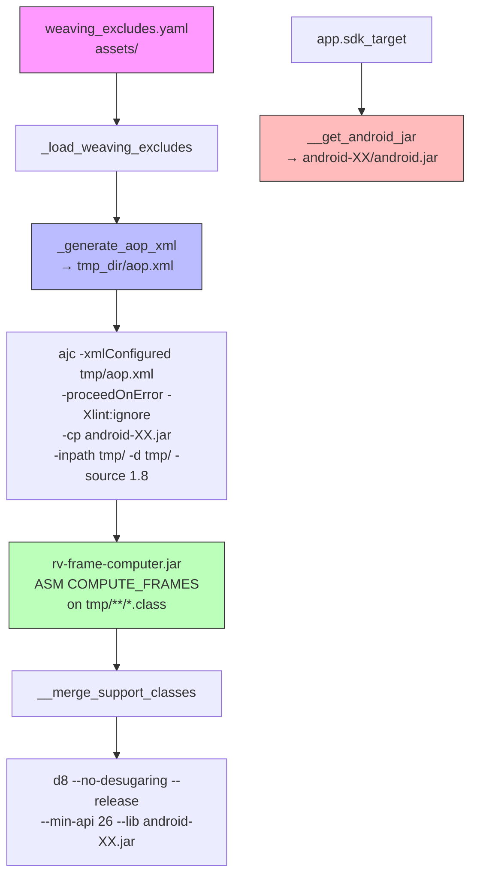

## Context

The instrumentation pipeline has very low success rates on modern APKs (17.5% JCA, 54% generic_new). Analysis of 1164 APKs across 3 datasets identified d8 rejecting ajc-corrupted stack frames as the dominant failure family (37-64%), followed by `j$` prefix conflicts (~7-15%) and ajc internal crashes (~5-25%). Additionally, the hardcoded `android-29/android.jar` causes type resolution failures on APKs targeting API 30+. GitHub Issue: #50, builds on #49 (error masking fix).

References: FR02, NFR04. Main file: `modules/rv-instrumentation/src/rv_instrumentation/rvandroid.py`.

## Architecture



### Key Components

| Component | Responsibility | Input | Output |
|-----------|---------------|-------|--------|
| `_load_weaving_excludes()` [NEW] | Load exclude patterns from YAML | `weaving_excludes.yaml` | List of pattern strings |
| `_generate_aop_xml()` [NEW] | Generate aop.xml from YAML patterns | List of patterns | `aop.xml` in `tmp_dir` |
| `__compute_stack_frames()` [NEW] | Run ASM COMPUTE_FRAMES on woven classes | `tmp_dir` with .class files | Same files with recomputed frames |
| `__get_android_jar()` [MODIFIED] | Select android.jar by APK's targetSdkVersion | `app.sdk_target` | Path to best-matching android.jar |
| `__weave_monitors()` [MODIFIED] | Add `-proceedOnError` and `-xmlConfigured` to ajc | ajc command | woven classes (partial on error) |
| `__d8()` [MODIFIED] | Add `--no-desugaring` to d8 | d8 command | DEX bytecode |
| `RVInstrumentationConfig` [MODIFIED] | Resolve paths for YAML and frame computer jar | config | excludes path, jar path |

## Mapping: Spec → Implementation → Test

| Requirement / Invariant | Implementation | Test |
|------------------------|----------------|------|
| INV-INS-13: d8 --no-desugaring | `rvandroid.py:__d8()` — add flag | `test_d8_includes_no_desugaring` |
| INV-INS-14: ajc -proceedOnError | `rvandroid.py:__weave_monitors()` — add flag | `test_ajc_includes_proceed_on_error` |
| INV-INS-15: -xmlConfigured path/aop.xml | `rvandroid.py:__weave_monitors()` + `_generate_aop_xml()` | `test_aop_xml_generated_from_yaml` |
| INV-INS-16: default exclude patterns (aligned with Coverage.aj) | `assets/weaving_excludes.yaml` | `test_default_excludes_loaded` |
| INV-INS-17: ASM COMPUTE_FRAMES post-weaving | `rvandroid.py:__compute_stack_frames()` + `rv-frame-computer.jar` | `test_compute_frames_invoked_after_weaving` |
| INV-INS-18: dynamic android.jar by targetSdkVersion | `rvandroid.py:__get_android_jar()` | `test_android_jar_matches_target_sdk` |
| Backward compat: no YAML = no flag | `__weave_monitors()` conditional | `test_no_yaml_no_xml_configured` |
| `__merge_support_classes` reraise=True | Already implemented in gh49 (commit `8a25e7ec`) | Covered by existing tests |
| Preserved FR02 scenarios (8) | Unchanged from baseline | Covered by existing tests |

## Goals / Non-Goals

**Goals:**
- Improve instrumentation success rate (estimate: JCA 17.5% → ~33%, generic_new 54% → ~59%)
- Fix corrupted stack map frames at two levels: prevent via aop.xml (library classes) + repair via COMPUTE_FRAMES (woven classes)
- Resolve ajc type resolution failures via dynamic `android.jar` selection
- Preserve MOP monitoring of app code (library-internal calls excluded — documented as scope decision)
- Maintain backward compatibility when `weaving_excludes.yaml` is absent
- Configurable exclude patterns (researchers can tune per experiment)

**Non-Goals:**
- Fixing dex2jar conversion issues (separate tool, <1% of failures)
- Dynamic per-APK exclude lists (static YAML is sufficient)
- Full d8 AIOOBE resolution (some cases are d8 internal bugs unrelated to stack frames)

## Decisions

### D1: `aop.xml` generation vs static file

**Choice**: Generate `aop.xml` at runtime from YAML patterns.

**Rationale**: YAML is more readable and maintainable than XML. Runtime generation allows researchers to modify patterns without understanding AspectJ XML syntax.

### D2: Where to place generated `aop.xml` and how to pass it

**Choice**: Write `aop.xml` directly in `tmp_dir`. Pass the file path explicitly to ajc: `ajc -xmlConfigured {tmp_dir}/aop.xml ...`.

**Rationale**: The `-xmlConfigured` flag in CTW mode requires the XML file path as an **explicit argument** on the command line — it does NOT auto-discover `META-INF/aop.xml` from the classpath (that is LTW-only behavior). Sources: [AspectJ ajc manual](https://eclipse.dev/aspectj/doc/latest/devguide/ajc.html).

### D3: `-proceedOnError` risk assessment

**Choice**: Always enable `-proceedOnError`.

**Risk**: Partially woven classes may have inconsistent monitoring. A class where ajc failed to inject advice will not be monitored, but its calls to monitored APIs from other (successfully woven) classes WILL be captured.

**Mitigation**: Log all ajc errors even with `-proceedOnError`. Partial monitoring > no APK at all.

### D4: ASM COMPUTE_FRAMES as complementary fix

**Choice**: Add an ASM-based frame recomputation step after ajc weaving, using a small Java utility (`rv-frame-computer.jar`).

**Alternative considered**: Rely solely on `aop.xml` exclusion.

**Rationale**: The two mechanisms are complementary, not competing:
- **aop.xml** prevents the weaver from touching library classes → their frames stay intact → eliminates one source of AIOOBE
- **COMPUTE_FRAMES** recomputes frames on classes the weaver DID modify (app code) → fixes frames the weaver corrupted → eliminates another source of AIOOBE

ajc uses BCEL for bytecode manipulation. BCEL's stack frame computation is known to be insufficient for modern bytecode patterns (try-with-resources, lambdas, switch expressions). ASM's `COMPUTE_FRAMES` does a full recomputation from the control flow graph, producing frames that d8 accepts.

**Risk**: `ClassWriter.COMPUTE_FRAMES` needs to resolve the type hierarchy to compute frames. It requires the correct classpath (android.jar + runtime jars). This is the same classpath already assembled for ajc — passed to the jar via argument.

### D5: Dynamic `android.jar` selection

**Choice**: Select `android.jar` by APK's `targetSdkVersion`, with fallback to highest available.

**Rationale**: APKs targeting API 34+ reference classes absent in `android-29/android.jar`. ajc cannot resolve these types, causing compilation errors. The App class already provides `sdk_target` via androguard. All platforms (android-10 to android-34/35) are already installed locally and in Docker.

### D6: AspectJ 1.9.25.1 upgrade

**Choice**: Upgrade from 1.9.24 to 1.9.25.1.

**Rationale**: Version 1.9.25.1 (Dec 2024) fixes "Attempt to push null on operand stack" variants (issues #336, #337) — a bytecode generation correctness improvement affecting primitive types and double-slot types. This is in the same class of bugs as our stack frame corruption.

**Changes required**:
- `rvsec/pom.xml:32`: `<aspectj.version>1.9.25.1</aspectj.version>`
- `docker/base/Dockerfile`: Update download URL and version
- Local development: download new AspectJ binary
- Rebuild Docker base image (+ all child images)

### D7: MOP coverage trade-off

**Choice**: Exclude library packages from weaving, accepting reduced MOP visibility in libraries.

**Rationale**: All 168 MOP specs use `call()` (caller-site interception). Excluding library packages means calls FROM excluded packages are not monitored. Calls from app code to monitored APIs remain 100% monitored. The impact varies by spec set:
- JCA (~5% loss): crypto APIs rarely called internally by non-crypto libs
- generic (~15-25% loss): APIs used by frameworks (ReentrantLock, Iterator)
- generic_new (~25-40% loss): ubiquitous APIs (InputStream, Closeable, Map)

This is defensible because: (1) `Coverage.aj` already excludes the same packages, (2) the research targets misuse in developer code, (3) `App.code_package` validates exclusions don't cover app code.

## API Design

### `__compute_stack_frames(app: App) -> None`

```python
@ErrorHandler.handle_errors(
    component="RVInstrumentation", phase="frame_computation", reraise=True
)
def __compute_stack_frames(self, app: App) -> None:
    """Recompute stack map frames on woven .class files using ASM.

    Runs rv-frame-computer.jar on tmp_dir. The jar walks all .class files,
    reads each with ClassReader, writes with ClassWriter(COMPUTE_FRAMES),
    and overwrites in place. Requires classpath for type hierarchy resolution.
    """
    classpath = ":".join(self.__get_classpath(app))
    cmd = Command("java", [
        "-jar", self.config.frame_computer_jar_path,
        self.config.tmp_dir,
        "--classpath", classpath,
    ])
    utils.execute_command(cmd, "frame_computer")
```

### `_generate_aop_xml(excludes: List[str], output_dir: str) -> Optional[str]`

```python
def _generate_aop_xml(self, excludes: List[str], output_dir: str) -> Optional[str]:
    """Generate aop.xml with exclude patterns for ajc -xmlConfigured.

    Returns path to generated aop.xml, or None if no patterns provided.
    """
```

### `_load_weaving_excludes() -> List[str]`

```python
def _load_weaving_excludes(self) -> List[str]:
    """Load exclude patterns from weaving_excludes.yaml in assets/.

    Returns empty list if file not found (backward compatible).
    """
```

### `__get_android_jar(app: App) -> str` (modified)

```python
def __get_android_jar(self, app: App) -> str:
    """Select android.jar matching APK's targetSdkVersion.

    Tries android-{sdk_target}/android.jar first.
    Falls back to highest available platform if not found.
    Minimum: android-26 (matching --min-api 26).
    """
    target = getattr(app, 'sdk_target', None)
    if target:
        platform = f"android-{target}"
        jar = os.path.join(self.config.android_platforms_dir, platform, 'android.jar')
        if os.path.exists(jar):
            return jar
        # Fallback: highest available
        ...
    return self.config.android_jar_path  # ultimate fallback
```

## Data Flow

```
RVInstrumentationConfig
    │ assets/weaving_excludes.yaml
    ▼
_load_weaving_excludes() → ["com.google..*", "androidx..*", ...]
    │
    ▼
_generate_aop_xml(excludes, tmp_dir) → tmp_dir/aop.xml
    │
    │  app.sdk_target → __get_android_jar(app) → android-XX/android.jar
    │
    ▼
__weave_monitors():
    ajc -xmlConfigured tmp_dir/aop.xml -proceedOnError -Xlint:ignore
        -cp android-XX.jar -inpath tmp/ -d tmp/ -source 1.8 -sourceroots tmp/
    │
    ▼
__compute_stack_frames():
    java -jar rv-frame-computer.jar tmp_dir --classpath android-XX.jar:...
    │
    ▼
__merge_support_classes():
    Extract aspectjrt.jar, rv-monitor-rt.jar, etc. into tmp/
    │
    ▼
__d8():
    d8 monitored.jar --no-desugaring --release --min-api 26 --lib android-XX.jar
```

## Error Handling

| Error | Source | Strategy | Recovery |
|-------|--------|----------|----------|
| `weaving_excludes.yaml` not found | `_load_weaving_excludes()` | Return empty list, log info | ajc runs without -xmlConfigured (backward compatible) |
| `aop.xml` generation fails | `_generate_aop_xml()` | Log warning, skip -xmlConfigured | ajc runs without exclusion |
| ajc class-level error with -proceedOnError | ajc execution | ajc continues, produces partial output | Other classes are woven normally |
| Frame computation fails on a .class file | `__compute_stack_frames()` | Log warning, skip file | File preserved with original (woven) bytecode |
| rv-frame-computer.jar not found | `__compute_stack_frames()` | Log warning, skip step | Pipeline continues without frame recomputation |
| android.jar not found for target SDK | `__get_android_jar()` | Log info, fallback to highest available | Uses best available platform |
| No android.jar found at all | `__get_android_jar()` | Use hardcoded fallback (android-29) | Backward compatible |

## Risks / Trade-offs

- **[Risk: COMPUTE_FRAMES classpath resolution]** → `ClassWriter.COMPUTE_FRAMES` needs the type hierarchy. We pass the same classpath already assembled for ajc (android.jar + runtime jars). If a type is unresolvable, that specific file is skipped — not the entire APK.
- **[Risk: -xmlConfigured may not prevent all frame corruption]** → Complemented by COMPUTE_FRAMES. Together they address both excluded (untouched) and included (recomputed) classes.
- **[Risk: -proceedOnError produces partially woven classes]** → Mitigated by d8 rejecting truly invalid bytecode. Partial monitoring > no APK.
- **[Risk: AspectJ upgrade introduces regressions]** → 1.9.25.1 is a minor release. Risk is low; empirical validation will confirm.
- **[Trade-off: Excluded library code is not monitored]** → Acceptable. All 168 specs use `call()`. App code monitoring preserved. Library-internal calls are not the research target. `App.code_package` validates exclusions.

## Testing Strategy

| Layer | What to test | How | Count |
|-------|-------------|-----|-------|
| Unit | d8 --no-desugaring flag | Mock Command, verify args | 1 |
| Unit | ajc -proceedOnError flag | Mock Command, verify args | 1 |
| Unit | aop.xml generation from YAML | Write YAML, call _generate_aop_xml, parse result | 2 |
| Unit | _load_weaving_excludes | Test with/without YAML file | 2 |
| Unit | __weave_monitors with -xmlConfigured | Mock, verify flag presence when YAML exists | 1 |
| Unit | __weave_monitors without YAML (backward compat) | Mock, verify flag absent | 1 |
| Unit | __compute_stack_frames invocation | Mock Command, verify jar + classpath args | 1 |
| Unit | __get_android_jar dynamic selection | Mock filesystem, test exact/fallback/missing | 3 |
| Empirical | 10 previously-failing JCA APKs | Run instrumentation, measure success | 1 manual |

**Total**: ~12 unit tests + 1 empirical validation

## Open Questions

None — design is complete. Empirical test after implementation will confirm actual improvement rates.
