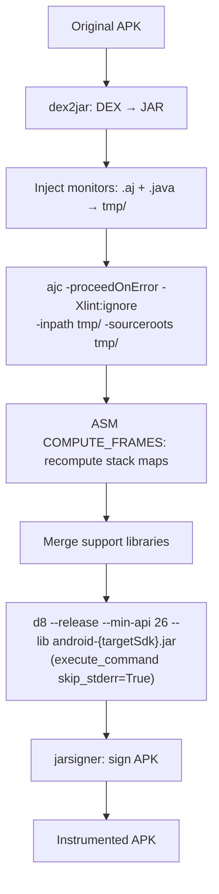

## Purpose

Delta spec for the rv-instrumentation pipeline improvements. This change adds three layered mechanisms to increase instrumentation success rate on modern APKs: (1) `-proceedOnError` on ajc, (2) ASM stack frame recomputation post-weaving (`__compute_stack_frames`), and (3) dynamic `android.jar` selection by `targetSdkVersion`. AspectJ is upgraded from 1.9.24 to 1.9.25.1 for correctness fixes. A complementary change sets `skip_stderr=True` on the d8 invocation so non-fatal warnings do not mask a successful build.

Two originally-planned mitigations (`d8 --no-desugaring` and `ajc -xmlConfigured` with a generated `aop.xml`) were landed and then reverted during empirical validation on `cryptoapp.apk`. See `design.md` → decision D-REVERT and `tasks.md` → Section 8 for the evidence trail. The invariants and scenarios that documented those two flags have been removed from this delta.

## ADDED Invariants

- **INV-INS-14**: The ajc command MUST include the `-proceedOnError` flag. This allows partial weaving to continue when individual classes cause compilation errors, producing woven output for all successfully processed classes instead of aborting the entire APK.

- **INV-INS-17**: After ajc weaving and before d8 compilation, the pipeline MUST run an ASM-based frame recomputation step (`__compute_stack_frames()`) on all `.class` files in `tmp_dir`. This step uses ASM's `ClassWriter.COMPUTE_FRAMES` flag to recompute all stack map frames from scratch, replacing potentially corrupted frames left by ajc's BCEL-based weaver. Files that fail frame computation MUST be logged and skipped (original woven bytecode preserved).

- **INV-INS-18**: The `__get_android_jar()` method MUST select the `android.jar` matching the APK's `targetSdkVersion` (obtained from `app.sdk_target`). If the exact platform is not installed, it MUST fall back to the highest available `android-XX/android.jar` in the SDK platforms directory. The minimum fallback MUST be `android-26` (matching `--min-api 26`). This replaces the hardcoded `android-29` (TODO #23).

- **INV-INS-19**: The d8 invocation MUST pass `skip_stderr=True` to `execute_command`. d8 emits non-fatal "Expected stack map table" warnings to stderr even on success (exit code 0); without this flag, those warnings are treated as failures by the shared command-execution utility. Real errors are still detected via non-zero exit code.

## REMOVED Invariants

- **INV-INS-13 (proposed, reverted Apr 2026)**: "The d8 command MUST include the `--no-desugaring` flag." Reverted. `--no-desugaring` disables d8's synthetic-accessor generation for JDK 11+ nest-mate field access (JEP 181). `rv-monitor-rt.jar` is compiled with JDK 11+ bytecode, so inner classes in the monitor runtime (e.g., `TerminatedMonitorCleaner$Runner`) perform direct private-field access against their outer class. Dalvik on `--min-api < 30` does not implement nest-based access control and raises `java.lang.IllegalAccessError` at runtime. Desugaring must stay enabled. See D-REVERT.

- **INV-INS-15 (proposed, reverted Apr 2026)**: "When a `weaving_excludes.yaml` configuration file is available, the instrumentation pipeline MUST generate an `aop.xml` file ... and pass `-xmlConfigured <path-to-aop.xml>` to ajc." Reverted. `-xmlConfigured` switches ajc to XML-driven weaving; aspects not declared under `<aspects>` in the XML are compiled to `.class` but not activated for weaving. The generated aop.xml contained only `<weaver><exclude .../></weaver>`, so the `Coverage` and `MultiSpec_*` aspects ended up as inert classes in the DEX and zero advice was injected into app bytecode. See D-REVERT.

- **INV-INS-16 (proposed, reverted Apr 2026)**: "The default `weaving_excludes.yaml` MUST include ... patterns aligned with `Coverage.aj` exclusions." Reverted together with INV-INS-15. Library exclusion is now performed at runtime only, via `Coverage.aj`'s `excludedPackages()` pointcut, which already covered all the same packages.

## MODIFIED Requirements

### Requirement: APK Instrumentation with Monitors (FR02)

The system MUST instrument Android APKs with generated runtime verification monitors through a multi-phase pipeline. The pipeline transforms a standard APK into a monitored APK by: (1) decompiling DEX bytecode to Java classes, (2) injecting monitor artifacts, (3) weaving aspects via AspectJ, (4) recomputing stack map frames via ASM, (5) merging runtime dependencies, (6) recompiling to DEX, and (7) signing the APK.

The instrumentation pipeline relies on several external tools that MUST be available:
- **dex2jar** (`d2j-dex2jar.sh`): Converts APK DEX bytecode to JAR format. If the conversion produces an exception file, the pipeline MUST raise a `CommandException`.
- **ajc (AspectJ Compiler 1.9.25.1)**: Weaves monitor pointcuts into application bytecode. Uses Java 1.8 source compatibility (`-source 1.8`), suppresses lint warnings (`-Xlint:ignore`), and proceeds on class-level errors (`-proceedOnError`). The classpath MUST include the `android.jar` matching the APK's `targetSdkVersion` and all runtime verification JARs from `lib_tmp_dir`.
- **rv-frame-computer.jar**: Recomputes stack map frames on all `.class` files in `tmp_dir` using ASM's `ClassWriter.COMPUTE_FRAMES`. Runs after ajc weaving, before library merging.
- **d8 (Android DEX compiler)**: Converts the instrumented JAR back to DEX format. Uses `--release` mode with `--min-api 26` and `--lib` pointing to the dynamically selected `android.jar`. Invoked with `skip_stderr=True` so non-fatal stderr warnings do not mask a successful build (exit code still gates failure).
- **jarsigner**: Signs the APK with the configured keystore using `SHA256withRSA` signature algorithm and `SHA-256` digest algorithm.
- **Maven**: Resolves and downloads runtime dependencies (`rv-monitor-rt.jar`, `rvsec-core.jar`, `rvsec-logger-logcat.jar`, `aspectjrt.jar`) into `lib_tmp_dir`.

After AspectJ weaving and before merging support libraries, the pipeline MUST run the ASM frame recomputation step on all woven `.class` files. This step addresses stack map frame corruption left by ajc's BCEL-based bytecode manipulation, which is the root cause of d8 AIOOBE (ArrayIndexOutOfBoundsException) failures.

MOP coverage scope: library bytecode is weaved by ajc like any other class. At runtime, `Coverage.aj`'s `excludedPackages()` pointcut short-circuits coverage/MOP tag emission for packages such as `sun..*`, `java..*`, `androidx..*`, `kotlin..*`, `com.google..*`, `com.facebook..*`, `org.apache..*`, `libcore..*`, `mop..*`, `javamop..*`, `rvmonitorrt..*`. This preserves app-code monitoring while keeping the pipeline free of compile-time exclusion configuration.

Before instrumentation begins, `prepare_instrumentation()` MUST clean temporary directories from previous runs and execute Maven dependency resolution. After each APK, temporary directories (`tmp_dir`, `rvm_tmp_dir`) MUST be cleaned. After the entire batch, `lib_tmp_dir` MUST be cleaned.

The pipeline supports both single APK instrumentation (`instrument()`) and batch instrumentation (`instrument_apks()`). Batch instrumentation provides error isolation: if one APK fails, processing continues with the next APK. All errors are collected in `InstrumentationResults.errors` and saved to `instrument_errors.json`.

The following pipeline methods MUST use `@ErrorHandler.handle_errors` with `reraise=True` to ensure exceptions propagate to the batch loop: `instrument()`, `__include_generated_monitors()`, `__weave_monitors()`, `__compute_stack_frames()`, `__create_apk()`, `__merge_support_classes()`, `__sign_apk()`. The batch loop (`instrument_apks()`) MUST use `reraise=False` (default) to continue processing after per-APK failures.

When a pipeline phase raises an exception with `_error_phase` annotated by the ErrorHandler decorator, the batch loop MUST use `getattr(ex, '_error_phase', fallback)` to populate `InstrumentationError.phase` with the actual pipeline phase (e.g., `"apk_signing"`, `"apk_creation"`, `"aspect_weaving"`, `"frame_computation"`) instead of hardcoded generic values.

#### Scenario: Effective weaving — aspectOf calls present in app bytecode

- **WHEN** an APK is instrumented and the pipeline completes successfully
- **THEN** the resulting DEX files MUST contain at least one `aspectOf` invocation inside the application's own package classes (outside `classes.dex`, which holds the aspect definitions themselves)
- **AND** installing and launching the APK on an Android emulator with `--min-api 26` or higher MUST emit at least one `RVSEC-COV` logcat entry identifying an application method during normal UI navigation

#### Scenario: Runtime nest-mate access for monitor runtime

- **WHEN** the monitor runtime thread `MonitorCleaner` runs on Android with API level ≥ 26 (below the native nest-based access control threshold of API 30)
- **THEN** inner-class field access from `TerminatedMonitorCleaner$Runner` to `TerminatedMonitorCleaner.removedEntries` MUST succeed without raising `java.lang.IllegalAccessError`
- **AND** this MUST be achieved by letting d8 generate synthetic accessors (default behavior; `--no-desugaring` is NOT used)

#### Scenario: ajc proceeds on class-level errors

- **WHEN** ajc encounters a class with incompatible bytecode (e.g., invalid stack map frames) during weaving
- **THEN** ajc MUST continue processing remaining classes instead of aborting (due to `-proceedOnError`)
- **AND** the problematic class MUST be included in the output with its original bytecode (not woven)
- **AND** all other classes MUST be woven normally

#### Scenario: ASM frame recomputation post-weaving

- **WHEN** ajc weaving completes
- **THEN** `__compute_stack_frames()` MUST invoke `rv-frame-computer.jar` on `tmp_dir`
- **AND** all `.class` files in `tmp_dir` (recursively) MUST have their stack map frames recomputed using ASM `ClassWriter.COMPUTE_FRAMES`
- **AND** files that fail frame computation (e.g., unresolvable type hierarchy) MUST be logged and preserved with their original bytecode
- **AND** the count of successfully recomputed and failed files MUST be logged

#### Scenario: Dynamic android.jar selection by targetSdkVersion

- **WHEN** an APK with `targetSdkVersion=34` is being instrumented and `android-34/android.jar` exists in the SDK platforms directory
- **THEN** `__get_android_jar(app)` MUST return the path to `android-34/android.jar`
- **AND** ajc MUST use this `android.jar` in its classpath
- **AND** d8 MUST use this `android.jar` as `--lib` argument

#### Scenario: Dynamic android.jar fallback to highest available

- **WHEN** an APK with `targetSdkVersion=36` is being instrumented but `android-36/android.jar` does not exist, and the highest available is `android-34`
- **THEN** `__get_android_jar(app)` MUST return the path to `android-34/android.jar`
- **AND** a log message MUST indicate the fallback: "Platform android-36 not available, using android-34"

#### Scenario: d8 ignores non-fatal stderr warnings

- **WHEN** d8 emits stderr output such as "Warning: Expected stack map table for method with non-linear control flow." while still returning exit code 0
- **THEN** the pipeline MUST treat the build as successful
- **AND** the warnings MUST NOT be reported as errors in `InstrumentationResults.errors`

#### Scenario: Successful single APK instrumentation

- **WHEN** an APK at `app.path` exists and is a valid `.apk` file, and `monitor_output_dir` contains `.aj` and `.java` files, and all external tools are available
- **THEN** `RVInstrumentation.instrument(app, result_dir)` MUST produce a signed APK at `{instrumented_dir}/{app.name}`
- **AND** the instrumented APK hash MUST differ from the original APK hash
- **AND** temporary directories (`tmp_dir`, `rvm_tmp_dir`) MUST be cleaned after completion

#### Scenario: Skip existing instrumented APK

- **WHEN** an instrumented APK already exists at `{result_dir}/{app.name}` and `force_instrumentation` is `False`
- **THEN** the pipeline MUST skip this APK without error
- **AND** a log message "Skipping already instrumented APK" MUST be emitted

#### Scenario: Force re-instrumentation

- **WHEN** an instrumented APK already exists at `{result_dir}/{app.name}` and `force_instrumentation` is `True`
- **THEN** the existing APK MUST be deleted
- **AND** the full instrumentation pipeline MUST execute
- **AND** a new signed APK MUST be created at `{instrumented_dir}/{app.name}`

#### Scenario: Pipeline phase failure with accurate phase reporting

- **WHEN** `jarsigner` returns a non-zero exit code during APK signing
- **THEN** the `CommandException` MUST propagate from `__sign_apk()` through `__create_apk()` and `instrument()` decorators (all with `reraise=True`)
- **AND** the exception MUST carry `_error_phase == "apk_signing"` (set by the innermost decorator)
- **AND** the batch loop MUST record the error in `InstrumentationResults.errors` with `phase="apk_signing"` and `tool="jarsigner"`
- **AND** `success_count` MUST NOT be incremented for this APK
- **AND** "Successfully instrumented APK" MUST NOT be logged for this APK

#### Scenario: Batch instrumentation with mixed results

- **WHEN** `instrument_apks()` processes 10 APKs and 3 fail during different pipeline phases (aspect_weaving, apk_creation, apk_signing)
- **THEN** `InstrumentationResults.success_count` MUST be 7
- **AND** `InstrumentationResults.total_count` MUST be 10
- **AND** `InstrumentationResults.success_rate` MUST be 70.0
- **AND** `InstrumentationResults.errors` MUST contain 3 entries, each with `code`, `tool`, `message`, and `phase` matching the actual pipeline phase where the failure occurred
- **AND** `instrument_errors.json` MUST be written to `results_dir` with the serialized error models

#### Scenario: dex2jar conversion failure with phase from outer decorator

- **WHEN** dex2jar produces an exception file during DEX-to-JAR conversion
- **THEN** a `CommandException` MUST be raised with tool name `"dex2jar"`
- **AND** since `__decompile_apk()` has no `@handle_errors` decorator, the exception propagates to `instrument()`'s `except` block, which re-raises
- **AND** the `instrument()` decorator (`phase="single_apk_instrumentation"`, `reraise=True`) MUST annotate `_error_phase = "single_apk_instrumentation"`
- **AND** the error MUST be recorded in `InstrumentationResults.errors` with `phase="single_apk_instrumentation"` and `tool="dex2jar"`
- **AND** temporary directories MUST be cleaned despite the failure

#### Scenario: Instrumentation verification detects unchanged APK

- **WHEN** the instrumented APK file hash equals the original APK file hash
- **THEN** `check_if_instrumented()` MUST raise a `CommandException` with tool `"instrumentation_verification"` and message `"APK {name} was not actually instrumented - hashes match original"`

#### Scenario: Maven dependency resolution failure

- **WHEN** Maven (`mvn clean compile`) fails during `prepare_instrumentation()`
- **THEN** a `CommandException` MUST be raised with tool name `"maven"`
- **AND** `instrument_apks()` MUST record the error in `InstrumentationResults.errors` with key `"setup_error"` and `phase="preparation"`
- **AND** processing MUST NOT continue to individual APK instrumentation
