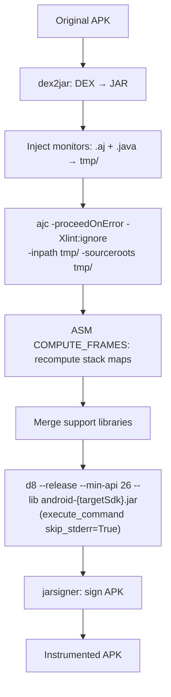

## Purpose

Delta spec for the rv-instrumentation pipeline improvements. This change adds three layered mechanisms to increase instrumentation success rate on modern APKs: (1) `-proceedOnError` on ajc, (2) ASM stack frame recomputation post-weaving (`__compute_stack_frames`), and (3) dynamic `android.jar` selection by `targetSdkVersion`. AspectJ is upgraded from 1.9.24 to 1.9.25.1 for correctness fixes. A complementary change sets `skip_stderr=True` on the d8 invocation so non-fatal warnings do not mask a successful build.

Two originally-planned mitigations (`d8 --no-desugaring` and `ajc -xmlConfigured` with a generated `aop.xml`) were landed and then reverted during empirical validation on `cryptoapp.apk`. See `design.md` → decision D-REVERT and `tasks.md` → Section 8 for the evidence trail. The invariants and scenarios that documented those two flags have been removed from this delta.

## ADDED Invariants

- **INV-INS-14**: The ajc command MUST include the `-proceedOnError` flag. This allows partial weaving to continue when individual classes cause compilation errors, producing woven output for all successfully processed classes instead of aborting the entire APK.

- **INV-INS-17**: After ajc weaving and before d8 compilation, the pipeline MUST run an ASM-based frame recomputation step (`__compute_stack_frames()`) on all `.class` files in `tmp_dir`. This step uses ASM's `ClassWriter.COMPUTE_FRAMES` flag to recompute all stack map frames from scratch, replacing potentially corrupted frames left by ajc's BCEL-based weaver. Files that fail frame computation MUST be logged and skipped (original woven bytecode preserved).

- **INV-INS-18**: The `__get_android_jar()` method MUST select the `android.jar` matching the APK's `targetSdkVersion` (obtained from `app.sdk_target`). If the exact platform is not installed, it MUST fall back to the highest available `android-XX/android.jar` in the SDK platforms directory. The minimum fallback MUST be `android-26` (matching `--min-api 26`). This replaces the hardcoded `android-29` (TODO #23).

- **INV-INS-19**: Every pipeline tool that emits non-fatal warnings to stderr while still returning exit code 0 MUST be invoked with `skip_stderr=True` in `utils.execute_command`. This applies to:
    - **d8**: prints "Expected stack map table for method with non-linear control flow." and similar warnings on successful builds.
    - **rv-frame-computer**: prints one `"Warning: frame computation failed for <class>: <exception>"` per class whose stack map cannot be recomputed, and continues processing the remaining classes (per the design intent in INV-INS-17). The JVM exits 0 regardless.
    - **ajc**: with `-proceedOnError`, the weaver continues past per-class failures ("AspectJ Internal Error: unable to add stackmap attributes to class 'X'. Index -1 out of bounds for length 0") and still exits 0 with valid partial output for every successfully woven class. Those per-class errors are printed to stderr.
    - **mvn** (Maven dependency resolution): modern JVMs (JDK 21+) emit native-access restrictions and `sun.misc.Unsafe` deprecation warnings to stderr on every invocation (`"WARNING: A restricted method in java.lang.System has been called"`, `"sun.misc.Unsafe::objectFieldOffset has been called by com.google.common.util.concurrent.AbstractFuture$UnsafeAtomicHelper"`). BUILD SUCCESS still exits 0; the warnings are purely informational.
    - **apksigner** (`sign` and `verify` subcommands): same JDK 21+ origin — `"WARNING: java.lang.System::loadLibrary has been called by org.conscrypt.NativeLibraryUtil"`. Exit 0 on a successful signature / verification; the warnings are emitted on every invocation regardless of outcome.
  Without `skip_stderr=True`, the shared command-execution utility turns any stderr output into a `CommandException`, incorrectly marking the whole APK as failed when only a fraction of its classes produced warnings. Real crashes (non-zero exit code) still surface as failures.

- **INV-INS-20**: After `__sign_apk()` (jarsigner), the pipeline MUST run `zipalign -f -P 16 4 <signed.apk> <signed.apk.aligned>` and overwrite the signed APK in place with the aligned copy. Alignment MUST be the LAST step before returning the final APK, because jarsigner's v1 signature scheme re-packs the ZIP when adding `META-INF/*.{SF,RSA}` entries and thereby destroys any alignment applied earlier in the pipeline. Modern APKs store native libraries uncompressed (default since API 23 via `android:extractNativeLibs="false"`) and require page alignment; without this step the PackageManager fails installation with `INSTALL_FAILED_INVALID_APK` (`res=-2`) on any device that mmaps `.so` entries from the APK.

- **INV-INS-21**: `rv-frame-computer.jar` MUST be invoked TWICE per APK — once before `__weave_monitors()` (via `__pre_compute_stack_frames`, ErrorHandler phase `pre_frame_computation`) and once after (via `__compute_stack_frames`, ErrorHandler phase `frame_computation`). The pre-weaving call feeds ajc `.class` files with ASM-reconstructed StackMapTables so BCEL only needs to append advice, avoiding `AspectJ Internal Error: unable to add stackmap attributes ... Index -1 out of bounds for length 0` on modern bytecode patterns (nested try-with-resources, lambdas with captures, switch expressions). The post-weaving call fixes frames the weaver itself may have corrupted. Both invocations MUST pass `skip_stderr=True` per INV-INS-19.

- **INV-INS-22**: After `__decompile_apk()` and before `__include_generated_monitors()`, the pipeline MUST delete every `.class` file located under a `j$/**` path inside `tmp_dir`. These are pre-desugared shims of `java.*` APIs (`j$.time.*`, `j$.util.stream.*`, etc.) emitted by older AGP builds. d8 refuses to merge `j$.*` classes with non-`java.*` classes (`Merging DEX file containing classes with prefix 'j$.' with other classes, except classes with prefix 'java.', is not allowed`). Since `--min-api 26` (Android 8.0+) provides all Java 8+ APIs natively, the shims are redundant; removing them unblocks d8 without affecting runtime behavior. The count of removed shims SHOULD be logged per APK.

- **INV-INS-23**: After `__strip_desugared_shims()` and before `__include_generated_monitors()`, the pipeline MUST move every `.class` file whose path under `tmp_dir` matches one of the patterns listed in `assets/weaving_excludes.yaml` to a `<tmp_dir>_quarantine/` (a sibling of `tmp_dir`, NOT a subdirectory — ajc's `-inpath` and the frame computer's walker would otherwise descend into any subdirectory and defeat the isolation) subdirectory, preserving the relative path. After `__compute_stack_frames()` (post-ajc) and before `__merge_support_classes()`, the pipeline MUST restore the quarantined files to their original locations under `tmp_dir`, overwriting any version produced by the weaver. The final APK ships the quarantined classes in their ORIGINAL (non-woven) bytecode, but they are present in the DEX. The quarantine patterns MUST NOT match the APK's own code package as returned by `App.code_package`; if such a match is detected, the pipeline MUST log a WARNING and NOT quarantine those files. The count of quarantined files MUST be logged at INFO per APK.

- **INV-INS-24**: The Docker-provided Android emulator image MUST be Google APIs API 30 `x86_64` (`system-images;android-30;google_apis;x86_64`). The `docker/android/Dockerfile` build args MUST set `API_LEVEL=30` and `ARCHITECTURE=x86_64`. The local development AVD named `RVSec` MUST be recreated from the same system-image using the same `avdmanager` invocation the Dockerfile uses (`avdmanager --verbose create avd --force --name RVSec --abi google_apis/x86_64 --package "system-images;android-30;google_apis;x86_64" --device pixel`). API 31+ images MUST NOT be used because their Foreground Service restrictions can mask instrumentation bugs behind platform-induced process kills.

- **INV-INS-25**: APK signing MUST use `apksigner` (Android SDK `build-tools/<ver>/apksigner`) with schemes v1, v2, and v3 enabled together. The pipeline MUST NOT use `jarsigner`, `d2j-apk-sign.sh`, or any combination thereof — API 30+ emulators reject v1-only signatures with `INSTALL_PARSE_FAILED_NO_CERTIFICATES`. `__sign_apk(app, unsigned_apk)` MUST invoke `apksigner sign --ks <keystore> --ks-pass pass:<password> --ks-key-alias <alias> <unsigned_apk>` followed by `apksigner verify <signed_apk>`. Because apksigner v2/v3 preserves alignment, `__zipalign(unsigned_apk)` MUST run BEFORE `__sign_apk`, not after. The legacy methods `__d2j_apk_sign`, `__jarsigner`, `__jarsigner_verify` and the `Dex2jarTools.apk_sign` config field MUST NOT exist in the codebase (CLAUDE.md P3).

## REMOVED Invariants

- **INV-INS-13 (proposed, reverted Apr 2026)**: "The d8 command MUST include the `--no-desugaring` flag." Reverted. `--no-desugaring` disables d8's synthetic-accessor generation for JDK 11+ nest-mate field access (JEP 181). `rv-monitor-rt.jar` is compiled with JDK 11+ bytecode, so inner classes in the monitor runtime (e.g., `TerminatedMonitorCleaner$Runner`) perform direct private-field access against their outer class. Dalvik on `--min-api < 30` does not implement nest-based access control and raises `java.lang.IllegalAccessError` at runtime. Desugaring must stay enabled. See D-REVERT.

- **INV-INS-15 (proposed, reverted Apr 2026)**: "When a `weaving_excludes.yaml` configuration file is available, the instrumentation pipeline MUST generate an `aop.xml` file ... and pass `-xmlConfigured <path-to-aop.xml>` to ajc." Reverted. `-xmlConfigured` switches ajc to XML-driven weaving; aspects not declared under `<aspects>` in the XML are compiled to `.class` but not activated for weaving. The generated aop.xml contained only `<weaver><exclude .../></weaver>`, so the `Coverage` and `MultiSpec_*` aspects ended up as inert classes in the DEX and zero advice was injected into app bytecode. See D-REVERT.

- **INV-INS-16 (proposed, reverted Apr 2026)**: "The default `weaving_excludes.yaml` MUST include ... patterns aligned with `Coverage.aj` exclusions." Reverted together with INV-INS-15. Library exclusion is now performed at runtime only, via `Coverage.aj`'s `excludedPackages()` pointcut, which already covered all the same packages.

## MODIFIED Requirements

### Requirement: APK Instrumentation with Monitors (FR02)

The system MUST instrument Android APKs with generated runtime verification monitors through a multi-phase pipeline. The pipeline transforms a standard APK into a monitored APK by: (1) decompiling DEX bytecode to Java classes, (2) injecting monitor artifacts, (3) weaving aspects via AspectJ, (4) recomputing stack map frames via ASM, (5) merging runtime dependencies, (6) recompiling to DEX, and (7) signing the APK.

The instrumentation pipeline relies on several external tools that MUST be available:
- **dex2jar** (`d2j-dex2jar.sh`): Converts APK DEX bytecode to JAR format. If the conversion produces an exception file, the pipeline MUST raise a `CommandException`.
- **ajc (AspectJ Compiler 1.9.25.1)**: Weaves monitor pointcuts into application bytecode. Uses Java 1.8 source compatibility (`-source 1.8`), suppresses lint warnings (`-Xlint:ignore`), and proceeds on class-level errors (`-proceedOnError`). The classpath MUST include the `android.jar` matching the APK's `targetSdkVersion` and all runtime verification JARs from `lib_tmp_dir`.
- **rv-frame-computer.jar**: Recomputes stack map frames on all `.class` files in `tmp_dir` using ASM's `ClassWriter.COMPUTE_FRAMES`. Runs after ajc weaving, before library merging.
- **d8 (Android DEX compiler)**: Converts the instrumented JAR back to DEX format. Uses `--release` mode with `--min-api 26` and `--lib` pointing to the dynamically selected `android.jar`. Invoked with `skip_stderr=True` so non-fatal stderr warnings do not mask a successful build (exit code still gates failure).
- **jarsigner**: Signs the APK with the configured keystore using `SHA256withRSA` signature algorithm and `SHA-256` digest algorithm.
- **Maven**: Resolves and downloads runtime dependencies (`rv-monitor-rt.jar`, `rvsec-core.jar`, `rvsec-logger-logcat.jar`, `aspectjrt.jar`) into `lib_tmp_dir`.

After AspectJ weaving and before merging support libraries, the pipeline MUST run the ASM frame recomputation step on all woven `.class` files. This step addresses stack map frame corruption left by ajc's BCEL-based bytecode manipulation, which is the root cause of d8 AIOOBE (ArrayIndexOutOfBoundsException) failures.

MOP coverage scope: library bytecode is weaved by ajc like any other class. At runtime, `Coverage.aj`'s `excludedPackages()` pointcut short-circuits coverage/MOP tag emission for packages such as `sun..*`, `java..*`, `androidx..*`, `kotlin..*`, `com.google..*`, `com.facebook..*`, `org.apache..*`, `libcore..*`, `mop..*`, `javamop..*`, `rvmonitorrt..*`. This preserves app-code monitoring while keeping the pipeline free of compile-time exclusion configuration.

Before instrumentation begins, `prepare_instrumentation()` MUST clean temporary directories from previous runs and execute Maven dependency resolution. After each APK, temporary directories (`tmp_dir`, `rvm_tmp_dir`) MUST be cleaned. After the entire batch, `lib_tmp_dir` MUST be cleaned.

The pipeline supports both single APK instrumentation (`instrument()`) and batch instrumentation (`instrument_apks()`). Batch instrumentation provides error isolation: if one APK fails, processing continues with the next APK. All errors are collected in `InstrumentationResults.errors` and saved to `instrument_errors.json`.

The following pipeline methods MUST use `@ErrorHandler.handle_errors` with `reraise=True` to ensure exceptions propagate to the batch loop: `instrument()`, `__include_generated_monitors()`, `__weave_monitors()`, `__compute_stack_frames()`, `__create_apk()`, `__merge_support_classes()`, `__sign_apk()`. The batch loop (`instrument_apks()`) MUST use `reraise=False` (default) to continue processing after per-APK failures.

When a pipeline phase raises an exception with `_error_phase` annotated by the ErrorHandler decorator, the batch loop MUST use `getattr(ex, '_error_phase', fallback)` to populate `InstrumentationError.phase` with the actual pipeline phase (e.g., `"apk_signing"`, `"apk_creation"`, `"aspect_weaving"`, `"frame_computation"`) instead of hardcoded generic values.

#### Scenario: Effective weaving — aspectOf calls present in app bytecode

- **WHEN** an APK is instrumented and the pipeline completes successfully
- **THEN** the resulting DEX files MUST contain at least one `aspectOf` invocation inside the application's own package classes (outside `classes.dex`, which holds the aspect definitions themselves)
- **AND** installing and launching the APK on an Android emulator with `--min-api 26` or higher MUST emit at least one `RVSEC-COV` logcat entry identifying an application method during normal UI navigation

#### Scenario: Runtime nest-mate access for monitor runtime

- **WHEN** the monitor runtime thread `MonitorCleaner` runs on Android with API level ≥ 26 (below the native nest-based access control threshold of API 30)
- **THEN** inner-class field access from `TerminatedMonitorCleaner$Runner` to `TerminatedMonitorCleaner.removedEntries` MUST succeed without raising `java.lang.IllegalAccessError`
- **AND** this MUST be achieved by letting d8 generate synthetic accessors (default behavior; `--no-desugaring` is NOT used)

#### Scenario: ajc proceeds on class-level errors

- **WHEN** ajc encounters a class with incompatible bytecode (e.g., invalid stack map frames) during weaving
- **THEN** ajc MUST continue processing remaining classes instead of aborting (due to `-proceedOnError`)
- **AND** the problematic class MUST be included in the output with its original bytecode (not woven)
- **AND** all other classes MUST be woven normally
- **AND** `utils.execute_command` MUST be called with `skip_stderr=True` so the `"AspectJ Internal Error: unable to add stackmap attributes to class 'X'"` messages ajc writes to stderr do not fail the APK; only a non-zero ajc exit code is treated as failure

#### Scenario: ASM frame recomputation post-weaving

- **WHEN** ajc weaving completes
- **THEN** `__compute_stack_frames()` MUST invoke `rv-frame-computer.jar` on `tmp_dir`
- **AND** all `.class` files in `tmp_dir` (recursively) MUST have their stack map frames recomputed using ASM `ClassWriter.COMPUTE_FRAMES`
- **AND** files that fail frame computation (e.g., unresolvable type hierarchy) MUST be logged and preserved with their original bytecode
- **AND** the count of successfully recomputed and failed files MUST be logged
- **AND** `utils.execute_command` MUST be called with `skip_stderr=True` so the per-class "Warning: frame computation failed for …" stderr entries do not mark the entire APK as failed; only a non-zero JVM exit code is treated as failure

#### Scenario: Dynamic android.jar selection by targetSdkVersion

- **WHEN** an APK with `targetSdkVersion=34` is being instrumented and `android-34/android.jar` exists in the SDK platforms directory
- **THEN** `__get_android_jar(app)` MUST return the path to `android-34/android.jar`
- **AND** ajc MUST use this `android.jar` in its classpath
- **AND** d8 MUST use this `android.jar` as `--lib` argument

#### Scenario: Dynamic android.jar fallback to highest available

- **WHEN** an APK with `targetSdkVersion=36` is being instrumented but `android-36/android.jar` does not exist, and the highest available is `android-34`
- **THEN** `__get_android_jar(app)` MUST return the path to `android-34/android.jar`
- **AND** a log message MUST indicate the fallback: "Platform android-36 not available, using android-34"

#### Scenario: d8 ignores non-fatal stderr warnings

- **WHEN** d8 emits stderr output such as "Warning: Expected stack map table for method with non-linear control flow." while still returning exit code 0
- **THEN** the pipeline MUST treat the build as successful
- **AND** the warnings MUST NOT be reported as errors in `InstrumentationResults.errors`

#### Scenario: Native libraries page-aligned before signing

- **WHEN** the pipeline has produced an unsigned APK via `__d8()` and is about to invoke `__sign_apk()`
- **THEN** `__zipalign(unsigned_apk)` MUST run `zipalign -f -P 16 4 <unsigned_apk> <unsigned_apk>.aligned` and replace the unsigned APK in place with the aligned output
- **AND** the subsequent `__sign_apk()` (apksigner) MUST preserve the alignment so the final installed APK has uncompressed `.so` entries at 16 KiB boundaries
- **AND** installation MUST NOT fail with `INSTALL_FAILED_INVALID_APK: Failed to extract native libraries, res=-2`

#### Scenario: APK signed with v1+v2+v3 schemes via apksigner

- **WHEN** the pipeline has produced an aligned unsigned APK and is ready to sign
- **THEN** `__sign_apk(app, unsigned_apk)` MUST invoke `apksigner sign --ks <keystore_file> --ks-pass pass:<keystore_password> --ks-key-alias <keystore_alias> <apk_path>` where `<apk_path>` is the unsigned APK (apksigner overwrites in place by default)
- **AND** the call MUST NOT pass any flag that disables `v2-signing-enabled` or `v3-signing-enabled` — both default to true in apksigner 0.9+
- **AND** after signing, the pipeline MUST invoke `apksigner verify <apk_path>` and treat a non-zero exit code as failure
- **AND** the resulting signed APK MUST install on an Android API 30 emulator without `INSTALL_PARSE_FAILED_NO_CERTIFICATES`
- **AND** the pipeline MUST NOT contain calls to `jarsigner`, `d2j-apk-sign.sh`, or a META-INF strip step

#### Scenario: ASM frame recomputation runs BEFORE ajc as well as after

- **WHEN** `__include_generated_monitors()` has finished copying `.aj`/`.java` sources into `tmp_dir`
- **THEN** `__pre_compute_stack_frames(app)` MUST run `rv-frame-computer.jar` over `tmp_dir` (ErrorHandler phase `pre_frame_computation`) before `__weave_monitors()` is invoked
- **AND** after `__weave_monitors()` finishes, the existing `__compute_stack_frames(app)` MUST run the same JAR over `tmp_dir` again (phase `frame_computation`)
- **AND** both invocations MUST pass `skip_stderr=True` to `utils.execute_command` so per-class warnings ("Warning: frame computation failed for ...") do not fail the APK
- **AND** APKs that previously failed with `AspectJ Internal Error: unable to add stackmap attributes to class '<X>'. Index -1 out of bounds for length 0` (e.g., `org.apache.tika.parser.CryptoParser`, `okio.Buffer`, `androidx.media3.datasource.AesFlushingCipher`) MUST now weave successfully in the majority of cases

#### Scenario: Pre-desugared `j$.*` shims stripped before instrumentation

- **WHEN** `__decompile_apk()` has produced `tmp_dir` and before `__include_generated_monitors()` runs
- **THEN** `__strip_desugared_shims(app)` MUST delete every `.class` file under `tmp_dir/j$/**`
- **AND** the number of removed shims MUST be logged at INFO level
- **AND** subsequent `__d8()` invocation MUST NOT fail with `Merging DEX file containing classes with prefix 'j$.' with other classes, except classes with prefix 'java.', is not allowed`
- **AND** the resulting APK MUST run correctly on Android API ≥ 26 (no `j$.*` references remain; the runtime's native `java.*` classes satisfy all calls)

#### Scenario: Problematic library classes quarantined and restored

- **WHEN** `__strip_desugared_shims()` has finished and before `__include_generated_monitors()` runs
- **THEN** `__quarantine_problematic_classes(app)` MUST move every `.class` file whose path matches a pattern in `assets/weaving_excludes.yaml` (e.g., `okio/**/*.class`, `androidx/media3/datasource/**/*.class`) into a `<tmp_dir>_quarantine/` (a sibling of `tmp_dir`, NOT a subdirectory — ajc's `-inpath` and the frame computer's walker would otherwise descend into any subdirectory and defeat the isolation) subdirectory, preserving the relative subtree
- **AND** the method MUST NOT quarantine any file whose path starts with the APK's `App.code_package` (if a pattern does match app code, a WARNING MUST be logged and the match MUST be ignored)
- **AND** the count of quarantined files MUST be logged at INFO
- **AND** after `__compute_stack_frames()` (post-ajc) and before `__merge_support_classes()`, `__restore_quarantined_classes(app)` MUST move every file from `tmp_dir/.quarantine/**` back into its original relative location under `tmp_dir`, OVERWRITING any file already present at that location
- **AND** the `<tmp_dir>_quarantine/` directory MUST be empty (or deleted) after restore completes
- **AND** neither ajc's `AspectJ Internal Error: unable to add stackmap attributes to class '<X>'` nor d8's `Error in ... at L<X>;...: java.lang.ArrayIndexOutOfBoundsException: Index -1 out of bounds for length 0` MUST fail the APK for any `<X>` whose package is in the quarantine list

#### Scenario: Successful single APK instrumentation

- **WHEN** an APK at `app.path` exists and is a valid `.apk` file, and `monitor_output_dir` contains `.aj` and `.java` files, and all external tools are available
- **THEN** `RVInstrumentation.instrument(app, result_dir)` MUST produce a signed APK at `{instrumented_dir}/{app.name}`
- **AND** the instrumented APK hash MUST differ from the original APK hash
- **AND** temporary directories (`tmp_dir`, `rvm_tmp_dir`) MUST be cleaned after completion

#### Scenario: Skip existing instrumented APK

- **WHEN** an instrumented APK already exists at `{result_dir}/{app.name}` and `force_instrumentation` is `False`
- **THEN** the pipeline MUST skip this APK without error
- **AND** a log message "Skipping already instrumented APK" MUST be emitted

#### Scenario: Force re-instrumentation

- **WHEN** an instrumented APK already exists at `{result_dir}/{app.name}` and `force_instrumentation` is `True`
- **THEN** the existing APK MUST be deleted
- **AND** the full instrumentation pipeline MUST execute
- **AND** a new signed APK MUST be created at `{instrumented_dir}/{app.name}`

#### Scenario: Pipeline phase failure with accurate phase reporting

- **WHEN** `jarsigner` returns a non-zero exit code during APK signing
- **THEN** the `CommandException` MUST propagate from `__sign_apk()` through `__create_apk()` and `instrument()` decorators (all with `reraise=True`)
- **AND** the exception MUST carry `_error_phase == "apk_signing"` (set by the innermost decorator)
- **AND** the batch loop MUST record the error in `InstrumentationResults.errors` with `phase="apk_signing"` and `tool="jarsigner"`
- **AND** `success_count` MUST NOT be incremented for this APK
- **AND** "Successfully instrumented APK" MUST NOT be logged for this APK

#### Scenario: Batch instrumentation with mixed results

- **WHEN** `instrument_apks()` processes 10 APKs and 3 fail during different pipeline phases (aspect_weaving, apk_creation, apk_signing)
- **THEN** `InstrumentationResults.success_count` MUST be 7
- **AND** `InstrumentationResults.total_count` MUST be 10
- **AND** `InstrumentationResults.success_rate` MUST be 70.0
- **AND** `InstrumentationResults.errors` MUST contain 3 entries, each with `code`, `tool`, `message`, and `phase` matching the actual pipeline phase where the failure occurred
- **AND** `instrument_errors.json` MUST be written to `results_dir` with the serialized error models

#### Scenario: dex2jar conversion failure with phase from outer decorator

- **WHEN** dex2jar produces an exception file during DEX-to-JAR conversion
- **THEN** a `CommandException` MUST be raised with tool name `"dex2jar"`
- **AND** since `__decompile_apk()` has no `@handle_errors` decorator, the exception propagates to `instrument()`'s `except` block, which re-raises
- **AND** the `instrument()` decorator (`phase="single_apk_instrumentation"`, `reraise=True`) MUST annotate `_error_phase = "single_apk_instrumentation"`
- **AND** the error MUST be recorded in `InstrumentationResults.errors` with `phase="single_apk_instrumentation"` and `tool="dex2jar"`
- **AND** temporary directories MUST be cleaned despite the failure

#### Scenario: Instrumentation verification detects unchanged APK

- **WHEN** the instrumented APK file hash equals the original APK file hash
- **THEN** `check_if_instrumented()` MUST raise a `CommandException` with tool `"instrumentation_verification"` and message `"APK {name} was not actually instrumented - hashes match original"`

#### Scenario: Maven dependency resolution failure

- **WHEN** Maven (`mvn clean compile`) fails during `prepare_instrumentation()`
- **THEN** a `CommandException` MUST be raised with tool name `"maven"`
- **AND** `instrument_apks()` MUST record the error in `InstrumentationResults.errors` with key `"setup_error"` and `phase="preparation"`
- **AND** processing MUST NOT continue to individual APK instrumentation
