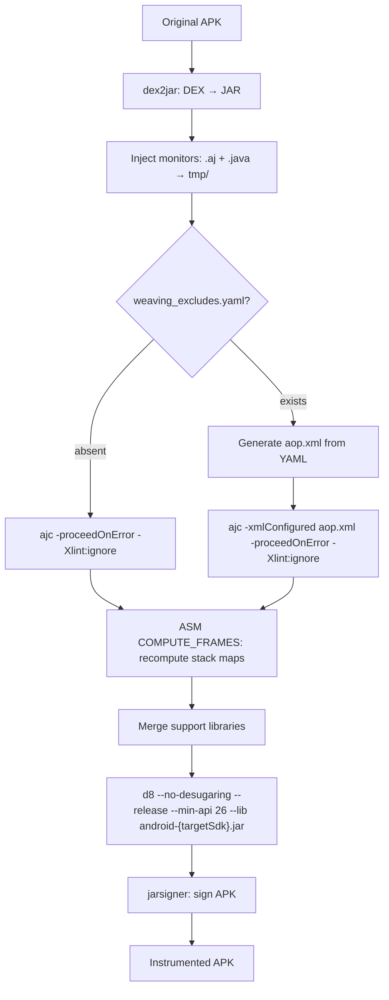

## Purpose

Delta spec for the rv-instrumentation pipeline improvements. This change adds six layered mechanisms to increase instrumentation success rate on modern APKs: (1) ASM stack frame recomputation post-weaving, (2) configurable class exclusion via `-xmlConfigured` + `aop.xml`, (3) `--no-desugaring` on d8, (4) `-proceedOnError` on ajc, (5) dynamic `android.jar` selection by `targetSdkVersion`, and (6) AspectJ 1.9.25.1 upgrade.

## ADDED Invariants

- **INV-INS-13**: The d8 command MUST include the `--no-desugaring` flag. Since `--min-api 26` provides native Java 8 support, desugaring is unnecessary and causes conflicts with pre-desugared classes (j$ prefix) from the original APK build.

- **INV-INS-14**: The ajc command MUST include the `-proceedOnError` flag. This allows partial weaving to continue when individual classes cause compilation errors, producing woven output for all successfully processed classes instead of aborting the entire APK.

- **INV-INS-15**: When a `weaving_excludes.yaml` configuration file is available, the instrumentation pipeline MUST generate an `aop.xml` file with `<exclude within="..."/>` entries for each pattern, and pass `-xmlConfigured <path-to-aop.xml>` to ajc as explicit arguments. The `-xmlConfigured` flag in CTW mode requires the file path on the command line — it does NOT auto-discover `META-INF/aop.xml` from the classpath.

- **INV-INS-16**: The default `weaving_excludes.yaml` MUST include at least the following patterns, aligned with `Coverage.aj` exclusions: `com.google..*`, `androidx..*`, `kotlin..*`, `kotlinx..*`, `android.support..*`, `android..*`, `com.android..*`, `j$..*`, `org.apache..*`, `com.facebook..*`, `okhttp3..*`, `okio..*`. Additional patterns (e.g., `com.squareup..*`, `io.reactivex..*`) MAY be included. The patterns MUST NOT match the APK's own code package (verifiable via `App.code_package`).

- **INV-INS-17**: After ajc weaving and before d8 compilation, the pipeline MUST run an ASM-based frame recomputation step (`__compute_stack_frames()`) on all `.class` files in `tmp_dir`. This step uses ASM's `ClassWriter.COMPUTE_FRAMES` flag to recompute all stack map frames from scratch, replacing potentially corrupted frames left by ajc's BCEL-based weaver. Files that fail frame computation MUST be logged and skipped (original woven bytecode preserved). This step is complementary to aop.xml exclusion: aop.xml prevents weaving library classes, COMPUTE_FRAMES fixes frames in classes that were weaved.

- **INV-INS-18**: The `__get_android_jar()` method MUST select the `android.jar` matching the APK's `targetSdkVersion` (obtained from `app.sdk_target`). If the exact platform is not installed, it MUST fall back to the highest available `android-XX/android.jar` in the SDK platforms directory. The minimum fallback MUST be `android-26` (matching `--min-api 26`). This replaces the hardcoded `android-29` (TODO #23).

## MODIFIED Requirements

### Requirement: APK Instrumentation with Monitors (FR02)

The system MUST instrument Android APKs with generated runtime verification monitors through a multi-phase pipeline. The pipeline transforms a standard APK into a monitored APK by: (1) decompiling DEX bytecode to Java classes, (2) injecting monitor artifacts, (3) weaving aspects via AspectJ, (4) recomputing stack map frames via ASM, (5) merging runtime dependencies, (6) recompiling to DEX, and (7) signing the APK.



The instrumentation pipeline relies on several external tools that MUST be available:
- **dex2jar** (`d2j-dex2jar.sh`): Converts APK DEX bytecode to JAR format. If the conversion produces an exception file, the pipeline MUST raise a `CommandException`.
- **ajc (AspectJ Compiler 1.9.25.1)**: Weaves monitor pointcuts into application bytecode. Uses Java 1.8 source compatibility (`-source 1.8`), suppresses lint warnings (`-Xlint:ignore`), proceeds on class-level errors (`-proceedOnError`), and optionally uses `-xmlConfigured <path>` with a generated `aop.xml` for class exclusion. The classpath MUST include the `android.jar` matching the APK's `targetSdkVersion` and all runtime verification JARs from `lib_tmp_dir`.
- **rv-frame-computer.jar**: Recomputes stack map frames on all `.class` files in `tmp_dir` using ASM's `ClassWriter.COMPUTE_FRAMES`. Runs after ajc weaving, before library merging.
- **d8 (Android DEX compiler)**: Converts the instrumented JAR back to DEX format. Uses `--release` mode with `--min-api 26`, `--no-desugaring`, and `--lib` pointing to the dynamically selected `android.jar`.
- **jarsigner**: Signs the APK with the configured keystore using `SHA256withRSA` signature algorithm and `SHA-256` digest algorithm.
- **Maven**: Resolves and downloads runtime dependencies (`rv-monitor-rt.jar`, `rvsec-core.jar`, `rvsec-logger-logcat.jar`, `aspectjrt.jar`) into `lib_tmp_dir`.

Before AspectJ weaving, the pipeline MUST check for a `weaving_excludes.yaml` configuration. If present, it MUST generate an `aop.xml` file in the temporary directory with `<exclude within="..."/>` entries for each pattern and pass `-xmlConfigured <aop_xml_path>` to the ajc command as explicit arguments. If absent, ajc runs without class exclusion (current behavior preserved).

After AspectJ weaving and before merging support libraries, the pipeline MUST run the ASM frame recomputation step on all woven `.class` files. This step addresses stack map frame corruption left by ajc's BCEL-based bytecode manipulation, which is the root cause of d8 AIOOBE (ArrayIndexOutOfBoundsException) failures.

MOP coverage trade-off: excluding library packages from weaving removes monitoring of calls originating inside excluded libraries, because all 168 MOP specs use `call()` semantics (caller-site interception). Calls from app code to monitored APIs remain monitored. This is a scope decision aligned with `Coverage.aj` and the research objective of detecting misuse in developer code. `App.code_package` (via `PackageDetector`) provides verification that exclusions never cover the app's own package.

Before instrumentation begins, `prepare_instrumentation()` MUST clean temporary directories from previous runs and execute Maven dependency resolution. After each APK, temporary directories (`tmp_dir`, `rvm_tmp_dir`) MUST be cleaned. After the entire batch, `lib_tmp_dir` MUST be cleaned.

The pipeline supports both single APK instrumentation (`instrument()`) and batch instrumentation (`instrument_apks()`). Batch instrumentation provides error isolation: if one APK fails, processing continues with the next APK. All errors are collected in `InstrumentationResults.errors` and saved to `instrument_errors.json`.

The following pipeline methods MUST use `@ErrorHandler.handle_errors` with `reraise=True` to ensure exceptions propagate to the batch loop: `instrument()`, `__include_generated_monitors()`, `__weave_monitors()`, `__compute_stack_frames()`, `__create_apk()`, `__merge_support_classes()`, `__sign_apk()`. The batch loop (`instrument_apks()`) MUST use `reraise=False` (default) to continue processing after per-APK failures.

When a pipeline phase raises an exception with `_error_phase` annotated by the ErrorHandler decorator, the batch loop MUST use `getattr(ex, '_error_phase', fallback)` to populate `InstrumentationError.phase` with the actual pipeline phase (e.g., `"apk_signing"`, `"apk_creation"`, `"aspect_weaving"`, `"frame_computation"`) instead of hardcoded generic values.

#### Scenario: Successful instrumentation with d8 --no-desugaring

- **WHEN** an APK is instrumented and the d8 compilation step runs
- **THEN** the d8 command MUST include `--no-desugaring` alongside `--release`, `--min-api 26`, and `--lib android.jar`
- **AND** APKs that previously failed with "Merging DEX file containing classes with prefix 'j$.'" MUST now compile successfully

#### Scenario: ajc proceeds on class-level errors

- **WHEN** ajc encounters a class with incompatible bytecode (e.g., invalid stack map frames) during weaving
- **THEN** ajc MUST continue processing remaining classes instead of aborting (due to `-proceedOnError`)
- **AND** the problematic class MUST be included in the output with its original bytecode (not woven)
- **AND** all other classes MUST be woven normally

#### Scenario: Weaving with class exclusion via aop.xml

- **WHEN** `weaving_excludes.yaml` exists with patterns `["com.google..*", "androidx..*", "kotlin..*"]`
- **THEN** the pipeline MUST generate `aop.xml` in the temporary directory containing:
  ```xml
  <aspectj>
    <weaver>
      <exclude within="com.google..*"/>
      <exclude within="androidx..*"/>
      <exclude within="kotlin..*"/>
    </weaver>
  </aspectj>
  ```
- **AND** ajc MUST be invoked with `-xmlConfigured <path-to-aop.xml>` as explicit arguments (not classpath auto-discovery)
- **AND** classes matching excluded patterns MUST NOT receive woven advice
- **AND** classes NOT matching excluded patterns MUST be woven normally

#### Scenario: No weaving_excludes.yaml (backward compatible)

- **WHEN** `weaving_excludes.yaml` is not found in the assets directory
- **THEN** ajc MUST be invoked WITHOUT `-xmlConfigured` flag
- **AND** weaving behavior MUST be identical to previous versions (all classes in `-inpath` are woven)

#### Scenario: ASM frame recomputation post-weaving

- **WHEN** ajc weaving completes (with or without `-xmlConfigured`)
- **THEN** `__compute_stack_frames()` MUST invoke `rv-frame-computer.jar` on `tmp_dir`
- **AND** all `.class` files in `tmp_dir` (recursively) MUST have their stack map frames recomputed using ASM `ClassWriter.COMPUTE_FRAMES`
- **AND** files that fail frame computation (e.g., unresolvable type hierarchy) MUST be logged and preserved with their original bytecode
- **AND** the count of successfully recomputed and failed files MUST be logged

#### Scenario: Dynamic android.jar selection by targetSdkVersion

- **WHEN** an APK with `targetSdkVersion=34` is being instrumented and `android-34/android.jar` exists in the SDK platforms directory
- **THEN** `__get_android_jar(app)` MUST return the path to `android-34/android.jar`
- **AND** ajc MUST use this `android.jar` in its classpath
- **AND** d8 MUST use this `android.jar` as `--lib` argument

#### Scenario: Dynamic android.jar fallback to highest available

- **WHEN** an APK with `targetSdkVersion=36` is being instrumented but `android-36/android.jar` does not exist, and the highest available is `android-34`
- **THEN** `__get_android_jar(app)` MUST return the path to `android-34/android.jar`
- **AND** a log message MUST indicate the fallback: "Platform android-36 not available, using android-34"

#### Scenario: Successful single APK instrumentation

- **WHEN** an APK at `app.path` exists and is a valid `.apk` file, and `monitor_output_dir` contains `.aj` and `.java` files, and all external tools are available
- **THEN** `RVInstrumentation.instrument(app, result_dir)` MUST produce a signed APK at `{instrumented_dir}/{app.name}`
- **AND** the instrumented APK hash MUST differ from the original APK hash
- **AND** temporary directories (`tmp_dir`, `rvm_tmp_dir`) MUST be cleaned after completion

#### Scenario: Skip existing instrumented APK

- **WHEN** an instrumented APK already exists at `{result_dir}/{app.name}` and `force_instrumentation` is `False`
- **THEN** the pipeline MUST skip this APK without error
- **AND** a log message "Skipping already instrumented APK" MUST be emitted

#### Scenario: Force re-instrumentation

- **WHEN** an instrumented APK already exists at `{result_dir}/{app.name}` and `force_instrumentation` is `True`
- **THEN** the existing APK MUST be deleted
- **AND** the full instrumentation pipeline MUST execute
- **AND** a new signed APK MUST be created at `{instrumented_dir}/{app.name}`

#### Scenario: Pipeline phase failure with accurate phase reporting

- **WHEN** `jarsigner` returns a non-zero exit code during APK signing
- **THEN** the `CommandException` MUST propagate from `__sign_apk()` through `__create_apk()` and `instrument()` decorators (all with `reraise=True`)
- **AND** the exception MUST carry `_error_phase == "apk_signing"` (set by the innermost decorator)
- **AND** the batch loop MUST record the error in `InstrumentationResults.errors` with `phase="apk_signing"` and `tool="jarsigner"`
- **AND** `success_count` MUST NOT be incremented for this APK
- **AND** "Successfully instrumented APK" MUST NOT be logged for this APK

#### Scenario: Batch instrumentation with mixed results

- **WHEN** `instrument_apks()` processes 10 APKs and 3 fail during different pipeline phases (aspect_weaving, apk_creation, apk_signing)
- **THEN** `InstrumentationResults.success_count` MUST be 7
- **AND** `InstrumentationResults.total_count` MUST be 10
- **AND** `InstrumentationResults.success_rate` MUST be 70.0
- **AND** `InstrumentationResults.errors` MUST contain 3 entries, each with `code`, `tool`, `message`, and `phase` matching the actual pipeline phase where the failure occurred
- **AND** `instrument_errors.json` MUST be written to `results_dir` with the serialized error models

#### Scenario: dex2jar conversion failure with phase from outer decorator

- **WHEN** dex2jar produces an exception file during DEX-to-JAR conversion
- **THEN** a `CommandException` MUST be raised with tool name `"dex2jar"`
- **AND** since `__decompile_apk()` has no `@handle_errors` decorator, the exception propagates to `instrument()`'s `except` block, which re-raises
- **AND** the `instrument()` decorator (`phase="single_apk_instrumentation"`, `reraise=True`) MUST annotate `_error_phase = "single_apk_instrumentation"`
- **AND** the error MUST be recorded in `InstrumentationResults.errors` with `phase="single_apk_instrumentation"` and `tool="dex2jar"`
- **AND** temporary directories MUST be cleaned despite the failure

#### Scenario: Instrumentation verification detects unchanged APK

- **WHEN** the instrumented APK file hash equals the original APK file hash
- **THEN** `check_if_instrumented()` MUST raise a `CommandException` with tool `"instrumentation_verification"` and message `"APK {name} was not actually instrumented - hashes match original"`

#### Scenario: Maven dependency resolution failure

- **WHEN** Maven (`mvn clean compile`) fails during `prepare_instrumentation()`
- **THEN** a `CommandException` MUST be raised with tool name `"maven"`
- **AND** `instrument_apks()` MUST record the error in `InstrumentationResults.errors` with key `"setup_error"` and `phase="preparation"`
- **AND** processing MUST NOT continue to individual APK instrumentation
