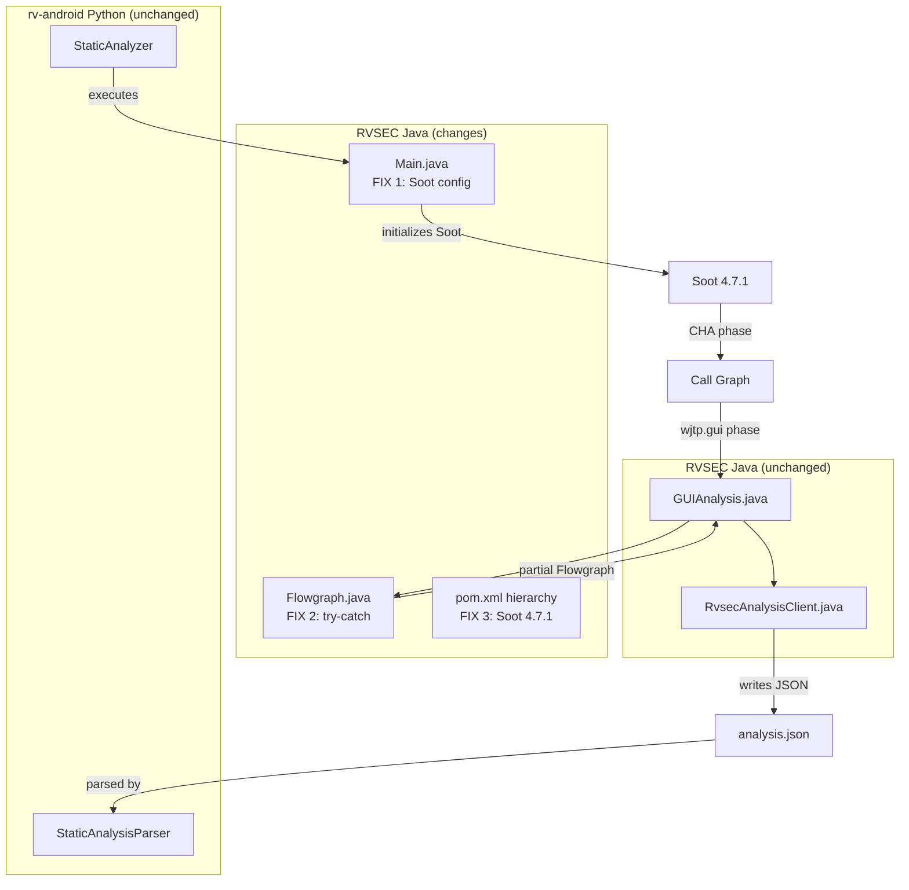

## Context

GitHub Issue: #51 | Proposal: `proposal.md` | Pre-plan: `docs/20260419_gator.md`

GATOR static analysis succeeds on 27.6% of APKs (97/352). The crash occurs in Soot 3.3.0's `ClassHierarchy.typeNode()` when processing Kotlin bytecode. The dominant crash path is during CHA call graph construction (Scenario A), before the GATOR Flowgraph executes. A secondary path (Scenario B) occurs in `Flowgraph.processApplicationClasses()`.

The fix applies three complementary layers: defensive Soot configuration (FIX 1), graceful error handling (FIX 2), and Soot version upgrade (FIX 3). All changes are in the Java GATOR codebase (`rvsec/rvsec-android/rvsec-gator/`). No Python code changes.

**Constraint**: The `ClassHierarchy.typeNode()` bug (soot-oss/soot#1071) exists in ALL Soot versions (3.3.0 through 4.7.1). The 4.x Dexpler improvements reduce crash frequency but do not eliminate it. FIX 2 is the safety net for residual crashes.

## Architecture



### Key Components

| Component | Responsibility | Change |
|-----------|---------------|--------|
| `Main.java` (sootandroid) | Soot initialization and argument setup | FIX 1: Add defensive options to `sootArgs` and `Options.v()` |
| `Flowgraph.java` (sootandroid) | GUI flowgraph construction from Jimple bodies | FIX 2: Wrap `retrieveActiveBody()` at line 274, replace throw at line 343 |
| `rvsec/pom.xml` | Parent POM with `soot.version` property | FIX 3: `4.4.1` → `4.7.1` |
| `rvsec-gator/pom.xml` + children | GATOR Soot dependency declaration | FIX 3: `ca.mcgill.sable:soot:3.3.0` → `${soot.version}` from parent |
| `rvsec-gator/client/pom.xml` | Fat JAR assembly with Soot exclusions | FIX 3: Remove exclusion (no more groupId conflict) |
| `Configs.java` (sootandroid) | Soot Options API calls | FIX 3: Fix API breaks if `set_force_android_jar()` / `set_src_prec()` changed |
| `EpiccBasedIntentAnalysis.java` (sootandroid) | Intent analysis using `soot.dexpler.Util` | FIX 3: Fix if `Util.splitParameters()` / `Util.getType()` removed in 4.x |

## Mapping: Spec → Implementation → Test

| Requirement / Invariant | Implementation | Test |
|--------------------------|---------------|------|
| INV-ANA-16 (defensive Soot options) | `Main.java:204-232` — add to sootArgs + Options.v() | Smoke test: 10 APKs that crash → verify JSON produced |
| INV-ANA-17 (Flowgraph graceful degradation) | `Flowgraph.java:274` (try-catch), `Flowgraph.java:343` (continue) | Smoke test: APKs that crash in Flowgraph → verify partial JSON |
| INV-ANA-18 (Soot 4.7.1 unified) | 5 pom.xml files | `mvn clean compile` succeeds |
| Scenario: CHA crash | No code change — crash is prevented by FIX 1 + FIX 3 | Smoke test: APKs that previously crashed |
| Scenario: Flowgraph skips method | `Flowgraph.java:274` | Smoke test: verify JSON has reachability data |
| Scenario: Kotlin exclusion impact | `Main.java` excludes | Compare reachability counts before/after for Java-pure APK |
| Scenario: Output equivalence | All fixes combined | `cryptoapp.apk` baseline comparison |

## Goals / Non-Goals

**Goals:**
- Increase SA success rate from 27.6% to ≥50% (target: 50-70%)
- Unify Soot version across RVSEC (eliminate `ca.mcgill.sable` dependency)
- Produce partial analysis data when individual methods fail

**Non-Goals:**
- Fix the `ClassHierarchy.typeNode()` bug in Soot itself (upstream, unfixed since 2018)
- Modify the Python-side `StaticAnalyzer` or `StaticAnalysisParser`
- Implement Androguard fallback (separate future change if needed)
- Upgrade FlowDroid version (evaluate after Soot upgrade; only if `rvsec-apk` breaks)
- Modify `RvsecAnalysisClient.java` (unchanged — it already writes JSON incrementally)

## Decisions

### D1: Soot 4.7.1 (not 4.6.0, not SootUp)

**Choice**: `org.soot-oss:soot:4.7.1` (Feb 2025, latest stable)

**Alternatives considered**:
- **4.6.0** (validated empirically via CryptoAnalysis): Works, but 4.7.1 includes additional Dexpler fixes and a build fix over 4.7.0
- **SootUp 2.0**: Incompatible API, incomplete Android APK support, would require full GATOR rewrite. Not viable in thesis timeline
- **Patch ClassHierarchy.typeNode()**: Would require forking Soot, maintaining a custom build. Disproportionate effort for a workaround

**Rationale**: 4.7.1 is the closest to the empirically validated 4.6.0, with incremental improvements. The API core (`Scene.v()`, `SootClass`, `SootMethod`, etc.) is preserved from 3.x to 4.x.

### D2: Exclude `kotlin.*`/`kotlinx.*` but NOT `android.*`/`androidx.*`

**Choice**: Exclude Kotlin stdlib from body loading; keep Android framework bodies.

**Rationale**: GATOR needs Android framework bodies to analyze widgets and listeners (`findViewById`, `setOnClickListener`, etc.). CryptoAnalysis/FlowDroid exclude `android.*` because they do taint analysis, not GUI analysis. For JCA specifications, excluding Kotlin stdlib has minimal impact (JCA APIs are in `javax.crypto.*`/`java.security.*`, called by app code). For generic specs (Iterator, Map), some reachability through Kotlin stdlib may be lost — acceptable trade-off.

### D3: FIX 2 scope — Flowgraph only, not RvsecAnalysisClient

**Choice**: Add try-catch in `Flowgraph.processApplicationClasses()` only. Do not modify `RvsecAnalysisClient.run()`.

**Rationale**: The `RvsecAnalysisClient` already writes JSON incrementally with flush between sections. If the Flowgraph completes (even partially), `RvsecAnalysisClient.run()` will produce JSON. Adding try-catch inside `RvsecAnalysisClient` would mask failures in the WTG construction pipeline, which is a different problem. Keep changes minimal (P1).

### D4: Deprecated modules commented out before upgrade

**Choice**: Comment out `rvsec-methods-extractor` and `rvsec-taint` in `rvsec-android/pom.xml` before attempting the Soot upgrade.

**Rationale**: These modules have zero references from Python code (confirmed in pre-plan §7.1). Commenting them out reduces the compilation surface — any API breaks in these modules are irrelevant. Only `rvsec-gator`, `rvsec-apk`, and `rvsec-frame-computer` need to compile.

## Data Flow

No change to data flow. The existing pipeline is preserved:

```
APK → StaticAnalyzer (Python) → GATOR process (Java) → analysis.json → StaticAnalysisParser → StaticAnalysisData
```

The change affects the GATOR process internally (Soot configuration, error handling, Soot version). Input and output formats are unchanged.

## Error Handling

| Error | Source | Strategy | Recovery |
|-------|--------|----------|----------|
| `InternalTypingException` during CHA | `CHATransformer` via `retrieveActiveBody()` | FIX 1 (excludes, disabled sub-phases) + FIX 3 (Soot 4.7.1 Dexpler) reduce frequency | No recovery — GATOR process dies. SA fails for this APK |
| `InternalTypingException` in Flowgraph | `Flowgraph.processApplicationClasses()` line 274 | FIX 2: try-catch → log + continue | Partial Flowgraph; JSON produced with incomplete WTG |
| Exception in `createOpNode()` | `Flowgraph.processApplicationClasses()` line 343 | FIX 2: catch → log + continue (replaces throw) | Missing OpNode for that statement; loop continues |
| API break during compilation | Soot 3.3.0 → 4.7.1 API changes | Fix compilation errors in `Configs.java`, `EpiccBasedIntentAnalysis.java` | Adjust API calls to 4.x equivalents |
| FlowDroid 2.10.0 incompatibility | `rvsec-apk` transitively pulls Soot ~4.3.0 | Maven nearest-definition resolves to 4.7.1 | If broken: upgrade FlowDroid to 2.14.1 or 2.15.1 |

## Risks / Trade-offs

| Risk | Probability | Mitigation |
|------|-------------|------------|
| API breaks in `Configs.java` (`Options.v().set_*()`) | High | Compile-and-fix; Options API mostly stable, setters may be renamed |
| API breaks in `EpiccBasedIntentAnalysis.java` (`soot.dexpler.Util`) | Medium | If `Util.splitParameters()` removed, rewrite with standard string parsing |
| `SootClass.getMethods()` returns `List` instead of `Chain` | Medium | Code already uses `Lists.newArrayList()` defensively |
| FlowDroid 2.10.0 + Soot 4.7.1 incompatibility in `rvsec-apk` | Medium | Test compilation; if broken, upgrade FlowDroid to 2.14.1 |
| Soot 4.7.1 still crashes on some APKs (bug not fixed upstream) | Medium | FIX 2 catches Flowgraph crashes; CHA crashes remain fatal |
| Kotlin exclusion loses reachability for generic specs | Low (JCA) / Medium (generic) | Acceptable for JCA (thesis focus); document trade-off for generic |
| Regression in 97 APKs that currently work | Low | Baseline comparison: `cryptoapp.apk` directlyReachesMop must be exact |
| Guava/SLF4J version conflicts | Low | Verify `mvn dependency:tree`; align in parent pom if needed |

**Rollback plan**: Work in branch `gh51-gator-soot47`. FIX 1, FIX 2, FIX 3 in separate commits. If FIX 3 causes regressions, revert FIX 3 and keep FIX 1 + FIX 2. Preserve current `rvsec-analysis-client.jar` as backup before rebuild.

## Testing Strategy

| Layer | What to test | How | Count |
|-------|-------------|-----|-------|
| Compilation | All active Java modules compile | `mvn clean compile` | 1 run |
| Smoke (crash) | 10 APKs that previously crashed produce JSON | Run GATOR directly on each APK | 10 APKs |
| Smoke (regression) | 10 APKs that currently work still produce JSON | Run GATOR directly on each APK | 10 APKs |
| Baseline | `cryptoapp.apk` output matches baseline | Compare JSON field counts | 1 APK |
| Fat JAR | `rvsec-analysis-client.jar` runs without classpath errors | Execute via `rv-experiment` on 1 APK | 1 APK |

**Success criteria**: ≥7/10 previously-failing APKs produce JSON AND ≤5 regressions among the 97 that currently work.

## Open Questions

1. **FlowDroid version**: If `rvsec-apk` fails to compile with Soot 4.7.1, should we upgrade FlowDroid to 2.14.1 (validated with CryptoAnalysis) or 2.15.1 (latest stable)?
2. **`all-reachable:true`**: Should we disable this CHA flag to reduce crash surface? The `RvsecAnalysisClient` already uses explicit entry points for BFS.
