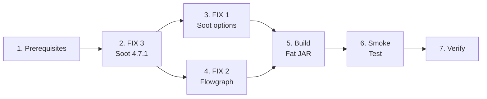

<!-- Subagent dispatch: NOT needed (Java changes only, ~10 files, sequential dependency). -->

## 1. Prerequisites — Comment Out Deprecated Modules

- [ ] 1.1 Comment out `rvsec-methods-extractor` module in `rvsec/rvsec-android/pom.xml`
- [ ] 1.2 Comment out `rvsec-taint` module in `rvsec/rvsec-android/pom.xml`
- [ ] 1.3 Verify `mvn clean compile -pl rvsec-gator -am` still works with current Soot 3.3.0

## 2. FIX 3 — Soot Version Upgrade (INV-ANA-18)

- [ ] 2.1 Update `rvsec/pom.xml` (artifactId=`rvsec-parent`, line 38): `<soot.version>4.4.1</soot.version>` → `<soot.version>4.7.1</soot.version>`
- [ ] 2.2 Update `rvsec-gator/pom.xml`: remove `<gator.soot.version>3.3.0</gator.soot.version>`, replace `ca.mcgill.sable:soot:${gator.soot.version}` with `org.soot-oss:soot:${soot.version}`
- [ ] 2.3 Update `rvsec-gator/sootandroid/pom.xml`: same groupId/version change if Soot is redeclared
- [ ] 2.4 Update `rvsec-gator/commons/pom.xml`: same change if Soot is declared
- [ ] 2.5 Update `rvsec-gator/client/pom.xml`: remove `org.soot-oss:soot` exclusion from `rvsec-mop-extractor` dependency (lines 43-51; the `ca.mcgill.sable:soot` exclusion can also be removed since that groupId is no longer used)
- [ ] 2.6 Run `mvn clean compile -pl rvsec-gator -am` — list all compilation errors
- [ ] 2.7 Fix API breaks in `Configs.java` (`Options.v().set_force_android_jar()`, `set_src_prec()` — lines 235-237)
- [ ] 2.8 Fix API breaks in `EpiccBasedIntentAnalysis.java` (`gui/clients/ata/EpiccBasedIntentAnalysis.java` — `soot.dexpler.Util.splitParameters()`, `Util.getType()` — lines 125-128)
- [ ] 2.9 Fix any remaining compilation errors found in 2.6
- [ ] 2.10 Verify `mvn clean compile -pl rvsec-gator -am` succeeds
- [ ] 2.11 Run `mvn dependency:tree -pl rvsec-gator/client` — verify no Guava/SLF4J version conflicts
- [ ] 2.12 Verify `mvn clean compile -pl rvsec-apk` succeeds (FlowDroid 2.10.0 + Soot 4.7.1 compile compatibility)
- [ ] 2.13 Runtime smoke test: execute `rvsec-apk` on 1 APK to detect `NoSuchMethodError` (compile ≠ runtime)
- [ ] 2.14 If 2.12 or 2.13 fails: upgrade FlowDroid to 2.14.1 (validated with CryptoAnalysis) or 2.15.1 (both confirmed on Maven Central)
- [ ] 2.15 **Git commit**: FIX 3 checkpoint (Soot upgrade + dependency changes)

## 3. FIX 1 — Soot Defensive Options (INV-ANA-16)

- [ ] 3.1 In `Main.java`, add to `sootArgs` array (both `withCHA` and non-CHA branches): `"-p", "jb.sils", "enabled:false"`, `"-p", "jb.dae", "enabled:false"`, `"-no-bodies-for-excluded"`, `"-exclude", "kotlin."`, `"-exclude", "kotlinx."`, `"-exclude", "androidx.compose."`
- [ ] 3.2 In `Main.java`, add programmatically before `soot.Main.main()`: `Options.v().set_ignore_resolution_errors(true)` and `Options.v().set_throw_analysis(Options.throw_analysis_dalvik)`
- [ ] 3.3 Verify compilation: `mvn clean compile -pl rvsec-gator/sootandroid`
- [ ] 3.4 **Git commit**: FIX 1 checkpoint (defensive Soot options)

## 4. FIX 2 — Flowgraph Graceful Degradation (INV-ANA-17)

- [ ] 4.1 In `Flowgraph.java`, wrap `Body b = currentMethod.retrieveActiveBody()` (line 274) in try-catch with `Logger.warn()` warning (method signature + exception message) and `continue`. Move `numMtd += 1` (line 273) to AFTER the `retrieveActiveBody()` call so skipped methods are not counted
- [ ] 4.2 In `Flowgraph.java`, replace `throw new RuntimeException(e)` (line 343) with `Logger.warn()` warning (statement + exception message) and `continue`
- [ ] 4.3 Verify compilation: `mvn clean compile -pl rvsec-gator/sootandroid`
- [ ] 4.4 **Git commit**: FIX 2 checkpoint (Flowgraph graceful degradation)

## 5. Build Fat JAR

- [ ] 5.1 Build `rvsec-analysis-client.jar`: `mvn clean package -pl rvsec-gator/client -am -DskipTests`
- [ ] 5.2 Copy new JAR to `rv-android/lib/gator/rvsec-analysis-client.jar`
- [ ] 5.3 Verify JAR size is reasonable (old: ~50MB; new should be similar or larger with unified Soot)

## 6. Smoke Test

- [ ] 6.1 Backup current `rvsec-analysis-client.jar` to `backup/`
- [ ] 6.2 **Isolation experiment** (validates if FIX 3 is necessary): In a separate branch (or before merging task 2), apply ONLY FIX 1 defensive options to `Main.java` while keeping Soot 3.3.0, build JAR, and run on 5 APKs from the JCA SA-failure list (`flip_2_dnd`, `totalrecall`, `calcyou`, `ttsengine`, `tictactoe`). If ≥3/5 produce JSON, FIX 3 may be optional (document results for thesis). NOTE: this experiment must run before or in parallel with FIX 3, not after it
- [ ] 6.3 Run GATOR with full fixes (FIX 1+2+3) on 10 APKs from JCA dataset (gh50) that are instrumented OK but SA fails:
  - `dev.robin.flip_2_dnd_903.apk`
  - `com.qq7te.totalrecall_8.apk`
  - `net.youapps.calcyou_10.apk`
  - `org.woheller69.ttsengine_31.apk`
  - `com.itsfrz.tictactoe_2.apk`
  - `com.github.girator.rebooter_14.apk`
  - `gizz.tapes.foss_63.apk`
  - `com.iyox.wormhole_5013.apk`
  - `org.librefit.app_10501.apk`
  - `io.github.dorumrr.happytaxes_10.apk`
  Source: `APKS_JCA/errors/instrument_and_sa_errors.json` (32 total inst OK + SA failed)
- [ ] 6.4 Record which produce JSON — success criterion: ≥7/10
- [ ] 6.5 Run GATOR on 10 APKs that currently work (including `cryptoapp.apk` baseline) — success criterion: ≤1 regression
- [ ] 6.6 Compare `cryptoapp.apk` output against baseline: `directlyReachesMop` must match exactly, `reachable`/`reachesMop` within ±10%
- [ ] 6.7 Run Fat JAR via `rv-experiment` on the same 10 previously-crashing APKs (E2E pipeline validation)

## 7. Verification

- [ ] 7.1 Run `mvn clean compile` on all active RVSEC modules (`rvsec-gator`, `rvsec-apk`, `rvsec-frame-computer`)
- [ ] 7.2 Run full SA via `rv-experiment` on 1 APK to verify end-to-end pipeline (Python wrapper → GATOR → JSON → parser)
- [ ] 7.3 Document results: number of new APKs analyzed, any regressions, any API changes made
