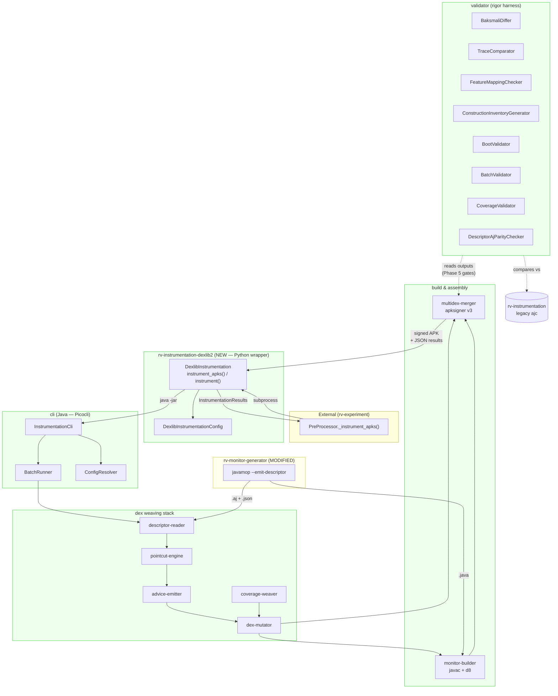
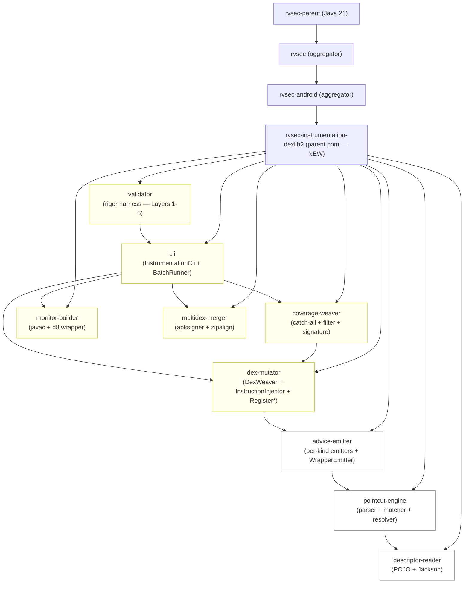
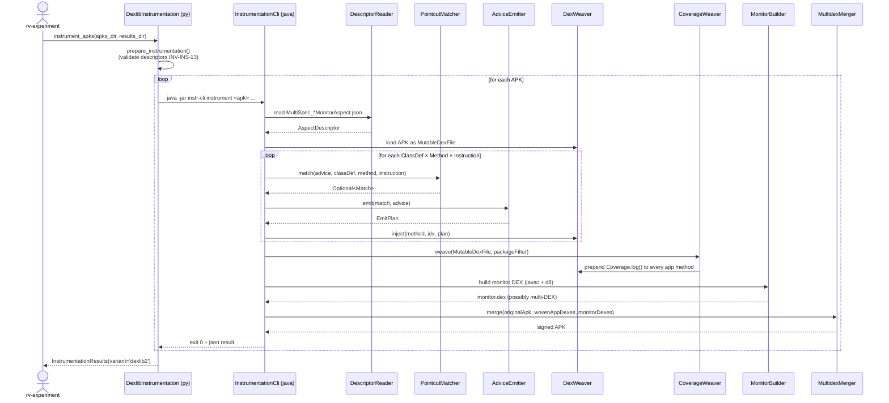
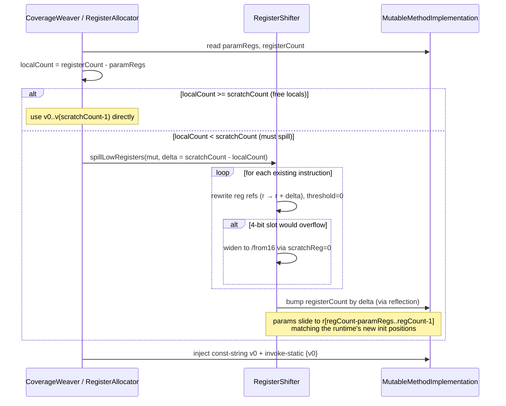

# Design — DEX-native instrumentation pipeline (dexlib2)

GitHub Issue: #52 — Change: `gh52-instr-dexlib2` — Branch: `gh52-instr-dexlib2` (from `modules`)

## Context

The current `rv-instrumentation` module weaves AspectJ aspects over Java bytecode via `dex2jar → ajc → d8`. The diagnostic in `docs/20260421_problema_dex2jar.md` proves this round-trip is structurally irreparable for R8-optimized DEX bytecode under JVMS §4.10.1.9. The `proposal.md` (Phase 2) and the modified `instrumentation` capability spec (Phase 2) establish what changes; this design document describes how.

The new pipeline is a Maven multi-module Java project that operates exclusively on DEX bytecode using `dexlib2`. The prototype `prototipo-dexlib2` validated the thesis end-to-end, but its `DexWeaver` class collapses parsing, matching, register allocation, and injection into one ~3400-LOC class — fine for prototyping, unfit for production. The design refactors that monolith into single-responsibility components that can be tested and extended independently. It also operationalizes the 6-layer validation framework from `docs/20260423_plano_validacao.md` as a runnable `validator/` submodule, because paper reviewers will scrutinize the equivalence of the substitution and require evidence that no AspectJ construct used in production is silently dropped.

The change strategy is coexistence-then-substitution. Phase 4 stands up the new module alongside the legacy ajc pipeline. Phase 5 runs both in parallel on the JCA-400 dataset and gates the substitution on five quantitative thresholds. Phase 6 quarantines the legacy implementation to `backup/` per Development Principle P3 and switches the default variant. Throughout, the Python public API `instrument_apks(apks_dir, results_dir) → InstrumentationResults` is preserved so that consumers (`rv-experiment`, `rv-platform`) need no changes.

References: PRD `FR-INS-01..03`, `NFR-INS-*`, `NFR-REP-*`. Insumos: `docs/20260421_problema_dex2jar.md`, `docs/20260422_lspatch.md`, `docs/20260423_javamop.md`, `docs/20260423_plano_prototipo.md`, `docs/20260423_plano_validacao.md`, prototype at `workspace-rv/prototipo-dexlib2/`.

## Architecture

### High-level component view



### Maven multi-module layout



### Key Components

| Component | Responsibility | Input | Output |
|-----------|---------------|-------|--------|
| `descriptor-reader.DescriptorReader` | Parse JSON descriptor → POJO model | `Path descriptorJson` | `AspectDescriptor` |
| `pointcut-engine.PointcutExpressionParser` | Parse textual pointcut expression → typed AST | `String expression` | `PointcutExpression` |
| `pointcut-engine.TypeResolver` | Map simple type name + imports → DEX type descriptor | `String simpleName, List<String> imports` | `String dexType` (e.g., `Ljavax/crypto/Cipher;`) |
| `pointcut-engine.AndroidClassIndex` | ASM index of `android.jar`; expand `X+` and `..` overloads | `String classFqn, String methodName` | `List<MethodSignature>` |
| `pointcut-engine.InheritanceResolver` | `X+` semantics across `android.jar` + APK classes | `String parentType, DexFile apk` | `Set<String> concreteSubtypes` |
| `pointcut-engine.PointcutMatcher` | Match `PointcutExpression` against a DEX class+method+instruction | `PointcutExpression, ClassDef, Method, Instruction` | `Optional<Match>` (with arg bindings) |
| `advice-emitter.BeforeEmitter` etc. | Build instruction list to inject for one advice kind | `Match, AdviceDescriptor` | `EmitPlan` |
| `advice-emitter.WrapperEmitter` | Generate `mop.MonitorWrappers.java` for register-aliasing-safe replacement | `List<AdviceDescriptor>` | `Path wrappersJava` + `Map<MethodRef, MethodRef>` rewrites |
| `dex-mutator.InstructionInjector` | Primitive: insertBefore/insertAfter/replaceInvoke on `MutableMethodImplementation` | `MutableMethodImplementation, int idx, EmitPlan` | (mutates in-place) |
| `dex-mutator.RegisterAllocator` | Decide scratch registers; coordinate with shifter | `Method, EmitPlan` | `RegisterAllocation` |
| `dex-mutator.RegisterShifter` | Bump `registerCount` + shift refs ≥ threshold; expand 4-bit overflows | `MutableMethodImplementation, int delta, int threshold` | (mutates in-place; expanded format) |
| `dex-mutator.DexWeaver` | Orchestrate ClassDef/Method iteration; apply emitters | `DexFile, AspectDescriptor` | `MutableDexFile` |
| `coverage-weaver.CoverageWeaver` | Inject `mop.Coverage.log(sig)` at every app-code method entry | `DexFile` | `MutableDexFile` |
| `coverage-weaver.PackageFilter` | Canonical exclusion (java/, android/, kotlin/, mop/, ...) | `String classDescriptor` | `boolean excluded` |
| `coverage-weaver.SignatureFormatter` | Soot-style `<FQN: ReturnType method(params)>` | `ClassDef, Method` | `String signature` |
| `monitor-builder.MonitorBuilder` | javac → `.class` → d8 → `.dex` for monitor + wrappers | `List<Path> sources, List<Path> deps, Path out` | `Path monitorDex` (possibly multidex) |
| `multidex-merger.MultidexMerger` | Replace/add DEX entries in APK + zipalign + apksigner | `Path inputApk, Map<String,Path> dexEntries, Path keystore` | `Path signedApk` |
| `cli.InstrumentationCli` | Picocli entry: `instrument <apk> -d <descriptor> -o <out> [--coverage]` | CLI args | exit 0 / signed APK |
| `cli.BatchRunner` | Iterate over apks_dir; emit `InstrumentationResults` JSON | `Path apksDir, Path resultsDir, Path descriptor` | `Path resultsJson` |
| `cli.ConfigResolver` | Resolve effective config: CLI > env > file > defaults | (CLI/env/file inputs) | `EffectiveConfig` |
| `validator.BaksmaliDiffer` | Diff hooks between ajc-instrumented and dexlib2-instrumented APK | 2 APKs | `Layer1Report` (per-spec recall) |
| `validator.TraceComparator` | Diff RV / RVSEC / RVSEC-COV events captured during paired runs | 2 logcat files + oracle | `Layer3Report` (F1, kappa) |
| `validator.FeatureMappingChecker` | Enforce INV-INS-17 (every inventory construct has test or limitation entry) | inventory.md, mapping.md, limitations.md, validator/test/ | `MappingReport` |
| `validator.ConstructionInventoryGenerator` | Generate `AJ_CONSTRUCTIONS_INVENTORY.md` from .mop / .aj corpus | `Path rvsecMopRoot` | `inventory.md` |
| `validator.BootValidator` | adb install + monkey + logcat parse for `VerifyError` | `Path apk, String pkg, int seconds` | `Layer2Report` |
| `validator.BatchValidator` | Orchestrate JCA-400 × 3 tools × 3 reps via Docker; compute Wilcoxon signed-rank TOST per spec against pre-registered Δ bounds (INV-INS-21) | `Path apksDir, ToolList, int reps` | `Layer4Report` (per-spec TOST p-values, point estimates, 90% CI, effect size) |
| `validator.MethodRefAuditor` | Layer-4 preflight: project post-weaving method-ref counts per DEX; gate batch on no unhandled overflow (INV-INS-25) | `Path apksDir, Path descriptor` | `Layer4PreAuditReport` |
| `validator.OracleLoader` | Load ≥3 oracle YAMLs (INV-INS-22) and feed them into `TraceComparator`; fail-fast if fewer than 3 present | `Path oraclesDir` | `List<Oracle>` |
| `validator.CoverageValidator` | Compare RVSEC-COV recall between variants | 2 logcat files | `Layer5Report` |
| `validator.DescriptorAjParityChecker` | Assert JSON descriptor mirrors `.aj` semantically (INV-INS-19) | `MultiSpec_*MonitorAspect.{aj,json}` pair | `ParityReport` |
| `rv-instrumentation-dexlib2.DexlibInstrumentation` (Python, at `rv-android/modules/rv-instrumentation-dexlib2/`) | Python wrapper preserving `instrument_apks` contract; shells out to the Java CLI jar copied to `lib/instr-cli.jar` | `apks_dir, results_dir` | `InstrumentationResults` |

## Mapping: Spec → Implementation → Test

| Requirement / Invariant | Implementation | Test |
|---|---|---|
| **DEX-Native APK Instrumentation Pipeline** | `cli.InstrumentationCli` + entire weaving stack | `cli/src/test/it/InstrumentationCliIT` (cryptoapp + hateitorrateit) |
| **Instrumentation Variant Selection** | `rv-experiment.PreProcessor._instrument_apks()` dispatch | `rv-experiment/tests/test_pre_processor_variant.py` |
| **JavaMOP Descriptor Format and Emission** | `rvsec/javamop` `--emit-descriptor` (commit 79547700 + 2 mods) + `descriptor-reader.AspectDescriptor` schema | `descriptor-reader/src/test/DescriptorReaderTest` + `validator.DescriptorAjParityChecker` |
| **Validator Harness for Layered Equivalence Gates** | `validator/` submodule + 6 CLI subcommands | `validator/src/test/{Layer1..Layer5}IT` |
| **AspectJ-to-Dexlib2 Mapping Documentation** | `docs/AJ_CONSTRUCTIONS_INVENTORY.md`, `AJ_TO_DEXLIB2_MAPPING.md`, `LIMITATIONS.md` + `validator.FeatureMappingChecker` | `validator/src/test/FeatureMappingCheckerTest` |
| **MODIFIED: Monitor Generation** (descriptor emission) | `rv-monitor-generator.RuntimeVerificationGenerator` invokes `javamop --emit-descriptor` by default | `rv-monitor-generator/tests/test_descriptor_emission.py` |
| INV-INS-13 (descriptor presence at preparation time) | `DexlibInstrumentation.prepare_instrumentation()` | `tests/test_prepare_missing_descriptor.py` |
| INV-INS-14 (variant-conditional conformance to INV-INS-01..12) | legacy `RVInstrumentation` unchanged for `ajc`; `DexlibInstrumentation` preserves tool-agnostic invariants (INV-INS-06/08/09); INV-INS-10 (signing) satisfied by `apksigner v3` alone in `multidex-merger`; INV-INS-11 (dex2jar tool check) replaced by dexlib2-specific validator asserting `apksigner` / `zipalign` / `d8` are executable | regression matrix in CI + `DexlibInstrumentationConfig` validator tests |
| INV-INS-15 (multidex preservation) | `dex-mutator.DexWeaver.weaveDexFile()` per-DEX iteration | `dex-mutator/src/test/MultidexPreservationTest` |
| INV-INS-16 (4-bit overflow expansion preserves coverage) | `dex-mutator.RegisterShifter.expand4BitOverflow()` | `dex-mutator/src/test/RegisterShifterTest` |
| INV-INS-17 (every construct mapped or limitation-justified) | `validator.FeatureMappingChecker` | `validator/src/test/FeatureMappingCheckerTest` |
| INV-INS-18 (API parity across variants) | `DexlibInstrumentation` mirrors `RVInstrumentation` signature | `tests/test_api_parity.py` (parametrized over both classes) |
| INV-INS-19 (descriptor mirrors .aj semantically) | `validator.DescriptorAjParityChecker` (Layer 1 sub-check) | `validator/src/test/DescriptorAjParityTest` |
| INV-INS-20 (per-experiment variant selection) | dispatch in `PreProcessor`; `InstrumentationResults.variant` recorded | `rv-experiment/tests/test_variant_isolation.py` |
| INV-INS-21 (Wilcoxon TOST equivalence + non-inferiority gate) | `validator.BatchValidator` statistical engine + `validator/oracles/layer4-thresholds.yaml` (pre-registered Δ bounds) | `validator/src/test/Layer4TOSTTest` (synthetic paired samples crossing Δ) + `git log` audit of thresholds commit preceding any batch run |
| INV-INS-22 (≥3 oracle profiles before equivalence claim) | `validator.TraceComparator` loads multiple oracle YAMLs from `validator/oracles/*-oracle.yaml`; gate fails with <3 oracles for Phase-5 ratification | `validator/src/test/OracleDiversityTest` + 3 YAML fixtures (cryptoapp, hateitorrateit, multidex candidate) committed before Layer-3 |
| INV-INS-23 (thread-safe Coverage runtime state) | generated `mop.Coverage` class emitted with `ConcurrentHashMap.newKeySet()` by `monitor-builder` (or coverage-weaver's Coverage emitter, wherever the source lives) | `coverage-weaver/src/test/CoverageThreadSafetyTest` — ≥4-thread entry fuzz with exact logcat reconciliation |
| INV-INS-24 (Kotlin `suspend` pointcut matching inside `invokeSuspend`) | `pointcut-engine.PointcutMatcher` extended with a CPS-aware resolution pass that recognizes Kotlin state-machine classes and matches pointcuts against their lowered call sites | `advice-emitter/src/test/KotlinSuspendFixtureTest` (direct-suspend-invoke + continuation-captured cases); unmatched patterns go into `LIMITATIONS.md` |
| INV-INS-25 (pre-batch 64k method-ref audit) | `validator.MethodRefAuditor` (Layer-4 preflight) projects post-weaving ref counts per DEX; gates the batch on no unhandled overflow | `validator/src/test/MethodRefAuditorTest` (synthetic DEX at 64,900 refs + monitor projection) + integration test over 10-APK JCA-400 sample |
| INV-INS-26 (calling-convention-safe scratch register allocation) | `dex-mutator.RegisterShifter.spillLowRegisters` (canonical shift+bump), consumed by `coverage-weaver.CoverageWeaver` and (pending — INV-INS-26 follow-up in tasks.md §5.4) by `dex-mutator.RegisterAllocator` | cli-level smoke installs woven cryptoapp on emulator without `VerifyError` (proxied via `validator layer2`); unit-level `coverage-weaver/src/test/SpillStrategyTest` covers free-locals + shift+bump branches over synthetic methods |
| INV-INS-27 (advice insertion past `move-result*`) | `advice-emitter` and `dex-mutator.InstructionInjector` MUST detect when the matched invoke is followed by `move-result*` and insert the advice's monitor invoke past the move-result, not before it; bug surfaced in gh52 cryptoapp smoke against `androidx.core.util.Preconditions.checkArgument` | `advice-emitter/src/test/MoveResultGuardTest` (synthetic match contexts) + cli-level smoke install/boot of cryptoapp; reproducer canonical in tasks.md §5.4 |
| INV-INS-28 (static-call args binding) | `pointcut-engine.PointcutMatcher.buildCallMatch` derives `baseOffset` from the matched invoke's actual opcode (`invoke-static*` → 0; non-static → 1), not a stub heuristic | `pointcut-engine/src/test/StaticInvokeBindingTest` (synthetic invoke instructions covering static / virtual / direct / constructor) |
| INV-INS-29 (after-side aliasing routes through wrapper) | `advice-emitter.WrapperEmitter` generates `mop/MonitorWrappers.java` and returns entries; `dex-mutator.DexWeaver` walks `INVOKE_STATIC` instructions in pass 1 (size-stable) and rewrites refs to wrappers via `InstructionInjector.replaceInvoke`; pass 2 emits inline advice right-to-left for non-substituted call sites; `MonitorBuilder` dexes the runtime support jars alongside the compiled monitor sources | `dex-mutator/src/test/WrapperSubstitutionTest` + cli-level smoke against cryptoapp must show ≥50 wrappersSubstituted across woven DEXes and zero `VerifyError` |
| INV-INS-30 (binding resolution by name) | `advice-emitter.MonitorInvokeBuilder.registersFor` parses `target(name)` / `args(n1, n2, ...)` / `returning(name)` / `throwing(name)` from the expression and maps advice parameter names → registers; both `registersFor` AND `buildMethodReference` walk `monitorCall.args` order (not advice declaration order) | `advice-emitter/src/test/MonitorInvokeBindingTest` covering the four binding clauses + their cross-products; cli-level smoke must produce zero `VerifyError` after weave |
| INV-INS-31 (instance-method wrappers via android.jar overload enumeration + APK subtype-dispatch aliasing) | Phase 1: `advice-emitter.WrapperEmitter.expandCallTarget` calls `AndroidClassIndex.methods(declFqn, name, /*onlyStatic=*/false)` to enumerate concrete overloads (porting prototipo's `expandSupertypes`), filters by arity / `T+` / trailing `..` / literal patterns, emits one wrapper per overload; instance entries take the receiver as the first wrapper parameter and call `recv.<method>(...)`; `WrapperEntry.isStatic` carries the verdict; `dex-mutator.DexWeaver.registerWrapper` prepends the receiver descriptor to the wrapper's DEX `MethodReference` for instance entries while keeping the lookup key on the original signature; `findWrapperReplacement` accepts every invoke opcode (not only `INVOKE_STATIC`); `BatchRunner` threads `androidIndex` into `WrapperEmitter.generate(descriptor, outputDir, androidIndex)`. Phase 2: `dex-mutator.DexWeaver.expandWrapperReplacementsForApk(InheritanceResolver)` walks each instance wrapper's `subtypesOf(parentFqn)` and registers extra lookup keys aliased to the SAME wrapper `MethodReference` (so a call site dispatched through an APK-internal subtype still resolves to the parent's wrapper); static wrappers are NOT expanded; `BatchRunner` builds one multi-DEX `InheritanceResolver` across `classes*.dex` and calls the expansion once before weaving; `WeaveReport.wrappersAliasedToSubtype` records the alias count | Phase 1: `advice-emitter/src/test/WrapperEmitterTest` (4 cases — static expansion, instance expansion + recv body, trailing-`..` overload enumeration, null-`AndroidClassIndex` fallback). Phase 2: `dex-mutator/src/test/DexWeaverWrapperSubtypeTest` (2 cases — instance wrapper aliased to synthetic subtype; static wrapper skipped). Smoke gate: `plansSkippedAliasing` strictly decreasing without new `VerifyError` (note: on the gh52_smoke5_newdata set, Phase 2 alias count is 0 because no APK declares JCA subtypes — residual 48 alias sites trace to constructor advice and unenumerated overloads, both INV-INS-31 follow-ups) |

## Goals / Non-Goals

**Goals:**
- Eliminate the JVM round-trip that causes `VerifyError` on R8-optimized APKs.
- Recover ≥30% of the JCA-400 dataset that currently fails silently (boot success and event emission).
- Preserve the Python public contract (`instrument_apks`) so consumers need no changes.
- Make every AspectJ construct used in production *provably* mapped to a dexlib2 mechanism, with the rest *provably* out of scope (paper-grade defense).
- Keep instrumentation overhead at or below historical baseline (~25.9%).
- Make the substitution reversible during validation via the variant flag.

**Non-Goals:**
- Implementing AspectJ constructs unused in our corpus (canonical 8: `around`, `cflow`, `cflowbelow`, `handler`, `get`, `set`, `initialization`, `preinitialization`). Empirical evidence (zero usages) is documented in `LIMITATIONS.md`.
- Redesigning the monitor state machines (those live in JavaMOP/RV-Monitor; this change only changes how their hook points are reached at runtime).
- Improving exploration tooling (UI tools / record-and-replay) — orthogonal, tracked in `docs/20260421_exploration_strategy_analysis.md`.
- Source-build comparison from F-Droid (deferred per investigation docs; would be a separate sub-experiment).
- LSPatch / Xposed integration — explicitly rejected in `docs/20260422_lspatch.md` due to the Coverage scalability gap.

## Decisions

### D1: Java Maven multi-module, not single jar

**Choice:** Decompose into 9 submodules with single responsibility.

**Why:** The prototype's monolithic `DexWeaver` (~3400 LOC) mixes parsing, matching, register allocation, and DEX mutation. Single-responsibility submodules make components testable in isolation, replaceable independently (e.g., swap `pointcut-engine` for an ANTLR-based parser later), and verifiable as a graph (no module knows more than its inputs). This pays off most clearly in `validator/`, which must be auditable separately from `dex-mutator`.

**Module dependency direction (no cycles):** `descriptor-reader` is a pure POJO module with no dependencies; `pointcut-engine` depends on `descriptor-reader` only; `advice-emitter` depends on `pointcut-engine` and on `dexlib2` directly (not on `dex-mutator`) — it owns the value classes `EmitPlan` and `RegisterRequest` that describe what to inject and what registers it needs; `dex-mutator` depends on `advice-emitter` (and consumes its `EmitPlan` values via `InstructionInjector`); `coverage-weaver` depends on `dex-mutator`; `cli` aggregates `dex-mutator`, `coverage-weaver`, `monitor-builder`, `multidex-merger`; `validator` depends on `cli`. This direction makes `advice-emitter` a pure planner (no DEX mutation knowledge) and `dex-mutator` the sole executor of plans — tested separately, no circular dependency, no need for an extra `*-api` stub submodule.

**Alternatives:** (a) Single `rvsec-instrumentation-dexlib2.jar` with internal packages — rejected: same monolithic problem, just inside one jar. (b) Gradle build — rejected: rvsec already uses Maven (parent `rvsec-parent`, Java 21); one build system per repo. (c) Extract a `dex-mutator-api` submodule for shared value types — rejected: would introduce a 10th submodule purely to dodge a non-existent cycle once `EmitPlan`/`RegisterRequest` live in `advice-emitter`.

### D2: Descriptor JSON, not .aj parsing

**Choice:** Add a `--emit-descriptor` flag to JavaMOP that emits structured JSON; weaver consumes only JSON.

**Why:** The investigation in `docs/20260423_javamop.md` evaluated 6 alternatives (ANTLR, AspectJ tool API, AJC internals, JavaMOP's own `aspectj.jj`, regex, hook the AST). Hooking the AST won because (a) JavaMOP already has a typed `PointCut` AST hierarchy that holds everything we need, (b) `.aj` text is generated by `toString()` calls — so a `toJSON()` mirror is the canonical inversion point, (c) parsing the textual `.aj` requires reverse-engineering format conventions and is fragile across JavaMOP versions.

**Alternatives:** Each rejected with reason in `docs/20260423_javamop.md` §5.

### D3: Coexistence + variant flag, not immediate replacement

**Choice:** Phase 4-5 keep `rv-instrumentation` (legacy ajc-based Python module) and `rv-instrumentation-dexlib2` (new Python wrapper invoking the Java jar) side by side; `instrumentation_variant` selects between them. Phase 6 quarantines the legacy.

**Why:** Layer 3 of the validation framework (`docs/20260423_plano_validacao.md`) requires *paired* execution of both pipelines on the same APK to compute F1/kappa equivalence. Without coexistence, comparison is against a frozen historical baseline rather than a live counterfactual — much weaker evidence for reviewers. Coexistence costs minimal code (one dispatch line in `PreProcessor` + one new config field) and bounded duration (Phase 5 only).

**Alternatives:** (a) Immediate replacement (P3 purist). Rejected: loses paired comparison. (b) Permanent coexistence. Rejected: violates P3, doubles maintenance.

### D4: Validator as a Maven submodule, not a sidecar script

**Choice:** `validator/` is a Maven submodule of the Java aggregator `rvsec-instrumentation-dexlib2` with a CLI per layer.

**Why:** The 6-layer validation framework needs to be runnable *and* maintainable as software, not as a collection of bash scripts. Java + Maven keeps it in the same toolchain as the weaver; a CLI per layer (BaksmaliDiffer, BootValidator, ...) keeps each layer independently runnable and testable; JSON outputs make CI gating mechanical.

**Alternatives:** Python sidecar — rejected: would re-implement DEX parsing for BaksmaliDiffer in another stack. Bash scripts — rejected: not testable.

### D5: Wrapper replacement for register-aliasing, not always-spill

**Choice:** When an `after returning` advice would alias the receiver/arg registers with the result register, generate a `mop.MonitorWrappers.<wrapper>()` static method that wraps the original call + emits the event + returns the result. Rewrite the call-site invoke to point at the wrapper.

**Why:** Always spilling registers (bumping `registerCount` and shifting all references) is correct but expensive and bloats DEX size. Wrapper replacement keeps the call site small and pushes the bookkeeping into the wrapper class (which is in `mop.*` and so doesn't affect app code coverage filters). The prototype validated this approach yields zero VerifyError and minimal DEX growth.

**Alternatives:** Always-spill (slower, bigger DEX). Skip-on-alias (silent gaps, paper-disqualifying).

### D6: JavaMOP patch carried directly on `gh52-instr-dexlib2`

**Choice:** Apply the JavaMOP `--emit-descriptor` patch directly on the change branch (cherry-pick + follow-up commit) so that the change is self-contained and Phase 4 implementation has the descriptor support immediately. The legacy `emit-descriptor` branch (which originally hosted the WIP patch) is no longer needed and can be retired.

**Pinned commits on `gh52-instr-dexlib2`:**
- `6fca1f8a` — `javamop: emit --emit-descriptor JSON alongside .aj` (cherry-picked from `79547700` on `emit-descriptor`)
- `927e78c1` — `javamop: include package + imports in --emit-descriptor JSON (refs #52)` (the 2 mods that were sitting uncommitted on `emit-descriptor`'s working tree)

**Why:** JavaMOP is vendored in the rvsec monorepo and the patch is non-invasive (one new flag, additive output, no behavior change for existing flags). Carrying the patch on the change branch keeps the change atomic — `gh52-instr-dexlib2` contains everything needed to weave with descriptors. When the change is merged into `modules`, the JavaMOP patch travels with it; future RV-Android work on `modules` consumes it transparently.

**Alternatives considered:** (a) Separate PR to `rvsec/master` first — rejected: fragments the change across two PRs and `gh52` would still need the commits cherry-picked locally to build. (b) Long-lived `emit-descriptor` branch — rejected: merge-debt, no clear ownership. (c) Upstream PR to JavaMOP main repo — rejected: out of our control.

### D7: AGP ASM API (`Instrumentation.transformClassesWith`) considered and deferred

**Choice:** Do NOT adopt the Android Gradle Plugin's official bytecode-instrumentation API (`androidComponents.onVariants { it.instrumentation.transformClassesWith(...) }` using ASM) as the primary path for this change. Remain on `dexlib2` direct-DEX mutation. AGP ASM is recorded here as a deferred alternative whose value depends on a separate sub-experiment.

**Why considered:** The AGP ASM API hooks *before* R8 and D8 run, operating on `.class` files inside the Gradle build. For APKs we build ourselves from source, it avoids the JVMS §4.10.1.9 round-trip entirely because no round-trip exists — we never leave JVM bytecode to return to it. This is the only approach that yields unambiguous ground truth against the original source, which would strengthen paper reviews that ask for reproducibility against unoptimized baselines.

**Why deferred:** (1) We instrument *third-party* APKs from F-Droid, not source we control — most JCA-400 APKs are shipped binaries, not buildable artifacts under our Gradle. Source-build coverage is a subset of the dataset, not a replacement. (2) AGP ASM does not help R8 APKs we only have as binaries (the bulk of the problem). (3) Switching the primary path now would invalidate the prototype work already committed and the patched JavaMOP descriptor contract. The right framing is: AGP ASM is a candidate *complementary* sub-experiment for the F-Droid subset with `reproducible_builds: yes`, to provide a ground-truth baseline that the `dexlib2` path is then compared against. Tracked as a post-gh52 idea; not in this change's scope.

**Alternatives (for reference):** (a) Wholesale replace dexlib2 with AGP ASM — rejected: does not apply to binary-only APKs. (b) Use AGP ASM only where source exists and dexlib2 elsewhere — possible, not pursued here because it doubles implementation surface and is orthogonal to the core claim.

### D8: Java module under `rvsec-android`, Python wrapper under `rv-android/modules/`

**Choice:** Place the Java aggregator at `rvsec/rvsec-android/rvsec-instrumentation-dexlib2/` (sibling of `rvsec-apk`, `rvsec-gator`, `rvsec-logger-logcat`) inheriting parent chain `rvsec-parent → rvsec → rvsec-android`. Place the Python wrapper at `rv-android/modules/rv-instrumentation-dexlib2/` as a uv workspace member alongside `rv-instrumentation`, `rv-monitor-generator`, etc. The two modules carry different names (`rvsec-instrumentation-dexlib2` vs `rv-instrumentation-dexlib2`) because each follows its language-tree's naming convention.

**Why:** The monorepo has two fully separate sub-projects that happen to live under the same git root: `rvsec/` is the Java/Maven tree (parent `br.unb.cic:rvsec-parent`, Java 21, aggregator modules like `rvsec-apk`, `rvsec-gator`, `rvsec-agent`), and `rv-android/` is the Python uv workspace (modules named `rv-*` like `rv-experiment`, `rv-instrumentation`). Mixing them — e.g., putting Java code under `rv-android/modules/` — breaks both: uv workspace scanning sees unfamiliar artifacts, the Maven reactor cannot find the parent chain, and CI builds diverge. The Java aggregator MUST live in the Java tree; the Python wrapper MUST live in the Python tree. Naming follows each tree's local convention (`rvsec-*` prefix in the Maven aggregator neighborhood, `rv-*` prefix in the uv workspace neighborhood).

**Why different names:** using identical names across trees is technically possible but harmful in practice — logs, error messages, stack traces, and docs would be ambiguous ("which `rv-instrumentation-dexlib2` failed?"). The `rvsec-` vs `rv-` prefix is a cheap, unambiguous disambiguator that each tree already uses consistently.

**Alternatives:** (a) Both under `rv-android/modules/` (what I initially attempted) — rejected: violates monorepo structure, breaks Maven parent chain resolution. (b) Both under `rvsec/` — rejected: Python can't be a uv workspace member there, would need a separate `pyproject.toml` with non-uv dependency resolution. (c) Same name in both trees — rejected: ambiguous in logs and docs.

### D9: Build-time fat-jar copy into the Python wrapper's `lib/` directory

**Choice:** During the Maven build of the Java `cli` submodule (Phase `package`), copy the fat jar `rvsec-instrumentation-dexlib2/cli/target/instr-cli.jar` to `rv-android/modules/rv-instrumentation-dexlib2/lib/instr-cli.jar` via `maven-resources-plugin:copy-resources`. The Python wrapper's default `cli_jar_path` resolves to that copy relative to the Python module's install location (`Path(__file__).parent.parent.parent / "lib" / "instr-cli.jar"`), making the wrapper self-locating with no absolute paths, no environment variable, and no manual copy step.

**Why:** The Python wrapper needs to invoke the jar. Three alternatives were considered:

- **Require absolute path via config** — works but brittle; every workstation and Docker image needs the same path; any refactor of the Maven tree breaks callers silently.
- **Require an environment variable (e.g., `RVSEC_INSTR_DEXLIB2_JAR`)** — works but adds a documentation burden, a setup step, and a common class of "forgot to export" support requests.
- **Build-time copy into the Python module's `lib/`** — the Maven build is already the source of truth for the jar; copying to a predictable location inside the consumer means the Python wrapper can locate the jar by path relative to itself, exactly like any library consumes its vendored assets. No config, no env var, no absolute path.

**Implementation:** add `<execution>` to `cli/pom.xml` running `maven-resources-plugin:copy-resources` in phase `package`, with `${main.basedir}/rv-android/modules/rv-instrumentation-dexlib2/lib/` as target. `${main.basedir}` is already provided by `directory-maven-plugin` (configured in `rvsec-parent`). The `lib/*.jar` path is gitignored — the jar is a build output, never versioned.

**Alternatives considered:** (a) Symlink `lib/instr-cli.jar` → jar target — rejected: symlinks don't survive Docker builds and Windows; extra setup step on each checkout. (b) Use Python `importlib.resources` with the jar bundled inside the Python package's data — rejected: `pyproject.toml` would need to declare external binary data; forces rebuild of the Python package on every jar change; conflicts with uv workspace editable installs.

## API Design

### Python public API (preserved across variant boundary)

```python
class DexlibInstrumentation:
    def __init__(self, config: DexlibInstrumentationConfig) -> None: ...

    def prepare_instrumentation(self) -> None:
        """Validate config, locate descriptors, prepare dependency JARs.
        Raises:
          MissingDescriptorError: if any MultiSpec_*MonitorAspect.json is absent (INV-INS-13).
          ConfigurationError: per existing INV-INS-12.
        """

    def instrument(self, app: App, result_dir: Path) -> Path:
        """Instrument one APK. Returns path to signed APK.
        Raises:
          CommandException: tool failure with _error_phase populated (mirrors INV-INS-08 in legacy).
          DescriptorParseError, UnsupportedAspectConstructError: per spec.
        Side-effects:
          Writes signed APK to {instrumented_dir}/{app.name}.
          Cleans per-APK temp dirs whether success or failure.
        """

    def instrument_apks(self, apks_dir: Path, results_dir: Path) -> InstrumentationResults:
        """Batch instrumentation with error isolation per APK.
        Returns InstrumentationResults with variant='dexlib2' (INV-INS-18).
        """
```

### Java CLI surface

```text
Usage: instr-cli instrument <APK> [options]
Options:
  -d, --descriptor=<path>       MultiSpec_*MonitorAspect.json (required)
  -o, --output=<dir>            Output directory (signed APK lands here)
  --coverage                    Enable Coverage weaving (default: true)
  --keystore=<path>             Keystore (default: rv-android assets/keystore.jks)
  --android-jar=<path>          android.jar for AndroidClassIndex (required)
  --runtime-deps=<paths>        rv-monitor-rt.jar, rvsec-core.jar, ... (comma-sep)
  --wrappers-out=<dir>          Where MonitorWrappers.java goes (intermediate)
  --tmp=<dir>                   Working directory
  --json-results=<path>         Emit per-APK result JSON (for batch mode)

Usage: instr-cli batch <APKS_DIR> [options]      # iterates + emits InstrumentationResults JSON
Usage: instr-cli validate <layer> [options]      # delegates to validator/ subcommands
```

### JSON descriptor schema (consumer view)

```mermaid
classDiagram
    class AspectDescriptor {
        +String aspectName
        +String fileName
        +String shortName
        +String packageDecl
        +List~String~ imports
        +String commonPointcut
        +List~String~ baseAspectExclusions
        +List~AdviceDescriptor~ advices
    }
    class AdviceDescriptor {
        +String name
        +String specName
        +List~ParameterDescriptor~ parameters
        +Position position
        +ParameterDescriptor returning
        +ParameterDescriptor throwing
        +String expression
        +List~MonitorCallDescriptor~ monitorCalls
    }
    class ParameterDescriptor {
        +String type
        +String name
    }
    class MonitorCallDescriptor {
        +String method
        +String specName
        +String eventId
        +String uniqueId
        +List~String~ args
        +String countCond
    }
    AspectDescriptor "1" --> "*" AdviceDescriptor
    AdviceDescriptor "1" --> "*" ParameterDescriptor : parameters
    AdviceDescriptor "0..1" --> "1" ParameterDescriptor : returning
    AdviceDescriptor "0..1" --> "1" ParameterDescriptor : throwing
    AdviceDescriptor "1" --> "*" MonitorCallDescriptor
```



**Emitter dispatch from descriptor**: the JSON `Position` enum is `before|after|around` (3 values). The advice-emitter dispatches to one of 6 concrete emitters by deriving the advice kind from the tuple `(position, returning≠null, throwing≠null, isStaticInit, hasIfGuard)`:

| `position` | `returning` | `throwing` | other flags | dispatched emitter |
|---|---|---|---|---|
| `before` | null | null | — | `BeforeEmitter` |
| `after` | null | null | — | `AfterEmitter` |
| `after` | not null | null | — | `AfterReturningEmitter` |
| `after` | null | not null | — | `AfterThrowingEmitter` |
| (any) | (any) | (any) | `expression` matches `staticinitialization(...)` | `StaticInitializationEmitter` (overrides) |
| (any) | (any) | (any) | `expression` contains `if(...)` | additional `IfGuardEmitter` wraps the chosen emitter's plan |

`around` is not implemented (out-of-scope per `LIMITATIONS.md`); a descriptor with `position=around` triggers `UnsupportedAspectConstructError`.

## Data Flow

### Per-APK happy path



### Failure path: register pressure forces format expansion

The DEX calling convention places method parameters in the **highest** `paramRegs`
slots. Naively growing `registerCount` (`bumpRegisterCount(+N)` alone) implicitly
relocates that window without rewriting the bytecode that references the old
positions, leaving every parameter slot Undefined at the verifier level. Symptom:
`java.lang.VerifyError: tried to get class from non-reference register vN
(type=Undefined)` on the first instruction that touches a parameter — i.e. on
essentially every coverage-instrumented method that has parameters. This was the
gh52 cryptoapp + 3-APK smoke regression that surfaced INV-INS-26.

Canonical strategy when `count` low-end scratch slots are needed (implemented in
`RegisterShifter.spillLowRegisters(mut, count)`):

1. Walk every instruction; rewrite each register reference `r → r + count`
   via `shiftExpanding(threshold=0, delta=count, scratchReg=0)`. The expander
   converts 4-bit slots to wider `/from16` forms when needed, using `v0` as a
   guaranteed-dead spill slot (every original register is now ≥ count after
   the shift completes).
2. Grow `registerCount` by `count`.
After this, registers `0..count-1` are free for the caller to use; parameters
end up at `regCount - paramRegs..regCount - 1`, matching where the runtime
initializes them after the bump. The caller's scratch references `v0..v(count-1)`
work without any further register-rewriting.

When the method already has at least `count` free local registers
(`localCount >= count`), no shift/bump is needed; the caller uses the existing
low locals as scratch — the cheap path most coverage-instrumented methods take.



### Validator: Layer 4 batch flow

```mermaid
flowchart TB
    START([JCA-400 + 3 tools + 3 reps = 945 tasks])
    LOOP{"for each<br/>(apk, tool, rep)"}
    AJC["docker run aperv-ajc<br/>(legacy variant)"]
    DEX["docker run aperv-dexlib2<br/>(new variant)"]
    LOG1[ajc logs]
    LOG2[dexlib2 logs]
    AGG[aggregate counts<br/>per (apk, spec)]
    STAT["Paired Wilcoxon signed-rank TOST<br/>Δ=2pp cov_method, Δ=0.02 F1<br/>α=0.05 (per spec)"]
    RPT["Layer4Report.json"]
    GATE{"recovery_rate ≥ 90%<br/>AND no significant<br/>regression?"}
    OK([Phase 6<br/>substitution allowed])
    FAIL([BLOCK merge<br/>iterate])

    START --> LOOP
    LOOP --> AJC
    LOOP --> DEX
    AJC --> LOG1
    DEX --> LOG2
    LOG1 --> AGG
    LOG2 --> AGG
    AGG --> STAT
    STAT --> RPT
    RPT --> GATE
    GATE -->|yes| OK
    GATE -->|no| FAIL
```

## Error Handling

| Error | Source | Strategy | Recovery |
|---|---|---|---|
| `MissingDescriptorError` | `prepare_instrumentation()` | Raise at preparation, before APK loop (INV-INS-13) | Re-run `rv-monitor-generator` with `emit_descriptor=True` |
| `DescriptorParseError` | `DescriptorReader` (Jackson) | Raise with JSON pointer to failing field | Inspect descriptor; possibly re-emit |
| `UnsupportedAspectConstructError` | `pointcut-engine.PointcutExpressionParser` | Raise with construct name + cite `LIMITATIONS.md` | Add support OR remove construct from spec OR document in LIMITATIONS |
| `CommandException(tool="dexlib2-cli")` | Java subprocess non-zero exit | Map subprocess stderr → `CommandException`; preserve `_error_phase` | Per-APK isolation in batch loop (mirrors legacy INV-INS-08) |
| `CommandException(tool="d8")` | Monitor build d8 failure | Raise with d8 stderr | Inspect monitor sources; check classpath |
| `CommandException(tool="apksigner")` | Multidex merge sign failure | Raise with apksigner stderr | Inspect keystore; check zipalign |
| `IllegalStateException` | `RegisterShifter` reflection failure | Raise; do NOT silently skip | dexlib2 version mismatch — pin and document |
| Layer-5 coverage recall < 0.99 | `CoverageValidator` | Exit code 1; CI blocks merge | Investigate weaver gaps in `coverage-weaver` |
| Layer-4 statistical regression | `BatchValidator` | Exit code 1; CI blocks merge | Per-spec analysis; iterate on weaver or document gap |

## Risks / Trade-offs

| Risk | Mitigation |
|---|---|
| **R1**: `staticinitialization(T+)` injection into synthetic `<clinit>` breaks class init order | Phase 4 task with isolated test fixtures; Layer-2 boot validator catches at install time |
| **R2**: Layer-4 batch (945 tasks, ~36h) reveals subset of APKs where dexlib2 underperforms ajc | Per-category analysis in Layer-4 report; document gap in `LIMITATIONS.md`; keep `ajc` variant available indefinitely if needed |
| **R3**: Multidex split decisions diverge between input and output | Test in `dex-mutator` with > 65k method APK; INV-INS-15 enforced |
| **R4**: JavaMOP upstream releases new version invalidating descriptor patch | rvsec/javamop is vendored; patch is small and reapplicable; pinned commit hash in design |
| **R5**: Coverage exclusion filter drift between ajc Coverage.aj and dexlib2 PackageFilter | Layer-5 RVSEC-COV recall gate (≥ 0.99); shared canonical list constant |
| **R6**: 4-bit overflow expansion bug silently drops advices | `RegisterShifter` MUST raise on unknown formats; INV-INS-16 enforced; targeted unit tests in `dex-mutator` |
| **R7**: Docker images need new dependencies (apksigner v3, dexlib2 jars in classpath) | Phase 4 task updates `docker-compose.jca400-aperv.yml` and Dockerfiles; image rebuild in CI |
| **R8**: Implementation wallclock (estimated 6-9 weeks engineer-time) dominated by register spill, advice emitter coverage, and Layer-4 wallclock (~36h) | Subagent orchestration in Phase 4 (5 parallel groups); Layer-4 schedules over a weekend; documentation and paper writing parallelizable with Phase 5 batch runs |
| **R9**: Reviewers ask for ground-truth comparison vs source-built APKs (pre-R8) | Documented as deferred sub-experiment; current rigor framework does not depend on it |
| **R10**: rv-experiment downstream consumers don't expect `variant` field in `InstrumentationResults` | `variant` is additive (default `'ajc'` for legacy results); deserializers tolerant |
| **R11**: Kotlin `suspend` functions / coroutines — pointcuts targeting user-facing signatures may not match the compiler-generated `invokeSuspend(Object, Throwable)` state machine where the actual monitored invocation runs, causing silent advice skip on coroutine-heavy Kotlin apps regardless of which specification set is in use (JCA or Generic) | Oracle #2 (hateitorrateit Kotlin/R8) and oracle #3 (multidex candidate — INV-INS-22) must cover this; `advice-emitter` gains a CPS-aware resolution pass; test fixture `advice-emitter/src/test/KotlinSuspendFixtureTest` with direct-suspend-invoke + continuation-captured cases (INV-INS-24); patterns that cannot be matched go into `LIMITATIONS.md` with smali-level reproducer |
| **R12**: Monitor + wrapper classes push one or more host DEXes over the 65,536 method-ref limit without triggering new-DEX creation, risking ref-table corruption or silent overflow | Pre-Phase-5 audit over all Layer-4 candidate APKs (INV-INS-25) emits `Layer4PreAuditReport.json`; `multidex-merger` warns at 62k refs pre-weave, errors at 65k post-weave projection; extra DEX emitted automatically; Layer-4 batch run is gated on zero unhandled overflows |
| **R13**: Thread-safety of the generated Coverage runtime state — if `mop.Coverage` stores signatures in non-thread-safe `HashSet<String>`, concurrent method entries race and may drop events under `monkey --concurrent-threads` or coroutine-heavy apps | INV-INS-23 mandates `ConcurrentHashMap.newKeySet()` (or equivalent lock-free set); `coverage-weaver/src/test/CoverageThreadSafetyTest` runs a ≥4-thread entry fuzz and reconciles in-memory set against logcat `RVSEC-COV` event count (exact match required) |

## Testing Strategy

| Layer | What to test | How | Count (est.) |
|---|---|---|---|
| Unit (Java) | Descriptor parsing, pointcut AST, type resolution, signature formatting | JUnit 5; in-memory fixtures; no I/O | ~80 |
| Unit (Java) | Register allocator decisions; shifter format expansion; injector primitives | JUnit 5; mock `MutableMethodImplementation` | ~60 |
| Unit (Java) | Per-emitter EmitPlan generation (Before/After/AfterReturning/AfterThrowing/StaticInit/IfGuard) | JUnit 5 + table-driven tests | ~40 |
| Unit (Python) | `DexlibInstrumentation` config validation; CLI subprocess wrapper; error mapping | pytest + monkeypatch | ~30 |
| Integration (Java) | DexWeaver end-to-end on synthetic small APK fixture | JUnit 5 IT + dexlib2 fixtures | ~20 |
| Integration (Java) | CoverageWeaver on Java + Kotlin/R8 fixture | JUnit 5 IT | ~10 |
| Integration (Java) | InstrumentationCli end-to-end (cryptoapp, hateitorrateit) | JUnit 5 IT (slow tag) | ~5 |
| Integration (Python) | `instrument_apks` parity test (parametrized over `RVInstrumentation` and `DexlibInstrumentation`) | pytest + small fixture APK | ~10 |
| Validator (CI gate) | Layer 0-2 (conformance, baksmali, boot) on 30-APK subset | `validator/` IT runs in CI | per-PR |
| Validator (scheduled) | Layer 4 (945 tasks JCA-400 batch) | weekend single-shot Docker run for Phase-5 ratification; weekly thereafter for regression detection | initial: 1 run; ongoing: weekly |
| Validator (CI gate) | FeatureMappingChecker on every PR touching `pointcut-engine` or `advice-emitter` | `validator/FeatureMappingCheckerTest` | per-PR |

## Open Questions

- **Q1 (decided)**: Should `instrument_apks` accept variant per-call (overriding config), or strictly per-experiment? — Decided per INV-INS-20: strictly per-experiment-run. Per-call override would complicate `InstrumentationResults` aggregation and contradict the variant-isolation requirement. A future change can introduce per-call override if a need arises.
- **Q2**: Is `apksigner v3` strictly required, or does v2 suffice for our target API levels? — Prototype uses v3 successfully; investigate if v2 gives smaller APK / faster sign for batch mode.
- **Q3**: Should the validator harness publish a JUnit XML report in addition to JSON, for CI display? — Likely yes; defer to Phase 4 task.
- **Q4**: When the legacy `rv-instrumentation` is quarantined in Phase 6, do we keep the Python module callable as a museum piece, or fully remove the Python wrapper? — Default per P3: full removal of the wrapper; legacy code preserved only under `backup/`.
- **Q5**: `prototipo-dexlib2` workspace: archive to `backup/` after Phase 6, or delete entirely? — Recommend archive (developer-facing reference for paper appendix).

## Related Documents

- `pre-plan.md` (Phase 0 ideation; this design refines §4 of the pre-plan)
- `proposal.md` (Phase 2)
- `specs/instrumentation/spec.md` (Phase 2 delta)
- `docs/20260421_problema_dex2jar.md` (root cause)
- `docs/20260422_lspatch.md` (LSPatch alternative, rejected)
- `docs/20260423_javamop.md` (descriptor strategy)
- `docs/20260423_plano_prototipo.md` (prototype plan)
- `docs/20260423_plano_validacao.md` (6-layer validation framework operationalized in `validator/`)
- ADR to be created in tasks: `ADR-DEX-NATIVE.md` (architectural decision record for D1-D9)
