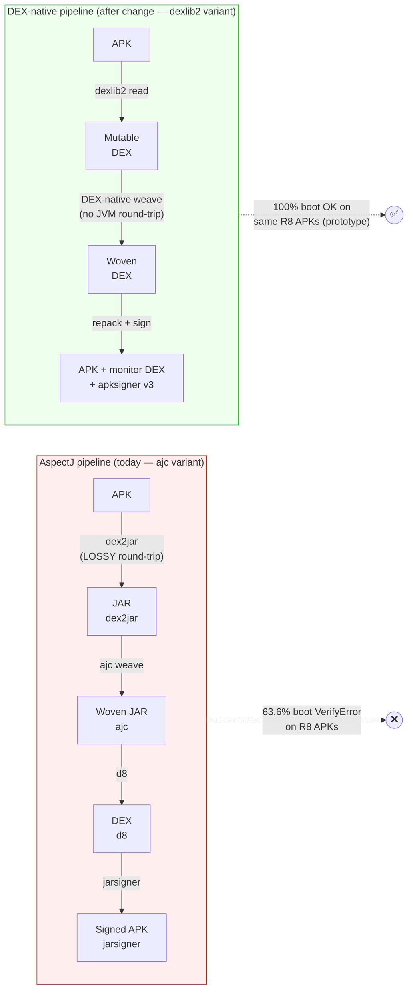
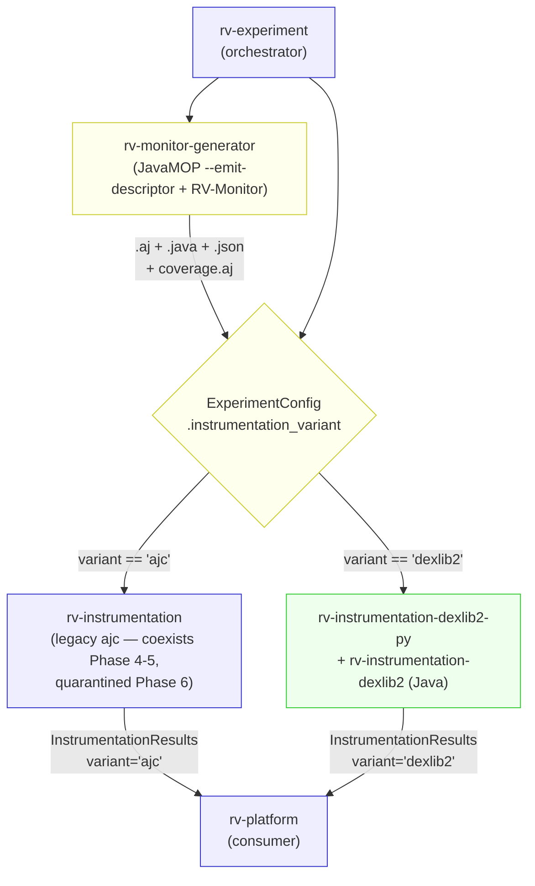

# Proposal — DEX-native instrumentation pipeline (dexlib2)

GitHub Issue: #52

## Why

The current `rv-instrumentation` pipeline executes a `APK → dex2jar → ajc → d8 → APK` round-trip that is structurally broken for Kotlin/R8-optimized APKs. As of 2026-04, 63.6% of JCA-400 APKs boot with `VerifyError` despite the pipeline reporting 74.5% success — the diagnosis (`docs/20260421_problema_dex2jar.md`) traces this to a JVMS §4.10.1.9 type-consistency conflict that no AspectJ-flag tuning can resolve. A working DEX-native prototype (`prototipo-dexlib2`) was validated end-to-end on previously failing APKs (cryptoapp Java + hateitorrateit Kotlin/R8: 100% method coverage, 0 `VerifyError`, 4342 RVSEC-COV events on first 30s boot). Graduating that prototype into a production module recovers ~30-40% of the dataset that currently fails silently and protects the paper from a structural defect that reviewers will flag.

## What Changes

- **NEW** Java multi-module `rv-android/modules/rv-instrumentation-dexlib2/` (descriptor-reader, pointcut-engine, advice-emitter, dex-mutator, coverage-weaver, monitor-builder, multidex-merger, cli, validator) that weaves AspectJ semantics natively over DEX bytecode without any JVM round-trip
- **NEW** Python wrapper module `rv-android/modules/rv-instrumentation-dexlib2-py/` exposing the same `instrument_apks(apks_dir, results_dir) → InstrumentationResults` contract that `rv-experiment` consumes today
- **MODIFIED** `rv-monitor-generator` to invoke JavaMOP with the new `--emit-descriptor` flag, producing `MultiSpec_*MonitorAspect.json` alongside the existing `.aj`/`.java` artifacts
- **MODIFIED** `rv-experiment` to add `instrumentation_variant: Literal["ajc","dexlib2"]` to its config and dispatch to the chosen pipeline; default stays `ajc` until Layer-4 validation ratifies
- **MODIFIED** `rvsec/javamop` upstream to merge the `--emit-descriptor` patch (commit 79547700 on `emit-descriptor` branch + 2 uncommitted mods on `DescriptorWriter.java` and `AspectJDescriptor.java` that add `package` + `imports` to the JSON descriptor)
- **NEW** validation harness as Maven module `validator/` (BaksmaliDiffer, TraceComparator, FeatureMappingChecker, ConstructionInventoryGenerator) that operationalizes the 6-layer rigor framework from `docs/20260423_plano_validacao.md`
- **NEW** paper-grade documents `docs/AJ_CONSTRUCTIONS_INVENTORY.md`, `docs/AJ_TO_DEXLIB2_MAPPING.md`, `docs/LIMITATIONS.md` proving construction-by-construction equivalence and explicit gap documentation
- **REMOVED** (Phase 6, after Layer-4 ratifies) — legacy `rv-instrumentation` (ajc-based) moved to `backup/2026-MM-DD-rv-instrumentation-ajc/` per P3; `instrumentation_variant` default switches to `dexlib2`

**BREAKING (Phase 6 only)**: legacy ajc pipeline is removed once validation ratifies. The Python contract (`instrument_apks`) is preserved across the transition; only the implementation behind it changes.

## Capabilities

### New Capabilities

(none — this change does not introduce a new spec domain. The `instrumentation` capability already exists; we are extending its REQUIREMENTS to cover the dexlib2 pipeline alongside the ajc pipeline.)

### Modified Capabilities

- `instrumentation`: add REQUIREMENTS for the DEX-native weaving pipeline (descriptor consumption, pointcut matching, advice emission, register allocation, coverage weaving, multidex preservation, validator harness gates) and for the variant flag in `rv-experiment` that selects between `ajc` and `dexlib2` implementations. Existing REQUIREMENTS for the ajc pipeline remain valid during coexistence and are marked REMOVED only in Phase 6 after Layer-4 validation passes.

## Impact

**Modules modified (uv workspace)**:
- `rv-instrumentation` (legacy, kept intact during coexistence; quarantined to `backup/` in Phase 6)
- `rv-monitor-generator` (invoke `javamop --emit-descriptor`; emit `.json` alongside `.aj`/`.java`)
- `rv-experiment` (variant flag in config, dispatch in pre-processor)
- `rv-android-core` (possibly extend `InstrumentationResults` with `variant` field for traceability)

**Modules created (uv workspace + Maven)**:
- `rv-instrumentation-dexlib2/` (Java multi-module, 9 submodules)
- `rv-instrumentation-dexlib2-py/` (Python wrapper)

**Cross-module dependencies**:
- `rv-experiment → rv-instrumentation-dexlib2-py` (new) via Python interface
- `rv-monitor-generator → rv-instrumentation*` boundary moves a JSON descriptor (filesystem) alongside the existing `.aj`/`.java` artifacts
- `rv-instrumentation-dexlib2-py → rv-instrumentation-dexlib2/cli` via subprocess (Java CLI)
- `rvsec/javamop` (vendored) gains `--emit-descriptor` flag — pinned upstream commit recorded

**External dependencies**:
- New: `org.smali:smali-dexlib2:3.0.8`, `org.smali:smali-baksmali:3.0.8`, `org.ow2.asm:asm:9.7.1`, `com.fasterxml.jackson.core:jackson-databind:2.18.2`, `info.picocli:picocli` (Maven-only; no Python deps added)
- Continues to use: `apksigner`, `zipalign`, `d8` (Android SDK), JDK 8+ `javac`
- No longer required (Phase 6): `dex2jar` suite, `org.aspectj:aspectjrt`, system `ajc`

**FR/NFR references** (from `docs/PRD.md`):
- FR-INS-01..FR-INS-03 (instrumentation requirements) extended to cover dexlib2 variant
- NFR-INS-* (overhead, reproducibility, success rate) — target: instrumentation success ≥ ajc baseline + 15-20pp; runtime success ≥ ajc baseline by recovery_rate ≥ 90%; overhead ≤ 30% (paridade com ~25.9% histórico)
- NFR-REP-* (reproducibility) — DEX-native weaving preserves multidex split decisions; same input + same descriptor → identical output APK

**Validation rigor (paper-grade)**:
- 6-layer framework per `docs/20260423_plano_validacao.md` operationalized in `validator/`
- Construction-by-construction mapping from AspectJ to dexlib2 documented and asserted by `FeatureMappingChecker`
- Documented gaps for non-supported AspectJ constructs (`around`, `cflow`, `handler`, `get`/`set` — 0 usos confirmados em todo conjunto de specs)

**Coordination**:
- Issue #48 (project finalization) — gh52 runs in finalization window; coordinate scheduling of Layer-4 validation (~36h compute)
- Issue #50 (instrumentation flags) — symptom-mitigation that gh52 supersedes architecturally
- Branch: `gh52-instr-dexlib2` from `modules`, remote since 2026-04-24 (commit `abc61d90`)

