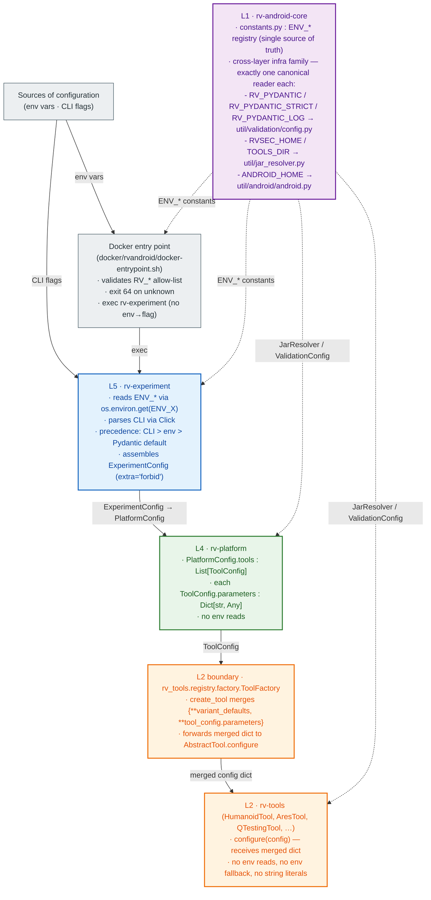
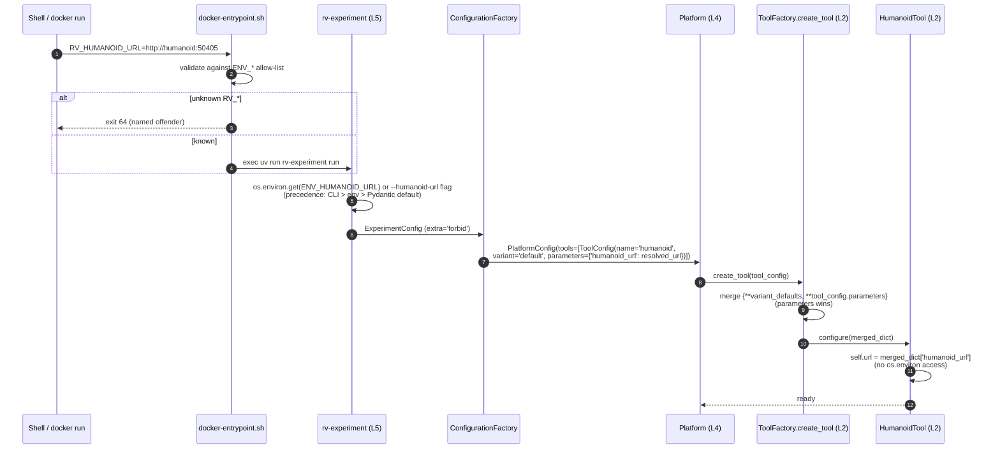

## Context

This change consolidates two related improvements identified in Phase 0 ideation (`docs/20260506_plano_env.md`) and validated empirically (`results/avd_compat_investigation/20260506_133454/`):

1. **Environment-variable plumbing is split between Docker entry point and Python modules**, with no single source of truth. 26+ `RV_*` variables are recognized somewhere; only 16 have constants in `rv-android-core/constants.py`; 4 are dead; 2 (`RV_SA_TIMEOUT`, `RV_JVM_MEMORY`) work through Docker translation but fail silently when `rv-experiment` runs outside Docker. One module (`rv-tools/.../humanoid/tool.py`) reads env vars at Layer 2, violating the layered architecture documented in `docs/rv_android_architecture.md`.

2. **AVD locked to API 29 x86** since the `gh50 §17` rollback (commit `07179eb6`), which attributed the bump failure to OverlayFS multi-step boot requirements. Host-side sample n=80 on 06/05/2026 **challenges** this diagnosis: API 30 x86_64 boots in 30s on the host with default config (no `-writable-system`), gains 7/20 modern APKs, produces 0 regressions. The empirical evidence is host-side only — the rollback was specifically about Docker-container boot, so a Docker-container boot smoke (task 6.4a) is required before the diagnosis can be considered settled and before merge.

The proposal (`proposal.md`) groups these into one change because they share the Docker layer (`docker/rvandroid/docker-entrypoint.sh` and `docker/android/Dockerfile`) and because the env-var refactor benefits from being completed in one pass before the next AVD-related changes touch the same files. PRD references: NFR01 Maintainability, NFR03 Testability, NFR05 Reproducibility.

## Architecture

### Layer purity overview



### Configuration resolution sequence (Humanoid as the canonical example)



The dotted arrows in the layer diagram represent dependency-only relationships: L5 and the entry point import `ENV_*` constants from L1; L4 and L2 use L1 utilities (`JarResolver`, `ValidationConfig`) without ever calling `os.environ` directly.

### Key Components

| Component | Responsibility | Input | Output |
|-----------|---------------|-------|--------|
| `rv_android_core.constants.ENV_*` | Single registry of `RV_*` env-var identifiers | (compile-time constants) | `str` literals consumed via `os.environ.get` |
| `rv_experiment.config.ExperimentConfig` | Top-level config; reads env via `ENV_*`; CLI overrides; `extra="forbid"` | env vars + CLI flags | Pydantic model |
| `rv_experiment.__main__` | Click CLI; new flags `--analysis-timeout`, `--jvm-memory` | argv | `ExperimentConfig` |
| `rv_platform.config.PlatformConfig.tools` (`List[ToolConfig]`, required) + `ToolConfig.parameters` (`Dict[str, Any]`, defaults to `{}`) | Channel for per-tool config (existing field formalized as sole channel) | from L5 | `tool_config.parameters` forwarded to `AbstractTool.configure` |
| `rv_tools.builtin.humanoid.HumanoidTool.configure` | Receives URL via config dict (no env read) | Dict[str, Any] | self.url, self.timeout populated |
| `docker/rvandroid/docker-entrypoint.sh` | Allow-list validation + exec | env vars | exit code 0 (proceed) or 64 (reject) |
| `docker/rvandroid/scripts/validate_env_vars.sh` | Implements the allow-list check | env + registry | exit 0 or 64 |
| `scripts/check_env_vars_drift.py` | CI lint: code ↔ constants ↔ README ↔ `.env.example` | filesystem grep | exit 0 / non-zero with drift report |
| `docker/android/Dockerfile` | AVD bump (API 30 x86_64) | build args | image with new system image |

## Path conventions (NEW vs existing)

Most paths referenced in `design.md` and `tasks.md` are NEW files this change introduces; a smaller set are existing files this change modifies. The list below is authoritative — when a file path is referenced without an annotation, it follows this list.

**NEW files (do not exist today; created by this change):**

- `scripts/check_env_vars_drift.py` — drift lint
- `docker/rvandroid/scripts/validate_env_vars.sh` — entry-point allow-list check
- `.env.example` (repo root) — canonical env-var documentation
- `docs/adr/` directory — ADR home (does not exist today; create with `docs/adr/README.md` numbering convention before writing ADRs)
- `docs/adr/0001-env-var-pattern.md` — ADR for the env-var pattern decision
- `.github/workflows/ci.yml` — CI workflow (does not exist today; if the project does not use GitHub Actions, the lint runs via `uv run` from the test runner instead — decide in implementation)
- `modules/rv-android-core/tests/test_constants_registry.py`
- `modules/rv-android-core/tests/test_top_level_configs_strict.py`
- `tests/lint/test_env_vars_drift.py` (repo-top-level `tests/` tree — also NEW; if rejected during implementation in favor of `modules/<module>/tests/`, place the lint test in `modules/rv-android-core/tests/lint/`)
- `tests/integration/test_docker_entrypoint.sh` — Docker entry-point integration test (same caveat: place in `modules/rv-experiment/tests/integration/` if a top-level `tests/` tree is rejected)
- `modules/rv-experiment/tests/test_config_precedence.py`
- `modules/rv-tools/tests/registry/test_tool_factory_parameters_channel.py`

**Existing files this change modifies:**

- `modules/rv-android-core/src/rv_android_core/constants.py` (add 16 constants, remove 4)
- `modules/rv-android-core/src/rv_android_core/util/validation/config.py:72,77,82` (literals → constants)
- `modules/rv-android-core/src/rv_android_core/util/jar_resolver.py:300` (literal → constant; canonical L1 reader of `TOOLS_DIR`)
- `modules/rv-experiment/src/rv_experiment/config.py:745,748` (literals → constants); same file gains `model_config = ConfigDict(extra="forbid")` at `ExperimentConfig`
- `modules/rv-experiment/src/rv_experiment/__main__.py` (CLI flags + humanoid URL resolution)
- `modules/rv-platform/src/rv_platform/config/platform_config.py:18` (`PlatformConfig` gains explicit `model_config = ConfigDict(extra="forbid")`)
- `modules/rv-tools/src/rv_tools/builtin/humanoid/tool.py:13,76-100` (variant default + drop env fallback)
- `modules/rv-tools/src/rv_tools/builtin/{ape,droidmate,fastbot}/tool.py:278/113/401` (TOOLS_DIR migration to JarResolver)
- `modules/aperv-tool/src/aperv_tool/tools/aperv/tool.py:329,352,355` (three reads migrated)
- `modules/rv-instrumentation-dexlib2/src/rv_instrumentation_dexlib2/dexlib_instrumentation.py:457,521-525,592` (subprocess env + RVSEC_HOME literal)
- `modules/rv-instrumentation-ajc/src/rv_instrumentation_ajc/ajc_instrumentation.py:419` (RVSEC_HOME literal)
- `docker/rvandroid/docker-entrypoint.sh` (full rewrite, ~150 → ~30 lines)
- `docker/rvandroid/Dockerfile` (API 30 x86_64 build args)
- `docker/android/Dockerfile` (API 30 x86_64 build args)
- `docker/docker-compose.*.yml` (37 files audited; 25 with `RV_JCA_SPEC` migrated to `RV_SPEC_SET`)
- `scripts/run_emulator.sh:4` (`EMULATOR_NAME=RVSec`)
- `README.md` (Environment Variables section rewritten)
- `docs/rv_android_architecture.md` (Layer Purity rule under §9 NFR Support)

When a task references a path not on either list, the implementer MUST decide and annotate in the PR description whether the file is NEW or existing.

## Mapping: Spec → Implementation → Test

| Requirement / Invariant | Implementation | Test |
|-------------------------|----------------|------|
| INV-CORE-30 (registry covers all `RV_*`) | `rv_android_core/constants.py` exhaustive list; `scripts/check_env_vars_drift.py` | `tests/lint/test_env_vars_drift.py` |
| INV-CORE-31 (no string literals) | grep CI lint in `check_env_vars_drift.py` | same |
| INV-CORE-32 (extra="forbid") | `model_config = ConfigDict(extra="forbid")` on top-level Pydantic models | unit tests instantiating with extra fields |
| INV-EXP-30 (only L5 reads env) | grep CI lint scoped to `modules/` excluding `modules/rv-experiment/` | `tests/lint/test_layer_purity.py` |
| INV-EXP-31 (entrypoint exit 64) | `docker/rvandroid/scripts/validate_env_vars.sh` | `tests/integration/test_docker_entrypoint.sh` |
| INV-EXP-32 (CLI > env > default precedence) | Click flag handlers in `__main__.py`; `ExperimentConfig` resolution | `tests/test_config_precedence.py` |
| INV-TOOL-25 (`ToolConfig.parameters` is sole channel) | `rv_tools.registry.factory.ToolFactory.create_tool(tool_config)` merges variant defaults with `tool_config.parameters` only — no other source | `modules/rv-tools/tests/registry/test_tool_factory_parameters_channel.py` (NEW) |
| INV-TOOL-20 (no env reads in `builtin/`, plus aperv-tool / rvagent-tool) | grep CI lint scoped to `modules/rv-tools/src/rv_tools/builtin/`, `modules/aperv-tool/src/`, `modules/rvagent-tool/src/` | shared lint test |
| INV-TOOL-21 (config dict only) | `HumanoidTool.configure` raises on missing keys; no fallback to env | `tests/builtin/test_humanoid_tool.py` |

## Goals / Non-Goals

**Goals:**

- Single, lint-enforced contract for `RV_*` env vars across the workspace
- Eliminate silent failures (`RV_SA_TIMEOUT`, `RV_JVM_MEMORY`)
- Layer Purity: env reads concentrated at L5, with the documented L1 cross-layer infra family of 6 names (`RV_PYDANTIC`, `RV_PYDANTIC_STRICT`, `RV_PYDANTIC_LOG`, `RVSEC_HOME`, `ANDROID_HOME`, `TOOLS_DIR`)
- API 30 x86_64 as the new default Docker AVD, recovering ~17% of modern APKs lost to ABI/SDK mismatches
- One change = one consistent state (P3): no shims, no aliases, no deprecation warnings; backups before deletion

**Non-Goals:**

- Container-per-APK isolation for humanoid (refuted in Phase 0; doc-only note in `rv-tools/CLAUDE.md`)
- `google_apis_playstore` image / NDK Translation (separate investigation; auth model differs)
- Full smoke matrix expansion to ≥100 APKs/dataset (gate, not part of refactor mechanics — runs as validation step before merge)
- Renaming env vars to a new convention (existing names preserved per user feedback; only dead vars removed)
- Splitting the Docker entrypoint into multiple scripts (current single-file structure is fine)
- Tool registry metadata for `min_api`/`max_api` per tool (deferred — orthogonal concern)

## Decisions

### D1: Centralize via `ENV_*` constants vs. literal strings

Chose `ENV_*` constants in `rv-android-core/constants.py` as the single registry. Alternatives considered:

- **Literal strings sprinkled across code**: status quo. Rejected — the existing partial ENV_* coverage (16 of 26 vars) shows that ad-hoc adoption produces drift; lint is impossible without a registry.
- **A separate `rv-config` module**: rejected — Core already owns infrastructure constants and is the universal dependency. Adding a sibling module creates fan-out without benefit.
- **Pydantic Field(alias=...) on each model**: rejected — would tie the registry to a particular model; the registry needs to be model-agnostic so it can be referenced by the entry-point allow-list and the README lint.

### D2: Docker entry-point allow-list vs. env→flag translation

Chose allow-list validation. Alternatives considered:

- **Status quo (env→flag translation)**: rejected — produces two parallel code paths (Docker vs direct CLI), causes silent failures for variables without translation rules (`RV_SA_TIMEOUT`, `RV_JVM_MEMORY`), and grows linearly with new variables.
- **Allow-list with translation**: rejected — combines worst of both worlds (still two paths).
- **No validation, plain exec**: rejected — typos in `RV_*` names would silently use defaults; debugging is difficult. The allow-list is cheap and provides immediate feedback.

### D3: AVD bump in same change as env-var refactor

Chose to bundle. Alternatives considered:

- **Two separate changes (gh55 env, gh56 AVD)**: cleaner conceptually, but `Dockerfile` and `docker-entrypoint.sh` are co-located and both modified by either change. Bundling avoids merge conflicts and reduces review overhead. The user explicitly chose γ (single consolidated change).
- **Defer AVD bump entirely**: rejected — empirical data shows 7-APK gain with 0 regressions; deferring means another round of investigation later.

### D4: No backward-compat aliases for removed vars (P3)

Chose hard deletion. Alternatives considered:

- **Aliases with `DeprecationWarning`**: rejected per CLAUDE.md P3 "No Backward Compatibility" and explicit user reinforcement. Aliases keep dead code alive and require a future cleanup pass.
- **Reject removed vars with helpful "did you mean..." messages**: partially adopted — the entry point's exit-64 message MAY suggest `RV_SPEC_SET` when it sees the removed `RV_JCA_SPEC`, but no runtime translation occurs.

### D5: AVD `RVSec` vs `RVSec30` name

Chose `RVSec` (rename from `RVSec29`). Alternatives considered:

- **Keep `RVSec29` as a name suffixed by API level**: ties the name to a single API forever; renaming is needed every bump. Rejected.
- **Use a generic `RVSec` and rely on Dockerfile metadata for API**: chosen. The image label and docs document the API level; the AVD name stays stable across future bumps.

### D6: `google_apis` (not `google_apis_playstore`) image

Chose `google_apis`. Alternatives considered:

- **`google_apis_playstore`**: provides Google Play services and the NDK Translation library. Rejected for now — empirically, `-skip-adb-auth` does not work with playstore images (they require `$ADB_VENDOR_KEYS` OEM keys), and headless Docker mode cannot accept the dialog-based authorization. ARM-only APKs (which would benefit from NDK Translation) are not currently a priority. Re-evaluate in a separate change if needed.

### D10: `TOOLS_DIR` consolidation — L1 cross-layer infra, single read in `jar_resolver`

`TOOLS_DIR` is read in 5 places today: `rv-android-core/util/jar_resolver.py:300` (L1 utility), and `rv-tools/builtin/{ape,droidmate,fastbot}/tool.py:278/113/401` (L2) plus `aperv-tool/tools/aperv/tool.py:355` (L2). It points to a deployment directory containing tool JAR archives — analogous in role to `ANDROID_HOME` (Android SDK path) and `RVSEC_HOME` (rvsec workspace path).

Chose to consolidate TOOLS_DIR into the L1 cross-layer infra family (joining `ANDROID_HOME` and `RVSEC_HOME`), with the single canonical read inside `JarResolver` at `rv-android-core/util/jar_resolver.py`. Tool plugins MUST resolve their JAR paths via `JarResolver.resolve_jar(...)` (existing API used elsewhere) instead of reading `TOOLS_DIR` directly. Alternatives considered:

- **Make `tools_dir` a per-tool config key**: rejected — five tools all need the same value, and the value is deployment-environment metadata (not user-tunable per experiment); pushing it through L5 → ToolConfig.parameters for every tool inflates configuration noise.
- **Migrate tool plugins to read `TOOLS_DIR` directly via `ENV_TOOLS_DIR`**: rejected — preserves Layer Purity violation in form (still L2 reading env), only renames the literal.
- **Eliminate `TOOLS_DIR` entirely**: rejected — out of scope; the env var is a documented operator-level deployment knob (see `modules/aperv-tool/README.md:62`), and its consumers expect to override the search path without recompiling.

After this change, the lint allow-list for L1 cross-layer infra reads in `rv-android-core` covers `RV_PYDANTIC`, `RV_PYDANTIC_STRICT`, `RV_PYDANTIC_LOG`, `RVSEC_HOME`, `ANDROID_HOME`, `TOOLS_DIR` (six names, all declared in `constants.py` as `ENV_*`).

### D9: Instrumentation L3 env handling — explicit subprocess env, no `dict(os.environ)`

The dexlib2 wrapper at `modules/rv-instrumentation-dexlib2/src/rv_instrumentation_dexlib2/dexlib_instrumentation.py:521-525` defines `_os_env()` returning `dict(os.environ)` and uses it at line 457 as the `env=` argument to `subprocess.run` when invoking the Java CLI. There are also two literal `os.environ.get("RVSEC_HOME")` reads (`dexlib_instrumentation.py:592` and `ajc_instrumentation.py:419`).

Chose to (a) replace the wholesale `dict(os.environ)` with an explicit subprocess-env builder enumerating only the variables the Java CLI needs (`PATH`, `HOME`, `JAVA_HOME`, `ANDROID_HOME`, `RVSEC_HOME`) plus any caller-supplied `env_extras`; and (b) migrate the two `RVSEC_HOME` literals to `os.environ.get(ENV_RVSEC_HOME)` using the constant from `rv-android-core/constants.py`.

Alternatives considered:

- **Leave `dict(os.environ)` as-is**: rejected — defeats the lint and leaks the full `RV_*` namespace (including the L5-resolved values) into the Java process. A Java tool reading e.g. `RV_TOOLS` accidentally would not be caught by the Python lint.
- **Move the env build to L5 and pass through config**: rejected for now — orthogonal scope; the build set (`PATH`, `JAVA_HOME`, etc.) is OS-level and not L5-resolved configuration. Keeping the subprocess env builder in L3 is correct, as long as it is explicit.
- **Whitelist `dict(os.environ)` for L3 only**: rejected — opens an exception that is hard to bound; subsequent contributors will copy it.

The lint test (planted-violation fixture) MUST flag `dict(os.environ)` and `os.environ.copy()` outside `modules/rv-experiment/`, including in `rv-instrumentation-dexlib2`. The instrumentation modules implement the explicit-env pattern below.

```python
# Allowed pattern (L3, instrumentation subprocess env):
def _build_subprocess_env(extras: Dict[str, str] | None = None) -> Dict[str, str]:
    forwarded = {k: os.environ[k] for k in ("PATH", "HOME", "JAVA_HOME", "ANDROID_HOME", "RVSEC_HOME") if k in os.environ}
    if extras:
        forwarded.update(extras)
    return forwarded
```

### D8: Variant defaults carry per-tool URLs/paths (ARES/QTesting precedent)

Chose to put the canonical Humanoid URL default in `HumanoidTool.get_variants()["default"]["humanoid_url"]`, not in `configure` code or in an env fallback. Alternatives considered:

- **Hard-coded literal in `configure` (`config.get("humanoid_url", "127.0.0.1:50405")`)**: rejected — couples the default to two places (variant + configure), making future changes drift-prone.
- **Raise `KeyError` if `humanoid_url` is missing**: rejected — breaks existing tests and standalone CLI usage (no `--humanoid-url` flag means no key in `parameters`); forces L5 to always inject even when the localhost default is fine.
- **Variant default + `configure` reads merged dict** (chosen): matches the established pattern in `builtin/ares/tool.py:79` (`"docker_image": "phtcosta/ares:latest"`) and `builtin/qtesting/tool.py:67`. The `ToolFactory.create_tool` merge `{**variant_defaults, **tool_config.parameters}` guarantees the key is present; L5 override (env-resolved) wins because parameters merge last.

This decision is what removes the `or os.environ.get(ENV_HUMANOID_URL) or "127.0.0.1:50405"` chain at `humanoid/tool.py:87-91` cleanly: there is no env read, no literal default in code, no KeyError risk for normal flow.

### D7: `model_config = ConfigDict(extra="forbid")` only at top-level

Chose strict validation only on `ExperimentConfig` and `PlatformConfig`. Alternatives:

- **Strict everywhere**: rejected — many domain models accept arbitrary extra fields by design (e.g., serialized tool variants, JSON results). Strict only at user-input boundaries (top-level configs) and pass-through elsewhere.

## API Design

### `rv_android_core.constants.ENV_*`

Compile-time `str` constants. Pattern: `ENV_<UPPERCASE_NAME> = "RV_<UPPERCASE_NAME>"` (or `"RVSEC_HOME"` / `"ANDROID_HOME"` for the legacy SDK paths).

Pydantic model fields read these via `Field(default_factory=lambda: os.environ.get(ENV_X, default))` or via the `ExperimentConfig.__init__` resolution layer (whichever pattern is already idiomatic in `config.py`).

### `rv_experiment.__main__` CLI

New Click options:

```
@click.option("--analysis-timeout", type=int, default=None,
              help="Static analysis timeout in seconds. Overrides RV_SA_TIMEOUT.")
@click.option("--jvm-memory", type=str, default=None,
              help="JVM memory for static analysis (e.g., '4g'). Overrides RV_JVM_MEMORY.")
```

Resolution order in `ExperimentConfig`:

```python
analysis_timeout: int = Field(
    default_factory=lambda: int(os.environ.get(ENV_SA_TIMEOUT, 600))
)
# ... and CLI override applied in __main__.py before instantiation
```

### `rv_platform.config.PlatformConfig.tools` (existing field)

```python
# Existing field — no schema change required:
# modules/rv-platform/src/rv_platform/config/platform_config.py:50
tools: List[ToolConfig] = Field(description="List of tools to execute")
# (PlatformConfig also gains:)
model_config = ConfigDict(extra="forbid")
```

The field is `tools` (required, no default). `ExperimentConfig.tool_configs` (in `rv-experiment`) is the L5 input field; `ConfigurationFactory` translates `tool_configs → tools` when assembling `PlatformConfig`. Both spellings refer to a `List[ToolConfig]`; this change does not rename either.

`ToolConfig` (in `rv_android_core.domain.task`) already exposes `parameters: Dict[str, Any] = Field(default_factory=dict)`. The change formalizes `parameters` as the canonical injection channel.

`ToolFactory.create_tool(tool_config)` (in `rv_tools.registry.factory`, L2) merges variant defaults (from the tool registry) with `tool_config.parameters` and forwards the merged dictionary to `tool.configure(...)`.

### `rv_tools.builtin.humanoid.HumanoidTool` — variant default + configure

Aligned with the ARES (`builtin/ares/tool.py:79`) and QTesting (`builtin/qtesting/tool.py:67`) precedents, the canonical default for the per-tool URL/path is declared in the **variant** dictionary, not in `configure` code. The `ToolFactory.create_tool` path already merges variant defaults with `tool_config.parameters` (parameters override variant defaults), so `configure` receives a fully-populated dict and never needs an env fallback or hard-coded literal.

```python
# get_variants — default holds the canonical localhost URL
@classmethod
def get_variants(cls) -> Dict[str, Dict[str, Any]]:
    return {
        "default": {
            "policy": "dfs_greedy",
            "count": 10_000_000_000,
            "ignore_ad": True,
            "humanoid_url": "127.0.0.1:50405",   # variant default
        }
    }

# configure — no os.environ, no literal fallback; merged dict guarantees the key
def configure(self, config: Dict[str, Any]) -> None:
    self.url = config["humanoid_url"]            # always present after factory merge
    self.timeout = config.get("timeout", 60)
```

L5 (`rv-experiment`) overrides the default when `RV_HUMANOID_URL` is set: it injects `ToolConfig(name="humanoid", variant="default", parameters={"humanoid_url": resolved_url})`, and the factory's `{**variant_defaults, **tool_config.parameters}` merge places the resolved URL last. When the env var is unset (and `--humanoid-url` is not passed), the variant default carries through and tests / local CLI usage continue to work without explicit configuration.

Same pattern applies to all other `rv-tools/builtin/*` plugins that previously read environment variables: move the canonical default to `get_variants()`, drop the `os.environ` fallback in `configure`. INV-TOOL-21 still holds — `configure` does not import `ENV_*`, does not call `os.environ`, and raises only on keys that have neither a variant default nor an L5-injected value.

### `docker/rvandroid/scripts/validate_env_vars.sh`

```bash
#!/usr/bin/env bash
# Reads ENV_* constants from rv-android-core/constants.py and validates that
# every RV_* variable currently set in the environment is in the allow-list.
# Exits 64 on first unknown name with a clear message.
```

The implementation extracts the allow-list at runtime (parsing `constants.py` for `ENV_<NAME> = "RV_<NAME>"` lines, or running `python -c "from rv_android_core.constants import *; ..."` if the Python environment is already available — to be decided in implementation).

### `scripts/check_env_vars_drift.py`

CI lint script (NEW — does not exist today). Performs three cross-checks and exits non-zero on any failure:

1. Every environment-read form in `modules/` references an `ENV_*` constant (no string literals). The lint covers all five forms: `os.environ.get("RV_*")`, `os.environ["RV_*"]`, `os.getenv("RV_*")`, plus the leakage forms `dict(os.environ)` and `os.environ.copy()` outside `modules/rv-experiment/`. Hits in the L1 cross-layer infra allow-list (`rv-android-core/util/validation/config.py` reading `RV_PYDANTIC*` and the legacy SDK paths `RVSEC_HOME` / `ANDROID_HOME`) pass.
2. Every `RV_*` env-var name documented in the README and `.env.example` corresponds to an `ENV_*` constant.
3. Every `ENV_*` constant has a documentation entry in the README and `.env.example`.

## Data Flow

1. User sets `RV_TIMEOUTS=300` in shell **or** passes `--timeout 300` to `rv-experiment` (or both).
2. (Docker only) Entry point validates `RV_TIMEOUTS` is in the allow-list. If yes, `exec uv run rv-experiment run`. If no, exit 64.
3. `rv-experiment.__main__` parses CLI flags via Click. For tunable values, the precedence resolver consults: `args.timeout` (CLI), then `os.environ.get(ENV_TIMEOUTS)`, then default.
4. Resolved values populate `ExperimentConfig` (Pydantic, `extra="forbid"`).
5. `ConfigurationFactory` (in `rv-experiment`) translates `ExperimentConfig.tool_configs → PlatformConfig.tools`. For the humanoid case, the resolved `RV_HUMANOID_URL` is set into `ToolConfig(name="humanoid", parameters={"humanoid_url": "..."})`.
6. `Platform.run()` drives `TaskExecutor`. When a tool task runs, `ToolFactory.create_tool(tool_config)` (in `rv_tools.registry.factory`, L2) merges variant defaults with `tool_config.parameters` and calls `HumanoidTool.configure({"humanoid_url": "...", ...variant_defaults})`.
7. `HumanoidTool.execute_tool_specific_logic` uses `self.url`. No env access at any L2 point.

## Error Handling

| Error | Source | Strategy | Recovery |
|-------|--------|----------|----------|
| Unknown `RV_*` env var | Docker entry point allow-list | Exit 64 with named offender | User edits compose/run command |
| Unknown `ExperimentConfig` field | Pydantic `extra="forbid"` | `ValidationError` with named field | User fixes typo |
| Missing required tool config key | `HumanoidTool.configure` | `KeyError` with named key | L5 resolver fixes the propagation |
| `--analysis-timeout` non-int | Click | Click error message | User passes valid integer |
| Drift detected by lint | `check_env_vars_drift.py` | CI red with file:line | Developer adds missing constant or doc entry |
| API 30 boot failure (Docker) | `phtcosta/rvandroid` image build | Smoke matrix gate before merge; revert build args if smoke fails | Fall back to API 29 (manual) |
| Tool incompatibility on API 30 | Tool smoke matrix | Gate pre-merge; document affected tools | Pin tool variant to API 29 (case-by-case) |

## Risks / Trade-offs

- **External scripts may set removed `RV_*` vars** → entry point exit 64 makes this loud; PR description and CHANGELOG list the 4 removed names. Acceptable per P3.
- **Docker image rebuild required for AVD bump** → new image tag (`phtcosta/rvandroid:0.9.0-api30`) communicated; all compose files updated explicitly in same change. Acceptable.
- **`ape` not validated upstream on API 30** → tool smoke matrix is a hard gate before merge. If `ape` fails, fallback options: pin API 29 for `ape`-using compose files (case-by-case), or escalate to a separate ape-fix change.
- **Pydantic `extra="forbid"` may reject historical config snapshots** → the change updates all in-repo compose files explicitly; external snapshots fail at instantiation with a clear list of unknown keys. Acceptable.
- **Lint script complexity** → `check_env_vars_drift.py` handles three cross-checks and may produce occasional false positives; mitigated by an explicit per-rule allow-list inside the script (e.g., the three L1 cross-layer exceptions).
- **Sample n=80 is statistically modest for AVD decision** → mitigated by the larger-sample acceptance gate (≥100/dataset) before merge.
- **Host-side evidence does not reproduce Docker container boot** → mitigated by task 6.4a (Docker-container boot smoke, ≥3 consecutive runs to BOOT_COMPLETED inside the container); without this evidence the challenge to the `gh50 §17` OverlayFS diagnosis is conjecture.

## Testing Strategy

| Layer | What to test | How | Approx count |
|-------|-------------|-----|--------------|
| Unit | `ENV_*` constant coverage | Parametrized test reading every `RV_*` ref in code | 1 lint test |
| Unit | `ExperimentConfig` precedence (CLI > env > default) | Mock env, mock argv, assert resolved value | 6 (2 vars × 3 modes) |
| Unit | `Pydantic extra="forbid"` | Instantiate with extra field, assert `ValidationError` | 2 (`ExperimentConfig`, `PlatformConfig`) |
| Unit | `HumanoidTool.configure` no env read | Patch `os.environ`, configure with dict, assert tool ignored env | 3 (url present, url missing, env set with no config) |
| Unit | `ToolFactory` forwards `tool_configs` | Mock `tool_configs={"humanoid": {"url": "X"}}`, assert `configure` called with that dict | 2 |
| Integration | Docker entry-point allow-list | Spin up container with unknown var, assert exit 64; with known var, assert exec | 4 (known/unknown/empty/interactive) |
| Integration | End-to-end CLI without Docker | `RV_SA_TIMEOUT=900 rv-experiment run --skip-execution`, assert config has 900 | 2 (env-only, env+flag-override) |
| Lint | Layer-purity grep | `scripts/check_env_vars_drift.py` runs in CI; tested with one negative case (planted violation in fixture) | 1 |
| Smoke (CI) | Docker compose representative set | Run `jca-compare`, `comparacao`, `instrument-jca-ajc` compose files with `--skip-execution` | 3 |
| Manual | AVD smoke matrix (gate H4) | 5 APKs × 5 tools × 60 min on API 30 x86_64 — runs once before merge | 25 |
| Manual | Larger AVD sample (gate) | Re-run `investigate_avd_compat.sh --sample 100` on both datasets | 1 run |

## Open Questions

- **`validate_env_vars.sh` parsing strategy**: simplest is shell + grep on `constants.py`; alternative is `python -c "..."`. Decided in implementation; either works.
- **Where to log the entry-point allow-list violation**: stderr of the failed `docker run` is acceptable; no separate log file needed.
- **Whether `rvagent-tool` and `aperv-tool` (external plugins) need audit too** — `rvagent-tool` lives under `modules/`, so yes; `aperv-tool` likewise. Confirmed during implementation by running the lint over their source trees.
- **`ape` API 30 compatibility** — gated by smoke matrix; outcome decides whether the change includes a per-compose API-29 pin for `ape`-only flows.
