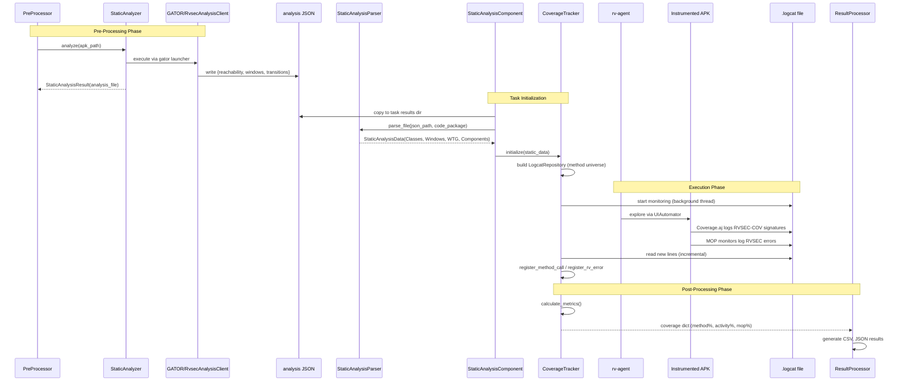

# Specification: Analysis and Coverage

## Purpose

The Analysis and Coverage domain encompasses three modules -- rv-static-analysis, rv-coverage, and rv-screen-parser -- that collectively provide the data foundation for the RV-Android system. These modules produce the static analysis data, runtime coverage metrics, and UI state representations that every other component in the pipeline depends on.

### Problem Context

Runtime verification of Android applications requires three categories of pre-computed data:

1. **Application structure data**: Before any test can run, the system needs to know which methods exist, which are reachable from entry points, and which have paths to monitored API methods. Without this, there is no denominator for coverage calculations and no basis for exploration prioritization.

2. **Runtime coverage data**: During test execution, the system needs real-time visibility into which methods have been exercised and which specification violations have occurred. This data is captured via logcat from the instrumented APK's Coverage.aj aspect and MOP monitors.

3. **UI state data**: For both LLM-driven and algorithmic exploration, the system needs structured representations of the current Android screen -- which elements exist, what actions are available, and where elements are positioned. Raw UIAutomator XML dumps are too verbose and unstructured for direct consumption.

### How This Domain Fits in the Pipeline

The three modules occupy distinct positions in the experiment lifecycle:

```
Pre-Processing Phase:
  APK -----> rv-static-analysis -----> StaticAnalysisData
                                        (Classes, Windows, WTG, Components)

Execution Phase:
  Logcat -----> rv-coverage -----> CoverageTracker
                                    (method calls, RV errors, metrics)

  UIAutomator XML -----> rv-screen-parser -----> ScreenDescription
                                                  (items, actions, coordinates)
```

The end-to-end pipeline from static analysis through execution to coverage calculation:



**rv-static-analysis** runs during the pre-processing phase of an experiment. It executes a single GATOR analysis client (`RvsecAnalysisClient`) against the original APK, producing a single JSON output file containing reachability data, window/widget inventory, and window transition graph. The `StaticAnalysisParser` then parses this file into the unified `StaticAnalysisData` domain model. This data is consumed by:
- rv-coverage (to initialize the LogcatRepository with the known method universe)
- rv-agent (to guide exploration via WTG transitions and MOP reachability)
- rv-platform (to load static data as a TaskExecutor component)

**rv-coverage** runs during the execution phase, in parallel with tool execution. The `CoverageTracker` monitors a logcat file in a background thread, parsing each line for `RVSEC-COV` (coverage) and `RVSEC` (RV error) tags. It updates a `LogcatRepository` with method calls and violations, and provides real-time coverage metrics via logging. The `CoverageAnalyzer` provides batch (offline) analysis of logcat files with fallback modes when static analysis data is unavailable.

**rv-screen-parser** runs on demand during test execution. When the rv-agent or any UI-aware tool needs to understand the current screen state, it captures a UIAutomator2 XML hierarchy dump and passes it through a parser (UIAutomator2Parser or DroidBotParser) combined with a visitor (BasicTextVisitor, DefaultTextVisitor, or EnhancedTextVisitor). The visitor traverses the UI tree and produces a `ScreenDescription` containing `ScreenItem` objects with `ItemAction` objects. The BasicTextVisitor achieves approximately 69% token reduction compared to raw XML, which is critical for LLM prompt efficiency. The module also provides screenshot analysis via OpenCV and Tesseract for detecting visual elements not present in the UI hierarchy.

### Key Design Decisions

1. **Reachability defines the method universe**: The total number of reachable methods from the analysis JSON's `reachability` section is the denominator for all coverage percentages. Without reachability data, coverage percentages cannot be computed (only absolute method call counts). The `CoverageAnalyzer` has explicit fallback modes for this scenario.

2. **Single GATOR analysis client**: A single GATOR invocation (`RvsecAnalysisClient`) produces all four data sections (reachability, windows, transitions, components) in one JSON file. The client writes sections in priority order: reachability first (coverage denominator), then windows, then transitions, then components (non-Activity component data with intent-filters, exported status, and MOP reachability). Entry points include all four Android component types: Activity lifecycle handlers, Service lifecycle methods (`onCreate`, `onStartCommand`, `onBind`, `onUnbind`, `onRebind`, `onDestroy`, `onHandleIntent`), BroadcastReceiver (`onReceive`), and ContentProvider lifecycle methods (`onCreate`, `query`, `insert`, `update`, `delete`, `call`, `openFile`). On timeout, partial JSON preserves the most critical data first.

3. **MOP means Monitored Operations, not security**: The term "MOP" refers to methods being monitored by ANY specification set (JCA cryptographic specifications or generic FSM specifications). The `reaches_target` and `directly_reaches_target` flags in the reachability section indicate paths to monitored API methods, regardless of specification domain. Do NOT use "security" terminology when referring to MOP coverage.

4. **Coverage.aj logs via HashSet dedup**: The Coverage.aj aspect woven into instrumented APKs logs method calls via `Log.v("RVSEC-COV", signature)` with a `HashSet` to ensure each signature is logged only once per execution. The signature format is `<className: returnType methodName(params)>`. The `LogcatParser` also supports a legacy format (`class:::method:::params`) for backward compatibility.

5. **SignatureNormalizer for inner class notation**: Static analysis tools (Soot) use `$` for inner classes (`OuterClass$InnerClass`), but the analysis JSON may use `.` notation (`OuterClass.InnerClass`). The `StaticAnalysisParser` uses `SignatureNormalizer` to convert `.` to `$` based on Java naming convention heuristics (uppercase after separator indicates inner class).

6. **PackageDetector resolves manifest vs code package**: In approximately 27.5% of APKs, the AndroidManifest.xml package name differs from the actual code package (e.g., Godot games: manifest=`ir.hsn6.trans`, code=`org.godotengine.godot`). The `PackageDetector` uses a priority-based heuristic with 6 strategies: same-package check, game engine detection, single package, common prefix, frequency-based selection, and string similarity fallback. Static analysis parsers receive `code_package` (not `package_name`) for class filtering.

7. **Visitor pattern for extensible UI parsing**: The rv-screen-parser uses the visitor pattern with `Node.accept(visitor)` dispatching to element-specific methods (`visit_button`, `visit_edit_text`, etc.). This allows different visitors to produce different output formats without modifying the parser. The visitor handles 30+ Android widget classes including standard, AndroidX AppCompat, and Material Design components.

8. **Thread-safe real-time tracking**: The `CoverageTracker` runs in a background daemon thread with `RLock` protection. It uses file position tracking (seek to end, read new lines) to process logcat entries incrementally without re-reading processed data. Change detection optimizes CPU usage by only recalculating metrics when data has actually changed.

### Data Models

```
StaticAnalysisData:
  classes: Classes              # Collection of application classes and methods (reachability section)
  windows: Windows              # Collection of UI windows and widgets (windows section)
  wtg: WindowTransitionGraph    # Navigation graph (transitions section)
  components: Components        # Non-Activity component data with intent-filters and MOP reachability (components section)

Classes:
  classes: Dict[str, Clazz]     # Class name -> class info (component_type, is_main, methods)

Clazz:
  name: str                     # Fully qualified class name
  component_type: str | None    # "activity", "service", "receiver", "provider", or None
  is_main: bool                 # True if this is the main launcher Activity
  methods: Dict[str, Method]    # Method name -> method info

Method:
  class_name: str               # Owning class
  name: str                     # Method name
  params: List[str]             # Parameter types
  signature: str                # Full signature: <class: returnType method(params)>
  reachable: bool               # Reachable from framework entry points
  reaches_target: bool             # Has path (direct or indirect) to a monitored API method
  directly_reaches_target: bool    # Directly invokes a monitored API method

Windows:
  windows: Dict[str, Window]    # Window name -> window info
  widgets: Dict[str, Widget]    # Widget ID -> widget info

Window:
  name: str                     # Fully qualified activity/fragment class name
  id: str                       # GATOR window ID
  type: WindowType              # ACTIVITY, SERVICE, FRAGMENT, etc.
  activity: str                 # Activity class name
  class_name: str               # Class name
  layout_file: str              # Layout XML filename
  widgets: List[Widget]         # Widgets in this window

Widget:
  id: str                       # Widget ID
  name: str                     # Widget resource name
  type: WidgetType              # BUTTON, EDIT_TEXT, TEXT_VIEW, etc.
  events: Set[WidgetEvent]      # Event handlers registered on this widget
  text: str                     # Static text content
  hint: str                     # Hint text for input fields
  input_type: str               # Input type specification
  prompt: str | None            # android:prompt (Spinner dialog title); null when absent
  spinner_mode: str | None      # android:spinnerMode ("dropdown" | "dialog" | null)
  content_description: str | None  # android:contentDescription (accessibility label); null when absent
  tooltip_text: str | None      # android:tooltipText (long-press hint); null when absent

WindowTransitionGraph:
  graph: networkx.DiGraph       # Directed graph of window transitions

WindowTransition:
  widget_id: str                # Widget that triggers this transition
  event: WidgetEventType        # Event type (CLICK, LONG_CLICK, etc.)
  handler: str                  # Handler method signature

Components:
  activities: List[ComponentInfo]   # Activities with intent-filters and MOP data
  receivers: List[ComponentInfo]    # BroadcastReceivers with intent-filters and MOP data
  services: List[ComponentInfo]     # Services with intent-filters and MOP data
  providers: List[ComponentInfo]    # ContentProviders with authorities and MOP data

ComponentInfo:
  class_name: str                   # Fully qualified class name
  component_type: str               # "activity", "service", "receiver", "provider"
  is_main: bool                     # True if this is the main launcher Activity
  intent_filters: List[IntentFilter]  # Intent filters (empty for providers)
  authorities: str | None           # Content provider authorities (providers only)
  exported: bool                    # Whether the component is exported
  reaches_target: bool                 # Whether lifecycle methods reach monitored operations
  target_methods: List[str]            # Signatures of lifecycle methods reaching MOP

IntentFilter:
  actions: List[str]                # Intent actions (e.g., "android.intent.action.MAIN")
  categories: List[str]             # Intent categories (e.g., "android.intent.category.LAUNCHER")

RvCoverageLog:
  clazz: str                    # Fully qualified class name
  method: str                   # Method name
  params: str                   # Parameter types
  signature: str                # Full method signature
  time_occurred: datetime       # When the method was called
  time_since_task_start: int    # Seconds since tool execution started

RvErrorLog:
  spec: str                     # Specification name (e.g., CipherSpec, MessageDigestSpec)
  error_type: str               # Error classification
  class_full_name: str          # Class where violation occurred
  method: str                   # Method where violation was detected
  source: str                   # Source file or monitor location
  message: str                  # Violation description
  time_occurred: datetime       # When the violation was detected
  time_since_task_start: int    # Seconds since tool execution started

LogcatRepository:
  classes: Dict[str, ...]       # Known classes from static analysis
  errors: List[RvErrorLog]      # Registered RV errors
  # Provides: register_method_call(), register_rv_error(), calculate_metrics()

ScreenDescription:
  activity: str                 # Current activity name
  items: List[ScreenItem]       # All UI elements with actions
  events_by_id: Dict[int, ItemAction]  # Action ID -> action lookup

ScreenItem:
  view: Dict[str, Any]          # Raw UI element data
  base_description: str         # Human-readable element description
  actions: List[ItemAction]     # Available actions for this element
  complement: Dict[str, Any]    # Additional metadata

ItemAction:
  id: int                       # Unique action ID within screen
  text: str                     # Action description
  event: WidgetEventType        # Widget event type
  reaches_target: bool             # Action reaches monitored operations
  directly_reaches_target: bool    # Action directly reaches monitored operations
  target_view: Dict[str, Any]   # Target element properties
  coordinates: Tuple[int, int]  # Explicit action coordinates
  widget_id: str                # Target widget ID
  callback_signature: str       # Callback method signature
  text_input: str               # Text value for TEXT_CHANGE actions
  action_type: str              # Computed: click, set_text, scroll, etc.
  coords_for_matching: Tuple    # Computed: ((x, y), action_type) signature

Node:
  data: Dict[str, Any]          # Raw UI element data from UIAutomator
  children: List[Node]          # Child nodes in UI hierarchy
  parent: Node                  # Parent node reference
  clickable: bool               # Supports click
  scrollable: bool              # Supports scroll
  editable: bool                # Supports text editing
  view_class: str               # Android widget class name
  bounds: List[List[int]]       # Bounding box [[x1,y1],[x2,y2]]
  actionable: bool              # Computed: supports any interaction

PackageDetectionResult:
  manifest_package: str         # Package from AndroidManifest.xml
  code_package: str             # Detected implementation package
  confidence: str               # "high", "medium", "low"
  detection_method: str         # Heuristic that produced the result
  all_packages: List[str]       # All candidate packages found
  similarity_score: float       # Similarity score (0.0-1.0) if similarity_match
  game_engine: str              # Detected game engine name, if any

StaticAnalysisResult:
  analysis_file: str            # Path to unified analysis JSON output file
  timed_out: bool               # Whether analysis exceeded timeout (partial JSON may exist)
  success: bool                 # Overall pipeline success
  errors: List[str]             # Error messages during analysis

CoverageCalculationMode:
  FULL_STATIC_ANALYSIS          # Complete static data available
  PARTIAL_STATIC_ANALYSIS       # Limited static data (< 10 methods)
  RUNTIME_ONLY                  # No static data, only runtime
  FALLBACK_MODE                 # Minimal functionality
```

### Cross-Domain Dependencies

```
rv-static-analysis:
  Depends on: rv-android-core (App, Classes, Windows, WTG, Components, ErrorHandler, LoggingManager)
  Consumed by: rv-platform (StaticAnalysisComponent), rv-agent (TransitionManager, MOP prioritization),
               rv-coverage (repository initialization), rv-experiment (pre-processing phase)

rv-coverage:
  Depends on: rv-android-core (LogcatRepository, RvErrorLog, RvCoverageLog)
  Consumed by: rv-platform (CoverageComponent), rv-experiment (post-processing)

rv-screen-parser:
  Depends on: rv-android-core (StaticAnalysisData for MOP tracking, WidgetEventType, ErrorHandler)
  Consumed by: rv-agent (ScreenProcessor), rv-uiautomator (device interaction)
```

## Data Contracts

### Input

- `apk_path: str` -- Path to Android APK file (source: rv-experiment or user, consumed by StaticAnalyzer)
- `code_package: str` -- Application code package name (source: App.code_package via PackageDetector, consumed by StaticAnalysisParser for class filtering)
- `rvsec_root: str` -- Path to RVSEC installation (source: RVSEC_HOME env var or explicit, consumed by RVStaticAnalysisConfig for tool path resolution)
- `mop_dir: str` -- Path to MOP specification directory (source: RVStaticAnalysisConfig, consumed by the analysis client via `-clientParam mopDir=<path>`)
- `targets_file: str` -- Path to a text file of Soot method signatures, one per line (`#` comments allowed); mutually exclusive with `mop_dir` (source: RVStaticAnalysisConfig CLI `--targets-file`, consumed via `-clientParam targetsFile=<path>`; INV-ANA-33)
- `cg_algorithm: str` -- Soot call graph algorithm, one of `spark` (default), `cha`, `rta`, `vta` (source: RVStaticAnalysisConfig CLI `--cg-algorithm`, forwarded to GATOR as `-cgAlgorithm`)
- `cg_delegation: bool` -- Whether WTG construction delegates virtual-dispatch resolution to the SPARK call graph (default `false` after M3 paridade-gate failure, 2026-05-15), passed via `-clientParam cgDelegation=<bool>`. When `true`, `FlowgraphRebuilder.buildCallGraph()` consults `Scene.v().getCallGraph()` and skips the local CHA-style rebuild (opt-in, 2–23× speedup for apps without hybrid-framework wiring). When `false` (default), legacy points-to + CHA-fallback behavior is preserved bit-for-bit (INV-ANA-21). See `docs/20260515_diagnostico_paridade_cgdelegation.md`.
- `skip_wtg: bool` -- Whether `WTGBuilder.build()` is bypassed (default `false`), passed via `-clientParam skipWtg=<bool>`. When `true`, WTG is not built and `transitions[]` is emitted as an empty array (source: RVStaticAnalysisConfig CLI `--skip-wtg`).
- `analysis_timeout: float` -- Timeout in seconds for the analysis tool (default: 600.0). Passed both as `Command.timeout` (Python process-level kill) and `--timeout` (GATOR's internal timeout)
- `analysis_client_jar: str` -- Path to the analysis client fat JAR (`lib/gator/rvsec-analysis-client.jar`)
- `logcat_file: str` -- Path to Android logcat output file (source: LogcatComponent in rv-platform, consumed by CoverageTracker and CoverageAnalyzer)
- `static_data: StaticAnalysisData` -- Parsed static analysis data (source: StaticAnalyzer.get_static_data(), consumed by CoverageTracker for repository initialization)
- `xml_data: str` -- UIAutomator2 XML hierarchy dump string (source: uiautomator2 device.dump_hierarchy(), consumed by UIAutomator2Parser)
- `screenshot_path: str` -- Path to screenshot image file (source: device screenshot capture, consumed by ScreenshotAnalyzer)
- `task_start_time: datetime` -- Tool execution start time (source: rv-platform TaskExecutor, consumed by CoverageTracker for relative timing)
- `task_id: str` -- Task identifier for event correlation (source: rv-platform, consumed by CoverageTracker)

### Output

- `StaticAnalysisData` -- Unified static analysis results containing Classes, Windows, WTG, and Components (destination: rv-platform StaticAnalysisComponent, rv-agent, rv-coverage)
- `StaticAnalysisResult` -- Analysis pipeline status with analysis file path, timeout flag, and errors (destination: rv-experiment pre-processing)
- `Dict[str, float]` -- Coverage metrics dictionary with method_coverage, activity_coverage, mop_method_coverage, called_methods, total_errors (destination: rv-platform CoverageComponent)
- `ScreenDescription` -- Complete screen state with items, actions, and coordinates (destination: rv-agent ScreenProcessor, LLM prompt generation)
- `ScreenshotAnalysisResult` -- Visual analysis results with detected texts, buttons, errors, and interactive elements (destination: rv-agent screenshot analysis)
- `PackageDetectionResult` -- Package detection result with code_package, confidence, and detection method (destination: App.code_package property)

### Side-Effects

- **File System (analysis)**: Creates `{app_name}.json` analysis output file in output directory containing reachability, windows, transitions, and components sections
- **File System (logcat)**: CoverageTracker creates empty logcat file if it does not exist
- **Background Thread**: CoverageTracker starts a daemon thread for continuous logcat monitoring; thread terminates on stop() or context manager exit

### Error

- `StaticAnalysisException` -- Raised when the analysis tool returns a non-zero exit code. Contains tool name ("ANALYSIS"), exit code, and stderr output.
- `RVCommandTimeoutError` -- Raised when the analysis tool exceeds `analysis_timeout`. The `Command` class kills the process tree via `kill_process_tree()`.
- `ConfigurationError` -- Raised by RVStaticAnalysisConfig when required paths are missing (analysis client JAR, MOP directory, Android SDK).
- `ValueError` -- Raised by ItemAction coordinate validation when coordinates are not a 2-element integer tuple or contain negative values.
- Parser errors -- Caught internally and logged; the parser returns empty domain objects per-section (empty Classes, empty Windows, empty WindowTransitionGraph, empty Components) on failure rather than propagating exceptions.

## Invariants

- **INV-ANA-02**: The `StaticAnalysisParser` MUST apply `SignatureNormalizer` to all class names and method signatures before storing them in domain models. The normalization converts inner class dot notation (`OuterClass.InnerClass`) to dollar notation (`OuterClass$InnerClass`) using Java naming convention heuristics. The normalizer is applied in all three JSON sections (`windows`, `transitions`, `reachability`).

- **INV-ANA-03**: The `StaticAnalysisParser` MUST receive `code_package` (from `App.code_package`, detected by `PackageDetector`) for class filtering, NOT `package_name` (from AndroidManifest.xml). The parser MUST filter classes in the `reachability` section and windows in the `windows` section by verifying that class names contain the `code_package` string.

- **INV-ANA-04**: The `CoverageTracker` MUST log coverage metric updates whenever coverage metrics change. It MUST log MOP error detections immediately when an RV error is detected. Log entries MUST include the `task_id` if one was provided during initialization.

- **INV-ANA-05**: The `CoverageTracker` MUST be thread-safe. All shared state access MUST be protected by the `_reader_lock` (RLock). The background monitoring thread MUST be a daemon thread that terminates when stop() is called or the context manager exits.

- **INV-ANA-06**: The `StaticAnalysisParser` MUST NOT propagate exceptions to callers. On parse failure of any section (`windows`, `transitions`, `reachability`), it MUST log the error and return empty domain objects for that section: `Windows()` for window parsing failures, `WindowTransitionGraph()` for transition parsing failures, `Classes()` for reachability parsing failures. Each section is parsed independently — a failure in one section MUST NOT prevent parsing of other sections.

- **INV-ANA-07**: The `LogcatParser` MUST support two coverage message formats: the modern format (`<class: returnType method(params)>`) and the legacy format (`class:::method:::params`). Both formats MUST produce valid `RvCoverageLog` instances.

- **INV-ANA-08**: The `LogcatParser` MUST support three error message formats: the standard JCA format (comma-separated: `spec,class,init,method,source,error_type,message`), the FSM format (`class.method():::Spec went into an error state.`), and the generic format (`class.method(file:line) ::: Spec went into an error state.`). Malformed messages MUST be logged as warnings and return None, not malformed data.

- **INV-ANA-09**: The `ItemAction.action_type` computed property MUST derive the action type from `WidgetEventType` as the single source of truth, using the `WIDGET_EVENT_TO_ACTION_TYPE` mapping. Text parsing MUST only be used for scroll direction refinement (scroll_up, scroll_down, scroll_left, scroll_right), never for primary type classification.

- **INV-ANA-10**: The `ScreenDescription` MUST build an `events_by_id` mapping from all `ItemAction` objects across all `ScreenItem` elements. The `get_action_by_id()` method MUST return the correct `ItemAction` for any valid ID within the screen context.

- **INV-ANA-11**: The `StaticAnalyzer` MUST implement intelligent caching: if the analysis `.json` output file already exists, tool execution MUST be skipped. A `CommandResult(0, b"", b"")` MUST be returned for cached results. An info log with `execution_status='cached'` MUST be recorded.

- **INV-ANA-12**: The `Node.accept(visitor)` method MUST dispatch to element-specific visitor methods based on `view_class` (e.g., `visit_button` for `android.widget.Button`). System navigation buttons (navbar, status bar) MUST be filtered by calling `visitor.should_exclude_system_button(node)` for leaf nodes only, never for container nodes. Container filtering would exclude all children.

- **INV-ANA-13**: `ItemAction.coordinates` MUST be validated as a non-negative integer tuple of exactly 2 elements `(x, y)`, or None. The `get_execution_coordinates()` method MUST resolve coordinates using priority: (1) explicit coordinates, (2) target view bounds center.

- **INV-ANA-14**: The `PackageDetector` MUST apply detection heuristics in the following priority order: (1) same-as-manifest, (2) game engine detection, (3) single package, (4) common prefix, (5) most common (60%+ frequency), (6) string similarity (85%+ threshold), (7) manifest fallback. Each strategy returns early if a match is found.

- **INV-ANA-15**: Coverage metrics MUST be calculated with reachability data as the denominator. `method_coverage` = (called methods) / (total reachable methods from the analysis JSON's reachability section). `mop_method_coverage` = (called methods that reach MOP) / (total methods with reaches_target=true). Without reachability data, percentage-based coverage MUST NOT be reported; only absolute counts are valid.

- **INV-ANA-20**: `windows[]` MUST be populated in every successful run of `RvsecAnalysisClient.run()` regardless of WTG completion status. The partial-JSON path (`wtg == null`) MUST emit identical widget data to the full-JSON path, differing only in: (a) catch-all WTG-only window entries (fragments, context menus discovered via `wtg.getNodes()` iteration) are absent, and (b) numeric window IDs use the `fallbackId` sequence instead of `windowNodeIds.get(...)`.
- **INV-ANA-21**: When `cgDelegation=true`, `AndroidCallGraph.v()` MUST NOT be populated by `FlowgraphRebuilder.buildCallGraph()` — virtual-dispatch resolution MUST come exclusively from `Scene.v().getCallGraph()` queries plus a bytecode-scan complement for `IGNORED_CLASSES` library targets. The two-call-graph problem is structurally absent.
- **INV-ANA-22**: The bytecode-scan WTG complement MUST mirror the policy of `BUG-INV-ANA-19` (existing complement for `directlyReachesTarget`): same `IGNORED_CLASSES` set, same FQN+method-name match policy, same body-retrieval resilience pattern (catch `RuntimeException`/`OutOfMemoryError`, log, continue).
- **INV-ANA-24**: `MenuExtractor` and `SpinnerItemExtractor` MUST be resilient to body-retrieval failures (same pattern as INV-ANA-17): catch per-method exceptions, log, continue. A single corrupt class MUST NOT abort the extraction.

- **INV-ANA-25**: `parse_logcat_file(logcat_file, static_data)` MUST be invoked with a non-`None` `StaticAnalysisData` whenever the caller intends to reconstruct per-method coverage from a persisted logcat (e.g. on resume, or in offline analysis tooling). When `static_data` is `None`, the returned `LogcatRepository` has `classes = {}`, `register_method_call` silently no-ops for every `RVSEC-COV` entry, and `calculate_metrics().to_dict()` returns zero for `method_coverage`, `class_coverage`, `reachable_method_coverage`, `mop_method_coverage`, and `direct_mop_method_coverage`. Only `total_errors` and `unique_errors` remain accurate. Callers that omit `static_data` MUST do so deliberately (errors-only path) and log the degraded state.

- **INV-ANA-30**: `JsonReportWriter` MUST NOT hold a reference to `ReachabilityIndex` or invoke any reachability lookup during serialization. All reachability flags emitted in the JSON are read from `ReportModel` fields populated upstream by `ReachabilityEnricher`.
- **INV-ANA-31**: The JSON output of a successful (non-truncated) GATOR run MUST end with the literal field `"complete": true` as the final top-level field. Truncated outputs MUST NOT contain this field.
- **INV-ANA-32**: The set of values declared in `JsonSchema.Keys` (Java) MUST equal the set of values in `_JK` (Python). Verified by `tests/parity/json_keys.py` in CI.
- **INV-ANA-33**: The `rv-static-analysis` CLI MUST require exactly one of `--mop-dir` or `--targets-file`. Both or neither MUST cause the process to exit with a non-zero code before GATOR launches.
- **INV-ANA-34**: `SignatureFileTargetSource` MUST tolerate blank lines and `#` comments. Other malformed content MUST raise `IllegalArgumentException` with line number.
- **INV-ANA-35**: `MopSpecsTargetSource.load()` MUST produce a `Set<TargetMethod>` whose cardinality and `(className, methodName)` pairs equal those produced by the historical `loadMopSignatures()` on the same `mopDir`. For `cryptoapp.mop`, this set has exactly 16 entries (gh57 baseline `b2e04a26`).
- **INV-ANA-36**: `MatchPolicy` is an attribute of the source / target, never a CLI-level override. No `--match-mode` or equivalent flag exists.
- **INV-ANA-37**: After C1f rename, the monorepo MUST NOT contain references to the legacy field names `reachesMop`, `directlyReachesMop`, `mopMethods`, `handlerReachesMop`, `handlerDirectlyReachesMop`, `reaches_mop`, `directly_reaches_mop`, `handler_reaches_mop`, `handler_directly_reaches_mop`, `target_reaches_mop`, `cov_reaches_mop`, `mop_methods` (Pydantic field), or the class name `MopMethod` outside of these documented exclusions: `MopSpecsTargetSource.java`, CLI flag `--mop-dir`, config attribute `mop_dir`, published CSVs under `results/` and `experimento-*/`, archived OpenSpec deltas, historical commit messages, and `modules/rv-agent/` (deprecated per CLAUDE.md — excluded by directory). The gate MUST scan `rvsec-gator/`, `modules/` (minus `rv-agent/`), and `scripts/`. Verified by `G_no_legacy_mop` CI gate.
- **INV-ANA-38**: GATOR Jimple definition-resolution helpers (`definitionRhs`, `resolveInt`, `resolveStr`) MUST live in `presto.android.util.JimpleDefUtils` only. `MenuExtractor`, `SpinnerItemExtractor`, and any future consumer MUST call them via the helper class.
- **INV-ANA-46**: `parse_logcat_line` MUST retain its signature `Tuple[Optional[RvErrorLog], Optional[RvCoverageLog]]` and its existing behavior for RVSEC/RVSEC-COV lines (the RVSEC/COV golden output MUST be byte-identical to baseline).
- **INV-ANA-47**: Tag recognition MUST match the parsed threadtime *tag field*, never a substring of the message; a `RVSEC-COV` line whose message contains `isAndroidRuntime()` MUST NOT produce a diagnostic event.
- **INV-ANA-48**: A multi-line crash block sharing one `(tag, pid, tid)` MUST yield exactly one `RvDiagnosticEvent`; lines that do not match the threadtime regex (e.g. `--------- beginning of crash`) MUST be skipped without error.
## Requirements
### Requirement: Unified Static Analysis — Window Transition Graph, GUI Elements, and Method Reachability (FR04, FR05, FR06)

The system MUST run a single GATOR analysis client to produce a single JSON output file containing four data sections written in priority order: (1) method reachability relative to a `TargetMethodSource` (coverage denominator), (2) window and widget inventory with event listeners, **populated regardless of WTG completion status (INV-ANA-20)**, (3) window transition graph, and (4) non-Activity component data (Services, BroadcastReceivers, ContentProviders) with intent-filters/authorities and target reachability. The JSON output MUST end with a sentinel `"complete": true` as the last top-level field on successful completion (INV-ANA-31).

The partial-write path (`wtg == null`) MUST emit a populated `windows[]` section using the same `extractWindows` helper as the full-write path, supplying `Collections.emptyMap()` for `windowNodeIds` and `null` for the WTG handle (INV-ANA-20). The catch-all loop over `wtg.getNodes()` (which adds fragment/context-menu windows not enumerated by `output.getActivities()`/`getDialogs()`/`getOptionsMenu()`) is guarded by `if (wtg != null)`; its absence in the partial path is the only widget-data difference between the two paths.

The analysis tool is a GATOR client (`RvsecAnalysisClient`) that implements the `GUIAnalysisClient` interface. Following decomposition, `RvsecAnalysisClient` is an orchestrator (~200 LOC) that wires four single-responsibility components plus a streaming enricher: `TargetResolver` (loads from a `TargetMethodSource` and resolves into Soot `Scene`), `ReachabilityEngine` (builds JGraphT call graph, runs multi-source BFS, complements with bytecode scan), `ReachabilityIndex` (encapsulated lookup ADT), `ReachabilityEnricher` (per-node visitor that annotates each window/transition/component/method on the fly using `ReachabilityIndex`, called by the writer during the section walk — NOT a batch materializer), and `JsonReportWriter` (incremental walker that emits each section to the output stream and flushes immediately, invoking `ReachabilityEnricher` callbacks per node to obtain the annotated values; `flush()` per section preserves partial recovery on timeout). The `JsonReportWriter` MUST NOT itself call any `ReachabilityIndex` lookup method (INV-ANA-30); all flag decisions go through the injected `ReachabilityEnricher` callback interface, which is purely a delegate — the writer holds no direct reference to the index.

GATOR initializes Soot once with defensive configuration (INV-ANA-16), builds its constraint graph and fixpoint analysis, and then invokes the client's `run(GUIAnalysisOutput output)` method. Inside this method, the orchestrator writes each JSON section incrementally with explicit flush, so that a timeout or crash after any section produces a parseable partial file (no sentinel emitted — `complete` is absent or implicitly `false`). The writer MUST NOT buffer all sections into memory before serialization — this would defeat the partial-recovery guarantee when timeout is the dominant failure mode (~30-50% of large sweeps per gh57 ground truth). Each section is enriched and emitted in one stream, then flushed before the next section is computed.

The `Flowgraph.processApplicationClasses()` method MUST handle individual method failures gracefully (INV-ANA-17). When `retrieveActiveBody()` or `createOpNode()` throws an exception for a specific method, the Flowgraph MUST skip that method and continue processing remaining methods. The resulting Flowgraph may be incomplete (missing OpNodes, widgets, or listeners for skipped methods), but the GUIAnalysis pipeline MUST complete and the `RvsecAnalysisClient` MUST produce JSON output. Reachability data (computed from `Scene.v().getCallGraph()` via BFS) is NOT affected by Flowgraph incompleteness — it depends on the Soot call graph, not on the Flowgraph.

The GATOR MUST use Soot 4.7.1 (`org.soot-oss:soot`, INV-ANA-18) with defensive configuration (INV-ANA-16). The `ClassHierarchy.typeNode()` bug (soot-oss/soot#1071) is not fixed in Soot 4.7.1, but the improved Dexpler in 4.x reduces crash frequency. The defensive options (excluding `kotlin.*`, `kotlinx.*`, and `androidx.compose.*` from body loading, disabling `jb.sils`/`jb.dae`) further reduce the crash surface.

Crash recovery is bounded by phase: failures inside `Flowgraph.processApplicationClasses()` are method-local (skip method, continue — INV-ANA-17) and the analysis pipeline completes. Failures inside Soot's call-graph construction phase (e.g., SPARK `InternalTypingException`) are NOT recoverable at the Flowgraph level — the JVM exits with a non-zero code and no JSON is produced. This boundary is load-bearing: it prevents the silent emission of a "complete-looking" report built on a corrupt call graph. Together, these recovery rules form a layered defense — prevention (defensive Soot config), method-local skip (Flowgraph try-catch), and hard halt (call-graph phase) — each at a distinct layer with non-overlapping responsibility.

When comparing analysis output against a baseline (e.g., gh57 commit `b2e04a26`), tolerances reflect Soot 4.7.1 non-determinism: for set-based reachability comparisons the contract is **strict equality** (BFS is deterministic over a fixed call graph and target set); for cardinality metrics derived from Flowgraph skips (window/transition/widget counts) a ±10% tolerance is permitted to absorb crash-frequency variation across Soot runs. `directlyReachesTarget` MUST be a strict superset or equal to the baseline `directlyReachesMop` set (BUG-INV-ANA-19: the bytecode-scan complement can only add direct callers SPARK missed, never remove them).

The execution order inside `run()`:

1. **Loads target methods via `TargetMethodSource` and resolves into Soot `Scene`**. The source is constructed from CLI input: `--mop-dir <dir>` yields a `MopSpecsTargetSource` wrapping `JavamopFacade.listUsedMethods(mopDir, false)`; `--targets-file <path>` yields a `SignatureFileTargetSource` parsing a text file of Soot signatures (one per line, `#` comments, blank lines tolerated). The two CLI flags are mutually exclusive (INV-ANA-33). The `TargetResolver` calls `source.load()` to produce a `Set<TargetMethod>`, then resolves each to one or more `SootMethod` instances per the source's matching policy: LENIENT (class+name only) for `MopSpecsTargetSource` because AspectJ wildcards in `.mop` specs leave the full signature semantically undefined; STRICT (full Soot signature) for `SignatureFileTargetSource` because the user controls precision. Wildcard parameter lists in a targets-file entry (`(..)` or `(*)`) resolve LENIENT for that entry only.

2. **Enumerates application classes and computes method reachability** using `Scene.v().getApplicationClasses()` for class/method enumeration and `Scene.v().getCallGraph()` + JGraphT for reachability flags. Entry points include: Activity lifecycle handlers and public/protected methods (via `output.getActivities()`), Service lifecycle methods (`onCreate`, `onStartCommand`, `onBind`, `onUnbind`, `onRebind`, `onDestroy`, `onHandleIntent`) and public/protected methods (via `XMLParser.getServices()`), BroadcastReceiver lifecycle method (`onReceive`) and public/protected methods (via `XMLParser.getReceivers()`), and ContentProvider lifecycle methods (`onCreate`, `query`, `insert`, `update`, `delete`, `call`, `openFile`) and public/protected methods (via `XMLParser.getProviders()`). For each application method, the `ReachabilityEngine` computes: `reachable` (reachable from entry points), `reachesTarget` (has path to a resolved target method — renamed from `reachesMop`), and `directlyReachesTarget` (directly invokes a resolved target method — renamed from `directlyReachesMop`). The `ReachabilityIndex` materializes these as `Set<String>` for O(1) lookup. This section is written and flushed first.

3. **Extracts windows and widgets** using GATOR's internal APIs (`getActivities()`, `getActivityRoots()`, `getDialogs()`, `getDialogRoots()`, `getOptionsMenu()`, `PropertyManager`). GATOR's interprocedural analysis provides the widget inventory (IDs, names, types, text, hint, listeners) including dynamically-registered listeners. Widget XML attributes not available via GATOR APIs — `inputType`, `entries` (from `android:entries="@array/X"`), and the four attributes `prompt`, `spinnerMode`, `contentDescription`, `tooltipText` — are extracted by `enrichFromXml()` from the decoded layout XML files at `Configs.resourceLocation`. The `windows[]` section is written in both the partial-JSON path (after reachability, with `wtg=null`) and the full-JSON path (after WTG completion, with the WTG handle for numeric ID assignment and catch-all enumeration).

4. **Extracts the Window Transition Graph** using GATOR's `WTGBuilder` and `WTGAnalysisOutput`, producing window IDs, transition edges with event types, widget IDs, and handler signatures. WTG construction MUST use `Scene.v().getCallGraph()` (the SPARK CG already built by Soot) as the single source of virtual-dispatch resolution when the `cgDelegation` client parameter is `true`; `AndroidCallGraph.v()` MUST NOT be populated by `FlowgraphRebuilder.buildCallGraph()` in this mode (INV-ANA-21). The legacy `AndroidCallGraph` rebuild via `FlowgraphRebuilder.buildCallGraph()` MUST be preserved behind `cgDelegation=false` (default after the M3 paridade-gate decision in `docs/20260515_diagnostico_paridade_cgdelegation.md`), where rollback is bit-for-bit. Edges to library classes quarantined by SPARK's `IGNORED_CLASSES` are recovered via a WTG-level bytecode-scan complement (INV-ANA-22). WTG construction is skipped entirely when the `skipWtg` client parameter is `true` (see the `skipWtg` ADDED requirement), in which case `transitions[]` is emitted as an empty array.

5. **Extracts non-Activity components** (Services, BroadcastReceivers, ContentProviders) from `XMLParser.getServices()`, `XMLParser.getReceivers()`, and `XMLParser.getProviders()`, enriched with intent-filters from `IntentFilterManager`, `android:exported` attribute, and target reachability cross-referenced with the reachability BFS results. This section is written and flushed last.

6. **Emits sentinel `"complete": true`** as the final top-level field, after all sections are flushed. Parser uses this to distinguish a successful run from a truncated one (INV-ANA-31).

The `complementWithCallbacks()` method, which propagates target reachability flags for lifecycle and event handlers, MUST also include Service, Receiver, and Provider lifecycle methods in its callback set, so they receive flag propagation via the call graph.

Each entry in `reachability[]` MUST include `componentType` (string: `"activity"`, `"service"`, `"receiver"`, `"provider"`, or `null` when the method belongs to no component) and `isMain` (boolean) fields. The legacy `isActivity` and `isMainActivity` fields are removed (no shim — P3). The `StaticAnalysisParser` (Python) MUST parse the new fields into the `Clazz` domain model as `component_type: str | None` and `is_main: bool`. The `null` handler exists because `getSootClassUnsafe` may return `null` for methods declared on synthetic or excluded classes; the producer emits `componentType=null` rather than dropping the entry, preserving the reachability set cardinality.

All JSON keys MUST be emitted via constants in `presto.android.gui.clients.json.JsonSchema.Keys` (Java) and consumed via `_JK = SimpleNamespace(...)` in `rv_static_analysis.parser.static.static_analysis_parser` (Python). The two constant sets MUST be value-equal (INV-ANA-32) — verified by `tests/parity/json_keys.py`.

The analysis JSON output is parsed by `StaticAnalysisParser` into the `StaticAnalysisData` domain model (Classes, Windows, WindowTransitionGraph, Components, `complete: bool`). Downstream consumers (rv-coverage, rv-platform, rv-experiment, aperv-tool, scripts) receive renamed Pydantic fields per the `core` spec delta. rv-agent (deprecated) is not a live consumer; sweep regenerates JSONs and breaks rv-agent's stale reader by design.

The reachability section defines the **method universe** — the total set of reachable methods that serves as the denominator for all coverage percentage calculations. Without reachability data, the system can count absolute method calls but cannot compute coverage percentages.

The reachability section also provides target prioritization data consumed by agents. The agent's action ranker assigns score boosts to actions whose handler method has `directly_reaches_target=true` or `reaches_target=true` (consumer side details outside this spec).

The call graph is built using SPARK (`-cgAlgorithm spark`) with `all-reachable:true`, which performs full points-to analysis to resolve virtual calls based on types effectively instantiated in the program. SPARK is the operational default. Other algorithms — CHA, RTA, VTA — remain available. JCA framework classes appear as call targets whenever any application method invokes them — they do not need to be entry points.

**Module**: rv-static-analysis (launcher + parser — modified for `--targets-file`, `_JK`, sentinel check), rvsec-gator (analysis client — decomposed + renamed + sentinel-emitting)
**Key components**: `Main.java` (Soot config), `Flowgraph.java` (error handling), `RvsecAnalysisClient` (orchestrator, ~200 LOC post-decomp), `TargetMethod`, `TargetMethodSource`, `MopSpecsTargetSource`, `SignatureFileTargetSource`, `TargetResolver`, `ReachabilityEngine`, `ReachabilityIndex`, `ReachabilityEnricher` (visitor callback, no `ReportModel` materialization), `JsonReportWriter` (streaming walker with `flush()` per section), `JsonSchema.Keys`, `JsonSchemaKeysDump` (reflection-based parity dumper), `JimpleDefUtils`, `XMLParser`, `DefaultXMLParser`, `IntentFilterManager`, `StaticAnalysisParser` (consumes `_JK` + sentinel; builds `window_methods_index` for `WindowTransition.target_reaches_target`), `Clazz`.

#### Scenario: Successful static analysis with valid APK using --mop-dir

- **WHEN** `StaticAnalyzer._run_analysis()` is called with a valid APK path, the analysis client JAR exists at `lib/gator/rvsec-analysis-client.jar`, and the user passed `--mop-dir <dir>` on the CLI
- **THEN** the system MUST execute the GATOR Python script with arguments: `python gator a -p <apk_path> --client-jar <analysis_client_jar> --out <output_file> -client RvsecAnalysisClient -clientParam mopDir=<mop_dir> --timeout <timeout> -cgAlgorithm spark`
- **AND** the producer MUST instantiate `MopSpecsTargetSource(Path(mopDir))` and `TargetResolver` MUST resolve targets LENIENT (class+name)
- **AND** the resulting `.json` file MUST end with `"complete": true` as the final top-level field
- **AND** the resulting `.json` file MUST be parseable by `StaticAnalysisParser` into a `StaticAnalysisData` with `complete == True`
- **AND** all JSON keys present in the output MUST match values declared in `JsonSchema.Keys`

#### Scenario: Successful static analysis using --targets-file

- **WHEN** the user invokes `rv-static-analysis --targets-file demo.txt <apk>` and `demo.txt` contains lines such as `<javax.crypto.Cipher: void init(int,java.security.Key)>` and `# comment` and blank lines
- **THEN** the CLI MUST accept the invocation (mutex group permits exactly one of `--mop-dir` or `--targets-file`, INV-ANA-33)
- **AND** GATOR MUST be invoked with `-clientParam targetsFile=<path>` instead of `mopDir=...`
- **AND** the producer MUST instantiate `SignatureFileTargetSource(Path(targetsFile))` and `TargetResolver` MUST resolve targets STRICT (full signature) for non-wildcard entries
- **AND** entries containing `(..)` or `(*)` MUST resolve LENIENT for that entry only
- **AND** the output JSON MUST follow the same schema as the `--mop-dir` path (same keys, sentinel last)

#### Scenario: CLI mutex rejects passing both --mop-dir and --targets-file

- **WHEN** the user invokes `rv-static-analysis --mop-dir /m --targets-file /t <apk>`
- **THEN** the argparse mutex group MUST emit an error to stderr explaining `--mop-dir` and `--targets-file` are mutually exclusive
- **AND** the process MUST exit with a non-zero return code before launching GATOR

#### Scenario: CLI rejects passing neither --mop-dir nor --targets-file

- **WHEN** the user invokes `rv-static-analysis <apk>` without specifying any target source
- **THEN** the argparse mutex group MUST emit an error indicating one of `--mop-dir` or `--targets-file` is required
- **AND** the process MUST exit with a non-zero return code

#### Scenario: --targets-file with malformed signature line

- **WHEN** the targets-file contains a line that is not blank, not a `#` comment, and is not a valid Soot signature (e.g., `Cipher.init` without angle brackets)
- **THEN** `SignatureFileTargetSource.load()` MUST raise `IllegalArgumentException` with the offending line number and content
- **AND** the GATOR process MUST exit with a non-zero code before producing any JSON

#### Scenario: MopSpecsTargetSource preserves baseline byte-for-byte

- **WHEN** GATOR analyzes `cryptoapp.apk` with `--mop-dir cryptoapp.mop` using the decomposed pipeline (`TargetResolver` + `ReachabilityEngine`)
- **THEN** the resulting `set(method.signature for method in data.methods if method.reaches_target)` MUST be equal to the same set computed from the gh57 baseline at commit `b2e04a26` (`reaches_mop` semantically — set comparison transparent to rename)
- **AND** the resulting `set(method.signature for method in data.methods if method.directly_reaches_target)` MUST be equal to the corresponding baseline set
- **AND** `cryptoapp.apk` MUST report exactly 16 target methods (INV-ANA-35)

#### Scenario: WTG timeout still produces populated windows[] in partial JSON

- **WHEN** GATOR analyzes an APK whose WTG construction exceeds the external sweep timeout (e.g. `ac.mdiq.podcini.X_256.apk` from the original-APK corpus at `/home/pedro/desenvolvimento/RV_ANDROID_NOVO/JOAO/APKs/`), and the Java process is killed via SIGTERM during `WTGBuilder.build()`
- **THEN** the JSON file written before the kill MUST contain a fully-populated `windows[]` section with all activities, dialogs, options-menu skeletons, and their widgets (including listeners, text, hint, inputType, entries) extracted from `GUIAnalysisOutput`
- **AND** the JSON `transitions[]` MUST be `[]` (empty array, not missing)
- **AND** the JSON `windows[].widgets[]` MUST NOT contain the catch-all WTG-only entries (fragments, context menus that depend on `wtg.getNodes()` enumeration) — these are skipped because `wtg == null` (INV-ANA-20)
- **AND** numeric `windows[].id` values MUST come from the `fallbackId` sequence (starting at `100000`) or from `dialog.id`/`menu.id` fallbacks, since `windowNodeIds` is an empty map in the partial-write path

#### Scenario: WTG built using legacy call graph (cgDelegation=false, default post-M3)

- **WHEN** `RvsecAnalysisClient.run()` is invoked with default client parameters (`cgDelegation` defaults to `false` per `docs/20260515_diagnostico_paridade_cgdelegation.md`)
- **AND** `WTGBuilder.build(output)` is called and reaches `FlowgraphRebuilder.buildCallGraph()`
- **THEN** `FlowgraphRebuilder.buildCallGraph()` MUST take the legacy points-to + CHA-fallback code path (`buildCallGraphLegacy` — `hier.virtualDispatch()` + `hier.getConcreteSubtypes()`)
- **AND** `AndroidCallGraph.v()` MUST be populated as before the change
- **AND** the output `transitions[]` MUST match exactly the pre-change baseline for the same APK on this code path (rollback is bit-for-bit on the WTG section)

#### Scenario: WTG built using SPARK call graph (cgDelegation=true, opt-in)

- **WHEN** `RvsecAnalysisClient.run()` is invoked with `-clientParam cgDelegation=true`
- **AND** `WTGBuilder.build(output)` is called and reaches `FlowgraphRebuilder.buildCallGraph()`
- **THEN** `FlowgraphRebuilder.buildCallGraph()` MUST consult `Scene.v().getCallGraph()` to resolve virtual-dispatch targets for each `InvokeExpr` site
- **AND** `AndroidCallGraph.v()` MUST NOT be populated via the legacy CHA-style loop (INV-ANA-21)
- **AND** for `InvokeExpr` sites whose declared callee class is in `IGNORED_CLASSES` (SPARK quarantine — `java.*`, `javax.*`, `sun.*`, `android.*`, `androidx.*`, `dalvik.*`), edges MUST be recovered via the WTG-level bytecode-scan complement (INV-ANA-22)

#### Scenario: Hybrid-framework apps lose transitions in cgDelegation=true mode

This scenario documents a known limitation of the opt-in SPARK delegation path until a follow-up change ports the CHA fallback at application-class scope for zero-edge invoke sites.

- **GIVEN** an APK whose UI listener dispatch is routed through synthetic lambdas (`$$ExternalSyntheticLambda*`) declared in application packages, instantiated through native bridges (React Native, Flutter, Capacitor)
- **WHEN** the analyzer runs with `-clientParam cgDelegation=true`
- **THEN** the WTG MAY fail to create WTGNodes for the entry activities (the SPARK call graph lacks the edges that signal "this activity is live")
- **AND** the resulting `transitions[]` section MAY be empty for those apps
- **AND** the activities WILL appear in `windows[]` with fallback IDs (≥100000)
- **AND** consumers MUST treat an empty `transitions[]` paired with fallback-IDed windows as an analyzer limitation, not a "no transitions exist" assertion (reference: `docs/20260515_diagnostico_paridade_cgdelegation.md`)

This limitation does NOT apply to `cgDelegation=false` (the default), which uses the legacy CHA fallback over application-class subtypes and captures these lambdas.

#### Scenario: GATOR crashes during call graph construction

- **WHEN** Soot's call-graph builder throws an `InternalTypingException` during call graph construction for a method in a Kotlin class
- **THEN** the GATOR process MUST terminate with a non-zero exit code
- **AND** no `.json` output file MUST exist (the crash occurs before `RvsecAnalysisClient.run()` is invoked)
- **AND** the `StaticAnalyzer` wrapper MUST log the failure as `StaticAnalysisException`
- **AND** the `StaticAnalysisResult.analysis_file` MUST point to the expected output path (which does not exist)

#### Scenario: Timeout during JSON write produces truncated file without sentinel

- **WHEN** GATOR is killed by external timeout enforcement mid-way through `JsonReportWriter.write` (e.g., after `windows[]` is flushed but before `transitions[]` is complete)
- **THEN** the partial JSON file on disk MUST NOT contain the `"complete": true` sentinel
- **AND** `StaticAnalysisParser` MUST parse what is available via `_recover_truncated_json` (load-bearing recovery)
- **AND** `StaticAnalysisData.complete` MUST be `False` (Pydantic default for absent key)
- **AND** downstream gates requiring completeness MUST exclude this sample

#### Scenario: Flowgraph skips method with failing body (Scenario B recovery)

- **WHEN** `Flowgraph.processApplicationClasses()` calls `currentMethod.retrieveActiveBody()` and Soot throws an exception for a specific method
- **THEN** the exception MUST be caught by the try-catch around `retrieveActiveBody()` (INV-ANA-17)
- **AND** a log MUST be emitted via `Logger.warn()` with the skipped method's signature and exception message
- **AND** the loop MUST continue to the next method via `continue`
- **AND** the Flowgraph MUST complete with partial data
- **AND** the `RvsecAnalysisClient.run()` MUST execute and produce a JSON file (with sentinel if no further failure)

#### Scenario: Flowgraph skips statement with failing OpNode creation

- **WHEN** `Flowgraph.processApplicationClasses()` calls `createOpNode(currentStmt)` and the method throws an exception for a specific statement
- **THEN** the exception MUST be caught by the existing catch block (INV-ANA-17)
- **AND** a log MUST be emitted via `Logger.warn()`
- **AND** the loop MUST continue to the next statement via `continue`

#### Scenario: Kotlin stdlib exclusion impact on reachability

- **WHEN** GATOR analyzes an APK with Kotlin dependencies and `-exclude kotlin.`, `-exclude kotlinx.`, and `-exclude androidx.compose.` are active
- **THEN** classes in those packages MUST NOT have their bodies jimplified
- **AND** the call graph MUST still contain edges from application code to excluded package methods (as phantom refs)
- **AND** the `reachability` section MUST NOT include excluded-package classes
- **AND** for targets like `javax.crypto.*` / `java.security.*`, reachability MUST NOT be affected because those APIs are called by application code, not by Kotlin stdlib or Compose runtime

#### Scenario: Analysis output comparison after decomposition (refactor-only)

- **WHEN** the decomposed pipeline analyzes `cryptoapp.apk` with `--mop-dir cryptoapp.mop` and the output is compared against the saved characterization fixture captured immediately before C1c on the same Soot 4.7.1 + same baseline commit
- **THEN** window count MUST match exactly (±0)
- **AND** transition count MUST match exactly (±0)
- **AND** total method count MUST match exactly (±0)
- **AND** `set(reaches_target signatures)` post-decomposition MUST equal the pre-decomposition `set(reaches_mop signatures)` (set-equivalence, transparent to field rename and to JSON byte-order)
- **AND** `set(directly_reaches_target signatures)` post-decomposition MUST equal the pre-decomposition `set(directly_reaches_mop signatures)` (the decomposition is a refactor — no new direct edges introduced)

#### Scenario: Analysis output comparison against gh57 baseline across Soot runs

- **WHEN** the post-rename pipeline analyzes `cryptoapp.apk` and is compared against the gh57 baseline at commit `b2e04a26`, potentially across distinct Soot 4.7.1 invocations
- **THEN** `set(reaches_target signatures)` MUST equal `set(reaches_mop signatures)` from the baseline (strict equality — BFS is deterministic over the same call graph and target set)
- **AND** `set(directly_reaches_target signatures)` MUST equal the baseline `set(directly_reaches_mop signatures)` (the bytecode-scan complement is deterministic)
- **AND** window / transition / widget counts MAY differ by up to ±10% to absorb Soot 4.7.1 non-determinism from Flowgraph skips on borderline-broken methods
- **AND** the GESDA widget parity subset MUST match exactly (this subset is hand-curated and skip-free)

#### Scenario: directlyReachesTarget detects literal library invocations omitted by SPARK (BUG-INV-ANA-19)

- **WHEN** an application method's bytecode contains a literal `invoke-*` whose target's `(declaringClass.getName(), methodRef.name())` matches a resolved target from `ReachabilityIndex.reachesTargetSignatures()`
- **AND** Soot's SPARK call graph does NOT contain that target as a vertex
- **THEN** `findDirectTargetCallersByBytecodeScan` (renamed from `findDirectMopCallersByBytecodeScan`) MUST detect the invocation by walking the method's `Body.getUnits()`, casting each to `Stmt`, and inspecting `InvokeExpr.getMethodRef()` against the precomputed `Set<String>` of `"className#methodName"` keys
- **AND** the detection MUST be independent of the call graph
- **AND** the matched method MUST be unioned into `directTargetSet` after `findDirectTargetCallers` completes
- **AND** the output JSON MUST report `directlyReachesTarget=true` for that method
- **AND** the implementation MUST log scan statistics

#### Scenario: Bytecode-scan resilience on corrupted method bodies

- **WHEN** the bytecode scanner attempts `method.retrieveActiveBody()` and Soot raises a `RuntimeException` or `OutOfMemoryError` on a single application method
- **THEN** the scanner MUST catch the throwable, emit a WARN log, and `continue` to the next method
- **AND** the body-retrieval skip MUST be counted in the `bodies_skipped` log statistic
- **AND** the scanner MUST NOT abort the analysis

#### Scenario: Bytecode-scan scope is limited to application classes

- **WHEN** the bytecode scanner runs as part of the `ReachabilityEngine`
- **THEN** it MUST iterate only the `appClasses` map produced by `extractClasses` (filtered by `code_package`)
- **AND** it MUST NOT iterate every class in `Scene.v().getClasses()`
- **AND** the union with `directTargetSet` MUST never report a library class as a direct target caller

#### Scenario: JsonReportWriter purity — no runtime ReachabilityIndex lookup

- **WHEN** the post-decomposition `JsonReportWriter.write(ReportModel, Path)` is invoked
- **THEN** the writer MUST NOT hold any reference to `ReachabilityIndex` (verified by absence of import and absence of constructor parameter)
- **AND** every flag in the emitted JSON (`reachesTarget`, `directlyReachesTarget`, future `handlerReachesTarget`, etc.) MUST be read directly from the `ReportModel` fields populated upstream by `ReachabilityEnricher` (INV-ANA-30)

#### Scenario: JsonSchema.Keys ↔ _JK parity

- **WHEN** the parity test `tests/parity/json_keys.py` runs in CI
- **THEN** it MUST execute a small Java helper (`JsonSchemaKeysDump`) via subprocess that uses reflection (`Arrays.stream(JsonSchema.Keys.class.getDeclaredFields()).filter(Modifier::isStatic).map(f -> f.get(null))`) and prints the values one-per-line
- **AND** it MUST import `_JK` from Python and collect `set(_JK.__dict__.values())`
- **AND** the two sets MUST be equal (INV-ANA-32)
- **AND** the test MUST fail with a diff listing keys only in Java vs only in Python if they diverge
- **AND** the test MUST NOT rely on text-level regex against the `.java` source (fragile to Javadoc, multi-line concatenation, comments)

#### Scenario: MatchPolicy has no CLI flag

- **WHEN** any caller inspects the `rv-static-analysis` `argparse.ArgumentParser`
- **THEN** there MUST be no argument named `--match-mode`, `--matching`, `--lenient`, `--strict`, or any equivalent that would override policy at the CLI level (INV-ANA-36)
- **AND** the assertion is verified by `tests/cli/test_no_match_mode_flag.py` walking `parser._actions` for forbidden option strings

#### Scenario: G_no_legacy_mop CI gate finds zero legacy references

- **WHEN** the CI gate `tests/parity/no_legacy_mop.py` runs `git grep -nE "reachesMop|directlyReachesMop|mopMethods|handlerReachesMop|handlerDirectlyReachesMop|reaches_mop|directly_reaches_mop|handler_reaches_mop|handler_directly_reaches_mop|target_reaches_mop|cov_reaches_mop|\\bMopMethod\\b|loadMopSignatures|resolveMopInScene|findDirectMopCallersByBytecodeScan"` across `rvsec-gator/`, `modules/` (excluding `modules/rv-agent/` — deprecated per CLAUDE.md), and `scripts/`
- **THEN** the only matches MUST be inside the documented exclusion set: `MopSpecsTargetSource.java`, the CLI flag literal `--mop-dir`, the config attribute name `mop_dir`, published CSVs under `results/` and `experimento-*/`, archived OpenSpec deltas under `openspec/changes/archive/`, and historical commit messages
- **AND** zero matches MUST appear in any other location
- **AND** on any extra match the gate MUST exit non-zero with the file:line of each unexpected hit (INV-ANA-37)

#### Scenario: JsonReportWriter contains no inline string literals for JSON keys

- **WHEN** the audit `tests/parity/no_json_literals.py` parses `JsonReportWriter.java` and counts string literals that match the pattern `"[a-z][a-zA-Z0-9]*"` outside of `JsonSchema.Keys.*` references
- **THEN** the count MUST be zero
- **AND** the test MUST fail with the offending line numbers if any inline literal is found

#### Scenario: JimpleDefUtils replaces duplicated helpers in MenuExtractor and SpinnerItemExtractor

- **WHEN** the post-extraction GATOR jar is inspected
- **THEN** `presto.android.util.JimpleDefUtils` MUST exist with public static methods `definitionRhs(Unit, Local)`, `resolveInt(Value)`, `resolveStr(Value)`
- **AND** `MenuExtractor.java` and `SpinnerItemExtractor.java` MUST contain zero private duplicates of those helpers (grep within those two files yields zero hits for `private.*definitionRhs|private.*resolveInt|private.*resolveStr`)
- **AND** `MenuExtractor` and `SpinnerItemExtractor` MUST invoke the helpers via `JimpleDefUtils.*` qualified calls

### Requirement: Target Method Source Abstraction (FR04)

The GATOR analysis client MUST load methods of interest via a `TargetMethodSource` interface with at least two production implementations: `MopSpecsTargetSource` (loads from JavaMOP `.mop` specs via `JavamopFacade.listUsedMethods`) and `SignatureFileTargetSource` (loads from a plain-text file of Soot method signatures). The interface decouples target loading from JavaMOP, enabling use of GATOR for use cases outside RV-Android (taint sinks for auditing, custom method lists for papers, third-party toolchains).

The `TargetMethod` POJO (in `presto.android.gui.clients.target`) carries `className: String`, `methodName: String`, `params: List<String>`, `signature: String`, and `policy: MatchPolicy` where `MatchPolicy` is the enum `{ LENIENT, STRICT }`. The policy is populated by the source — it is NOT a CLI-level concern (INV-ANA-36).

`MopSpecsTargetSource` MUST resolve LENIENT (match by class+name only) to preserve compatibility with AspectJ pointcuts in `.mop` specs whose parameter lists contain wildcards (`init(int, Certificate, ..)`, `getInstance(String, Object+)`).

`SignatureFileTargetSource` MUST resolve STRICT (full Soot signature match) for each non-wildcard entry. Entries whose parameter list is `(..)` or `(*)` resolve LENIENT for that entry only — wildcard syntax is opt-in per entry, not file-wide.

The `SignatureFileTargetSource` parser MUST tolerate blank lines and lines beginning with `#` (comments), and MUST raise `IllegalArgumentException` (with line number) on any other malformed line.

**Module**: rvsec-gator (`commons/target/TargetMethod.java`, `commons/target/TargetMethodSource.java`, `client/target/MopSpecsTargetSource.java`, `client/target/SignatureFileTargetSource.java`).

#### Scenario: TargetMethodSource interface is the only entry point to target loading

- **WHEN** `RvsecAnalysisClient.run()` needs to load methods of interest
- **THEN** it MUST construct a `TargetMethodSource` (from CLI argument dispatch) and call `source.load()` to obtain `Set<TargetMethod>`
- **AND** it MUST NOT call `JavamopFacade.listUsedMethods` directly (that call lives inside `MopSpecsTargetSource` only)

#### Scenario: SignatureFileTargetSource parses comments, blanks, and signatures

- **WHEN** `SignatureFileTargetSource.load()` is invoked on a file containing:
  ```
  # JCA crypto sinks
  <javax.crypto.Cipher: void init(int,java.security.Key)>

  <javax.crypto.Cipher: byte[] doFinal(byte[])>
  # LENIENT wildcard
  <javax.crypto.Cipher: void init(..)>
  ```
- **THEN** the returned set MUST contain exactly 3 `TargetMethod` instances
- **AND** the first two MUST have `policy == STRICT`
- **AND** the third MUST have `policy == LENIENT`

#### Scenario: MopSpecsTargetSource is a thin wrapper over JavamopFacade

- **WHEN** `MopSpecsTargetSource(Path.of("/m")).load()` is invoked
- **THEN** it MUST delegate to `JavamopFacade.listUsedMethods(/m, false)`
- **AND** it MUST convert each `MopMethod` to a `TargetMethod` with `policy == LENIENT`
- **AND** the resulting `Set<TargetMethod>` MUST be equal in cardinality to the historical `Set<MopMethod>` produced by `loadMopSignatures` on the same input (INV-ANA-35)

### Requirement: JSON Completion Sentinel (NFR02)

The `JsonReportWriter` MUST emit the literal field `"complete": true` as the **final** top-level field of the JSON output, written only after all preceding sections have been flushed successfully. The Python parser MUST surface this field as the `complete: bool` attribute on `StaticAnalysisData`, with default `False` when the key is absent (truncated or corrupted output).

The sentinel is NOT a schema version. It carries no version number, no schema identifier, no producer metadata — it is a single binary invariant: "the producer reached the end of write successfully". P3 (no backward compatibility) is preserved because `complete` is a new field, not a transformation of any existing one.

Downstream gates and consumers MAY filter samples where `complete is False` to avoid false positives caused by truncation. Gates that compare against the baseline (`G_paridade_reachability`, `G_widget_reachability`, `G_transition_reachability`) MUST apply this filter.

**Module**: rvsec-gator (`client/json/JsonReportWriter.java`), rv-static-analysis (`parser/static/static_analysis_parser.py`).

#### Scenario: Successful run emits sentinel as last field

- **WHEN** GATOR completes analysis of `cryptoapp.apk` without timeout or crash
- **THEN** the JSON file MUST end with `,"complete":true}` (allowing for whitespace and field ordering of preceding fields)
- **AND** `JSON.parse(...)["complete"] == true`

#### Scenario: Truncated run does not emit sentinel

- **WHEN** GATOR is killed mid-write by external timeout enforcement after `windows[]` flushed but before `transitions[]` completes
- **THEN** the partial JSON file MUST NOT contain the literal `"complete":true`
- **AND** `StaticAnalysisParser` MUST parse what is recoverable via `_recover_truncated_json`
- **AND** the resulting `StaticAnalysisData.complete` MUST be `False`

#### Scenario: Parser default for absent sentinel key

- **WHEN** `StaticAnalysisParser.parse_json` reads a JSON object that does not contain the `complete` key
- **THEN** the resulting `StaticAnalysisData.complete` MUST be `False`
- **AND** no warning or error MUST be raised

### Requirement: Shared JSON Schema Keys (P1, NFR04)

All field names in the JSON contract between `rvsec-gator` (Java producer) and `rv-static-analysis` (Python consumer) MUST be defined as constants in two parallel locations: `presto.android.gui.clients.json.JsonSchema.Keys` on the Java side (public static final String fields), and `_JK = SimpleNamespace(...)` in `rv_static_analysis.parser.static.static_analysis_parser` on the Python side.

The two constant sets MUST be value-equal (INV-ANA-32). A parity test `tests/parity/json_keys.py` MUST run in CI and fail if they diverge.

This eliminates a category of historical drift bugs (e.g., listener events emitted under key `"eventType"` while transitions emitted `"type"`, both read as `"type"` by the Python parser with a silent default).

**Module**: rvsec-gator (`client/json/JsonSchema.java`), rv-static-analysis (`parser/static/static_analysis_parser.py`).

#### Scenario: JsonSchema.Keys and _JK are value-equal

- **WHEN** the CI parity test runs `python tests/parity/json_keys.py`
- **THEN** it MUST extract the values of all `public static final String` fields declared in `JsonSchema.Keys` (Java, via parsing the source file)
- **AND** it MUST extract `set(_JK.__dict__.values())` (Python)
- **AND** the test MUST assert the two sets are equal (using `xor` to find differences)
- **AND** if they differ, the test MUST print which keys are only-Java and only-Python, then fail

#### Scenario: All JSON writes use the constants

- **WHEN** code review or grep audit examines `JsonReportWriter.java`
- **THEN** it MUST NOT contain string literals matching `"[a-zA-Z]+":` outside of `JsonSchema.Keys` references
- **AND** all `out.append("\"...\"")` for key names MUST use `JsonSchema.Keys.X` references

### Requirement: ReachabilityEnricher Materializes ReportModel (P1, NFR04)

A `ReachabilityEnricher` component MUST sit between `ReachabilityEngine` (producer of `ReachabilityIndex`) and `JsonReportWriter` (consumer of the model). The enricher takes raw collections (`List<Window>`, `WTG`, `ComponentSet`), the index, and metadata (manifest package, code package), and produces an immutable `ReportModel` POJO with every JSON-bound field already computed.

The `JsonReportWriter` MUST receive only the `ReportModel` as input. It MUST NOT hold a reference to `ReachabilityIndex` or invoke any `index.reachesTarget(...)` style lookup during serialization (INV-ANA-30). This decouples enrichment logic from serialization, making each independently testable and preventing god-writer regression as future enrichments (G7/G8/G9/G11 in change C3) are added.

**Module**: rvsec-gator (`client/reach/ReachabilityEnricher.java`, `client/json/ReportModel.java`, `client/json/JsonReportWriter.java`).

#### Scenario: Writer has no ReachabilityIndex dependency

- **WHEN** a static analysis check (CI gate `G_enricher_purity`) inspects `JsonReportWriter.java`
- **THEN** the file MUST NOT contain `import ...ReachabilityIndex;`
- **AND** the constructor of `JsonReportWriter` MUST NOT accept `ReachabilityIndex` as a parameter
- **AND** no method body MUST reference any `ReachabilityIndex` instance

#### Scenario: Enricher produces fully-annotated ReportModel

- **WHEN** `ReachabilityEnricher.enrich(...)` is invoked with raw collections and a populated `ReachabilityIndex`
- **THEN** the returned `ReportModel` MUST contain all per-method reachability flags resolved
- **AND** for every method `m` in `model.reachability`, `m.reachesTarget == index.reachesTarget(soot(m))`
- **AND** the model MUST be deep-immutable (final fields, no setters)

### Requirement: Mutex CLI for Target Source Selection (FR04)

The `rv-static-analysis` CLI MUST expose `--mop-dir PATH` and `--targets-file PATH` as mutually exclusive options. Exactly one of the two MUST be specified on every invocation. The mutex is enforced via `argparse.add_mutually_exclusive_group(required=True)` (INV-ANA-33).

**Module**: rv-static-analysis (`src/rv_static_analysis/__main__.py`, `src/rv_static_analysis/config.py`).

#### Scenario: Both flags passed simultaneously

- **WHEN** the user runs `rv-static-analysis --mop-dir /m --targets-file /t cryptoapp.apk`
- **THEN** argparse MUST emit an error containing `--mop-dir` and `--targets-file` to stderr
- **AND** the process MUST exit with code 2 (argparse default error code) without launching GATOR

#### Scenario: Neither flag passed

- **WHEN** the user runs `rv-static-analysis cryptoapp.apk`
- **THEN** argparse MUST emit an error indicating one of the two flags is required
- **AND** the process MUST exit with code 2

#### Scenario: Only --mop-dir passed

- **WHEN** the user runs `rv-static-analysis --mop-dir /m cryptoapp.apk`
- **THEN** argparse MUST accept the invocation
- **AND** `RVStaticAnalysisConfig.target_source` MUST be `("mop_dir", "/m")` (or equivalent representation)

#### Scenario: Only --targets-file passed

- **WHEN** the user runs `rv-static-analysis --targets-file /t cryptoapp.apk`
- **THEN** argparse MUST accept the invocation
- **AND** the GATOR command MUST include `-clientParam targetsFile=/t`

### Requirement: Shared Jimple Helpers (P1)

GATOR analysis code duplicates a small Jimple-expression resolution layer (`definitionRhs`, `resolveInt`, `resolveStr`) across `MenuExtractor` and `SpinnerItemExtractor`. The duplication is mechanical and load-bearing for menu / spinner static extraction. A single `presto.android.util.JimpleDefUtils` class MUST host the canonical implementation; both extractors MUST call it. New consumers of Jimple definition resolution MUST use the helper class.

**Module**: rvsec-gator (`sootandroid/src/main/java/presto/android/util/JimpleDefUtils.java`, `client/src/main/java/presto/android/gui/clients/menu/MenuExtractor.java`, `client/src/main/java/presto/android/gui/clients/spinner/SpinnerItemExtractor.java`).

#### Scenario: JimpleDefUtils is the single Jimple-def resolution layer

- **WHEN** any GATOR component needs to resolve the RHS of a local assignment, an integer literal, or a string literal in Jimple
- **THEN** it MUST call `JimpleDefUtils.definitionRhs(...)`, `JimpleDefUtils.resolveInt(...)`, or `JimpleDefUtils.resolveStr(...)` (INV-ANA-38)
- **AND** no other class MUST contain a private copy of these helpers

### Requirement: Call Graph Algorithm CLI Exposure (FR04)

The `rv-static-analysis` CLI MUST expose `--cg-algorithm {spark,cha,rta,vta}` (default `spark`) and forward it to GATOR as `-cgAlgorithm <value>`. SPARK remains the operational default (full points-to analysis, validated in gh57 sweep); the alternatives exist because Soot supports them and they are useful for experiments comparing reachability precision. This flag is mechanical CLI plumbing — it does not introduce new analysis behavior beyond what Soot already provides.

**Module**: rv-static-analysis (`src/rv_static_analysis/__main__.py`, `src/rv_static_analysis/config.py`).

#### Scenario: --cg-algorithm forwards to GATOR

- **WHEN** the user runs `rv-static-analysis --mop-dir /m --cg-algorithm cha cryptoapp.apk`
- **THEN** the assembled GATOR command MUST include `-cgAlgorithm cha`
- **AND** `RVStaticAnalysisConfig.cg_algorithm` MUST be `"cha"`

#### Scenario: --cg-algorithm rejects invalid values

- **WHEN** the user runs `rv-static-analysis --cg-algorithm bogus --mop-dir /m cryptoapp.apk`
- **THEN** argparse MUST reject the invocation with a `choices` error listing `spark`, `cha`, `rta`, `vta`
- **AND** the process MUST exit with code 2

#### Scenario: Default --cg-algorithm is spark

- **WHEN** the user omits `--cg-algorithm`
- **THEN** the GATOR command MUST include `-cgAlgorithm spark`

### Requirement: `skipWtg` Client Parameter for WTG Bypass (FR05, NFR06)

The `RvsecAnalysisClient` MUST honor a new client parameter `skipWtg=true` / `skipWtg=false` (default `false`). When `true`, `WTGBuilder.build()` MUST NOT be invoked: control flows directly from the reachability+windows partial-JSON write to the components section, and `transitions[]` is emitted as an empty array. When `false` (default), the existing WTG flow is preserved.

The sweep launcher `scripts/static_analysis_sweep.py` MUST expose a `--skip-wtg` boolean argument that propagates as `-clientParam skipWtg=true` to GATOR. The default is `false`. The flag exists to save wall-clock on APKs known to time out in WTG construction, when `transitions[]` is not required by the downstream consumer (e.g. aperv:sata_mop, which degrades gracefully via `MopScorer.scoreWtg → 0`).

When `skipWtg=true` is passed, `RvsecAnalysisClient` MUST log a single line at INFO: `[RvsecAnalysisClient] WTG skipped by client parameter`. The JSON `transitions[]` MUST be `[]` (not absent).

#### Scenario: skipWtg=true bypasses WTGBuilder

- **WHEN** `RvsecAnalysisClient.run()` is invoked with `-clientParam skipWtg=true`
- **THEN** `WTGBuilder.build()` MUST NOT be called
- **AND** no WTG-stage log lines (`stage 1 finishes`, ..., `stage 6 finishes`) MUST appear in stdout
- **AND** the output JSON MUST contain `"transitions": []`
- **AND** the output JSON `windows[]` MUST be populated (via the partial-JSON path with `wtg=null`)
- **AND** stdout MUST contain the line `[RvsecAnalysisClient] WTG skipped by client parameter`

#### Scenario: sweep --skip-wtg propagates to GATOR

- **WHEN** `scripts/static_analysis_sweep.py` is invoked with `--skip-wtg`
- **THEN** the GATOR command line for each APK MUST contain `-clientParam skipWtg=true`
- **AND** the sweep progress log MUST reflect that WTG is skipped (one line per batch: `[SWEEP] skipWtg=true active for this run`)

### Requirement: Widget XML Attribute Extensions (FR06)

The `enrichFromXml()` method of `RvsecAnalysisClient` MUST extract four additional widget attributes from decoded layout XML files (`Configs.resourceLocation`), in addition to the existing `inputType` and `entries` extraction. The four attributes are:

- `android:prompt` → widget field `prompt` (string, applies primarily to Spinner — the title shown when `spinnerMode="dialog"`).
- `android:spinnerMode` → widget field `spinnerMode` (string enum: `"dropdown"` | `"dialog"` | `null`).
- `android:contentDescription` → widget field `contentDescription` (string, accessibility label).
- `android:tooltipText` → widget field `tooltipText` (string, long-press hint).

Missing attributes MUST map to `null` (not empty string), so the JSON consumer can distinguish "attribute absent" from "attribute present but empty".

#### Scenario: Spinner widget gets prompt and spinnerMode

- **WHEN** a decoded layout XML file at `Configs.resourceLocation/layout/foo.xml` contains `<Spinner android:id="@+id/bar" android:prompt="@string/p" android:spinnerMode="dialog"/>`
- **AND** `enrichFromXml` processes that file for an activity whose root contains a widget with `idName == "bar"`
- **THEN** the corresponding widget in `windows[].widgets[]` MUST have `prompt = "<resolved p text>"` (after `@string/` resolution) and `spinnerMode = "dialog"`

#### Scenario: Button widget gets contentDescription and tooltipText

- **WHEN** a decoded layout XML contains `<Button android:id="@+id/b" android:contentDescription="Save" android:tooltipText="Save the form"/>`
- **THEN** the corresponding widget MUST have `contentDescription = "Save"` and `tooltipText = "Save the form"`

#### Scenario: Missing XML attribute maps to null

- **WHEN** a widget in a layout has no `android:prompt` attribute set
- **THEN** the JSON `windows[].widgets[].prompt` MUST be `null` (not empty string `""` and not absent from the object)

### Requirement: Inflated OPTIONSMENU Items via Existing GUI Flow Graph (FR06)

`RvsecAnalysisClient.extractWindows()` MUST emit the menu items of every XML-inflated options menu (i.e. menus populated by `MenuInflater.inflate(R.menu.<name>, menu)` inside `onCreateOptionsMenu`). The data is already produced by the existing GATOR pipeline: `FixpointSolver.processMenuInflaterCalls()` resolves the layout id to the activity's `NOptionsMenuNode`, and `FixpointSolver.doMenuInflate()` builds an `NMenuItemInflNode` for every `<item>` in the menu XML, attaches it as a child of the `NOptionsMenuNode` (via `addParent` / `children`), and populates its id node, text, and hint. Today this data is discarded by `extractWindows` because the OPTIONSMENU branch hardcodes `widgets: []`.

The fix MUST walk `menu.getChildren()` for each `NOptionsMenuNode` and feed the children into the existing `collectWidgets(output, child, widgets, visited)` recursion, mirroring the dialog-handling block immediately above (which already does this for `NDialogNode` via `output.getDialogRoots(dialog)`).

This requirement covers **only the XML-inflation path**. Programmatic construction (`menu.add(...)` inside `onCreateOptionsMenu`) is covered separately by the requirement "Programmatic Options-Menu Extraction via Soot CFG" — the two are complementary and may produce items for the same OPTIONSMENU when an activity mixes XML inflation with programmatic additions; in that case, the JSON output contains both sets of items in `widgets[]` (no deduplication needed because the id space is disjoint by construction — XML items carry the `R.id` from the menu resource, programmatic items carry the int constant passed to `Menu.add`).

#### Scenario: XML-inflated options menu populates items

- **WHEN** an activity calls `inflater.inflate(R.menu.foo, menu)` inside `onCreateOptionsMenu` with a valid `res/menu/foo.xml` containing items `@+id/a`, `@+id/b`
- **AND** the analysis pipeline (`FixpointSolver.doMenuInflate`) has built `NMenuItemInflNode` children of the `NOptionsMenuNode` for that activity
- **THEN** the `windows[type="OPTIONSMENU"]` entry for the activity MUST have `widgets[]` containing two entries with the respective ids and resolved titles
- **AND** each entry MUST include the same fields as widgets in ACTIVITY/DIALOG windows (`id`, `idName`, `type`, `text`, `hint`, `listeners`, plus the four XML attributes from "Widget XML Attribute Extensions" — all `null` for menu items)

#### Scenario: cryptoapp baseline regression test

- **WHEN** the analysis runs on `apks_examples/cryptoapp.apk` (which has `onCreateOptionsMenu` calling `inflater.inflate(R.menu.cryptoapp_menu, menu)` and `res/menu/cryptoapp_menu.xml` containing 3 items: `menu_item_message_digest`, `menu_item_cipher`, `menu_item_home`)
- **THEN** the produced JSON MUST have `windows[where type="OPTIONSMENU" and name endsWith "#OptionsMenu"].widgets[]` with exactly 3 entries
- **AND** each of the 3 entries MUST have a non-null `id` corresponding to the menu-item resource id

### Requirement: Programmatic Options-Menu Extraction via Soot CFG (FR06)

A new class `MenuExtractor` (in the `rvsec-gator` client module) MUST trace programmatic options-menu construction in `onCreateOptionsMenu(Menu)` methods of application activities. The extractor MUST resolve the following invocation patterns via Soot CFG walking from the entry point of `onCreateOptionsMenu`:

- `Menu.add(int groupId, int itemId, int order, CharSequence title)` → menu item with literal `title`.
- `Menu.add(int groupId, int itemId, int order, int titleRes)` → menu item with title resolved from `@string/<name>` via the existing `XMLParser`/string-resource lookup.
- `Menu.addSubMenu(int groupId, int itemId, int order, CharSequence title)` → submenu node followed by `getSubItems` CFG-forward walk to collect `SubMenu.add(...)` invocations.
- `Menu.addSubMenu(int groupId, int itemId, int order, int titleRes)` → same with string-resource resolution.

The extractor populates `windows[type="OPTIONSMENU"].widgets[].items[]` as a recursive widget-entry list (each `items[]` entry is itself a widget object that may contain its own `items[]` for submenus). Widget IDs come from the `itemId` argument of the `Menu.add` call (literal int constant).

The extractor MUST be resilient to body-retrieval failures (catch per-method exceptions, log, continue — same pattern as INV-ANA-17, codified as INV-ANA-24).

#### Scenario: Programmatic Menu.add with literal CharSequence

- **WHEN** an activity's `onCreateOptionsMenu(Menu menu)` body contains the Jimple equivalent of `menu.add(0, 100, 0, "Settings")`
- **AND** `MenuExtractor` walks the CFG of that method
- **THEN** the `windows[type="OPTIONSMENU"]` entry for that activity MUST contain a widget with `items[]` including `{id: 100, text: "Settings", type: "MenuItem"}`

#### Scenario: Programmatic Menu.add with @string resource

- **WHEN** the activity calls `menu.add(0, 200, 0, R.string.cfg_label)` where `R.string.cfg_label` resolves to `"Configuration"`
- **THEN** the corresponding menu item MUST have `text: "Configuration"` (resolved via the existing string-resource lookup helpers in `RvsecAnalysisClient`)

#### Scenario: SubMenu followed by SubMenu.add chains

- **WHEN** the activity calls `SubMenu sub = menu.addSubMenu(0, 300, 0, "Tools"); sub.add(0, 301, 0, "Export"); sub.add(0, 302, 0, "Import")`
- **THEN** the corresponding submenu widget MUST have `id: 300`, `text: "Tools"`, and `items: [{id: 301, text: "Export"}, {id: 302, text: "Import"}]` (recursive structure)

#### Scenario: Body-retrieval failure does not abort extraction

- **WHEN** `MenuExtractor` attempts to walk the CFG of an activity's `onCreateOptionsMenu` and Soot raises a `RuntimeException` during `retrieveActiveBody()`
- **THEN** the extractor MUST catch the exception, emit a WARN log with the activity class name, and continue with the next activity (INV-ANA-24)
- **AND** the JSON `windows[type="OPTIONSMENU"]` for the failing activity MUST have `items: []` (empty, not missing the widget)

### Requirement: Programmatic Spinner Items via ArrayAdapter Dataflow (FR06, MVP)

A new class `SpinnerItemExtractor` (in the `rvsec-gator` client module) MUST resolve Spinner items populated programmatically via `ArrayAdapter`. The MVP scope covers exactly two patterns:

1. **Literal constructor**: `new ArrayAdapter<>(ctx, layoutId, items)` where `items` is a literal `String[]` array (`new String[]{"a", "b", "c"}`) or a literal `List<String>` (`Arrays.asList(...)` over literal strings).
2. **Programmatic add**: `adapter.add(s)` / `adapter.addAll(arr)` where `s` is a literal string and `arr` is a literal `String[]`.

Resolution MUST use the SPARK points-to set (`Scene.v().getPointsToAnalysis()`) to find the receiver type of the `setAdapter` call and to trace the def-use chain of the items argument to its allocation site. The receiver Spinner is identified by walking back from `spinner.setAdapter(adapter)` to a `findViewById` whose argument is the Spinner widget ID.

**Out of scope for MVP** (deferred to a future change, gated on corpus coverage measurement):
- `getResources().getStringArray(R.array.X)` source (resolution of `R.array` to `arrays.xml`).
- Kotlin `listOf("a", "b")` source (Kotlin desugaring to `Arrays.asList`).
- Dynamic strings (concatenation, function calls, field reads).

When the extractor cannot fully resolve an item (e.g. it traces back to a non-literal), the partial result MUST be emitted (literals resolved, non-literals omitted with a per-Spinner WARN log). The extractor MUST union its results into `windows[].widgets[where type="Spinner"].entries[]` after the XML-based `enrichFromXml` runs, so XML-defined `entries` from `android:entries="@array/X"` are preserved and the programmatic items are appended.

The extractor MUST carry a corpus-coverage telemetry log: `[SpinnerItemExtractor] processed N spinners: X literal-constructor, Y add/addAll, Z unresolved`.

#### Scenario: Literal constructor populates Spinner entries

- **WHEN** an activity's code contains the Jimple equivalent of `ArrayAdapter<String> a = new ArrayAdapter<>(this, R.layout.spinner_item, new String[]{"red", "green", "blue"}); spinner.setAdapter(a)` and `spinner = findViewById(R.id.color)`
- **THEN** the widget `windows[].widgets[where idName="color"].entries` MUST be `["red", "green", "blue"]`

#### Scenario: adapter.add() calls populate entries incrementally

- **WHEN** an activity's code contains `ArrayAdapter<String> a = new ArrayAdapter<>(this, R.layout.spinner_item); a.add("alpha"); a.add("beta"); spinner.setAdapter(a)`
- **THEN** the widget `entries` MUST be `["alpha", "beta"]`

#### Scenario: XML entries and programmatic entries coexist

- **WHEN** a Spinner has both `android:entries="@array/preset"` (resolving to `["x", "y"]`) and a runtime `adapter.add("z")` call that is later set via `setAdapter`
- **THEN** the JSON `entries` MUST contain both XML entries first then programmatic entries: `["x", "y", "z"]`

#### Scenario: Non-literal item is logged and skipped

- **WHEN** an activity's code calls `adapter.add(getString(R.string.dynamic))` where the string-resource lookup is hidden behind a method call
- **THEN** `SpinnerItemExtractor` MUST emit a WARN log identifying the unresolved item and continue
- **AND** the JSON `entries` for that Spinner MUST contain only the items that WERE resolved (not the unresolved one)

### Requirement: Reachability BFS Handles Isolated Entry-Point Seeds (FR04)

The multi-source BFS that produces `reachable[]` MUST add every entry-point seed to its visited set even when the seed has no incident edges in the SPARK call graph. Today the graph is constructed by `buildJGraph` only from CG edges, so entry points with no outgoing/incoming calls are absent from the vertex set, and the existing `if (graph.containsVertex(seed) && visited.add(seed))` guard silently drops them. The downstream effect is a deflated `reachable[]` that misrepresents legitimate callbacks (e.g. a `BroadcastReceiver.onReceive` that the SPARK CG could not link to a call site) as dead code, inflating the apparent gap between `reachable[]` and the application surface.

The fix is structural: the BFS MUST treat seeds as roots unconditionally. Implementations may either (a) call `graph.addVertex(seed)` immediately before the visited-check, or (b) pre-populate the vertex set with the full seed set inside `buildJGraph` before iterating edges. Either is acceptable; the observable contract is that an entry-point that exists in the application's class hierarchy MUST appear in `reachable[]` even when the call graph yields no edge for it.

#### Scenario: Entry-point seed without CG edges remains reachable

- **WHEN** `getEntryPoints(output)` returns a `SootMethod m` whose vertex would not be added by `buildJGraph` (no edge in `Scene.v().getCallGraph()` involves `m`)
- **THEN** `multiSourceBfs` MUST nevertheless include `m` in the returned set
- **AND** the serialized `reachable[]` field MUST contain `m`'s canonical signature
- **AND** the bytecode-scan complement (`findDirectTargetCallersByBytecodeScan`) MUST still observe `m` as a candidate caller of target signatures if its body contains a matching invoke

#### Scenario: Synthetic graph without edges

- **GIVEN** a `DefaultDirectedGraph` containing zero edges
- **AND** a non-empty `seeds` set
- **WHEN** `multiSourceBfs(graph, seeds)` is invoked
- **THEN** the returned set MUST equal `seeds` (no member is silently dropped)

### Requirement: XML Enrichment Recognizes Both `@id/` and `@+id/` Prefixes (FR06)

The widget enrichment pass that reads `res/layout/*.xml` MUST recognize both `@id/foo` (reference) and `@+id/foo` (declaration) forms when matching the `android:id` attribute against the in-memory widget map. The current implementation accepts only `@id/`; since the **declaration** form `@+id/foo` is overwhelmingly more common in Android layouts (any widget being created for the first time uses `@+id`), most XML-declared widgets are silently skipped by enrichment and their `inputType`, `entries`, `prompt`, `spinnerMode`, `contentDescription`, and `tooltipText` fields remain `null` even when present in the source layout.

#### Scenario: Layout uses `@+id/` declaration form

- **GIVEN** a layout file containing `<EditText android:id="@+id/password" android:inputType="textPassword"/>`
- **AND** the widget `password` is present in the in-memory widget map for the activity
- **WHEN** `enrichFromElement` traverses this element
- **THEN** the widget's `inputType` field MUST be set to `"textPassword"`

#### Scenario: Layout uses `@id/` reference form

- **GIVEN** a layout file containing `<Spinner android:id="@id/country_picker" android:entries="@array/countries"/>` (a reference to an id declared in `ids.xml` or elsewhere)
- **WHEN** `enrichFromElement` traverses this element
- **THEN** the widget's `entries[]` field MUST be populated from `@array/countries` (existing behavior preserved)

#### Scenario: Element without id is ignored

- **GIVEN** a `<TextView>` element with no `android:id` attribute (or with an empty string)
- **WHEN** `enrichFromElement` evaluates the element
- **THEN** no enrichment side-effects MUST occur (no map lookups, no NullPointerException)

### Requirement: `MenuExtractor` Resolves `R.string.*` Titles (FR06)

The programmatic-menu extractor MUST resolve `R.string.*` resource ids passed as the title argument of `Menu.add(group, id, order, int)` to the corresponding string value. The constructor accepts a `Function<Integer, String> resIdResolver` and ultimately defers the lookup to its caller. `RvsecAnalysisClient` MUST supply a resolver that maps a numeric resource id to the string value by combining: (1) the SPARK-resident `R.string` inner class to derive the symbolic name from the integer constant, and (2) the existing `Configs.resourceLocation` strings-XML parsing path (the same mechanism `putStringAttr` uses for `@string/` references). Today the caller supplies `resId -> null`, so any menu item created via `Menu.add(group, id, order, R.string.foo)` is serialized with `text=""`, which masks the item from downstream consumers that key off the title (e.g. APE-RV when ranking event affordances).

The resolver MUST tolerate missing mappings (return null/empty when the numeric id is not a `R.string.*` member of the analyzed APK), and the extractor MUST fall back to the existing empty-string default in that case. No exception MUST propagate from the resolver into the extractor's main path.

#### Scenario: `Menu.add` with `R.string.foo` resolves to the string value

- **GIVEN** an `onCreateOptionsMenu` body containing `menu.add(0, R.id.action_settings, 0, R.string.menu_settings)`
- **AND** `res/values/strings.xml` declares `<string name="menu_settings">Settings</string>`
- **WHEN** `MenuExtractor.extractItems(activity)` runs with the production resolver
- **THEN** the resulting widget map MUST contain `"text" -> "Settings"` (not `""`)

#### Scenario: Resolver returns null for an unknown id

- **GIVEN** a `Menu.add` whose title argument is an `IntConstant` not present in the APK's `R.string`
- **WHEN** `MenuExtractor.resolveTitle` invokes the resolver
- **THEN** the resolver MUST return null
- **AND** the widget's `text` field MUST be `""` (the existing empty-string default — no NullPointerException)

#### Scenario: `Menu.add` with a literal CharSequence is unaffected

- **GIVEN** an invocation `menu.add(0, R.id.foo, 0, "Direct Title")` (StringConstant)
- **WHEN** `MenuExtractor.resolveTitle` runs
- **THEN** the widget's `text` MUST equal `"Direct Title"` (the resolver MUST NOT be consulted)

### Requirement: `SpinnerItemExtractor` Unwraps Cast Expressions for `findViewById` (FR06)

When resolving the receiver of a `setAdapter` call to its underlying Spinner widget id, the extractor MUST follow `CastExpr` definitions. The dominant Jimple pattern for the source `Spinner s = (Spinner) findViewById(R.id.foo)` materializes as two statements: `$r1 = findViewById($id)` and `$r2 = (android.widget.Spinner) $r1`. The current `resolveSpinnerWidgetId` reads `definitionRhs(spinnerLocal)` once and only matches `InvokeExpr`, so the cast result `$r2` (whose RHS is a `CastExpr`, not an `InvokeExpr`) breaks the chain and the widget id is never recovered. Without this fix, Spinners declared with the typical cast pattern surface in `widgets[]` but their `entries[]` field stays empty even though `SpinnerItemExtractor` correctly identified the ArrayAdapter literal items.

The fix MUST traverse cast chains bounded by `SimpleLocalDefs`'s fixed-point property: when `definitionRhs(local)` returns a `CastExpr`, the extractor recurses on `(Local) castExpr.getOp()`. Recursion terminates because each step reduces to a new local whose def must be reachable (or unresolvable, in which case the existing single-reaching-def policy returns null). The recursion depth is bounded by the number of casts in the chain (typically 1).

#### Scenario: Spinner declared with cast pattern

- **GIVEN** a method containing `$r1 = findViewById(R.id.spinner); $r2 = (Spinner) $r1; $r2.setAdapter($adapter)`
- **AND** `$adapter` was built from a literal `new ArrayAdapter<>(this, layout, new String[]{"A","B","C"})`
- **WHEN** `SpinnerItemExtractor.extractItems` processes the method body
- **THEN** the returned map MUST contain `R.id.spinner -> ["A","B","C"]`

#### Scenario: Chained casts terminate at the first findViewById

- **GIVEN** statements `$r1 = findViewById($id); $r2 = (View) $r1; $r3 = (Spinner) $r2; $r3.setAdapter(...)`
- **WHEN** the extractor walks the cast chain
- **THEN** the spinner widget id MUST resolve to the value of `$id` from the original `findViewById` call

#### Scenario: Unresolvable receiver does not crash

- **GIVEN** a `setAdapter` call whose receiver's reaching def is ambiguous (multiple defs) or non-local (a field load)
- **WHEN** the extractor attempts to resolve the widget id
- **THEN** `resolveSpinnerWidgetId` MUST return null
- **AND** the extractor MUST count this as an unresolved case (existing `stats.unresolved++`) and continue

### Requirement: GATOR Invocation Robustness (FR04)

The Python invoker (`rv-static-analysis`) MUST invoke the GATOR launcher using the running interpreter (`sys.executable`) — never a literal `"python"` string. The launcher is a Python script with `#!/usr/bin/env python3` shebang, but the invoker passes it as `<interpreter> <script> <args>`, so the interpreter argument is what reaches `execve`. Hardcoding `"python"` breaks on systems where the `python-is-python3` shim is absent (clean containers, fresh shells on non-Debian distros, CI runners without the shim package), producing a `CommandNotFoundError` that gets caught upstream as a warning and yields a silently-empty JSON output. The invoker MUST always pick the actual Python 3.x binary that is executing the workspace (uv's `.venv/bin/python` in the standard layout), which is reachable by construction.

Additionally, `StaticAnalyzer._run_analysis` MUST validate, after the GATOR command returns (including the timeout-tolerant `RVCommandTimeoutError` path), that the output JSON file exists on disk. If absent, the method MUST raise `StaticAnalysisException` with a message identifying the missing path and pointing at interpreter / launcher reachability as the likely cause. This converts upstream silent failures (e.g. `CommandNotFoundError` swallowed by the `ErrorHandler` decorator, a JVM crash before any output was flushed, a permission error on the output directory) into hard, observable errors before the parser is invoked and before the downstream summary CSV is written with misleading zero-coverage metrics.

A timed-out GATOR invocation produces a partial JSON file (the client flushes reachability first, then windows, then transitions, with intermediate flushes — INV-ANA-06), so the existence check passes on timeout. Only the genuinely-empty case (no file at all) escalates.

#### Scenario: Interpreter resolution uses the running Python

- **WHEN** `RVStaticAnalysisConfig.get_tool_command("analysis", apk_path, output_file)` is called from any context (CLI, rv-experiment pre-processing, unit tests)
- **THEN** the returned command list's first element MUST equal `sys.executable` (the absolute path of the running Python 3.x interpreter)
- **AND** the second element MUST be the path to the `gator` launcher script
- **AND** the command MUST be reachable via `execve` on any POSIX system that has the same uv-managed virtualenv on PATH (no dependency on `/usr/bin/python` existing)

#### Scenario: Missing output JSON escalates to StaticAnalysisException

- **WHEN** `StaticAnalyzer._run_analysis` completes (either via successful `Command.invoke` return or via the `RVCommandTimeoutError` partial-success path)
- **AND** the configured output file does not exist on disk
- **THEN** the method MUST raise `StaticAnalysisException` with a message that includes the missing path and the diagnostic hint "check that the python interpreter and gator launcher are reachable"
- **AND** the `analyze()` wrapper MUST propagate the exception into `result.success = False` and `result.errors`, not swallow it as a warning

#### Scenario: Timeout with partial JSON is not escalated

- **WHEN** the GATOR invocation hits the analysis timeout and `RVCommandTimeoutError` is caught
- **AND** the GATOR client wrote at least the reachability section before being killed (partial JSON exists)
- **THEN** `_run_analysis` MUST NOT raise — the existence check sees the partial file and returns normally
- **AND** `result.timed_out` MUST be set to `True` so downstream consumers can distinguish a partial run from a clean one

### Requirement: Method Coverage Tracking (FR12, NFR06)

The system MUST track method coverage in real-time during test execution via the `CoverageTracker`, and provide batch analysis via the `CoverageAnalyzer`. Coverage tracking relies on the instrumented APK's Coverage.aj aspect, which logs unique method signatures to Android logcat using the `RVSEC-COV` tag.

The `CoverageTracker` monitors a logcat file in a background daemon thread. It reads new lines incrementally (using file position tracking to avoid re-reading), parses each line via `parse_logcat_line()`, and registers method calls in the `LogcatRepository`. When initialized with `StaticAnalysisData`, the repository is populated with the known method universe from the analysis JSON's reachability section, enabling percentage-based coverage calculation.

Two types of coverage are tracked:
- **Overall method coverage**: Percentage of all reachable application methods exercised during testing. Best observed: 26.77% (Humanoid at 300s) in the ICST study.
- **MOP method coverage**: Percentage of methods with paths to monitored API methods exercised during testing. Best observed: 17.16% (Humanoid at 300s).

The `CoverageTracker` logs coverage metric updates when metrics change, including method_coverage, activity_coverage, mop_method_coverage, called_methods, total_activities, and unique_errors. It uses change detection to avoid redundant metric calculations and logging.

The `CoverageAnalyzer` provides offline analysis with four calculation modes: FULL_STATIC_ANALYSIS (complete static data), PARTIAL_STATIC_ANALYSIS (limited data, < 10 methods), RUNTIME_ONLY (no static data), and FALLBACK_MODE (minimal functionality). It can process logcat files, individual RvCoverageLog entries, RvErrorLog entries, or lists thereof.

#### Scenario: Real-time coverage tracking with CoverageTracker

- **WHEN** CoverageTracker is started with a logcat file path and static analysis data
- **THEN** a daemon background thread MUST be started to monitor the logcat file
- **AND** existing lines in the file MUST be processed first
- **AND** the file position MUST be moved to the end after initial processing
- **AND** new lines MUST be read and processed in a continuous loop with adaptive sleep (0.5s with data, 1.0s without)

#### Scenario: Coverage log parsing (modern format)

- **WHEN** a logcat line contains `RVSEC-COV: <com.example.App: void doEncrypt(javax.crypto.Cipher)>`
- **THEN** parse_logcat_line() MUST return a RvCoverageLog with clazz=`com.example.App`, method=`doEncrypt`, params=`javax.crypto.Cipher`
- **AND** CoverageTracker MUST register the method call in LogcatRepository
- **AND** _data_changed_since_last_update MUST be set to True

#### Scenario: Coverage log parsing (legacy format)

- **WHEN** a logcat line contains `RVSEC-COV: com.example.App:::doEncrypt:::javax.crypto.Cipher`
- **THEN** parse_logcat_line() MUST return a RvCoverageLog with clazz=`com.example.App`, method=`doEncrypt`, params=`javax.crypto.Cipher`

#### Scenario: CoverageTracker context manager lifecycle

- **WHEN** CoverageTracker is used as a context manager (`with tracker.track_coverage() as t:`)
- **THEN** start() MUST be called on entry
- **AND** stop() MUST be called on exit (including on exception)
- **AND** the background thread MUST join with a 5-second timeout on stop()

#### Scenario: CoverageAnalyzer batch processing of logcat file

- **WHEN** CoverageAnalyzer.analyze() is called with a logcat file path string
- **THEN** it MUST delegate to process_logcat_file()
- **AND** all errors from the parsed repository MUST be transferred to the analyzer's repository
- **AND** the returned metrics dictionary MUST include method_coverage, activities_coverage, methods_jca_reachable_coverage, total_errors, and total_method_calls

### Requirement: Specification Violation Detection (FR13)

The system MUST detect and record violations of MOP specifications (RV errors) reported via logcat during test execution. Violations are logged by the runtime monitors woven into the instrumented APK, using the `RVSEC` logcat tag. The `CoverageTracker` detects these violations in real-time and logs them immediately.

Three error message formats are supported by the `LogcatParser`:

1. **Standard (JCA) format**: `spec,class,init,method,source,error_type,message` -- Used by JCA specification monitors. Example: `CipherSpec,com.example.Crypto,<init>,doEncrypt,Crypto.java,MISUSE,Algorithm not allowed`

2. **FSM format**: `class.method():::Spec went into an error state.` -- Used by FSM-based generic specifications. Example: `java.util.Iterator.next():::HasNext went into an error state.`

3. **Generic format**: `class.method(file:line) ::: Spec went into an error state.` -- Used by generic specifications with source location. Example: `com.example.IO.read(IO.java:42) ::: InputStream_ManipulateAfterClose went into an error state.`

Each parsed error produces an `RvErrorLog` with spec, error_type, class_full_name, method, source, and message fields. The `LogcatRepository` stores all registered errors and provides deduplication via the `unique_msg` computed field.

In the ICST study, the top 4 violation classes (SSLContextSpec, MessageDigestSpec, CipherSpec, SecretKeySpecSpec) accounted for 78% of 230 unique violations. 33.91% originated from application code; the rest from external libraries.

#### Scenario: Standard (JCA) error format parsing

- **WHEN** a logcat line contains `RVSEC: CipherSpec,com.example.Crypto,<init>,doEncrypt,Crypto.java:15,MISUSE,Using weak algorithm DES`
- **THEN** parse_logcat_line() MUST return an RvErrorLog with spec=`CipherSpec`, class_full_name=`com.example.Crypto`, method=`doEncrypt`, error_type=`MISUSE`

#### Scenario: FSM error format parsing

- **WHEN** a logcat line contains `RVSEC: java.util.Iterator.next():::HasNext went into an error state.`
- **THEN** parse_logcat_line() MUST return an RvErrorLog with spec=`HasNext`, class_full_name=`java.util.Iterator`, method=`next`

#### Scenario: Generic error format parsing

- **WHEN** a logcat line contains `RVSEC: com.example.IO.read(IO.java:42) ::: InputStream_ManipulateAfterClose went into an error state.`
- **THEN** parse_logcat_line() MUST return an RvErrorLog with spec=`InputStream_ManipulateAfterClose`, class_full_name=`com.example.IO`, method=`read`, source=`IO.java`

#### Scenario: MOP error detection and registration

- **WHEN** CoverageTracker processes a logcat line that yields an RvErrorLog
- **THEN** the error MUST be registered in LogcatRepository via register_rv_error()
- **AND** a log entry MUST be emitted with spec, error_type, class_full_name, method, message, and time_since_task_start

#### Scenario: Malformed error message handling

- **WHEN** a logcat line contains `RVSEC: some malformed message that does not match any format`
- **THEN** _parse_error_message() MUST log a warning
- **AND** MUST return None (not a malformed RvErrorLog)
- **AND** CoverageTracker MUST NOT register any error

#### Scenario: Logcat timestamp to datetime conversion with year handling

- **WHEN** a logcat line has date `12-31` and is parsed in January of the following year
- **THEN** _convert_to_datetime() MUST attribute the log to the previous year
- **AND** all other months MUST use the current year

### Requirement: UI Screen Parsing (FR23 - Analysis Component)

The rv-screen-parser module MUST parse Android UI state from UIAutomator2 XML hierarchy dumps and DroidBot JSON state data into standardized `ScreenDescription` objects. The parsing system uses a factory pattern for parser selection and a visitor pattern for UI tree traversal, producing structured output suitable for LLM consumption and algorithmic exploration.

The `UIAutomator2Parser` handles XML dumps from the `uiautomator2` library. It converts XML elements into a tree of `Node` objects, where each Node extracts properties (clickable, scrollable, editable, text, bounds, resource_id, etc.) from the XML attributes. The parser then applies a visitor to the node tree.

The visitor pattern is the core of the transformation. `AbstractScreenVisitor` defines the interface with element-specific methods (`visit_button`, `visit_edit_text`, `visit_checkbox`, etc.) and common infrastructure (MOP tracking via StaticAnalysisData, system button filtering for navbar/status bar elements). Three concrete visitors are provided:

- **BasicTextVisitor**: Produces compact descriptions optimized for LLM token efficiency, achieving approximately 69% reduction compared to raw XML. This is the default visitor used by rv-agent.
- **DefaultTextVisitor**: Standard visitor with default formatting.
- **EnhancedTextVisitor**: Comprehensive analysis with detailed coordinate information.

The `Node.accept(visitor)` method implements the dispatch. For leaf nodes, it checks `should_exclude_system_button()` and then dispatches to the appropriate `visit_*` method based on `view_class`, falling back to `visit_leaf_node` for unmapped classes. For container nodes, it handles specialized containers (Spinner, RadioGroup, ChipGroup) and recursively traverses children. Container nodes are NOT filtered for system buttons because containers often span the full screen height.

Each visitor produces `ScreenItem` objects containing `ItemAction` objects. The `ItemAction` carries MOP tracking flags (`reaches_target`, `directly_reaches_target`) derived from the static analysis `WidgetEvent` data when available.

#### Scenario: UIAutomator XML parsing to ScreenDescription

- **WHEN** UIAutomator2Parser.parse() is called with a valid XML string and activity name
- **THEN** it MUST produce a ScreenDescription with the correct activity
- **AND** each actionable XML element MUST be represented as a ScreenItem with appropriate ItemActions
- **AND** the events_by_id mapping MUST contain all ItemAction objects indexed by their unique IDs

#### Scenario: Visitor pattern dispatch for widget types

- **WHEN** Node.accept(visitor) is called on a leaf node with view_class `android.widget.Button`
- **THEN** the visitor's `visit_button(node)` method MUST be called
- **AND** for `android.widget.EditText`, `visit_edit_text(node)` MUST be called
- **AND** for `com.google.android.material.button.MaterialButton`, `visit_button(node)` MUST be called (Material Design mapping)
- **AND** for unknown classes, `visit_leaf_node(node)` MUST be called as fallback

#### Scenario: System button filtering for leaf nodes only

- **WHEN** Node.accept(visitor) is called on a leaf node that the visitor identifies as a system button (navbar, status bar)
- **THEN** the node MUST be skipped (no visitor method called)
- **AND** WHEN Node.accept(visitor) is called on a container node that spans the full screen
- **THEN** the container MUST NOT be filtered; all its children MUST be processed recursively

#### Scenario: MOP tracking in ItemAction

- **WHEN** a visitor creates an ItemAction for a widget that has WidgetEvent data from StaticAnalysisData
- **THEN** the ItemAction's reaches_target and directly_reaches_target flags MUST reflect the corresponding WidgetEvent callback method's reachability flags
- **AND** the widget_id and callback_signature fields SHOULD be populated from the WidgetEvent data

#### Scenario: ItemAction coordinate resolution

- **WHEN** ItemAction.get_execution_coordinates() is called on an action with explicit coordinates (540, 960)
- **THEN** it MUST return (540, 960) directly
- **AND** WHEN the action has no explicit coordinates but has target_view with bounds [[100, 200], [300, 400]]
- **THEN** it MUST return the center point (200, 300)

#### Scenario: ScreenDescription action lookup by ID

- **WHEN** ScreenDescription.get_action_by_id(5) is called
- **THEN** it MUST return the ItemAction with id=5 if it exists in any ScreenItem
- **AND** it MUST return None if no action with that ID exists

### Requirement: Error Aggregates Are Independent of Static Analysis Data (FR12)

`CoverageMetricsRepository.calculate_metrics()` MUST compute `total_errors` and `unique_errors` from the repository's `errors`/`unique_errors` collections regardless of whether static-analysis class data is present. The absence of `classes` (no static analysis) MUST zero only the coverage-percentage metrics, never the error aggregates. Concretely, the error count MUST be assigned before any early return guarded by `if not self.classes`, so that a repository reconstructed from a logcat without static data still reports accurate violation totals via `to_dict()`.

This requirement is the testable expression of `analysis` INV-ANA-25 ("Only `total_errors` and `unique_errors` remain accurate" when `static_data` is `None`) and the formal anchor for the platform-side guarantee that `summary.csv` reports correct `mop_errors_total`/`mop_errors_unique` on resume even when coverage is zero (platform INV-PLT-15).

#### Scenario: Metrics Over Empty Classes Still Count Errors

- **WHEN** a `CoverageMetricsRepository` has an empty `classes` dict (no static-analysis data) but holds K violation entries registered via `register_rv_error` (J of them with distinct `unique_msg`)
- **THEN** `calculate_metrics().to_dict()["total_errors"]` MUST equal K
- **AND** `calculate_metrics().to_dict()["unique_errors"]` MUST equal J
- **AND** `calculate_metrics().to_dict()["method_coverage"]` MUST be `0`
- **AND** every other coverage-percentage metric (`class_coverage`, `reachable_method_coverage`, `mop_method_coverage`, `direct_mop_method_coverage`, `activity_coverage`) MUST be `0`

#### Scenario: Error Count Matches get_errors After Logcat-Only Reconstruction

- **WHEN** `parse_logcat_file(path, static_data=None)` reconstructs a repository from a logcat containing `RVSEC` violation entries
- **THEN** `repository.get_errors()` and `repository.calculate_metrics().to_dict()["total_errors"]` MUST report the same count
- **AND** that count MUST equal the number of `RVSEC` violation lines in the logcat

### Requirement: Logcat-Based Repository Reconstruction Requires Static Data for Coverage (FR12)

When a caller invokes `parse_logcat_file(logcat_file, static_data)` to reconstruct a `LogcatRepository` outside of real-time execution (e.g., from a persisted `.logcat` on resume or in an offline analysis script), `static_data` MUST be a non-`None` `StaticAnalysisData` instance for per-method coverage to be reconstructed correctly. The parser does not raise when `static_data` is omitted — that signature is preserved for callers that only need MOP violation extraction — but the resulting repository's `classes` dict is empty, and any subsequent call to `register_method_call` (driven internally by `RVSEC-COV` log entries) returns without recording the call. Downstream metrics computed by `LogcatRepository.calculate_metrics()` (which returns a `CoverageMetrics` Pydantic model; callers normally access fields via attributes or `to_dict()`) over an empty `classes` dict yield zero for `method_coverage`, `class_coverage`, `reachable_method_coverage`, `mop_method_coverage`, and `direct_mop_method_coverage`. `total_errors` and `unique_errors` MUST remain accurate: they are counted from the `errors`/`unique_errors` collections independently of `classes`, so the empty-`classes` early return MUST NOT zero them (see "Error Aggregates Are Independent of Static Analysis Data").

This contract is the formal reason `ResultProcessorComponent._reconstruct_repository_from_logcat` MUST pass `static_data` (see platform `INV-PLT-15`). It also governs offline analysis tooling (e.g., `scripts/regenerate_results/regenerate_container.py`), which loads `StaticAnalysisData` via `StaticAnalysisParser.parse_file` before each `parse_logcat_file` call.

#### Scenario: Coverage Reconstruction with Static Data Populates Repository

- **WHEN** `parse_logcat_file(path, static_data)` is called with `static_data` containing at least one `Class` whose `methods` include the signature emitted in an `RVSEC-COV:` line of the logcat
- **THEN** the returned `LogcatRepository.get_method_calls()` MUST return at least one entry for that signature
- **AND** `LogcatRepository.calculate_metrics().to_dict()["method_coverage"]` MUST be greater than zero
- **AND** `register_method_call` MUST have been invoked exactly once per matching `RVSEC-COV:` line

#### Scenario: Coverage Reconstruction Without Static Data Yields Empty Coverage

- **WHEN** `parse_logcat_file(path, static_data=None)` is called with a logcat containing `RVSEC-COV:` entries and `RVSEC:` violation entries
- **THEN** the returned `LogcatRepository.classes` MUST be an empty dict
- **AND** `LogcatRepository.get_method_calls()` MUST return an empty list
- **AND** `LogcatRepository.calculate_metrics().to_dict()` MUST return zero for `method_coverage`, `class_coverage`, `reachable_method_coverage`, `mop_method_coverage`, and `direct_mop_method_coverage`
- **AND** `LogcatRepository.get_errors()` MUST still return one entry per `RVSEC:` line (errors are unaffected by missing static data)
- **AND** `LogcatRepository.calculate_metrics().to_dict()["total_errors"]` MUST equal `len(get_errors())` (the empty-`classes` early return MUST NOT zero the error aggregate)
- **AND** the parser MUST NOT raise an exception

### Requirement: WTG Container-Flow Linking Pass Performance (FR04, NFR04)

GATOR's WTG construction MUST link data flow through container reads and writes in `FlowgraphRebuilder.buildFlowThroughContainer()` (`rvsec-android/rvsec-gator/.../presto/android/gui/wtg/flowgraph/FlowgraphRebuilder.java`) before the WTG stages run. This pass resolves, for each container read/write statement, its container-field position via `WTGUtil.getReadContainerField` / `getWriteContainerField` (`WTGUtil.java`), and adds a flow edge from each writer node to each reader node reachable through the same container.

Because `getReadContainerField` and `getWriteContainerField` are pure functions of the statement, the pass MUST resolve each read statement's field position and target node at most once per allocation node (resolution hoisted out of the inner write loop) and MUST memoize field-position resolution across allocation nodes (`Map<Stmt,Integer>` surviving the outer loop). The target-node computation MUST be guarded so it runs only for allocation nodes that add at least one edge — i.e. only after a write statement resolves to a non-null writer node — because the node-resolution factories (`simpleNode`/`varNode`) lazily create flow-graph nodes; an unguarded hoist would create read-target nodes for allocation nodes the unoptimized pass leaves untouched. These are performance optimizations that MUST preserve the produced edge set exactly (INV-ANA-39); they MUST NOT prune, depth-limit, or otherwise alter the WTG algorithm's result. The per-allocation forward-reachability closure (`GraphUtil.reachableNodes()`) is out of scope for this requirement and remains as-is.

The optimization addresses the dominant pre-WTG cost without changing output, so APKs that previously exceeded the analysis timeout during this pass can complete and emit `transitions[]`. When an APK still times out, the write-first partial-JSON behavior is unchanged: reachability, windows, and components remain populated and `transitions[]` is empty, which downstream consumers (rv-agent, aperv `scoreWtg`) already handle by degrading cleanly (NFR04).

#### Scenario: Optimized pass produces identical transitions on a passing APK
- **WHEN** GATOR analyzes an APK that already produces `transitions>0` under the unoptimized pass (one of the 72 baseline APKs from the `experimento-20260604` sweep)
- **THEN** the `transitions[]` section of the produced JSON MUST be identical (diff-zero on the edge set keyed on stable identifiers: source window name, target window name, event type, widget name, and handler signature — not on the GATOR-assigned numeric node IDs, which need not be stable) to the unoptimized output
- **AND** the `reachability`, `windows`, and `components` sections MUST be unchanged

#### Scenario: Read-field resolution is hoisted out of the write loop
- **WHEN** `buildFlowThroughContainer()` processes an allocation node whose container has `W` write statements and `R` read statements
- **THEN** `getReadContainerField(tgt)` MUST be invoked at most `R` times for that allocation node (once per read statement), NOT `W × R` times (once per write-read pair)
- **AND** the resulting writer-to-reader edges MUST be the same edges the unoptimized `W × R` traversal would add (INV-ANA-39)

#### Scenario: Hoist does not create nodes for an allocation node that adds no edge
- **WHEN** `buildFlowThroughContainer()` processes an allocation node whose container has read statements but whose write statements all fail to resolve to a writer node (`getWriteContainerField` returns null or the writer node is null)
- **THEN** the optimized pass MUST NOT invoke the target-node factories (`simpleNode`/`varNode`) for that allocation node's reads, creating no read-target flow-graph nodes — identical to the unoptimized pass, whose nested loop never reaches the read resolution when no writer node exists
- **AND** the set of flow-graph nodes and the produced edge set MUST be unchanged from the unoptimized pass (INV-ANA-39c)

#### Scenario: Field-position resolution is memoized across allocation nodes
- **WHEN** the same container statement appears as a read or write across multiple allocation nodes in `flowgraph.allNAllocNodes`
- **THEN** its container-field position MUST be resolved by `getReadContainerField`/`getWriteContainerField` once and reused from a `Map<Stmt,Integer>` for subsequent allocation nodes
- **AND** the memoized value MUST equal the value a fresh resolution would return (purity, INV-ANA-39)

#### Scenario: APK that previously timed out completes WTG construction
- **WHEN** GATOR analyzes an APK that exceeded the analysis timeout inside `buildFlowThroughContainer()` under the unoptimized pass (one of the 97 sweep timeouts)
- **THEN** the optimized pass MAY allow the analysis to complete within the same timeout and emit a populated `transitions[]`
- **AND** if it still times out, the partial JSON MUST preserve `reachability`, `windows`, and `components` with `transitions[]` empty, unchanged from the prior timeout behavior (NFR04)

### Requirement: Stateful Diagnostic Event Parsing (FR12, FR13)

The analysis domain SHALL provide a stateful `DiagnosticEventParser` that assembles diagnostic events
from logcat lines while leaving `parse_logcat_line` (RVSEC/RVSEC-COV) unchanged. It SHALL group
consecutive lines of identical `(tag, pid, tid)` into one event, close the event when the key changes or
a non-continuation line appears, and emit any buffered event on `flush()` at end of input. Both
`parse_logcat_file` and `CoverageTracker` SHALL feed every line to a `DiagnosticEventParser` and register
emitted events via `LogcatRepository.register_diagnostic_event`.

#### Scenario: Multi-line AndroidRuntime FATAL assembled into one crash event
- **WHEN** the input contains `E AndroidRuntime: FATAL EXCEPTION: main`, then
  `E AndroidRuntime: Process: br.unb.cic.cryptoapp, PID: 7071`, then
  `E AndroidRuntime: java.lang.NullPointerException: ...getPackageName()...`, then several
  `E AndroidRuntime: \tat ...` frames, all with pid/tid `7071/7071`
- **THEN** exactly one `RvDiagnosticEvent` is emitted with `category="crash"`, `fatal=true`,
  `exception_class="java.lang.NullPointerException"`, `process="br.unb.cic.cryptoapp"`
- **AND** `n_frames` equals the number of `\tat` frames and `stack_head` is the first frame

#### Scenario: Event closes on tag/pid change and flush at EOF
- **WHEN** a crash block is immediately followed by an `RVSEC-COV` line, then input ends
- **THEN** the crash event is closed when the `(tag,pid,tid)` key changes
- **AND** `flush()` at EOF emits any still-buffered event so nothing is lost

#### Scenario: VerifyError at class load
- **WHEN** the input contains `E art: Rejecting class com.foo.Bar ... Verification error`
- **THEN** one `RvDiagnosticEvent` is emitted with `category="verify_error"` naming the rejected class

#### Scenario: ANR event
- **WHEN** the input contains `E ActivityManager: ANR in br.unb.cic.cryptoapp` (or `... has died`)
- **THEN** one `RvDiagnosticEvent` is emitted with `category="anr"` and `process="br.unb.cic.cryptoapp"`

#### Scenario: RVSEC/COV path is unchanged
- **WHEN** the input is a logcat containing only `RVSEC` and `RVSEC-COV` lines (e.g. an existing
  `cmp_*` logcat)
- **THEN** `parse_logcat_line` returns the same `(RvErrorLog, RvCoverageLog)` tuples as baseline
- **AND** no `RvDiagnosticEvent` is produced

#### Scenario: Tag-field match avoids substring false positive
- **WHEN** the input contains `I RVSEC-COV: <com.foo.Utils: boolean isAndroidRuntime()>`
- **THEN** no diagnostic event is produced (the tag field is `RVSEC-COV`, not `AndroidRuntime`)

