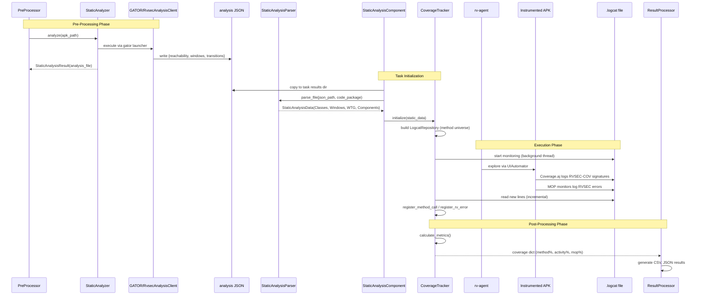

# Specification: Analysis and Coverage

## Purpose

The Analysis and Coverage domain encompasses three modules -- rv-static-analysis, rv-coverage, and rv-screen-parser -- that collectively provide the data foundation for the RV-Android system. These modules produce the static analysis data, runtime coverage metrics, and UI state representations that every other component in the pipeline depends on.

### Problem Context

Runtime verification of Android applications requires three categories of pre-computed data:

1. **Application structure data**: Before any test can run, the system needs to know which methods exist, which are reachable from entry points, and which have paths to monitored API methods. Without this, there is no denominator for coverage calculations and no basis for exploration prioritization.

2. **Runtime coverage data**: During test execution, the system needs real-time visibility into which methods have been exercised and which specification violations have occurred. This data is captured via logcat from the instrumented APK's Coverage.aj aspect and MOP monitors.

3. **UI state data**: For both LLM-driven and algorithmic exploration, the system needs structured representations of the current Android screen -- which elements exist, what actions are available, and where elements are positioned. Raw UIAutomator XML dumps are too verbose and unstructured for direct consumption.

### How This Domain Fits in the Pipeline

The three modules occupy distinct positions in the experiment lifecycle:

```
Pre-Processing Phase:
  APK -----> rv-static-analysis -----> StaticAnalysisData
                                        (Classes, Windows, WTG, Components)

Execution Phase:
  Logcat -----> rv-coverage -----> CoverageTracker
                                    (method calls, RV errors, metrics)

  UIAutomator XML -----> rv-screen-parser -----> ScreenDescription
                                                  (items, actions, coordinates)
```

The end-to-end pipeline from static analysis through execution to coverage calculation:



**rv-static-analysis** runs during the pre-processing phase of an experiment. It executes a single GATOR analysis client (`RvsecAnalysisClient`) against the original APK, producing a single JSON output file containing reachability data, window/widget inventory, and window transition graph. The `StaticAnalysisParser` then parses this file into the unified `StaticAnalysisData` domain model. This data is consumed by:
- rv-coverage (to initialize the LogcatRepository with the known method universe)
- rv-agent (to guide exploration via WTG transitions and MOP reachability)
- rv-platform (to load static data as a TaskExecutor component)

**rv-coverage** runs during the execution phase, in parallel with tool execution. The `CoverageTracker` monitors a logcat file in a background thread, parsing each line for `RVSEC-COV` (coverage) and `RVSEC` (RV error) tags. It updates a `LogcatRepository` with method calls and violations, and provides real-time coverage metrics via logging. The `CoverageAnalyzer` provides batch (offline) analysis of logcat files with fallback modes when static analysis data is unavailable.

**rv-screen-parser** runs on demand during test execution. When the rv-agent or any UI-aware tool needs to understand the current screen state, it captures a UIAutomator2 XML hierarchy dump and passes it through a parser (UIAutomator2Parser or DroidBotParser) combined with a visitor (BasicTextVisitor, DefaultTextVisitor, or EnhancedTextVisitor). The visitor traverses the UI tree and produces a `ScreenDescription` containing `ScreenItem` objects with `ItemAction` objects. The BasicTextVisitor achieves approximately 69% token reduction compared to raw XML, which is critical for LLM prompt efficiency. The module also provides screenshot analysis via OpenCV and Tesseract for detecting visual elements not present in the UI hierarchy.

### Key Design Decisions

1. **Reachability defines the method universe**: The total number of reachable methods from the analysis JSON's `reachability` section is the denominator for all coverage percentages. Without reachability data, coverage percentages cannot be computed (only absolute method call counts). The `CoverageAnalyzer` has explicit fallback modes for this scenario.

2. **Single GATOR analysis client**: A single GATOR invocation (`RvsecAnalysisClient`) produces all four data sections (reachability, windows, transitions, components) in one JSON file. The client writes sections in priority order: reachability first (coverage denominator), then windows, then transitions, then components (non-Activity component data with intent-filters, exported status, and MOP reachability). Entry points include all four Android component types: Activity lifecycle handlers, Service lifecycle methods (`onCreate`, `onStartCommand`, `onBind`, `onUnbind`, `onRebind`, `onDestroy`, `onHandleIntent`), BroadcastReceiver (`onReceive`), and ContentProvider lifecycle methods (`onCreate`, `query`, `insert`, `update`, `delete`, `call`, `openFile`). On timeout, partial JSON preserves the most critical data first.

3. **MOP means Monitored Operations, not security**: The term "MOP" refers to methods being monitored by ANY specification set (JCA cryptographic specifications or generic FSM specifications). The `reaches_mop` and `directly_reaches_mop` flags in the reachability section indicate paths to monitored API methods, regardless of specification domain. Do NOT use "security" terminology when referring to MOP coverage.

4. **Coverage.aj logs via HashSet dedup**: The Coverage.aj aspect woven into instrumented APKs logs method calls via `Log.v("RVSEC-COV", signature)` with a `HashSet` to ensure each signature is logged only once per execution. The signature format is `<className: returnType methodName(params)>`. The `LogcatParser` also supports a legacy format (`class:::method:::params`) for backward compatibility.

5. **SignatureNormalizer for inner class notation**: Static analysis tools (Soot) use `$` for inner classes (`OuterClass$InnerClass`), but the analysis JSON may use `.` notation (`OuterClass.InnerClass`). The `StaticAnalysisParser` uses `SignatureNormalizer` to convert `.` to `$` based on Java naming convention heuristics (uppercase after separator indicates inner class).

6. **PackageDetector resolves manifest vs code package**: In approximately 27.5% of APKs, the AndroidManifest.xml package name differs from the actual code package (e.g., Godot games: manifest=`ir.hsn6.trans`, code=`org.godotengine.godot`). The `PackageDetector` uses a priority-based heuristic with 6 strategies: same-package check, game engine detection, single package, common prefix, frequency-based selection, and string similarity fallback. Static analysis parsers receive `code_package` (not `package_name`) for class filtering.

7. **Visitor pattern for extensible UI parsing**: The rv-screen-parser uses the visitor pattern with `Node.accept(visitor)` dispatching to element-specific methods (`visit_button`, `visit_edit_text`, etc.). This allows different visitors to produce different output formats without modifying the parser. The visitor handles 30+ Android widget classes including standard, AndroidX AppCompat, and Material Design components.

8. **Thread-safe real-time tracking**: The `CoverageTracker` runs in a background daemon thread with `RLock` protection. It uses file position tracking (seek to end, read new lines) to process logcat entries incrementally without re-reading processed data. Change detection optimizes CPU usage by only recalculating metrics when data has actually changed.

### Data Models

```
StaticAnalysisData:
  classes: Classes              # Collection of application classes and methods (reachability section)
  windows: Windows              # Collection of UI windows and widgets (windows section)
  wtg: WindowTransitionGraph    # Navigation graph (transitions section)
  components: Components        # Non-Activity component data with intent-filters and MOP reachability (components section)

Classes:
  classes: Dict[str, Clazz]     # Class name -> class info (component_type, is_main, methods)

Clazz:
  name: str                     # Fully qualified class name
  component_type: str | None    # "activity", "service", "receiver", "provider", or None
  is_main: bool                 # True if this is the main launcher Activity
  methods: Dict[str, Method]    # Method name -> method info

Method:
  class_name: str               # Owning class
  name: str                     # Method name
  params: List[str]             # Parameter types
  signature: str                # Full signature: <class: returnType method(params)>
  reachable: bool               # Reachable from framework entry points
  reaches_mop: bool             # Has path (direct or indirect) to a monitored API method
  directly_reaches_mop: bool    # Directly invokes a monitored API method

Windows:
  windows: Dict[str, Window]    # Window name -> window info
  widgets: Dict[str, Widget]    # Widget ID -> widget info

Window:
  name: str                     # Fully qualified activity/fragment class name
  id: str                       # GATOR window ID
  type: WindowType              # ACTIVITY, SERVICE, FRAGMENT, etc.
  activity: str                 # Activity class name
  class_name: str               # Class name
  layout_file: str              # Layout XML filename
  widgets: List[Widget]         # Widgets in this window

Widget:
  id: str                       # Widget ID
  name: str                     # Widget resource name
  type: WidgetType              # BUTTON, EDIT_TEXT, TEXT_VIEW, etc.
  events: Set[WidgetEvent]      # Event handlers registered on this widget
  text: str                     # Static text content
  hint: str                     # Hint text for input fields
  input_type: str               # Input type specification

WindowTransitionGraph:
  graph: networkx.DiGraph       # Directed graph of window transitions

WindowTransition:
  widget_id: str                # Widget that triggers this transition
  event: WidgetEventType        # Event type (CLICK, LONG_CLICK, etc.)
  handler: str                  # Handler method signature

Components:
  activities: List[ComponentInfo]   # Activities with intent-filters and MOP data
  receivers: List[ComponentInfo]    # BroadcastReceivers with intent-filters and MOP data
  services: List[ComponentInfo]     # Services with intent-filters and MOP data
  providers: List[ComponentInfo]    # ContentProviders with authorities and MOP data

ComponentInfo:
  class_name: str                   # Fully qualified class name
  component_type: str               # "activity", "service", "receiver", "provider"
  is_main: bool                     # True if this is the main launcher Activity
  intent_filters: List[IntentFilter]  # Intent filters (empty for providers)
  authorities: str | None           # Content provider authorities (providers only)
  exported: bool                    # Whether the component is exported
  reaches_mop: bool                 # Whether lifecycle methods reach monitored operations
  mop_methods: List[str]            # Signatures of lifecycle methods reaching MOP

IntentFilter:
  actions: List[str]                # Intent actions (e.g., "android.intent.action.MAIN")
  categories: List[str]             # Intent categories (e.g., "android.intent.category.LAUNCHER")

RvCoverageLog:
  clazz: str                    # Fully qualified class name
  method: str                   # Method name
  params: str                   # Parameter types
  signature: str                # Full method signature
  time_occurred: datetime       # When the method was called
  time_since_task_start: int    # Seconds since tool execution started

RvErrorLog:
  spec: str                     # Specification name (e.g., CipherSpec, MessageDigestSpec)
  error_type: str               # Error classification
  class_full_name: str          # Class where violation occurred
  method: str                   # Method where violation was detected
  source: str                   # Source file or monitor location
  message: str                  # Violation description
  time_occurred: datetime       # When the violation was detected
  time_since_task_start: int    # Seconds since tool execution started

LogcatRepository:
  classes: Dict[str, ...]       # Known classes from static analysis
  errors: List[RvErrorLog]      # Registered RV errors
  # Provides: register_method_call(), register_rv_error(), calculate_metrics()

ScreenDescription:
  activity: str                 # Current activity name
  items: List[ScreenItem]       # All UI elements with actions
  events_by_id: Dict[int, ItemAction]  # Action ID -> action lookup

ScreenItem:
  view: Dict[str, Any]          # Raw UI element data
  base_description: str         # Human-readable element description
  actions: List[ItemAction]     # Available actions for this element
  complement: Dict[str, Any]    # Additional metadata

ItemAction:
  id: int                       # Unique action ID within screen
  text: str                     # Action description
  event: WidgetEventType        # Widget event type
  reaches_mop: bool             # Action reaches monitored operations
  directly_reaches_mop: bool    # Action directly reaches monitored operations
  target_view: Dict[str, Any]   # Target element properties
  coordinates: Tuple[int, int]  # Explicit action coordinates
  widget_id: str                # Target widget ID
  callback_signature: str       # Callback method signature
  text_input: str               # Text value for TEXT_CHANGE actions
  action_type: str              # Computed: click, set_text, scroll, etc.
  coords_for_matching: Tuple    # Computed: ((x, y), action_type) signature

Node:
  data: Dict[str, Any]          # Raw UI element data from UIAutomator
  children: List[Node]          # Child nodes in UI hierarchy
  parent: Node                  # Parent node reference
  clickable: bool               # Supports click
  scrollable: bool              # Supports scroll
  editable: bool                # Supports text editing
  view_class: str               # Android widget class name
  bounds: List[List[int]]       # Bounding box [[x1,y1],[x2,y2]]
  actionable: bool              # Computed: supports any interaction

PackageDetectionResult:
  manifest_package: str         # Package from AndroidManifest.xml
  code_package: str             # Detected implementation package
  confidence: str               # "high", "medium", "low"
  detection_method: str         # Heuristic that produced the result
  all_packages: List[str]       # All candidate packages found
  similarity_score: float       # Similarity score (0.0-1.0) if similarity_match
  game_engine: str              # Detected game engine name, if any

StaticAnalysisResult:
  analysis_file: str            # Path to unified analysis JSON output file
  timed_out: bool               # Whether analysis exceeded timeout (partial JSON may exist)
  success: bool                 # Overall pipeline success
  errors: List[str]             # Error messages during analysis

CoverageCalculationMode:
  FULL_STATIC_ANALYSIS          # Complete static data available
  PARTIAL_STATIC_ANALYSIS       # Limited static data (< 10 methods)
  RUNTIME_ONLY                  # No static data, only runtime
  FALLBACK_MODE                 # Minimal functionality
```

### Cross-Domain Dependencies

```
rv-static-analysis:
  Depends on: rv-android-core (App, Classes, Windows, WTG, Components, ErrorHandler, LoggingManager)
  Consumed by: rv-platform (StaticAnalysisComponent), rv-agent (TransitionManager, MOP prioritization),
               rv-coverage (repository initialization), rv-experiment (pre-processing phase)

rv-coverage:
  Depends on: rv-android-core (LogcatRepository, RvErrorLog, RvCoverageLog)
  Consumed by: rv-platform (CoverageComponent), rv-experiment (post-processing)

rv-screen-parser:
  Depends on: rv-android-core (StaticAnalysisData for MOP tracking, WidgetEventType, ErrorHandler)
  Consumed by: rv-agent (ScreenProcessor), rv-uiautomator (device interaction)
```

## Data Contracts

### Input

- `apk_path: str` -- Path to Android APK file (source: rv-experiment or user, consumed by StaticAnalyzer)
- `code_package: str` -- Application code package name (source: App.code_package via PackageDetector, consumed by StaticAnalysisParser for class filtering)
- `rvsec_root: str` -- Path to RVSEC installation (source: RVSEC_HOME env var or explicit, consumed by RVStaticAnalysisConfig for tool path resolution)
- `mop_dir: str` -- Path to MOP specification directory (source: RVStaticAnalysisConfig, consumed by the analysis client via `-clientParam mopDir=<path>`)
- `analysis_timeout: float` -- Timeout in seconds for the analysis tool (default: 600.0). Passed both as `Command.timeout` (Python process-level kill) and `--timeout` (GATOR's internal timeout)
- `analysis_client_jar: str` -- Path to the analysis client fat JAR (`lib/gator/rvsec-analysis-client.jar`)
- `logcat_file: str` -- Path to Android logcat output file (source: LogcatComponent in rv-platform, consumed by CoverageTracker and CoverageAnalyzer)
- `static_data: StaticAnalysisData` -- Parsed static analysis data (source: StaticAnalyzer.get_static_data(), consumed by CoverageTracker for repository initialization)
- `xml_data: str` -- UIAutomator2 XML hierarchy dump string (source: uiautomator2 device.dump_hierarchy(), consumed by UIAutomator2Parser)
- `screenshot_path: str` -- Path to screenshot image file (source: device screenshot capture, consumed by ScreenshotAnalyzer)
- `task_start_time: datetime` -- Tool execution start time (source: rv-platform TaskExecutor, consumed by CoverageTracker for relative timing)
- `task_id: str` -- Task identifier for event correlation (source: rv-platform, consumed by CoverageTracker)

### Output

- `StaticAnalysisData` -- Unified static analysis results containing Classes, Windows, WTG, and Components (destination: rv-platform StaticAnalysisComponent, rv-agent, rv-coverage)
- `StaticAnalysisResult` -- Analysis pipeline status with analysis file path, timeout flag, and errors (destination: rv-experiment pre-processing)
- `Dict[str, float]` -- Coverage metrics dictionary with method_coverage, activity_coverage, mop_method_coverage, called_methods, total_errors (destination: rv-platform CoverageComponent)
- `ScreenDescription` -- Complete screen state with items, actions, and coordinates (destination: rv-agent ScreenProcessor, LLM prompt generation)
- `ScreenshotAnalysisResult` -- Visual analysis results with detected texts, buttons, errors, and interactive elements (destination: rv-agent screenshot analysis)
- `PackageDetectionResult` -- Package detection result with code_package, confidence, and detection method (destination: App.code_package property)

### Side-Effects

- **File System (analysis)**: Creates `{app_name}.json` analysis output file in output directory containing reachability, windows, transitions, and components sections
- **File System (logcat)**: CoverageTracker creates empty logcat file if it does not exist
- **Background Thread**: CoverageTracker starts a daemon thread for continuous logcat monitoring; thread terminates on stop() or context manager exit

### Error

- `StaticAnalysisException` -- Raised when the analysis tool returns a non-zero exit code. Contains tool name ("ANALYSIS"), exit code, and stderr output.
- `RVCommandTimeoutError` -- Raised when the analysis tool exceeds `analysis_timeout`. The `Command` class kills the process tree via `kill_process_tree()`.
- `ConfigurationError` -- Raised by RVStaticAnalysisConfig when required paths are missing (analysis client JAR, MOP directory, Android SDK).
- `ValueError` -- Raised by ItemAction coordinate validation when coordinates are not a 2-element integer tuple or contain negative values.
- Parser errors -- Caught internally and logged; the parser returns empty domain objects per-section (empty Classes, empty Windows, empty WindowTransitionGraph, empty Components) on failure rather than propagating exceptions.

## Invariants

- **INV-ANA-02**: The `StaticAnalysisParser` MUST apply `SignatureNormalizer` to all class names and method signatures before storing them in domain models. The normalization converts inner class dot notation (`OuterClass.InnerClass`) to dollar notation (`OuterClass$InnerClass`) using Java naming convention heuristics. The normalizer is applied in all three JSON sections (`windows`, `transitions`, `reachability`).

- **INV-ANA-03**: The `StaticAnalysisParser` MUST receive `code_package` (from `App.code_package`, detected by `PackageDetector`) for class filtering, NOT `package_name` (from AndroidManifest.xml). The parser MUST filter classes in the `reachability` section and windows in the `windows` section by verifying that class names contain the `code_package` string.

- **INV-ANA-04**: The `CoverageTracker` MUST log coverage metric updates whenever coverage metrics change. It MUST log MOP error detections immediately when an RV error is detected. Log entries MUST include the `task_id` if one was provided during initialization.

- **INV-ANA-05**: The `CoverageTracker` MUST be thread-safe. All shared state access MUST be protected by the `_reader_lock` (RLock). The background monitoring thread MUST be a daemon thread that terminates when stop() is called or the context manager exits.

- **INV-ANA-06**: The `StaticAnalysisParser` MUST NOT propagate exceptions to callers. On parse failure of any section (`windows`, `transitions`, `reachability`), it MUST log the error and return empty domain objects for that section: `Windows()` for window parsing failures, `WindowTransitionGraph()` for transition parsing failures, `Classes()` for reachability parsing failures. Each section is parsed independently — a failure in one section MUST NOT prevent parsing of other sections.

- **INV-ANA-07**: The `LogcatParser` MUST support two coverage message formats: the modern format (`<class: returnType method(params)>`) and the legacy format (`class:::method:::params`). Both formats MUST produce valid `RvCoverageLog` instances.

- **INV-ANA-08**: The `LogcatParser` MUST support three error message formats: the standard JCA format (comma-separated: `spec,class,init,method,source,error_type,message`), the FSM format (`class.method():::Spec went into an error state.`), and the generic format (`class.method(file:line) ::: Spec went into an error state.`). Malformed messages MUST be logged as warnings and return None, not malformed data.

- **INV-ANA-09**: The `ItemAction.action_type` computed property MUST derive the action type from `WidgetEventType` as the single source of truth, using the `WIDGET_EVENT_TO_ACTION_TYPE` mapping. Text parsing MUST only be used for scroll direction refinement (scroll_up, scroll_down, scroll_left, scroll_right), never for primary type classification.

- **INV-ANA-10**: The `ScreenDescription` MUST build an `events_by_id` mapping from all `ItemAction` objects across all `ScreenItem` elements. The `get_action_by_id()` method MUST return the correct `ItemAction` for any valid ID within the screen context.

- **INV-ANA-11**: The `StaticAnalyzer` MUST implement intelligent caching: if the analysis `.json` output file already exists, tool execution MUST be skipped. A `CommandResult(0, b"", b"")` MUST be returned for cached results. An info log with `execution_status='cached'` MUST be recorded.

- **INV-ANA-12**: The `Node.accept(visitor)` method MUST dispatch to element-specific visitor methods based on `view_class` (e.g., `visit_button` for `android.widget.Button`). System navigation buttons (navbar, status bar) MUST be filtered by calling `visitor.should_exclude_system_button(node)` for leaf nodes only, never for container nodes. Container filtering would exclude all children.

- **INV-ANA-13**: `ItemAction.coordinates` MUST be validated as a non-negative integer tuple of exactly 2 elements `(x, y)`, or None. The `get_execution_coordinates()` method MUST resolve coordinates using priority: (1) explicit coordinates, (2) target view bounds center.

- **INV-ANA-14**: The `PackageDetector` MUST apply detection heuristics in the following priority order: (1) same-as-manifest, (2) game engine detection, (3) single package, (4) common prefix, (5) most common (60%+ frequency), (6) string similarity (85%+ threshold), (7) manifest fallback. Each strategy returns early if a match is found.

- **INV-ANA-15**: Coverage metrics MUST be calculated with reachability data as the denominator. `method_coverage` = (called methods) / (total reachable methods from the analysis JSON's reachability section). `mop_method_coverage` = (called methods that reach MOP) / (total methods with reaches_mop=true). Without reachability data, percentage-based coverage MUST NOT be reported; only absolute counts are valid.
## Requirements
### Requirement: Unified Static Analysis — Window Transition Graph, GUI Elements, and Method Reachability (FR04, FR05, FR06)

The system MUST run a single GATOR analysis client to produce a single JSON output file containing four data sections written in priority order: (1) method reachability relative to MOP specifications (coverage denominator), (2) window and widget inventory with event listeners, (3) window transition graph, and (4) non-Activity component data (Services, BroadcastReceivers, ContentProviders) with intent-filters/authorities and MOP reachability.

The analysis tool is a GATOR client (`RvsecAnalysisClient`) that implements the `GUIAnalysisClient` interface. GATOR initializes Soot once with defensive configuration (INV-ANA-16), builds its constraint graph and fixpoint analysis, and then invokes the client's `run(GUIAnalysisOutput output)` method. Inside this method, the client writes each JSON section incrementally with explicit flush, so that a timeout or crash after any section produces a parseable partial file.

The `Flowgraph.processApplicationClasses()` method MUST handle individual method failures gracefully (INV-ANA-17). When `retrieveActiveBody()` or `createOpNode()` throws an exception for a specific method, the Flowgraph MUST skip that method and continue processing remaining methods. The resulting Flowgraph may be incomplete (missing OpNodes, widgets, or listeners for skipped methods), but the GUIAnalysis pipeline MUST complete and the `RvsecAnalysisClient` MUST produce JSON output. Reachability data (computed from `Scene.v().getCallGraph()` via BFS) is NOT affected by Flowgraph incompleteness — it depends on the Soot call graph, not on the Flowgraph.

The GATOR MUST use Soot 4.7.1 (`org.soot-oss:soot`, INV-ANA-18) with defensive configuration (INV-ANA-16). The `ClassHierarchy.typeNode()` bug (soot-oss/soot#1071) is not fixed in Soot 4.7.1, but the improved Dexpler in 4.x reduces crash frequency. The defensive options (excluding `kotlin.*`, `kotlinx.*`, and `androidx.compose.*` from body loading, disabling `jb.sils`/`jb.dae`) further reduce the crash surface. Together, these changes form a layered defense: prevention (FIX 1), recovery (FIX 2), and fundamental improvement (FIX 3).

The execution order inside `run()`:

1. **Enumerates application classes and computes method reachability** using `Scene.v().getApplicationClasses()` for class/method enumeration and `Scene.v().getCallGraph()` + JGraphT for reachability flags. Entry points include: Activity lifecycle handlers and public/protected methods (via `output.getActivities()`), Service lifecycle methods (`onCreate`, `onStartCommand`, `onBind`, `onUnbind`, `onRebind`, `onDestroy`, `onHandleIntent`) and public/protected methods (via `XMLParser.getServices()`), BroadcastReceiver lifecycle method (`onReceive`) and public/protected methods (via `XMLParser.getReceivers()`), and ContentProvider lifecycle methods (`onCreate`, `query`, `insert`, `update`, `delete`, `call`, `openFile`) and public/protected methods (via `XMLParser.getProviders()`). Service, Receiver, and Provider class names are resolved to `SootClass` via `Scene.v().getSootClassUnsafe()`, which returns `null` for unresolvable classes (logged as WARNING, skipped). Lifecycle methods are found by iterating `SootClass.getMethods()` and filtering by name. For each application method, it computes: `reachable` (reachable from entry points), `reachesMop` (has path to a monitored API method), and `directlyReachesMop` (directly invokes a monitored API method). MOP method signatures are loaded from `.mop` specification files via `JavamopFacade`. This section is written and flushed first.

2. **Extracts windows and widgets** using GATOR's internal APIs (`getActivities()`, `getActivityRoots()`, `PropertyManager`). GATOR's interprocedural analysis provides the widget inventory (IDs, names, types, text, hint, listeners) including dynamically-registered listeners discovered through interprocedural data flow. Two fields not available via GATOR APIs — `inputType` and `entries` — are extracted by parsing the decoded layout XML files at `Configs.resourceLocation`.

3. **Extracts the Window Transition Graph** using GATOR's `WTGBuilder` and `WTGAnalysisOutput`, producing window IDs, transition edges with event types, widget IDs, and handler signatures.

4. **Extracts non-Activity components** (Services, BroadcastReceivers, ContentProviders) from `XMLParser.getServices()`, `XMLParser.getReceivers()`, and `XMLParser.getProviders()`, enriched with intent-filters from `IntentFilterManager` (for Services/Receivers) or `android:authorities` attribute (for Providers), `android:exported` attribute from the manifest, and MOP reachability cross-referenced with the reachability BFS results. This section is written and flushed last — lowest priority for timeout graceful degradation.

The `complementWithCallbacks()` method, which propagates MOP flags for lifecycle and event handlers, MUST also include Service, Receiver, and Provider lifecycle methods in its callback set, so they receive MOP flag propagation via the call graph.

Each entry in `reachability[]` MUST include `componentType` (string: `"activity"`, `"service"`, `"receiver"`, `"provider"`, or `null`) and `isMain` (boolean) fields. The old `isActivity` and `isMainActivity` fields are removed. The `StaticAnalysisParser` (Python) MUST parse these fields into the `Clazz` domain model (`component_type: str | None`, `is_main: bool`).

The analysis JSON output is parsed by `StaticAnalysisParser` into the `StaticAnalysisData` domain model (Classes, Windows, WindowTransitionGraph, Components). Downstream consumers (rv-agent, rv-coverage, rv-platform) receive this data structure.

The reachability section defines the **method universe** — the total set of reachable methods that serves as the denominator for all coverage percentage calculations. Without reachability data, the system can count absolute method calls but cannot compute coverage percentages. The `CoverageAnalyzer` explicitly switches to `RUNTIME_ONLY` or `FALLBACK_MODE` when reachability data is unavailable.

The reachability section also provides MOP prioritization data consumed by rv-agent. The `MopScorer` in rv-agent's `ActionRanker` assigns +100 score to actions with `directly_reaches_mop=true` and +50 to actions with `reaches_mop=true`, directing exploration toward MOP-relevant code paths.

The call graph is built using SPARK (`-cgAlgorithm spark`) with `all-reachable:true`, which performs full points-to analysis to resolve virtual calls based on types effectively instantiated in the program. SPARK is the operational default per design.md D5 — full points-to analysis tightens `reachesMop` against the over-approximation that pure type-hierarchy resolution (CHA) would produce on Android codebases with deep inheritance and pervasive Kotlin `FunctionN` interfaces. Other algorithms — CHA (`-cgAlgorithm cha`), RTA (`-cgAlgorithm rta`), VTA (`-cgAlgorithm vta`) — remain available; the legacy `-withCHA` flag is accepted as an alias for `-cgAlgorithm cha` for backward compatibility. If the chosen algorithm crashes due to residual `InternalTypingException` (after defensive options and Soot 4.7.1), the analysis fails for that APK — there is no Flowgraph-level recovery for call-graph-phase crashes. JCA framework classes (`javax.crypto.Cipher`, `java.security.MessageDigest`, etc.) appear as call targets whenever any application method invokes them — they do not need to be entry points.

**Module**: rv-static-analysis (launcher + parser — unchanged), rvsec-gator (analysis client — modified)
**Key components**: `Main.java` (Soot config), `Flowgraph.java` (error handling), `RvsecAnalysisClient` (unchanged), `XMLParser`, `DefaultXMLParser`, `IntentFilterManager`, `StaticAnalysisParser` (unchanged), `Clazz`

#### Scenario: Successful static analysis with valid APK

- **WHEN** `StaticAnalyzer._run_analysis()` is called with a valid APK path and the analysis client JAR exists at `lib/gator/rvsec-analysis-client.jar`
- **THEN** the system MUST execute the GATOR Python script with arguments: `python gator a -p <apk_path> --client-jar <analysis_client_jar> --out <output_file> -client RvsecAnalysisClient -clientParam mopDir=<mop_dir> --timeout <timeout> -cgAlgorithm spark` (or another value of `-cgAlgorithm` if the caller overrode the default)
- **AND** the resulting `.json` file MUST be parseable by `StaticAnalysisParser` into a `StaticAnalysisData` containing non-empty `Classes`, `Windows`, `WindowTransitionGraph`, and `Components`
- **AND** the `.json` file MUST contain a `components` section (may have empty `receivers[]`, `services[]`, and `providers[]` arrays)

#### Scenario: GATOR crashes during call graph construction

- **WHEN** Soot's call-graph builder (`CHATransformer.internalTransform()` for `-cgAlgorithm cha`, or the SPARK pipeline for `rta`/`vta`/`spark`) throws an `InternalTypingException` during call graph construction for a method in a Kotlin class
- **THEN** the GATOR process MUST terminate with a non-zero exit code
- **AND** no `.json` output file MUST exist (the crash occurs before `RvsecAnalysisClient.run()` is invoked)
- **AND** the `StaticAnalyzer` wrapper MUST log the failure as `StaticAnalysisException`
- **AND** the `StaticAnalysisResult.analysis_file` MUST point to the expected output path (which does not exist)

#### Scenario: Flowgraph skips method with failing body (Scenario B recovery)

- **WHEN** `Flowgraph.processApplicationClasses()` calls `currentMethod.retrieveActiveBody()` and Soot throws an exception (e.g., `InternalTypingException`) for a specific method
- **THEN** the exception MUST be caught by the try-catch around `retrieveActiveBody()` (INV-ANA-17)
- **AND** a log MUST be emitted via `Logger.warn()` with the skipped method's signature and exception message
- **AND** the loop MUST continue to the next method via `continue`
- **AND** the Flowgraph MUST complete with partial data (missing OpNodes for the skipped method)
- **AND** the `RvsecAnalysisClient.run()` MUST execute and produce a JSON file

#### Scenario: Flowgraph skips statement with failing OpNode creation

- **WHEN** `Flowgraph.processApplicationClasses()` calls `createOpNode(currentStmt)` and the method throws an exception for a specific statement
- **THEN** the exception MUST be caught by the existing catch block (line 343, INV-ANA-17)
- **AND** a log MUST be emitted via `Logger.warn()` with the skipped statement and exception message
- **AND** the loop MUST continue to the next statement via `continue`
- **AND** the resulting Flowgraph MUST be missing the OpNode for that statement but otherwise complete

#### Scenario: Kotlin stdlib exclusion impact on reachability

- **WHEN** GATOR analyzes an APK with Kotlin dependencies and `-exclude kotlin.`, `-exclude kotlinx.`, and `-exclude androidx.compose.` are active
- **THEN** classes in `kotlin.*`, `kotlinx.*`, and `androidx.compose.*` packages MUST NOT have their bodies jimplified
- **AND** the call graph MUST still contain edges from application code to excluded package methods (as phantom refs)
- **AND** the `reachability` section of the output JSON MUST NOT include excluded-package classes (they are not application classes)
- **AND** for JCA specifications (`javax.crypto.*`, `java.security.*`), reachability MUST NOT be affected because JCA APIs are called by application code, not by Kotlin stdlib or Compose runtime

#### Scenario: Analysis output baseline comparison after Soot upgrade

- **WHEN** the analysis tool analyzes `cryptoapp.apk` with Soot 4.7.1 (Feb 2026) and its output is compared against the saved baseline (produced with Soot 3.3.0)
- **THEN** window count MUST match exactly (±0)
- **AND** transition count MUST match exactly (±0)
- **AND** total method count MUST match exactly (±0)
- **AND** `reachable` and `reachesMop` method counts MAY differ by up to ±10% due to Soot version change (3.3.0 → 4.7.1) — differences MUST be documented
- **AND** `directlyReachesMop` counts MUST match or strictly INCREASE relative to the saved baseline because the bytecode-scan complement (BUG-INV-ANA-19) recovers literal MOP invocations the call graph alone misses; the baseline is a lower bound, never an upper bound
- **AND** widget `inputType` and `entries` fields MUST match GESDA output for the same APK

#### Scenario: `directlyReachesMop` detects literal library MOP invocations omitted by SPARK (BUG-INV-ANA-19)

- **WHEN** an application method's bytecode contains a literal `invoke-direct`, `invoke-virtual`, `invoke-static`, or `invoke-interface` whose target's `(declaringClass.getName(), methodRef.name())` matches a MOP signature loaded from the `mopDir` (e.g. `java.security.SecureRandom.<init>` or `java.security.SecureRandom.nextInt` for the `SecureRandomSpec` MOP)
- **AND** Soot's SPARK call graph does NOT contain that target as a vertex (because library packages like `java.security.*` are quarantined as IGNORED_CLASSES and SPARK omits their edges)
- **THEN** `findDirectMopCallersByBytecodeScan` MUST detect the invocation by walking the method's `Body.getUnits()`, casting each to `Stmt`, and inspecting `InvokeExpr.getMethodRef()` against the precomputed `Set<String>` of `"className#methodName"` keys
- **AND** the detection MUST be independent of the call graph — it works even when `graph.containsVertex(target) == false`
- **AND** the matched method MUST be unioned into `directMopSet` after `findDirectMopCallers` completes
- **AND** the output JSON MUST report `directlyReachesMop=true` for that method
- **AND** the implementation MUST log scan statistics: `[RvsecAnalysisClient] Bytecode scan: <S> methods scanned, <B> body-retrieval skips, <K> direct MOP callers detected` and `[RvsecAnalysisClient] directlyReachesMop: <N> (CG: <M>, bytecode: <K>, intersection: <I>)` so users can audit how many additional callers the bytecode complement contributed
- **AND** match policy MUST mirror `resolveMopInScene` — by FQN class + method name, ignoring parameter overloads — so an `InvokeExpr` of any overload of a MOP-declared method matches the same key

#### Scenario: Bytecode-scan resilience on corrupted method bodies

- **WHEN** the bytecode scanner attempts `method.retrieveActiveBody()` and Soot raises a `RuntimeException` (typing failure, unresolved reference) or `OutOfMemoryError` (deep generic Kotlin types) on a single application method
- **THEN** the scanner MUST catch the throwable, emit a WARN log including the method signature and exception message, and `continue` to the next method
- **AND** the body-retrieval skip MUST be counted in the `bodies_skipped` log statistic
- **AND** the scanner MUST NOT abort the analysis — partial results from successfully scanned methods MUST still be unioned into `directMopSet`
- **AND** the resilience policy MUST mirror Flowgraph.java FIX 2 (INV-ANA-17) so a single corrupt class does not invalidate the rest of the analysis

#### Scenario: Bytecode-scan scope is limited to application classes

- **WHEN** the bytecode scanner runs as part of `RvsecAnalysisClient.run`
- **THEN** it MUST iterate only the `appClasses` map produced by `extractClasses` (already filtered by `code_package` to drop libraries and generated `R`/`BuildConfig`)
- **AND** it MUST NOT iterate every class in `Scene.v().getClasses()` — library callers are out of scope for `directlyReachesMop` semantics (the predicate asks which APP methods directly invoke MOP-monitored APIs)
- **AND** the union with `directMopSet` MUST therefore never report a library class as a direct MOP caller

### Requirement: Method Coverage Tracking (FR12, NFR06)

The system MUST track method coverage in real-time during test execution via the `CoverageTracker`, and provide batch analysis via the `CoverageAnalyzer`. Coverage tracking relies on the instrumented APK's Coverage.aj aspect, which logs unique method signatures to Android logcat using the `RVSEC-COV` tag.

The `CoverageTracker` monitors a logcat file in a background daemon thread. It reads new lines incrementally (using file position tracking to avoid re-reading), parses each line via `parse_logcat_line()`, and registers method calls in the `LogcatRepository`. When initialized with `StaticAnalysisData`, the repository is populated with the known method universe from the analysis JSON's reachability section, enabling percentage-based coverage calculation.

Two types of coverage are tracked:
- **Overall method coverage**: Percentage of all reachable application methods exercised during testing. Best observed: 26.77% (Humanoid at 300s) in the ICST study.
- **MOP method coverage**: Percentage of methods with paths to monitored API methods exercised during testing. Best observed: 17.16% (Humanoid at 300s).

The `CoverageTracker` logs coverage metric updates when metrics change, including method_coverage, activity_coverage, mop_method_coverage, called_methods, total_activities, and unique_errors. It uses change detection to avoid redundant metric calculations and logging.

The `CoverageAnalyzer` provides offline analysis with four calculation modes: FULL_STATIC_ANALYSIS (complete static data), PARTIAL_STATIC_ANALYSIS (limited data, < 10 methods), RUNTIME_ONLY (no static data), and FALLBACK_MODE (minimal functionality). It can process logcat files, individual RvCoverageLog entries, RvErrorLog entries, or lists thereof.

#### Scenario: Real-time coverage tracking with CoverageTracker

- **WHEN** CoverageTracker is started with a logcat file path and static analysis data
- **THEN** a daemon background thread MUST be started to monitor the logcat file
- **AND** existing lines in the file MUST be processed first
- **AND** the file position MUST be moved to the end after initial processing
- **AND** new lines MUST be read and processed in a continuous loop with adaptive sleep (0.5s with data, 1.0s without)

#### Scenario: Coverage log parsing (modern format)

- **WHEN** a logcat line contains `RVSEC-COV: <com.example.App: void doEncrypt(javax.crypto.Cipher)>`
- **THEN** parse_logcat_line() MUST return a RvCoverageLog with clazz=`com.example.App`, method=`doEncrypt`, params=`javax.crypto.Cipher`
- **AND** CoverageTracker MUST register the method call in LogcatRepository
- **AND** _data_changed_since_last_update MUST be set to True

#### Scenario: Coverage log parsing (legacy format)

- **WHEN** a logcat line contains `RVSEC-COV: com.example.App:::doEncrypt:::javax.crypto.Cipher`
- **THEN** parse_logcat_line() MUST return a RvCoverageLog with clazz=`com.example.App`, method=`doEncrypt`, params=`javax.crypto.Cipher`

#### Scenario: CoverageTracker context manager lifecycle

- **WHEN** CoverageTracker is used as a context manager (`with tracker.track_coverage() as t:`)
- **THEN** start() MUST be called on entry
- **AND** stop() MUST be called on exit (including on exception)
- **AND** the background thread MUST join with a 5-second timeout on stop()

#### Scenario: CoverageAnalyzer batch processing of logcat file

- **WHEN** CoverageAnalyzer.analyze() is called with a logcat file path string
- **THEN** it MUST delegate to process_logcat_file()
- **AND** all errors from the parsed repository MUST be transferred to the analyzer's repository
- **AND** the returned metrics dictionary MUST include method_coverage, activities_coverage, methods_jca_reachable_coverage, total_errors, and total_method_calls

### Requirement: Specification Violation Detection (FR13)

The system MUST detect and record violations of MOP specifications (RV errors) reported via logcat during test execution. Violations are logged by the runtime monitors woven into the instrumented APK, using the `RVSEC` logcat tag. The `CoverageTracker` detects these violations in real-time and logs them immediately.

Three error message formats are supported by the `LogcatParser`:

1. **Standard (JCA) format**: `spec,class,init,method,source,error_type,message` -- Used by JCA specification monitors. Example: `CipherSpec,com.example.Crypto,<init>,doEncrypt,Crypto.java,MISUSE,Algorithm not allowed`

2. **FSM format**: `class.method():::Spec went into an error state.` -- Used by FSM-based generic specifications. Example: `java.util.Iterator.next():::HasNext went into an error state.`

3. **Generic format**: `class.method(file:line) ::: Spec went into an error state.` -- Used by generic specifications with source location. Example: `com.example.IO.read(IO.java:42) ::: InputStream_ManipulateAfterClose went into an error state.`

Each parsed error produces an `RvErrorLog` with spec, error_type, class_full_name, method, source, and message fields. The `LogcatRepository` stores all registered errors and provides deduplication via the `unique_msg` computed field.

In the ICST study, the top 4 violation classes (SSLContextSpec, MessageDigestSpec, CipherSpec, SecretKeySpecSpec) accounted for 78% of 230 unique violations. 33.91% originated from application code; the rest from external libraries.

#### Scenario: Standard (JCA) error format parsing

- **WHEN** a logcat line contains `RVSEC: CipherSpec,com.example.Crypto,<init>,doEncrypt,Crypto.java:15,MISUSE,Using weak algorithm DES`
- **THEN** parse_logcat_line() MUST return an RvErrorLog with spec=`CipherSpec`, class_full_name=`com.example.Crypto`, method=`doEncrypt`, error_type=`MISUSE`

#### Scenario: FSM error format parsing

- **WHEN** a logcat line contains `RVSEC: java.util.Iterator.next():::HasNext went into an error state.`
- **THEN** parse_logcat_line() MUST return an RvErrorLog with spec=`HasNext`, class_full_name=`java.util.Iterator`, method=`next`

#### Scenario: Generic error format parsing

- **WHEN** a logcat line contains `RVSEC: com.example.IO.read(IO.java:42) ::: InputStream_ManipulateAfterClose went into an error state.`
- **THEN** parse_logcat_line() MUST return an RvErrorLog with spec=`InputStream_ManipulateAfterClose`, class_full_name=`com.example.IO`, method=`read`, source=`IO.java`

#### Scenario: MOP error detection and registration

- **WHEN** CoverageTracker processes a logcat line that yields an RvErrorLog
- **THEN** the error MUST be registered in LogcatRepository via register_rv_error()
- **AND** a log entry MUST be emitted with spec, error_type, class_full_name, method, message, and time_since_task_start

#### Scenario: Malformed error message handling

- **WHEN** a logcat line contains `RVSEC: some malformed message that does not match any format`
- **THEN** _parse_error_message() MUST log a warning
- **AND** MUST return None (not a malformed RvErrorLog)
- **AND** CoverageTracker MUST NOT register any error

#### Scenario: Logcat timestamp to datetime conversion with year handling

- **WHEN** a logcat line has date `12-31` and is parsed in January of the following year
- **THEN** _convert_to_datetime() MUST attribute the log to the previous year
- **AND** all other months MUST use the current year

### Requirement: UI Screen Parsing (FR23 - Analysis Component)

The rv-screen-parser module MUST parse Android UI state from UIAutomator2 XML hierarchy dumps and DroidBot JSON state data into standardized `ScreenDescription` objects. The parsing system uses a factory pattern for parser selection and a visitor pattern for UI tree traversal, producing structured output suitable for LLM consumption and algorithmic exploration.

The `UIAutomator2Parser` handles XML dumps from the `uiautomator2` library. It converts XML elements into a tree of `Node` objects, where each Node extracts properties (clickable, scrollable, editable, text, bounds, resource_id, etc.) from the XML attributes. The parser then applies a visitor to the node tree.

The visitor pattern is the core of the transformation. `AbstractScreenVisitor` defines the interface with element-specific methods (`visit_button`, `visit_edit_text`, `visit_checkbox`, etc.) and common infrastructure (MOP tracking via StaticAnalysisData, system button filtering for navbar/status bar elements). Three concrete visitors are provided:

- **BasicTextVisitor**: Produces compact descriptions optimized for LLM token efficiency, achieving approximately 69% reduction compared to raw XML. This is the default visitor used by rv-agent.
- **DefaultTextVisitor**: Standard visitor with default formatting.
- **EnhancedTextVisitor**: Comprehensive analysis with detailed coordinate information.

The `Node.accept(visitor)` method implements the dispatch. For leaf nodes, it checks `should_exclude_system_button()` and then dispatches to the appropriate `visit_*` method based on `view_class`, falling back to `visit_leaf_node` for unmapped classes. For container nodes, it handles specialized containers (Spinner, RadioGroup, ChipGroup) and recursively traverses children. Container nodes are NOT filtered for system buttons because containers often span the full screen height.

Each visitor produces `ScreenItem` objects containing `ItemAction` objects. The `ItemAction` carries MOP tracking flags (`reaches_mop`, `directly_reaches_mop`) derived from the static analysis `WidgetEvent` data when available.

#### Scenario: UIAutomator XML parsing to ScreenDescription

- **WHEN** UIAutomator2Parser.parse() is called with a valid XML string and activity name
- **THEN** it MUST produce a ScreenDescription with the correct activity
- **AND** each actionable XML element MUST be represented as a ScreenItem with appropriate ItemActions
- **AND** the events_by_id mapping MUST contain all ItemAction objects indexed by their unique IDs

#### Scenario: Visitor pattern dispatch for widget types

- **WHEN** Node.accept(visitor) is called on a leaf node with view_class `android.widget.Button`
- **THEN** the visitor's `visit_button(node)` method MUST be called
- **AND** for `android.widget.EditText`, `visit_edit_text(node)` MUST be called
- **AND** for `com.google.android.material.button.MaterialButton`, `visit_button(node)` MUST be called (Material Design mapping)
- **AND** for unknown classes, `visit_leaf_node(node)` MUST be called as fallback

#### Scenario: System button filtering for leaf nodes only

- **WHEN** Node.accept(visitor) is called on a leaf node that the visitor identifies as a system button (navbar, status bar)
- **THEN** the node MUST be skipped (no visitor method called)
- **AND** WHEN Node.accept(visitor) is called on a container node that spans the full screen
- **THEN** the container MUST NOT be filtered; all its children MUST be processed recursively

#### Scenario: MOP tracking in ItemAction

- **WHEN** a visitor creates an ItemAction for a widget that has WidgetEvent data from StaticAnalysisData
- **THEN** the ItemAction's reaches_mop and directly_reaches_mop flags MUST reflect the corresponding WidgetEvent callback method's reachability flags
- **AND** the widget_id and callback_signature fields SHOULD be populated from the WidgetEvent data

#### Scenario: ItemAction coordinate resolution

- **WHEN** ItemAction.get_execution_coordinates() is called on an action with explicit coordinates (540, 960)
- **THEN** it MUST return (540, 960) directly
- **AND** WHEN the action has no explicit coordinates but has target_view with bounds [[100, 200], [300, 400]]
- **THEN** it MUST return the center point (200, 300)

#### Scenario: ScreenDescription action lookup by ID

- **WHEN** ScreenDescription.get_action_by_id(5) is called
- **THEN** it MUST return the ItemAction with id=5 if it exists in any ScreenItem
- **AND** it MUST return None if no action with that ID exists

