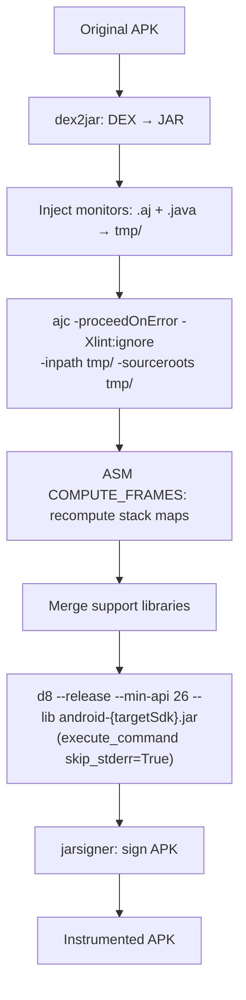

# Specification: Instrumentation Pipeline

## Purpose

The Instrumentation Pipeline domain encompasses the complete transformation of MOP (Monitoring-Oriented Programming) specifications into runtime verification monitors and their subsequent weaving into Android APK artifacts. This domain is implemented by two modules -- **rv-monitor-generator** and **rv-instrumentation** -- which together form the first phase of the RV-Android experiment workflow. Without this pipeline, no runtime verification is possible: uninstrumented APKs cannot produce `RVSEC-COV` coverage events or `RVSEC` violation events during execution.

### Problem Context

Runtime verification detects API usage violations by observing method call sequences at runtime. For this to work, three conditions MUST be met:

1. **Monitors MUST exist**: Formal MOP specifications MUST be compiled into executable AspectJ aspects and Java monitor classes that encode the expected API usage patterns.
2. **Monitors MUST be woven into the APK**: The generated aspects MUST be integrated into the APK's bytecode so that method calls trigger monitor state transitions at runtime.
3. **Coverage tracking MUST be present**: A `Coverage.aj` aspect MUST be woven alongside the monitors so that every method execution is logged via `Log.v("RVSEC-COV", signature)`, enabling real-time coverage measurement.

If any of these conditions is not met, the experiment executes on uninstrumented APKs, coverage reads 0%, and no violations are detected.

### Pipeline Architecture

The instrumentation pipeline is a linear, six-stage process that transforms DEX bytecode into instrumented DEX bytecode. The pipeline was inspired by the original **RV-Android** project by Daian et al. (Runtime Verification Inc., 2015), which implemented the same core sequence as a bash script (`instrument_apk.sh`). As research requirements grew -- multiple specification sets, batch processing, static analysis integration, experiment orchestration -- the pipeline was reimplemented in Python while preserving the same fundamental stages.

```
MOP Specifications (.mop files)
         |
         v
  [rv-monitor-generator]
         |
    (1) JavaMOP: .mop --> .aj (AspectJ aspects) + .rvm (intermediate specs)
    (2) Copy custom aspects: Coverage.aj, logging.aj --> output
    (3) RV-Monitor: .rvm --> .java (monitor classes)
    (4) Clean up: delete .rvm intermediaries
         |
         v
  Monitor Artifacts (.aj + .java files)
         |
         v
  [rv-instrumentation]
         |
    (5) Prepare: Maven dependency resolution (rv-monitor-rt.jar, aspectjrt.jar,
                 rvsec-core.jar, rvsec-logger-logcat.jar)
         |
    Per APK:
    (6)  dex2jar: APK DEX --> JAR (Java bytecode)
    (7)  Monitor Integration: copy .aj + .java into tmp/
    (8)  AspectJ Weaving: ajc compiles aspects into bytecode
    (9)  Dependency Merge: extract and merge runtime libraries
    (10) d8 Compiler: JAR --> DEX (Android bytecode)
    (11) APK Assembly: replace classes.dex in APK copy
    (12) APK Signing: dex2jar sign + jarsigner with keystore
    (13) Verification: compare hash(original) != hash(instrumented)
         |
         v
  Instrumented APK (signed, ready for deployment)
```

### Module Responsibilities

| Module | Responsibility | Key Class | Source Directory |
|--------|---------------|-----------|-----------------|
| rv-monitor-generator | Transform MOP specs into monitor artifacts | `RuntimeVerificationGenerator` | `modules/rv-monitor-generator/src/rv_monitor_generator/` |
| rv-instrumentation | Weave monitors into APK bytecode | `RVInstrumentation` | `modules/rv-instrumentation/src/rv_instrumentation/` |

### Data Models

```
RVGeneratorConfig (Pydantic BaseValidatedModel):
  javamop_bin: Optional[str]     # Path to JavaMOP binary executable
  rvmonitor_bin: Optional[str]   # Path to RV-Monitor binary executable
  mop_specs_dir: Optional[str]   # Directory containing .mop specification files
  aspects_dir: Optional[str]     # Directory containing custom .aj files (Coverage.aj, logging.aj)
  rvsec_root: Optional[str]      # RVSEC installation root for auto-discovery

RuntimeVerificationGenerator (Pydantic BaseValidatedModel):
  config: RVGeneratorConfig      # Validated configuration
  _logger: Logger                # Structured logging
  _error_handler: ErrorHandler   # Centralized error handling

RVInstrumentationConfig (Pydantic BaseValidatedModel):
  rvsec_root: Optional[str]          # RVSEC installation root
  monitor_output_dir: Optional[str]  # Directory with .aj + .java monitor artifacts
  android_jar_path: Optional[str]    # Android SDK android.jar for classpath
  android_platforms_dir: Optional[str] # Android SDK platforms directory
  instrumented_dir: Optional[str]    # Output directory for signed instrumented APKs
  working_dir: Optional[str]         # Base working directory
  tmp_dir: Optional[str]             # Temporary processing directory
  lib_tmp_dir: Optional[str]         # Library extraction directory
  rvm_tmp_dir: Optional[str]         # RV-Monitor processing directory
  keystore_file: Optional[str]       # Keystore for APK signing (defaults to bundled)
  keystore_password: Optional[str]   # Keystore password (default: "password")
  dex2jar_home: Optional[str]        # dex2jar tool suite directory

Dex2jarTools (Pydantic BaseValidatedModel):
  dex2jar: str                       # Path to d2j-dex2jar.sh
  asm_verify: str                    # Path to d2j-asm-verify.sh
  apk_sign: str                      # Path to d2j-apk-sign.sh

InstrumentationResults (Pydantic BaseValidatedModel):
  errors: Dict[str, InstrumentationError]  # Errors keyed by APK name
  success_count: int                        # Number of successfully instrumented APKs
  total_count: int                          # Total APKs processed
  success_rate: float                       # Computed: (success_count / total_count) * 100

InstrumentationError (Pydantic BaseValidatedModel):
  code: int             # Numeric error code
  tool: Optional[str]   # Name of tool that failed (dex2jar, ajc, d8, jarsigner)
  message: str          # Human-readable description
  phase: str            # Pipeline phase (decompilation, weaving, compilation, signing)
```

### Specification Sets

The pipeline processes three distinct sets of MOP specifications. Each set is used independently per experiment -- sets are NEVER mixed within a single instrumentation run. The `specification_set` parameter in `ExperimentConfig` determines which set is used. All specification sets reside under `$RVSEC_HOME/rvsec/rvsec-mop/src/main/resources/`.

| Set | Directory | Count | Origin | Purpose |
|-----|-----------|-------|--------|---------|
| JCA | `jca/` | 23 | Translated from 23 CrySL rules via TDD | Detect cryptographic API misuses (Cipher, MessageDigest, SSLContext, etc.) |
| Generic (FSM) | `generic/` | 118 | JavaMOP specification database | Detect general API pattern violations (Iterator, Collections, Streams) |
| Generic (new) | `generic_new/` | 27 | Curated subset with descriptive names | Detect general API violations (Closeable, Map, InputStream patterns) |

The JCA specifications were derived from 23 CrySL rules previously validated by cryptography experts. The translation followed a TDD approach, with 31 JUnit test classes and 200+ test methods from CogniCrypt serving as the test oracle.

### Coverage.aj Aspect

In addition to MOP monitor aspects, a custom `Coverage.aj` aspect is woven into every instrumented APK. This aspect is located in the aspects directory (`$RVSEC_HOME/rvsec/rvsec-mop/src/main/resources/aspect/coverage.aj`) and is copied into the monitor output directory by rv-monitor-generator during step (2) of the generation pipeline.

The Coverage.aj aspect:
- Intercepts all method executions (excluding system packages: `java.*`, `android.*`, `dalvik.*`)
- Logs unique method signatures via `Log.v("RVSEC-COV", signature)` on Android logcat
- Uses a `HashSet` for deduplication, ensuring each signature is logged only once per execution
- Signature format: `<className: returnType methodName(params)>`

This is the mechanism by which the downstream rv-coverage module tracks method coverage in real-time.

### Configuration Priority System

Both `RVGeneratorConfig` and `RVInstrumentationConfig` implement the same priority-based path resolution strategy:

1. **Explicit individual paths** (highest priority): All required paths provided directly
2. **Explicit `rvsec_root`**: Automatic path discovery from RVSEC installation layout
3. **`RVSEC_HOME` environment variable**: Fallback to environment-based discovery
4. **Configuration error**: If no valid source is available, a `ConfigurationError` is raised

The standard RVSEC directory layout assumed for auto-discovery:

```
$RVSEC_HOME/
  javamop/bin/javamop                              # JavaMOP binary
  rv-monitor/bin/rv-monitor                        # RV-Monitor binary
  rvsec/rvsec-mop/src/main/resources/
    jca/                                           # JCA specifications (.mop)
    generic/                                       # Generic FSM specifications (.mop)
    generic_new/                                   # Curated generic specifications (.mop)
    aspect/                                        # Custom aspects
      coverage.aj                                  # Method coverage tracking
      logging.aj                                   # Additional logging aspects
  rv-android/                                      # Working directory for instrumentation
    lib/dex2jar/                                   # dex2jar tool suite
    assets/keystore.jks                            # Development keystore
```

### Integration with Experiment Orchestration

The `PreProcessor` component in rv-experiment orchestrates the instrumentation pipeline during Phase 1 (pre-processing) of the three-phase experiment workflow:

```
PreProcessor.process(generate_monitors, instrument, static_analysis)
  |
  |--> _generate_monitors()
  |      ExperimentConfig.get_monitored_operations_config() --> RVGeneratorConfig
  |      RuntimeVerificationGenerator(config).generate_monitors(output_dir)
  |
  |--> _instrument_apks()
  |      ExperimentConfig.get_rv_instrumentation_config() --> RVInstrumentationConfig
  |      RVInstrumentation(config).instrument_apks(apks_dir, results_dir)
  |
  |--> _run_static_analysis()
         (separate domain -- not covered in this spec)
```

Both methods use Just-in-Time (JIT) configuration: `ExperimentConfig` creates `RVGeneratorConfig` and `RVInstrumentationConfig` instances only when the corresponding pre-processing step is actually invoked.

### Relationships with Other Domains

| Domain | Relationship | Contract |
|--------|-------------|----------|
| **rv-experiment** | Orchestrator | Calls `generate_monitors()` and `instrument_apks()` via JIT configs from `ExperimentConfig` |
| **rv-coverage** | Consumer | Parses `RVSEC-COV` logcat entries produced by woven Coverage.aj aspect |
| **rv-platform** | Consumer | Executes instrumented APKs on emulator; captures logcat with monitor output |
| **rv-static-analysis** | Sibling | Runs on same APKs during pre-processing; independent of instrumentation |
| **rv-android-core** | Foundation | Provides `Command`, `ErrorHandler`, `LoggingManager`, `BaseValidatedModel`, `App`, constants |

### Success Rate Context

In the ICST study, the instrumentation pipeline achieved a **34.6% success rate** (193 of 557 APKs successfully instrumented). Common failure causes include:

- dex2jar conversion failures on multidex APKs or obfuscated code
- AspectJ weaving errors due to unsupported bytecode patterns
- d8 compilation failures due to classpath issues or unsupported API levels
- DEX method count limits exceeded after monitor injection

The 188 APKs used in the final dataset were the subset of 193 that also had REACH-reachable MOP methods. Improving the instrumentation success rate is listed as a planned improvement (PRD Section 12.2).

### External Tool Dependencies

| Tool | Version Constraint | Purpose | Configuration |
|------|-------------------|---------|---------------|
| JavaMOP | Java 8+ required | Process .mop files, generate .aj and .rvm files | `javamop_bin` in `RVGeneratorConfig` |
| RV-Monitor | Java 8+ required | Transform .rvm files into .java monitor classes | `rvmonitor_bin` in `RVGeneratorConfig` |
| dex2jar | 2.x | Convert APK DEX bytecode to Java JAR | `dex2jar_home` in `RVInstrumentationConfig` |
| ajc (AspectJ) | System PATH | Weave aspects into Java bytecode | System PATH lookup |
| d8 | Android SDK | Convert JAR back to DEX format | `ANDROID_HOME` env var |
| jarsigner | JDK | Sign instrumented APK with keystore | System PATH lookup |
| Maven | System PATH | Resolve runtime dependencies (rv-monitor-rt, aspectjrt, etc.) | System PATH lookup |
| zip | System PATH | APK manipulation (DEX replacement, META-INF cleanup) | System PATH lookup |

## Data Contracts

### Input

- `mop_specs_dir: str` -- Directory containing `.mop` specification files (source: `$RVSEC_HOME/rvsec/rvsec-mop/src/main/resources/{jca,generic,generic_new}/`)
- `aspects_dir: str` -- Directory containing custom `.aj` files including Coverage.aj (source: `$RVSEC_HOME/rvsec/rvsec-mop/src/main/resources/aspect/`)
- `javamop_bin: str` -- Path to JavaMOP executable (source: `$RVSEC_HOME/javamop/bin/javamop`)
- `rvmonitor_bin: str` -- Path to RV-Monitor executable (source: `$RVSEC_HOME/rv-monitor/bin/rv-monitor`)
- `apks_dir: str` -- Directory containing original APK files to instrument (source: experiment configuration)
- `android_jar_path: str` -- Path to `android.jar` from Android SDK (source: `$ANDROID_HOME/platforms/android-29/android.jar`)
- `monitor_output_dir: str` -- Directory with generated monitor artifacts (source: output of rv-monitor-generator)
- `keystore_file: str` -- JKS keystore file for APK signing (source: bundled `assets/keystore.jks` or user-provided)
- `RVSec-replication-package/tools/rules/<Class>.crysl` -- The 49 expert-validated CogniCrypt rules, pinned by sha256: the sole oracle of `jca_android` for every clause kind, read by G-CONF, G-ORDER, G-PRED2 and `scripts/gh105_expert_ledger.py` (INV-INS-125). Read-only
- `rvsec/rvsec-mop/src/main/resources/{jca,jca_android,jca_android_bug_predicate,generic,generic_new}/*.mop` -- The specification universe the specification-set gates enumerate (238 files today; INV-INS-140)
- `data/gh104/traces/` and `scripts/gh104_diff_harness.py` -- The differential harness every automaton, message, allow-list or predicate-wiring repair answers to (INV-INS-124, INV-INS-144)
- `MultiSpec_1RuntimeMonitor.java` -- The generated monitor of a set (`results/<run>/monitors/`), read by the structural gates and the differential harness
- `data/jca_android/{divergence_record,conformance_record,alias_table,gate_allowlist,constraint_table}.csv`, `rvsec-mop/src/main/resources/jca_android/codes.csv` -- The records the specification-set gates read
- `descriptor: AspectDescriptor` -- The JavaMOP-emitted descriptor; each `AdviceSpec` carries `monitorCalls: List<MonitorCall>` with size ≥ 1 (source: `descriptor-reader`)
- `events_fair_csv: Path` -- Paired `ajc` × `dexlib2` event records used to derive the L3-b oracle (source: `out/run_jca_compare_consolidated/events_fair.csv`)
- `control_group_errors_csv: Path` -- The JVM `-javaagent` AspectJ control-group events used to derive the L3-c oracle (source: the campaign results tree, read-only)

### Output

- `monitor_output_dir/` -- Directory containing generated artifacts:
  - `MultiSpec_*.aj` -- Merged AspectJ aspects from JavaMOP (pointcuts and advice)
  - `*MonitorAspect.aj` -- Individual monitor aspects
  - `*.java` -- Java monitor classes from RV-Monitor
  - `coverage.aj` -- Coverage aspect (copied from aspects_dir)
  - `logging.aj` -- Logging aspect (copied from aspects_dir)
- `instrumented_dir/` -- Directory containing signed instrumented APK files (consumer: rv-platform for emulator deployment)
- `InstrumentationResults` -- Pydantic model with success/error counts and the per-APK weaver counters in `weave_counts` (consumer: rv-experiment post-processing and the platform's result processing)
- `instrument_errors.json` -- JSON file with per-APK error details (consumer: rv-experiment result manager)
- One logcat line per violation report: `RVSEC: spec,classQualifiedName,className,methodName,location,errorType,<envelope>` (logcat `ErrorCollector`); for an envelope-producing set the seventh field is the envelope of `Requirement: Violation Report Message Envelope`
- `advicesExcludedByArity` -- Per-APK counter in `instrument_results.json` (`BatchRunner` counts map): advices whose positional `args()` arity is incompatible with the merged wrapper's call — a measurement, not the effect of a filter (INV-INS-122)
- `data/gh104/evidence/harness/<group>-<Spec>.md` -- Differential-harness evidence per specification and repair group, with before/after trace verdicts (INV-INS-124)
- `data/jca_android/predicate_graph.csv` -- One row per predicate site of `jca_android`, 15 columns: `file, event, site_kind, polarity, guard, arity, predicate, position_types, splitter, clause, mechanism, verdict, disposition, reason, automaton_membership` (INV-INS-137); zero rows over a predicate-free set is the correct, green result
- `data/jca_android/predicate_ledger.{csv,md}` -- Every `REQUIRES`/`ENSURES`/`NEGATES` clause of the expert rules with its disposition against the set, derived by `scripts/gh105_expert_ledger.py --check`
- `data/jca_android/coverage_matrix.csv` -- The derived coverage matrix of INV-INS-150, produced only by `scripts/gh109_coverage_matrix.py` (`--emit`; `--check --require-complete` verifies it), which enumerates the pinned oracle directory against the `jca_android` set directory; never edited by hand. Columns: `rule` (the `.crysl` stem), `terminal_state` (`covered` | `na-platform` | `na-value`), `evidence` (the paired `.mop` name, the API 30 `android.jar` archive-listing line, or the adjudication record), `oracle_defect_row` (the `divergence_record.csv` anchor of a defect in this rule, or empty — derived by joining on `kind = oracle-wart` with the rule path in the record's `file` column). One row per rule; the derivation fails when any rule has zero states or two. `covered` is a verdict of pairing and adjudication — a `.mop` of the set answers for the rule and carries no platform-dead disposition — not of clause completeness, which the `rvsec-crysl` conformance component (M0–M4) and the per-clause records (`constraint_table.csv`, `predicate_ledger.csv`) measure; a second derivation of that depth inside the matrix would be a second translation of the oracle. The conformance component reads its oracle at `rvsec-cognicrypt/CrySL-Rules` commit `f2f4d3b`, which differs from the pinned expert copy in exactly one file and two lines — `Cipher.crysl:97` and `:113`, the `CCM` entry — a difference carried as an `oracle-wart` divergence row. Two mappings are adjudicated: `SecretKey → SecretKeySpec.mop` is `covered` (the file realizes the rule's ENSURES and the rule's `Destroy` tail is recorded platform-dead), and `HMACParameterSpec` is `na-platform` despite its `.mop` (INV-INS-155)
- `data/jca_android/order_alphabet_map.csv` -- The versioned event-alphabet mapping G-ORDER consumes, one row per (`.mop` event → `ORDER` event) association (INV-INS-138)
- `rvsec/rvsec-mop/src/main/resources/jca_android/codes.csv` -- One code per accuser, plus the *not observed* code family (INV-INS-143)
- `instrument_results.json` -- Per-APK weaver counters written by the production `dexlib2` instrumentation path for every APK processed, successful or not (consumer: `rv-instrumentation-dexlib2`, which parses it into `InstrumentationResults`)
- `validator/oracles/<apkBaseName>-oracle.yaml` -- Derived Layer-3 oracles, one per APK, each carrying its provenance block and each expected event's `location` (consumer: the Layer-3 comparator)
- `validator/traces/<apkBaseName>/{ajc,dexlib2}.logcat` -- The reconstructed trace pair for each derived oracle, written in the collector's own line format so the comparator reads reconstruction and recording through one code path (consumer: the Layer-3 comparator)

### Side-Effects

- **File System (monitor generation)**: Creates and resets the monitor output directory; moves `.rvm` files between directories as a workaround for the JavaMOP `-d` bug
- **File System (instrumentation)**: Creates temporary directories (`tmp/`, `lib_tmp/`, `rvm_tmp/`) during processing and deletes them after each APK; creates the instrumented output directory
- **File System (Maven)**: Executes `mvn clean compile` to download and stage runtime dependencies into `lib_tmp/`
- **File System (signing)**: Creates signed APK files in the instrumented output directory using the configured keystore
- **Process execution**: Spawns external processes for JavaMOP, RV-Monitor, dex2jar, ajc, d8, jarsigner, Maven, and zip
- **Java (predicate store)**: `PredicateStore` and its verdict type in `rvsec-core` serve `jca_android`; `ExecutionContext.java` is frozen with `jca`; `Property.java` grows append-only (INV-INS-132)
- **Generation (gates and harness)**: the structural gates and the differential harness generate monitors in a scratch directory (`RVSEC_HOME` required); generation is not parallelisable and `TMPDIR` MUST be off tmpfs (`CipherSpec` at 17 events needs 3.3 GB)
- **File System (dexlib2 results)**: The production `dexlib2` instrumentation path writes one results JSON per APK, alongside the error JSON
- **Log (dexlib2)**: The resolved `android.jar` path is written to the weaver log at instrumentation start
- **Build (dexlib2)**: Emitting every monitor call of a fused advice increases the invokes spliced per site, which may trigger register-pressure handling in the mutator; discarded sites are counted in the results JSON

### Error

- `ConfigurationError` -- Raised when path resolution fails, binaries are not found or not executable, MOP specifications are not found, Android SDK is not configured, or keystore is missing
- `CommandException` -- Raised when an external tool (JavaMOP, RV-Monitor, dex2jar, ajc, d8, jarsigner) returns a non-zero exit code or produces error output
- `InstrumentationError` -- Raised when a pipeline phase fails (decompilation, weaving, compilation, signing) or when the instrumented APK hash matches the original (indicating instrumentation had no effect)
- `RVAndroidError` -- Base exception class from rv-android-core; `ConfigurationError` inherits from it
- `pytest` failure (specification-set gates) -- a predicate read inside `condition(...)`; a read without an accuser or without a `codes.csv` code; a read with no producer in the set and no record naming why; a write off the rule's acceptance point without a recorded reason; an orphan accuser in `jca_android` in either direction; a `.mop` parameter list that does not survive into the `.rvm`; an automaton not equivalent to its rule's `ORDER` under the versioned alphabet mapping; a wired edge closed without its trace pair; a gate violation without an allowlist entry; a freeze-check failure on `jca`; a `jca_android`/`jca` hunk without a divergence-record entry; a report site with three arguments; an unexpanded `__EVENTNAME` in a generated monitor; any occurrence of `ExecutionContext` in a `.mop` of the successor set; an allow-list entry that is neither a transcription of the expert clause nor covered by the declared normalisation rule nor a recorded departure; an edit reaching `CipherTransformationUtil.java` or `AndroidCipherTransformationUtil.java`; an alias row of the in-code table that differs from `data/jca_android/alias_table.csv`
- `UnsupportedAspectConstructError` -- Raised by `dexlib2` pointcut parsing when an expression cannot be parsed; the weave fails instead of matching everything
- `Logic Engine Error` / `StackOverflowError` (monitor generation) -- a generation failure; the generated artifact, not the exit code, decides success, since the toolchain returns 0 on failure (INV-INS-139, INV-INS-145)
- `IllegalStateException` -- Raised by the `dexlib2` wrapper registry when a key is already bound to a different wrapper. The emitter produces one wrapper per original call site, so a rebinding is unreachable by construction and the guard asserts that emitter and registry agree

## Invariants

- **INV-INS-01**: A monitor generation run MUST produce at least one `.aj` file and at least one `.java` file in the output directory when given a non-empty `mop_specs_dir`. If the output directory is empty after generation, the pipeline MUST return `False`.

- **INV-INS-02**: The `mop_specs_dir` MUST contain at least one `.mop` file. If no `.mop` files are found, `RVGeneratorConfig` MUST raise a `ConfigurationError` during initialization with a message listing available specification sets.

- **INV-INS-03**: The `javamop_bin` and `rvmonitor_bin` MUST point to existing, executable files. Both tools MUST produce output (stdout or stderr) when invoked with the `-h` flag. If either check fails, `RVGeneratorConfig` MUST raise a `ConfigurationError`.

- **INV-INS-04**: RV-Monitor MUST NOT leave `.rvm` intermediary files in the output directory after generation completes. The generator MUST delete all `.rvm` files from the output directory after RV-Monitor finishes.

- **INV-INS-05**: Custom aspects from `aspects_dir` (including `Coverage.aj`) MUST be copied into the monitor output directory during JavaMOP execution. The `Coverage.aj` aspect MUST be present in the output to enable method coverage tracking.

- **INV-INS-06**: An instrumented APK MUST have a different file hash than its original APK. If `hash(original) == hash(instrumented)`, `RVInstrumentation.check_if_instrumented()` MUST raise a `CommandException`, indicating instrumentation had no effect.

- **INV-INS-07**: The `monitor_output_dir` for instrumentation MUST contain both `.aj` files and `.java` files before instrumentation begins. `RVInstrumentationConfig._validate_monitor_artifacts()` MUST raise a `ConfigurationError` if either is missing.

- **INV-INS-08**: Temporary directories (`tmp_dir`, `rvm_tmp_dir`) MUST be cleaned after each APK instrumentation, whether the instrumentation succeeded or failed. The `lib_tmp_dir` MUST be cleaned after the entire batch completes.

- **INV-INS-09**: Specification sets MUST NOT be mixed within a single generation or instrumentation run. The `specification_set` field in `ExperimentConfig` MUST be one of `"jca"`, `"jca_android"`, `"generic"`, or `"custom"`. If `"custom"` is specified, `custom_specs_dir` MUST be provided; each of the other three resolves to its directory from the set name alone, with no path supplied by the caller. The enumeration is closed — `jca_android` names the successor set — so a value outside it is rejected by name and a stale or mistyped `custom` path can never silently select an uncorrected instrument. `jca_android_bug_predicate` MUST be rejected like any other unknown value, even though it names a directory that exists.

- **INV-INS-10**: The instrumented APK MUST be signed with a valid keystore before being placed in `instrumented_dir`. The signing process MUST include both `d2j-apk-sign` (initial signing) and `jarsigner` (keystore signing with SHA256withRSA / SHA-256 digest), followed by `jarsigner -verify` to confirm signature integrity.

- **INV-INS-11**: The dex2jar tools (`d2j-dex2jar.sh`, `d2j-asm-verify.sh`, `d2j-apk-sign.sh`) MUST exist and be executable in the `dex2jar_home` directory. `Dex2jarTools` field validators MUST raise `ValueError` if any tool is missing or not executable.

- **INV-INS-12**: When `RVSEC_HOME` is not set and no explicit paths are provided, both `RVGeneratorConfig` and `RVInstrumentationConfig` MUST raise a `ConfigurationError` during initialization, not during execution.

- **INV-INS-88**: For every row in the closed enumeration declared under `Requirement: AspectJ Grammar Coverage Matrix as Contract`, `docs/aspectj_grammar_coverage.md` MUST contain exactly one matrix row. New AspectJ versions or new corpora MUST result in a new row added by amendment, not implicit support.
- **INV-INS-89**: For every matrix row, the `Verdict` column MUST take exactly one value from the set `{COVERED, SILENT-GAP, EXPLICIT-NO-OP, NOT-NEEDED}`. `NOT-NEEDED` is permitted via exactly two paths: (path α) `DemandCounter.countMop` zero across all four corpora AND no parser/matcher/emitter implementation; OR (path β) the row reflects an AspectJ production with non-zero source-level demand absorbed by an upstream pipeline stage before reaching the dexlib2 pipeline. Path β requires the matrix Evidence column to (a) cite both source and pipeline demand counts, AND (b) name the upstream absorber from the set declared in `Requirement: Upstream Absorption Verdict`, AND (c) cite the empirical evidence (file:line or RELATORIO citation), AND (d) cite an enabled passing test asserting the absorption claim.
- **INV-INS-90**: For every matrix row with `Verdict = COVERED`, there MUST exist an enabled (non-`@Disabled`) passing test in `rvsec-android/rvsec-instrumentation-dexlib2/grammar-tests/` whose FQN appears in the row's `Evidence` column.
- **INV-INS-91**: (Round-8 reformulation.) The matrix MUST NOT contain any row with `Verdict = SILENT-GAP` post-archive. `MatrixIntegrityTest.testNoSilentGapRowsRemain` SHALL fail the build if any row carries `SILENT-GAP` after gh62 archives. The round-6 `ledger.md` requirement was superseded in round-7 by `Requirement: Deferred-by-Design Document`; the `ledger.snapshot.sha256` tripwire was replaced by `deferred.snapshot.sha256` covering the new document. The round-8 reformulation additionally formalises path β via `Requirement: Upstream Absorption Verdict`, eliminating the round-7 ambiguity where source-level non-zero-demand constructions absorbed by upstream stages had to be force-fit into path α or shipped as in-change closures attacking nothing.
- **INV-INS-92**: For every enabled test method in `grammar-tests/`, there MUST be exactly one matrix row whose `Verdict ∈ {COVERED, EXPLICIT-NO-OP, NOT-NEEDED}` and `Evidence` column resolves to that method. Orphan tests and orphan rows MUST break the build. Post-round-8, no `@Disabled` annotation remains; `testSkipCountEqualsZero` SHALL enforce this.
- **INV-INS-93**: The matrix demand counts MUST be reproducible by `DemandCounter` invoked from `MatrixIntegrityTest.testSourceDemandCountsReproducible` AND `MatrixIntegrityTest.testPipelineDemandCountsReproducible`. Counts MUST be re-verified whenever a new `.mop` OR `.aj` file is added to any of the four corpora OR whenever the JavaMOP toolchain regenerates the committed `empirical-monitors/` snapshot (the canonical pipeline corpus; `results/gh53_smoke_dexlib2/monitors/` is an optional byte-identical regen input). `DemandCounter` SHALL scan BOTH `.mop` AND compiled `.aj` files via two distinct helpers (`countMop` and `countCompiledAj`); the per-designator regex SHALL distinguish *pointcut* uses from *Java statement* uses; the helper MUST be portable Java. **Round-11 reproducibility pin**: each matrix row SHALL quote its per-designator `java.util.regex.Pattern` literal inline AND state the counting rule explicitly — (a) per-occurrence vs per-line (e.g. §4.O `T+`-owner counts per-occurrence of the `+.` owner token = 64, NOT the per-line figure of 39; a single pointcut line ORs several `Map+`/`Collection+` owners), and (b) whether negated forms are included and which row owns them (the negated `!target(Type)`/`!args(Type)` occurrences MUST be owned by exactly one of §4.TT/§4.AT or §4.N, not double-counted — disambiguate so `target(Type)` = 22 and `!target/!args` = 16 do not both claim the same 14 negated sites). Without these two rules pinned, `testPipelineDemandCountsReproducible` has no deterministic count to assert against.
- **INV-INS-94**: For every matrix row covered by the **eleven round-11 in-change closures** (§4.{O,N,V,X,TT,AT,Y,T,B,D,I} — §4.E/§4.W NOT-NEEDED β [absorber `coverage-weaver`]; §4.R NOT-NEEDED α [R11.3]; §4.JP folded into §4.Y), the `Verdict` MUST be `COVERED` and the `Evidence` MUST cite an enabled test in `grammar-tests/` exercising the corpus pattern that motivated the closure. `MatrixIntegrityTest.testRoundEightClosuresAreCovered` SHALL fail the build if any of these rows regresses from `COVERED`. (Test method name retained for cross-commit stability; it asserts the round-11 eleven-closure set.)
- **INV-INS-95**: The **eleven round-11 closures** SHIP as bisect-friendly atomic commits (one closure per commit, §4.{O,N,V,X,TT,AT,Y,T,B,D,I} in tasks). For every commit landing a closure, the matrix row flip (`SILENT-GAP` → `COVERED`) MUST occur in the same commit; orphan tests and orphan rows are caught by INV-INS-92. The NOT-NEEDED reclassification assertion tests (§4.E', §4.W' [coverage-weaver absorber], §4.R' [zero demand]) and the §4.Y.4-§4.Y.7 fork-free Signature-delivery sub-closure SHIP as their own atomic commits per tasks. `MatrixIntegrityTest.testClosureLocFootprintMatchesMatrixDelta` SHALL log (advisory; non-blocking) the LOC delta per closure commit and the number of matrix rows flipped.
- **INV-INS-96**: (Round-8 introduction.) For every matrix row with `Verdict = NOT-NEEDED β`, the assertion test SHALL exercise THREE properties: (a) `DemandCounter.countMop(designator) ≥ 1` to confirm source-level demand exists; (b) `DemandCounter.countCompiledAj(designator) == 0` to confirm pipeline absorption; (c) the named upstream absorber file/module exists and contains the documented evidence anchor. The test FAILS if any of the three properties changes — guarding against silent regression of an upstream stage that would re-surface the construction at the instrumenter without notice. `AbsorptionClaimsContractTest` SHALL aggregate all path-β absorber assertions.
- **INV-INS-97**: (Round-8 introduction; **round-8 empirical revision 2026-05-28** — the round-7/early-round-8 draft assumed a new `namedPointcuts: Map<String, PointcutExpression>` field would be added cross-repo to the JavaMOP-emitted `AspectDescriptor` JSON. Empirical inspection of `descriptor-reader/src/main/java/br/unb/cic/rv/descriptor/AspectDescriptor.java` and the production JSON fixture `descriptor-reader/src/test/resources/MultiSpec_1MonitorAspect.json` proved that the schema already exposes a load-bearing `baseAspectExclusions: List<String>` field — the pre-expanded output of `BaseAspect.notwithin()` populated by `javamop.output.descriptor.DescriptorWriter#defaultBaseAspectExclusions()` (twelve package patterns including `sun..*`, `java..*`, `mop..*`, `com.runtimeverification..*`). The cross-repo `namedPointcuts` change is therefore RETIRED.) The `AspectDescriptor` schema MUST continue to carry the existing `baseAspectExclusions: List<String>` field as the source of truth for `BaseAspect.notwithin()` expansion. The `NamedRefPC` matcher MUST resolve the literal reference `BaseAspect.notwithin` against `descriptor.getBaseAspectExclusions()` (consumed by the §4.B `BaseAspectExpander`); any other `NamedRefPC` name not recognised by the matcher MUST cause `UnresolvedNamedRefException` (fail-closed). `NamedRefResolverTest` SHALL cover three paths: (a) successful `BaseAspect.notwithin` expansion against the canonical twelve-entry exclusion list; (b) fail-closed on unrecognised names; (c) fail-closed when `baseAspectExclusions` is empty (legacy descriptor). The round-8 archive precondition (tasks §0.5) is correspondingly downgraded from "verify cross-repo `namedPointcuts` emission" to "verify `baseAspectExclusions` is non-empty in production descriptors and matches the `defaultBaseAspectExclusions()` baseline".
- **INV-INS-98**: (**Round-11 R11.5 repurpose** — the round-8 `MonitorRuntime.evaluateIf`/`ifId`/`MonitorRuntimeIfHelperEmitter` runtime-delegation contract is RETIRED; it required fork-side generation and exists in neither the JavaMOP nor the RV-Monitor fork.) The `if(...)` PCD MUST be lowered **entirely in the dexlib2 weaver**, fork-free: `IfGuardEmitter.emit()` MUST recognise exactly the two expression shapes present in the corpus — `<bound> == null` (lowered to `if-nez <reg>, :skip`) and `!Thread.holdsLock(<bound>)` (lowered to `invoke-static Ljava/lang/Thread;->holdsLock(Ljava/lang/Object;)Z` + `move-result` + `if-nez`) — placing the monitor invoke after the skip-label so it is bypassed exactly when the guard is false. The bound register MUST come from `ctx.match` (`target`/`args` binding) and the expression text from `IfPC.javaExpression`. Any other shape MUST fail loud with `UnsupportedAspectConstructError` (no silent always-match). No `evaluateIf`, no `ifId`, no fork-side helper. `IfGuardLoweringTest` SHALL verify (a) the null-check shape lowers to `if-nez`; (b) the `holdsLock` shape lowers to `invoke-static` + branch; (c) an unsupported shape fails loud; (d) the monitor invoke is skipped exactly when the guard is false.

#### Scenario: unsupported if(...) shape fails loud at weave time (round-11 R11.5 — REPLACES the retired ifId/evaluateIf scenarios)

- **WHEN** the weaver encounters an `if(<expr>)` PCD whose `<expr>` is neither `<bound> == null` nor `!Thread.holdsLock(<bound>)` (the only two shapes in the corpus)
- **THEN** `IfGuardEmitter.emit()` SHALL throw `UnsupportedAspectConstructError` naming the unrecognised expression and the aspect — failing the build rather than emitting a silent always-match guard
- **AND** `IfGuardLoweringTest.unsupportedShapeFailsLoud` SHALL pin this behaviour; a future corpus introducing a new `if(...)` shape forces a new sub-change extending the lowering dispatch
- **INV-INS-99**: (Round-8 round-7-supersession.) The round-7 *meanings* of INV-INS-96 (substrate contract), INV-INS-97 (FQN remap), and INV-INS-99 (Coverage.aj e2e) are SUPERSEDED — those round-7 invariants asserted properties of artefacts that round-8+ does not ship (the `aspectjlang/` substrate and the Coverage.aj end-to-end smoke test). In the 96-98 slot the ACTIVE (round-8+) invariants are INV-INS-96 (path-β absorber contract), INV-INS-97 (`baseAspectExclusions` schema — the round-7 `namedPointcuts` plan was itself RETIRED), and INV-INS-98 (**round-11 R11.5: fork-free in-weaver `if()` lowering** — the round-8 `if`-runtime-delegation meaning is RETIRED). INV-INS-100/101/102 below are round-8 introductions, NOT round-7 invariants, and are unaffected by this supersession note (the earlier "round-7 numbering above 100 (none existed)" wording was itself stale — 100/101/102 now exist).
- **INV-INS-100**: The `deferred.md` document MUST contain exactly one entry per matrix row with `Verdict ∈ {EXPLICIT-NO-OP, NOT-NEEDED}` (path α and path β). The document is content-addressed via `deferred.snapshot.sha256` (committed to `grammar-tests/src/test/resources/`); `testDeferredDocumentIsFrozenPostArchive` SHALL verify the live document's SHA against the snapshot and fail if they diverge. Round-8 race-condition fix: the snapshot generation SHALL occur in the same commit as the final `deferred.md` edit (tasks §1.4) to eliminate the round-7 race between `deferred.md` mutations during closure implementation and the post-archive snapshot creation.
- **INV-INS-101**: (Round-8 introduction — Z-decision per cross-LLM meta-review.) The §4.B `BaseAspectExpander` consumes a `List<String>` whose canonical length in production is twelve (per `DescriptorWriter.defaultBaseAspectExclusions()`); the matcher behaviour MUST be tested at N≥2 to guarantee future-proofing against descriptors that override `--baseaspect` with shorter lists. `NamedReferenceGrammarTest.baseAspectNotwithinExpandsTwelveExclusionsList` SHALL exercise (a) the canonical twelve-entry expansion (production baseline); (b) a synthetic two-entry list (smallest non-degenerate AND-chain — `["foo..*", "bar..*"]`); (c) a synthetic one-entry list (degenerate AND-of-one returns the single `NotWithinPC` directly); (d) the empty-list fail-closed case (`LegacyDescriptorException` per INV-INS-97).
- **INV-INS-102**: (Round-8 introduction — W-decision per cross-LLM meta-review.) `docs/aspectj_grammar_coverage.md` is the **single source of truth** for the dexlib2 AspectJ surface. The legacy inventory documents at `docs/AJ_CONSTRUCTIONS_INVENTORY.md` and `docs/AJ_TO_DEXLIB2_MAPPING.md` SHALL carry a header banner declaring "SUPERSEDED — see `docs/aspectj_grammar_coverage.md` as the live contract; this file preserved as historical inventory only" and SHALL NOT be cited by any test, scenario, or invariant in this delta spec. `MatrixIntegrityTest.testNoCompetingSourceOfTruth` SHALL fail the build if either legacy document is amended without the banner present (a `git grep -L 'SUPERSEDED' docs/AJ_CONSTRUCTIONS_INVENTORY.md docs/AJ_TO_DEXLIB2_MAPPING.md` style check).
- **INV-INS-103**: For a `call(...)` pointcut with trailing varargs, `CallPC.paramSpecs` is exactly the fixed positional head and `CallPC.varargs` is the sole varargs signal. Overload expansion MUST verify all `paramSpecs.size()` fixed parameters positionally against a candidate overload's leading parameters and MUST reject candidates with fewer parameters than the fixed head. A `".."` descriptor inside `paramSpecs` is necessarily a non-trailing `..` and MUST cause the whole pointcut to be rejected (empty expansion).
- **INV-INS-104**: An advice carrying N `monitorCalls` MUST emit exactly N monitor invokes, in descriptor order, on **every** emission path — inline and wrapper alike. No emission path may read only the first element of `monitorCalls`.
- **INV-INS-105**: The production single-APK instrumentation path MUST write a results JSON for every APK it processes, successful or not. A results tree containing `instrument_errors.json` files and no `instrument_results.json` file is a violation of this invariant, not a reporting preference.
- **INV-INS-106**: No component of the validator MAY attribute a woven artefact to a specification by reading only the first element of `monitorCalls`. A validator that shares the emission premise cannot certify the emission contract.
- **INV-INS-107**: A ground-truth oracle MAY be derived from recorded execution data only when the recording comes from a weaver implementation **other than** the one under validation, and the derived YAML is frozen — content-addressed, with its source file and derivation script named in a provenance block — before the Layer-3 comparison that consumes it runs. An oracle derived from the implementation under test is inadmissible.
- **INV-INS-108**: An acceptance test for an emission repair MUST be executed against the pre-repair code and its failure recorded as an artefact of the change before the repair is integrated. A test that has only ever been observed passing does not establish that it discriminates.
- **INV-INS-109**: The `jca` specification set and the `CipherTransformationUtil` it delegates to MUST remain byte-identical to their state at this change's base commit, and every divergence between `jca_android` and `jca` outside allow-list content MUST appear in the divergence record with its reason. An unrecorded divergence is a defect; a recorded one is a deliberate repair confined to the derived set. Any edit reaching the frozen paths fails the check regardless of its merit.

  The check bounds what it can establish, and the bound is part of the invariant rather than a caveat on it. Byte-identity of the frozen paths, and of the monitor generated from them, does **not** establish that the frozen set behaves as it did: shared runtime code the specifications call is outside both, so a repair there changes behaviour with every mechanical check still passing. Such a repair is governed by the admissibility conditions above, and its effect on the frozen set MUST be enumerated site by site in the change's records. Establishing the effect empirically would require the corpus re-measured, which this change does not do.
- **INV-INS-110**: An event that appears in a specification's event list MUST appear in that specification's `fsm` or `ere`. An event bound but absent from the automaton receives a transition row to `fail` from every state, which turns the specification into an unconditional accuser.
- **INV-INS-111**: Every `Property` constant written by any specification MUST be read by at least one specification, or MUST be recorded in the deliberate-omission list with its reason. A constant that is neither read nor recorded is a silent defect, not a spare.
- **INV-INS-112**: The `Cipher` transformation tables consulted by a specification set MUST originate in the same derivation that produced that set's rules, and each set MUST reach them without any runtime selection: the specification names the utility it calls. A hand-maintained table that duplicates a derived rule is inadmissible regardless of whether it currently agrees, and a shared table chosen by a mutable switch is inadmissible because it would place the frozen set's verdict under the control of state set elsewhere.
- **INV-INS-113**: Every `.mop` of the archived set `jca_android_bug_predicate` carries a conformance verdict against the generated rules for its target API level — anchored to a named rule, or declared uncontradicted with the rule that was checked, or declared to have no anchor with the reason — and a file with no verdict is unverified, not verbatim. The invariant binds `jca_android_bug_predicate` and the record it was measured with (`data/gh101/`), which is not rewritten; `jca_android` is outside it and carries `data/jca_android/conformance_record.csv` per INV-INS-125, where the vocabulary is transcription, recorded divergence and `deferred-constant`, not anchored/uncontradicted/no-anchor.
- **INV-INS-114**: A specification's events MUST be granular enough to bind every argument its rule's clauses quantify over. Fusing several method signatures into one pointcut is admissible only where no `REQUIRES`, `ENSURES`, `NEGATES` or `CONSTRAINTS` clause refers to an argument the fusion leaves unbound. Fusion is lossless for the `ORDER`, which names only the rule's aggregate, and lossy for everything that names its individual events — which is why a fused specification can look well-formed and still be unable to state most of its rule. The converse also binds: an event that carries no binding and no body another event does not already carry MUST NOT be split out, because the alphabet is a scarce resource under INV-INS-115.
- **INV-INS-115**: A specification's event count MUST be verified to generate. The monitor generator computes, for the `fail` category of any specification declaring an `@fail` handler, a coenable set of exactly `n × (2ⁿ − 1)` members over an alphabet of `n` events; measured on this machine, 17 events generate in 53 s, 18 raise `StackOverflowError` in the enable-set parser, and 24 exceed Java's maximum `String` length and cannot be built at all. The notation does not change this — `ere`, `ltl` and `ptltl` are rewritten into `fsm` and reach the same computation. A specification MUST therefore be generated end to end before its alphabet is accepted, and a design that cannot be generated MUST be recorded as such rather than left in the plan.
- **INV-INS-116**: A Layer-3 oracle MUST key its expected events on `(apk, class, method, spec)` — the unique-misuse unit defined in the journal article at `results-rq1.tex:41` and implemented at `data-analysis/repair_summary_outcome.py:53`. The comparator that consumes it MUST match on every element of that key the oracle declares. An oracle keyed more finely than the comparator matches makes the gate weaker than the evidence it rests on; a comparator matching more finely than the oracle keys rejects agreements the ground truth never claimed. Neither direction is acceptable, and what a comparator happens to do is not an argument for changing the unit.
- **INV-INS-117**: The Layer-3 comparator MUST parse the violation line the on-device collector emits (`ErrorCollector`, rvsec-logger-logcat), and its parsing MUST be justified against that producer and a recorded line that exhibits the format. A parser accepted on the authority of another parser is not evidence that the format is right: two parsers can agree with each other on a shape that nothing in the pipeline emits.
- **INV-INS-118**: `jca_android` MUST be seeded from the frozen `jca` — never from the archived `jca_android_bug_predicate` — and every hunk between the seed and the set MUST carry a `data/jca_android/divergence_record.csv` row keyed by that hunk (INV-INS-141), with a reason and the task that introduced it. The seed is all 23 `.mop` files of `jca` (D-11). The set's membership is the tree's count, which a gate enumerates rather than asserts as a literal: 47 `.mop` files today — 22 of the seed (`RandomStringPassword.mop` left the set as a `removed-spec` row: it cannot accuse under any trace and writes no predicate), the junction specification `IvChainJunction.mop`, and the specifications added for rule coverage. Membership is what the count asserts, not predicate sites. The freeze of `jca` (INV-INS-109) is unaffected: nothing seeds or repairs `jca_android` by editing `jca/`, `CipherTransformationUtil.java`, `AndroidCipherTransformationUtil.java` or `ExecutionContext.java`, and the freeze gate MUST stay green, with the three gh101 gate scripts (`gh101_divergence_record.py`, `gh101_predicate_pairing_check.py`, `gh101_conformance_check.py` — two test invocations in `tests/parity/test_gh101_specset_gates.py`) pointed at the archive `jca_android_bug_predicate`, which is the set they describe. An unrecorded hunk between the seed and the set is a defect.
- **INV-INS-119**: Every `new ErrorDescription(` in `jca_android` MUST use the four-argument constructor, and the fourth argument MUST be a v1 envelope. No report emitted from `jca_android` may carry the message `unknown` or an observed value that is empty because a monitor field was interpolated before any event wrote it: a `but found` message MUST interpolate the value read from the target object the reporting event binds (`getAlgorithm()`, `getType()`, `getProtocol()`), or the argument where the event binds it, and never a monitor field.
- **INV-INS-120**: The monitor generator MUST expand the macro `__EVENTNAME` to the name of the event a report site belongs to — in an event body to the declared name of that event, in a handler body to a call of a per-class helper `RVM_eventName()` that returns the name of the event that last transitioned the monitor, decoding the index the way the monitor's own shape stores it (the atomic shape keeps `index + 1` and the helper subtracts one; the non-atomic shape keeps the index itself), and the sentinel `none` when no event has transitioned it. No specification file MUST carry hand-written event-name bookkeeping. No generated Java MUST contain the unexpanded literal `__EVENTNAME`. Two events of one specification MUST NOT share a name, because the generated monitor merges their transition rows silently.
- **INV-INS-121**: A report message MUST agree with the check that guards it: every numeric literal in the message equals the literal of the guarding `condition()`; the `ErrorType` matches what the condition tests (a constraint on an argument is `UnsatisfiedConstraint`, an algorithm outside the allow-list is `UnsafeAlgorithm`, a call the rule's `FORBIDDEN` clause names is `ForbiddenMethod`); an expected list in a message is the file's allow-list, joined, never a hand-written subset or the literal `...`.
- **INV-INS-122**: When `WrapperEmitter` groups advices into one merged wrapper for a concrete call, it MUST NOT remove any advice from the group. It MUST instead decide, per advice, whether the advice's positional `args()` arity is compatible with that call, under three clauses: an advice with no `args()` clause is never counted (absence means "no positional constraint"); the arity is read from `ArgsPC.types()`, so a trailing `..` means "at least"; the decision is taken in the grouping loop, where the concrete overload's parameter count is known. Every incompatible advice MUST be counted into the results JSON as `advicesExcludedByArity`, and the wrapper MUST fire every advice of its group. Measuring rather than filtering is deliberate: a filter would change what every campaign reports, and the counter is the measurement a filter would have to be judged against.
- **INV-INS-123**: For any specification set, the structural gates over the generated monitor MUST run as pytest and MUST fail on a violation not named in `data/<set>/gate_allowlist.csv` with a reason: G-ERE (every symbol named in an `ere` or `fsm` has an event declaration — run before generation, since the generator drops an undeclared symbol silently), G-2 (an event with a transition row to `fail` from every state — INV-INS-110 — **and** no clause of the corresponding CrySL rule that the event encodes: `CONSTRAINTS`, `REQUIRES` or `FORBIDDEN` on the frozen `jca`; `CONSTRAINTS`, `FORBIDDEN` or `REQUIRES` on `jca_android`, which encodes its `REQUIRES` clauses as body reads with accusers — INV-INS-133/137/146), G-2a (an event that never changes state: `∀s δ(s,e)=s`), G-2b′ (an event redundant at the start state: `δ(q0,e)=q0`), G-2c (a state unreachable from `q0` or from which no accepting state is reachable), G-2d (the highest-index state is not the `fail` category), G-6′ (the number of `Prop_N_event_*` methods differs from the number of `Prop_N_transition_*` rows). A green gate over a set with a known defect is a bug in the gate; the frozen `jca`, where the answers are known (G-ERE 1, G-2 3 `orphan-without-clause` under the mechanical mapping, G-2a 1, G-2b′ 8, G-2c 1, G-2d 2, G-6′ 1), is the baseline every extension is run against first. G-CONF (INV-INS-127) and G-PRED (INV-INS-128) run beside these but are not structural: they read the `.mop` sources and the set's oracle, the pinned expert rules (INV-INS-125), not the generated monitor.
- **INV-INS-124**: No repair of an automaton, a message or an allow-list of a specification set MAY close without the differential harness having replayed the same traces through the monitor generated before and through the monitor generated after the repair, with the per-trace verdicts of both committed as evidence. A repair that changes which call is accused, without changing whether the trace is accused, is a moved defect and MUST be recorded as such, not as a fix.
- **INV-INS-125**: The sole oracle of `jca_android`, for every clause kind — allow-lists and value tests (the Cipher transformation tables included), `ORDER`, event alphabets and predicate clauses — is the expert-validated CrySL rule in the pinned copy `RVSec-replication-package/tools/rules/`, whose 49 files are frozen by sha256 as a freeze item (D-15 for values, with `docs/20260824_auditoria_specs_jca_android.md` as the measured reason — the generated chain admitted MD5, SHA-1 and AES/ECB; D-16 for every other kind). `MetaCrySL/generated/api30/` is not an authority for anything: it survives only as the input the records derived before D-16 cite. Recorded per specification in `data/jca_android/conformance_record.csv`. Five and only five kinds of departure from a literal transcription of the expert rule are admissible, and each MUST be recorded. (1) An entry of the declared normalisation table (INV-INS-127), in `data/jca_android/alias_table.csv` and nowhere else. (2) A **`platform-value`** row of `data/jca_android/divergence_record.csv`: a value the expert rule omits whose rejection would accuse a practice the platform itself recommends, cited to a primary source — the enumerated set is `TLS` in `SSLContext` and `{AndroidKeyStore, AndroidCAStore, BKS, BouncyCastle}` in `KeyStore`, and a candidate without a citation is dropped and stays accused. (3) An **`oracle-wart`** row: a measured quirk of the expert rule itself, transcribed faithfully rather than fixed (`OAEPWithMD5AndMGF1Padding` admitted while no SHA-1 OAEP variant is; `SHA-224` absent from `MessageDigest`; `SHA224withECDSA` and `SHA1withECDSA` absent from `Signature`; the `CCM` addition of the replication copy, which the upstream never carried). (4) A **`behavioural`** row for an observed spelling no registration explains (`OAEPWithSHA1AndMGF1Padding`, resolved by the platform's Bouncy Castle, not Conscrypt). (5) A **`deferred-constant`** row of `conformance_record.csv`: a `CONSTRAINTS` clause the expert rule declares and the set does not yet check, recorded with the rule file, the exact expert clause text, the reason, and the statement that leaving it out adds no accusation — the row MUST cite the expert clause, not the api30 reconstruction of it, because two api30 reconstructions (`pre_len > pre_off`, `len > off`) are mangled and promoting them would implement a bug. A value difference that is none of the five is a defect, and G-CONF MUST fail on it. Values the expert lists carry that Android does not offer (`SunX509`, `NativePRNG*`, `Windows-PRNG`, `PKCS11`, `JKS`, `JCEKS`, `DKS`) stay in the lists — inert entries, never removed by preference. In `jca_android`, `UnsafeAlgorithm` (code KIND `ALG`) therefore means what it means in the published `jca`: **cryptographically insecure per the expert rule**. Any report comparing counts across `jca`, the archived `jca_android_bug_predicate`, the pre-D-15 `jca_android` and the current set MUST say which oracle each answers to.
- **INV-INS-126**: The dedupe identity of a violation report (`ErrorSummary.equals`/`hashCode`, `rvsec-core`) MUST include the report's `code` and `event` in addition to `spec`, `error`, `class`, `method` and `location`. The message free text stays outside it. A dedupe count under this identity is not comparable with a five-field count: on an input whose records carry no envelope the discontinuity is zero by construction, and on an input whose records carry `ev=` (the differential-harness traces, the device logcat) it MUST be non-zero (core INV-CORE-57).
- **INV-INS-127**: Every allow-list of `jca_android` MUST be a literal transcription of the `CONSTRAINTS` clause of the corresponding rule in the pinned expert copy `RVSec-replication-package/tools/rules/`, warts included, widened only by the recorded departures INV-INS-125 enumerates, and compared under one declared normalisation rule: comparison is case-insensitive, and an observed value matches a list entry if a row of the set's alias table maps it to that entry. The gate that checks this is **G-CONF**, whose `--crysl` input points at the pinned expert copy for value clauses. The alias table is a file of its own, `data/jca_android/alias_table.csv`, and MUST NOT be folded into the conformance record or expanded into the allow-lists. Each alias row MUST name its primary source and, in its `service` column, the JCA service it applies to, and every row MUST cite the Conscrypt `android11-release` branch by file and line: there is no second class of row and no exemption from the pointer. The extraction MUST cover multi-line `put("Alg.Alias...")` registrations — 11 registrations span several lines (6 `Signature` composite OIDs → `SHA{224,256,384,512}withRSA` at `OpenSSLProvider.java:234-263`, 5 `Cipher.RSA/None/OAEP*` at `:339-355`), the `Signature` six being live false-accusation vectors — and the table carries them. An observed spelling that no registration in that file explains MUST NOT be given a row at all; it belongs in `data/jca_android/divergence_record.csv`, where its evidence is declared for what it is. The one measured case is `OAEPWithSHA1AndMGF1Padding`, unhyphenated, which the platform resolves through its Bouncy Castle provider (`Cipher.RSA` service + `engineSetPadding("OAEPWITHSHA1ANDMGF1PADDING")`, both verified in the AOSP `android11-release` sources), not through Conscrypt — so it has no Conscrypt line to cite and is recorded as a `behavioural` divergence. Resolution happens at runtime through `ConscryptAliasTable`, a utility class in `rvsec-core` that carries the table as code and that each `jca_android` specification names in its call (INV-INS-112), never by reading the CSV at runtime; a test MUST assert that the in-code table and the CSV are equal, so the record and the instrument cannot drift. A list entry with no clause behind it, and an alias with no pointer behind it, are the same defect: a verdict whose authority cannot be checked.
- **INV-INS-128**: Every `ExecutionContext` site of the frozen `jca` — 134 lines over its 23 files — MUST be present in `jca` itself at the same event and unrewritten. The gate that checks this is **G-PRED**, a grep, and it is the `jca` lock and nothing else: `jca_android` carries no `ExecutionContext` site at all (INV-INS-130), and its predicate machinery is governed by INV-INS-131/133/137. INV-INS-111 (every written `Property` is read or recorded) governs both sets; for `jca_android` the record is `data/jca_android/predicate_graph.csv`.
- **INV-INS-129**: Every generated monitor dispatcher that acquires the generated file's global lock MUST release it on every exit path, including an exception raised inside the guarded region. The generator MUST emit the framing that guarantees it; no generated dispatcher MUST acquire the lock outside such framing. The reason is that the lock is one object shared by every specification of the set and every other dispatcher waits on it by spinning (`tryLock()` inside a `Thread.yield()` loop), so a single unreleased acquisition does not fail one report — it converts the instrumented application into a busy-wait that never reports again and never terminates, and nothing in the record says so. The framing MUST be behaviour-preserving on non-throwing paths: the monitor generated from the frozen `jca` differs from one generated without the framing only in the framing, the event-name table and the `RVM_eventName()` helper of INV-INS-120 — the frozen set writes no `__EVENTNAME`, so no expanded macro appears in that diff.
- **INV-INS-130**: Every predicate operation of a `jca_android` specification MUST go through the set's own store classes; no `.mop` of the set may mention `ExecutionContext` — checked as `grep -rlw 'ExecutionContext' jca_android/ --include='*.mop'` returning nothing, with `-w` so a fully-qualified use is caught as well as an import. `generic` and `generic_new` reference no predicate substrate (0 of 145 files) and are outside this invariant.
- **INV-INS-131**: The `jca_android` predicate store (`PredicateStore`) MUST key hybridly — identity (`IdentityHashMap` semantics) on the object binding; value comparison, case-insensitive and with the oracle's splitters, only on positions whose declared type is `String`/`int`/`Integer` — MUST support arity N (the oracle's measured maximum is 2), MUST return a three-valued verdict (`SATISFIED`/`VIOLATED`/`NOT_OBSERVED`), MUST hold object keys weakly with purge, and MUST be thread-safe. The API MUST separate the bound object from the value positions — `ensure/validate(Property p, Object bound, Object... values)` — because a plain varargs head (`Object... args`) silently spreads a reference-array argument (`KeyManager[]`, `TrustManager[]` — exactly the TLS-chain bindings) into separate arguments, and an empty array yields zero arguments (measured under JDK 21; javac emits only an easily missed warning). It MUST NOT offer `hasEnsuredPredicate` (zero `.mop` sites in any set) nor a property-wide removal that ignores the object: its only removal, `negate(Property p, Object bound)`, names the object.
- **INV-INS-132**: `ExecutionContext.java` MUST be byte-identical to its frozen state — no edit, not even an annotation (P3 bans deprecation annotations, and byte-identity without exception is the stronger freeze claim) — and serves the frozen `jca` and the archived `jca_android_bug_predicate`; it is one of the freeze gate's `FROZEN_PATHS`. The shared `Property` enum MAY gain constants **append-only** — never removed, renamed or reordered (measured safe: zero `ordinal()`/`values()` uses anywhere in the tree) — under a test that asserts the established constants and their relative order survive. Every other class the frozen set calls is untouched by the store, and the freeze gates of gh101/gh104 MUST stay green. The main spec's scenario "Shared runtime code the frozen set references is repaired" opens a repair path for `rvsec-core` code that specifications of **both** sets call; no `jca_android` specification calls `ExecutionContext` (INV-INS-130), so that scenario has no subject in this class, which serves one set and is frozen with it.
- **INV-INS-133**: A predicate read (`REQUIRES` translation) MUST be placed in the event body, never inside `condition(...)`; a failed read MUST accuse at that event with `UnsatisfiedConstraint` and a `codes.csv` code, and a read whose verdict is `NOT_OBSERVED` MUST emit the *not observed* code, not the violation code. `condition(...)` MUST NOT contain a predicate read; overload discrimination, `ORDER` branching and `CONSTRAINTS` checks remain legitimate guard uses. A guarded clause (`X => pred[…]`) evaluates its guard in the event body **before** the read: a false guard suppresses the read and any report, never the transition, and the guard expression is recorded in the `guard` column of `predicate_graph.csv` — wiring the clause unconditionally would accuse every non-matching `Cipher.init` of a missing IV. A composite read site (a disjunction or conjunction of probes translating one clause, `CipherSpec.i2`'s key-origin trichotomy being the live case) keeps its boolean structure in the body and emits at most **one** report per violated clause, not one per probe.
- **INV-INS-134**: A predicate write (`ENSURES` translation) MUST be placed at the rule's acceptance point — the `@match` handler, or the states of an `after L` clause — never in an arbitrary event body; each write names the object the rule's clause binds, at the rule's arity. A write kept elsewhere, or below the rule's arity, MUST carry a recorded reason in `predicate_graph.csv`. Arity is a contract between producer and consumer, because `PredicateStore.validate` compares the value tuple: a write at arity 2 read at arity 1 returns `VIOLATED` — a positive accusation about a conforming program — so a write below the rule's arity is admissible only while a consumer of that predicate still reads at the lower arity.
- **INV-INS-135**: `jca_android` MUST have zero orphan accusers in both directions: every declared event appears in the `fsm`/`ere`, and every symbol the `fsm`/`ere` uses is declared exactly once (the alphabet is a multiset — a duplicate declaration is a defect; `jca/GCMParameterSpecSpec.mop` carries both defects at `:23,34,48` and is the gate's negative fixture). The gate is G-ACC, and on specification forms without an automaton (event-only) it MUST skip declaredly, never report "all events orphan". An orphan that is the **negated twin** of a conforming sibling — identical `call`/`args` pointcut, condition differing only in polarity — MUST be **fused** into the sibling (one event, the accusation moved into the body), never absorbed as a second event: two events matching the same call is itself the defect the automaton scenarios name. The two treatments are told apart by the orphan's body, not by the shape of its guard: an orphan whose body carries an accusation of its own MUST be absorbed, because absorbing preserves a report the set would otherwise lose; an orphan whose body only rebinds a monitor field accuses nothing of its own — the only report it emits is the spurious `InvalidSequenceOfMethodCalls` that its absence from the automaton produces — and MUST be fused. Such a twin can suppress the very finding its file exists to make: on `TrustManagerFactorySpec-sunx509.txt` the unfused form emits `TRUSTMANAGERFACTORY-ORDER-00` twice and never accuses the algorithm, because the orphan's `__RESET` leaves the monitor in a state where the next event's transition fails and the `@fail` path replaces the body that carries the check; the fused form produces exactly one report, the `TRUSTMANAGERFACTORY-ALG-00` the rule states. Where the twin is not an exact complement (`IvParameterSpec.c4` ignores its sibling's offset/length constraints; the three `PBEKeySpecSpec` accusers overlap, so one bad call fires up to three), the fusion decomposes the accusation per clause, one report each. To **absorb** an orphan is defined operationally by where the rule's `ORDER` puts the call it matches, in one of two forms. Where the `ORDER` has no symbol for that call — `SecureRandomSpec.g4` and the two `PBEKeySpecSpec` FORBIDDEN constructors, calls the rule turns down rather than sequences — the event enters the automaton's declared alphabet with benign self-loops at every state where its call is legal, and its `order_alphabet_map.csv` row records it as ORDER-unmapped. Where the `ORDER` does name the call — `KeyPairGeneratorSpec.initError` matches `initialize(int)`, which the rule states with the size bound under CONSTRAINTS — the event enters at that position, as one more alternative of the group its sibling belongs to, and its row is `mapped` to the same symbol; two events standing for one symbol is the non-bijection the mapping already models. G-ACC holds by membership either way, and so does G-ORDER: the first form because the comparison erases unmapped events first (INV-INS-138), the second because the erased languages are then literally unchanged. The second form is not a convenience: a self-loop does not satisfy the position the following event needs, so absorbing `initError` as a loop would draw a KEYPAIRGENERATOR-ORDER-00 on top of the KEYPAIRGENERATOR-KEYSIZE-00 of `getInstance("RSA"); initialize(3072); generateKeyPair()`, about an ordering the rule accepts (`data/gh105/evidence/harness/f1-KeyPairGeneratorSpec.md`, trace `-rsa3072`).
- **INV-INS-136**: A junction specification (mechanism B) MUST obey four rules: (a) the consumer event is never `creation` — a consumer-created partial instance cannot see the chain and accuses the conforming trace; (b) every state reachable by a disconnected join (an instance combination whose parameters never met in one event) carries a benign self-loop, so cross-product instances stay silent instead of failing spuriously; (c) a chain position whose runtime type is a primitive array is declared `Object` and the overload is fixed in the `call(...)` signature — `args(x)` with `Object` alone matches any single argument, including autoboxed primitives; (d) state needed by `@match`/`@fail` handlers lives in monitor fields — specification parameters are not visible inside handlers. All four rules MUST be checked structurally, not by per-chain review: (c) by G-PARAM, and (a), (b), (d) by `gh105_predicate_graph.py`, because each is decidable from the `.mop` alone — (a) is the `creation` keyword on the consumer event declaration, (d) is handler state declared outside the monitor's field block, (b) is a reachability question over the declared automaton. A rule enforced only by a review that runs once per chain is not protected against the next edit.
- **INV-INS-137**: `data/jca_android/predicate_graph.csv` is the versioned inventory of every predicate site of `jca_android`, and the closure gate G-PRED2 MUST hold over it: every read has at least one producer in the set or a record naming why it has none (the producing rule has no specification in the set, no rule produces the predicate, or the clause binds nothing the oracle can check); every write has a reader or a deliberate-omission record; every `ENSURES`/`REQUIRES` clause of a rule with a specification in the set maps to exactly its sites. Zero rows over a set without predicates is green. The clause-level dispositions against the whole oracle — which clauses are wireable, which lack a monitored consumer or producer, which are vacuous — are derived, not asserted, by `scripts/gh105_expert_ledger.py` into `data/jca_android/predicate_ledger.csv`, and move with the set. This inventory realizes INV-INS-111 for the successor set.
- **INV-INS-138**: G-ORDER MUST decide language equivalence between a specification's `fsm`/`ere` and its rule's `ORDER` by DFA equivalence, under the event-alphabet mapping of `data/jca_android/order_alphabet_map.csv` — a versioned artifact, one row per association, revised with the specification that uses it. The gate MUST report `skipped` (with the reason) for a specification with no CrySL rule or no mapping, and MUST NOT infer a mapping heuristically. An event with no `ORDER` counterpart (an absorbed accuser such as `initError` or `g4`) maps to no `ORDER` symbol: its mapping row records the exemption, and the gate erases unmapped events from both languages before deciding equivalence — this is what lets an absorbed accuser satisfy G-ACC without breaking G-ORDER. A wrong mapping is a wrong verdict in both directions. The gate MUST parse an `ORDER` under the CrySL grammar's own precedence — `Sequence` (`,`) is the outermost production and therefore the *weakest* operator, so `a, b | c` is `a, (b | c)` (`CrySL.xtext:103-120`) — and MUST NOT reuse the juxtaposition precedence an `ere` needs, where concatenation binds tighter. The two readings agree on every rule that parenthesises its alternations and disagree only on one that does not, so a wrong reading presents as a single plausible witness rather than as a parse failure (`data/gh105/evidence/f1-order-gate-precedence.md`).
- **INV-INS-139**: The parameter list of every `.mop` MUST survive intact into its generated `.rvm` (G-PARAM), checked over every file of the enumerated universe by comparing the two headers. The check MUST read the generated artifact and MUST NOT trust exit codes: JavaMOP deletes the entire list for a primitive-array parameter and returns 0 with the success message, and returns 0 even on hard pointcut parse errors.
- **INV-INS-140**: Every specification-set gate MUST degrade declaredly over the full specification universe, which each gate MUST **enumerate** rather than assert as a literal — 238 `.mop` over the five sets today, a number that moves whenever a set gains or loses a file, so a gate that hard-codes it turns every such change into a failure: event-only specifications (17 in `generic_new`) are a legitimate form and are skipped by automaton gates; files that do not compile (11 duplicate-parameter files and the `FSM358.mop` import collision in `generic`) are skipped and counted, never crash the gate; specifications without a CrySL rule are `skipped`, never green-by-vacuity nor red-by-absence; helper methods that shadow API names (`validate(int)` in `KeyPairGeneratorSpec`; collection `.remove(`) MUST NOT be counted as predicate sites — the discriminator is the `(Property` argument; `@match1`-style handlers reached through `alias` MUST be resolved to their states.
- **INV-INS-141**: INV-INS-128 binds the frozen `jca` only; the predicate contract of `jca_android` is INV-INS-130/131/137, and the requirement "Predicate Sites of the Frozen Seed and Their Record in the Successor Set" asserts no per-file count equality over `jca_android`. G-2 admits `REQUIRES` accusers on `jca_android` (INV-INS-123), and constraint provenance (G-CONF) holds. Every hunk of `jca_android` against its seed MUST appear as a `divergence_record.csv` entry **keyed by that hunk**, so the departure from the seed stays enumerable. The granularity is not a choice: `scripts/gh104_divergence_record.py` keys each row by a 12-hex sha1 of the diff hunk and its `check()` fails both ways — `unrecorded divergence` for a live hunk with no row, `stale entry` for a row whose hunk no longer exists — with an empty hunk key admitted only for the narrative kinds; its `KINDS` whitelist carries the predicate species (`predicate-store`, `placement`, `junction`, `predicate-removal`), because an unlisted kind makes `check()` report `unknown kind`, and `tests/parity/test_gh104_specset_gates.py::test_jca_android_hunks_all_recorded` (INV-INS-118) MUST stay green over every `.mop` edit. Per-site accounting lives in `predicate_graph.csv`, which is keyed for it; the divergence record answers a different question — what changed against the seed, and why. The gate code that reads predicate sites MUST recognise the store, or it produces false verdicts: in `gh104_gates.py`, `accept_requires` and the `PREDICATE_CALL` regex; in `gh104_message_gate.py`, `_clause_family`, which classifies an orphan's clause family and cannot read it from an emptied `condition(...)`; in `tests/parity/test_gh104_specset_gates.py`, the census constants that describe the frozen `jca` and not the successor; and in `data/jca_android/gate_allowlist.csv`, the justifications of rows that cite a condition read.
- **INV-INS-142**: A predicate removal MUST translate a `NEGATES` clause of the rule, MUST name the object, and MUST occur at the clause's `after` event. The oracle has exactly two `NEGATES` clauses (`SecretKey: generatedKey[this, _] after Destroy`; `PBEKeySpec: speccedKey[this, _] after ClearPass`); only the second has a corresponding event in the set, `PBEKeySpecSpec`'s `clearPassword`. `jca_android` carries no `@fail` predicate removal — "undo the predicate when the automaton fails" is a semantics no CrySL generation has — and the store's only removal, `negate(Property p, Object bound)`, names the object (INV-INS-131), so a removal without the write it withdraws is dead code.
- **INV-INS-143**: The *not observed* verdict MUST reach the violation-report envelope with its own `codes.csv` code family, distinct from the violation codes. A three-valued read whose third value is computed but indistinguishable downstream is a defect.
- **INV-INS-144**: No wiring change (a predicate edge, a guard move, an orphan fusion or absorption, a removal of INV-INS-142) MAY close without a satisfy/violate trace pair replayed by the differential harness through the before and after monitors, verdicts committed — the per-edge refinement of INV-INS-124. A repair that moves which call is accused without changing whether the trace is accused is a moved defect, recorded as such.
- **INV-INS-145**: The `CipherSpec` alphabet MUST NOT exceed 17 events (countable in the `.mop`). Seventeen events generate under `-Xmx1g` (~53 s); eighteen raise `StackOverflowError` in the parent's enable-set parser at any heap — the ceiling is the parser, not memory, and no flag lifts it (INV-INS-115 carries the same numbers). `CipherSpec` declares exactly 17 events, so its headroom is **zero**: every new `Cipher` binding routes through a junction specification or the store, both of which cost nothing there. A change to the `Cipher` alphabet MUST be generated through the real pipeline before it is accepted, with the heap used recorded.
- **INV-INS-146**: A negated `REQUIRES` clause (`!pred[…]` — the oracle has exactly three: `Cipher: !macced[_, plainText]`; `Mac: !encrypted[output1, _]` and `!encrypted[output2, _]`) inverts the three-valued table: **no entry is the conforming case** and MUST stay silent — for `!macced`, `NOT_OBSERVED` is conformance, not a reach artifact — while an entry for a same-name predicate is the violation. The read API MUST carry the polarity explicitly (`validateAbsent(...)`), and `predicate_graph.csv` records the clause polarity. The three clauses are **wired** (researcher decision 2026-08-20), with the `MACED` producer write at Mac's acceptance point; wiring a negated clause through the positive table would emit *not observed* on every conforming `Mac.doFinal()`.
- **INV-INS-147**: `jca_android` MUST contain zero `setObjectAsInAcceptingState`/`unsetObjectAsInAcceptingState` calls. The store does not offer the bookkeeping; the 25 calls the seed carries (19 set / 6 unset) fall inside recorded `divergence_record.csv` hunks of the successor (INV-INS-141). Production has zero readers of that bookkeeping: the maintained readers (`Assertions.mustBe…InAcceptingState`) live in the `rvsec-agent` test corpus, which weaves the frozen `jca`.
- **INV-INS-148**: The differential harness MUST isolate the predicate substrate between traces. `TraceRunner.replay()` rebuilds a fresh class loader per trace and resets `ErrorCollector`, but the predicate singleton resolves through the **parent** loader — it sits on `java.class.path` — so its state survives every trace of a directory replay unless it is reset explicitly, exactly as the error sink is. Without the reset a satisfy trace's `ensure` silently satisfies the violate trace that follows it, and the pair evidence of INV-INS-144 reports a pass it did not earn. `replay()` MUST therefore reset the predicate store beside the error sink, and the isolation MUST be proved by a cross-trace test — a satisfy trace followed by a violate trace in one replay, asserting the violation is still accused — never assumed from the class-loader construction. This is the operational reason the store offers `reset()` despite having zero production callers.
- **INV-INS-150**: Every rule of the pinned expert oracle SHALL have exactly one terminal state in the coverage matrix, drawn from three: *covered* (a paired `.mop` exists in `jca_android` and carries no platform-dead disposition), *N/A-by-platform* (recorded with API 30 `android.jar` archive-listing evidence), or *N/A-by-value* (recorded where no runtime-realizable verdict exists — see INV-INS-156). A defect in the rule's own text SHALL be recorded as an **attribute** of that rule's row (`oracle_defect_row`) and SHALL NOT be a terminal state: a defective rule transcribed by evident intent is *covered*, with the divergence row as its warrant. `covered` asserts pairing and adjudication, not clause completeness; the depth of a transcription is measured by the `rvsec-crysl` conformance component and by the per-clause records, and SHALL NOT be re-derived in this matrix. The matrix SHALL be derived by enumeration over the rules directory and the set directory; no artifact may assert the totals as literals.
- **INV-INS-151**: Every predicate read by any specification in the set SHALL have at least one producing specification in the set, or a recorded disposition naming the reason production is impossible (platform absence or oracle defect). `unmonitored-producer` SHALL NOT be a terminal disposition for a rule whose specification is writable. The obligation is symmetric: a predicate **written** by a specification of the set, whose consuming rule also has a `.mop`, SHALL have its read opened at that consuming site — or carry a recorded reason why the site cannot bind the clause's objects (the generator ceiling and the platform are the only reasons admitted). A predicate written by a new specification and read by nobody is monitoring without a verdict surface, which is the same ground on which a rule is adjudicated N/A-by-value.
- **INV-INS-152**: A value clause transcribed from the oracle SHALL be able to emit an accusation on its reachable violated branch. A transcription whose only realization is a `condition(...)` guard — where the violating call takes no transition and emits nothing — is defective, and the conformance record MUST NOT mark such a clause as implemented.
- **INV-INS-153**: A predicate value written into the `PredicateStore` SHALL be the canonical algorithm name under the set's alias semantics, and every reader SHALL resolve its query with the same semantics. A spelling divergence between a producer and a reader of the same predicate is a defect of the set, not a legitimate NOT_OBSERVED.
- **INV-INS-154**: Every specification of the set SHALL stay within the generator ceiling (17 events; 18 overflows the enable-set parser) and every pointcut owner and member SHALL be verified present in the declared platform jar by archive listing (`unzip -l`), never by `javap -cp`, which resolves against the host JDK and reports members the platform does not have.
- **INV-INS-155**: A specification whose subject class exists in no Android API level SHALL carry a recorded platform-dead disposition and SHALL NOT be counted as coverage of its rule; its rule's terminal state is N/A-by-platform even though a `.mop` file exists.
- **INV-INS-156**: A rule is *N/A-by-value* when no specification written for it could reach a verdict a reader would act on: every CONSTRAINTS clause is a static-analysis predicate the instrument cannot evaluate at run time, and the rule's ENSURES predicate has no consumer among the 49. The adjudication SHALL name both legs and SHALL record what the rule's ORDER would still accuse, so that the departure is measured rather than assumed away.
- **INV-INS-157**: An event whose expert rule leaves an argument position anonymous (`getInstance(algorithm, _)`) SHALL realize that position for every overload the declared platform jar carries, or record why an overload is excluded. A pointcut that names a proper subset of the platform's overloads narrows the rule's alphabet without saying so: the unrealized route takes no event, its value clause cannot accuse, and the next observed call draws an ORDER verdict the rule does not state. The same obligation binds the accusing site's argument binding — an accuser bound at a fixed arity (`args(alg)`) does not realize an alphabet the rule wrote open.
- **INV-INS-158**: A report line whose code marks an unobserved predicate (`-NOBS-`) SHALL NOT be aggregated as conformance nor as violation by any consumer of the results. The `ErrorType` alone does not separate them — `-NOBS-` and `-CONSTR-` share `UnsatisfiedConstraint` by construction — so the separation SHALL be keyed on the `site_kind` column of `codes.csv`. This invariant governs consolidation only; it does not change what the monitors emit on the device,, and it does not decide whether a NOBS branch retires.
## Requirements
### Requirement: Monitor Generation from JavaMOP Specifications (FR01, NFR07)

The system MUST generate runtime verification monitors from MOP specification files through a coordinated pipeline of two tools: JavaMOP and RV-Monitor. JavaMOP reads `.mop` files and produces three artifacts: (a) `.aj` AspectJ files that define pointcuts and weaving advice for method interception, (b) `.rvm` intermediate files containing monitor state machine specifications, and (c) — when the patched JavaMOP is invoked with `--emit-descriptor` — `MultiSpec_*MonitorAspect.json` JSON descriptors mirroring the semantic content of each merged `.aj` (see Requirement: JavaMOP Descriptor Format and Emission). RV-Monitor then reads the `.rvm` files and synthesizes `.java` monitor classes that implement the runtime verification logic.

The generation pipeline uses the `-merge` flag for both JavaMOP and RV-Monitor, which combines multiple specification files into unified merged artifacts. This is critical because merged monitors share a single aspect that intercepts all relevant methods, rather than creating individual aspects per specification that would multiply the runtime overhead.

The patched JavaMOP exposes the `--emit-descriptor` flag (commit pinned in the gh52 design document). When the flag is enabled in the generator's invocation, every merged aspect MUST receive a sibling JSON descriptor in `output_dir`. The descriptor emission MUST be additive: existing `.aj`, `.rvm`, and `.java` outputs MUST remain byte-identical to the unflagged invocation. `RuntimeVerificationGenerator` MUST enable `--emit-descriptor` by default to support both instrumentation variants from a single generation run.

A known bug in JavaMOP's `-d` (output directory) option causes `.rvm` files to remain in the source `mop_specs_dir` instead of being placed in the output directory. The generator MUST implement a workaround by explicitly moving `.rvm` files from `mop_specs_dir` to the output directory after JavaMOP execution.

After JavaMOP completes, custom AspectJ files from the `aspects_dir` MUST be copied into the output directory. This includes `Coverage.aj` (method coverage tracking) and `logging.aj` (additional logging). These custom aspects are woven alongside the generated monitor aspects during instrumentation under the `ajc` variant, and the `Coverage.aj` semantics are reimplemented natively in the `coverage-weaver` submodule for the `dexlib2` variant.

After RV-Monitor completes, all intermediate `.rvm` files MUST be deleted from the output directory, as they are no longer needed.

#### Scenario: Successful generation with a specification set and descriptor emission

- **WHEN** `mop_specs_dir` points to one of the specification-set directories under `$RVSEC_HOME/rvsec/rvsec-mop/src/main/resources/` (`jca/` with 23 `.mop` files in the current corpus, or `generic/` / `generic_new/` with their own counts), and `javamop_bin` is the patched JavaMOP supporting `--emit-descriptor`, and `rvmonitor_bin` is a valid executable, and `aspects_dir` contains `coverage.aj` and `logging.aj`
- **THEN** `RuntimeVerificationGenerator.generate_monitors(output_dir)` MUST return `True`
- **AND** the output directory MUST contain at least one `.aj` file (merged aspects from JavaMOP)
- **AND** the output directory MUST contain at least one `MultiSpec_*MonitorAspect.json` file (descriptor emitted under the new flag)
- **AND** the output directory MUST contain at least one `.java` file (monitor classes from RV-Monitor)
- **AND** the output directory MUST contain `coverage.aj` (copied from aspects_dir)
- **AND** the output directory MUST NOT contain any `.rvm` files (intermediaries cleaned up)
- **AND** an experiment run uses exactly one set at a time — the caller selects which set via the Python wrapper's configuration, and descriptor emission is identical in structure across sets

#### Scenario: Generation with empty specification directory

- **WHEN** `mop_specs_dir` points to a directory containing zero `.mop` files
- **THEN** `RVGeneratorConfig` initialization MUST raise a `ConfigurationError`
- **AND** the error message MUST list the available specification sets (JCA, Generic)

#### Scenario: JavaMOP binary not found

- **WHEN** `javamop_bin` points to a path that does not exist
- **THEN** `RVGeneratorConfig` initialization MUST raise a `ConfigurationError` with message `"JavaMOP binary not found: {path}"`

#### Scenario: JavaMOP binary not executable

- **WHEN** `javamop_bin` points to a file that exists but lacks execute permissions
- **THEN** `RVGeneratorConfig` initialization MUST raise a `ConfigurationError` with message `"JavaMOP binary not executable: {path}"`

#### Scenario: RV-Monitor execution failure

- **WHEN** RV-Monitor returns a non-zero exit code during `.rvm` processing
- **THEN** `generate_monitors()` MUST catch the `CommandException`
- **AND** `generate_monitors()` MUST return `False`
- **AND** the error MUST be logged via `ErrorHandler.handle_error()` with context including `component`, `operation`, `output_dir`, and `mop_specs_dir`

#### Scenario: Descriptor emission disabled

- **WHEN** `RuntimeVerificationGenerator` is invoked with `emit_descriptor=False` (override of default)
- **THEN** the output directory MUST contain `.aj` and `.java` artifacts as before
- **AND** the output directory MUST NOT contain any `.json` descriptor files
- **AND** subsequent attempts to use `instrumentation_variant == "dexlib2"` MUST raise `MissingDescriptorError` (see DEX-Native Pipeline requirement)

#### Scenario: Generation summary after successful run with descriptor emission

- **WHEN** `generate_monitors()` has completed successfully in `output_dir` with descriptor emission enabled
- **THEN** `get_generation_summary(output_dir)` MUST return a dictionary with keys `output_directory`, `aspectj_files` (count), `monitor_classes` (count), `descriptors` (count), and `specs_processed` (containing `source_directory` and `count`)

### Requirement: APK Instrumentation with Monitors (FR02)

The system MUST instrument Android APKs with generated runtime verification monitors through a multi-phase pipeline. The pipeline transforms a standard APK into a monitored APK by: (1) decompiling DEX bytecode to Java classes, (2) injecting monitor artifacts, (3) weaving aspects via AspectJ, (4) recomputing stack map frames via ASM, (5) merging runtime dependencies, (6) recompiling to DEX, and (7) signing the APK.



The instrumentation pipeline relies on several external tools that MUST be available:
- **dex2jar** (`d2j-dex2jar.sh`): Converts APK DEX bytecode to JAR format. If the conversion produces an exception file, the pipeline MUST raise a `CommandException`.
- **ajc (AspectJ Compiler 1.9.25.1)**: Weaves monitor pointcuts into application bytecode. Uses Java 1.8 source compatibility (`-source 1.8`), suppresses lint warnings (`-Xlint:ignore`), and proceeds on class-level errors (`-proceedOnError`). The classpath MUST include the `android.jar` matching the APK's `targetSdkVersion` and all runtime verification JARs from `lib_tmp_dir`.
- **rv-frame-computer.jar**: Recomputes stack map frames on all `.class` files in `tmp_dir` using ASM's `ClassWriter.COMPUTE_FRAMES`. Runs after ajc weaving, before library merging.
- **d8 (Android DEX compiler)**: Converts the instrumented JAR back to DEX format. Uses `--release` mode with `--min-api 26` and `--lib` pointing to the dynamically selected `android.jar`. Invoked with `skip_stderr=True` so non-fatal stderr warnings do not mask a successful build (exit code still gates failure).
- **jarsigner**: Signs the APK with the configured keystore using `SHA256withRSA` signature algorithm and `SHA-256` digest algorithm.
- **Maven**: Resolves and downloads runtime dependencies (`rv-monitor-rt.jar`, `rvsec-core.jar`, `rvsec-logger-logcat.jar`, `aspectjrt.jar`) into `lib_tmp_dir`.

After AspectJ weaving and before merging support libraries, the pipeline MUST run the ASM frame recomputation step on all woven `.class` files. This step addresses stack map frame corruption left by ajc's BCEL-based bytecode manipulation, which is the root cause of d8 AIOOBE (ArrayIndexOutOfBoundsException) failures.

MOP coverage scope: library bytecode is weaved by ajc like any other class. At runtime, `Coverage.aj`'s `excludedPackages()` pointcut short-circuits coverage/MOP tag emission for packages such as `sun..*`, `java..*`, `androidx..*`, `kotlin..*`, `com.google..*`, `com.facebook..*`, `org.apache..*`, `libcore..*`, `mop..*`, `javamop..*`, `rvmonitorrt..*`. This preserves app-code monitoring while keeping the pipeline free of compile-time exclusion configuration.

Before instrumentation begins, `prepare_instrumentation()` MUST clean temporary directories from previous runs and execute Maven dependency resolution. After each APK, temporary directories (`tmp_dir`, `rvm_tmp_dir`) MUST be cleaned. After the entire batch, `lib_tmp_dir` MUST be cleaned.

The pipeline supports both single APK instrumentation (`instrument()`) and batch instrumentation (`instrument_apks()`). Batch instrumentation provides error isolation: if one APK fails, processing continues with the next APK. All errors are collected in `InstrumentationResults.errors` and saved to `instrument_errors.json`.

The following pipeline methods MUST use `@ErrorHandler.handle_errors` with `reraise=True` to ensure exceptions propagate to the batch loop: `instrument()`, `__include_generated_monitors()`, `__weave_monitors()`, `__compute_stack_frames()`, `__create_apk()`, `__merge_support_classes()`, `__sign_apk()`. The batch loop (`instrument_apks()`) MUST use `reraise=False` (default) to continue processing after per-APK failures.

When a pipeline phase raises an exception with `_error_phase` annotated by the ErrorHandler decorator, the batch loop MUST use `getattr(ex, '_error_phase', fallback)` to populate `InstrumentationError.phase` with the actual pipeline phase (e.g., `"apk_signing"`, `"apk_creation"`, `"aspect_weaving"`, `"frame_computation"`) instead of hardcoded generic values.

#### Scenario: Effective weaving — aspectOf calls present in app bytecode

- **WHEN** an APK is instrumented and the pipeline completes successfully
- **THEN** the resulting DEX files MUST contain at least one `aspectOf` invocation inside the application's own package classes (outside `classes.dex`, which holds the aspect definitions themselves)
- **AND** installing and launching the APK on an Android emulator with `--min-api 26` or higher MUST emit at least one `RVSEC-COV` logcat entry identifying an application method during normal UI navigation

#### Scenario: Runtime nest-mate access for monitor runtime

- **WHEN** the monitor runtime thread `MonitorCleaner` runs on Android with API level ≥ 26 (below the native nest-based access control threshold of API 30)
- **THEN** inner-class field access from `TerminatedMonitorCleaner$Runner` to `TerminatedMonitorCleaner.removedEntries` MUST succeed without raising `java.lang.IllegalAccessError`
- **AND** this MUST be achieved by letting d8 generate synthetic accessors (default behavior; `--no-desugaring` is NOT used)

#### Scenario: ajc proceeds on class-level errors

- **WHEN** ajc encounters a class with incompatible bytecode (e.g., invalid stack map frames) during weaving
- **THEN** ajc MUST continue processing remaining classes instead of aborting (due to `-proceedOnError`)
- **AND** the problematic class MUST be included in the output with its original bytecode (not woven)
- **AND** all other classes MUST be woven normally
- **AND** `utils.execute_command` MUST be called with `skip_stderr=True` so the `"AspectJ Internal Error: unable to add stackmap attributes to class 'X'"` messages ajc writes to stderr do not fail the APK; only a non-zero ajc exit code is treated as failure

#### Scenario: ASM frame recomputation post-weaving

- **WHEN** ajc weaving completes
- **THEN** `__compute_stack_frames()` MUST invoke `rv-frame-computer.jar` on `tmp_dir`
- **AND** all `.class` files in `tmp_dir` (recursively) MUST have their stack map frames recomputed using ASM `ClassWriter.COMPUTE_FRAMES`
- **AND** files that fail frame computation (e.g., unresolvable type hierarchy) MUST be logged and preserved with their original bytecode
- **AND** the count of successfully recomputed and failed files MUST be logged
- **AND** `utils.execute_command` MUST be called with `skip_stderr=True` so the per-class "Warning: frame computation failed for …" stderr entries do not mark the entire APK as failed; only a non-zero JVM exit code is treated as failure

#### Scenario: Dynamic android.jar selection by targetSdkVersion

- **WHEN** an APK with `targetSdkVersion=34` is being instrumented and `android-34/android.jar` exists in the SDK platforms directory
- **THEN** `__get_android_jar(app)` MUST return the path to `android-34/android.jar`
- **AND** ajc MUST use this `android.jar` in its classpath
- **AND** d8 MUST use this `android.jar` as `--lib` argument

#### Scenario: Dynamic android.jar fallback to highest available

- **WHEN** an APK with `targetSdkVersion=36` is being instrumented but `android-36/android.jar` does not exist, and the highest available is `android-34`
- **THEN** `__get_android_jar(app)` MUST return the path to `android-34/android.jar`
- **AND** a log message MUST indicate the fallback: "Platform android-36 not available, using android-34"

#### Scenario: d8 ignores non-fatal stderr warnings

- **WHEN** d8 emits stderr output such as "Warning: Expected stack map table for method with non-linear control flow." while still returning exit code 0
- **THEN** the pipeline MUST treat the build as successful
- **AND** the warnings MUST NOT be reported as errors in `InstrumentationResults.errors`

#### Scenario: Native libraries page-aligned before signing

- **WHEN** the pipeline has produced an unsigned APK via `__d8()` and is about to invoke `__sign_apk()`
- **THEN** `__zipalign(unsigned_apk)` MUST run `zipalign -f -P 16 4 <unsigned_apk> <unsigned_apk>.aligned` and replace the unsigned APK in place with the aligned output
- **AND** the subsequent `__sign_apk()` (apksigner) MUST preserve the alignment so the final installed APK has uncompressed `.so` entries at 16 KiB boundaries
- **AND** installation MUST NOT fail with `INSTALL_FAILED_INVALID_APK: Failed to extract native libraries, res=-2`

#### Scenario: APK signed with v1+v2+v3 schemes via apksigner

- **WHEN** the pipeline has produced an aligned unsigned APK and is ready to sign
- **THEN** `__sign_apk(app, unsigned_apk)` MUST invoke `apksigner sign --ks <keystore_file> --ks-pass pass:<keystore_password> --ks-key-alias <keystore_alias> <apk_path>` where `<apk_path>` is the unsigned APK (apksigner overwrites in place by default)
- **AND** the call MUST NOT pass any flag that disables `v2-signing-enabled` or `v3-signing-enabled` — both default to true in apksigner 0.9+
- **AND** after signing, the pipeline MUST invoke `apksigner verify <apk_path>` and treat a non-zero exit code as failure
- **AND** the resulting signed APK MUST install on an Android API 30 emulator without `INSTALL_PARSE_FAILED_NO_CERTIFICATES`
- **AND** the pipeline MUST NOT contain calls to `jarsigner`, `d2j-apk-sign.sh`, or a META-INF strip step

#### Scenario: ASM frame recomputation runs BEFORE ajc as well as after

- **WHEN** `__include_generated_monitors()` has finished copying `.aj`/`.java` sources into `tmp_dir`
- **THEN** `__pre_compute_stack_frames(app)` MUST run `rv-frame-computer.jar` over `tmp_dir` (ErrorHandler phase `pre_frame_computation`) before `__weave_monitors()` is invoked
- **AND** after `__weave_monitors()` finishes, the existing `__compute_stack_frames(app)` MUST run the same JAR over `tmp_dir` again (phase `frame_computation`)
- **AND** both invocations MUST pass `skip_stderr=True` to `utils.execute_command` so per-class warnings ("Warning: frame computation failed for ...") do not fail the APK
- **AND** APKs that previously failed with `AspectJ Internal Error: unable to add stackmap attributes to class '<X>'. Index -1 out of bounds for length 0` (e.g., `org.apache.tika.parser.CryptoParser`, `okio.Buffer`, `androidx.media3.datasource.AesFlushingCipher`) MUST now weave successfully in the majority of cases

#### Scenario: Pre-desugared `j$.*` shims stripped before instrumentation

- **WHEN** `__decompile_apk()` has produced `tmp_dir` and before `__include_generated_monitors()` runs
- **THEN** `__strip_desugared_shims(app)` MUST delete every `.class` file under `tmp_dir/j$/**`
- **AND** the number of removed shims MUST be logged at INFO level
- **AND** subsequent `__d8()` invocation MUST NOT fail with `Merging DEX file containing classes with prefix 'j$.' with other classes, except classes with prefix 'java.', is not allowed`
- **AND** the resulting APK MUST run correctly on Android API ≥ 26 (no `j$.*` references remain; the runtime's native `java.*` classes satisfy all calls)

#### Scenario: Problematic library classes quarantined and restored

- **WHEN** `__strip_desugared_shims()` has finished and before `__include_generated_monitors()` runs
- **THEN** `__quarantine_problematic_classes(app)` MUST move every `.class` file whose path matches a pattern in `assets/weaving_excludes.yaml` (e.g., `okio/**/*.class`, `androidx/media3/datasource/**/*.class`) into a `<tmp_dir>_quarantine/` (a sibling of `tmp_dir`, NOT a subdirectory — ajc's `-inpath` and the frame computer's walker would otherwise descend into any subdirectory and defeat the isolation) subdirectory, preserving the relative subtree
- **AND** the method MUST NOT quarantine any file whose path starts with the APK's `App.code_package` (if a pattern does match app code, a WARNING MUST be logged and the match MUST be ignored)
- **AND** the count of quarantined files MUST be logged at INFO
- **AND** after `__compute_stack_frames()` (post-ajc) and before `__merge_support_classes()`, `__restore_quarantined_classes(app)` MUST move every file from `tmp_dir/.quarantine/**` back into its original relative location under `tmp_dir`, OVERWRITING any file already present at that location
- **AND** the `<tmp_dir>_quarantine/` directory MUST be empty (or deleted) after restore completes
- **AND** neither ajc's `AspectJ Internal Error: unable to add stackmap attributes to class '<X>'` nor d8's `Error in ... at L<X>;...: java.lang.ArrayIndexOutOfBoundsException: Index -1 out of bounds for length 0` MUST fail the APK for any `<X>` whose package is in the quarantine list

#### Scenario: Quarantine phase skipped when `enable_quarantine=False`

- **WHEN** `AjcInstrumentationConfig.enable_quarantine` is set to `False` (via Pydantic constructor or via the CLI flag `--no-quarantine` on `instrument` / `batch`)
- **THEN** `__quarantine_problematic_classes(app)` MUST early-return BEFORE consulting `_load_quarantine_patterns()` and BEFORE attempting any `shutil.move` call
- **AND** the method MUST emit an INFO log `"Quarantine disabled by config; pipeline will weave/dex all classes"` once per APK with structured extras `{app_name, pipeline_stage="quarantine", enable_quarantine=False}`
- **AND** no `<tmp_dir>_quarantine/` directory MUST be created by this run
- **AND** `__restore_quarantined_classes(app)` MUST symmetrically early-return with a DEBUG log explaining the skip — even if a stale `<tmp_dir>_quarantine/` directory survives from a previous (enabled) run, the disabled-path restore MUST NOT touch it (cleanup of stale state is the caller's responsibility)
- **AND** the call sites in `instrument()` MUST remain unchanged (the methods stay in pipeline order; only their bodies short-circuit)
- **AND** the default value of `enable_quarantine` MUST be `True` so existing pipelines, Docker images, and experiment configurations preserve current behavior

#### Scenario: `--no-quarantine` CLI flag propagates to AjcInstrumentationConfig

- **WHEN** the user invokes `rv-instrumentation-ajc instrument --apk <path> --output <dir> --no-quarantine` or `rv-instrumentation-ajc batch --apks-dir <dir> --output <dir> --no-quarantine`
- **THEN** the CLI parser MUST recognise `--no-quarantine` as a boolean flag (action="store_true")
- **AND** `create_instrumentation_config(args)` MUST construct `AjcInstrumentationConfig(..., enable_quarantine=not args.no_quarantine)`, propagating `enable_quarantine=False` only when the flag was passed
- **AND** when the flag is omitted, `args.no_quarantine` MUST default to `False`, causing `enable_quarantine=True` (default-on behavior preserved)
- **AND** the flag MUST be exposed under a "Pipeline Toggles" argument group with help text referencing the empirical-comparison use case (`"Disable the library-class quarantine phase (gh50 §16/§19). Default: enabled. Use for empirical comparison with full-weave runs."`)

#### Scenario: Successful single APK instrumentation

- **WHEN** an APK at `app.path` exists and is a valid `.apk` file, and `monitor_output_dir` contains `.aj` and `.java` files, and all external tools are available
- **THEN** `RVInstrumentation.instrument(app, result_dir)` MUST produce a signed APK at `{instrumented_dir}/{app.name}`
- **AND** the instrumented APK hash MUST differ from the original APK hash
- **AND** temporary directories (`tmp_dir`, `rvm_tmp_dir`) MUST be cleaned after completion

#### Scenario: Skip existing instrumented APK

- **WHEN** an instrumented APK already exists at `{result_dir}/{app.name}` and `force_instrumentation` is `False`
- **THEN** the pipeline MUST skip this APK without error
- **AND** a log message "Skipping already instrumented APK" MUST be emitted

#### Scenario: Force re-instrumentation

- **WHEN** an instrumented APK already exists at `{result_dir}/{app.name}` and `force_instrumentation` is `True`
- **THEN** the existing APK MUST be deleted
- **AND** the full instrumentation pipeline MUST execute
- **AND** a new signed APK MUST be created at `{instrumented_dir}/{app.name}`

#### Scenario: Pipeline phase failure with accurate phase reporting

- **WHEN** `jarsigner` returns a non-zero exit code during APK signing
- **THEN** the `CommandException` MUST propagate from `__sign_apk()` through `__create_apk()` and `instrument()` decorators (all with `reraise=True`)
- **AND** the exception MUST carry `_error_phase == "apk_signing"` (set by the innermost decorator)
- **AND** the batch loop MUST record the error in `InstrumentationResults.errors` with `phase="apk_signing"` and `tool="jarsigner"`
- **AND** `success_count` MUST NOT be incremented for this APK
- **AND** "Successfully instrumented APK" MUST NOT be logged for this APK

#### Scenario: Batch instrumentation with mixed results

- **WHEN** `instrument_apks()` processes 10 APKs and 3 fail during different pipeline phases (aspect_weaving, apk_creation, apk_signing)
- **THEN** `InstrumentationResults.success_count` MUST be 7
- **AND** `InstrumentationResults.total_count` MUST be 10
- **AND** `InstrumentationResults.success_rate` MUST be 70.0
- **AND** `InstrumentationResults.errors` MUST contain 3 entries, each with `code`, `tool`, `message`, and `phase` matching the actual pipeline phase where the failure occurred
- **AND** `instrument_errors.json` MUST be written to `results_dir` with the serialized error models

#### Scenario: dex2jar conversion failure with phase from outer decorator

- **WHEN** dex2jar produces an exception file during DEX-to-JAR conversion
- **THEN** a `CommandException` MUST be raised with tool name `"dex2jar"`
- **AND** since `__decompile_apk()` has no `@handle_errors` decorator, the exception propagates to `instrument()`'s `except` block (line 517), which re-raises
- **AND** the `instrument()` decorator (`phase="single_apk_instrumentation"`, `reraise=True`) MUST annotate `_error_phase = "single_apk_instrumentation"`
- **AND** the error MUST be recorded in `InstrumentationResults.errors` with `phase="single_apk_instrumentation"` and `tool="dex2jar"`
- **AND** temporary directories MUST be cleaned despite the failure

#### Scenario: Instrumentation verification detects unchanged APK

- **WHEN** the instrumented APK file hash equals the original APK file hash
- **THEN** `check_if_instrumented()` MUST raise a `CommandException` with tool `"instrumentation_verification"` and message `"APK {name} was not actually instrumented - hashes match original"`

#### Scenario: Maven dependency resolution failure

- **WHEN** Maven (`mvn clean compile`) fails during `prepare_instrumentation()`
- **THEN** a `CommandException` MUST be raised with tool name `"maven"`
- **AND** `instrument_apks()` MUST record the error in `InstrumentationResults.errors` with key `"setup_error"` and `phase="preparation"`
- **AND** processing MUST NOT continue to individual APK instrumentation

### Requirement: Specification Set Support (FR03)

The system MUST support multiple, independent specification sets for different API monitoring domains. Each specification set represents a collection of `.mop` files targeting a specific category of API usage patterns. The system MUST ensure that specification sets are never mixed within a single experiment run.

Five specification sets exist under `rvsec-mop/src/main/resources/`; three of them are selectable by name — `jca`, `jca_android`, `generic` — beside `custom`, which takes a directory from the caller:

1. **JCA (Java Cryptography Architecture)** -- 23 specifications derived from CrySL rules, detecting misuses of cryptographic APIs. This set is frozen against the measurements published from it:
   - `CipherSpec.mop`: Cipher initialization and usage sequences. Unlike the other 22, it carries no allow-list of its own and delegates its transformation constraints to shared Java (`rvsec-core`), naming the utility it calls
   - `MessageDigestSpec.mop`: Hash algorithm validation
   - `SSLContextSpec.mop`: TLS protocol validation
   - `SecretKeySpecSpec.mop`: Key specification validation
   - `KeyGeneratorSpec.mop`: Key generation operation sequences
   - `SignatureSpec.mop`: Digital signature operation sequences
   - `MacSpec.mop`: Message Authentication Code operation sequences
   - `KeyStoreSpec.mop`: Keystore operation sequences
   - And 15 additional specifications covering SecureRandom, PBE, IvParameterSpec, etc.

2. **JCA Android, archived** (`jca_android_bug_predicate`) -- the same 23 specifications, derived against generated CrySL rules for a declared Android API level. The derivation altered allow-list content only. Repairs to the platform-independent portion landed here under gh101, and each resulting divergence is entered in `data/gh101/divergence_record.csv` with its reason (INV-INS-109). Its `CipherSpec` names its own transformation utility, `AndroidCipherTransformationUtil`, whose tables come from the generated `Cipher` rule. The set was judged NOT READY by the 2026-08-08 audit and receives no further repair. It is preserved under this name — which records what set it aside, a predicate regime the audit measured — and is **not selectable**: it has no `click.Choice` value and no directory-mapping entry, and reproducing the audit means pointing `RVSEC_HOME` at the commit the audit was run against. It is not the seed of the successor set.

3. **JCA Android** (`jca_android`) -- the successor set, to which the name is rebound: **23** specifications, seeded byte-for-byte from the frozen `jca` and carrying every specification-side change of the legible-report programme — allow-lists transcribed from the generated api30 CrySL rules under a declared normalisation rule, message envelopes, automaton and pointcut repairs. It carries no predicate at all: no `.mop` references `ExecutionContext`, which is why the two pure predicate propagators of the seed (`RandomStringPassword.mop`, `SecretKeySpec.mop`) do not exist in it (INV-INS-128). Its oracle is the api30 rule alone (INV-INS-125); every hunk by which it differs from its seed is entered in `data/jca_android/divergence_record.csv` (INV-INS-118). Its `CipherSpec` names a new transformation utility under `rvsec-core/src/main/java/br/unb/cic/mop/jca/util/`, transcribed from `generated/api30/Cipher.cryptsl`. It carries `codes.csv`, the table of failure codes its envelopes emit.

4. **Generic (FSM)** -- 118 specifications from the JavaMOP specification database, detecting general API pattern violations such as Iterator hasNext/next ordering, stream resource management, and collection modification during iteration. This set reports through `Log.v` directly, not through `ErrorCollector`, and has never run in a campaign; its report contract is outside the legible-report programme and recorded as debt.

5. **Generic (new)** -- 27 curated specifications with descriptive names, such as `Closeable_MeaninglessClose`, `Map_UnsafeIterator`, `InputStream_ManipulateAfterClose`. Same report path and same status as the previous set.

The specification set is determined by the `specification_set` field in `ExperimentConfig`, which maps to a subdirectory under `$RVSEC_HOME/rvsec/rvsec-mop/src/main/resources/`. The `get_monitored_operations_config()` JIT method resolves the mapping:
- `"jca"` maps to `{mop_base_dir}/jca/`
- `"jca_android"` maps to `{mop_base_dir}/jca_android/`
- `"generic"` maps to `{mop_base_dir}/generic/`
- `"custom"` uses `custom_specs_dir` (MUST be explicitly provided)

`{mop_base_dir}/jca_android_bug_predicate/` has no entry: it exists in the tree and is deliberately unreachable by name.

Every set that carries corrections MUST be selectable by name. Reaching such a set through `"custom"` with a hand-written path is not acceptable, because a mistyped path silently selects the uncorrected instrument. The converse also holds and is why the archived set has no name: a set that must not be run in a new campaign is best given no value at all, rather than a value a reader might take for an offer.

When no `mop_specs_dir` is explicitly provided to `RVGeneratorConfig`, it defaults to the JCA specification set.

Specifications within a set MAY communicate through `Property` constants written and read via `ExecutionContext`, and where they do, those constants form a contract across specifications governed by `Requirement: Predicate Contract Between Specifications`, not a per-specification implementation detail. That contract binds `jca` and the archived `jca_android_bug_predicate`; `jca_android` is outside it by construction, because it writes and reads no `Property`.

#### Scenario: JCA specification set selection

- **WHEN** `ExperimentConfig.specification_set` is `"jca"`
- **THEN** `get_monitored_operations_config()` MUST create an `RVGeneratorConfig` with `mop_specs_dir` pointing to `$RVSEC_HOME/rvsec/rvsec-mop/src/main/resources/jca/`
- **AND** the directory MUST contain 23 `.mop` files

#### Scenario: The archived derived set is not selectable

- **WHEN** `ExperimentConfig.specification_set` is `"jca_android_bug_predicate"`
- **THEN** `ExperimentConfig.validate()` MUST raise `ValueError` listing `jca`, `jca_android`, `generic`, `custom`
- **AND** the directory `$RVSEC_HOME/rvsec/rvsec-mop/src/main/resources/jca_android_bug_predicate/` MUST nevertheless exist, holding the 23 `.mop` files of the derived set unchanged
- **AND** no mapping branch MUST resolve any accepted value to it

#### Scenario: JCA Android specification set selection

- **WHEN** `ExperimentConfig.specification_set` is `"jca_android"`
- **THEN** `get_monitored_operations_config()` MUST create an `RVGeneratorConfig` with `mop_specs_dir` pointing to `$RVSEC_HOME/rvsec/rvsec-mop/src/main/resources/jca_android/`
- **AND** the directory MUST contain the seed's 23 `.mop` files and `codes.csv`
- **AND** `RandomStringPassword.mop` and `SecretKeySpec.mop` MUST be among them — D-11 withdrew their removal
- **AND** a later change MAY add files to the set: gh105 adds `IvChainJunction.mop`, taking the tree to 24, and restates the count in its own delta, so a reader MUST take the cardinality from the delta that owns the addition and never from a literal frozen here
- **AND** `custom_specs_dir` MUST NOT be required

#### Scenario: The archived derived set keeps its own divergence record

- **WHEN** the diff between `jca/` and `jca_android_bug_predicate/` is taken
- **THEN** hunks outside allow-list content MUST be present, since gh101's repairs were confined to that set
- **AND** every such hunk MUST be named by an entry in `data/gh101/divergence_record.csv`, which the rename does not rewrite

#### Scenario: Derived set diverges from the frozen set

- **WHEN** the diff between `jca/` and `jca_android/` is taken after the repairs have landed
- **THEN** every hunk MUST be named by an entry in `data/jca_android/divergence_record.csv`
- **AND** every allow-list hunk MUST additionally be traceable to a `CONSTRAINTS` clause of `generated/api30/`, to a row of the alias table, or to a recorded MetaCrySL defect (INV-INS-127)
- **AND** the `jca/` directory MUST be byte-identical to commit `7e7acb69`

#### Scenario: Generic specification set selection

- **WHEN** `ExperimentConfig.specification_set` is `"generic"`
- **THEN** `get_monitored_operations_config()` MUST create an `RVGeneratorConfig` with `mop_specs_dir` pointing to `$RVSEC_HOME/rvsec/rvsec-mop/src/main/resources/generic/`

#### Scenario: Custom specification set with valid directory

- **WHEN** `ExperimentConfig.specification_set` is `"custom"` and `custom_specs_dir` points to a directory containing `.mop` files
- **THEN** `get_monitored_operations_config()` MUST create an `RVGeneratorConfig` with `mop_specs_dir` set to `custom_specs_dir`
- **AND** the directory MUST be validated to contain at least one `.mop` file

#### Scenario: Custom specification set without directory

- **WHEN** `ExperimentConfig.specification_set` is `"custom"` and `custom_specs_dir` is `None`
- **THEN** `get_monitored_operations_config()` MUST raise a `ConfigurationError` with message indicating that `custom_specs_dir` is required

#### Scenario: Invalid specification set value

- **WHEN** `ExperimentConfig.specification_set` is set to a value not in the supported set
- **THEN** `ExperimentConfig.validate()` MUST raise a `ValueError` with message listing the valid specification sets
- **AND** the names `"jca_android_v2"` and `"jca_android_bug_predicate"` MUST be rejected like any other unknown value — the first is a working name the successor set never carried, the second names a directory that exists and is deliberately not offered

#### Scenario: Default specification set when using RVGeneratorConfig directly

- **WHEN** `RVGeneratorConfig` is created with only `rvsec_root` (no explicit `mop_specs_dir`)
- **THEN** `mop_specs_dir` MUST default to `{rvsec_root}/rvsec/rvsec-mop/src/main/resources/jca/`

### Requirement: DEX-Native APK Instrumentation Pipeline

The system MUST provide an alternative to the AspectJ-based instrumentation pipeline that operates exclusively over DEX bytecode using `dexlib2`, eliminating the `dex2jar → ajc → d8` round-trip and the JVMS §4.10.1.9 type-consistency conflict it induces on R8-optimized APKs. This pipeline MUST be implemented as a Maven multi-module Java aggregator `rvsec-instrumentation-dexlib2` at `rvsec/rvsec-android/rvsec-instrumentation-dexlib2/` (sibling of `rvsec-apk`, `rvsec-gator`, etc. under the `rvsec-android` aggregator) wrapped by a Python module `rv-instrumentation-dexlib2` at `rv-android/modules/rv-instrumentation-dexlib2/` (uv workspace member) that exposes the same `instrument_apks(apks_dir, results_dir) → InstrumentationResults` contract used by the legacy pipeline.

The Java side MUST decompose into single-responsibility submodules: `descriptor-reader` (Jackson POJO model for the JSON descriptor), `pointcut-engine` (parser + matcher + type resolver + android.jar overload index), `advice-emitter` (one emitter per advice kind: before, after, after returning, after throwing, staticinitialization, if-guarded, plus a wrapper emitter for register-aliasing-safe replacement), `dex-mutator` (DexWeaver orchestration + InstructionInjector + RegisterAllocator + RegisterShifter), `coverage-weaver` (the `execution(* *.*(..))` catch-all with canonical package filter and Soot-style signature formatting), `monitor-builder` (javac + d8 over `MultiSpec_*RuntimeMonitor.java`, `mop.MonitorWrappers.java`, and runtime JARs), `multidex-merger` (apksigner v3 + zipalign), `cli` (Picocli unified entry point), and `validator` (the rigor harness — see separate requirement).

The pipeline MUST consume the JSON descriptor produced by `javamop --emit-descriptor` (see modified Monitor Generation requirement) as its sole source of pointcut/advice semantics. It MUST NOT parse the textual `.aj` output. The descriptor's `imports` list MUST be the authority for resolving simple type names (e.g., `Cipher` → `Ljavax/crypto/Cipher;`) into DEX type descriptors.

The pipeline MUST preserve the multidex structure of the input APK (INV-INS-52) and MUST honor the canonical Coverage exclusion filter (INV-INS-53). When register pressure forces `4-bit` instruction format expansion, the weaver MUST emit the corresponding `from16` / `from32` variants and bump `MethodImplementation.registerCount` accordingly, never silently dropping or skipping advice insertions.

#### Scenario: DEX-native instrumentation of an R8-optimized APK previously failing under ajc

- **WHEN** an APK previously known to fail at boot with `VerifyError` under the `ajc` variant (e.g., `hateitorrateit` from the JCA-400 dataset), and the corresponding JSON descriptor is present in `monitor_output_dir`, and `instrumentation_variant == "dexlib2"`
- **THEN** `DexlibInstrumentation.instrument(app, result_dir)` MUST produce a signed APK at `{instrumented_dir}/{app.name}.apk`
- **AND** the instrumented APK hash MUST differ from the original APK hash (preserving INV-INS-06)
- **AND** booting the APK in an emulator MUST NOT raise `VerifyError`
- **AND** RVSEC-COV events MUST be emitted to logcat for app-code methods exercised during the boot sequence
- **AND** all AspectJ business advices in the descriptor that match invocations executed during boot MUST trigger the corresponding monitor event

#### Scenario: Missing descriptor when dexlib2 variant is selected

- **WHEN** `instrumentation_variant == "dexlib2"` and `monitor_output_dir` contains `MultiSpec_1MonitorAspect.aj` and `MultiSpec_1RuntimeMonitor.java` but no `MultiSpec_1MonitorAspect.json`
- **THEN** `DexlibInstrumentation.prepare_instrumentation()` MUST raise `MissingDescriptorError` before any APK processing begins
- **AND** the error message MUST identify the missing JSON file and mention the `--emit-descriptor` flag

#### Scenario: Multidex preservation under DEX-native weaving

- **WHEN** an input APK contains `classes.dex` + `classes2.dex` (two DEX files due to method-id pressure) and `instrumentation_variant == "dexlib2"`
- **THEN** the output APK MUST contain at least `classes.dex` + `classes2.dex` with the same application-class assignment to each DEX
- **AND** if monitor classes (from `MultiSpec_*RuntimeMonitor.java` + `mop.MonitorWrappers.java`) push the host DEX over 65,536 method refs, exactly one additional DEX file MUST be added for the monitor classes
- **AND** the output APK MUST NOT silently merge multidex partitions

#### Scenario: Register-pressure expansion preserves advice insertion

- **WHEN** the weaver injects a monitor call into a method whose register usage would push an instruction beyond Dalvik's 4-bit register-index limit (e.g., needs `v16` or higher in a `12x` `move` form)
- **THEN** `RegisterShifter` MUST expand the affected instructions to the wider format (`22x` `move/from16`, `32x` `move/from16`, etc.)
- **AND** `MethodImplementation.registerCount` MUST be bumped by the number of additional registers consumed
- **AND** the advice insertion MUST NOT be silently skipped due to register pressure

### Requirement: Instrumentation Variant Selection

`rv-experiment` MUST allow an experiment to select the instrumentation backend by setting `ExperimentConfig.instrumentation_variant: Literal["ajc","dexlib2"]`. The default value MUST be `"ajc"` during Phase 4 → Phase 5 (coexistence and validation) and MUST switch to `"dexlib2"` in Phase 6 once Layer-4 validation ratifies parity.

`PreProcessor._instrument_apks()` MUST dispatch to `RVInstrumentation` for the `"ajc"` value and to `DexlibInstrumentation` for the `"dexlib2"` value. Both implementations MUST honor the same `instrument_apks(apks_dir, results_dir) → InstrumentationResults` contract (INV-INS-55). The `InstrumentationResults` model MUST carry a new `variant: Literal["ajc","dexlib2"]` field recording which pipeline produced the results, persisted to `instrument_errors.json` and any downstream reports.

The variant selection MUST be exposed at the CLI level (`rv-experiment --instrumentation-variant <ajc|dexlib2>`) and via `ExperimentConfig` deserialization for batch / Docker scenarios. Selecting a variant MUST NOT alter `rv-monitor-generator` behavior: the generator always emits both `.aj`/`.java` (consumed by ajc) and `.json` (consumed by dexlib2), so a single monitor-generation run supports both variants.

#### Scenario: Variant flag dispatches to dexlib2 pipeline

- **WHEN** `ExperimentConfig.instrumentation_variant` is `"dexlib2"` and an experiment is run
- **THEN** `PreProcessor._instrument_apks()` MUST instantiate `DexlibInstrumentation` (not `RVInstrumentation`)
- **AND** the resulting `InstrumentationResults.variant` MUST equal `"dexlib2"`
- **AND** `instrument_errors.json` MUST record `variant: "dexlib2"` at its root

#### Scenario: Default variant during coexistence phase

- **WHEN** `ExperimentConfig` is loaded without an explicit `instrumentation_variant` field, before Phase 6 ratification
- **THEN** `instrumentation_variant` MUST default to `"ajc"`
- **AND** `InstrumentationResults.variant` MUST equal `"ajc"`

#### Scenario: Default variant after Phase 6 ratification

- **WHEN** the Phase 6 substitution commit has been merged (legacy `rv-instrumentation` quarantined to `backup/`) and `ExperimentConfig` is loaded without an explicit `instrumentation_variant`
- **THEN** `instrumentation_variant` MUST default to `"dexlib2"`

#### Scenario: Invalid variant value

- **WHEN** `ExperimentConfig.instrumentation_variant` is set to a value not in `["ajc","dexlib2"]`
- **THEN** `ExperimentConfig.validate()` MUST raise a `ValueError` with message listing the valid variants

**Amendments from gh53 (4-module restructure)** apply to the variant-selection requirement above and MUST be observed by all consumers:

- The `InstrumentationResults` and `InstrumentationError` Pydantic models referenced by INV-INS-55 MUST be imported from `rv_instrumentation_core` (or equivalently from `rv_instrumentation` parent re-exports), NOT from `rv_instrumentation.config` (which no longer hosts these types).
- `PreProcessor._instrument_apks()` MUST delegate selection to `rv_instrumentation.get_instrumenter(variant, config)` (public factory imported from the parent) rather than inlining the `if/else`.
- The factory MUST type its return value as `Instrumenter` (ABC from `rv_instrumentation_core`), not as a concrete class union or `Any`.
- Legacy JSONs without the `variant` field MUST deserialize with `variant == "ajc"` via the existing `Field(default="ajc")` mechanism on `InstrumentationResults.variant`. (Note: gh52 INV-INS-55 textually mandates a `model_validator(mode="before")` for retrocompat; the actual code uses `Field(default="ajc")`. The `Field` mechanism is carried forward unchanged; closing the spec-vs-code divergence is filed as gh52 follow-up.)

The variant flag, the env variable mapping in `docker/rvandroid/docker-entrypoint.sh:97-103`, the Pydantic field `instrumentation_variant: str = Field(default="ajc", ...)` in `rv-experiment/config.py:137`, and the click option `--instrumentation-variant` in `rv-experiment/__main__.py:340` MUST remain unchanged.

#### Scenario: Variant tag propagates through the new -core types

- **WHEN** `_instrument_apks()` runs with `instrumentation_variant == "dexlib2"`
- **THEN** the resulting `InstrumentationResults` MUST be an instance of `rv_instrumentation_core.InstrumentationResults` (equivalent to `rv_instrumentation.InstrumentationResults` via re-export)
- **AND** `result.variant` MUST equal `"dexlib2"`
- **AND** `instrument_errors.json` written by `ResultManager` MUST round-trip via `model_validate_json` without error

#### Scenario: Legacy JSON without variant field deserializes as ajc

- **WHEN** an `instrument_errors.json` written before gh52 (lacking the `variant` field) is loaded via `rv_instrumentation_core.InstrumentationResults.model_validate_json(legacy_payload)`
- **THEN** the deserialization MUST succeed
- **AND** the resulting object MUST have `variant == "ajc"` (via the `Field(default="ajc")` mechanism — see gh53 design.md "Dívida herdada gh52 INV-INS-55")

### Requirement: JavaMOP Descriptor Format and Emission

The contract between `rv-monitor-generator` and the DEX-native instrumentation pipeline MUST be a JSON descriptor file emitted by JavaMOP under the `--emit-descriptor` flag. The descriptor MUST be written alongside the existing `.aj` artifact at `{monitor_output_dir}/MultiSpec_<N>MonitorAspect.json` and MUST mirror the semantic content of the AspectJ AST that produced the `.aj` (INV-INS-56). Parsing of the textual `.aj` is forbidden as a contract source; the JSON is the canonical machine-readable form.

The descriptor schema MUST contain at minimum: `aspectName`, `fileName`, `shortName`, `package` (the MOP file's `package` declaration), `imports` (the resolved import list including JavaMOP-required imports), `commonPointcut`, `baseAspectExclusions`, and an `advices` array. Each advice MUST encode `name`, `specName`, `parameters[]`, `position` (`before` | `after` | `around`), `returning` (nullable), `throwing` (nullable), `expression` (the textual pointcut for human readability), and `monitorCalls[]` (target class, method name, args by name).

The `imports` field MUST include both the user's imports and the JavaMOP-required set (`java.util.concurrent.*`, `java.util.concurrent.locks.*`, `java.util.*`, `javamoprt.*`, `java.lang.ref.*`, `org.aspectj.lang.*`) so that the weaver's `TypeResolver` can map any simple type name appearing in a pointcut to a fully-qualified DEX descriptor without recourse to external classpath probing.

The patch enabling this emission MUST be applied to the vendored `rvsec/javamop/` and pinned at the commit recorded in the gh52 design document.

#### Scenario: Descriptor emitted alongside .aj for any specification set

- **WHEN** `RuntimeVerificationGenerator.generate_monitors(output_dir)` is invoked with `mop_specs_dir` pointing to any supported specification set (JCA, Generic, or a future addition), `javamop_bin` is the patched JavaMOP, and the configuration enables descriptor emission
- **THEN** `output_dir` MUST contain `MultiSpec_1MonitorAspect.aj` (existing behavior)
- **AND** `output_dir` MUST contain `MultiSpec_1MonitorAspect.json`
- **AND** the JSON MUST validate against the `AspectDescriptor` schema declared in `descriptor-reader`
- **AND** the JSON `advices` array MUST have exactly the same length as the `.aj` advice count (115 for the JCA merge — empirically validated in the prototype; each spec set has its own count). The descriptor-reader does NOT depend on that count; the scenario enforces a per-set invariant, not a constant.

#### Scenario: Descriptor imports include both user and required sets

- **WHEN** a MOP spec declares `import javax.crypto.Cipher;` at the top
- **THEN** the emitted descriptor's `imports` array MUST include `"javax.crypto.Cipher"`
- **AND** it MUST also include the JavaMOP-required entries: `"java.util.concurrent.*"`, `"java.util.concurrent.locks.*"`, `"java.util.*"`, `"javamoprt.*"`, `"java.lang.ref.*"`, `"org.aspectj.lang.*"`
- **AND** there MUST be no duplicate entries

#### Scenario: Weaver rejects descriptor missing required fields

- **WHEN** `DexWeaver` loads a JSON descriptor that lacks the `imports` field or has `advices: []`
- **THEN** `DescriptorReader.read(path)` MUST raise `DescriptorParseError`
- **AND** the error MUST identify the missing field by JSON pointer

### Requirement: Validator Harness for Layered Equivalence Gates

The change MUST include a Maven submodule `validator/` that operationalizes the 6-layer validation framework documented in `docs/20260423_plano_validacao.md`. Each layer MUST be runnable independently as a CLI subcommand and MUST emit a JSON report at a predictable path; gates MUST be defined as machine-checkable thresholds so that CI can block merges on regression.

The harness MUST include: (a) `BaksmaliDiffer` performing static hook diff between an `ajc`-instrumented APK and a `dexlib2`-instrumented APK from the same input + same descriptor, computing per-spec hook recall (Layer 1 gate: recall ≥ 0.95 in ≥90% of subset); (b) `BootValidator` exercising install + monkey-launch and parsing logcat for `VerifyError` and the `RVSEC` / `RVSEC-COV` event tags (Layer 2 gate: zero regressions vs ajc baseline); (c) `TraceComparator` running both pipelines against the three mandatory oracles (INV-INS-59: cryptoapp, hateitorrateit, and one multidex APK) and on a 30-APK subset, computing per-spec F1 + Cohen's kappa (Layer 3 gate: F1 ≥ 0.98, kappa ≥ 0.9 on every oracle AND on the aggregate of the 30-APK subset); (d) `BatchValidator` orchestrating the 945-task JCA-400 × 3 tools × 3 reps execution via Docker (Layer 4 gate: recovery_rate ≥ 90%, paired Wilcoxon signed-rank TOST non-inferiority lower-bound rejects per INV-INS-58 across all specs, equivalence holds in ≥80% of specs; thresholds file pre-registered before the run); (e) `CoverageValidator` measuring RVSEC-COV recall against ajc baseline (Layer 5 gate: recall ≥ 0.99, delta ≤ 1pp); (f) `FeatureMappingChecker` enforcing INV-INS-54.

#### Scenario: Layer 1 baksmali diff passes threshold

- **WHEN** `BaksmaliDiffer` is run over a 30-APK subset with `ajc` and `dexlib2` outputs both available
- **THEN** the resulting JSON report MUST contain a per-APK recall value
- **AND** at least 27 of the 30 APKs (≥90%) MUST have recall ≥ 0.95
- **AND** the CLI MUST exit with code 0

#### Scenario: Layer 4 large-scale gate fails on non-inferiority

- **WHEN** `BatchValidator` runs the 945-task batch and, for any spec, the paired Wilcoxon signed-rank lower-bound TOST fails to reject at α=0.05 against the pre-registered bound (Δ=2pp for `cov_method`, Δ=0.02 for F1, Δ=0.05 for κ), i.e., we cannot rule out that `dexlib2` median is more than Δ below `ajc` median
- **THEN** the CLI MUST exit with code 1
- **AND** the JSON report MUST identify the affected specs, the point estimate of the paired median difference, the bootstrapped 90% CI, both TOST p-values, and the Wilcoxon effect size `r`
- **AND** CI MUST block the Phase 6 substitution merge

#### Scenario: Layer 4 passes non-inferiority but not full equivalence

- **WHEN** `BatchValidator` runs the batch, the lower-bound TOST rejects for every spec (non-inferiority holds), but the upper-bound TOST rejects on fewer than 80% of specs (full equivalence does not hold globally)
- **THEN** the CLI MUST exit with code 0 (non-inferiority alone is sufficient for Phase-6 promotion per INV-INS-58)
- **AND** the JSON report MUST flag each spec where full equivalence did NOT hold, recording point estimate + CI + TOST p-values, so reviewers can see where `dexlib2` drifts positively against `ajc`

#### Scenario: FeatureMappingChecker fails on missing mapping

- **WHEN** `docs/AJ_CONSTRUCTIONS_INVENTORY.md` lists the construct `staticinitialization(T+)` as used in `generic_new` specifications, and the validator finds no test in `validator/src/test/` exercising the dexlib2 mapping for that construct, and `docs/LIMITATIONS.md` does not list it as out-of-scope
- **THEN** `FeatureMappingChecker` MUST exit with code 1
- **AND** the JSON report MUST identify the construct and the missing mapping

### Requirement: AspectJ-to-Dexlib2 Mapping Documentation

Three documents MUST be produced and kept current with the implementation: `docs/AJ_CONSTRUCTIONS_INVENTORY.md`, `docs/AJ_TO_DEXLIB2_MAPPING.md`, and `docs/LIMITATIONS.md`. These documents support paper-grade defense of the substitution and are mandatory artifacts of the change.

`AJ_CONSTRUCTIONS_INVENTORY.md` MUST enumerate every AspectJ construct (`call`, `execution`, `before`, `after`, `after returning`, `after throwing`, `target`, `args`, `!within`, `staticinitialization`, `if`, `thisJoinPoint`, `adviceexecution`, `around`, `cflow`, `cflowbelow`, `handler`, `get`, `set`, `initialization`, `preinitialization`) and for each one MUST list every `.mop` or `.aj` file under `rvsec/rvsec-mop/src/main/resources/{jca,generic,generic_new,aspect}/` that uses it, with file:line citations. The inventory MUST be regenerated programmatically by `validator/ConstructionInventoryGenerator` and the diff between regenerated and committed versions MUST be empty in CI.

`AJ_TO_DEXLIB2_MAPPING.md` MUST be a table with columns: AspectJ construct, dexlib2 component (Maven submodule + class), function (method name), smali pattern (bytecode shape emitted), and test reference (validator test file:line). Every row MUST have a corresponding test in `validator/`. INV-INS-54 enforces this.

`LIMITATIONS.md` MUST list every AspectJ construct that the dexlib2 weaver does not support. For each entry the document MUST give a rationale and the empirical evidence (from the inventory) of zero usage in the RVSEC specification corpus, justifying the out-of-scope decision. Currently expected entries: `around`, `cflow`, `cflowbelow`, `handler`, `get`, `set`, `initialization`, `preinitialization`.

#### Scenario: Inventory regeneration matches committed file

- **WHEN** `ConstructionInventoryGenerator` is run with `rvsec/rvsec-mop/src/main/resources/` as input
- **THEN** the generated `AJ_CONSTRUCTIONS_INVENTORY.md` MUST be byte-identical to the committed `docs/AJ_CONSTRUCTIONS_INVENTORY.md`
- **AND** if any spec file added a new construct usage since the last commit, the diff MUST identify the construct, the file, and the line

#### Scenario: Limitations document covers every gap

- **WHEN** `FeatureMappingChecker` is run after a new spec is added that uses `cflow()`
- **THEN** the check MUST fail because `cflow` is in `LIMITATIONS.md` but the new spec triggers it
- **AND** the report MUST direct the developer either to remove the `cflow` use, implement support, or move the construct out of the LIMITATIONS list with new evidence

### Requirement: Ground-Truth Oracle Diversity for Equivalence Claims

The claim that `dexlib2` is behaviorally equivalent to `ajc` on APKs that `ajc` handles correctly MUST be supported by at least three ground-truth oracles exercising disjoint profiles, each with an expected-event list committed to `validator/oracles/<name>-oracle.yaml` BEFORE Layer-3 or Layer-4 execution (so that oracles are not retrofitted to observed behavior of the implementation under test).

An oracle's expected-event list MUST be established by one of two admissible provenances, and the YAML MUST declare which one in a provenance block:

- **Hand-validated** — the list is derived from source inspection or manual UI validation, with source files, line numbers or validation steps cited.
- **Derived from an independent weaver** — the list is derived from recorded executions of a weaver implementation **other than** the one under validation, with the source data file, its content hash, and the derivation script named. This provenance is admissible because it states what an independent implementation of the same specification observed; it is NOT admissible when the recording comes from the implementation under test, which would be circular.

The three mandatory profiles are:

1. **Java-only, single DEX, pre-R8** — baseline profile. Canonical APK: `cryptoapp` with 8 known violations (see `docs/20260423_plano_validacao.md` §3.4 oracle table). Provenance: hand-validated.
2. **Paired-execution profile (L3-b)** — the profile that discriminates the wrapper-collision defect. Derived from the 55,169 paired `ajc` × `dexlib2` events over the 8 APKs executed under both variants, recorded in `out/run_jca_compare_consolidated/events_fair.csv`. Provenance: derived from an independent weaver.
3. **Control-group profile (L3-c)** — the profile that discriminates the inline-truncation defect. Derived from the JVM `-javaagent` AspectJ control group, which is the only recorded regime in which `ErrorType.UnsatisfiedConstraint` is observable at all. Provenance: derived from an independent weaver. The provenance filter that selects which control-group records enter the oracle MUST be stated in the YAML and justified in the change.

A derived oracle SHALL be written one file per APK, named `<apkBaseName>-oracle.yaml` after the convention `TraceComparator.resolveOracleForApk` implements — the `.apk` suffix and any trailing `_<digits>` version suffix stripped. This is not a filing preference. `apk` is the first element of the key INV-INS-116 mandates, and it is the one element a violation line does not carry: the collector logs class, method, specification and error type, never the APK. The only place the APK is recoverable is the oracle's identity and the result-tree filename, so an oracle pooling several APKs into one file cannot honour the key at all, and in batch mode is never resolved for any APK.

A derivation reading a recorded campaign SHALL repair frame-form `(class, method)` values before keying, and SHALL declare the repair in the provenance block. When the on-device summarizer failed to split a stack frame it copied the whole frame — source position included — into both columns, so the line number silently joined the key and one misuse counted once per line. The repair is the algorithm the producer now performs at `ErrorDescription.FRAME_SUFFIX`: strip a trailing parenthesised group that contains no nested parenthesis and ends in `:<digits>`, then split the remainder at its last dot. The repair rule in the article's `data-analysis/repair_frame_keys.py` SHALL NOT be substituted for it: that rule additionally requires the stripped group to look like `File.ext:NN`, which the campaign's `(Unknown Source:1)` and `(r8-map-id-…:17)` forms do not satisfy, and it therefore repairs none of the 2,476 affected rows of `events_fair.csv`. Two rules that agree on the article's own sheets disagree here, and the producer's is the one that describes this data.

Provenance admission SHALL be enforced on the path that executes the comparison. `OracleLoader` decides admission today, but `TraceComparator.compare` lists the oracle directory itself and `run_phase5_validators.sh` never invokes the `oracles` subcommand before `layer3`, so a circular or unattributed oracle is scored normally by the gate it was written to be excluded from. An admission rule that only the operator can trigger is not an admission rule.

The multidex profile from JCA-400, mandated by the earlier form of this requirement and never written, is NOT one of the three. Its absence MUST carry an entry in `docs/LIMITATIONS.md` naming the unverified profile.

Additional oracles MAY be added, but dropping below three is permitted only if `LIMITATIONS.md` carries an explicit entry naming the unverified profile and acknowledging the reviewer scrutiny that concession invites. A single oracle (cryptoapp alone) is insufficient for Phase-6 promotion.

The runtime per-APK arm of Layer 3 — driving one APK deterministically inside a booted emulator and comparing the captured logcat — is out of scope of the current change and remains unexecuted. The substituted acceptance criterion for emission repairs is Java-side (V0 and V2 under `Requirement: Pre-Fix Red Evidence for Emission Repairs`), and it proves emission and arrival in the woven DEX, not arrival in logcat at runtime. That substitution MUST be stated wherever a Layer-3 verdict is reported, so the weaker claim is not read as the stronger one.

A Layer-3 verdict obtained from derived oracles in this change is **characterization, not certification**, and MUST be reported as such. Both sides available to L3-b and L3-c are frozen pre-repair recordings: the comparison can show that the defect is present and what shape it takes, but it cannot flip from red to green when the repair lands, because a green side would require a fresh `dexlib2` execution over the same APKs — an emulator session (L3-a) or a corpus re-run (V4), both out of scope. A gate clause that reads a derived-oracle verdict as evidence that the repair worked claims what frozen data cannot deliver.

#### Scenario: Layer 3 runs against three oracles

- **WHEN** `TraceComparator` is invoked for the ratification gate
- **THEN** at least three oracle YAMLs MUST be present in `validator/oracles/`
- **AND** each oracle MUST carry a provenance block declaring hand-validated or derived-from-an-independent-weaver
- **AND** each oracle MUST satisfy its expected event list with F1 ≥ 0.98 and κ ≥ 0.9 under both variants
- **AND** the report MUST name the three oracles, their profiles and their provenances in its header

#### Scenario: Oracle derived from the implementation under test is rejected

- **WHEN** an oracle YAML declares a provenance whose source recording came from the `dexlib2` pipeline being validated
- **THEN** `OracleLoader` MUST reject it
- **AND** the rejection message MUST name the circularity, not merely report a malformed file

#### Scenario: Oracle added after execution

- **WHEN** a new oracle YAML is committed after a Layer-3 run already produced a report
- **THEN** the report MUST be regenerated with the new oracle before any gate ratification
- **AND** the commit message MUST cite the expected events and their provenance explicitly (source files, line numbers, manual UI validation steps, or the source recording's content hash and derivation script) — never "observed in run X" of the implementation under test

#### Scenario: Derived oracle is frozen before the comparison

- **WHEN** an oracle derived from an independent weaver's recording is used in a Layer-3 comparison
- **THEN** the YAML MUST already carry the content hash of its source data and the name of its derivation script
- **AND** re-deriving it after the comparison, for any reason, MUST invalidate that comparison's verdict

#### Scenario: Derived oracle is written per APK and keyed on the article's unit

- **WHEN** an oracle is derived from a recorded campaign spanning more than one APK
- **THEN** one oracle file MUST be written per APK, named `<apkBaseName>-oracle.yaml` after `TraceComparator.resolveOracleForApk`
- **AND** each expected event MUST carry the `class` and `method` of its site, so the file keys on `(apk, class, method, spec)`
- **AND** the derivation MUST repair frame-form values with the producer's rule and say so in the provenance block

#### Scenario: A circular oracle reaches the comparison

- **WHEN** `TraceComparator` is invoked for a Layer-3 verdict over a directory containing an oracle whose provenance names the implementation under test
- **THEN** that oracle MUST NOT contribute to the verdict
- **AND** its rejection MUST appear in the report, so a shortfall is visible rather than silent
- **AND** listing the directory without consulting the admission rule MUST NOT be how the comparison selects its oracles

#### Scenario: A derived-oracle verdict is reported as characterization

- **WHEN** a Layer-3 verdict obtained from L3-b or L3-c is recorded in this change
- **THEN** it MUST state that both sides are frozen pre-repair recordings
- **AND** it MUST state that the verdict documents the defect rather than certifying its repair
- **AND** it MUST name what a certifying verdict would require — a fresh `dexlib2` run, meaning L3-a or V4 — and that neither ran

#### Scenario: Multidex oracle profile unavailable

- **WHEN** a ratification gate is scheduled and no multidex oracle has been committed to `validator/oracles/`
- **THEN** `docs/LIMITATIONS.md` MUST carry an entry "multidex profile unverified" naming the scrutiny this invites
- **AND** the three mandatory profiles above MUST all be present — no silent continuation on two

### Requirement: Pure Abstractions Module `rv-instrumentation-core`

The system MUST provide a Python module `rv-instrumentation-core` (under `modules/rv-instrumentation-core/`, package name `rv_instrumentation_core`) that holds the pure abstractions of the instrumentation domain. The module MUST contain ONLY:

- `results.py`: `InstrumentationResults` Pydantic model + `InstrumentationError` Pydantic model (relocated from `rv_instrumentation.config`).
- `instrumenter.py`: abstract base class `Instrumenter` with `instrument_apks` as its sole `@abstractmethod`.
- `__init__.py`: re-exports `InstrumentationResults`, `InstrumentationError`, `Instrumenter`.

The module MUST NOT contain any concrete instrumentation logic, factory function, asset, or shared mutable state. It MUST be a uv workspace member declared in the root `pyproject.toml`. Its only declared runtime dependencies are `pydantic` and `rv-android-core`. It MUST NOT declare a dependency on `rv-instrumentation`, `rv-instrumentation-ajc`, or `rv-instrumentation-dexlib2` (this would be a cycle).

#### Scenario: Direct imports from -core work after migration

- **WHEN** the change is applied and `python -c "from rv_instrumentation_core import Instrumenter, InstrumentationResults, InstrumentationError"` is run
- **THEN** the command MUST exit 0
- **AND** `Instrumenter` MUST be a class with `abc.ABCMeta` as its metaclass
- **AND** `InstrumentationResults` and `InstrumentationError` MUST be `BaseValidatedModel` subclasses

#### Scenario: -core has no dependency on impl modules

- **WHEN** `python -c "import tomllib; deps = tomllib.loads(open('modules/rv-instrumentation-core/pyproject.toml','rb').read().decode())['project']['dependencies']; ..."` is evaluated
- **THEN** the dependency list MUST contain ONLY `pydantic` and `rv-android-core` (allowing `>=` version pins)
- **AND** none of `rv-instrumentation`, `rv-instrumentation-ajc`, `rv-instrumentation-dexlib2` MUST appear

### Requirement: Canonical Parent Module `rv-instrumentation` with Public Factory

The module `rv-instrumentation` MUST serve as the canonical parent for the instrumentation domain. After this change, its `src/rv_instrumentation/` directory MUST contain ONLY:

- `factory.py`: public function `get_instrumenter(variant, config) -> Instrumenter` that dispatches to concrete variant implementations via lazy imports inside each branch (selecting "ajc" does NOT import `rv_instrumentation_dexlib2`; selecting "dexlib2" does NOT import `rv_instrumentation_ajc`). Raises `ValueError` for unknown variants.
- `__init__.py`: re-exports `Instrumenter`, `InstrumentationResults`, `InstrumentationError` from `rv_instrumentation_core`, AND exposes `get_instrumenter`.

The parent's `assets/` directory MUST contain `keystore.jks` (shared by both variants for APK signing). The parent's `pyproject.toml` MUST declare runtime dependencies on `rv-instrumentation-core`, `rv-instrumentation-ajc`, AND `rv-instrumentation-dexlib2` (the factory imports both implementations at runtime, even if lazily).

The parent MUST NOT contain any concrete instrumentation logic, ABC definition, or Pydantic type definition (those live in `-core`).

#### Scenario: Canonical imports via parent re-exports work

- **WHEN** the change is applied and `python -c "from rv_instrumentation import Instrumenter, InstrumentationResults, InstrumentationError, get_instrumenter"` is run
- **THEN** the command MUST exit 0
- **AND** the `Instrumenter` symbol MUST be the same object as imported via `rv_instrumentation_core.Instrumenter` (verifiable via `from rv_instrumentation import Instrumenter as A; from rv_instrumentation_core import Instrumenter as B; assert A is B`)

#### Scenario: Both implementations inherit from Instrumenter

- **WHEN** `AjcInstrumentation` is instantiated with a valid `AjcInstrumentationConfig` and `DexlibInstrumentation` is instantiated with a valid `DexlibInstrumentationConfig`
- **THEN** `isinstance(ajc_instance, Instrumenter)` MUST return `True` (where `Instrumenter` is imported from `rv_instrumentation` OR `rv_instrumentation_core` — same class)
- **AND** `isinstance(dexlib_instance, Instrumenter)` MUST return `True`

### Requirement: Atomic Rename of AspectJ Implementation Module

The system MUST atomically rename the current AspectJ implementation:
- Module directory: `modules/rv-instrumentation/` (impl portion) → `modules/rv-instrumentation-ajc/`
- Python package: `rv_instrumentation` (impl portion) → `rv_instrumentation_ajc`
- Class: `RVInstrumentation` → `AjcInstrumentation`
- Config class: `RVInstrumentationConfig` → `AjcInstrumentationConfig`
- Asset: `assets/weaving_excludes.yaml` (AspectJ-specific) moves with the module to `modules/rv-instrumentation-ajc/assets/`

The rename MUST be atomic per principle P3 — no aliases, no shims, no `# removed` comments, no backward-compatible re-exports. Every consumer MUST be updated in the same change.

The new `rv-instrumentation-ajc` module MUST depend on `rv-instrumentation-core` (for the ABC and types) and on `rv-android-core` (for `BaseValidatedModel`, `ConfigurationError`, etc.). It MUST NOT depend on `rv-instrumentation` (parent) — this would form a cycle. The class `AjcInstrumentation` MUST inherit from `Instrumenter` (imported from `rv_instrumentation_core`) and override `instrument_apks` with behavior unchanged from the legacy `RVInstrumentation.instrument_apks`.

#### Scenario: Renamed module is importable after migration

- **WHEN** the change is applied and `python -c "from rv_instrumentation_ajc.ajc_instrumentation import AjcInstrumentation; from rv_instrumentation_ajc.config import AjcInstrumentationConfig"` is run
- **THEN** the command MUST exit 0

#### Scenario: No legacy class names remain

- **WHEN** `grep -rnE 'from rv_instrumentation import RVInstrumentation|RVInstrumentation\(' modules/ scripts/ tests/` is run after the change
- **THEN** the command MUST return 0 hits

#### Scenario: -ajc does not depend on parent or sibling

- **WHEN** `tomllib`-parsed dependencies of `modules/rv-instrumentation-ajc/pyproject.toml` are inspected
- **THEN** the dependency list MUST NOT contain `rv-instrumentation` (parent)
- **AND** MUST NOT contain `rv-instrumentation-dexlib2` (sibling)
- **AND** MUST contain `rv-instrumentation-core` and `rv-android-core`

### Requirement: dexlib2 Module Updated to Use -core for Abstractions

`rv-instrumentation-dexlib2` MUST be updated such that:
- All imports of `InstrumentationResults` and `InstrumentationError` come from `rv_instrumentation_core` (not from `rv_instrumentation.config`).
- `class DexlibInstrumentation` MUST inherit from `Instrumenter` (imported from `rv_instrumentation_core`).
- `pyproject.toml` MUST replace its current dep on `rv-instrumentation` (which the impl was using as a workaround for shared types) with a dep on `rv-instrumentation-core`. The dep on `rv-instrumentation` (parent) MUST NOT be added — that would form a cycle.

#### Scenario: dexlib2 imports come from -core

- **WHEN** `grep -rnE 'from rv_instrumentation\.config|^import rv_instrumentation\.config' modules/rv-instrumentation-dexlib2/src/` is run
- **THEN** the command MUST return 0 hits
- **AND** `grep -rnE 'from rv_instrumentation_core' modules/rv-instrumentation-dexlib2/src/` MUST return 1+ hits

#### Scenario: dexlib2 does not depend on parent or sibling

- **WHEN** `tomllib`-parsed dependencies of `modules/rv-instrumentation-dexlib2/pyproject.toml` are inspected
- **THEN** the dependency list MUST NOT contain `rv-instrumentation` (parent)
- **AND** MUST NOT contain `rv-instrumentation-ajc` (sibling)
- **AND** MUST contain `rv-instrumentation-core`

### Requirement: Public Factory Dispatch

`rv-experiment` MUST replace the inline `if/else` dispatch in `PreProcessor._instrument_apks()` (currently at `pre_processor.py:188-207`) with a call to `rv_instrumentation.get_instrumenter(variant, config)`. The factory call MUST be the unique site of variant selection across the entire `rv-android` codebase. No parallel dispatch helper, no private `_select_instrumenter` (or similar), no inlined `if/else` over variants MUST appear in any module other than `rv_instrumentation.factory`.

The factory MUST use lazy imports: importing the dexlib2 concrete class MUST happen only when `variant == "dexlib2"`, and the ajc concrete class MUST be imported only when `variant == "ajc"`. This prevents environments where one variant's transitive dependencies are unavailable from breaking the other variant.

#### Scenario: Factory dispatches to dexlib2 when variant is "dexlib2"

- **WHEN** `get_instrumenter("dexlib2", dexlib_config)` is called with a valid `DexlibInstrumentationConfig`
- **THEN** the returned instance MUST be a `DexlibInstrumentation`
- **AND** `isinstance(returned, Instrumenter)` MUST hold
- **AND** `rv_instrumentation_ajc` MUST NOT have been imported by this call (verifiable via `sys.modules` snapshot before/after)

#### Scenario: Factory dispatches to ajc when variant is "ajc"

- **WHEN** `get_instrumenter("ajc", ajc_config)` is called with a valid `AjcInstrumentationConfig`
- **THEN** the returned instance MUST be an `AjcInstrumentation`
- **AND** `isinstance(returned, Instrumenter)` MUST hold
- **AND** `rv_instrumentation_dexlib2` MUST NOT have been imported by this call

#### Scenario: Factory rejects unknown variant

- **WHEN** `get_instrumenter("lspatch", config)` is called and `lspatch` is not a registered variant
- **THEN** the factory MUST raise `ValueError`
- **AND** the exception message MUST list the valid variants (`ajc`, `dexlib2`)

### Requirement: Canonical Docker Image Rebuild

The Docker image `phtcosta/rvandroid:0.8.0` MUST be rebuildable from branch `modules` (after this change is applied) and the resulting image MUST carry `rv-instrumentation-core`, `rv-instrumentation` (parent), `rv-instrumentation-ajc`, and `rv-instrumentation-dexlib2`. The image MUST resolve `RV_INSTRUMENTATION_VARIANT` at container runtime without rebuild. The temporary build path `docker/rvandroid_dexlib2/Dockerfile` and the tag `phtcosta/rvandroid:0.8.0-dexlib2` MUST be removed.

`docker/rvandroid/Dockerfile` MUST include a build-time gate verifying that the `instr-cli.jar` was auto-copied by Maven (Design D9 from gh52); the gate MUST fail the build with a clear message if the jar is missing. The expected path inside the image is `/opt/rvsec/rv-android/modules/rv-instrumentation-dexlib2/lib/instr-cli.jar` (matching the existing layout: base image uses `WORKDIR /opt/rvsec` with `git clone ... .`). The `ARG RVSEC_BRANCH=modules` MUST be preserved per Phase 0 §4.3.

#### Scenario: Image rebuild succeeds and supports both variants

- **WHEN** `docker build -t phtcosta/rvandroid:0.8.0 docker/rvandroid/` is run from a clean clone of branch `modules` after this change is applied
- **THEN** the build MUST exit 0
- **AND** the resulting image MUST contain `/opt/rvsec/rv-android/modules/rv-instrumentation-dexlib2/lib/instr-cli.jar`
- **AND** running `docker run --rm phtcosta/rvandroid:0.8.0 -e RV_INSTRUMENTATION_VARIANT=ajc rv-experiment run --tools monkey --apks-dir /apks --skip-monitors --skip-static` over a 1-APK fixture MUST exit 0 with `instrument_errors.json` showing `variant: "ajc"`
- **AND** the same invocation with `RV_INSTRUMENTATION_VARIANT=dexlib2` MUST exit 0 with `instrument_errors.json` showing `variant: "dexlib2"`

#### Scenario: Build fails when instr-cli.jar is missing

- **WHEN** `docker build` is run on a workspace where `mvn clean install` was not executed
- **THEN** the build MUST fail at the gate step
- **AND** the error message MUST identify the missing jar path and recommend running `mvn clean install` from `rvsec/`

### Requirement: Removal of Temporary Docker Artifacts

The change MUST remove the following artifacts that became redundant once gh52 was merged into `modules`:
- `docker/rvandroid_dexlib2/Dockerfile` (53 lines)
- `docker/rvandroid_dexlib2/` (directory; verified to contain only `Dockerfile`)
- References to `phtcosta/rvandroid:0.8.0-dexlib2` and `phtcosta/rvandroid:0.8.0-dexlib2-base` in any compose template, build script, or active documentation

`docker/docker-compose.dexlib2-validation.template.yml` MUST be rewritten to use `phtcosta/rvandroid:0.8.0` for both services, distinguishing the variants via `RV_INSTRUMENTATION_VARIANT=ajc` and `RV_INSTRUMENTATION_VARIANT=dexlib2`. The two-service paired-comparison structure required by gh52 Phase 5 (Layer-4 validation) MUST be preserved.

The dead-code example comment in `docker/rvandroid/Dockerfile:8-9` referencing `--build-arg RVSEC_BRANCH=gh52-instr-dexlib2` and the `0.8.0-dexlib2-base` tag MUST be removed or replaced with a current-state example (P4).

#### Scenario: Compose template parses and uses unified image

- **WHEN** `docker compose -f docker/docker-compose.dexlib2-validation.template.yml config` is run after the rewrite
- **THEN** the command MUST exit 0
- **AND** the resolved configuration MUST show both services using image `phtcosta/rvandroid:0.8.0`
- **AND** the two services MUST differ on `RV_INSTRUMENTATION_VARIANT` only (`ajc` vs `dexlib2`)

### Requirement: Asset Migration — Shared Keystore in Parent, AspectJ Excludes in -ajc

The signing keystore `keystore.jks` is a SHARED asset (used by `apksigner` in dexlib2 and `jarsigner` in ajc, both pointing at the same path via `rv-experiment/config.py`'s keystore_file setter). It MUST live in `modules/rv-instrumentation/assets/` (parent canonical), NOT in `rv-instrumentation-core` (which holds no assets). The path that `rv-experiment/config.py:669` resolves at runtime — `Path(rvsec_root) / "rv-android" / "modules" / "rv-instrumentation" / "assets" / "keystore.jks"` — MUST remain unchanged after this change.

The AspectJ weaving exclusion file `weaving_excludes.yaml` is AJC-SPECIFIC. It MUST move from `modules/rv-instrumentation/assets/` to `modules/rv-instrumentation-ajc/assets/`. The script `scripts/jca557_quarantine_impact.py` (lines 14 docstring, 44 code) MUST be updated to reference the new path.

#### Scenario: Keystore stays at parent canonical path

- **WHEN** the change is applied and `[ -f modules/rv-instrumentation/assets/keystore.jks ]` is checked
- **THEN** the file MUST exist
- **AND** `grep -n 'rv-instrumentation/assets/keystore.jks' modules/rv-experiment/src/rv_experiment/config.py` MUST return 1+ hit

#### Scenario: weaving_excludes.yaml moves to -ajc module

- **WHEN** the change is applied
- **THEN** `[ -f modules/rv-instrumentation-ajc/assets/weaving_excludes.yaml ]` MUST be true
- **AND** `[ ! -f modules/rv-instrumentation/assets/weaving_excludes.yaml ]` MUST be true
- **AND** `grep -n 'rv-instrumentation/assets/weaving_excludes' scripts/jca557_quarantine_impact.py` MUST return 0 hits
- **AND** `grep -n 'rv-instrumentation-ajc/assets/weaving_excludes' scripts/jca557_quarantine_impact.py` MUST return 1+ hits

### Requirement: AspectJ Crash-Dump Cleanup

The 22 `ajcore.20260421.*.txt` files at the repository root (residue of gh50's JCA-557 validation) MUST be removed and `.gitignore` MUST be updated to ignore the pattern `ajcore.*.txt` going forward.

#### Scenario: Crash dumps removed and pattern ignored

- **WHEN** the change has been applied and `git status` is run from the repo root
- **THEN** no `ajcore.*.txt` file MUST appear as tracked or untracked
- **AND** `.gitignore` MUST contain a line matching `ajcore.*.txt`

### Requirement: Named-Binding Contract for dexlib2 Advice Emission

The dexlib2 advice-emission pipeline (`PointcutMatcher.buildCallMatch` → `MonitorInvokeBuilder.resolveBindings` → `MonitorInvokeBuilder.registersFor`) SHALL resolve every pointcut binding to a real DEX register whose runtime type matches the corresponding parameter type of the monitor signature. The contract spans the five emitters (`Before`, `After`, `AfterReturning`, `AfterThrowing`, `StaticInitialization`) and the four binding kinds defined by JavaMOP pointcut expressions: `target(name)`, `args(n1, n2, …)`, `returning(name)`, and `throwing(name)`. An additional synthetic key `$return` is reserved for the destination register of the trailing `move-result*` instruction following a non-constructor invoke.

Bindings MUST be resolved by **name**, not by ordinal — the same parameter name appearing in `parameters[]`, `returning[]`, and `monitorCalls[i].args[]` MUST resolve to the same register at every site. Literal-zero fallbacks for unresolved bindings are forbidden, because `v0` is a meaningful local in arbitrary callers and conflating "unresolved" with `v0` produces type-mismatched `invoke-static` instructions that ART rejects with `java.lang.VerifyError`. When a binding cannot be resolved (e.g. an `args(name)` references a parameter the matcher could not locate), the emitter MUST skip the advice and record a `plansSkippedUnresolvedBinding` counter in `WeaveReport` rather than emit a malformed invoke.

The contract is enforced at unit-test level: every `(emitter, invoke-kind, binding-kind)` triple in the cross-product MUST have at least one parametrized test case in `MonitorInvokeBindingTest`, and the test MUST validate the **type of each register** against the monitor signature emitted, not only the instruction shape (opcode, register count, format selector).

The "type-per-register" assertion MUST source the expected type from a hand-written fixture table (`Map<Integer, String>` declared as a constant per scenario), NOT from any helper that re-parses the monitor signature with the same logic the builder uses. Without an independent type source, the assertion validates internal self-consistency — the original gh52 smoke missed the bug for exactly this reason.

#### Scenario: Constructor invoke with returning binding resolves to the freshly-constructed instance
- **WHEN** an advice with expression `call(public SecretKeySpec.new(byte[], String)) && args(keyMaterial, keyAlgorithm) && returning(secretKeySpec)` matches a site `invoke-direct {v4, v3, v0}, Ljavax/crypto/spec/SecretKeySpec;-><init>([BLjava/lang/String;)V`
- **THEN** the emitted invoke MUST be `invoke-static {v3, v0, v4}, ...->SecretKeySpecSpec_c1Event([BLjava/lang/String;Ljavax/crypto/spec/SecretKeySpec;)V`
- **AND** `Match.targetRegister` MUST equal `v4` (the `<this>` register populated by `new-instance`)
- **AND** `Match.argBindings.get("arg00")` MUST equal `v3` and `Match.argBindings.get("arg01")` MUST equal `v0`
- **AND** `resolveBindings` MUST resolve the binding name `secretKeySpec` to `v4`

#### Scenario: Non-constructor invoke with returning binding resolves to the move-result destination
- **WHEN** an advice with expression `call(public KeyGenerator.generateKey()) && target(generator) && returning(secretKey)` matches a site `invoke-virtual {v2}, ...KeyGenerator;->generateKey()Ljavax/crypto/SecretKey;` immediately followed by `move-result-object v5`
- **THEN** the resulting `Match.argBindings.get("$return")` MUST equal `5`
- **AND** `resolveBindings` MUST resolve the binding name `secretKey` to `v5`
- **AND** the emitted invoke MUST place `v5` at the position corresponding to `secretKey` in the monitor signature

#### Scenario: Static invoke without receiver leaves targetRegister unset
- **WHEN** an advice with expression `call(public static MessageDigest.getInstance(String)) && args(algorithm) && returning(digest)` matches a site `invoke-static {v3}, ...MessageDigest;->getInstance(Ljava/lang/String;)Ljava/security/MessageDigest;` followed by `move-result-object v6`
- **THEN** `Match.targetRegister` MUST equal `-1` (no receiver)
- **AND** `Match.argBindings.get("arg00")` MUST equal `v3`
- **AND** `Match.argBindings.get("$return")` MUST equal `6`
- **AND** the emitted invoke MUST place `v3` and `v6` at the positions matching the monitor signature

#### Scenario: Unresolved returning binding skips the advice and records a counter
- **WHEN** an advice with expression `call(public Cipher.init(int, Key)) && args(opmode, key) && returning(unused)` matches the bytecode site `invoke-virtual {v2, v3, v4}, ...Cipher;->init(ILjava/security/Key;)V` immediately followed by `return-void` (no `move-result*` because `Cipher.init` returns `void` — and even for return-bearing methods, the original code may discard the result)
- **THEN** the emitter MUST NOT emit a malformed `invoke-static` with `v0` substituted for `unused`
- **AND** `WeaveReport.plansSkippedUnresolvedBinding` MUST be incremented by 1
- **AND** the site MUST be logged at `WARN` level with the literal message format `"skipping advice {adviceName} at {className}.{methodName}@{insnIndex}: unresolved binding '{bindingName}' (kind=returning)"` so operators can grep by binding kind

#### Scenario: Unresolved args binding skips the advice and records a counter
- **WHEN** an advice with expression `call(public SSLContext.init(KeyManager[], TrustManager[], SecureRandom)) && args(km, tm, prng)` matches a site whose matched `regs[]` length is shorter than the advice's parameter list (e.g. obfuscator-rewritten descriptor), so `Match.argBindings` lacks an entry for `prng`
- **THEN** `MonitorInvokeBuilder.registersFor` MUST return `null` and the emitter MUST NOT emit a malformed `invoke-static` with `v0` substituted for `prng`
- **AND** `WeaveReport.plansSkippedUnresolvedBinding` MUST be incremented by 1
- **AND** the site MUST be logged at `WARN` level with the literal message format `"skipping advice {adviceName} at {className}.{methodName}@{insnIndex}: unresolved binding '{bindingName}' (kind=args)"`

#### Scenario: move-result-wide captures the low register of the wide pair
- **WHEN** an advice with expression `call(public static System.currentTimeMillis()) && returning(now)` matches a site `invoke-static {}, ...System;->currentTimeMillis()J` immediately followed by `move-result-wide v6` (which occupies the register pair `v6+v7` per the DEX wide-value convention)
- **THEN** `Match.argBindings.get("$return")` MUST equal `6` (the low register of the wide pair; the high register `v7` is implicit per DEX register-pair semantics)
- **AND** the emitted invoke MUST place `v6` at the position in the monitor signature corresponding to the primitive type `J` (long)
- **AND** the existing `RegisterShifter` (`INV-INS-26`) MUST preserve the `v6+v7` pair contiguity if any shift occurs downstream

#### Scenario: super.<init> chaining does not capture receiver under constructor semantics
- **WHEN** `buildCallMatch` is called for a `invoke-direct {v0, v1}, Ljava/lang/Object;-><init>()V` instruction inside a user-class constructor body, with a `CallPC` whose descriptor targets the user-class's own `<init>` (NOT `Object.<init>`, so `cp.isConstructor() == false` for this site)
- **THEN** `Match.isConstructor` MUST be `false`
- **AND** `Match.targetRegister` MUST equal `regs[0]` (`v0`, the `<this>` of the user constructor) via the virtual-instance fallback path, NOT via the constructor capture path
- **AND** the predicate disagreement (opcode is `invoke-direct` but descriptor predicate `cp.isConstructor()` is `false`) MUST NOT trigger the receiver-capture branch reserved for matched constructor advices

### Requirement: Constructor Invoke Offset in PointcutMatcher

`PointcutMatcher.buildCallMatch` SHALL distinguish constructor invokes (`invoke-direct <init>`) from truly static invokes when computing `baseOffset` and `targetRegister`. Constructor invokes place the freshly-allocated (uninitialised) instance in `regs[0]` and user-visible parameters start at `regs[1]` — the same shape as a virtual instance invoke. Truly static invokes lack a receiver and start user parameters at `regs[0]`. Conflating the two categories under a shared `treatAsZeroOffset` flag shifts every argument binding by one register and loses the receiver reference, which is the structural cause of bug #1 in `docs/20260514_erro.md`.

The semantic identification of "constructor" MUST come from `CallPC.isConstructor()` (the pointcut descriptor's classification) rather than from the opcode alone — the descriptor encodes user intent ("this advice targets `SecretKeySpec.new(...)`") while the opcode `invoke-direct` is also used for private and superclass-`<init>` calls that are not advice targets. For correctness, both predicates must agree before the receiver is captured.

- **INV-INS-70**: For every match where `match.isConstructor == true`, `Match.targetRegister` MUST equal `regs[0]` (the receiver / `<this>`), `baseOffset` MUST equal `1`, and `Match.argBindings.get("arg00")` MUST equal `regs[1]` (the first user-visible parameter). The boolean is set by `PointcutMatcher.buildCallMatch` only when both predicates agree: `CallPC.isConstructor() == true` AND the resolved `MethodReference.name` equals `"<init>"`.

#### Scenario: Constructor offset captures receiver
- **WHEN** `buildCallMatch` is called with `cp.isConstructor() == true` (the descriptor predicate; sets `match.isConstructor` to `true`), `isStaticInvoke == false`, `regs = [4, 3, 0]`, and a parameter list of length 2
- **THEN** `Match.targetRegister` MUST equal `4`
- **AND** `Match.argBindings.get("arg00")` MUST equal `3`
- **AND** `Match.argBindings.get("arg01")` MUST equal `0`

#### Scenario: Static offset omits receiver
- **WHEN** `buildCallMatch` is called with `cp.isConstructor() == false`, `isStaticInvoke == true`, `regs = [3, 0]`, and a parameter list of length 2
- **THEN** `Match.targetRegister` MUST equal `-1`
- **AND** `Match.argBindings.get("arg00")` MUST equal `3`
- **AND** `Match.argBindings.get("arg01")` MUST equal `0`

#### Scenario: Virtual instance offset behaves like constructor for arguments
- **WHEN** `buildCallMatch` is called with `cp.isConstructor() == false`, `isStaticInvoke == false`, `regs = [2, 5, 6]`, and a parameter list of length 2
- **THEN** `Match.targetRegister` MUST equal `2`
- **AND** `Match.argBindings.get("arg00")` MUST equal `5`
- **AND** `Match.argBindings.get("arg01")` MUST equal `6`

### Requirement: Returning-Register Resolution in MonitorInvokeBuilder

`MonitorInvokeBuilder.resolveBindings` SHALL resolve every `returning(name)` binding to a real DEX register through `resolveReturningRegister(match)`, which selects between (a) `match.targetRegister` when `match.isConstructor == true`, because the freshly-constructed instance is the semantic return value of `<init>`, and (b) `match.argBindings.get("$return")` for any other invoke kind, which carries the destination of the trailing `move-result*`. The new `Match.isConstructor` boolean (added by this change to the `Match` class) is the load-bearing predicate consumed here; it is set only when both the descriptor predicate (`CallPC.isConstructor() == true`) and the method-name predicate (`MethodReference.name.equals("<init>")`) agree at match time (D3 defence-in-depth).

The literal-zero fallback (`map.putIfAbsent(p.getName(), 0)`) MUST be removed entirely. If neither resolution path produces a register, the binding is unresolved and the emitter MUST follow the `plansSkippedUnresolvedBinding` policy defined in the Named-Binding Contract above.

- **INV-INS-71**: For every advice with a non-empty `returning[]` descriptor list, the binding name MUST map to a register `r` such that the runtime type of `r` at the emission point is assignment-compatible with the monitor parameter type. No literal-zero default is allowed.
- **INV-INS-72**: For every non-constructor invoke matched by `PointcutMatcher.buildCallMatch`, the instruction at position `i+1` MUST be inspected; if it is `MOVE_RESULT`, `MOVE_RESULT_OBJECT`, or `MOVE_RESULT_WIDE`, its destination register MUST be recorded in `Match.argBindings` under the synthetic key `$return`. The peek MUST be skipped for constructors (which have no `move-result*`).

#### Scenario: Constructor returning resolves to targetRegister
- **WHEN** `resolveBindings` is called with `match.isConstructor == true`, `match.targetRegister == 4`, and an advice whose `returning` descriptor declares parameter `secretKeySpec`
- **THEN** the returned map MUST contain `("secretKeySpec", 4)`

#### Scenario: Non-constructor returning resolves to $return synthetic key
- **WHEN** `resolveBindings` is called with `match.isConstructor == false`, `match.argBindings.get("$return") == 5`, and an advice whose `returning` descriptor declares parameter `digest`
- **THEN** the returned map MUST contain `("digest", 5)`

#### Scenario: Returning without resolvable register skips advice
- **WHEN** `resolveBindings` is called with `match.isConstructor == false`, `match.argBindings.get("$return") == null`, and an advice whose `returning` descriptor declares parameter `result`
- **THEN** the returned map MUST NOT contain a `("result", 0)` entry
- **AND** the calling emitter MUST observe a null/absent resolution and skip the advice
- **AND** `WeaveReport.plansSkippedUnresolvedBinding` MUST be incremented by 1

### Requirement: Cryptoapp Oracle Layer 3 Mandatory Gate

The validator harness `scripts/run_phase5_validators.sh` SHALL treat the `cryptoapp-oracle.yaml` Layer 3 oracle as a **mandatory** gate **only when the validated run includes `cryptoapp.apk` in the dex result set** (detected by `find "$DEX_DIR/instrumented_apks" -name 'cryptoapp*.apk'`). For runs that exclude cryptoapp, Layer 3 remains diagnostic and the orchestrator exits zero on deviation. For runs that include cryptoapp, the orchestrator MUST append `--mandatory` to its `layer3` invocation, producing a non-zero exit when the captured trace deviates from the eight expected events.

The `layer3` subcommand of `ValidationCli` (picocli, see `validator/src/main/java/.../ValidationCli.java` `@Command(name = "layer3", …)`) SHALL accept a new boolean option `--mandatory` (default `false`). When `--mandatory` is set and the subcommand detects any deviation from the loaded oracle for any APK validated by this invocation, the subcommand MUST construct `Report(passed=false)`, which the existing `Report.exitCode()` (`validator/Report.java:44-46`) maps to exit status `1`. When the option is absent, behaviour is unchanged (Layer 3 remains diagnostic, `Report(passed=true)`, exit `0` even on deviation). The flag is honoured in both `analyze` and `--batch` modes. No new exit code is introduced — `Report.exitCode()` retains its `0`/`1` contract.

The eight expected events in `cryptoapp-oracle.yaml` are keyed by `(spec, error_type, class, method)` tuples: two `MessageDigestSpec/UnsafeAlgorithm` events in `MessageDigestUtil.hash`, one `CipherSpec/InvalidSequenceOfMethodCalls` and one `CipherSpec/UnsafeAlgorithm` in `CipherUtil.des`, one `KeyGeneratorSpec/UnsafeAlgorithm` in `CipherUtil.des`, one `KeyPairGeneratorSpec/InvalidKeySize` and one `KeyPairSpec/InvalidSequenceOfMethodCalls` in `CryptographyActivity.generateKeyPair`, and one `SecretKeySpecSpec` event in `CipherUtil.aes`. The oracle YAML is invariant under this change; only the gating policy changes.

**Pivotal events** (exercise the constructor-advice path and are the events lost to `VerifyError` before this change):

- Event #7: `KeyPairSpec/InvalidSequenceOfMethodCalls` in `CryptographyActivity.generateKeyPair` (involves `KeyPair.<init>` indirectly via `KeyPairGenerator.generateKeyPair → move-result-object`).
- Event #8: `SecretKeySpecSpec` in `CipherUtil.aes` (involves `SecretKeySpec.<init>` directly — the canonical bug shape `invoke-direct {v4, v3, v0}` → `invoke-static {v3, v0, v4}`).

The remaining six events (#1, #2 = MessageDigest; #3, #4 = Cipher; #5 = KeyGenerator; #6 = KeyPairGenerator) are captured today via the `WrapperEmitter` path and do NOT exercise the bug. Treating the gate as a flat 8/8 mask, therefore, would let a wrapper regression (orthogonal to gh56) trigger a false binding-regression signal. Implementations of this gate SHOULD log the pass/fail status of the two pivotal events separately, so operators can distinguish a binding regression (pivotal events fail) from a wrapper regression (non-pivotal events fail).

**Two-level acceptance for pivotal events** (refined post-smoke 2026-05-14):

Each pivotal event has two distinct acceptance signals; the **fix correctness signal** is mandatory, the **violation signal** is informational:

- **Fix correctness** (mandatory, deterministic): the pivotal method (`generateKeyPair` for #7, `CipherUtil.aes` / any method containing `new SecretKeySpec(...)` for #8) MUST execute **without** producing `VerifyError`. Verifiable via: (a) `0 VerifyError` in `.logcat`, AND (b) the corresponding `Event` method (`KeyPairGeneratorSpec_g*Event`, `SecretKeySpecSpec_c1Event`) MUST appear in the instrumented APK's DEX string table (proves the monitor was injected at the constructor site). This is the canonical proof of the fix — it is what makes the constructor + returning bytecode emission valid under ART.
- **Violation signal** (informational, exploration-dependent): the pivotal MOP automaton may or may not transition to a failure state depending on what UI path the test driver exercises. `SecretKeySpecSpec` in particular is an automaton — creating a `SecretKeySpec` enters the initial state; a violation is only emitted on subsequent unsafe transitions (e.g., using the key with an `UnsafeAlgorithm` cipher). The presence of a violation event proves end-to-end correctness (constructor → resolveReturningRegister → monitor invoke → automaton transition → violation log); the absence of a violation event does NOT prove regression — it may simply mean the automaton's failure state was not reached on this run. Treat the violation signal as supplementary evidence, not the primary gate.

This refinement was added after the 2026-05-14 smoke runs showed that pivotal #7 (KeyPair) emits violation reliably under `ape` while pivotal #8 (SecretKeySpec) requires UI paths that `ape` may not exercise in short timeouts. The fix-correctness signal (no VerifyError + monitor injected) was satisfied for both pivotals in both runs.

`IvParameterSpec.<init>` is documented as affected by the original bug (`docs/20260514_erro.md:§2.4`) but is NOT one of the eight events emitted by `cryptoapp` under the JCA spec set. Coverage for `IvParameterSpec.<init>` is provided at the unit level by an explicit case in `DexWeaverConstructorAdviceTest` (see `tasks.md:3.4`) rather than at the oracle level.

- **INV-INS-73**: Whenever `cryptoapp.apk` appears in the dex result set of a validation run, the orchestrator MUST pass `--mandatory` to the `layer3` subcommand. Any event count deviation MUST produce `Report(passed=false)` and consequently exit status `1` from `ValidationCli`, propagated by `run_phase5_validators.sh` via its existing `run_layer` aggregator. When `cryptoapp.apk` is absent from the result set, `--mandatory` MUST NOT be passed.

#### Scenario: Cryptoapp oracle deviation fails the gate
- **WHEN** `run_phase5_validators.sh` runs against a dex result directory containing `cryptoapp.apk` whose trace contains only 3 of the 8 expected oracle events
- **THEN** the orchestrator MUST append `--mandatory` to the `layer3 --batch` invocation
- **AND** `ValidationCli` MUST construct `Report(passed=false)` and exit with status `1`
- **AND** the orchestrator MUST classify `layer3_batch` as `GATES_FAILED` and exit non-zero
- **AND** the report MUST list each missing event by spec name and a one-line diagnostic
- **AND** the report SHOULD distinguish whether pivotal events #7 / #8 are among the missing ones (signalling a binding-regression rather than a wrapper-regression)
- **AND** the gate evaluation MUST distinguish "fix correctness" failure (any `VerifyError` in the trace OR the monitor `Event` method missing from the instrumented APK's string table) from "violation signal" absence (automaton did not reach failure state). Only the first is a true binding regression and SHOULD block the gate unconditionally; the second is exploration-dependent and SHOULD be logged as advisory.

#### Scenario: Cryptoapp oracle full match passes the gate
- **WHEN** `run_phase5_validators.sh` runs against a dex result directory whose `cryptoapp.apk` trace contains all 8 expected oracle events at the correct call sites (including the 2 pivotal events #7 `KeyPair.<init>` and #8 `SecretKeySpec.<init>`)
- **THEN** the orchestrator MUST append `--mandatory` to the `layer3 --batch` invocation (cryptoapp is in scope per INV-INS-73)
- **AND** `ValidationCli` MUST construct `Report(passed=true)` and exit with status `0`
- **AND** the orchestrator MUST classify `layer3_batch` as `GATES_PASSED` and exit with status `0`

#### Scenario: Non-cryptoapp APK with no oracle stays diagnostic
- **WHEN** `run_phase5_validators.sh` runs against a result directory containing only APKs without an authoritative oracle YAML
- **THEN** Layer 3 MUST run in diagnostic mode (warning-only)
- **AND** the orchestrator MUST exit with status `0` even when no oracle match is found

### Requirement: Frame Growth Persistence in RegisterShifter

The `br.unb.cic.rv.mutator.RegisterShifter` component in the sibling repository's `rvsec-instrumentation-dexlib2/dex-mutator/` module SHALL ensure that any growth of `MutableMethodImplementation.registerCount` via `bumpRegisterCount` or `spillLowRegisters` SHALL persist into the dex writer's serialised output, such that the emitted method's register count (as observed via `DexBackedMethodImplementation.getRegisterCount()` after `DexPool` write-back) equals the new in-process register count. `bumpRegisterCount` SHALL allocate a fresh `MutableMethodImplementation` with the grown register count, copy every instruction from the source MMI (operands already shifted by the caller), re-home all labels and try blocks, and return the new MMI to the caller. The reflection-based mutation of the `private final registerCount` field is removed — it is provably non-functional in the production environment (the dex writer does not honor the field mutation). This requirement closes the production failure observed in gh59 where five APKs (`com.github.soundpod_16`, `com.grappim.taigamobile.fdroid_38`, `com.shub39.rush_5730`, `gizz.tapes.foss_63`, `org.fossify.musicplayer_14`) failed install-time `java.lang.VerifyError` because operand shifts on pre-existing R8-emitted `Object.getClass()` null-checks were not accompanied by the corresponding frame growth.

#### Scenario: spilling a single local slot grows the dex register count

- **WHEN** `RegisterShifter.spillLowRegisters(src, 1)` is called on an `MutableMethodImplementation` whose `getRegisterCount()` returns `34`
- **THEN** the call SHALL return a new `MutableMethodImplementation` instance whose `getRegisterCount()` returns `35`
- **AND** after serialising the containing class to dex bytes via `DexPool` and reading the result back via `DexBackedDexFile`, the corresponding `method.getImplementation().getRegisterCount()` SHALL return `35`

#### Scenario: clone path preserves labels and try blocks

- **WHEN** `RegisterShifter.bumpRegisterCount(src, delta)` is called on an `MutableMethodImplementation` containing at least one branch instruction whose target is a label and at least one try block
- **THEN** the returned MMI SHALL preserve the label-to-instruction relationship — branch targets in the copy SHALL resolve to the corresponding cloned instructions
- **AND** every try block in the source SHALL appear in the returned MMI with the same start/end/handler labels re-homed onto cloned instructions

#### Scenario: target APKs pass verification after fix

- **WHEN** the five gh59-residual APKs are re-instrumented with the rebuilt `phtcosta/rvandroid:0.9.0` image carrying this fix
- **AND** `scripts/validate_instrument_jca190.py` is run against the freshly instrumented set on the rv-platform-managed emulator
- **THEN** all five APKs SHALL report `PASS` (no `FAIL_VERIFY`)
- **AND** the remaining 19±2 `FAIL_FATAL` and 2±1 `FAIL_INSTALL` counts SHALL stay within the gh59 baseline (R8/Compose category, slow-start apps — out of scope here)

### Requirement: Supplier-Cache Replacement After Frame Growth

The `MutableImplSupplier` interface (used by `CoverageWeaver` and `RegisterAllocator` to obtain `MutableMethodImplementation` instances during weaving) SHALL expose a `replaceImpl(Method method, MutableMethodImplementation newImpl)` operation. The canonical implementation in `DexFileMutator` (sibling repository's `rvsec-instrumentation-dexlib2/dex-mutator/`) SHALL update its per-method MMI cache so that subsequent calls to `forMethod(method)` return `newImpl`. Every caller that consumes the return of `RegisterShifter.bumpRegisterCount` or `spillLowRegisters` and that originally obtained the MMI from a supplier SHALL invoke `replaceImpl` immediately after capturing the new MMI. This requirement closes the silent-corruption failure mode in which the new MMI carries the grown frame and any injected instructions, but `DexFileMutator.toDexFile()` serialises the pre-spill MMI cached under the method's signature — making the unit-level fix invisible at the dex-file level.

#### Scenario: cache returns the post-spill MMI after replaceImpl

- **WHEN** a `DexFileMutator` instance returns an `MutableMethodImplementation` `src` for method `M` via `forMethod(M)`
- **AND** the caller invokes `RegisterShifter.spillLowRegisters(src, 1)` and receives a new MMI `dst`
- **AND** the caller invokes `mutator.replaceImpl(M, dst)`
- **THEN** the subsequent `mutator.forMethod(M)` call SHALL return `dst` (same object identity)
- **AND** `mutator.toDexFile()` serialised to dex bytes and parsed back via `DexBackedDexFile` SHALL yield a method whose `getImplementation().getRegisterCount()` equals `src.getRegisterCount() + 1`

#### Scenario: injection through CoverageWeaver persists registers and instructions

- **WHEN** `CoverageWeaver.injectLogCall` is invoked on a method whose original MMI requires spilling one slot to accommodate the coverage log call
- **AND** `injectLogCall` calls `spillLowRegisters(impl, 1)`, captures the new MMI, calls `mutableSupplier.replaceImpl(method, newMmi)`, then proceeds to inject the `invoke-static` to the coverage logger on the new MMI
- **THEN** after `DexFileMutator.toDexFile()` serialisation, the method in the resulting `DexBackedDexFile` SHALL contain both the post-spill register count `oldCount + 1` AND the injected `invoke-static` to the coverage logger

### Requirement: Composite Pointcut Matcher Coverage

The `br.unb.cic.rv.pointcut.PointcutMatcher` component SHALL evaluate composite pointcut expressions formed via `CombinedPC` (with `Op.AND` or `Op.OR`) and `NotWithinPC` according to AspectJ-derived semantics. The matcher implementation already exists in `PointcutMatcher.matchCombined:117-129` and `matchNotWithin:131-137`; this requirement establishes the testable contract that those paths uphold. The current zero-coverage state of these matcher paths in `PointcutMatcherTest.java` SHALL be closed before any production change to the engine ships.

#### Scenario: AND combinator intersects matches and merges bindings

- **WHEN** a `CombinedPC(Op.AND, left, right)` is evaluated against a call site where both `left` and `right` independently match
- **THEN** the matcher SHALL return a single `Match` whose `argBindings` contains the union of bindings produced by `left` and `right`
- **AND** when either side returns no match
- **THEN** the combined matcher SHALL return no match

#### Scenario: OR combinator short-circuits on first match

- **WHEN** a `CombinedPC(Op.OR, left, right)` is evaluated against a call site where `left` matches
- **THEN** the matcher SHALL return `left`'s match without evaluating `right`
- **AND** when `left` does not match but `right` does
- **THEN** the matcher SHALL return `right`'s match
- **AND** when neither matches
- **THEN** the matcher SHALL return no match

#### Scenario: NotWithin excludes call sites whose declaring class matches the type pattern

- **WHEN** a pointcut expression `call(public static javax.crypto.Cipher javax.crypto.Cipher.getInstance(java.lang.String)) && !within(sun..*)` is evaluated against a call to `javax.crypto.Cipher.getInstance(String)` declared inside `sun.security.util.Foo`
- **THEN** the matcher SHALL resolve the AspectJ type pattern `sun..*` via `matchesTypePattern`, find it matches `sun.security.util.Foo`, and return no match (the call site is within an excluded namespace)
- **AND** when the same expression is evaluated against a call to `javax.crypto.Cipher.getInstance(String)` declared inside `app.UserCode`
- **THEN** the type pattern SHALL not match and the matcher SHALL return a non-empty match

#### Scenario: JCA base aspect filter excludes platform namespaces

- **WHEN** the JCA `MultiSpec_1MonitorAspect.aj` base aspect filter `!within(sun..*) && !within(java..*) && !within(javax..*)` is exercised against a call site in `sun.security.ssl.SSLContextImpl`
- **THEN** the matcher SHALL return no match
- **AND** when the same filter is exercised against `com.example.app.MyService`
- **THEN** the matcher SHALL return a non-empty match

### Requirement: End-to-End Wide-Slot Coverage in Emitter Fixtures

The `MonitorInvokeBindingTest` suite in `rvsec-instrumentation-dexlib2/advice-emitter/src/test/` SHALL include integration fixtures that compose `PointcutMatcher.buildCallMatch` with `MonitorInvokeBuilder.buildInvoke` for callee signatures containing wide-typed parameters (`long`/`double`) interleaved with reference and `boolean` parameters. These fixtures close the matcher↔emitter integration coverage gap that allowed the gh59 `returning(long)` malformed-bytecode fixture to ship undetected. The same suite SHALL cover `returning(double)` symmetric to the existing `returning(long)` fixture.

#### Scenario: end-to-end wide+narrow composition through buildInvoke

- **WHEN** a `Match` is produced by `PointcutMatcher.buildCallMatch` for a constructor with descriptor `(LFoo;JZLFoo;J)V` invoked via `invoke-direct/range {v10..v17}` (8 register slots for 1 receiver + 5 user-visible params)
- **AND** the match is consumed by `MonitorInvokeBuilder.buildInvoke` with an `AdviceDescriptor` whose `monitorCall.args` list mirrors the same five param names
- **THEN** the emitted `invoke-static` (or `invoke-static/range`) SHALL declare a register-count of `7` (one receiver-less slot per narrow param + two slots per wide)
- **AND** the operand register sequence SHALL be `[v11, v12, v13, v14, v15, v16, v17]` with `(v12, v13)` and `(v16, v17)` representing the two long pairs
- **AND** the type descriptor sequence of the monitor reference SHALL be `[LFoo;, J, Z, LFoo;, J]`

#### Scenario: returning(double) emits a wide-pair operand

- **WHEN** an `AdviceDescriptor` with `returning(now)` of type `double` is matched at a `move-result-wide v6` follow-up
- **AND** `MonitorInvokeBuilder.buildInvoke` is invoked
- **THEN** the emitted invoke SHALL declare a register-count of `2`
- **AND** the operand register sequence SHALL be `[6, 7]` representing the wide pair
- **AND** the monitor reference's parameter descriptor SHALL be `[D]`

### Requirement: Subtype Operator in call() Parameter Positions

The `br.unb.cic.rv.pointcut.PointcutMatcher` component SHALL honor the AspectJ `T+` subtype marker in `call(...)` parameter positions. A parameter written as `T+` SHALL match any actual call-site argument whose static type is `T` or any subtype of `T` per `InheritanceResolver.isAssignableFrom`. A parameter written as `T` (no `+`) SHALL retain the existing exact-descriptor equality semantics. The parser SHALL strip the trailing `+` from each parameter string in `Parser.splitParams` and record the presence of `+` as a per-parameter `boolean isSubtype` flag on `CallPC.ParamSpec`. The matcher SHALL call `InheritanceResolver.isAssignableFrom` with FQNs (not DEX descriptors) — the resolver has a fast-path for `superFqn == "java.lang.Object"` that returns `!isPrimitive(subFqn)` and that fast-path is the mechanism that makes `Object+` work as the AspectJ "any reference type" wildcard. The matcher SHALL also convert single-letter primitive DEX descriptors (`I`, `J`, `Z`, `B`, `S`, `C`, `F`, `D`, `V`) to their FQN form (`int`, `long`, `boolean`, …) before passing them to `InheritanceResolver`, so the resolver's primitive guard fires correctly. This requirement closes a silent false-negative in **2** JCA `.mop` specs — `CipherSpec.mop:40` and `KeyGeneratorSpec.mop:37`, both `call(public static <T> <T>.getInstance(String, Object+))` for the `g2` event. AJC fires these events; dexlib2 does not, pre-fix. The other JCA `getInstance(String, ..)` call-sites (`KeyManagerFactory`, `TrustManagerFactory`, `SecureRandom`) use the trailing-varargs `..` form rather than `Object+` and are tracked separately under gh62 (AspectJ grammar coverage).

#### Scenario: subtype marker matches a subclass of the declared param type

- **WHEN** a `CallPC` is parsed from `call(public static javax.crypto.Cipher javax.crypto.Cipher.getInstance(java.lang.String, java.lang.Object+))` and matched against an `invoke-static` whose `MethodReference` has parameter descriptors `[Ljava/lang/String;, Ljava/security/Provider;]`
- **THEN** the parser SHALL produce a `CallPC` whose second `ParamSpec` has `descriptor == "java.lang.Object"` and `isSubtype == true`
- **AND** the matcher SHALL call `InheritanceResolver.isAssignableFrom("java.lang.Object", "java.security.Provider")` with FQN-form arguments and observe `true` (via the `superFqn == "java.lang.Object"` fast-path)
- **AND** the matcher SHALL return a non-empty `Match`

#### Scenario: subtype marker rejects unrelated types

- **WHEN** the same `CallPC` (with `Object+` second param) is matched against an `invoke-static` whose second parameter is `int` (descriptor `I`)
- **THEN** the matcher SHALL convert `I` back to FQN form `"int"` via `fromDescriptor` and call `InheritanceResolver.isAssignableFrom("java.lang.Object", "int")`, which SHALL return `false` because the Object fast-path excludes primitives (`!isPrimitive(subFqn)`)
- **AND** the matcher SHALL return no match

#### Scenario: exact-match semantics preserved when no subtype marker

- **WHEN** a `CallPC` is parsed from `call(public static javax.crypto.Cipher javax.crypto.Cipher.getInstance(java.lang.String))` (no `+` anywhere) and matched against an `invoke-static` whose single parameter is `Ljava/lang/CharSequence;`
- **THEN** the parser SHALL produce a `CallPC` whose `ParamSpec` has `isSubtype == false`
- **AND** the matcher SHALL apply exact-descriptor `contentEquals` and return no match (even though `String` is a `CharSequence`)

### Requirement: AspectJ Grammar Coverage Matrix as Contract

The dexlib2 instrumenter (`rvsec-android/rvsec-instrumentation-dexlib2/`) SHALL document the AspectJ pointcut surface it supports as a **grammar coverage matrix** anchored to the AspectJ Programming Guide §"Pointcuts" grammar and the AspectJ 5 quick reference. The matrix lives at `docs/aspectj_grammar_coverage.md` in the rv-android repository and is the authoritative contract for what dexlib2 weaves correctly today.

For every production listed under the **closed enumeration** below, the matrix SHALL contain exactly one row with the following columns:

- **AspectJ syntax** — the normative form (e.g. `call(MethodPattern)`, `args(name)`, `T+`, `after() throwing(Id):`).
- **SourceDemand** — integer counts per `.mop`/`.aj` source corpus shipped by the project (`aspect/Coverage.aj`, `jca/`, `generic/`, `generic_new/`). Counts SHALL be produced by `DemandCounter.countMop(designator, corpus)`.
- **PipelineDemand** — integer counts per **post-JavaMOP-compilation** corpus, measured against the committed `empirical-monitors/{jca,generic,generic_new}/` snapshot in the change directory — the canonical pipeline corpus, byte-identical to a fresh `rv-monitor-generator` run WITHOUT `-s` (`results/gh53_smoke_dexlib2/monitors/` is an optional regeneration input, NOT the canonical path). Counts SHALL be produced by `DemandCounter.countCompiledAj(designator, corpus)`. **Round-8 introduction**: this column is the authoritative demand signal for scope decisions — closures ship in-change when PipelineDemand ≥ 1, not when SourceDemand ≥ 1. Divergences between SourceDemand and PipelineDemand surface upstream absorption (see `Requirement: Upstream Absorption Verdict` below).
- **Parser** — one of `IMPL` / `STUB` / `MISSING`, with a `file:line` anchor.
- **Matcher** — one of `IMPL` / `ALWAYS-MATCH` / `MALFORMED-DESC` / `MISSING`, with a `file:line` anchor.
- **Emitter** — one of `IMPL` / `NO-OP` / `N/A`, with a `file:line` anchor.
- **Verdict** — exactly one value from `{COVERED, SILENT-GAP, EXPLICIT-NO-OP, NOT-NEEDED}`. After round-8 absorption, **no row SHALL carry `SILENT-GAP`**; every row is `COVERED` (closure shipped in-change), `EXPLICIT-NO-OP` (UOE + assertion test), or `NOT-NEEDED` (zero pipeline demand with documented rationale).
- **Evidence** — for `COVERED`, the FQN of an enabled passing test in `grammar-tests/`; for `EXPLICIT-NO-OP`, BOTH the FQN of a passing test asserting `UnsupportedOperationException` AND the `file:line` of the no-op declaration; for `NOT-NEEDED` path α, an enabled passing test asserting `DemandCounter.countMop == 0`; for `NOT-NEEDED` path β, an enabled passing test asserting `DemandCounter.countCompiledAj == 0` plus the named upstream absorber (e.g. `JavaMOP-compiler`, `coverage-weaver`, `MonitorRuntime-dispatch-loop`, `DescriptorReader`, `dexlib2-inline-emission-model`).
- **Deferral note** — for `EXPLICIT-NO-OP` and `NOT-NEEDED` rows only: a one-paragraph rationale quoted from `deferred.md` explaining why the construction is not implemented.

#### Verdict composition rule (worst-of-pipeline, with absorption override)

A row's `Verdict` SHALL be derived from its `Parser` / `Matcher` / `Emitter` cells by the **worst-of-pipeline** rule with **absorption override**: the row is `COVERED` only if every cell in scope for that row is `IMPL` AND `PipelineDemand ≥ 1`; otherwise the verdict downgrades or upgrades as follows:

- Any cell of `MISSING`, `STUB`, `ALWAYS-MATCH`, `MALFORMED-DESC`, or `NO-OP` downgrades the row to `SILENT-GAP` — UNLESS one of two overrides applies:
  - **EXPLICIT-NO-OP override**: the defective cell is `NO-OP` paired with an explicit `UnsupportedOperationException` assertion and a `file:line` anchor.
  - **NOT-NEEDED override**: `PipelineDemand == 0`. Path α requires additionally `SourceDemand == 0` across all four corpora AND no behavioural-parity dependency. Path β requires `SourceDemand ≥ 1` AND the matrix Evidence column to (a) cite the source-level demand counts, AND (b) name the upstream absorber, AND (c) cite the empirical evidence (file:line in `coverage-weaver`/the compiled `.aj`/the experimento RELATORIO) that proves the absorption.
- A `NOT-NEEDED` verdict is the only verdict that may be assigned when the cells alone would suggest `SILENT-GAP`. The matrix MUST state the demand evidence (both source and pipeline) AND the absorption claim (for path β) in the `Evidence` column.

`MatrixIntegrityTest.testVerdictMatchesWorstOfPipeline` SHALL enforce this rule. After round-8 absorption, `MatrixIntegrityTest.testNoSilentGapRowsRemain` SHALL additionally fail the build if any row carries `Verdict = SILENT-GAP` (the round-8 archive condition).

#### Closed enumeration of matrix rows

The matrix SHALL contain **exactly** the following rows (not "at minimum"). `AspectJDesignators.DESIGNATORS` in `grammar-tests` is the single source of truth and `MatrixIntegrityTest.testEveryDesignatorHasMatrixRow` enforces equality with the matrix.

**Classical pointcut designators**: `call`, `execution`, `target` *(binding sub-row)*, `target` *(type-matching sub-row)*, `this` *(binding)*, `this` *(type-matching)*, `args` *(binding)*, `args` *(type-matching)*, `args` *(mixed, e.g. `args(*, name, ..)`)*, `withincode`, `cflow`, `cflowbelow`, `if`, `handler`, `get`, `set`, `staticinitialization`, `initialization`, `preinitialization`, `adviceexecution`, named-pointcut references.

**JavaMOP MOP-extensions**: `condition(...)`, `__STATICSIG` macro.

**Within-family per-stage delegation rows**: `within(...)` positive simple `pkg..*`; `within(*..Log)` suffix-wildcard; `within(T+)` `T+`-inside-positive-within; `!within(...)`.

**AspectJ 5 annotation pointcut designators**: `@annotation`, `@target`, `@this`, `@args`, `@within`, `@withincode`.

**Advice forms**: `before`, `after`, `after returning`, `after throwing`, `around`.

**Type-pattern modifiers**: `T+` *(in `call()` param)*, `T+` *(in `call()` owner)*, `T+` *(in `call()` return)*, `T+` *(inside `!within(...)`)*, `*` wildcard, `..` *(standalone varargs)*, `..` *(trailing-mixed, e.g. `(T, ..)`)*, dot-glob (`..*`), single-level glob (`.*`), arrays (`T[]`, `T[][]`), inner-class qualifier (`Outer.Inner` vs `Outer$Inner`).

**SignaturePattern modifiers**: positive visibility (`public`/`private`/`protected`), negated visibility (`!public`), `static`, `final`, `throws ExceptionPattern`.

**Composition operators**: `&&`, `||`, `!`, parentheses.

**Advice-body reflective API**: `thisJoinPoint` *(binding)*, `thisJoinPointStaticPart` *(binding)*, `thisEnclosingJoinPointStaticPart` *(binding)*, `JoinPoint.getArgs()`, `JoinPoint.getSignature()` *(includes `MethodSignature` / `ConstructorSignature` / `FieldSignature` subtype accessors)*, `JoinPoint.getTarget()` *(or `.getThis()` — grouped)*, `JoinPoint.getKind()` *(or `.getSourceLocation()` — grouped)*.

**Around-advice mechanics**: `proceed(...)` *(keyword inside around body — one row, consistent with `around` being EXPLICIT-NO-OP)*.

**Aspect declaration mechanics**: `aspect Foo { ... }`, `pointcut p(): ...` *(named-pointcut declaration)*, `abstract aspect` + concrete subaspect, aspect inheritance, `declare precedence`, privileged aspect.

**Runtime linkage**: `org.aspectj.lang.JoinPoint` class *(plus `JoinPoint.StaticPart`)* availability in the instrumented bytecode. **Round-8**: this row's verdict is `NOT-NEEDED β` with `coverage-weaver` as the named upstream absorber; the round-7 plan to ship a local `br.unb.cic.rv.aspectjlang.*` substrate is dropped (see `deferred.md` §2.2.1-D). **Round-11 scope correction**: `org.aspectj.lang.Signature` is NO LONGER part of this NOT-NEEDED β row — it is `COVERED` via §4.Y, which ships the minimal `org.aspectj.lang.Signature` + `ClassSignature` substrate in `rvsec-core` (only `getDeclaringType()` exercised) for `staticinitialization` advice bodies. This row covers the `JoinPoint` family only; Signature delivery is governed by the §4.Y Signature-delivery scenario and the reflective-API `JoinPoint.getSignature()` row.

The matrix is the contract. Future changes that introduce a parser/matcher/emitter path MUST also introduce or update a matrix row; `MatrixIntegrityTest` running in CI breaks the build if either side moves alone.

#### Scenario: every enumerated designator has a matrix row

- **WHEN** a reviewer reads `docs/aspectj_grammar_coverage.md`
- **THEN** the table SHALL contain exactly one row for each entry in the closed enumeration above
- **AND** every row SHALL have non-empty values in every column

#### Scenario: every COVERED row has an enabled passing test

- **WHEN** a reviewer audits a row with `Verdict = COVERED`
- **THEN** the `Evidence` column SHALL cite a test method by FQN in the `grammar-tests/` Maven module
- **AND** running `mvn -pl grammar-tests test -Dtest=<that-fqn>` SHALL produce a passing result on the current `HEAD` of `origin/modules`
- **AND** the cited test method SHALL NOT carry `@Disabled` (neither on the method nor inherited from its class)

#### Scenario: every EXPLICIT-NO-OP row pins both the assertion and the no-op location

- **WHEN** a reviewer audits a row with `Verdict = EXPLICIT-NO-OP`
- **THEN** the `Evidence` column SHALL cite BOTH the FQN of a passing test asserting `UnsupportedOperationException` AND the `file:line` of the no-op declaration in production code
- **AND** the `Deferral note` column SHALL cite the corresponding entry in `deferred.md`

#### Scenario: every NOT-NEEDED row carries demand-zero evidence with absorption claim

- **WHEN** a reviewer audits a row with `Verdict = NOT-NEEDED`
- **THEN** the `Evidence` column SHALL cite an enabled passing test
- **AND** for path α the test SHALL assert `DemandCounter.countMop(designator) == 0` across all four corpora
- **AND** for path β the test SHALL assert `DemandCounter.countCompiledAj(designator) == 0` AND cite the named upstream absorber AND cite the empirical evidence (`coverage-weaver` javadoc + RELATORIO, compiled `.aj` grep result, or APK smali inspection)
- **AND** the `Deferral note` column SHALL cite the corresponding rationale paragraph in `deferred.md`

#### Scenario: no SILENT-GAP row survives round-8 archive

- **WHEN** `MatrixIntegrityTest.testNoSilentGapRowsRemain` runs in CI against the post-archive state of gh62
- **THEN** the test SHALL fail the build if any matrix row carries `Verdict = SILENT-GAP`
- **AND** the failure message SHALL name the row(s) and direct the reader to either ship a closure (flip to COVERED) or document the deferral (flip to EXPLICIT-NO-OP or NOT-NEEDED with a `deferred.md` rationale)

#### Scenario: bidirectional matrix↔tests consistency

- **WHEN** `MatrixIntegrityTest` runs in CI
- **THEN** for every enabled test method in `grammar-tests/`, there SHALL be exactly one matrix row whose `Verdict` and `Evidence` column resolves to that method
- **AND** orphan tests (no matrix row) and orphan rows (no test) MUST break the build
- **AND** the count of skipped tests in the test report SHALL equal zero after round-8 (no `@Disabled` annotations remain)

#### Scenario: source-level and pipeline-level demand counts reproducible by the Java helper

- **WHEN** a reviewer runs `DemandCounter.countAllMop()` against `$RVSEC_HOME/rvsec/rvsec-mop/src/main/resources/{aspect,jca,generic,generic_new}/` AND `DemandCounter.countAllCompiledAj()` against the committed `empirical-monitors/{jca,generic,generic_new}/` snapshot (the canonical pipeline corpus; `results/gh53_smoke_dexlib2/monitors/` is an optional byte-identical regen input)
- **THEN** the resulting counts SHALL match every `SourceDemand` and `PipelineDemand` column in the matrix to the integer
- **AND** the helper SHALL be portable (no `bash`, no `LC_ALL`, no shell quoting) — invoked directly from `MatrixIntegrityTest.testSourceDemandCountsReproducible` and `MatrixIntegrityTest.testPipelineDemandCountsReproducible`

### Requirement: Grammar Tests Maven Submodule

The sibling rvsec repository SHALL contain a Maven submodule `rvsec-android/rvsec-instrumentation-dexlib2/grammar-tests/` that materialises the matrix as executable tests. The module is test-only: its `pom.xml` declares no `main/java/` source, no shaded jar, and is excluded from the `instr-cli` shade plugin.

For every row in `docs/aspectj_grammar_coverage.md`, the module SHALL contain exactly one test method in `src/test/java/`. After round-8 absorption, NO test method SHALL carry `@Disabled` — every test is enabled and either passes (COVERED), asserts `UnsupportedOperationException` (EXPLICIT-NO-OP), asserts `DemandCounter.countMop == 0` (NOT-NEEDED α), or asserts `DemandCounter.countCompiledAj == 0` plus the upstream absorption claim (NOT-NEEDED β).

#### Scenario: green bar across all rows post-round-8

- **WHEN** a developer runs `mvn -pl grammar-tests test` on a clean checkout of `origin/modules` after gh62 archives
- **THEN** the test runner SHALL report zero failures
- **AND** the test runner SHALL report zero skips (every test is enabled)
- **AND** every test method SHALL resolve to exactly one matrix row whose verdict matches the test's expected outcome

#### Scenario: closure of a future construction adds row + test atomically

- **WHEN** a future sub-change adds a new AspectJ construction (e.g. a new corpus introduces pipeline demand for `cflow(...)`)
- **THEN** the same commit SHALL add the matrix row AND the enabled passing test asserting the closure's behaviour
- **AND** `MatrixIntegrityTest` running in CI SHALL fail the build if either side is missing — an orphan row without a test fails `testEveryDesignatorHasMatrixRow` (via the test FQN resolution); an orphan test without a row fails `testEnabledTestsResolveToCoveredOrExplicitNoOpRow`

### Requirement: Upstream Absorption Verdict

The matrix verdict vocabulary `{COVERED, SILENT-GAP, EXPLICIT-NO-OP, NOT-NEEDED}` SHALL recognise **path β** as a first-class assignment of `NOT-NEEDED`: a construction may have non-zero source-level demand (`DemandCounter.countMop ≥ 1`) and still carry `NOT-NEEDED` if the construction is consumed by an upstream pipeline stage before reaching the dexlib2 instrumenter (`DemandCounter.countCompiledAj == 0`).

The set of recognised upstream absorbers and their evidence anchors SHALL be:

- **JavaMOP compiler** — absorbs `condition(...)` (folds into `*RuntimeMonitor.*Event(...)` method body) and `__STATICSIG` macro (expands before emitting `.aj`). Evidence: `results/gh53_smoke_dexlib2/monitors/MultiSpec_1MonitorAspect.aj:212-218` (post-compilation absence of `condition(`) plus the `generic_new` audit (archive precondition for `__STATICSIG`).
- **`coverage-weaver` module** — absorbs `Coverage.aj` end-to-end, the AspectJ runtime substrate, `thisJoinPoint*` bindings, `within(*..Log)`, `within(Coverage+)`, and `MethodSignature.toLongString()`. Evidence: `coverage-weaver/CoverageWeaver.java:23-32` javadoc ("Semantically equivalent to the AspectJ rule in `Coverage.aj`") + `SignatureFormatter.java:14-17` javadoc ("reproduces it byte-for-byte") + `experimento-20260508/RELATORIO.md` §3.2 / §7.2 (190 APKs, dexlib2 variant exclusive, all coverage via `coverage-weaver`).
- **`MonitorRuntime` dispatch loop** — absorbs `declare precedence`. Evidence: deterministic dispatch ordering documented in the monitor builder's emitter.
- **`DescriptorReader`** — absorbs aspect-declaration mechanics (`aspect Foo { ... }`, `pointcut p(): ...`, aspect inheritance, abstract aspect, privileged aspect). Evidence: `DescriptorReader.java:13-15` reads `AspectDescriptor` JSON; the `.aj` source tokens never reach `PointcutExpressionParser`.
- **dexlib2 inline-call emission model** — absorbs `adviceexecution()`. The dexlib2 instrumenter emits `invoke-static *RuntimeMonitor.*Event(...)` at the matched call site rather than synthesising AJC-style advice methods (`ajc$before$...`); the `!adviceexecution()` clause of `commonPointcut` is satisfied trivially because no advice-body executions exist as separate join points. Evidence: APK inspection of `results/gh53_smoke_ajc/instrumented_apks/cryptoapp.apk` (AJC variant has `ajc$after$...` methods; dexlib2 variant has zero such methods).

A path-β classification requires an enabled passing assertion test in `grammar-tests/` that names BOTH the absorber AND the empirical evidence file path; the test SHALL fail the build if any of the three conditions changes: (a) the absorber file/module is removed, (b) the empirical evidence file is deleted, (c) `DemandCounter.countCompiledAj()` returns non-zero for the construction.

#### Scenario: path-β assertion test cites the absorber by name

- **WHEN** a reviewer audits a `NOT-NEEDED path β` row (e.g. `condition(...)`)
- **THEN** the `Evidence` column SHALL name `JavaMOP-compiler` as the absorber
- **AND** the assertion test FQN SHALL be `ConditionGrammarTest.conditionAbsorbedByRuntimeMonitor`
- **AND** running that test SHALL pass on `origin/modules` HEAD
- **AND** the test body SHALL assert: (a) `DemandCounter.countMop("condition") ≥ 1` (source demand is non-zero); (b) `DemandCounter.countCompiledAj("condition") == 0` (pipeline demand is zero); (c) the corresponding `*RuntimeMonitor.*Event` method exists in the descriptor

#### Scenario: pipeline-demand spike re-opens an absorbed closure

- **WHEN** a future corpus update causes `DemandCounter.countCompiledAj("condition") ≥ 1`
- **THEN** `MatrixIntegrityTest.testPipelineDemandCountsReproducible` SHALL fail the build
- **AND** the matrix amendment workflow opens a new sub-change reintroducing the `§4.G ConditionGuardEmitter` closure (or an equivalent runtime-delegation alternative)
- **AND** the `ConditionGrammarTest.conditionAbsorbedByRuntimeMonitor` assertion test SHALL be retired in the same commit (replaced by the COVERED-row's assertion)

### Requirement: Deferred-by-Design Document

The change directory `openspec/changes/gh62-aspectj-grammar-coverage/` SHALL contain a `deferred.md` document that enumerates every construction with `DemandCounter.countCompiledAj() = 0` at the dexlib2 pipeline stage, with the deferral rationale per construction. The document replaces the round-6 `ledger.md` (which was removed in round-7 because no `Fix-now` or `Follow-up` bucket survives — all non-zero-pipeline-demand constructions ship in-change).

The document SHALL contain exactly two sections plus an evidence appendix:

- **§1 Deferred-by-design (EXPLICIT-NO-OP)** — constructions where the project explicitly will NOT implement the closure, with production code raising `UnsupportedOperationException` (or equivalent) AND a passing test asserting the throw. Currently the only entry is `around` advice + `proceed(...)`. Each entry names: AspectJ syntax, the production `file:line` of the no-op, the assertion test FQN, and a one-paragraph rationale.
- **§2 Deferred-by-design (NOT-NEEDED)** — split into two subsections:
  - **§2.1 Path α** — constructions where the matcher/parser is absent (`MISSING` in every pipeline stage) AND `DemandCounter.countMop` is zero across all four corpora.
  - **§2.2 Path β** — constructions with non-zero source-level demand absorbed by an upstream pipeline stage. Each entry names: AspectJ syntax, source-level demand counts, the named upstream absorber, the empirical evidence (file:line/RELATORIO/APK inspection), the assertion test FQN, and the rationale paragraph.
- **§Appendix The Three Empirical Audits** — narrative of the 2026-05-26 audits that produced the round-8 reclassifications (APK AJC inspection, compiled `.aj` audit, `coverage-weaver` overlap analysis).

The document is a one-shot snapshot archived with the change; the matrix at `docs/aspectj_grammar_coverage.md` is the live contract. A future corpus introducing pipeline demand for any deferred row triggers `MatrixIntegrityTest.testPipelineDemandCountsReproducible` failure (the matrix row's pipeline-demand cell diverges from the helper's output) and forces amendment via a new sub-change.

The deferred-document snapshot is content-addressed: a `deferred.snapshot.sha256` file containing the SHA-256 of `deferred.md` at archive time SHALL be committed to `grammar-tests/src/test/resources/`; `testDeferredDocumentIsFrozenPostArchive` SHALL verify the live document's SHA against the snapshot and fail if they diverge (positive enforcement of the "frozen post-archive" property; replaces the round-6 `ledger.snapshot.sha256` mechanism — see design D7). **Round-8 race-condition fix**: the snapshot SHALL be generated and committed in the same commit as the final `deferred.md` edit (tasks §1.4), not in a separate post-archive step.

#### Scenario: deferred document covers every EXPLICIT-NO-OP and NOT-NEEDED row

- **WHEN** a reviewer audits the matrix and `deferred.md` together
- **THEN** every matrix row with `Verdict ∈ {EXPLICIT-NO-OP, NOT-NEEDED}` SHALL appear in exactly one section of `deferred.md`
- **AND** no entry in `deferred.md` SHALL reference a matrix row that does not exist
- **AND** every entry SHALL declare its assertion test FQN, its absorber (for path β), and a rationale paragraph

### Requirement: Demand-Driven Closures for All Pipeline-Demand Constructions

The dexlib2 instrumenter SHALL implement functional equivalents for **every** AspectJ/JavaMOP construct measured with `DemandCounter.countCompiledAj ≥ 1` at the instrumenter stage in any of the four corpora. Each closure SHALL flip its matrix row(s) from `SILENT-GAP` to `COVERED` with an enabled test in `grammar-tests/` asserting the post-fix behaviour against the corpus pattern that motivated it. The closures are bisect-friendly atomic commits.

**Round-11 in-change closures (11)** *(round-10 twelve minus §4.R per R11.3)*

*(Numbered slots 1-14 are preserved for ordinal-stability cross-referencing; items 1, 3, 14 are placeholders pointing at NOT-NEEDED reclassifications — the active scope is exactly the eleven un-struck entries.)*

1. ~~**§4.W**~~ — **NOT-NEEDED β (absorber = `coverage-weaver`)**: pipeline POSITIVE `within(...)` = 0; sole positive consumer is `Coverage.aj` `excludedPackages()`. See `deferred.md` §2.2.1 entry I.
2. **§4.O** — `T+` in `call()` owner (R11: **64 pipeline** sites in the compiled `generic_new` `.aj`; the `.mop` **source** demand is **71**). The two figures count different artifacts, not the same one twice: `DemandCounter.countMop` scans the `.mop` corpora and `DemandCounter.countCompiledAj` the committed `empirical-monitors/*/MultiSpec_1MonitorAspect.aj` snapshot, and the matrix row records both — SourceDemand `0,0,0,71`, PipelineDemand `0,0,64`. Naming only the pipeline number here once read as a divergence against a source-side count of 71 (gh69, 2026-08-28); both were re-measured with `DemandCounter`'s own `[A-Za-z0-9_]\+\.` pattern and both reproduce, so INV-INS-93 stands unchanged.
3. ~~**§4.R**~~ — **REMOVED — NOT-NEEDED α (R11.3)**: `T+` in `call()` return = 0 in `.mop`, `Coverage.aj`, and all 3 pipeline `.aj`. All subtype use is owner-position (§4.O).
4. **§4.N** — `!target(T)` / `!args(T)` parser specialization (R11: 14 + 2 = 16 sites generic_new).
5. **§4.V** — `(T, ..)` trailing-mixed varargs (R11: **6 jca sites** — resolves PROVISIONAL).
6. **§4.X** — method-name glob `name*` (R11: **13 sites** generic_new — corrected from 14).
7. **§4.TT** — `target(Type)` type-matching (R11: 22 sites generic_new).
8. **§4.AT** — `args(Type)` type-matching (R11: 5 sites generic_new).
9. **§4.Y** — `staticinitialization(T+)` synthesis (R11: 3 sites generic_new) **+ fork-free `org.aspectj.lang.Signature` delivery** for `*staticinitEvent(Signature)`: ship a minimal `org.aspectj.lang.Signature` interface + `ClassSignature(Class)` impl in `rvsec-core` (already dexed; monitor body only calls `getDeclaringType()`); weaver emits `const-class`+`new-instance`+`invoke-direct`+`invoke-static` at the statically-known `<clinit>`; `StaticInitializationEmitter` special-cases the `thisJoinPoint.getStaticPart().getSignature()` arg token (today → `UnresolvedBindingException` → skipped). NO JavaMOP change (R11.5).
10. **§4.T** — `after() throwing(...)` end-to-end install (R11: 1 site generic_new).
11. **§4.B** — `BaseAspect.notwithin()` macro expansion (AND-chain `!within(p1) && … && !within(pN)`).
12. **§4.D** — `NamedRefPC` resolver via the existing `baseAspectExclusions` field.
13. **§4.I** — `if(...)` AspectJ PCD via **fork-free in-weaver 2-shape lowering** (R11.5: completes the `IfGuardEmitter` stub for `o==null` and `!Thread.holdsLock(o)`, fail-loud default; the round-8 D13 `evaluateIf`/`ifId`/`MonitorRuntimeIfHelperEmitter` runtime-delegation ABI is RETIRED — it exists in neither fork). 3 sites generic_new.
14. ~~**§4.E**~~ — **NOT-NEEDED β (absorber = `coverage-weaver`)**: pipeline POSITIVE `execution(...)` = 0; sole consumer is `Coverage.aj:50` `execution(* *.*(..))`, absorbed by `coverage-weaver`. `.mop` demand = 0; JavaMOP does NOT rewrite execution→call (R11.2). See `deferred.md` §2.2.1 entry H.

**Round-7 closures reclassified to NOT-NEEDED β in round-8 (7)** — see `deferred.md` §2.2.1 for the full evidence base:

- **§4.G `condition(...)` guard emit** → absorbed by JavaMOP compiler.
- **§4.S `__STATICSIG` macro support** → absorbed by JavaMOP compiler (generic_new audit PASS 2026-05-26).
- **§4.A `adviceexecution()` real semantics** → vacuously true in dexlib2 inline-call emission model.
- **§4.RT AspectJ runtime substrate** (~600 LOC + ~150 LOC remap) → absorbed by `coverage-weaver` (Coverage.aj was sole consumer of substrate; Coverage.aj absorbed).
- **§4.JP `thisJoinPoint*` bindings** (~250 LOC) → absorbed by `coverage-weaver` (Coverage.aj) and JavaMOP compiler (`__STATICSIG`).
- **§4.CV Coverage.aj end-to-end** → absorbed by `coverage-weaver` (byte-for-byte equivalent per module javadoc).
- **§4.WW `within(*..Log)` + `within(Coverage+)`** → absorbed by `coverage-weaver` (only Coverage.aj used these forms).

**Note**: round-8 initially planned to also reclassify §4.E to NOT-NEEDED β. Round-9 RESTORED §4.E as defensive shipping per user decision 2026-05-26. **Round-10 AA-decision 2026-05-29 re-RECLASSIFIED §4.E to NOT-NEEDED β** based on empirical pipeline POSITIVE = 0 across all three corpora — see closure #14 above and `deferred.md` §2.2.1 entry H.

#### Scenario: positive within(typePattern) absorbed by coverage-weaver (round-10 AB-decision / round-11 R11.2 absorber correction, REPLACES round-8 §4.W matcher scenario)

- **WHEN** a reviewer audits the empirical pipeline-level demand for positive `within(typePattern)` across the three corpora
- **THEN** `DemandCounter.countCompiledAj(WITHIN_POSITIVE_PREDICATE, jca)` SHALL equal 0
- **AND** `DemandCounter.countCompiledAj(WITHIN_POSITIVE_PREDICATE, generic)` SHALL equal 0
- **AND** `DemandCounter.countCompiledAj(WITHIN_POSITIVE_PREDICATE, generic_new)` SHALL equal 0
- **AND** every `within(` substring occurrence in `empirical-monitors/{jca,generic,generic_new}/MultiSpec_1MonitorAspect.aj` SHALL be inside `pointcut notwithin()` or `MOP_CommonPointCut(): !within(... RVMObject+) && ...` body declarations, NOT used as an event predicate by any spec
- **AND** `WithinPositiveGrammarTest.withinPositiveAbsorptionAssertion` SHALL pin this verdict; `!within(...)` semantics flows through §4.B `BaseAspect.notwithin()` expansion + §4.D `NamedRefPC` resolver (both COVERED in-change)

#### Scenario: T+ in call() owner expands to subtypes

- **WHEN** a pointcut `call(* javax.crypto.Cipher+.doFinal(..))` is evaluated at a call to a method declared on a Cipher subtype receiver
- **THEN** the matcher SHALL recognize the receiver type as a subtype of `javax.crypto.Cipher` and return a match
- **AND** the existing exact-equals match for receivers of the exact declared type SHALL continue to succeed

#### Scenario: T+ in call() return position is NOT-NEEDED α (round-11 R11.3 — §4.R REMOVED)

- **WHEN** a reviewer audits demand for `T+` in `call()` RETURN position (the `+` on the return-type token)
- **THEN** `DemandCounter.countMop` and `countCompiledAj` SHALL both equal 0 across `.mop`, `aspect/Coverage.aj`, and all three pipeline `.aj` — all subtype polymorphism is in the OWNER position (§4.O)
- **AND** the matrix row carries `Verdict = NOT-NEEDED α`; no matcher code ships for return-position `T+`

#### Scenario: !target(T) inverts the target match

- **WHEN** a pointcut `call(* Object.toString()) && !target(MyClass)` is evaluated at `myClassInstance.toString()`
- **THEN** the matcher SHALL return no match (the receiver IS a `MyClass`, so its negation is false)
- **AND** when evaluated at `anotherClassInstance.toString()`, the matcher SHALL return a match

#### Scenario: (T, ..) trailing-mixed varargs match by head + accept-rest

- **WHEN** a pointcut `call(* SecureRandom.getInstance(String, ..))` is evaluated at calls `getInstance("SHA1PRNG")` and `getInstance("SHA1PRNG", "SUN")`
- **THEN** both SHALL match (the head `String` matches the first param; the trailing `..` accepts any number of remaining params)
- **AND** a call with a non-String first param SHALL NOT match

#### Scenario: method-name glob matches by prefix

- **WHEN** a pointcut `call(* java.util.Collection+.add*(..))` is evaluated at calls to `add(E)`, `addAll(Collection)`, and `addLast(E)`
- **THEN** all three calls SHALL match (the `add*` prefix is satisfied)
- **AND** a call to `remove(E)` SHALL NOT match

#### Scenario: target(Type) type-matching filters by declared receiver type (round-8 V-decision)

- **WHEN** a pointcut `target(Cipher)` is evaluated at a call whose **declared receiver type** in the DEX `MethodReference` is `Cipher` (or a subtype, applying the `+` subtype semantics when the pattern is `Cipher+`)
- **THEN** the matcher SHALL return a match
- **AND** when the declared receiver type is unrelated to `Cipher`, the matcher SHALL return no match
- **AND** round-8 V-decision: the matcher uses the **declared** (static) type from the call-site `MethodReference`, NOT the runtime instance-of. Declared-type is the conservative AspectJ semantics: it is testable at weave time without dynamic dispatch, matches the existing `CallPC.matchOwner` semantics already shipped (consistent with `T+` in `call()` owner per §4.O), and avoids the runtime overhead of `instance-of` checks injected into every advice fire. A future closure MAY upgrade to runtime instance-of if positive demand surfaces (currently zero pipeline demand for that variant)

#### Scenario: args(Type) type-matching filters by declared argument types (round-8 V-decision)

- **WHEN** a pointcut `args(String)` is evaluated at a call whose first (and only) argument's **declared type** in the DEX `MethodReference` parameter list is `String`
- **THEN** the matcher SHALL return a match
- **AND** when the declared argument type is unrelated to `String`, the matcher SHALL return no match
- **AND** round-8 V-decision: declared-type semantics (same rationale as `target(Type)`); subtype expansion via `+` follows `T+` rules from §4.O/R

#### Scenario: staticinitialization synthesis emits a minimal clinit

- **WHEN** a `staticinitialization(MyClass+)` pointcut matches a class `MyClass` that has no existing `<clinit>` method
- **THEN** the weaver SHALL synthesize a `<clinit>` containing only the advice invocation
- **AND** the synthesized method SHALL be flagged in the DEX output as `weaver-synthesized` for auditability

#### Scenario: after throwing installs try-range and exception handler

- **WHEN** an advice `after() throwing(Exception e): call(* Foo.bar(..))` is processed by the weaver
- **AND** the matched call site is `obj.bar()` at a known offset
- **THEN** the weaver SHALL install a try-range covering the invoke and an exception handler emitting the advice invocation with `e` bound to the caught exception register
- **AND** the resulting DEX SHALL pass ART verification (no new VerifyError) and the advice SHALL fire when the call throws

#### Scenario: after throwing range-splitting policy under nested try-catch (round-8 F-decision)

- **WHEN** the matched call site is already covered by one or more pre-existing try-blocks (e.g. the call sits inside a user `try { obj.bar(); } catch (IOException ioe) { ... }` clause)
- **THEN** the weaver SHALL apply the **range-splitting** policy (round-8 F-decision, per cross-LLM meta-review): instead of wrapping the invoke in a new innermost try-block (which produces overlapping-not-nested ranges that ART's verifier rejects), the weaver SHALL split each enclosing try-block into a head segment (instructions before the matched invoke, preserving the original handler list) + the matched invoke itself (covered by BOTH the original handlers AND the new `after-throwing` handler with the new handler listed FIRST so it intercepts the exception before delegating to the original) + a tail segment (instructions after the invoke, preserving the original handler list)
- **AND** the new `after-throwing` handler block SHALL start with `move-exception vException` as its first instruction (ART invariant: handlers begin with `move-exception` for the caught register)
- **AND** the new `after-throwing` handler SHALL re-throw the exception after firing the advice (so user-level `catch` clauses still run); the re-throw is emitted as `throw vException` at the end of the handler block
- **AND** when a `RegisterShifter` (gh61) widening is required to free the exception register, the weaver SHALL honour the shift across the split ranges so register liveness analysis remains consistent
- **AND** the dexlib2 `MethodImplementationBuilder` SHALL serialise the resulting try-blocks in start-offset order, with the new `after-throwing` handler listed BEFORE the user handlers for the matched invoke (ART scans handlers in declaration order; "first-most-specific" semantics requires the new handler to fire first)
- **AND** `DexWeaverNestedTryCatchTest.afterThrowingInsideExistingTryBlockSplitsRangesCleanly` SHALL exercise this policy with a synthetic fixture and assert (a) ART installation succeeds (no VerifyError), (b) when the call throws an exception that matches the user catch, both the new advice handler AND the user catch fire (in that order), (c) when the call throws an exception that the user catch does not match, the new advice handler still fires and the exception propagates to the caller

#### Scenario: BaseAspect.notwithin() macro expands inline from baseAspectExclusions (round-8 A-decision)

- **WHEN** an advice's `commonPointcut` references `BaseAspect.notwithin()` AND the `AspectDescriptor` JSON's `baseAspectExclusions` field is populated by the JavaMOP toolchain (e.g. the canonical twelve-entry list `["sun..*", "java..*", "javax..*", "com.sun..*", "org.dacapo.harness..*", "org.apache.commons..*", "org.apache.geronimo..*", "net.sf.cglib..*", "mop..*", "javamoprt..*", "rvmonitorrt..*", "com.runtimeverification..*"]` emitted by `DescriptorWriter.defaultBaseAspectExclusions()`)
- **THEN** the §4.B `BaseAspectExpander` SHALL iterate `descriptor.getBaseAspectExclusions()` and build an AND-chain of `NotWithinPC(pattern)` matchers — one per list entry — that evaluates to true only when the class being woven is OUTSIDE every excluded package
- **AND** the resulting composed matcher SHALL be substituted in-place of the `NamedRefPC("BaseAspect.notwithin")` node by the matcher entry-point
- **AND** when the list contains a single entry, the §4.B expander returns the single `NotWithinPC` (no degenerate AND-of-one)
- **AND** `NamedReferenceGrammarTest.baseAspectNotwithinExpandsTwelveExclusionsList` SHALL assert correct expansion against the canonical twelve-entry list AND the single-entry edge case AND the empty-list fail-closed case

#### Scenario: NamedRefPC resolves BaseAspect.notwithin() via baseAspectExclusions

- **WHEN** an `AspectDescriptor` JSON for a JCA aspect contains `commonPointcut: "...&& !adviceexecution() && BaseAspect.notwithin()"` AND the JSON's existing `baseAspectExclusions` field (`List<String>` of package patterns such as `["sun..*", "java..*", "javax..*", "com.sun..*", "org.dacapo.harness..*", "org.apache.commons..*", "org.apache.geronimo..*", "net.sf.cglib..*", "mop..*", "javamoprt..*", "rvmonitorrt..*", "com.runtimeverification..*"]`) is populated by the JavaMOP toolchain's `DescriptorWriter.defaultBaseAspectExclusions()`
- **THEN** the `NamedRefPC` matcher SHALL recognise the literal reference `BaseAspect.notwithin` and, via the §4.B `BaseAspectExpander`, compose an **AND-chain** of `!within(<pattern>)` matchers — one per entry of `descriptor.getBaseAspectExclusions()` (matches the source `notwithin()` macro, which is `!within(p1) && !within(p2) && … && !within(pN)`; the class is woven only when it is outside **every** excluded package — an OR-chain would accept almost everything and is incorrect)
- **AND** the composed matcher SHALL be combined with the rest of the `commonPointcut` expression via the existing parser AST
- **AND** when the `NamedRefPC` name is NOT `BaseAspect.notwithin` AND the `AspectDescriptor` carries no other recognised named reference, the matcher SHALL fail closed by throwing `br.unb.cic.rv.pointcut.UnresolvedNamedRefException` carrying the name and the descriptor's `aspectName` — this aligns with the gh62 goal of eliminating silent always-match paths (P3 / round-8 fail-closed policy) and replaces the round-7 always-match-with-WARN fallback flagged as a "trap" by the cross-LLM meta-reviews
- **AND** when `descriptor.getBaseAspectExclusions()` returns an empty list (legacy descriptor produced by a JavaMOP build pre-dating the `baseAspectExclusions` field), the matcher SHALL fail closed with `LegacyDescriptorException` so the instrumenter regenerates the descriptor against the current JavaMOP toolchain rather than silently inlining a permissive filter

#### Scenario: weaver composes commonPointcut before matching (round-11 — closes the §4.B/§4.D integration gap)

- **WHEN** the weaver (`dex-mutator/.../DexWeaver`) evaluates an advice against a candidate instruction
- **THEN** it SHALL match against the AND-composition `CombinedPC(AND, parse(descriptor.getCommonPointcut()), parse(advice.getExpression()))` — NOT the advice expression in isolation — because the `NamedRefPC("BaseAspect.notwithin")` and `!within(...)` exclusion clauses live ONLY in the descriptor's top-level `commonPointcut` field, never in the per-advice `expression` field (verified against `empirical-monitors/{jca,generic,generic_new}/MultiSpec_1MonitorAspect.json`)
- **AND** this composition is the load-bearing prerequisite for §4.B/§4.D: today `DexWeaver.parseCached` parses ONLY `advice.getExpression()` and `descriptor.getCommonPointcut()`/`getBaseAspectExclusions()` have ZERO production call-sites, so the production parse path never constructs a `NamedRefPC` node — §4.B/§4.D would resolve a node that never exists and the exclusion filter would be silently dropped (preserving the very silent-widening gh62 exists to eliminate)
- **AND** the parsed `commonPointcut` SHALL be cached per descriptor (parsed once, reused across all advices of that descriptor)
- **AND** a class whose fully-qualified name falls under any `baseAspectExclusions` pattern (e.g. `mop..*`, `java..*`) SHALL produce NO match even when its bytecode contains a call site whose signature matches the advice's `call(...)` clause
- **AND** a class outside every exclusion pattern SHALL match exactly as today
- **AND** `DexWeaverCommonPointcutCompositionTest` SHALL assert: (a) a class under `mop..*` yields zero matches despite a matching call-site signature; (b) a class outside all exclusions still matches; (c) the `commonPointcut` AST is parsed exactly once per descriptor

#### Scenario: §4.T after-throwing and §4.I if-guard compose on the shared join point (round-11 M1)

- **WHEN** the weaver processes the `Comparable_CompareToNullException_badexception` pointcut — `call(* Comparable+.compareTo(..)) && args(o) && if(o == null)` — whose `after() throwing(Exception e)` advice (`empirical-monitors/generic_new/MultiSpec_1MonitorAspect.aj:294`) shares ONE join point with the `if(o == null)` guard (`:205`); this is the sole `after() throwing` demand site in the entire corpus AND it is simultaneously an §4.I `if(...)` site
- **THEN** the §4.T after-throwing handler-side advice invoke SHALL itself be gated by the §4.I `o == null` guard: the advice fires only when the caught exception arose with `o == null`, matching AspectJ semantics where the advice is bound by the FULL pointcut (including the `if`), NOT by `call() && args(o)` alone
- **AND** the §4.I `if-nez vO, :skip` guard SHALL gate the handler-side advice invoke (not only a `before`/`after returning` invoke at the normal-flow site), so an exception thrown with non-null `o` does NOT fire the after-throwing advice
- **AND** `DexWeaverIfGuardedAfterThrowingTest` SHALL exercise this shared site and assert the after-throwing advice fires when `o == null` and is skipped when `o != null`

#### Scenario: if(...) PCD short-circuits via fork-free in-weaver 2-shape lowering (round-11 R11.5 — REPLACES the round-8 runtime-helper delegation scenario)

- **WHEN** an advice `before() : call(* Object+.wait(..)) && target(o) && if(!Thread.holdsLock(o))` (or `... && args(o) && if(o == null)`) is woven
- **THEN** the weaver (`IfGuardEmitter.emit()`) SHALL read the bound register for `o` from `ctx.match` (already resolved from `target(o)`/`args(o)`) and the expression text from `IfPC.javaExpression`, and lower the guard inline into DEX:
  - for `o == null` → `if-nez vO, :skip_monitor` (skip the monitor invoke when `o` is non-null)
  - for `!Thread.holdsLock(o)` → `invoke-static {vO}, Ljava/lang/Thread;->holdsLock(Ljava/lang/Object;)Z` + `move-result vGuard` + `if-nez vGuard, :skip_monitor` (skip when the lock IS held)
- **AND** the monitor invoke and the `:skip_monitor` label SHALL be placed so the invoke is skipped exactly when the guard is false
- **AND** any `if(<expr>)` shape OTHER than the two above SHALL fail loud with `UnsupportedAspectConstructError` (no silent always-match) — a future shape forces a new sub-change
- **AND** NO `MonitorRuntime.evaluateIf`, NO `ifId`, and NO fork-side `*RuntimeMonitor` helper are generated (the round-8 D13 delegation ABI is RETIRED; `evaluateIf`/`ifId`/`MonitorRuntimeIfHelperEmitter` exist in neither fork)

#### Scenario: execution(...) absorbed by coverage-weaver (round-11 R11.2, REPLACES the round-10 "JavaMOP call-rewrite" scenario)

- **WHEN** a reviewer audits demand for `execution(...)` POSITIVE
- **THEN** `DemandCounter.countMop(EXECUTION_POSITIVE, {jca,generic,generic_new})` SHALL equal 0 (the `.mop` specs use only `call()`)
- **AND** `DemandCounter.countCompiledAj(EXECUTION_POSITIVE, {jca,generic,generic_new})` SHALL equal 0 (the only `execution(` substring is `!adviceexecution()` in `MOP_CommonPointCut`)
- **AND** the sole real `execution(...)` consumer SHALL be the hand-written `aspect/Coverage.aj:50` `execution(* *.*(..))`, which is absorbed by the `coverage-weaver` module (NOT by any JavaMOP execution→call rewrite — JavaMOP emits the pointcut keyword verbatim, `DumpVisitor.java:558`)
- **AND** `ExecutionPointcutGrammarTest.executionPositiveAbsorptionAssertion` SHALL pin this verdict with absorber = `coverage-weaver`, and fail the build if any future corpus introduces `countCompiledAj(EXECUTION_POSITIVE) > 0`

#### Scenario: staticinit advice receives org.aspectj.lang.Signature (round-10 AC-decision — §4.Y Signature-delivery sub-closure)

- **WHEN** a class without `<clinit>` is matched by `staticinitialization(T+)` AND the JavaMOP-compiled advice body invokes `thisJoinPoint.getStaticPart().getSignature()` (the canonical generic_new staticinit pattern — see `empirical-monitors/generic_new/MultiSpec_1MonitorAspect.aj:260,319,328`)
- **THEN** the `StaticInitSynthesizer` SHALL append a minimal `<clinit>` containing the advice invocation + `return-void`, flagged `weaver-synthesized`
- **AND** the `Signature` argument SHALL be supplied **fork-free** (R11.5): `rvsec-core` ships a minimal `org.aspectj.lang.Signature` interface + `org.aspectj.lang.ClassSignature` one-field impl holding the declaring `java.lang.Class` (only `getDeclaringType()` is exercised by the monitor body — `MultiSpec_1RuntimeMonitor.java:1524`). `rvsec-core` is already on the dexlib2 packaging allowlist, so the substrate ships without re-introducing aspectjrt; the JavaMOP fork is NOT changed
- **AND** at the statically-known `<clinit>` the weaver SHALL emit `const-class vC, <DeclaringType>` + `new-instance vS, Lorg/aspectj/lang/ClassSignature;` + `invoke-direct {vS, vC}, ClassSignature.<init>(Ljava/lang/Class;)V` + `invoke-static {vS}, *staticinitEvent(Lorg/aspectj/lang/Signature;)V`, reusing the `CoverageWeaver` const+invoke + `RegisterShifter` register pattern
- **AND** `StaticInitializationEmitter` SHALL special-case the literal monitorCall arg token `thisJoinPoint.getStaticPart().getSignature()` (today routed through the generic binding resolver → `UnresolvedBindingException` → the site is silently skipped); the special-case SHALL be the only path that constructs the `ClassSignature`
- **AND** `StaticInitializationGrammarTest.signatureDeliveryForStaticinitEvent` SHALL verify, for a synthetic class mirroring the three live `generic_new` staticinit sites, that the woven `<clinit>` calls `*staticinitEvent` with a `ClassSignature` whose `getDeclaringType()` returns the matched class (assert `getDeclaringType() == Foo.class`, NOT merely non-null)

### Requirement: Trailing-Varargs Fixed-Prefix Fidelity in Wrapper Overload Expansion

When resolving a `call(...)` pointcut with trailing varargs (`CallPC.varargs == true`) against the android.jar overload index, `WrapperEmitter.expandCallTarget` MUST treat the entire `paramSpecs` list as the fixed parameter prefix: a candidate overload is admitted only if it has at least `paramSpecs.size()` parameters AND every fixed parameter (including the last) matches the candidate's parameter at the same position under the pointcut's type-pattern rules (exact FQN, subtype `+`, primitives, arrays). Candidate overloads with fewer parameters than the fixed prefix, or whose leading parameters do not all match, MUST be rejected.

The parser's representation is authoritative: `PointcutExpressionParser.splitParams` strips a trailing `..` from the head and sets the varargs flag, so expansion MUST NOT assume a `".."` element remains in `paramSpecs`. Any `".."` descriptor actually present in `paramSpecs` is a non-trailing `..` and MUST cause the expansion to return an empty list (no finite lowering exists).

An empty fixed head (`(..)`) MUST keep its match-anything semantics: every declared overload of the named method is admitted, subject only to the return-type pattern.

#### Scenario: Last fixed parameter filters overloads under trailing varargs

- **WHEN** an `after returning` advice carries `call(public byte[] Cipher.doFinal(byte[], ..))` and the android.jar index declares `javax.crypto.Cipher` overloads `doFinal()`, `doFinal(byte[])`, and `doFinal(byte[], int, int)`
- **THEN** `expandCallTarget` MUST return exactly 2 concrete calls — `doFinal(byte[])` and `doFinal(byte[], int, int)` — because both start with the fixed `byte[]` parameter
- **AND** the zero-arg `doFinal()` MUST NOT be returned (it has fewer parameters than the fixed prefix)
- **AND** every returned overload's first parameter MUST be `byte[]`

#### Scenario: Empty fixed head keeps match-anything semantics

- **WHEN** an `after returning` advice carries `call(public static * Cipher.getInstance(..))` and the index declares 3 static `getInstance` overloads
- **THEN** `expandCallTarget` MUST return all 3 overloads (fixed prefix length 0 constrains nothing)

#### Scenario: Non-trailing wildcard is rejected wholesale

- **WHEN** an advice carries `call(public static Cipher Cipher.getInstance(String, .., int))` — the `..` is followed by `int`, so the parser keeps `".."` as a `ParamSpec` in the head and `varargs` stays false
- **THEN** `expandCallTarget` MUST return an empty list
- **AND** no wrapper MUST be emitted for that advice

### Requirement: The Java SE Specification Set Is Frozen

The `jca` specification set, together with the `CipherTransformationUtil` its `CipherSpec` delegates to, SHALL remain byte-identical to its state at commit `7e7acb69`. A specification set that has produced published measurements is an experimental instrument, and altering it retroactively invalidates the reproduction of every result computed with it.

Corrections to the platform-independent portion of a specification — an event binding, a pointcut signature, membership of an event in its own automaton, a handler, a report message, or an allow-list — SHALL therefore be applied to a set other than `jca`, even though the same defect is present in `jca`: the derived set under gh101, now archived as `jca_android_bug_predicate`, and the successor set `jca_android` under the legible-report programme. Each such correction SHALL be entered in that set's divergence record naming the hunk, the reason, and the task that introduced it. Divergence between the sets outside allow-lists is the expected outcome; divergence that is not recorded is not.

Two consequences SHALL be carried in the change's records rather than left to be inferred. The `jca` set knowingly retains its defects and the spurious reports they produce, so results measured under it are reproducible without being correct. And a difference in outcome between `jca` and any other set can no longer be attributed to the platform allow-list alone, because it may equally arise from a repair present in one set only; no measurement separates the two contributions after the fact. `jca_android` widens that gap deliberately — it changes allow-lists, messages, automata and the predicate regime at once — so every comparison against it MUST name which of those it is attributing the difference to, and the differential harness exists to make that attribution per trace rather than per campaign.

The freeze governs what the instrument **states** — the specifications and the transformation tables the frozen `CipherSpec` delegates to — and not the runtime it executes on, and not the monitor a `.mop` generates. Reproducing a published measurement is done by pinning the toolchain, and the pin SHALL name the **JDK**: the state numbering a generated monitor carries depends on the JDK that ran the generation, because the ERE-to-FSM conversion of the logic repository returns its states in a different order, so a monitor regenerated under a different JDK is isomorphic to the frozen control — same automaton, same verdicts, different state labels — and not byte-identical to it. Any diff of a regenerated monitor against an existing control MUST therefore name the JDK that produced the control (`data/gh104/evidence/g_regeneration.md`), and a gate MUST NOT read a raw state number as an identity. Additive changes to shared Java are admissible where the frozen set cannot observe them at all: a new `Property` constant that no `jca` specification references, or a new class that no `jca` specification imports, leaves the frozen set's generated monitor unchanged. The new transformation utility `jca_android/CipherSpec.mop` names is admissible on exactly this ground: it is a new class in `rvsec-core/src/main/java/br/unb/cic/mop/jca/util/` that neither `CipherTransformationUtil` nor `AndroidCipherTransformationUtil` is edited to accommodate, and that no `jca` specification imports. The alias utility of INV-INS-127 is admissible on the same ground and for the same reason.

A **repair to shared runtime code the frozen set does reference** is also admissible, under two conditions and not otherwise. The repair MUST apply identically to both sets — shared code MUST NOT branch on the active specification set, because that would place the frozen set's verdict under state set outside its own specification, which is the hazard INV-INS-112 exists to prevent. And its effect on the frozen set MUST be enumerated site by site in the change's records rather than assumed absent. A defect in the machinery is not made correct by having been present when a measurement was taken, and a rule forbidding its repair would forbid repairing the weaver as well. The legible-report programme makes four such repairs that change what a `jca` run executes — the collector's escaping and null sentinel (`ErrorCollector`), the `ViolationRecorder` frame filter that fills `location`, the lock framing of the generated dispatcher (INV-INS-129), and the `ErrorSummary` dedupe identity — and enumerates their effect on `jca` in its records, in the consumer-matrix task of the transport group; the arity counter in the weaver is a fifth shared change that alters no behaviour by construction (INV-INS-122), and the dedupe identity changes what `jca` reports and is declared as a count discontinuity, not hidden.

The distinction is between a correction of what counts as a misuse, which is confined to a non-frozen set, and a correction of the mechanism that decides it, which is not confinable and is therefore recorded.

#### Scenario: Correction reaches the frozen set

- **WHEN** a layer-2 correction is applied to a file under `jca/`, or to `CipherTransformationUtil.java`
- **THEN** the freeze check MUST fail against the base commit
- **AND** the correction MUST be moved to a non-frozen set, however clearly it repairs a real defect

#### Scenario: Correction does not land in the archived derived set

- **WHEN** a binding defect present in `jca` and in `jca_android_bug_predicate` is corrected
- **THEN** the correction MUST land in `jca_android`, never in the archived directory, which receives no repair from this contract
- **AND** the freeze check MUST pass and both `jca/` and `jca_android_bug_predicate/` MUST stay byte-unchanged
- **AND** both MUST retain the defect, recorded as knowingly retained

#### Scenario: Correction lands in the derived set

- **WHEN** a report message of `jca` is rewritten in `jca_android` only
- **THEN** the freeze check MUST pass
- **AND** `data/jca_android/divergence_record.csv` MUST gain an entry naming the hunk and the reason
- **AND** the `jca` set MUST keep emitting `unknown` at that site, recorded as knowingly retained

#### Scenario: Divergence appears without a record entry

- **WHEN** the two sets differ outside allow-list content in a hunk that no divergence-record entry names
- **THEN** the check MUST fail
- **AND** the hunk MUST either gain an entry with its reason or be reverted

#### Scenario: Shared Java gains a symbol the frozen set cannot observe

- **WHEN** `rvsec-core/src/main/java/br/unb/cic/mop/jca/util/` gains the transformation utility `jca_android/CipherSpec.mop` names, and no `jca` specification imports it
- **THEN** the freeze check MUST pass
- **AND** the monitor generated from the `jca` set MUST be unchanged, which is what makes the addition admissible
- **AND** `CipherTransformationUtil.java` and `AndroidCipherTransformationUtil.java` MUST both be byte-unchanged

#### Scenario: Shared runtime code the frozen set references is repaired

- **WHEN** a defect is corrected in runtime code that specifications of both sets execute — the collector's escape and null sentinel, the `ViolationRecorder` frame filter, the generated dispatcher's lock framing, or the `ErrorSummary` identity
- **THEN** the repair MUST apply identically to both sets, with no branch on the active specification set
- **AND** the four sites and their effect on a `jca` run MUST be enumerated in the change's records — a `jca` message with a comma or newline now arrives intact instead of splitting the line; a `jca` report whose frame is in the monitor now carries the application frame as `location`; a `jca` handler that throws now releases the lock instead of converting the run into a busy-wait; a `jca` record's `unique_msg` now has seven parts and the counts are discontinuous with the baseline — and the consumer-matrix task of the transport group records them
- **AND** the freeze check passing MUST NOT be reported as evidence that the frozen set's behaviour is unchanged

### Requirement: Event Membership in the Specification Automaton

Every event declared in a specification SHALL appear in that specification's `fsm` or `ere`, and
every symbol the `fsm` or `ere` uses SHALL be a declared event — membership is checked in both
directions, and the declared alphabet is a multiset: a duplicate declaration is a defect. The
monitor generator assigns an event absent from the automaton a transition row that moves every
state to `fail`, so such an event does not merely go unmodelled — it makes the specification
accuse unconditionally; a symbol used but never declared is dropped by the generator silently. In
`jca_android` this SHALL hold with zero exceptions after this change: the 17 orphan accusers (9
specifications) are absorbed into their automata or fused into their conforming siblings, each
change measured by the differential
harness, rescuing the structural bucket of the archived attempt under fresh evidence rather than
by copying its hunks. The gate is G-ACC, and it runs generically: on event-only specification
forms (no `fsm`/`ere` block — 17 files in `generic_new`) it skips declaredly instead of calling
every event an orphan, and on sets without predicates it reports an orphan as informative rather
than as an accuser defect.

The reverse direction and the multiset rule have a live negative fixture: the frozen
`jca/GCMParameterSpecSpec.mop` declares `event c1` twice (lines 23 and 34) and its `ere` (line
48) names a `c2` that is never declared — identical in the archived set; `jca_android` already
carries the correction. The frozen file is not repaired (INV-INS-109); it anchors the gate's
negative test.

This makes automaton membership part of any binding correction rather than a follow-up:
repairing the binding of an event that is absent from the automaton converts a dead event into
an unconditional accuser. Kleene-star residue is declared where it exists: absorbing an orphan
by a Kleene prefix resolves the `@fail` at the violating event but does not absorb obligatory
calls that must follow it (`PBEKeySpec.cP` is the recorded case — the Kleene-prefix residue
record, labeled `FEN-PBK-RESIDUO` in the Phase-0 plan).

#### Scenario: Bound event absent from the automaton

- **WHEN** a `jca_android` specification declares an event that appears in no row of its `fsm`
  or `ere`
- **THEN** G-ACC MUST fail
- **AND** the correction MUST add the event to the automaton in the same change that repairs its
  binding, with the satisfy/violate trace pair committed

#### Scenario: Automaton symbol never declared

- **WHEN** a specification's `fsm` or `ere` names a symbol that matches no declared event
- **THEN** G-ACC MUST fail in the reverse direction
- **AND** the frozen `GCMParameterSpecSpec` fixture MUST be reported and allowlisted with its
  reason, never repaired

#### Scenario: Event-only specification form

- **WHEN** G-ACC runs over a specification with no `fsm`/`ere` block
- **THEN** it MUST classify the file as event-only and skip it declaredly, counting the skip
- **AND** it MUST NOT report its events as orphans

#### Scenario: Binding repaired without automaton membership

- **WHEN** an event's binding is corrected while the event remains absent from the automaton
- **THEN** every call outside the allow-list MUST be expected to emit a spurious
  `InvalidSequenceOfMethodCalls`
- **AND** the change MUST NOT be accepted in that state

#### Scenario: A fused pointcut leaves a required argument unbound

- **WHEN** a specification collapses several of its rule's events into one pointcut, and a
  `REQUIRES`, `ENSURES`, `NEGATES` or `CONSTRAINTS` clause quantifies over an argument the
  fusion leaves unbound
- **THEN** the fusion MUST be replaced by one event per distinct binding profile — the set of
  arguments the clauses mentioning that event need bound — each taking exactly the transitions
  of the fused event it replaces
- **AND** the automaton's accepted language MUST be unchanged, only its alphabet refined
- **AND** signatures that share a binding profile and a body MUST stay fused, since the weaver
  resolves overloads on owner, name, return type and parameter types, so splitting them binds
  nothing new and spends alphabet that INV-INS-115 makes scarce
- **AND** where a fusion binds the varying argument as `Object+` and discriminates by type in
  the body, the fused signatures MUST share an arity, because `args(a, b, third, ..)` requires
  arity ≥ 3 and drops a shorter overload out of the automaton entirely, and none of the varying
  positions may be primitive, because `Object+` rejects primitives — a static type-pattern fact
  about the `call(...)` signature, distinct from INV-INS-136(c)'s `args(x)` with `Object`, a
  dynamic test that autoboxing satisfies; the two constructs are not in contradiction
- **AND** each resulting pointcut MUST be verified against the target API's real overload set,
  showing that the candidates jointly cover every signature the rule names and are pairwise
  disjoint

#### Scenario: Two events match the same call

- **WHEN** two pointcuts in one specification both match a single call, as an argument-less
  signature and the same signature with `(..)` do
- **THEN** the specification MUST be treated as defective, because one call takes two transitions
- **AND** the **wider** pointcut MUST be made disjoint from the narrower one, which is the only
  side that can move: the narrow one is an exact signature and admits no further narrowing.
  `CipherSpec.f2` was made `doFinal(byte[], ..)` this way, leaving the argument-less call to `f1`
- **AND** the repair MUST NOT spend alphabet: splitting the wider event into one per overload is
  what INV-INS-145 makes unavailable, and restricting its signature is what does not

### Requirement: Predicate Contract Between Specifications

A `Property` predicate written by one specification and read by another SHALL be treated as a
contract with two enforced properties: every constant written is read somewhere or recorded as a
deliberate omission with its reason, and the inventory of writes and reads is a versioned
artefact — `data/jca_android/predicate_graph.csv` — rather than an ad-hoc derivation. The
inventory carries what earlier tooling discarded: the site kind (`condition`/body/`@match`/
`@fail`), the polarity, the arity, the static type of each position, the splitter of value
positions, the CrySL clause translated (rule file and line), and the automaton membership of the
carrying event.

Nothing links the constant written to the constant read. Both sides are enum members, so a
specification that writes a neighbouring specification's constant compiles and runs and reports
nothing; two specifications do this today. A read of an absent key is quiet in both directions —
a missing write turns a guarded accusation into an unconditional one, and a wrong write turns a
real accusation into silence.

The store serving `jca_android` SHALL be the set's own classes in `rvsec-core`, and SHALL
identify objects the way the monitor index identifies them — **by identity** — while comparing
**value positions** the way the oracle does: only positions whose declared type is
`String`/`int`/`Integer` are compared, case-insensitively and with the oracle's splitters
(`alg()`, `part(0,"/",transformation)`); every other position participates by identity or not at
all. JavaMOP keys a monitor by `System.identityHashCode` confirmed with `==`, so it never
conflates two alike instances; a predicate store keyed by `equals` does, and the two halves of
one mechanism then disagree about what "the same object" means. The consequence is not academic
and runs in all three directions: a write over an object equal to a stored one adds nothing, so
two monitors share a mark; a `REQUIRES` succeeds for an object that no monitored sequence
produced, provided an equal one was; and a removal in one monitor's `@fail` takes another
monitor's mark. It bites wherever `equals` is value-based — `Key` implementations, `String`,
boxed primitives — and is invisible wherever it is not, which is why it survived a translation
that is otherwise careful. The store SHALL support the rule's arity (31 of the 90
`ENSURES`/`REQUIRES` clauses are binary; the maximum arity in the api30 oracle is 2 — the
apparent quaternary `generatedKey` was an artifact of counting commas inside a splitter),
SHALL separate the bound object from the value positions in its API
(`ensure/validate(Property p, Object bound, Object... values)` — a plain varargs head spreads a
reference-array argument, so the TLS chain's `KeyManager[]`/`TrustManager[]` bindings would
silently arrive element-by-element), SHALL hold object keys weakly and purge them, and SHALL be
thread-safe — cryptography on Android rarely runs on the main thread, and the previous substrate
synchronized nothing.

`validate` SHALL return three values, not two: **satisfied**, **violated**, and **not observed**.
A `REQUIRES` may only accuse when the monitor has evidence it would have seen the corresponding
`ENSURES`; in the absence of that evidence — the producer outside the instrumentation reach being
the measured case, 88 % of published violations sitting in third-party code — the verdict is
*not observed*, reported under its own code so downstream analysis can separate reach artifacts
from violations. Because `condition(...)` compiles to a boolean guard, the three-valued verdict
is consumable only in event bodies — which is where reads live under this contract. Polarity
inverts the table (INV-INS-146): for a negated clause, no entry is the conforming case and stays
silent, while a same-name entry violates — the read side of a negated clause goes through its
own explicit entry point, never through the positive `validate`.

The frozen substrate is not repaired: `ExecutionContext` stays byte-identical — zero edits — and
keeps serving the frozen `jca` and the archived set. This is what makes the
freeze safe by construction — the path that failed before (`233df18a` → `e204e2a4`) changed the
shared class believing the `.mop` freeze gate covered it. After the migration, the only
consumers of the frozen class are the two read-only sets; `generic` and `generic_new` call
no predicate substrate at all.

Predicates that cannot be expressed by this mechanism SHALL be recorded rather than approximated.
A predicate asserting **provenance** over a primitive remains inexpressible under identity
keying: a boxed primitive has no stable identity across boxing operations, so `randomized[lSeed]`
— that a `long` came from a CSPRNG — is asserted of a box that the next autoboxing of the same
value does not reproduce; the residual write-side unsoundness narrows to the `Integer` cache,
where equal small values genuinely are one object. A `REQUIRES` whose producing rule has no specification in the set MUST NOT be given
a reader on the strength of the rule alone: the rule names a producer this set does not model,
and transcribing only the consumer half turns every conforming execution into a reported misuse
(`preparedEC` is the one such predicate in the api30 oracle). Such an edge SHALL be recorded as
`unclosable` in the predicate graph, naming the rule that would have produced it.

#### Scenario: Constant written and never read

- **WHEN** `predicate_graph.csv` shows a `Property` predicate written by at least one
  specification and read by none
- **THEN** G-PRED2 MUST fail
- **AND** the predicate MUST either gain its reader (the rule's consuming clause, wired) or be
  recorded as a deliberate omission with its reason

#### Scenario: Specification writes a neighbouring specification's constant

- **WHEN** a specification writes a predicate that does not correspond to the clause its CrySL
  rule ensures (`KeyPairSpec` writing the private key under `GENERATED_PUBLIC_KEY` is the
  measured case)
- **THEN** G-PRED2 MUST detect the mismatch from the clause column of the inventory
- **AND** the defect MUST NOT depend on code review to be caught

#### Scenario: Two equal objects are monitored separately

- **WHEN** an application constructs two `SecretKeySpec` instances with the same key material and
  algorithm, one through a conforming sequence and one through a violating branch
- **THEN** the store MUST mark only the instance the conforming sequence produced
- **AND** a later `Cipher.init` over the other instance MUST NOT be validated by the first
- **AND** a removal naming either MUST leave the other's mark untouched

#### Scenario: A predicate's whole set is deleted

- **WHEN** a specification's handler would remove a `Property` without naming the object it
  wrote — the semantics of the old store's one-argument `remove(Property)`, which the frozen
  `jca` still calls at four sites
- **THEN** every other monitor's mark for that predicate would be erased as well
- **AND** the migrated set MUST NOT reproduce this: the new store offers no property-wide
  removal (INV-INS-131), and a removal names the object, which requires the specification to
  hold it in a monitor field

#### Scenario: Value position compared the way the oracle compares

- **WHEN** a rule's clause is `generatedKey[key, alg]` and the store holds the predicate for the
  identical `key` object with value `"AES"` at the algorithm position
- **THEN** a read passing the same `key` and `"aes"` MUST be satisfied (case-insensitive)
- **AND** a read passing the same `key` and `"DES"` MUST be violated
- **AND** a read passing an equal-but-distinct key object MUST NOT be satisfied by identity

#### Scenario: Consumer without observed producer reports "not observed"

- **WHEN** a `Cipher.init(mode, key, spec)` fires and no `ENSURES` for that `key` was observed
  (the generating call sits outside the woven code)
- **THEN** the read's verdict MUST be `NOT_OBSERVED`
- **AND** the emitted envelope MUST carry the *not observed* code, not the violation code
- **AND** the event MUST still take its automaton transition

#### Scenario: Required predicate has no producer in the set

- **WHEN** a rule's `REQUIRES` names a predicate whose producing rule has no specification in
  the set
- **THEN** the edge MUST be recorded as `unclosable` in `predicate_graph.csv`, naming the absent
  producing rule
- **AND** a reader MUST NOT be added for it

#### Scenario: Inexpressible predicate is recorded, not approximated

- **WHEN** a CrySL predicate asserts provenance over a primitive value
- **THEN** it MUST be recorded as inexpressible with the reason
- **AND** it MUST NOT be approximated by a value-keyed entry that would conflate unrelated equal
  values

#### Scenario: The frozen substrate is untouched

- **WHEN** the migration of `jca_android` to the new store is complete
- **THEN** `ExecutionContext.java` MUST be byte-identical to its pre-change state
- **AND** the `jca` freeze gates MUST be green
- **AND** `grep -rlw 'ExecutionContext'` over `jca_android/*.mop` MUST return nothing

### Requirement: Emission Cardinality for Fused Advices

The weaver SHALL emit one monitor invoke per entry of an advice's `monitorCalls` list, preserving descriptor order, on both the inline and the wrapper emission path. Advices are fused by JavaMOP when position and pointcut coincide, so an advice with N > 1 is a normal descriptor shape and not an edge case: the production descriptor `results/gh92_e2e2/monitors/MultiSpec_1MonitorAspect.json` holds 115 advices of which 17 carry more than one monitor call.

The inline path currently reads `getMonitorCalls().get(0)` at `EmitContext.java:51-52`, in `MonitorInvokeBuilder.java:238-241` (reached from `:50`, `:136` and `:217`), at `StaticInitializationEmitter.java:145-148` and at `AfterThrowingEmitter.java:72`. The wrapper path at `WrapperEmitter.java:637` already iterates correctly and is the reference behaviour. Because `WrapperEmitter.shouldWrap(a)` is `"after".equals(a.getPosition())` and every fused advice in the production descriptor is `after`, the truncating path is reached through the explicit constructor `continue` at `WrapperEmitter.java:215-219`.

Repairing cardinality increases the invokes spliced per site. The change SHALL read the weaver counters after the repair to establish whether any site was discarded under register pressure, and record the result.

#### Scenario: Fused advice with three monitor calls emits three invokes inline

- **WHEN** the weaver processes an advice whose `monitorCalls` list has 3 entries and whose emission plan resolves to the inline path
- **THEN** the woven method MUST contain 3 `invoke-static` instructions to the monitor, one per entry
- **AND** their order MUST match the order of `monitorCalls` in the descriptor
- **AND** the same advice emitted through the wrapper path MUST produce the same 3 invokes in the same order

#### Scenario: The nine erased events reach the woven DEX

- **WHEN** an APK is woven with the `jca_android` specification set after this change
- **THEN** the 9 events previously dropped by the inline path MUST appear as `invoke-static` instructions in the woven DEX
- **AND** the 8 of them that raise an error MUST include `SecretKeySpecSpec`/`UnsatisfiedConstraint`
- **AND** the ninth, `SecureRandomSpec`/`c3`, MUST be emitted too — it raises nothing itself, so a criterion demanding an error from all 9 would fail against a correct weave

#### Scenario: Register pressure after cardinality repair is observed, not assumed

- **WHEN** the weaver counters are read after the repair over the same APK set used before it
- **THEN** the number of sites discarded under register pressure MUST be recorded in the change
- **AND** an increase MUST be reported explicitly rather than absorbed as a silent cost

### Requirement: Wrapper Registry Key Uniqueness

The wrapper registry SHALL NOT overwrite an entry already bound to a different advice. The key computed at `DexWeaver.java:145` collides for distinct advices, and `:159` writes without a guard. The key is the call site's own `MethodReference` and cannot be widened, so the collision has to be removed where it is created — in the emitter, by emitting one wrapper per original call whose body fires every advice bound to it (D-B1); a guard at the registry write cannot resolve it on its own, because dropping the second binding is as wrong as overwriting the first. The collision has a direction — it fabricates violations by binding a call site to the wrong specification — and it is also the mechanism by which a corrected specification allow-list is read from a variable that never gets written, which is why issue #101 depends on this requirement and on nothing else in this change.

#### Scenario: Two advices producing the same registry key

- **WHEN** two distinct advices compute the same wrapper registry key
- **THEN** the registry MUST NOT silently overwrite the first binding
- **AND** the weaver MUST either disambiguate the key or fail loud, never bind the second advice's wrapper to the first advice's site

#### Scenario: Allow-list variable is written after the guard is in place

- **WHEN** a specification whose event lives in the empty parameter slice is woven
- **THEN** the variable the allow-list is compared against MUST be written
- **AND** a corrected allow-list MUST become observable in the reported events

### Requirement: Fail-Closed Pointcut Parsing

`parseCommonPointcut` SHALL raise `UnsupportedAspectConstructError` when it cannot parse a pointcut expression, rather than returning a matcher that matches everything. A fail-open parse produces instrumentation that is wrong with neither error nor warning, and code review cannot catch it because the source that fails to parse is machine-generated.

#### Scenario: Unparseable pointcut fails the weave

- **WHEN** `parseCommonPointcut` encounters an expression it does not recognise
- **THEN** it MUST raise `UnsupportedAspectConstructError` naming the expression and the aspect
- **AND** the weave MUST fail rather than produce an APK instrumented against an always-true matcher

### Requirement: Instrumentation Result Reporting on the Production Path

The production single-APK instrumentation path SHALL write a results JSON carrying the weaver counters, and the Python layer SHALL parse it into `InstrumentationResults`. Today `--results-json` exists only on the `batch` subcommand (`InstrumentationCli.java:129-137`) while production instruments through the `instrument` subcommand (`dexlib_instrumentation.py:245-252`), so the file is never produced — the evidence is 289 `instrument_errors.json` and zero `instrument_results.json` in the results tree. Repairing `_parse_results_json` or `InstrumentationResults` alone restores nothing, because the input does not exist.

The weaver SHALL additionally log the resolved `android.jar` path at instrumentation start, so that a mismatch between the expected and the actually resolved platform jar is diagnosable from the log alone.

#### Scenario: Production instrumentation produces counters

- **WHEN** an APK is instrumented through the production path used by `rv-experiment`
- **THEN** a results JSON MUST be written for that APK
- **AND** `rv-instrumentation-dexlib2` MUST parse it into an `InstrumentationResults` instance
- **AND** the counters MUST be available to the platform's result processing

#### Scenario: Resolved android.jar is diagnosable from the log

- **WHEN** the weaver begins instrumenting an APK
- **THEN** the resolved `android.jar` path MUST appear in the weaver log
- **AND** the log line MUST make it possible to tell which platform jar was used without re-running the resolution

### Requirement: Validator Independence from the Emission Premise

No component of the validator SHALL attribute a woven artefact to a specification by reading only the first element of `monitorCalls`. `BaksmaliDiffer.java:216` does exactly that today, which makes the static oracle structurally unable to observe the repair it is meant to certify. The unit-test fixtures that build advices the same way — `EmitPlanShapeTest:74`, `StaticInitializationEmitterSignatureTest:143-154`, `AfterThrowingEmitterTest:60/77/105/121` — SHALL exercise at least one advice with N > 1, since no test in the suite does so today.

#### Scenario: Static differ attributes a multi-call advice correctly

- **WHEN** `BaksmaliDiffer` encounters a woven wrapper generated from an advice with 3 monitor calls
- **THEN** it MUST attribute the artefact using all 3 calls, not the first
- **AND** the Layer-1 hook comparison MUST reflect the repaired emission

#### Scenario: Fixtures exercise N greater than one

- **WHEN** the emitter test suite runs
- **THEN** at least one fixture MUST construct an advice with more than one monitor call
- **AND** its assertions MUST fail if any emission path truncates to the first call

### Requirement: Pre-Fix Red Evidence for Emission Repairs

The acceptance tests for the emission repairs — V0 (an advice with N `monitorCalls` emits N invokes, in descriptor order) and V2 (the 9 previously dropped events appear as `invoke-static` in the woven DEX) — SHALL be executed against the pre-repair code and their failure recorded as an artefact of this change before any repair is integrated.

This is not process ceremony. The defect this change repairs survived because a discriminating instrument was replaced by an aggregate that cannot observe it: the truncation removes additional monitor calls from a site that remains woven, so method coverage is byte-identical with and without the defect. A test first observed after the fix cannot distinguish "the repair works" from "the test never discriminated".

#### Scenario: Red evidence precedes the repair

- **WHEN** the change is ready to integrate the emission repairs
- **THEN** V0 and V2 MUST already have been executed against the pre-repair code
- **AND** their failing output MUST be committed as an artefact of the change
- **AND** the repair commit MUST reference that artefact
- **AND** the descriptor and generated monitor sources used by the failing run MUST be content-addressed in the recorded artefact, and the post-repair run MUST use exactly those inputs — a green run over different inputs does not answer the red one

#### Scenario: A test that passes before the fix is rejected as evidence

- **WHEN** an acceptance test for an emission repair passes against the pre-repair code
- **THEN** that test MUST NOT be accepted as evidence for the repair
- **AND** the change MUST record why it does not discriminate, and replace it

### Requirement: Layer-3 Trace Parsing and Matching Fidelity

The Layer-3 comparator SHALL read the violation line format the on-device collector emits, and SHALL match an observed event against an oracle event on every key element the oracle declares.

The producer is `ErrorCollector.java:37`, which logs `ErrorSummary.toString()` followed by the `expecting` text under the `RVSEC` tag: seven fields, `spec,classQualifiedName,className,methodName,location,errorType,expecting`. Fields 0 through 5 are positional; field 6 onward is rejoined, because the `expecting` text carries commas of its own. The logcat tag is padded to a fixed column, so it appears as `RVSEC   :` rather than `RVSEC:`. `rv-android`'s `logcat_parser.py:319` already reads exactly this and is the reference implementation; the two SHALL agree, and where they disagree the producer decides.

The class arrives twice on every line — fully qualified in field 1, short in field 2. An oracle's `location.class` SHALL match against either, because the two admissible provenances name classes differently: the hand-validated `cryptoapp` oracle names `MessageDigestUtil`, while an oracle derived from a recorded campaign names `okhttp3.internal.platform.Platform`. Requiring one form would make one whole provenance class unmatchable.

Matching on location is not an enhancement; it is what the oracles already claim. `cryptoapp-oracle.yaml` states that "presence of the `(spec, errorType, class, method)` tuple is sufficient" and declares `location: { class, method }` on all eight of its events, and `TraceComparator.matched` has never read either field. Until it does, two unrelated misuses of the same specification in different classes score as one agreement.

#### Scenario: The comparator reads a line the device actually emitted

- **WHEN** `parseObserved` is given a logcat containing a line whose tag is `RVSEC` and whose message carries the seven collector fields
- **THEN** it MUST yield an observed event whose spec, error type, qualified class, short class and method come from fields 0, 5, 1, 2 and 3 respectively
- **AND** the message MUST be fields 6 onward rejoined with commas, so an `expecting` text such as `expecting one of PKIX,SunX509 but found .` survives intact
- **AND** the padded tag form `RVSEC   :` MUST be accepted, since that is how logcat writes it

#### Scenario: An event at a different site is not an agreement

- **WHEN** an oracle event declares `location: { class: jh.h, method: c }` for a specification, and the observed trace reports that same specification and error type at `okio.ByteString.digest$okio`
- **THEN** the oracle event MUST count as a false negative for that pipeline, not a true positive
- **AND** the observed event MUST count as a false positive, since it matches no oracle entry
- **AND** an oracle event that declares no location MUST keep matching on `(spec, errorType)` alone, so an oracle may under-specify deliberately but never by accident

#### Scenario: A parser is justified against the producer, not against another parser

- **WHEN** the trace parsing behaviour of the comparator is changed or extended
- **THEN** the change MUST cite the producing code and a recorded line that exhibits the format
- **AND** citing another parser's agreement MUST NOT be accepted as justification, because that is how the current pattern — copied from `drive_cryptoapp.py:89-94` and never checked against `ErrorCollector` — survived from gh52 to this change

### Requirement: Successor Specification Set `jca_android`

The system SHALL rebind the name `jca_android` to a new specification set at `rvsec-mop/src/main/resources/jca_android/`, seeded from the frozen `jca` and selectable by name. Nothing is added to the enumeration of selectable sets: it keeps its four values, and what changes is which directory the second of them resolves to. The set exists because neither JCA set that existed before is available as a target: `jca` is frozen (it produced the published measurements), and the derived Android set was judged NOT READY by the 2026-08-08 audit, so seeding from it would carry an unaudited instrument forward under a new name. Every specification-side change of this contract — allow-lists, messages, automata, pointcuts — lands in `jca_android` alone.

Before the seed is written, the directory that held the derived set SHALL be renamed to `rvsec-mop/src/main/resources/jca_android_bug_predicate/`, and the archived set SHALL NOT be selectable by `--specification-set` or by `ExperimentConfig.specification_set`. It is preserved and not deleted, because it is the instrument the 2026-08-08 audit assessed and the reference a reader of that audit needs; reproducing the audit is done by pointing `RVSEC_HOME` at the commit the audit was run against, not by naming the set in a new run. The name states why the set was set aside — a predicate regime whose defects the audit measured, which is exactly what the successor removes rather than repairs (INV-INS-128) — so a reader who meets the directory does not have to reconstruct the reason from the change history.

The seed SHALL be the 23 `.mop` files of `jca` byte-for-byte, `RandomStringPassword.mop` and `SecretKeySpec.mop` included: they are pure predicate propagators — each exists only to write a `Property` another specification reads — and since the predicates are carried over unchanged, they still have work to do. The set therefore holds **23** specifications, and the two absences are the first two entries of its divergence record.

The set SHALL carry five records under `data/jca_android/` — a divergence record naming every hunk by which it differs from its seed (INV-INS-118); a conformance record naming, per specification, the expert rule its value clauses answer to and the api30 rule its ORDER and predicate clauses answer to (INV-INS-125); an alias table, a file of its own, one row per normalisation entry with its source pointer (INV-INS-127); a gate allowlist for structural-gate exceptions with reasons (INV-INS-123); a predicate-removal record, one row per removed predicate site (INV-INS-128); and a constraint table, `constraint_table.csv` (`spec,cryptsl_line,mop_line,verdict`; verdicts `CRYSL-NAO-IMPLEMENTADO`, `IGUAL`, `MOP-SEM-BASE`, `MOP-MAIS-PERMISSIVO`, `DIVERGENTE`, `MOP-MAIS-RESTRITIVO`), the row-level clause-by-clause comparison of every api30 `CONSTRAINTS` clause with the seed that G-CONF's report on the frozen `jca` reproduces — plus `codes.csv` beside the `.mop` files, the table of failure codes its envelopes emit. It SHALL NOT carry a `predicate_omissions.csv`: that record, which gh101 uses for a `Property` written and never read, has nothing to hold in a set that writes none, and its name SHALL NOT be reused for the removal record.

The set SHALL be reachable at every site that enumerates specification sets: `valid_spec_sets` and the directory mapping in `rv_experiment/config.py`, the `click.Choice(["jca", "jca_android", "generic", "custom"])` on `--specification-set` at `rv_experiment/__main__.py:443`, INV-INS-09, INV-EXP-03 clause (f), and the mapping paragraph of `Just-in-Time Sub-Module Configuration`. None of those lists grows — `jca_android` is already in all of them — so what each site MUST be checked for is that the name now resolves to the successor set and that no site offers `jca_android_bug_predicate`. A set reachable only through `custom` with a hand-written path is a set a mistyped path silently swaps for the uncorrected one, which is why the archived directory is left with no name at all rather than a second value.

#### Scenario: `jca_android` is selected by name

- **WHEN** `ExperimentConfig.specification_set` is `"jca_android"`
- **THEN** `get_monitored_operations_config()` MUST create an `RVGeneratorConfig` with `mop_specs_dir` pointing to `$RVSEC_HOME/rvsec/rvsec-mop/src/main/resources/jca_android/`
- **AND** the directory MUST contain exactly 23 `.mop` files and `codes.csv`
- **AND** `custom_specs_dir` MUST NOT be required

#### Scenario: the seed is the frozen set, whole

- **WHEN** the set is first created and `diff -r` is taken over the `*.mop` files of `jca/` and `jca_android/`
- **THEN** there MUST be no file present in one directory and absent from the other — D-11 withdrew the removal of `RandomStringPassword.mop` and `SecretKeySpec.mop`, and both MUST be present in `jca_android/`
- **AND** every one of the 23 files MUST be byte-identical between the two directories
- **AND** `codes.csv` MUST be the only non-`.mop` file `jca_android/` adds
- **AND** the freeze gate `tests/parity/test_gh101_specset_gates.py::test_frozen_paths_byte_identical_to_base_commit` MUST still pass

#### Scenario: the seed is not taken from the archived derived set

- **WHEN** the provenance check compares each seeded file against both `jca/` and `jca_android_bug_predicate/`
- **THEN** every seeded file MUST match its `jca/` counterpart byte-for-byte
- **AND** a file matching `jca_android_bug_predicate/` where the two differ MUST fail the check naming the file, because the archived set carries the allow-list content the 2026-08-08 audit judged NOT READY

#### Scenario: the derived set is archived and unreachable by name

- **WHEN** the tree is inspected after the seed has been written
- **THEN** `rvsec-mop/src/main/resources/jca_android_bug_predicate/` MUST exist and MUST hold the 23 `.mop` files the derived set had before the rename, byte-unchanged
- **AND** no `click.Choice` value, no `valid_spec_sets` entry and no directory-mapping branch MUST name it, so `--specification-set jca_android_bug_predicate` MUST be rejected with the four accepted values
- **AND** `data/gh101/divergence_record.csv` MUST still describe it, since archiving preserves the record of what it was rather than restating it

#### Scenario: a repair lands in `jca_android`

- **WHEN** a task edits `jca_android/TrustManagerFactorySpec.mop`
- **THEN** `data/jca_android/divergence_record.csv` MUST gain one entry per hunk naming the reason and the task
- **AND** the gate that recomputes the hunks between `jca/` and `jca_android/` MUST report every hunk as recorded
- **AND** `jca/TrustManagerFactorySpec.mop` MUST be byte-identical to commit `7e7acb69`

### Requirement: Allow-List Conformance to the Expert-Validated CrySL Rules

Every allow-list of `jca_android` SHALL be a literal transcription of the `CONSTRAINTS` clause of the corresponding rule in the **pinned expert copy `RVSec-replication-package/tools/rules/`** — the 49 `.crysl` rules validated by the CogniCrypt authors, frozen here by sha256, and the copy the published RVSec numbers were measured against — and a gate SHALL compare the two mechanically for all 21 specifications (INV-INS-127). This requirement replaces, in force from D-15 (2026-08-24), the api30 anchor this change first adopted; the reason is measured and is stated in the audit `docs/20260824_auditoria_specs_jca_android.md`. The `.ref` tiers that refine the api30 lists were derived from **provider registries**, so a refined list answers "what does the platform offer" and not "what is safe to use". Transcribed into a clause whose purpose is security, that answer inverts the rule while leaving its syntax untouched: the api30 `MessageDigest` list admits `MD5` and `SHA-1`, `SSLContext` admits `SSL`/`TLSv1`/`TLSv1.1`, `Mac` admits `HmacMD5`/`HmacSHA1`, `KeyGenerator` admits `ARC4`/`DESede`/`BLOWFISH`, `Signature` admits `MD5withRSA`/`NONEwithRSA`/`SHA1withDSA`, and the api30 `Cipher` tables admit **`AES/ECB`**. A set faithful to that oracle cannot, by construction, accuse an insecure algorithm the platform ships — which is the opposite of what a crypto-misuse detector is for.

The scope of the anchor is **values only**. `ORDER`, event alphabets and the predicate clauses (`ENSURES`/`REQUIRES`/`NEGATES`) keep the generated api30 rules as their oracle: the audit measured that the protocol dimension survives the MetaCrySL chain nearly intact, so there is no defect there to correct, and moving that anchor would reopen G-ORDER's recorded divergences and the 36-clause predicate ledger for no detection gain. MetaCrySL is not modified by this contract, and the rules under `generated/api30/` are still read as they stand — for `ORDER` and predicates as the oracle, for values as the record of a withdrawn one.

**How the transcription is realised.** For each value clause, the list the successor set carries SHALL be the list the frozen `jca` carries, checked entry by entry against the expert `CONSTRAINTS` clause. The frozen list *is* the expert transcription — it is what the published measurement answered to — so re-transcribing from the rule text would risk a second hand-copy of the kind this requirement exists to undo. Where the two differ it is by **spelling variants** the frozen set hand-wrote into its lists (`SHA256` beside `SHA-256`; `HMAC-SHA256`, `HMAC/SHA256` beside `HmacSHA256`; `TLSV1.2` for `TLSv1.2`); those SHALL stay in the lists and SHALL each carry a `spelling-variant` note in the conformance record naming the expert entry they duplicate. They change no verdict — comparison already folds case and resolves aliases — so removing them would be an unvalidated narrowing for no gain, while the note is what lets the gate tell a redundant spelling from a value with no clause behind it.

Literal transcription alone leaves roughly three thousand of the measured events unresolved, because the rule writes the JCA standard name and the app writes what Conscrypt registers. The set SHALL therefore declare one normalisation rule and apply it uniformly: **comparison is case-insensitive**, and an observed value matches a list entry when a row of the set's **alias table** maps it to that entry. The alias table is derived from the Conscrypt `android11-release` branch, and every row SHALL carry its primary-source pointer: `X509` → `PKIX` from `OpenSSLProvider.java:90`, `SHA1` and `SHA` → `SHA-1` from `:115-116`, `SHA256` → `SHA-256` from `:124`. The extraction SHALL cover multi-line `put("Alg.Alias…")` registrations: the audit measured **11** real registrations a single-line regex missed — 6 `Signature` composite OIDs resolving to `SHA{224,256,384,512}withRSA` (`:234-263`) and 5 `Cipher.RSA/None/OAEP*` (`:339-355`) — and the `Signature` six are live false-accusation vectors, so the table SHALL carry them and its row count SHALL be recomputed by the task that derives it rather than fixed here. Each row's `in_allowlist` flag SHALL be recomputed against the **expert** lists after the recorded departures, since the flag's definition names the set's own allow-list and that list has changed. A spelling no registration in that file explains SHALL NOT be given a row; it belongs in `data/jca_android/divergence_record.csv`, where its evidence is declared for what it is.

Uniform case-insensitivity also removes an inconsistency the frozen set carries by accident: it compares case-sensitively in eight specifications (`Mac`, `Signature`, `SecureRandom`, `KeyGenerator`, `TrustManagerFactory`, `KeyManagerFactory`, `KeyStore`, `KeyPairGenerator`) and through `.toUpperCase()` in three (`MessageDigest`, `SSLContext`, `SecretKeySpecSpec`), so the same string is a misuse in one specification and not in another. That normalisation is kept from D-10 unchanged; only the oracle beneath it moves.

The alias table SHALL live in **`data/jca_android/alias_table.csv`, a file of its own** — not a column of the conformance record, which answers a different question and would make its rows illegible — and each row SHALL name, in its `service` column, the JCA service it applies to, which is how a specification finds its rows. Resolution SHALL happen **at runtime, and not by reading the CSV**: `ConscryptAliasTable`, under `rvsec-core/src/main/java/br/unb/cic/mop/jca/util/`, SHALL carry the table as code, each `jca_android` allow-list check SHALL name that class in its call, and a test SHALL assert that the in-code table equals the CSV row for row. This is the pattern INV-INS-112 already fixes for the `Cipher` transformation tables, and it is what keeps the frozen `jca` out of reach: no `jca` specification names the class, so no verdict of the frozen set moves.

Expanding the aliases into the allow-lists instead SHALL NOT be done, for three reasons. (a) It cannot express what is being decided: case-insensitive comparison is not expansible, so an expanded list would have to enumerate every spelling of every entry in every case. (b) It destroys the gate: an expanded list is no longer equal to the expert clause, so G-CONF has nothing left to compare and the conformance argument collapses into a diff nobody can read. (c) It repeats the defect this contract removes — resolving aliases by mixing them into the allow-list, which is why nobody could tell from a file which entries came from a rule and which from a provider registration. The `spelling-variant` notes above are the concession this makes to the frozen lists, and they are notes precisely so the distinction survives.

**Departures from a literal transcription of the expert rule SHALL be one of the five kinds INV-INS-125 enumerates, and each SHALL be recorded.** Two of them widen a list and are stated here in full.

**`platform-value` — the one admissible widening, closed and cited.** A value enters an allow-list beyond the expert list **only** when rejecting it would accuse a practice the platform itself recommends, and only with a primary-source citation; an uncited candidate is dropped and stays accused. The enumerated set is closed: `TLS` in `SSLContextSpec`, and `{AndroidKeyStore, AndroidCAStore, BKS, BouncyCastle}` in `KeyStoreSpec`. Nothing else. `X509` needs no entry — the alias table maps it to `PKIX`, which the expert list carries. `SHA256WITHRSA` needs no entry — case folding covers it. `SSL` gets no entry either, and the reason is stated because the evidence looks at first like a reason to grant one: Conscrypt registers `SSLContext.SSL` and `SSLContext.TLS` on the same implementation class (`OpenSSLProvider.java:80-81`, both taking `defaultSSLContextSuffix`, which is the TLSv1.2 or TLSv1.3 suffix), so on API 30 the two names yield the same context. But the registration is a `put`, not an `Alg.Alias`, so it earns no alias row either; the expert rule names `TLSv1.2` and `TLSv1.3` and nothing else; and asking a provider for `"SSL"` is the misuse the rule is about, whatever this one platform resolves it to. The equivalence SHALL be recorded as a `behavioural` row so a reader of the report knows what the accused calls actually got at run time.

**Values the expert lists carry that Android does not offer SHALL stay in the lists.** `SunX509`, `NativePRNG`, `NativePRNGBlocking`, `NativePRNGNonBlocking`, `Windows-PRNG`, `PKCS11`, `JKS`, `JCEKS`, `DKS`: each is inert on the platform — no app can obtain them, so no verdict depends on them — and removing an entry from an expert-validated list because the local platform lacks it is exactly the unvalidated narrowing that produced the defect this requirement corrects. This reverses three narrowings D-10 took: `SecureRandomSpec` back to the six expert entries, `KeyManagerFactorySpec` and `TrustManagerFactorySpec` back to `{PKIX, SunX509}`, `KeyStoreSpec` back to the five JSE types plus the four platform values above.

**The set SHALL NOT enlarge the class of clauses it checks.** An expert `CONSTRAINTS` clause the frozen `jca` left unimplemented stays unimplemented, recorded as a `deferred-constant` row citing the **expert** clause text. The re-anchoring restores the lists the experts wrote; it does not add accusations the validated set never made and whose false-positive behaviour on the corpus is unmeasured. The measured case is `KeyGenerator.crysl`'s `algorithm in {"AES"} => keysize in {128, 192, 256}`, which `jca/KeyGeneratorSpec.mop` never tested and which stays deferred (researcher decision, 2026-08-24).

The `Cipher` transformation tables SHALL stay in Java. `CipherTransformationUtil` — the class of the frozen `jca`, which transcribes the expert `Cipher.crysl` and is what the published numbers were measured with — stays byte-identical: the freeze (INV-INS-109/118) forbids **editing** it, not **calling** it, and `jca_android/CipherSpec.mop` imports it and reaches it through `CipherTransformationNormalizer`, so no verdict of the frozen set moves. The normaliser is the one place the successor set's `Cipher` values move, under `Requirement: Cipher Transformation Tables of the Successor Set`: it reproduces `CipherTransformationUtil`'s value clauses, resolves the pinned Conscrypt aliases and folds case before comparing, and admits the eight `PBEWithHmacSHA{224,256,384,512}AndAES_{128,256}` families `Cipher.crysl` admits (D-20.1). G-CONF keeps comparing against the frozen class (its `--cipher-util` input names `CipherTransformationUtil.java` for both `jca` and `jca_android`). `Api30CipherTransformationUtil` SHALL NOT be deleted — it keeps no caller and stays as the record of what the withdrawn anchor said, which is what makes the two anchors comparable — and SHALL NOT be given a caller again.

#### Scenario: the constraint table is what G-CONF reproduces on the seed

- **WHEN** G-CONF runs on the frozen `jca` with the pinned expert copy as its value oracle
- **THEN** its per-clause report MUST equal `data/jca_android/constraint_table.csv` row for row — `spec`, the expert clause reference (rule file and line), `mop_line` and the verdict among `CRYSL-NAO-IMPLEMENTADO`, `IGUAL`, `MOP-SEM-BASE`, `MOP-MAIS-PERMISSIVO`, `DIVERGENTE`, `MOP-MAIS-RESTRITIVO`
- **AND** every `CRYSL-NAO-IMPLEMENTADO` row MUST have a matching `deferred-constant` row in `data/jca_android/conformance_record.csv` (INV-INS-125), so no declared clause is left neither transcribed nor deferred
- **AND** every such row MUST quote the **expert** clause text and MUST NOT quote an api30 reconstruction of it: the audit proved two api30 reconstructions (`pre_len > pre_off` in `MessageDigest`, `len > off` in the Cipher streams) are mangled, and a row that quoted them would license implementing a bug

#### Scenario: MD5 and SHA-1 are accused again

- **WHEN** `MessageDigest.getInstance("MD5")` fires against `jca_android/MessageDigestSpec.mop`
- **THEN** it MUST be reported with `error_type=UnsafeAlgorithm`, because the expert clause is `algorithm in {"SHA-256", "SHA-384", "SHA-512"}` and `MD5` is not in it
- **AND** the same MUST hold for `SHA-1`, and for the spellings `SHA1` and `SHA`, which the alias table resolves to `SHA-1` — a resolution that makes the accusation reach *more* calls, not fewer
- **AND** the 5,892 rows of the published corpus that this restores (3,552 `MD5`; 1,915 `SHA-1`; 424 `SHA1`; 1 `SHA`) MUST be the measured acceptance evidence of the re-anchoring, replayed by the C5 harness
- **AND** `SHA-224` MUST be absent from the list even though Android offers it, recorded as an `oracle-wart` row: the expert rule omits it, and correcting a wart privately is the failure mode this requirement exists to undo

#### Scenario: `AES/ECB` is accused again

- **WHEN** `Cipher.getInstance("AES/ECB/PKCS5Padding")` fires against `jca_android/CipherSpec.mop`
- **THEN** it MUST be reported, because `CipherTransformationUtil` admits for `AES` only the modes `{CBC, CCM, GCM, PCBC, CTR, CTS, CFB, OFB}` and `ECB` is not among them
- **AND** the same MUST hold for `AES/ECB/NoPadding`, `DESede/CBC/PKCS5Padding`, `DESede/ECB/PKCS5Padding`, `BLOWFISH/ECB/NoPadding`, `ARC4` and `ChaCha20`, every one of which `Api30CipherTransformationUtil` admits — verified by executing both classes over the same inputs
- **AND** this MUST be replayed by a trace of its own rather than by the C5 corpus: the published `CipherSpec` accusations are 109 rows all carrying the OAEP spelling, so no published number moves and the case would otherwise be an unwitnessed false negative
- **AND** `CipherTransformationUtil.java` MUST be byte-unchanged, gaining a caller and no edit

#### Scenario: the keystore list is the expert list plus the cited platform types

- **WHEN** the conformance gate compares `jca_android/KeyStoreSpec.mop` with `tools/rules/KeyStore.crysl`
- **THEN** the specification's allow-list MUST carry the five expert types `{JCEKS, JKS, DKS, PKCS11, PKCS12}` of the clause `type in {…}` **and** the four `platform-value` entries `{AndroidKeyStore, AndroidCAStore, BKS, BouncyCastle}`, and nothing else
- **AND** each of the four MUST have a `platform-value` row in `data/jca_android/divergence_record.csv` carrying a primary-source citation; a candidate without one MUST be dropped from the list and stay accused
- **AND** `KeyStore.getInstance("AndroidKeyStore")` MUST produce no report — 2,005 events over 11 apps and 12 misuses in the published measurement
- **AND** the four JSE types Android does not offer MUST stay in the list, inert, per the no-narrowing rule

#### Scenario: `TLS` is admitted and `SSL` is not

- **WHEN** the conformance gate compares `jca_android/SSLContextSpec.mop` with `tools/rules/SSLContext.crysl`, whose clause is `protocol in {"TLSv1.2", "TLSv1.3"}`
- **THEN** the specification's allow-list MUST be those two entries (in the frozen set's spelling, with its `spelling-variant` note) plus the single `platform-value` entry `TLS`
- **AND** `SSLContext.getInstance("TLS")` MUST produce no report — 8,648 events over 60 apps and 65 misuses, the largest single artefact of the published count — with its `platform-value` row citing `OpenSSLProvider.java:81`, where `SSLContext.TLS` is bound to the TLSv1.2/TLSv1.3 implementation
- **AND** `SSLContext.getInstance("SSL")` MUST still be reported — 103 events — with a `behavioural` row recording that Conscrypt binds `SSLContext.SSL` to that same implementation (`:80`) through a `put` and not an `Alg.Alias`, so the name earns neither a list entry nor an alias row
- **AND** `TLSv1`, `TLSv1.1` and `Default` MUST likewise be reported, none of them being in the expert clause or the closed platform set

#### Scenario: an alias matches and a non-alias does not

- **WHEN** `TrustManagerFactory.getInstance("X509")` fires against the transcribed list `{PKIX, SunX509}`
- **THEN** the alias row `X509 → PKIX`, sourced to `OpenSSLProvider.java:90`, MUST make it match and no report MUST be emitted — 643 events over 3 apps and 5 misuses in the published measurement
- **AND** `TrustManagerFactory.getInstance("SunX509")` MUST **also** produce no report, reversing D-10: `SunX509` is an entry of the expert clause `algorithm in {"PKIX", "SunX509"}`, and that it names a provider absent from Android makes it inert, not removable
- **AND** the alias row MUST appear in `data/jca_android/alias_table.csv` with `service=TrustManagerFactory`, and the allow-list of `TrustManagerFactorySpec.mop` MUST NOT absorb it, so the alias never enters the list it resolves against

#### Scenario: the alias table is code at runtime and a file on disk

- **WHEN** the allow-list check of `jca_android/TrustManagerFactorySpec.mop` resolves `X509`
- **THEN** it MUST call `ConscryptAliasTable` (`rvsec-core/src/main/java/br/unb/cic/mop/jca/util/`) by name, and no runtime read of `alias_table.csv` MUST occur
- **AND** a Java test MUST assert that the class's table and `data/jca_android/alias_table.csv` hold the same rows, `in_allowlist` flag included, so a row added to one and not the other fails
- **AND** the table MUST carry the 11 multi-line registrations the original extraction missed, and the flag column MUST be recomputed against the expert lists
- **AND** no `.mop` of `jca` MUST name that class, so the frozen set's verdicts are unchanged by its existence

#### Scenario: case alone does not make a misuse

- **WHEN** `Signature.getInstance("SHA256WITHRSA")` fires against the transcribed list, which carries `SHA256withRSA`
- **THEN** the case-insensitive comparison MUST make it match and no report MUST be emitted — 4 events over 1 app and 1 misuse in the published measurement
- **AND** no alias row and no `platform-value` row MUST be needed for it, since the two strings differ only in case

#### Scenario: the weak signature algorithms are accused again, warts included

- **WHEN** G-CONF compares `jca_android/SignatureSpec.mop` with `tools/rules/Signature.crysl`
- **THEN** the allow-list MUST be exactly the seven entries of the expert clause — `SHA256withRSA`, `SHA256withECDSA`, `SHA256withDSA`, `SHA384withRSA`, `SHA512withRSA`, `SHA384withECDSA`, `SHA512withECDSA`
- **AND** `NONEwithRSA`, `MD5withRSA`, `SHA1withRSA`, `SHA1withDSA`, `DSAwithSHA1`, `NONEwithDSA`, `SHA224withECDSA` and the `*/PSS` variants MUST all be reported, every one of them having been admitted under the api30 anchor; `NONEwithRSA` carries 4 events of the published corpus and the alias rows for the composite OIDs and `MD5/RSA` make the `MD5withRSA` accusation reach the calls that spell it otherwise
- **AND** the two `api30-omits` rows of D-10 MUST be closed with a note rather than carried: `SHA1withECDSA`, `SHA256withECDSA`, `SHA384withECDSA` and `SHA512withECDSA` were added because api30 omitted them, and three of the four are in the expert clause already — the fourth, `SHA1withECDSA`, leaves the list, and `SHA224withECDSA` leaves it as an `oracle-wart` row

#### Scenario: `EC` and RSA-3072 need no exception any more

- **WHEN** the conformance gate compares `jca_android/KeyPairGeneratorSpec.mop` with `tools/rules/KeyPairGenerator.crysl`
- **THEN** the allow-list MUST be `{RSA, EC, DSA, DiffieHellman, DH}` and the key sizes MUST be RSA `{4096, 3072, 2048}`, DSA `2048`, DiffieHellman/DH `2048`, EC `256`, all five clauses being expert clauses
- **AND** the `api30-omits` divergence row that D-10 needed for `EC` MUST be closed with a note: `EC` is in the expert clause, so the exception it recorded no longer exists
- **AND** the two narrowings D-10 took MUST be undone — `3072` returns to the RSA sizes and `DiffieHellman` to the algorithm list — and their `MOP-MAIS-PERMISSIVO` rows MUST leave the constraint table, the frozen set having been right about both

#### Scenario: the `SecretKeySpec` algorithm check is restored

- **WHEN** `new SecretKeySpec(material, "DES")` fires against `jca_android/SecretKeySpecSpec.mop`
- **THEN** it MUST be reported, the expert clause being `keyAlgorithm in {"AES", "HmacSHA256", "HmacSHA384", "HmacSHA512"}`
- **AND** the list MUST be present in the file at all: D-10 removed it outright to conform to an api30 rule that states no algorithm clause, which the audit recorded as the clearest case of the withdrawn oracle destroying a check the monitor already had
- **AND** the restored check MUST sit in the event bodies beside the predicate reads gh105 placed there, under codes of its own, and MUST NOT re-enter `condition(...)`, which INV-INS-141 forbids for this set

### Requirement: Violation Report Message Envelope

Every report site in `jca_android` SHALL call the four-argument `ErrorDescription` constructor, and the fourth argument SHALL be a v1 envelope:

```
v=1 code=<SPEC>-<KIND>-<NN> ev=<event> obj=<SimpleClass> val='<observed>' exp='<expected>' msg='<free text>'
```

`code` is the failure identifier of the site, one per `@fail` (`<SPEC>-ORDER-00`) and one per value site, listed in `jca_android/codes.csv` and cross-checked by the message-property gate; `ev` is the name of the event that fired, obtained from the `__EVENTNAME` macro the generator expands (INV-INS-120); `obj` is the simple class of the monitored object; `val` and `exp` carry the observed and the expected value, both quoted with `'`, a literal `'` escaped as `\'`; `msg` is the human sentence. There is no `st=` field: state indices are assigned after minimisation and do not follow declaration order, so a spec-side state name would be silently wrong. Commas are allowed inside values (27 % of today's messages contain them and every consumer rejoins field 7); `\n` and `:::` are not, because the first splits the logcat line and the second is the separator of `unique_msg`. Truncation is the consumer's problem to detect: the producer bounds `val` to 512 characters and the parser treats an unclosed quote as a truncated record.

`ErrorType` (`rvsec-core/.../eh/ErrorType.java`) SHALL gain `ForbiddenMethod`, with the `code` prefix `FORB` in `codes.csv`. A CrySL `FORBIDDEN` clause is not a predicate — it names a constructor or method that must never be called at all — and the set already encodes two of them, at `PBEKeySpecSpec.mop:24,30`, where they are reported as `InvalidSequenceOfMethodCalls`. That type says the calls arrived in the wrong order, which tells the developer to reorder something that no reordering can fix. `RequiredPredicate` SHALL NOT be added: `REQUIRES` clauses are what INV-INS-128 removes from this set, and an `ErrorType` no site can emit is a promise the enum makes and the specifications break.

The 16 sites whose message reads `but found` and interpolates a monitor field (`currentAlgorithmInstance`, `currentTransformation`, `currentKSType`, `currentProtocol`, `algorithm`) SHALL interpolate instead the value read from the target object the reporting event binds — `getAlgorithm()` on `Cipher`, `KeyGenerator`, `KeyPairGenerator`, `Mac`, `MessageDigest`, `Signature`, `KeyManagerFactory`, `TrustManagerFactory`; `getType()` on `KeyStore`; `getProtocol()` on `SSLContext` — because none of those events binds the algorithm, type or protocol argument (only the `getInstance` events do; `SecureRandomSpec.mop:82`, in `g4`, already interpolates its argument and stays). The field is empty until an instantiation event writes it in the same parameter slice, which is the mechanism behind the 8,843 empty labels; the getter has no such gap. The guard of those sites, however, still tests the field (`MessageDigestSpec.mop:68`, `CipherSpec.mop:59`, `SignatureSpec.mop:56`, `SSLContextSpec.mop:56`, `TrustManagerFactorySpec.mop:55`, and the same shape in `KeyManagerFactory`, `Mac`, `KeyStore`, `KeyGenerator`): for an object whose `getInstance` was never observed — a digest obtained through `clone()`, a factory built before instrumentation attached — the guard fires on `""` and the envelope reads `val='SHA-256' exp='…SHA-256…'`, a report that contradicts itself. The message contract declares that case rather than repairing it: each such site has a row in `data/jca_android/conformance_record.csv` and one harness trace with no observed `getInstance`, and the message-property gate and the harness report flag every envelope whose `val` is a member of `exp` as a **self-contradicting envelope**. Moving the guard to the bound argument or the getter changes what is accused, so it is a measured repair of the automata group, accepted only where the harness classes exactly the traces with no observed `getInstance` as `removed`.

Message text SHALL agree with the check that guards it (INV-INS-121). The census this contract starts from — measured on the frozen `jca`, carried into `jca_android` by the seed — is: `PBEKeySpecSpec.mop:50` and `PBEParameterSpecSpec.mop:50` say `1000` where the condition tests `10000`, and the api30 `PBEKeySpec` rule agrees with the condition at `>= 10000`; `PBEParameterSpecSpec.mop:49` reports `UnsafeAlgorithm` for an iteration-count constraint and MUST report `UnsatisfiedConstraint`; `PBEKeySpecSpec.mop:24,30` report `InvalidSequenceOfMethodCalls` for a forbidden constructor and MUST report `ForbiddenMethod`; `SecretKeySpecSpec.mop:48,55` report `UnsatisfiedConstraint` for half an algorithm test; `MessageDigestSpec.mop:70,92` list three algorithms where the allow-list at `:16` has six (the commented report at `:57-58` is not a live site: reviving it adds an accusation on every `getInstance(String)` outside the list, so it is a measured repair of the automata group, expected class `introduced`, and not part of the message repair — which leaves 50 live sites of the 51 `new ErrorDescription(` occurrences); `CipherSpec.mop:61,76` name two accepted transformations and elide the rest with a literal `...`; `KeyGeneratorSpec.mop:64` and `KeyStoreSpec.mop:68` lack the space after `expecting one of`; `MacSpec.mop:62` lacks the verb; `SecretKeySpecSpec.mop:49` says `keyMaterial.length is not randomized` where `:46` tests the array; `KeyPairGeneratorSpec.mop:71-72` is unreachable because `validate()` returns `false` for every algorithm outside its `switch`; leading spaces at `MacSpec.mop:50`, `KeyManagerFactorySpec.mop:55`, `KeyPairGeneratorSpec.mop:72`, `SecretKeySpecSpec.mop:49,56`; and `ErrorDescription.toString()` (`:143`) prefixes `expecting`, so a consumer of `toString()` sees it twice in front of a message that itself starts with `expecting` — the logcat collector emits `getErrorSummary()+","+getExpecting()` (`ErrorCollector.java:38`) and `errors.csv` carries the envelope as written, so the duplication is recorded as a `toString()`-only artefact and is not a rule on `msg`, whose `expecting one of … but found …` idiom stays. Correcting these is a precondition of the envelope, not a consequence: an envelope around a lying sentence certifies the lie with a `code`.

#### Scenario: a `@fail` handler names its event

- **WHEN** `jca_android/TrustManagerFactorySpec` reaches `fail` on event `init` after `g1` and `g2` were never seen
- **THEN** the report's message MUST be `v=1 code=TRUSTMANAGERFACTORY-ORDER-00 ev=init obj=TrustManagerFactory val='' exp='' msg='init() before getInstance()'` (free text as authored)
- **AND** the record's `error_type` MUST be `InvalidSequenceOfMethodCalls`
- **AND** the envelope MUST be composed before `__RESET` runs

#### Scenario: a value site interpolates the getter of the bound object

- **WHEN** `jca_android/TrustManagerFactorySpec` reaches event `init` (binding `mf`) on a factory obtained through `getInstance("SunPKIX")` — a value in neither the expert clause nor the alias table; `SunX509`, the value the seed's version of this scenario used, is an expert entry and under D-15 is no longer a misuse — the report site of the specification (`TrustManagerFactorySpec.mop:55-57` in the seed: `g3` at `:44-49` only writes the field, `init` reports)
- **THEN** the message MUST be `v=1 code=TRUSTMANAGERFACTORY-ALG-01 ev=init obj=TrustManagerFactory val='SunPKIX' exp='PKIX,SunX509' msg='expecting one of PKIX,SunX509 but found SunPKIX'`
- **AND** `val` MUST come from `mf.getAlgorithm()`, never from `currentAlgorithmInstance`
- **AND** `exp` MUST be the transcribed expert list joined with `,`, so the message and the allow-list cannot drift apart
- **AND** whether the report moves from `init` to `g3` is not decided by the message repair — it is the broadcast-event question measured in the automata group

#### Scenario: a forbidden constructor reports as forbidden

- **WHEN** `jca_android/PBEKeySpecSpec` fires the site at `:24`, which today reports `InvalidSequenceOfMethodCalls`
- **THEN** the record's `error_type` MUST be `ForbiddenMethod` and the envelope's `code` MUST carry the `FORB` prefix
- **AND** `ErrorType` MUST NOT contain `RequiredPredicate`, since no site of the set can emit it

#### Scenario: no three-argument site remains

- **WHEN** the message-property gate scans `jca_android/*.mop`
- **THEN** it MUST find zero `new ErrorDescription(` calls with three arguments (the frozen `jca` has 25: 21 `@fail` blocks, `IvParameterSpec.mop:48,55`, `PBEKeySpecSpec.mop:24,30`)
- **AND** every `code` it finds MUST exist in `codes.csv`, and every `codes.csv` row MUST be emitted by exactly one site

#### Scenario: a numeric literal disagrees with its guard

- **WHEN** a message says `>= 1000` and the `condition()` guarding it tests `< 10000`
- **THEN** the message-property gate MUST fail naming the file, the line and the two literals

#### Scenario: a self-contradicting envelope is flagged

- **WHEN** the harness replays a trace of `MessageDigestSpec` whose digest was obtained through `clone()` and no `getInstance` was observed, and the `update` site reports `val='SHA-256' exp='MD5,SHA-224,SHA-256,SHA-1,SHA-512,SHA-384'`
- **THEN** the harness report MUST flag the envelope as `self-contradicting` because `val` is a member of `exp`, and the message-property gate MUST flag any site whose guard tests a monitor field while its `val` reads a getter of the bound object
- **AND** the site MUST have a row in `data/jca_android/conformance_record.csv` declaring the case, and the envelope itself MUST NOT be rewritten by the message repair — the guard change is measured in the automata group

### Requirement: Event-Name Emission by the Monitor Generator

A specification SHALL obtain the name of the offending event by writing the macro `__EVENTNAME` where its envelope needs `ev=`, and the generator SHALL expand it (INV-INS-120). No specification file carries a bookkeeping field or a bookkeeping statement: the information the macro exposes is one the generated monitor already holds, and duplicating it by hand in every event body of every set is what this contract exists to avoid.

The expansion has two forms, because a report site is either inside an event body or inside a handler. Inside an **event body** the name is known when the monitor is generated, so `__EVENTNAME` becomes a string literal and costs nothing at runtime. Inside a **handler body** — the `@fail` case, which is 21 of the 25 sites that render `unknown` today — the offending event is only known at runtime, and the monitor already records it: the atomic/table monitor shape packs the event index into `pairValue` and exposes `getLastEvent()`, and the non-atomic shape keeps a `RVM_lastevent` field and inherits `getLastEvent()` from `AbstractSynchronizedMonitor.java:21`. The two shapes do not store the same number: the non-atomic `getLastEvent()` returns the event index itself and `-1` before any event (`BaseMonitor.java:427`, `AbstractSynchronizedMonitor.java:21`), whereas the atomic shape stores `lastEvent + 1` in `pairValue` (`calculatePairValue`) and its `getLastEvent()` returns `pairValue >> numStateBits` without subtracting — so the raw call yields `index + 1` and `0` before any event (`BaseMonitor.java:1115-1140`, `getPairValueExtracter`). A lookup written identically for both shapes would name the *next* event in the 15 atomic classes of the frozen `jca` and the first event instead of `none`. The generator SHALL therefore emit, once per monitor class, a table of event names indexed by the same event index the transition dispatch uses, and beside it a helper `RVM_eventName()` — emitted inside `BaseMonitor.toString()`, after `checkIfAtomicMonitorCanBeEnabled()` (`:665`), the place where `isAtomicMoniorUsed()` is known — that reads `this.getLastEvent()`, subtracts one when the class is atomic, returns `none` for the no-event value (`-1` non-atomic, `0` atomic) and the table entry otherwise. `__EVENTNAME` in a handler SHALL expand to `RVM_eventName()`, never to a direct table lookup. Both names are reserved in `RVMNameSpace`. The table and the indices SHALL be produced by one iteration over the specification's event definitions, so that a name and its index cannot disagree.

Two properties make the handler form correct, both verified on the generated monitor of the frozen `jca`: the handler is a method of the monitor class whose event index is being read, and `__RESET` — which clears that index — is substituted *after* the report call, so the offending event is still recorded when the envelope is composed. An event that fails its `condition()` never runs its body and never transitions, because the generator emits the guard before the body; it therefore can never be reported as the offending event.

One residue is declared rather than hidden, and one is not a residue at all. Where a `@fail` handler does not call `__RESET`, the category flags survive and every later event re-runs the handler, each time naming the event that just fired — `KeyPairGeneratorSpec` is the only such handler in the set, and the repeated reports are correct under the macro (each names its own event). Whether that handler should reset is a behavioural question: a reset removes the repeated accusations, so it is measured in the repair group with the harness expecting `removed`, not taken as part of the emission contract. The second residue the lineage declared — `KeyGeneratorSpec.g3` (`:47`) and `MessageDigestSpec.g4` (`:55`) testing the field `currentAlgorithmInstance` instead of the argument `alg`, so that two events might pass their guards on one call and dispatch order decide which is recorded — does not exist: `g1` is emitted first in the same wrapper (`MonitorWrappers.java:192-193`, `:357-358`) on the same object-indexed monitor and writes the field before the sibling's condition runs, and the field is initialised to `""`, so the sibling fires exactly when `!contains(alg)`. It is recorded in the conformance record as a checked non-defect (the equivalence rests on declaration order) and not repaired.

#### Scenario: the macro expands to a literal inside an event body

- **WHEN** a specification writes `__EVENTNAME` inside the body of `event g3`
- **THEN** the generated event method MUST carry the string literal `"g3"` at that position
- **AND** no field and no runtime lookup MUST be emitted for it

#### Scenario: the macro expands to the offending event inside a `@fail`

- **WHEN** a specification writes `__EVENTNAME` inside `@fail` and a trace drives the monitor into `fail` through event `init`
- **THEN** the composed envelope MUST carry `ev=init`
- **AND** this MUST hold for a specification of each monitor shape — one whose monitor derives the index from `pairValue` (where the raw `getLastEvent()` is `index + 1`) and one that keeps a `RVM_lastevent` field — so the first dispatched event's handler sees its own name, never the name of the next event in the table
- **AND** a handler that runs before any event has transitioned the monitor MUST render `ev=none` in both shapes (`-1` non-atomic, `0` atomic), never an out-of-range lookup and never the first event's name

#### Scenario: no unexpanded macro reaches the generated Java

- **WHEN** monitors are generated for any specification set
- **THEN** the literal `__EVENTNAME` MUST NOT appear anywhere in the generated Java
- **AND** the generation step MUST fail closed if it does, naming the file and line, because an unexpanded macro would otherwise reach the compiler as an undefined identifier or, worse, be silently reported as text

#### Scenario: two events share a name

- **WHEN** a specification declares `event c1` twice (as `GCMParameterSpecSpec.mop:23,34` does today, where the second is the misnamed `c2` the rule declares)
- **THEN** the lint MUST fail, because the generated monitor would carry two `Prop_1_event_c1` methods and one `c1` transition row (gate G-6′)

### Requirement: The Generated Dispatcher Releases Its Lock on Every Exit

Every dispatcher the monitor generator emits serialises its work behind one `ReentrantLock` shared by the whole generated file. The generator SHALL emit that region so the lock is released whatever path leaves it, exception included (INV-INS-129).

Today it does not. Measured on the frozen control monitor (`results/gh101_group8_jca_frozen_control/monitors/MultiSpec_1RuntimeMonitor.java`, 2026-08-18): one lock at `:9005`, 134 acquisitions of the form `while (!MultiSpec_1_RVMLock.tryLock()) { Thread.yield(); }`, 134 matching `unlock()` calls, and no `finally` block anywhere in the file. The failure this permits is worse than a lost report, and that is why it is stated as its own contract rather than left to the specifications. A monitored call whose `condition()`, event body or `@fail` handler throws unwinds past the `unlock()`; the lock stays held by a thread that is no longer inside the region; and because the waiting form is a spin rather than a block, the next monitored call of **any** specification enters an unbounded `Thread.yield()` loop. The application stops progressing, the instrumentation stops emitting, and the run is indistinguishable from a timeout.

The path is reachable in the set this contract seeds from: `KeyPairGeneratorSpec.mop:29` switches on a field that only the `getInstance` events write, and `KeyPairGenerator.getInstance(String, Provider)` is bound by no pointcut, so a generator obtained through that overload reaches `initialize(int)` with the field `null` and `switch(null)` raises inside the guarded region. Repairing that one field (a specification repair) closes one door; this requirement closes the class, because any future guard or handler can raise.

The repair SHALL change nothing else about the dispatcher — not which advices fire, not the identity of the lock, not the spin loop — and SHALL be verified by regeneration rather than by inspection. The framing applies to the explicit `tryLock()` spin form, the only form the generator emits for these sets (`GlobalLock.useImplicitLock` is hard-set to `false`, so the implicit-lock branch emits no acquisition to frame). There is one regeneration control, the frozen `jca` against `results/gh101_group8_jca_frozen_control/monitors/` (its `Coverage.aj` is outside the comparison, being written by the Python generator and not by the monitor generator); the archived `jca_android_bug_predicate` is regenerated by no task and read only by the gh101 gate scripts and the identity checks.

#### Scenario: a handler throws and the next event still runs

- **WHEN** a monitored call enters a dispatcher, acquires the lock, and the specification's `condition()` or handler raises a `RuntimeException`
- **THEN** the exception MUST propagate to the application as it does today
- **AND** the lock MUST be released before it propagates, so a subsequent monitored call of any specification **from another thread** acquires it and completes (the lock is reentrant: the throwing thread itself would re-enter regardless, so a same-thread second call proves nothing)

#### Scenario: regeneration is otherwise byte-identical

- **WHEN** the frozen `jca` is regenerated with the repaired generator and diffed against the frozen control monitor
- **THEN** the only differences MUST be the lock framing, the event-name table and the `RVM_eventName()` helper (INV-INS-120) — no expanded `__EVENTNAME`, because the frozen `jca` writes none
- **AND** the count of acquisitions MUST still equal the count of releases, now with every acquisition inside the framing

### Requirement: Arity Mismatch Is Measured, Not Filtered, in Wrapper Grouping

When `WrapperEmitter` groups the advices bound to one concrete call into a single merged wrapper (`WrapperEmitter.java:246-274`, decision D-B1 of gh100), it SHALL NOT remove any advice from the group. It SHALL instead evaluate, per advice, whether the advice's positional `args()` arity is compatible with the call's parameter count, under three clauses (INV-INS-122): an advice with no `args()` clause is never counted; the arity is the length of `ArgsPC.types()`, with a trailing `..` meaning "at least this many" (`ArgsPC.names()` drops the `..` and would make `args(transformation, ..)` look like fixed arity 1); the evaluation runs inside the grouping loop, the only place where the advice and the concrete overload coexist. Every incompatible advice SHALL be counted per APK as `advicesExcludedByArity` and reach `instrument_results.json` through `BatchRunner`'s counts map, beside `wrappersGenerated`. The name is kept because the counter measures exactly the population a filter would exclude.

Counting before filtering is the point of this contract, not a step towards it. Today `getInstance(String)` fires the two-argument advice's monitor call because the group is keyed on the call alone; the rule the lineage first wrote — drop any advice whose `args` length differs from the call's — would have dropped the **25** `after` advices that have parameters and no `args()`, counted on the frozen descriptor, and **none of them is a constructor advice** (constructor advices carry an empty parameter list, so they were never in this population at all). That is why the clause exempting them exists, and the corrected count makes the reason stronger rather than weaker: the rule the lineage wrote first would have silenced 25 advices, not the 13 its own count implied (16 claimed, 3 of them said to be constructor advices outside the wrapper path), among them `SSLContextSpec_init` and `MessageDigestSpec_update`, which alone raise 2,629 of the 3,950 legible rows of the E3 trial (66.6 %: 1,466 and 1,163). A filter shipped together with the specification-side repairs would change what every campaign reports in the same commit that first measures how much there is to change, and no measurement afterwards could separate the two contributions — the same conflation `The Java SE Specification Set Is Frozen` records for allow-list versus repair. The counter is published first; whether to filter is decided against the number it produces.

The reach of the measurement SHALL be stated wherever it is reported, because it is partial by construction: the evaluation runs in the wrapper grouping loop, and that loop admits only `after` advices (`WrapperEmitter.java:161-163`) and skips constructors explicitly. Nothing outside `pointcut-engine` reads `args()` at all, and `PointcutMatcher.matchArgs` accepts the binding form (`args(alg)`, `args(alg, *)`) unconditionally, so the advices the wrapper path never sees are never counted. On the frozen descriptor (`results/gh101_group8_jca_frozen_control/monitors/MultiSpec_1MonitorAspect.json`) the 115 advices split as follows: **48** are wrapper-path `after` advices carrying `args()` — the only population the counter can evaluate; **44** carry no `args()` clause at all and clause 1 never counts them — 35 of the 44 are `after` advices, and 25 of those 35 declare parameters, which is the population the lineage's first rule would have dropped; **9** are `before` advices with `args()` (`CipherSpec_i1/i2`, `MacSpec_i1`, `SecureRandomSpec_next1/next2`, `SignatureSpec_i1/i2/i3/i4`); and **14** are `after`-on-constructor advices with `args()` (`DHGenParameterSpecSpec_c1`, `GCMParameterSpecSpec_c1_3`, `GCMParameterSpecSpec_c1_4`, `IvParameterSpecSpec_c1`, `IvParameterSpecSpec_c2`, `KeyPairSpec_c1`, `PBEKeySpecSpec_f1`, `PBEKeySpecSpec_f2`, `PBEKeySpecSpec_c1`, `PBEParameterSpecSpec_c1`, `PBEParameterSpecSpec_c2`, `SecretKeySpecSpec_c1`, `SecretKeySpecSpec_c2`, `SecureRandomSpec_c2`). The last two groups, 23 advices, are outside the wrapper path and the counter is blind to them. Four of the fourteen sit on the four non-`@fail` three-argument report sites of the frozen set: `PBEKeySpecSpec_f1/f2` are the sites at `PBEKeySpecSpec.mop:24,30`, which become `ForbiddenMethod`; the events `IvParameterSpecSpec_c1/c2` are guards, not report sites, but at advice level the `monitorCalls` of the `IvParameterSpecSpec_c1` advice fires both `c1Event` and `c3Event` (`.aj:305-310`), so that advice does sit on the `c3/c4` report sites at `IvParameterSpec.mop:48,55` — sites the predicate removal deletes from `jca_android`. A report from those sites may name its event and its observed value and still have been raised by an advice an arity check would have excluded, without the counter ever seeing it. Closing this at its root means the binding-form check in `PointcutMatcher`, which is recorded as future work.

#### Scenario: an incompatible advice is counted and still fires

- **WHEN** a descriptor carrying only the `TrustManagerFactory` group is woven, `TrustManagerFactory.getInstance(String)` is wrapped and the group carries `g1` with `args(alg)`, `g3` with `args(alg)` and `g2` with `args(alg, *)`
- **THEN** the merged wrapper MUST still fire all three monitor calls, exactly as it does today
- **AND** `advicesExcludedByArity` MUST be `1` for that APK — the unit is advice/overload pairs, and the single pair is `g2` (arity 2) against the one-parameter overload; on the full frozen `jca` descriptor the same rule yields 10 pairs over 4 advices (`SecureRandomSpec_g2` ×3 and `_g4` ×5, `KeyManagerFactorySpec_g2` ×1 besides this one)
- **AND** no `IllegalStateException` MUST be raised and no advice MUST be dropped

#### Scenario: an advice with no `args()` is never counted

- **WHEN** the frozen `jca` descriptor is grouped
- **THEN** the counter MUST evaluate only the 48 wrapper-path `after` advices that carry `args()`
- **AND** the 44 advices with no `args()` clause MUST contribute `0` to `advicesExcludedByArity`, including the 25 wrapper-path ones that declare parameters (`CipherSpec_wkb1`, `CipherSpec_f1`, `CipherSpec_f2`, `KeyGeneratorSpec_gk1`, `KeyManagerFactorySpec_gkm1`, `KeyPairGeneratorSpec_gen`, `KeyPairSpec_gpu`, `KeyPairSpec_gpr`, `KeyStoreSpec_gk1`, `MacSpec_update`, `MacSpec_f1`, `MessageDigestSpec_update`, `MessageDigestSpec_d1`, `MessageDigestSpec_d2`, `PBEKeySpecSpec_c2`, `RandomStringPasswordSpec_gb`, `SecretKeySpec_e1`, `SecureRandomSpec_setSeed1`, `SecureRandomSpec_genSeed`, `SecureRandomSpec_next3`, `SecureRandomSpec_ints`, `SignatureSpec_s1`, `SSLContextSpec_init`, `SSLContextSpec_engine`, `TrustManagerFactorySpec_gtm1`), none of which is a constructor advice
- **AND** the same population on `jca_android` is also 25, and the report MUST name the set it was taken on. An earlier revision of this clause put it at 23, on the ground that `RandomStringPasswordSpec_gb` and `SecretKeySpec_e1` belong to two specifications the successor set does not carry; D-11 withdrew that removal and the successor carries all 23 files, so both advices have successors
- **AND** the 23 advices outside the wrapper path — the 9 `before` and the 14 `after`-on-constructor — MUST contribute `0` as well, and the report of the counter MUST say so rather than let `0` read as "none present"

#### Scenario: trailing `..` is honoured

- **WHEN** an advice declares `args(transformation, ..)` and the concrete call has two parameters
- **THEN** the advice MUST be judged compatible (arity ≥ 1) and MUST NOT be counted
- **AND** the arity MUST be read from `ArgsPC.types()`, since `ArgsPC.names()` drops the `..` and would report a fixed arity of 1

#### Scenario: the counter reaches the results JSON

- **WHEN** a batch instrumentation run completes
- **THEN** `instrument_results.json` MUST carry `advicesExcludedByArity` per APK beside `wrappersGenerated`
- **AND** an APK whose descriptor contains no incompatible advice MUST carry the key with value `0`, never omit it

### Requirement: Violation Line Emission by the Collector

The logcat `ErrorCollector` (`rvsec-android/rvsec-logger-logcat/.../ErrorCollector.java`) SHALL emit `getErrorSummary() + "," + escape(getExpecting().trim())`, where `escape` replaces `\n` with `\\n` and leaves commas untouched, and SHALL guard a `null` expecting value with the sentinel envelope `v=1 code=UNSPECIFIED ev=UNSPECIFIED obj='' val='' exp='' msg=''` instead of throwing. Today the escaping method exists and its call is commented out (`:38`), so a newline inside a message becomes a second logcat line the parser reads as a fabricated record. The CSV collector (`rvsec-logger-csv`) already escapes; both collectors SHALL agree on the escaping rule.

`ViolationRecorder.makeRelevantList` (`rv-monitor-rt/.../ViolationRecorder.java:87-105`) SHALL exclude a monitoring-runtime frame whose `fileName` is `null` instead of including it: today the per-frame filter is fail-open, `getLineOfCode()` returns `relevantStack.get(0)`, and a runtime frame without debug information becomes the reported `location` — which is part of the dedupe identity.

#### Scenario: a message with a newline

- **WHEN** a specification composes an envelope whose `msg` contains `\n`
- **THEN** exactly one logcat line MUST be emitted, with the newline escaped
- **AND** the parser MUST recover the message with the newline restored

#### Scenario: a runtime frame without file name

- **WHEN** the top of the stack at report time is `com.runtimeverification.rvmonitor...` with `fileName == null`
- **THEN** it MUST NOT be the reported `location`
- **AND** the first application frame below it MUST be

### Requirement: Executable Structural Gates for a Specification Set

The orphan-event check (`scripts/gh101_monitor_transition_check.py`, G-2, INV-INS-110) SHALL run as a pytest parametrised by set, together with the structural companions computable on the same transition tables and the pre-generation symbol check (INV-INS-123): G-ERE symbol declaration, G-2 orphan, G-2a inertia, G-2b′ redundancy at `q0`, G-2c dead states, G-2d sink is not `fail`, G-6′ event-name injectivity. Each gate SHALL read the generated monitor of the set — both `AbstractAtomicMonitor` and `AbstractSynchronizedMonitor` shapes — and SHALL fail on any hit not named in `data/<set>/gate_allowlist.csv` with a reason.

**G-2 SHALL take the CrySL rule as a second input.** The gate as first written reported 18 orphan events on the frozen `jca` and every one of them was read as a defect; checked against `generated/api30/`, 17 of the 18 are the correct encoding of a `CONSTRAINTS`, `REQUIRES` or `FORBIDDEN` clause, which by definition names no position in the `ORDER` and therefore cannot appear in the automaton. A gate that calls a correct encoding a defect is worse than no gate, because it spends the reviewer's attention on 17 false positives and buries the one real hit: `MessageDigestSpec.mop:74-76`, the event `reset`, whose body is empty and which no clause of the `MessageDigest` rule accounts for. That hit is not a dormant one. `reset` carries no `condition()` either, so nothing gates it, and the generator writes it the transition row `{4,4,4,4,4}` against a `fail` state of 4 — every woven `MessageDigest.reset()` accuses, whatever the algorithm, and the handler's `__RESET` returns the monitor to state 0 so the call that follows accuses again. Exactly three orphans of the frozen set have no `condition()`: this one and `PBEKeySpecSpec.f1`/`f2`, which encode a `FORBIDDEN` clause and are supposed to accuse on sight. The missing clause is what G-2 tests; the missing guard is what says how much the repair costs. G-2 SHALL therefore fire only where an event is orphaned in the automaton **and** no clause of the corresponding rule accounts for it, — on `jca_android` the clearing clause set is `CONSTRAINTS`, `REQUIRES` and `FORBIDDEN`, exactly as on `jca`, because D-11 carries the seed's predicate encoding over unchanged, so an event whose guard is a `REQUIRES` predicate clears for the same reason it clears on the frozen set — and SHALL name the rule and clause it consulted when it clears one.

**G-ERE SHALL be added**: every symbol named in a specification's `ere` or `fsm` SHALL have an event declaration, checked before generation. It is a safe extension with no false positive by construction — a symbol either resolves or it does not — and it catches the one defect no downstream gate can see: `GCMParameterSpecSpec.mop:48` names `c2` in its `ere` while the specification declares `c1` twice (`:23,34`, the second of which is the misnamed `c2`), and the generator drops the unresolved symbol in silence.

On the frozen `jca` the expected hits are therefore 1 (G-ERE, `GCMParameterSpecSpec`), 3 (G-2 `orphan-without-clause` under the mechanical clause mapping — `MessageDigestSpec.reset`, `PBEKeySpecSpec.err2`, `SecretKeySpecSpec.c3` — down from 18 raw orphans once the rule is consulted; the reading 17/1 is reached only through `gate_allowlist.csv` rows, which the test MUST name), 1 (G-2a, `SecretKeySpec.e1`), 8 (G-2b′), 1 (G-2c), 2 (G-2d, `SecretKeySpec` and `RandomStringPasswordSpec`, which have no `fail` category), 1 (G-6′, `GCMParameterSpecSpec`); a gate that reports fewer on `jca` is wrong, and a G-2 that still reports 18 has not been given its second input. Four of the `jca` baseline hits — the G-2a hit, one G-2b′ hit (`SecretKeySpec.e1`) and both G-2d hits — were written here as belonging to specifications `jca_android` does not carry. **D-11 withdrew that removal and the successor carries all 23 files**, so all four have successors and the successor's structural baseline equals the frozen set's on those families. Measured on `jca_android` on 2026-08-20: G-2 2 `orphan-without-clause` (`PBEKeySpecSpec.err2`, `SecretKeySpecSpec.c3` — `MessageDigestSpec.reset` is deleted by task 8.3), G-2a 1, G-2b′ 8, G-2c 1, G-2d 2, G-6′ 0, G-ERE 0, G-CONF 0 failures, G-PRED 0. Every surviving hit MUST carry a `gate_allowlist.csv` row with its reason, which is what makes the gate report `ok` without any of them being repaired.

A `.mop` lint SHALL run as part of the pytest gate family — it is the gate that guards generation, and it fails closed, not a hook inside the generator — on: an ERE or FSM symbol not declared as an event (this is G-ERE); two events with one name; unbalanced parentheses (`SecretKeySpecSpec.mop:27-30`); a report site with three arguments (INV-INS-119); any `ExecutionContext` site of the frozen `jca` that is missing from `jca_android` or rewritten there (INV-INS-128, which D-11 turned from a removal check into a preservation check); a hand-written event-name bookkeeping field or statement, which INV-INS-120 forbids now that the generator emits the name. The message-property gate SHALL enforce INV-INS-121 and the `codes.csv` cross-check; **G-CONF** SHALL enforce the allow-list conformance of INV-INS-127 and **G-PRED** the predicate absence of INV-INS-128. The three gate names outside the structural family are mnemonic and not numbered — G-ERE for the `ere` symbol check, G-CONF for conformance, G-PRED for predicates — because a number would suggest an ordering in a family that has none.

The gate the lineage proposed as G-2b ("the out-alphabet of the unsafe state contains the out-alphabet of the safe state") is NOT adopted: minimisation merges the unsafe state into `start` precisely when the alphabets are equal, so the gate is vacuous where it should bite; and the absorbing-state repair it implies was considered and rejected in gh101 D-S9 (two repair philosophies in one set; a false positive traded for a false negative). The residue it targets — a violating branch does not absorb the calls that follow — is recorded in `data/gh101/frozen_set_debt.md`, not gated.

#### Scenario: the gates reproduce the known baseline

- **WHEN** the gate suite runs on `results/gh101_group8_jca_frozen_control/monitors/MultiSpec_1RuntimeMonitor.java` with `generated/api30/` as G-2's second input
- **THEN** it MUST report exactly 1 / 3 / 1 / 8 / 1 / 2 / 1 hits for G-ERE / G-2 / G-2a / G-2b′ / G-2c / G-2d / G-6′, the three G-2 hits being the `orphan-without-clause` set of the mechanical mapping
- **AND** with `data/jca/gate_allowlist.csv` naming them, the suite MUST pass

#### Scenario: G-2 clears an orphan the rule accounts for

- **WHEN** `PBEKeySpecSpec.f1` is orphaned in the automaton and the `PBEKeySpec` api30 rule carries a `FORBIDDEN` clause naming the constructor it binds
- **THEN** G-2 MUST NOT fire, and MUST record the rule and clause that cleared it
- **AND** the same run MUST still fire on `MessageDigestSpec.reset` (`:74-76`), whose body is empty, which no clause accounts for, and which no `condition()` gates — and, under the mechanical mapping, on `PBEKeySpecSpec.err2` (tests `RANDOMIZED[password]`; the rule requires `randomized[salt]` only) and `SecretKeySpecSpec.c3` (tests an algorithm list the rule does not declare), the frozen baseline being 3

#### Scenario: a repair leaves an orphan

- **WHEN** an event of `jca_android` is bound, absent from its `fsm`/`ere`, and matched by no `CONSTRAINTS` or `FORBIDDEN` clause of its rule (`REQUIRES` does not clear on this set)
- **THEN** G-2 MUST fail naming the specification, the event and the rule it consulted

#### Scenario: an undeclared symbol

- **WHEN** a `.mop` `ere` names `c2` and no `event c2` exists
- **THEN** G-ERE MUST fail before any monitor is generated (today the generator drops the symbol silently)
- **AND** it MUST name the file, the line of the `ere` and the symbol

### Requirement: Differential Harness for Specification Repairs

The system SHALL provide a harness (`scripts/gh104_diff_harness.py` + a JVM trace runner under `rvsec-mop/src/test/`) that, given two snapshots of a specification set and a file of traces per specification, generates the monitor of each snapshot in scratch and replays every trace through both, reporting per trace and per snapshot: accused or not, at which event, with which envelope, and a per-trace class among `unchanged`, `moved`, `removed`, `introduced`. Traces are keyed by API call and resolved against each snapshot's own pointcuts, because two snapshots of one comparison need not share an event alphabet; the trace runner (`TraceRunner`, with its self-test `TraceRunnerTest`) SHALL resolve each trace line against the snapshot's generated **static event dispatchers** (`MultiSpec_1RuntimeMonitor.<Spec>_<event>Event(...)`), not against `mop/MonitorWrappers.java`, so that `before` advices (`MessageDigestSpec.reset`) and inline-woven events are replayable — the harness evidence the automata repairs require depends on it. It exists because static gates measure the artefact and not its behaviour: gh100's wrapper merge removed 12 silently discarded wrappers and created advices of incompatible arity firing at the same site (`wrappersGenerated 96→84` was reported as success); gh101's Group 3/3b removed 18 all-`fail` rows and moved the accusation to the next call. Neither was visible to a gate that counts rows. The per-trace class SHALL be decided over the `(event, code)` pairs each snapshot raised and never over the accusing event names alone: one event body may raise a value accusation and a predicate accusation from two independent branches — `SignatureSpec.i1` raises `SIGNATURE-ALG-00` and `SIGNATURE-NOBS-00`, `KeyGeneratorSpec.gk1` raises `KEYGENERATOR-ALG-00` in its body while the `@fail` handler raises `KEYGENERATOR-ORDER-00` at the same event — so a repair that adds an accusation at an already-accused event is otherwise reported as no change at all (measured 2026-08-24: thirteen traces of the D-15 run, `data/jca_android/evidence/d15_harness_attribution.md`). The message free text stays outside the comparison, so that a rewritten message still never reads as a behavioural difference; the code is the accusation's identity and `codes.csv` is what carries it. The trace runner SHALL record **every** accusation an event adds, by diffing the error sink against a snapshot taken before the advice rather than scanning the accumulated set: the sink accumulates over the whole trace and is unordered, so a scan returns an arbitrary error of the specification — in practice one raised at an earlier event.

No repair task of the allow-list, automata or message groups SHALL close without its harness output committed (INV-INS-124; the wrapper-arity counter is measured by re-weaving, not by the harness); for the allow-list and predicate work of the seed group, which lands in the same wave as the harness, the output is produced as soon as the harness exists and before the automata group starts. The traces SHALL include, for every specification, at least one legitimate sequence, one sequence per authored violating branch, one sequence per value the allow-list transcription newly admits, and the separating traces the audit recorded. Trace replay runs on the JVM, not on a device; device validation is a separate task that uses `rv-experiment run` and is never performed by hand.

#### Scenario: a transcription removes an accusation

- **WHEN** the trace `SSLContext.getInstance("TLS"); init(km, tm, rnd)` is replayed through `SSLContextSpec` in the frozen snapshot and in `jca_android`
- **THEN** the harness MUST report an accusation in the frozen snapshot and none in `jca_android`
- **AND** the task record MUST classify the difference as a corrected verdict, citing the `platform-value` row for `TLS` and its primary source (`OpenSSLProvider.java:81`), not a clause of the expert rule, which names only `TLSv1.2` and `TLSv1.3`
- **AND** the symmetric case — a trace carrying a value the seed admitted and the transcription does not — MUST be classed `introduced — corrected verdict`, citing the expert clause that rejects it, and not as a defect of the transcription. Under D-15 that class is **empty for the values D-10 listed**: RSA `3072`, `DiffieHellman`, `SunX509`, `NativePRNG*`, `Windows-PRNG`, `PKCS11`, `JKS`, `JCEKS`, `DKS` and `HmacPBESHA1` are all expert entries and stay admitted. The harness MUST replay each of them and record `unchanged`, which is what proves the narrowings were undone rather than merely described

#### Scenario: a re-anchoring adds an accusation at an already-accused event

- **WHEN** the trace `Signature.getInstance("MD5withRSA"); initSign(k); update(b); sign()` is replayed through `SignatureSpec` in the pre-D-15 snapshot and in the re-anchored set, and `i1` raises `SIGNATURE-NOBS-00` on both sides because no generator of the private key was observed
- **THEN** the harness MUST report `i1:SIGNATURE-ALG-00` on the re-anchored side and not on the other, and MUST class the trace `moved`
- **AND** a comparison that reports `unchanged` here MUST be read as a defect of the instrument and not as a result about the set — the value site did fire, and the C5 replay says so independently
- **AND** the same MUST hold where the value site stops firing at an event that stays accused: `MacSpec-d15-hmacpbesha1` drops `i1:MAC-ALG-00` while `i1:MAC-ORDER-00` survives on both sides, because `Mac.crysl:44` names `HmacPBESHA1` outright and the re-anchoring admits it

#### Scenario: an item inherited from the message group is measured, not assumed

- **WHEN** the trace `getInstance("RSA"); generateKeyPair(); generateKeyPair()` (no `initialize`, so the `ere` `(g3* g1 | g3* g2) (init1 | init2 | init3 | init4) gen` fails at the first `gen`) is replayed through `KeyPairGeneratorSpec` before and after `__RESET` is added to its `@fail` handler
- **THEN** the harness MUST report two accusations before (the sticky `fail` state re-runs the handler on the second `generateKeyPair()`, each naming `ev=gen`) and one after, and the task record MUST class the trace `removed`
- **AND** a trace of `MessageDigestSpec` with `getInstance("MD2")` replayed before and after the commented `g4` report at `:57-58` is revived MUST be classed `introduced`, with the `g1`+`g4` double fire on the DEX path recorded
- **AND** a trace of `MessageDigestSpec` whose digest has no observed `getInstance` replayed before and after the `update` guard moves from the field to `digest.getAlgorithm()` MUST be classed `removed`; any other class on any other trace of that site reverts the site and is recorded

#### Scenario: a repair moves the accusation

- **WHEN** a trace `getInstance("SunX509"); init(ks)` is replayed through `TrustManagerFactorySpec` before and after an orphan repair
- **THEN** the harness MUST report the accusation at `getInstance` before and at `init` after
- **AND** the task record MUST classify the result as a moved defect, with the residue named

#### Scenario: a repair removes the report

- **WHEN** a legitimate trace `getInstance("PKIX"); init(ks); getTrustManagers()` is replayed
- **THEN** both snapshots MUST report no accusation
- **AND** any snapshot that accuses it MUST fail the task

### Requirement: Dedupe Identity of a Violation Report

`ErrorSummary.equals` and `hashCode` (`rvsec-core/.../eh/ErrorSummary.java:73-120`) SHALL compare `(spec, error, classQualifiedName, methodName, location, code, event)`; the message free text stays outside (INV-INS-126). Today the identity is the first five, and every specification has at most one `@fail`, so a `code` alone would be a function of `spec` and would refine nothing; it is `event` that separates the causes the record conflates. `ErrorDescriptionTest.hashCodeMatchesEquals` SHALL be rewritten to fix the seven fields.

The change is device-side (it needs re-instrumentation) and creates two eras of every dedupe count. Before it is integrated, the count discontinuity SHALL be measured on the E3 trial (`experimento-comp162`, 19,664 rows, 6,344 distinct 8-tuples `(apk, rep, tool, spec, class, method, source, message)` today; the `ErrorSummary` 5-tuple `(spec, error, class, method, location)` gives 409) by recomputing identities with `event` taken from the envelope, and declared in the change's records — on that trial the two figures are equal by construction (its records predate the envelope, every `event` is the sentinel), which is recorded, not treated as a failure; the number that decides is the same recomputation on an input whose records carry `ev=` (the differential-harness traces or the device logcat of the integration group), and there it MUST be non-zero, otherwise the identity change is a no-op and MUST NOT land.

#### Scenario: two events, one site

- **WHEN** `KeyManagerFactorySpec` reports `InvalidSequenceOfMethodCalls` at `TlsUtil.newKeyManager:191` once from `ev=init` and once from `ev=gkm1`
- **THEN** the collector MUST emit two lines
- **AND** the five-field identity would have emitted one

#### Scenario: the discontinuity is measured

- **WHEN** the E3 trial's identities are recomputed with `event`
- **THEN** the number of identities MUST be recorded next to the 8-tuple count 6,344 and the `ErrorSummary` 5-tuple count 409, with the definition of the recomputation, and labelled zero-by-construction where the trial carries no envelope
- **AND** the same recomputation MUST be run on an input whose records carry `ev=` (harness traces or the device logcat)
- **AND** if the two numbers are equal on that input the identity change MUST NOT be integrated

### Requirement: Provenance of the Archived Derived Specification Set

The archived set `rvsec-mop/src/main/resources/jca_android_bug_predicate/` — the derived Android set gh101 built, renamed and no longer selectable — is a derivation of the `jca` set against generated CrySL rules for a declared Android API level, and that derivation altered allow-list content and nothing else: the platform-dependent portion of a CrySL rule is the membership constraint, while `ORDER`, `REQUIRES`, `ENSURES` and `NEGATES` describe API semantics and do not vary with API level. This requirement now describes that archived set and only it. It is frozen with the set: the 23 files are byte-identical to the pre-rename `jca_android` at `pre-rename-head`, and no task of this contract or any later one applies a derivation run or a repair to them.

Each specification of the archived set carries a conformance verdict against the generated rules — **anchored** (a named generated rule contradicted the `jca` allow-list and the allow-list was changed to follow it), **uncontradicted** (the generated rule was checked and does not contradict the inherited allow-list), or **no anchor** (no generated rule corresponds, with the reason stated) — recorded in `data/gh101/` (INV-INS-113). That vocabulary belongs to the archived set. The successor set `jca_android` is not a derivation of `jca` in this sense and does not carry these verdicts: it is governed by `Requirement: Successor Specification Set `jca_android``, `Requirement: Allow-List Conformance to the Expert-Validated CrySL Rules` and `Requirement: The Successor Set Carries No Predicate` of this delta, its allow-lists are literal transcriptions checked by G-CONF, and its record is `data/jca_android/conformance_record.csv` (INV-INS-125), whose vocabulary is transcription, recorded divergence and `deferred-constant`.

The archived set's profile models **availability, not recommendation**, and a report comparing violation counts across `jca` and `jca_android_bug_predicate` MUST carry that caveat. The successor set targets one declared platform, on which the split does not arise (INV-INS-125); a comparison that includes `jca_android` MUST carry the caveat that the three sets answer to different oracles.

#### Scenario: The archived set is byte-identical to its pre-rename state

- **WHEN** `git diff --stat --find-renames pre-rename-head -- rvsec-mop/src/main/resources/jca_android rvsec-mop/src/main/resources/jca_android_bug_predicate` is taken after the rename
- **THEN** it MUST show 23 renames with zero insertions and zero deletions
- **AND** `data/gh101/divergence_record.csv` and `data/gh101/conformance_record.csv` MUST be unchanged, still describing the archived set under its old name

#### Scenario: A derivation or repair reaches the archived set

- **WHEN** a task would change an allow-list, an event, a binding, a pointcut, an `fsm` row, a handler or an `ExecutionContext` call in a file under `jca_android_bug_predicate/`
- **THEN** the change MUST be rejected: the archived set receives no derivation run and no repair
- **AND** the correction, if it is one, MUST land in `jca_android` under `Requirement: The Java SE Specification Set Is Frozen`

#### Scenario: A verdict of the archived set is not carried into the successor

- **WHEN** `data/jca_android/conformance_record.csv` is checked for a `MessageDigestSpec` row
- **THEN** the row MUST name `tools/rules/MessageDigest.crysl` as the rule its value clause transcribes, `generated/api30/MessageDigest.cryptsl` as the rule its `ORDER` answers to, and MUST record the 5,892 restored detections (3,552 `MD5`; 1,915 `SHA-1`; 424 `SHA1`; 1 `SHA`) as the measured effect of the re-anchoring, superseding the row D-10 wrote, which recorded the same 5,892 as a loss
- **AND** it MUST NOT carry the verdict `anchored`, `uncontradicted` or `no anchor`, which describe the archived set's derivation and not a literal transcription

### Requirement: Cipher Transformation Tables of the Archived Derived Set

The `Cipher` transformation tables consulted by the archived set `jca_android_bug_predicate` — the admissible algorithms, their modes, and per mode the admissible paddings — originate in the generated CrySL rule for its declared API level and are reached by `jca_android_bug_predicate/CipherSpec.mop` naming its own utility, `AndroidCipherTransformationUtil` (`rvsec-core/src/main/java/br/unb/cic/mop/jca/util/`), rather than by any runtime selection over a shared one. This requirement now describes that archived pair and only it: the utility belongs to the archived set, is frozen with it, and SHALL stay byte-unchanged, exactly as `CipherTransformationUtil` stays byte-unchanged for the frozen `jca`.

`CipherSpec` is the only specification of any JCA set with no allow-list of its own: it delegates to `isValid(transformation)` in shared Java, where the tables are method locals. Selection by the *specification* rather than by the *runtime* is what keeps each set's verdict its own — a shared utility parameterised by the active set would place the `jca` verdict under the control of state set elsewhere (INV-INS-112) — and the successor set names its own utility, `CipherTransformationNormalizer`, which reads through the frozen `jca`'s `CipherTransformationUtil` without editing it (`Requirement: Cipher Transformation Tables of the Successor Set`). `Api30CipherTransformationUtil`, written against the withdrawn api30 anchor, stays in the tree as the record of what that anchor said and keeps no caller. Each set names the utility it answers to, and none is selected at runtime.

#### Scenario: The archived utility is unchanged

- **WHEN** the freeze check runs after any task of this contract
- **THEN** `AndroidCipherTransformationUtil.java` and `CipherTransformationUtil.java` MUST both be byte-identical to `pre-rename-head`
- **AND** `jca_android_bug_predicate/CipherSpec.mop` MUST still name `AndroidCipherTransformationUtil`, and no `.mop` of `jca_android` MUST name it

#### Scenario: Java SE set behaviour is unchanged

- **WHEN** the `jca` set is active
- **THEN** `isValid` MUST return the same verdict it returns today for every transformation
- **AND** that MUST hold because the class it calls was not modified, not because a test asserts it

#### Scenario: A shared table selected at runtime is proposed

- **WHEN** an implementation would give two or three of the sets one utility whose tables are chosen by the active specification set
- **THEN** it MUST be rejected under INV-INS-112
- **AND** the reason MUST be recorded as the frozen set's verdict depending on state set outside its own specification

### Requirement: Predicate Sites of the Frozen Seed and Their Record in the Successor Set

Every `ExecutionContext` site of the frozen `jca` SHALL be present in `jca` itself at the same event and unrewritten (INV-INS-128): 134 lines across its 23 files — 23 `import`, 27 `validate(`, 49 `setProperty(`, 9 `remove(`, 25 `setObjectAsInAcceptingState`/`unsetObjectAsInAcceptingState` and the comment at `MessageDigestSpec.mop:25`. No `condition()` of `jca` loses a predicate conjunct, no predicate-only accuser loses its declaration, no `@match`/`@match1` body is emptied. The gate is **G-PRED**, a grep, so it cannot drift, and it runs over `jca` only.

`jca_android` is seeded from those 23 files and carries no `ExecutionContext` site (INV-INS-130). Its predicates go through the set's own store (INV-INS-131), placed by INV-INS-133/134 and inventoried in `data/jca_android/predicate_graph.csv` under the closure gate G-PRED2 (INV-INS-137). Every departure of `jca_android` from the seed's predicate sites is a hunk recorded in `data/jca_android/divergence_record.csv` (INV-INS-141), and a departure that changes what is accused carries its satisfy/violate trace pair through the differential harness (INV-INS-144). No per-file count equality with the seed is asserted over `jca_android`.

Deleting the seed's predicate machinery without a replacement is not an admissible form of this departure: it deletes detection at 11 of the 21 predicate-reading events of the seed — seven entirely (`IvParameterSpec c3/c4`, `PBEKeySpecSpec err2/err3`, `SecureRandomSpec c3/setSeed3`, `SecretKeySpecSpec c3`), one in part (`PBEParameterSpecSpec c3`) and three by cross-specification key provenance (`CipherSpec i2`, `MacSpec i1/i2`). The store is what carries those detections into the successor set.

#### Scenario: the predicate gate finds every site of the seed

- **WHEN** G-PRED compares every `.mop` under `jca/` against the frozen census
- **THEN** every `ExecutionContext` site MUST be present at the same event, with the same `Property` and argument
- **AND** a missing or rewritten site MUST fail the gate naming the file, the event and the kind — `validate`, `setProperty`, `remove` or accepting-state
- **AND** the per-file counts MUST sum to 134 over the 23 files
- **AND** G-PRED MUST NOT run over `jca_android`, where `grep -rlw 'ExecutionContext' --include='*.mop'` returns nothing

#### Scenario: the two pure propagators are carried over

- **WHEN** the two pure predicate propagators of the seed, `RandomStringPassword.mop` and `SecretKeySpec.mop`, are looked up in `jca_android`
- **THEN** `SecretKeySpec.mop` MUST be present and its predicate sites MUST go through the store, its `e1` read recorded in `predicate_graph.csv` with disposition `propagation` — a propagation read is recorded, never armed with a report site
- **AND** `RandomStringPassword.mop` MUST be absent, recorded as a `removed-spec` row of `divergence_record.csv`: it cannot accuse under any trace and writes no predicate, so the set loses no report by it

### Requirement: Predicate Read and Write Placement

A predicate read SHALL live in the event body, never inside `condition(...)`, and a predicate
write SHALL live at the rule's acceptance point — the `@match` handler or the states of an
`after L` clause — never in an arbitrary event body. The two placements are the same lesson from
opposite sides. A guard read compiles to `return false` before the transition: the event leaves
the automaton, the next call is accused of order, and the report names a defect the program does
not have — today 27 of 27 reads are on the wrong side. A body write fires before the sequence is
accepted: 42 of 49 writes today establish `ENSURES` facts for sequences the rule has not
accepted, so a consumer downstream validates against a predicate the producer never earned.
`condition(...)` may not contain a predicate read — overload discrimination, `ORDER` branching
and `CONSTRAINTS` checks remain legitimate guards; violating a `REQUIRES` does not change the
typestate, exactly as `ORDER` and `REQUIRES` are distinct sections of the rule.

Every clause-translating read carries its accuser: a failed read reports `UnsatisfiedConstraint`
at that event with its own `codes.csv` code, and a `NOT_OBSERVED` verdict reports the
*not observed* code (INV-INS-143). Nine read events today have no accuser at all
(`CipherSpec.i2`, `GCMParameterSpecSpec.c1/c2`, `MacSpec.i1/i2`, `PBEParameterSpecSpec.c2` —
its would-be accuser `c3` binds only the 2-argument constructor while `c2` binds the 3-argument
one — `RandomStringPassword.vo/gb`, `SecretKeySpec.e1`). Of the nine, the reads that translate a
clause of their rule gain their accuser in the same task that moves them; the reads that
translate **no clause** MUST NOT gain one — `MacSpec.i1/i2` read `generatedKey`, which the Mac
rule does not require (it requires `preparedHMAC` and `!encrypted`); `RandomStringPassword.vo/gb`
have no rule at all; `SecretKeySpec.e1` governs a propagation write — from its body since task
4.12 — and the SecretKey rule has no `REQUIRES` section. Arming a propagation read fabricates a misuse class no rule describes.

Of those that translate no clause, a read is propagation only when it **feeds a write** and that
write **carries the predicate across**, and only then is it recorded as `propagation` in
`predicate_graph.csv`. `SecretKeySpec.e1` is the one that meets both: `SecretKey.getEncoded()`
returns the key's own bytes, so `RANDOMIZED` on the key is `RANDOMIZED` on what it returns.
Measured at task 4.12, the carrying is not incidental but the whole reason the event exists:
`getEncoded()` returns a fresh clone on every call, so a store keyed on object identity cannot
see the material through the copy, and no other site of the set writes about the returned array.
The same measurement bounds what the read may do — it governs the write and reports nothing, so
`NOT_OBSERVED` and `VIOLATED` are indistinguishable there, and the write stays conditional
because an unconditional one was measured to hand a hard-coded key's encoding on as randomised.

A read that translates no clause **and feeds no write** propagates nothing — it computes a
verdict no site consumes, and its only remaining effect is the transition its guard suppresses —
so it MUST be deleted rather than recorded: `MacSpec.i1/i2` are deleted by task 4.9 (researcher,
2026-08-21), which measured that guard turning a program that breaks no clause into an
`InvalidSequenceOfMethodCalls`.

A read whose write does **not** carry the predicate across MUST be deleted with that write, for
the same reason and a sharper one: recording it as `propagation` would put the set's name on a
fact the conversion does not support. `RandomStringPassword.vo/gb` are deleted with their two
writes by task 4.11 (researcher, 2026-08-21) — this reverses the instruction that task carried.
The file spans `Object` → `String` → `char[]` through `String.valueOf(Object)` and
`String.toCharArray()`, and `String.valueOf(Object)` calls `Object.toString()`, which was measured
over each of the three source types the set can hand it: a `byte[]` becomes its identity string
(`[B@726f3b58`), the `SecureRandom` itself becomes the constant `SecureRandom`, and only an
`Integer` becomes its own digits — and that one does not survive the new store, whose bound key is
identity, because the box at the `ensure` and the box at the read are the same object only inside
the `Integer` cache. So the two source types that propagate carry no randomness and the one that
carries randomness does not propagate. Its only consumer is `PBEKeySpecSpec.c1`'s password read,
which stands behind no clause either: api30 `PBEKeySpec.cryptsl` REQUIRES `randomized[salt]`, and
its clause about the password is `neverTypeOf(password, java.lang.String)`. Measured on the frozen
seed, the bridge is a false *negative* — a `PBEKeySpec` built from the `char[]` of `[B@6ae40994`
is accepted as having a randomised password and nothing is reported. Deleting the four sites
leaves the migrated tree's observable behaviour unchanged, because the bridge is already inert
there: its reads are still on the old substrate while its producers moved at task 4.5. The file
leaves `predicate_graph.csv` entirely, as `MacSpec` did at task 4.9.

The real clauses are wired where they belong (F3).

#### Scenario: Read moved from guard to body

- **WHEN** a `Cipher.init` event fires with a key for which `GENERATED_KEY` was established
- **THEN** the event MUST take its automaton transition
- **AND** no report is emitted
- **WHEN** the same event fires with a key for which the predicate was observed absent
- **THEN** the event MUST still take its transition
- **AND** an `UnsatisfiedConstraint` report MUST be emitted at that event, with its code and the
  envelope naming the event

#### Scenario: Guard read detected by the graph

- **WHEN** `predicate_graph.csv` classifies any `jca_android` read site as `condition`
- **THEN** the placement gate MUST fail naming the file, event and line

#### Scenario: Write at the acceptance point only

- **WHEN** a specification's rule ensures `preparedIV[this]` at the accepting state
- **THEN** the write MUST sit in the `@match` handler (or the `after L` state's handler), naming
  the object the clause binds
- **AND** a write found in an event body without a recorded reason MUST fail the placement gate

### Requirement: Junction Specifications for Co-Observable Predicate Chains

Where a predicate edge is realized by a chain of calls that hand an object from producer to
consumer — `SecureRandom.nextBytes(iv)` → `new IvParameterSpec(iv)` → `Cipher.init(…, spec)` —
the wiring SHALL use a junction specification: one multi-parameter JavaMOP specification per
chain, whose events bind overlapping parameter subsets so the runtime's own parametric indexing
(`CachedWeakReference`, identity, weak references, `TerminatedMonitorCleaner`, synchronized
monitors) carries the identity the store would otherwise have to reimplement. Two separate
specifications sharing an object have no channel in JavaMOP — each has its own maps and
monitors — so "specifications communicating" is by definition the store mechanism, not a
junction. The executed pilot validated the mechanism on the hard case: with two `byte[]` in one
process, the conforming chain matched silently and the violating chain failed at `mk` and at
`use`, on the right instance with the right bindings.

Four design rules are binding (INV-INS-136), each with a measured failure mode behind it: the
consumer is never the `creation` event (a consumer-created partial instance cannot see the chain
and accuses the conforming trace — the pilot reproduced this false positive); disconnected joins
get benign self-loops (without them, the randomized `iv` of another chain produced a spurious
fail); a primitive-array position is declared `Object` with the overload fixed in the
`call(...)` signature (declaring `byte[]` deletes the whole parameter list silently — G-PARAM
exists because of this); handler state lives in monitor fields. The silence of a consumer-only
trace under rule (a) is the structural form of the *not observed* verdict: no monitor exists, so
nothing accuses, and the reach limitation is not converted into a false violation.

A junction coexists with the typestate specification at shared joinpoints — the pilot chain's
consumer event fires on `Cipher.init`, inside `CipherSpec.i2`'s pointcut — and its reports
SHALL be counted as their own accuser: a junction `@fail` carries its own specification name,
code and event, so it never merges with the typestate specification's reports under the report
dedup identity (spec, error, class, method, location, code, event) nor under the
`(apk, class, method, spec)` unique-misuse key — a junction opens a new bucket at the same
`(class, method)` by construction. The ledger routes each clause to exactly one accuser, so the
same clause is never accused twice; downstream counting MUST NOT fold junction reports into the
typestate specification's bucket, and MUST NOT read them as duplicates.

#### Scenario: Junction and typestate specification fire at the same joinpoint

- **WHEN** a junction's `@fail` and the typestate specification both emit at one `Cipher.init`
  call on the same trace
- **THEN** the two reports carry distinct spec/code/event identities and both reach the envelope
- **AND** the accounting reads them as two accusers of distinct clauses, never as a duplicate
  to suppress (the task 8.5 smoke run commits the observed co-fire counts)

#### Scenario: The IV chain distinguishes instances

- **WHEN** two `byte[]` arrays exist in one process, one filled by `SecureRandom.nextBytes` and
  one not, and each is wrapped and used in a `Cipher.init`
- **THEN** the chain over the randomized array MUST NOT be accused
- **AND** the chain over the other array MUST be accused at the wrapping event (`randomized`
  required) and at the consuming event (`preparedIV` required), on that instance only

#### Scenario: Consumer-only trace stays silent

- **WHEN** the first observed event of a chain is the consumer (`Cipher.init`) and no earlier
  chain event was observed
- **THEN** no junction monitor exists and no accusation is emitted
- **AND** the *not observed* accounting of that consumer is carried by the store-side read, not
  by the junction

#### Scenario: A junction declares a primitive-array parameter

- **WHEN** a junction specification declares `byte[]`, `int[]` or `char[]` in its parameter list
- **THEN** G-PARAM MUST fail on the generated `.rvm` (empty parameter list)
- **AND** the specification MUST be rewritten with the `Object` idiom, the overload fixed in the
  `call(...)` signature

### Requirement: Predicate Graph Record and Closure Gate (G-PRED2)

`data/jca_android/predicate_graph.csv` SHALL be the versioned record of every predicate site of
the set, one row per site, carrying the 15 columns of the Output contract: file, event, site
kind, polarity, guard, arity, predicate, position types, splitter, the CrySL clause translated
(rule file and line), the mechanism (A/B per chain), the verdict, the disposition, the reason,
and the automaton membership of the carrying event. The closure gate G-PRED2 runs over it (INV-INS-137): every
read has a producer or an `unclosable` record; every write has a reader or a deliberate
omission; every clause of a rule with a specification in the set maps to exactly its sites. The
graph is diagrammable (Graphviz/Mermaid from the CSV, dead edges in red), which retires the
`rvsec-mop-defsuses` idea into an instrument that actually carries the object argument, the
negated reads and the automaton — everything the 2023 module discarded.

The record is generic: over a set without predicates, zero rows is the correct content and the
gate is green; helper methods shadowing API names are excluded by the `(Property` discriminator
(the set's own `KeyPairGeneratorSpec` carries a private `validate(int)` that a name-based count
miscounts as 4 extra reads).

#### Scenario: Closure over the wired set

- **WHEN** F3 completes and G-PRED2 runs over `jca_android`
- **THEN** each of the 21 wired `REQUIRES` clauses (the 25 wireable minus the two vacuous, #30
  and #23, which can have no read site, and #17 and #21, whose read no conforming program could
  satisfy) MUST map to a read site with an accuser
- **AND** those last two MUST each carry the reason its own measurement gives, not a shared
  label: #21 is `unreachable-composition` because its producer class is absent from the api30
  `android.jar` and no `Mac` of the rule's allow-list accepts its type, and #17 is
  `unmonitored-producer` because the type the JCA accepts at that call, `DHParameterSpec`, is
  ensured by the oracle and specified by no `.mop` (D-17). The counts do not move; a record that
  says "nothing could close this" where a specification could is the defect the distinction
  exists to catch
- **AND** each of the 10 non-wireable clauses MUST map to an `unmonitored-consumer`/
  `unmonitored-producer` record naming the absent specification
- **AND** the one predicate with no producer in any rule (`preparedEC`) MUST appear as
  `unclosable`, and `SSLContext randomized[sr]` as `vacuous` (the rule binds `sr` in no event)
- **AND** each written `Property` value with no reader MUST carry a write-side disposition —
  `omission` or `propagation`, never a read-side one: `unmonitored-consumer` categorises the
  clause and closes a read, and a write with no reader is closed by the record of the omission

#### Scenario: Zero rows on a predicate-free set

- **WHEN** G-PRED2 runs over `generic` (118 files, no predicates)
- **THEN** the graph has zero rows and the gate MUST be green
- **AND** the report MUST say the set was covered, not skipped

### Requirement: Automaton–Order Equivalence Gate (G-ORDER)

For every `jca_android` specification with a CrySL rule, the language accepted by its
`fsm`/`ere` SHALL be equivalent to the language of the rule's `ORDER` clause, decided by DFA
equivalence — both languages are regular: the `Order` grammar is sequence, alternative,
cardinality (`*`, `+`, `?`) and grouping only, and event aggregates (`Gets := g1 | g2`) are
regular too. The comparison runs under the event-alphabet mapping of
`data/jca_android/order_alphabet_map.csv` (INV-INS-138): the `.mop` separates overloads to bind
arguments, so the mapping is not a bijection, and it is the gate's real work — versioned,
revised with its specification, never inferred. Specifications without a rule (`generic/*`,
`generic_new/*`, `RandomStringPassword.mop`) are skipped declaredly.

This gate would have caught the measured false positive on its own: the api30 `SecureRandom`
rule's `ORDER` is `Ins, Seeds?, Ends*` — Kleene star — while the specification's `end` state
omits `next2`, so calling `nextBytes()` twice is accused; 12,400 events, 99.98 % in libraries.

#### Scenario: SecureRandom order equivalence

- **WHEN** G-ORDER compares the repaired `SecureRandomSpec` automaton with `Ins, Seeds?, Ends*`
  under its mapping
- **THEN** the two DFAs MUST accept the same language
- **AND** a `nextBytes(); nextBytes()` trace MUST be accepted by both

#### Scenario: Specification without a rule

- **WHEN** G-ORDER reaches a specification with no api30 rule
- **THEN** it MUST report `skipped` with the reason
- **AND** it MUST NOT synthesize a mapping

### Requirement: Parameter-List Survival Gate (G-PARAM)

For every `.mop` of the five sets whose generation succeeds, the parameter list declared by the
specification SHALL survive intact into the generated `.rvm` header, and the gate that asserts
it SHALL read the artifacts, never the exit codes (INV-INS-139). The toolchain's failure is
silent twice over — measured: a primitive-array parameter makes JavaMOP delete the entire list
(not just the offending parameter) and return 0 with the success message, and rv-monitor then
emits a global monitor with zero `CachedWeakReference`; even a hard pointcut parse error returns
0. Today zero of the 215 specifications declares a primitive-array parameter, so G-PARAM
protects the work F3 introduces (junction specifications) rather than repairing a present
defect. The root cause is located and recorded (`javamop.jj:1456` `SimpleTypePattern` versus
`:1470` `TypePattern`, silent `catch` in both translators' `JavaParserAdapter`); an upstream
double patch is a recorded option outside this change's scope — the `Object` idiom does not
depend on it.

#### Scenario: Collapse detected from the artifact

- **WHEN** a specification declaring `byte[] iv` in its parameter list is generated
- **THEN** the generator exits 0 with the success message
- **AND** G-PARAM MUST fail by comparing the `.mop` header's parameter list with the empty list
  of the generated `.rvm`

#### Scenario: The Object idiom passes

- **WHEN** the same chain is declared with `Object iv` and the overload fixed in the
  `call(...)` signature
- **THEN** the `.rvm` header MUST carry the full parameter list
- **AND** the generated monitor MUST slice by `CachedWeakReference` on that parameter

### Requirement: Reformulated Scope of G-PRED and Retirement of `rvsec-mop-defsuses`

G-PRED (gh104) SHALL be the byte-identity lock of the frozen `jca` predicate machinery and SHALL NOT apply to `jca_android`, whose predicate contract is carried by INV-INS-130/131/137 (INV-INS-141). The gh104 gate code that reads predicate sites SHALL recognise the `jca_android` store: in `gh104_gates.py`, `accept_requires`, which decides whether G-2 admits a `REQUIRES` clause family, and the `PREDICATE_CALL` regex, which covers the store and arity N. Every hunk of `jca_android` against its seed is recorded in `divergence_record.csv` under a kind its `KINDS` whitelist admits.

`rvsec-mop-defsuses` SHALL NOT be part of the reactor: its copy lives in `backup/gh105-retired/rvsec-mop-defsuses/` and no pom lists it (P3 — its `main()` pointed at an absolute path under an alias the JVM cannot resolve, `DefsUsesGraph.java:65-66`, its extractor discarded the object argument and every negated read, and it knew nothing of the automaton). Def/use closure over predicates is G-PRED2 over `predicate_graph.csv`, which carries everything that module discarded.

#### Scenario: The jca lock is untouched

- **WHEN** the gh104 gates run
- **THEN** G-PRED over `jca` MUST be green, byte for byte
- **AND** G-PRED MUST NOT run over `jca_android`
- **AND** G-2's `accept_requires` MUST recognize the store's read sites

#### Scenario: The dead module is retired completely

- **WHEN** the reactor tree is inspected
- **THEN** `rvsec/rvsec-mop-defsuses/` MUST NOT exist and `rvsec/rvsec/pom.xml` `<modules>` MUST NOT list it
- **AND** `grep -r "defsuses"` over the reactor MUST return no reference outside documentation and the historical record (module CLAUDE.md rows, `docs/`, archived changes, the `check_no_legacy_mop.py` skip list, the retired copy under `backup/` — which is tracked, not gitignored, and so lies inside the grepped tree — and the active `gh48-project-finalization` artifacts, whose `defsuses` rows are that change's own to update)
- **AND** the reactor MUST build

#### Scenario: The successor set departs from its seed's predicates by record

- **WHEN** the requirement "Predicate Sites of the Frozen Seed and Their Record in the Successor Set" is evaluated against `jca_android`
- **THEN** no per-file count equality with the seed (summing to 134) MUST be asserted — the departure is enumerated by `divergence_record.csv` (INV-INS-141)
- **AND** a pure propagator of the seed carries a propagation read that is recorded, never armed

### Requirement: Cipher Transformation Tables of the Successor Set

The `Cipher` transformation tables consulted by the successor set `jca_android` — the admissible algorithms, their modes, and per mode the admissible paddings — SHALL transcribe the expert `Cipher` rule of the pinned oracle (D-16), and SHALL be reached by `jca_android/CipherSpec.mop` naming its own utility (`CipherTransformationNormalizer`) rather than by any runtime selection over a shared one.

`CipherSpec` is the only specification in the set with no allow-list of its own: it delegates to `isValid(transformation)` in shared Java. The normalizer SHALL admit every algorithm family the expert rule admits — including the eight `PBEWithHmacSHA{224,256,384,512}AndAES_{128,256}` families of `Cipher.crysl:90-105`, with their CBC mode and PKCS5 padding clauses — because a table narrower than the rule accuses programs the oracle declares conforming, which is a false positive manufactured by the instrument. A hand-maintained table is inadmissible even where it currently agrees with the rule, because agreement maintained by hand is a second translation of the oracle.

The `GENERATED_KEY` read in `CipherSpec` SHALL split the transformation with the normalizer's alias-resolving splitter (`CipherTransformationNormalizer.alg`), not the frozen raw splitter, so that an alias spelling and its canonical form compare equal; and the comparison SHALL treat the platform's keysize-suffixed service names (`AES_128`, `AES_256`) as equal to their family name (`AES`) in the key×transformation check, because Conscrypt registers them as distinct services over the same family and a key generated for the family is not a misuse when used with the suffixed service. Producers of algorithm-valued predicates SHALL write the canonical name (INV-INS-153).

Selection by the *specification* rather than by the *runtime* is what keeps the frozen set frozen. The frozen `CipherTransformationUtil` and the `jca` set remain byte-identical; every widening lands in the normalizer that only `jca_android` names.

#### Scenario: Expert-admitted PBE family is not accused

- **WHEN** the `jca_android` set is active and an application calls `Cipher.getInstance("PBEWithHmacSHA256AndAES_128")`, a transformation `Cipher.crysl:90-105` admits with CBC/PKCS5
- **THEN** `isValid` MUST return true and no `CIPHER-ALG-*` report may be emitted for it
- **AND** the frozen `jca` set's verdict for the same call MUST be unchanged, because the class it calls was not modified

#### Scenario: Suffixed service name compares equal to its family

- **WHEN** a key is generated by `KeyGenerator.getInstance("AES")` and consumed by `Cipher.getInstance("AES_128/CBC/PKCS5Padding")`
- **THEN** the `GENERATED_KEY` read MUST answer SATISFIED
- **AND** no `CIPHER-CONSTR-00` may be emitted for the pair

#### Scenario: Producer writes a raw alias spelling

- **WHEN** a program calls `KeyGenerator.getInstance("HMAC/SHA256")` (a Conscrypt alias of `HmacSHA256`) and the generated key later reaches a reader that queries `key.getAlgorithm()`
- **THEN** the producer MUST have written the canonical name, so the reader's query matches
- **AND** the propagation MUST NOT break into a downstream NOT_OBSERVED on account of spelling

#### Scenario: A shared table selected at runtime is proposed

- **WHEN** an implementation would give both sets one utility whose tables are chosen by the active specification set
- **THEN** it MUST be rejected under INV-INS-112
- **AND** the reason MUST be recorded as the frozen set's verdict depending on state set outside its own specification

### Requirement: Expert Oracle Coverage Parity

The `jca_android` set SHALL cover the pinned expert oracle completely, in the sense of INV-INS-150: each of the 49 rules is covered by a paired specification, adjudicated N/A (by platform, with archive evidence; or by value, where no runtime-realizable verdict exists), or the subject of a recorded oracle defect. The coverage matrix SHALL be a versioned artifact derived by enumeration, and the predicate ledger SHALL close under it: after this change, no predicate read in the set has the disposition `unmonitored-producer` for a rule that is writable on the platform (INV-INS-151).

#### Scenario: Producer gap closes when the producing specification lands

- **WHEN** `RSAKeyGenParameterSpecSpec.mop` lands, writing `preparedRSA` at its rule's ORDER acceptance point
- **THEN** the ledger re-derivation MUST move the `KeyPairGenerator` `preparedRSA` clause from `unmonitored-producer` to wired
- **AND** the write alone MUST NOT be reported as the gap closing, because `KeyPairGeneratorSpec`'s `init3`/`init4` bodies read nothing: a verdict surface exists only once the guarded read is opened at the consuming site

#### Scenario: The unblocked read opens at the consuming site

- **WHEN** the producer of `preparedRSA` exists and `KeyPairGeneratorSpec`'s `init3`/`init4` gain the guarded read of `KeyPairGenerator.crysl:35`
- **THEN** a program that initializes an RSA `KeyPairGenerator` from a conforming `RSAKeyGenParameterSpec` MUST read SATISFIED, and one that initializes it from a parameter spec the rule refuses MUST be accused on the VIOLATED branch
- **AND** the NOT_OBSERVED branch MUST carry a code of its own, so that a program whose parameter spec was built outside the monitored set is distinguishable from one that violated the clause

#### Scenario: A producer gap hides behind a producing rule that is paired

- **WHEN** the ledger is re-derived after `DigestInputStreamSpec.mop` and `DigestOutputStreamSpec.mop` land, and the `generatedMessageDigest` they read names a producing rule — `MessageDigest` — that already has a paired `.mop`
- **THEN** the disposition MUST be decided by whether `MessageDigestSpec.mop` writes the predicate, and not by whether the producing rule has a `.mop`: a paired producer that writes nothing is a gap, and it is the one form the absent-rule enumeration cannot see
- **AND** the write MUST stand at the acceptance point the rule names (`generatedMessageDigest[this] after Get`, `MessageDigest.crysl:46`), so that a program which digests through a conforming `getInstance` reaches the SATISFIED branch instead of NOT_OBSERVED

#### Scenario: A producer lands a group before its consumers and the interval is named

- **WHEN** `MessageDigestSpec.mop` gains the `generatedMessageDigest` write in group G1 and the two rules that require it — `DigestInputStream.crysl:33` and `DigestOutputStream.crysl:34` — have no specification until group G3
- **THEN** the write's recorded disposition MUST name the absent consumer and MUST NOT name a deliberate omission, because two rules of the oracle do require the predicate and an omission would record as settled the gap this change exists to close
- **AND** the disposition MUST NOT outlive its reason: when the consuming specifications land, the re-derivation MUST move the write to wired, and the final verification MUST report that no transitory disposition remains

#### Scenario: A recorded omission expires when a landing consumer reads its predicate

- **WHEN** a specification landed by this change reads a predicate that an existing specification writes under the disposition `omission`, and the closure gate — which accumulates written and read predicate names over the whole set — therefore stops raising that write row
- **THEN** the group's records pass MUST re-derive the disposition of every write row of the graph, not only the rows its own tasks created
- **AND** a recorded reason the landing consumer falsified MUST be amended in that same pass, because a reason no gate reads any more is where a false record survives unnoticed

#### Scenario: A read that cannot bind its clause is recorded, not dropped

- **WHEN** `Cipher.crysl:136` requires `preparedAlg[params, alg(transformation)]` but `CipherSpec`'s fused `i2` binds only `mode` and `key` (`args(mode, key, ..)`) and the specification stands at 17 of the 17 events the generator admits
- **THEN** the read MUST NOT be opened by adding an event or by re-shaping `i2`
- **AND** the clause MUST carry a recorded deferral naming the ceiling and the missing binding, so that the ledger's disposition for it is a measured impossibility and not an unexplained silence

#### Scenario: A rule absent from the platform is adjudicated, not specified

- **WHEN** the coverage matrix is derived and reaches `Cookie.crysl` (`javax.servlet.http.Cookie`, zero entries in the API 30 `android.jar`) or `DSAGenParameterSpec.crysl` (class present only from API 35)
- **THEN** the rule's terminal state MUST be N/A-by-platform with the archive listing as evidence
- **AND** no `.mop` may be written for it

#### Scenario: An oracle defect is recorded, never repaired upstream

- **WHEN** a rule cannot be transcribed as written — `SSLEngine.crysl:12` references the undeclared label `cp1`, `KeyAgreement.crysl:31` references `g2` for `gs2`, `Cipher.crysl:140-141` guards `preparedOAEP` with a vacuous antecedent
- **THEN** the defect MUST become a `divergence_record.csv` row naming the rule and line, and the specification MUST transcribe the evident intent with the row as its warrant
- **AND** the pinned oracle files MUST remain byte-identical

### Requirement: Producer Specifications for Expert Rules

Each new specification SHALL be written against its expert rule alone: the event alphabet realizes the rule's EVENTS (overloads fused per the existing fusion rules), the automaton realizes the rule's ORDER, every value CONSTRAINT is transcribed with an accusing branch (INV-INS-152), predicates are written at the ORDER acceptance point and read in event bodies per the gh105 substrate rules, and every accusation site has a `codes.csv` row. Platform viability is verified before writing (INV-INS-154).

The same obligations bind a specification **already in the set** when a verified finding shows it departs from its rule: the alphabet obligation is INV-INS-157 (the rule's anonymous argument position is realized for every platform overload), the accusation obligation is INV-INS-152 (a value clause living only in `condition(...)` is defective), the value-semantics obligation is INV-INS-153 (producer and reader of one predicate resolve spellings the same way), and the wiring obligation is INV-INS-151 read from the writing end (a predicate three sites read is written). A repair under these obligations changes what the instrument accuses, and SHALL therefore be stated as a ratified decision with a divergence-record row, never applied as silent hygiene.

#### Scenario: Trivial parameter-spec rule becomes a specification

- **WHEN** a rule with `ORDER = Con` and value constraints (e.g. `ECGenParameterSpec.crysl`: `stdName` in the admitted curve list, ensuring `preparedEC`) is implemented
- **THEN** the specification MUST accuse on construction with a name outside the list, write `preparedEC` only on the conforming branch, and declare no events beyond the rule's alphabet
- **AND** the generated monitor MUST be inspected as an artifact (INV-INS-145), never trusted from the generator's exit code

#### Scenario: Value clause transcribed as a silent guard is rejected

- **WHEN** a new or edited specification carries a value constraint only as `condition(...)` on the event, so the violating call takes no transition and emits nothing
- **THEN** the specification MUST be treated as defective under INV-INS-152
- **AND** the repair MUST fuse the test into the event body with an accuser on the violated branch, following the existing `IvParameterSpec` fusion form

#### Scenario: Existing specification narrows the rule's alphabet

- **WHEN** an expert rule writes `getInstance(algorithm, _)` and the platform jar declares three overloads, and the specification's pointcut names only two of them
- **THEN** the specification MUST be treated as departing from the rule under INV-INS-157, because the unnamed route emits no event at all: its value clause cannot accuse, and the object's next observed call draws an ORDER verdict the rule does not state
- **AND** the repair MUST add the missing overload to the same fused event rather than create a second event, so the automaton is untouched and only the alphabet widens to the rule's own

#### Scenario: Producer and reader of one predicate disagree on spelling

- **WHEN** a producer writes `generatedKey` with the algorithm name its own rule ensures (a PBE family name from `SecretKeyFactory.crysl:22-25`) and the consuming site queries with a folded family name derived from the transformation
- **THEN** the store answers VIOLATED for a program that satisfied both rules, which INV-INS-153 defines as a defect of the set rather than a legitimate verdict
- **AND** the repair MUST be made on the side that departed from the letter — here the reader, which SHALL accept the rule's own spelling as well as the folded family name — and MUST NOT introduce a value neither rule names

#### Scenario: Unobserved-predicate line reaches consolidation

- **WHEN** a results consumer aggregates a run whose report contains `-NOBS-` lines alongside `-CONSTR-` lines carrying the same `ErrorType`
- **THEN** the consumer MUST separate them on the `site_kind` column and MUST NOT count a `-NOBS-` line as conformance or as violation (INV-INS-158)
- **AND** the measurement of how often each site answers NOBS remains the harness checkpoint's business (task 7.3), not the consolidation's

#### Scenario: New specification enters the enforcement apparatus

- **WHEN** a new `.mop` is added to the set
- **THEN** it MUST enter every enumeration the apparatus derives — a `new-file` divergence-record row, `codes.csv` bijection, predicate-graph rows for its predicate sites, an alphabet mapping (or a declared skip) for G-ORDER, and the re-pinned counting constants that CI enforces
- **AND** the additions MAY be batched per task group, but the final verification pass MUST show every gate green over the enlarged set

### Requirement: Platform-Dead Specification Disposition

A specification whose subject class exists in no Android API level SHALL carry a recorded platform-dead disposition (INV-INS-155). The current instance is `HMACParameterSpecSpec.mop`: `javax.xml.crypto.dsig.spec.HMACParameterSpec` has zero archive entries at every scanned API level, so the specification generates a monitor that can never fire an event. The disposition — kept as documentation of the rule's untranslatability, or retired to `backup/` — is a researcher decision recorded in the change; either way the rule's terminal state is N/A-by-platform.

#### Scenario: Dead specification does not count as coverage

- **WHEN** the coverage matrix is derived and reaches `HMACParameterSpec.crysl`
- **THEN** the terminal state MUST be N/A-by-platform regardless of the `.mop` file's existence
- **AND** the `preparedHMAC` ledger rows MUST agree with that disposition on both the ENSURES and REQUIRES sides

