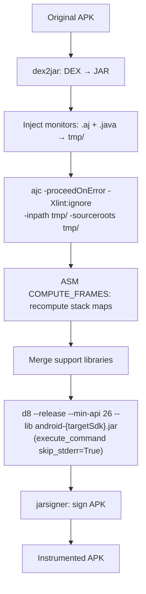

# Specification: Instrumentation Pipeline

## Purpose

The Instrumentation Pipeline domain encompasses the complete transformation of MOP (Monitoring-Oriented Programming) specifications into runtime verification monitors and their subsequent weaving into Android APK artifacts. This domain is implemented by two modules -- **rv-monitor-generator** and **rv-instrumentation** -- which together form the first phase of the RV-Android experiment workflow. Without this pipeline, no runtime verification is possible: uninstrumented APKs cannot produce `RVSEC-COV` coverage events or `RVSEC` violation events during execution.

### Problem Context

Runtime verification detects API usage violations by observing method call sequences at runtime. For this to work, three conditions MUST be met:

1. **Monitors MUST exist**: Formal MOP specifications MUST be compiled into executable AspectJ aspects and Java monitor classes that encode the expected API usage patterns.
2. **Monitors MUST be woven into the APK**: The generated aspects MUST be integrated into the APK's bytecode so that method calls trigger monitor state transitions at runtime.
3. **Coverage tracking MUST be present**: A `Coverage.aj` aspect MUST be woven alongside the monitors so that every method execution is logged via `Log.v("RVSEC-COV", signature)`, enabling real-time coverage measurement.

If any of these conditions is not met, the experiment executes on uninstrumented APKs, coverage reads 0%, and no violations are detected.

### Pipeline Architecture

The instrumentation pipeline is a linear, six-stage process that transforms DEX bytecode into instrumented DEX bytecode. The pipeline was inspired by the original **RV-Android** project by Daian et al. (Runtime Verification Inc., 2015), which implemented the same core sequence as a bash script (`instrument_apk.sh`). As research requirements grew -- multiple specification sets, batch processing, static analysis integration, experiment orchestration -- the pipeline was reimplemented in Python while preserving the same fundamental stages.

```
MOP Specifications (.mop files)
         |
         v
  [rv-monitor-generator]
         |
    (1) JavaMOP: .mop --> .aj (AspectJ aspects) + .rvm (intermediate specs)
    (2) Copy custom aspects: Coverage.aj, logging.aj --> output
    (3) RV-Monitor: .rvm --> .java (monitor classes)
    (4) Clean up: delete .rvm intermediaries
         |
         v
  Monitor Artifacts (.aj + .java files)
         |
         v
  [rv-instrumentation]
         |
    (5) Prepare: Maven dependency resolution (rv-monitor-rt.jar, aspectjrt.jar,
                 rvsec-core.jar, rvsec-logger-logcat.jar)
         |
    Per APK:
    (6)  dex2jar: APK DEX --> JAR (Java bytecode)
    (7)  Monitor Integration: copy .aj + .java into tmp/
    (8)  AspectJ Weaving: ajc compiles aspects into bytecode
    (9)  Dependency Merge: extract and merge runtime libraries
    (10) d8 Compiler: JAR --> DEX (Android bytecode)
    (11) APK Assembly: replace classes.dex in APK copy
    (12) APK Signing: dex2jar sign + jarsigner with keystore
    (13) Verification: compare hash(original) != hash(instrumented)
         |
         v
  Instrumented APK (signed, ready for deployment)
```

### Module Responsibilities

| Module | Responsibility | Key Class | Source Directory |
|--------|---------------|-----------|-----------------|
| rv-monitor-generator | Transform MOP specs into monitor artifacts | `RuntimeVerificationGenerator` | `modules/rv-monitor-generator/src/rv_monitor_generator/` |
| rv-instrumentation | Weave monitors into APK bytecode | `RVInstrumentation` | `modules/rv-instrumentation/src/rv_instrumentation/` |

### Data Models

```
RVGeneratorConfig (Pydantic BaseValidatedModel):
  javamop_bin: Optional[str]     # Path to JavaMOP binary executable
  rvmonitor_bin: Optional[str]   # Path to RV-Monitor binary executable
  mop_specs_dir: Optional[str]   # Directory containing .mop specification files
  aspects_dir: Optional[str]     # Directory containing custom .aj files (Coverage.aj, logging.aj)
  rvsec_root: Optional[str]      # RVSEC installation root for auto-discovery

RuntimeVerificationGenerator (Pydantic BaseValidatedModel):
  config: RVGeneratorConfig      # Validated configuration
  _logger: Logger                # Structured logging
  _error_handler: ErrorHandler   # Centralized error handling

RVInstrumentationConfig (Pydantic BaseValidatedModel):
  rvsec_root: Optional[str]          # RVSEC installation root
  monitor_output_dir: Optional[str]  # Directory with .aj + .java monitor artifacts
  android_jar_path: Optional[str]    # Android SDK android.jar for classpath
  android_platforms_dir: Optional[str] # Android SDK platforms directory
  instrumented_dir: Optional[str]    # Output directory for signed instrumented APKs
  working_dir: Optional[str]         # Base working directory
  tmp_dir: Optional[str]             # Temporary processing directory
  lib_tmp_dir: Optional[str]         # Library extraction directory
  rvm_tmp_dir: Optional[str]         # RV-Monitor processing directory
  keystore_file: Optional[str]       # Keystore for APK signing (defaults to bundled)
  keystore_password: Optional[str]   # Keystore password (default: "password")
  dex2jar_home: Optional[str]        # dex2jar tool suite directory

Dex2jarTools (Pydantic BaseValidatedModel):
  dex2jar: str                       # Path to d2j-dex2jar.sh
  asm_verify: str                    # Path to d2j-asm-verify.sh
  apk_sign: str                      # Path to d2j-apk-sign.sh

InstrumentationResults (Pydantic BaseValidatedModel):
  errors: Dict[str, InstrumentationError]  # Errors keyed by APK name
  success_count: int                        # Number of successfully instrumented APKs
  total_count: int                          # Total APKs processed
  success_rate: float                       # Computed: (success_count / total_count) * 100

InstrumentationError (Pydantic BaseValidatedModel):
  code: int             # Numeric error code
  tool: Optional[str]   # Name of tool that failed (dex2jar, ajc, d8, jarsigner)
  message: str          # Human-readable description
  phase: str            # Pipeline phase (decompilation, weaving, compilation, signing)
```

### Specification Sets

The pipeline processes three distinct sets of MOP specifications. Each set is used independently per experiment -- sets are NEVER mixed within a single instrumentation run. The `specification_set` parameter in `ExperimentConfig` determines which set is used. All specification sets reside under `$RVSEC_HOME/rvsec/rvsec-mop/src/main/resources/`.

| Set | Directory | Count | Origin | Purpose |
|-----|-----------|-------|--------|---------|
| JCA | `jca/` | 23 | Translated from 23 CrySL rules via TDD | Detect cryptographic API misuses (Cipher, MessageDigest, SSLContext, etc.) |
| Generic (FSM) | `generic/` | 118 | JavaMOP specification database | Detect general API pattern violations (Iterator, Collections, Streams) |
| Generic (new) | `generic_new/` | 27 | Curated subset with descriptive names | Detect general API violations (Closeable, Map, InputStream patterns) |

The JCA specifications were derived from 23 CrySL rules previously validated by cryptography experts. The translation followed a TDD approach, with 31 JUnit test classes and 200+ test methods from CogniCrypt serving as the test oracle.

### Coverage.aj Aspect

In addition to MOP monitor aspects, a custom `Coverage.aj` aspect is woven into every instrumented APK. This aspect is located in the aspects directory (`$RVSEC_HOME/rvsec/rvsec-mop/src/main/resources/aspect/coverage.aj`) and is copied into the monitor output directory by rv-monitor-generator during step (2) of the generation pipeline.

The Coverage.aj aspect:
- Intercepts all method executions (excluding system packages: `java.*`, `android.*`, `dalvik.*`)
- Logs unique method signatures via `Log.v("RVSEC-COV", signature)` on Android logcat
- Uses a `HashSet` for deduplication, ensuring each signature is logged only once per execution
- Signature format: `<className: returnType methodName(params)>`

This is the mechanism by which the downstream rv-coverage module tracks method coverage in real-time.

### Configuration Priority System

Both `RVGeneratorConfig` and `RVInstrumentationConfig` implement the same priority-based path resolution strategy:

1. **Explicit individual paths** (highest priority): All required paths provided directly
2. **Explicit `rvsec_root`**: Automatic path discovery from RVSEC installation layout
3. **`RVSEC_HOME` environment variable**: Fallback to environment-based discovery
4. **Configuration error**: If no valid source is available, a `ConfigurationError` is raised

The standard RVSEC directory layout assumed for auto-discovery:

```
$RVSEC_HOME/
  javamop/bin/javamop                              # JavaMOP binary
  rv-monitor/bin/rv-monitor                        # RV-Monitor binary
  rvsec/rvsec-mop/src/main/resources/
    jca/                                           # JCA specifications (.mop)
    generic/                                       # Generic FSM specifications (.mop)
    generic_new/                                   # Curated generic specifications (.mop)
    aspect/                                        # Custom aspects
      coverage.aj                                  # Method coverage tracking
      logging.aj                                   # Additional logging aspects
  rv-android/                                      # Working directory for instrumentation
    lib/dex2jar/                                   # dex2jar tool suite
    assets/keystore.jks                            # Development keystore
```

### Integration with Experiment Orchestration

The `PreProcessor` component in rv-experiment orchestrates the instrumentation pipeline during Phase 1 (pre-processing) of the three-phase experiment workflow:

```
PreProcessor.process(generate_monitors, instrument, static_analysis)
  |
  |--> _generate_monitors()
  |      ExperimentConfig.get_monitored_operations_config() --> RVGeneratorConfig
  |      RuntimeVerificationGenerator(config).generate_monitors(output_dir)
  |
  |--> _instrument_apks()
  |      ExperimentConfig.get_rv_instrumentation_config() --> RVInstrumentationConfig
  |      RVInstrumentation(config).instrument_apks(apks_dir, results_dir)
  |
  |--> _run_static_analysis()
         (separate domain -- not covered in this spec)
```

Both methods use Just-in-Time (JIT) configuration: `ExperimentConfig` creates `RVGeneratorConfig` and `RVInstrumentationConfig` instances only when the corresponding pre-processing step is actually invoked.

### Relationships with Other Domains

| Domain | Relationship | Contract |
|--------|-------------|----------|
| **rv-experiment** | Orchestrator | Calls `generate_monitors()` and `instrument_apks()` via JIT configs from `ExperimentConfig` |
| **rv-coverage** | Consumer | Parses `RVSEC-COV` logcat entries produced by woven Coverage.aj aspect |
| **rv-platform** | Consumer | Executes instrumented APKs on emulator; captures logcat with monitor output |
| **rv-static-analysis** | Sibling | Runs on same APKs during pre-processing; independent of instrumentation |
| **rv-android-core** | Foundation | Provides `Command`, `ErrorHandler`, `LoggingManager`, `BaseValidatedModel`, `App`, constants |

### Success Rate Context

In the ICST study, the instrumentation pipeline achieved a **34.6% success rate** (193 of 557 APKs successfully instrumented). Common failure causes include:

- dex2jar conversion failures on multidex APKs or obfuscated code
- AspectJ weaving errors due to unsupported bytecode patterns
- d8 compilation failures due to classpath issues or unsupported API levels
- DEX method count limits exceeded after monitor injection

The 188 APKs used in the final dataset were the subset of 193 that also had REACH-reachable MOP methods. Improving the instrumentation success rate is listed as a planned improvement (PRD Section 12.2).

### External Tool Dependencies

| Tool | Version Constraint | Purpose | Configuration |
|------|-------------------|---------|---------------|
| JavaMOP | Java 8+ required | Process .mop files, generate .aj and .rvm files | `javamop_bin` in `RVGeneratorConfig` |
| RV-Monitor | Java 8+ required | Transform .rvm files into .java monitor classes | `rvmonitor_bin` in `RVGeneratorConfig` |
| dex2jar | 2.x | Convert APK DEX bytecode to Java JAR | `dex2jar_home` in `RVInstrumentationConfig` |
| ajc (AspectJ) | System PATH | Weave aspects into Java bytecode | System PATH lookup |
| d8 | Android SDK | Convert JAR back to DEX format | `ANDROID_HOME` env var |
| jarsigner | JDK | Sign instrumented APK with keystore | System PATH lookup |
| Maven | System PATH | Resolve runtime dependencies (rv-monitor-rt, aspectjrt, etc.) | System PATH lookup |
| zip | System PATH | APK manipulation (DEX replacement, META-INF cleanup) | System PATH lookup |

## Data Contracts

### Input

- `mop_specs_dir: str` -- Directory containing `.mop` specification files (source: `$RVSEC_HOME/rvsec/rvsec-mop/src/main/resources/{jca,generic,generic_new}/`)
- `aspects_dir: str` -- Directory containing custom `.aj` files including Coverage.aj (source: `$RVSEC_HOME/rvsec/rvsec-mop/src/main/resources/aspect/`)
- `javamop_bin: str` -- Path to JavaMOP executable (source: `$RVSEC_HOME/javamop/bin/javamop`)
- `rvmonitor_bin: str` -- Path to RV-Monitor executable (source: `$RVSEC_HOME/rv-monitor/bin/rv-monitor`)
- `apks_dir: str` -- Directory containing original APK files to instrument (source: experiment configuration)
- `android_jar_path: str` -- Path to `android.jar` from Android SDK (source: `$ANDROID_HOME/platforms/android-29/android.jar`)
- `monitor_output_dir: str` -- Directory with generated monitor artifacts (source: output of rv-monitor-generator)
- `keystore_file: str` -- JKS keystore file for APK signing (source: bundled `assets/keystore.jks` or user-provided)

### Output

- `monitor_output_dir/` -- Directory containing generated artifacts:
  - `MultiSpec_*.aj` -- Merged AspectJ aspects from JavaMOP (pointcuts and advice)
  - `*MonitorAspect.aj` -- Individual monitor aspects
  - `*.java` -- Java monitor classes from RV-Monitor
  - `coverage.aj` -- Coverage aspect (copied from aspects_dir)
  - `logging.aj` -- Logging aspect (copied from aspects_dir)
- `instrumented_dir/` -- Directory containing signed instrumented APK files (consumer: rv-platform for emulator deployment)
- `InstrumentationResults` -- Pydantic model with success/error counts (consumer: rv-experiment post-processing)
- `instrument_errors.json` -- JSON file with per-APK error details (consumer: rv-experiment result manager)

### Side-Effects

- **File System (monitor generation)**: Creates and resets the monitor output directory; moves `.rvm` files between directories as a workaround for the JavaMOP `-d` bug
- **File System (instrumentation)**: Creates temporary directories (`tmp/`, `lib_tmp/`, `rvm_tmp/`) during processing and deletes them after each APK; creates the instrumented output directory
- **File System (Maven)**: Executes `mvn clean compile` to download and stage runtime dependencies into `lib_tmp/`
- **File System (signing)**: Creates signed APK files in the instrumented output directory using the configured keystore
- **Process execution**: Spawns external processes for JavaMOP, RV-Monitor, dex2jar, ajc, d8, jarsigner, Maven, and zip

### Error

- `ConfigurationError` -- Raised when path resolution fails, binaries are not found or not executable, MOP specifications are not found, Android SDK is not configured, or keystore is missing
- `CommandException` -- Raised when an external tool (JavaMOP, RV-Monitor, dex2jar, ajc, d8, jarsigner) returns a non-zero exit code or produces error output
- `InstrumentationError` -- Raised when a pipeline phase fails (decompilation, weaving, compilation, signing) or when the instrumented APK hash matches the original (indicating instrumentation had no effect)
- `RVAndroidError` -- Base exception class from rv-android-core; `ConfigurationError` inherits from it

## Invariants

- **INV-INS-01**: A monitor generation run MUST produce at least one `.aj` file and at least one `.java` file in the output directory when given a non-empty `mop_specs_dir`. If the output directory is empty after generation, the pipeline MUST return `False`.

- **INV-INS-02**: The `mop_specs_dir` MUST contain at least one `.mop` file. If no `.mop` files are found, `RVGeneratorConfig` MUST raise a `ConfigurationError` during initialization with a message listing available specification sets.

- **INV-INS-03**: The `javamop_bin` and `rvmonitor_bin` MUST point to existing, executable files. Both tools MUST produce output (stdout or stderr) when invoked with the `-h` flag. If either check fails, `RVGeneratorConfig` MUST raise a `ConfigurationError`.

- **INV-INS-04**: RV-Monitor MUST NOT leave `.rvm` intermediary files in the output directory after generation completes. The generator MUST delete all `.rvm` files from the output directory after RV-Monitor finishes.

- **INV-INS-05**: Custom aspects from `aspects_dir` (including `Coverage.aj`) MUST be copied into the monitor output directory during JavaMOP execution. The `Coverage.aj` aspect MUST be present in the output to enable method coverage tracking.

- **INV-INS-06**: An instrumented APK MUST have a different file hash than its original APK. If `hash(original) == hash(instrumented)`, `RVInstrumentation.check_if_instrumented()` MUST raise a `CommandException`, indicating instrumentation had no effect.

- **INV-INS-07**: The `monitor_output_dir` for instrumentation MUST contain both `.aj` files and `.java` files before instrumentation begins. `RVInstrumentationConfig._validate_monitor_artifacts()` MUST raise a `ConfigurationError` if either is missing.

- **INV-INS-08**: Temporary directories (`tmp_dir`, `rvm_tmp_dir`) MUST be cleaned after each APK instrumentation, whether the instrumentation succeeded or failed. The `lib_tmp_dir` MUST be cleaned after the entire batch completes.

- **INV-INS-09**: Specification sets MUST NOT be mixed within a single generation or instrumentation run. The `specification_set` field in `ExperimentConfig` MUST be one of `"jca"`, `"generic"`, or `"custom"`. If `"custom"` is specified, `custom_specs_dir` MUST be provided.

- **INV-INS-10**: The instrumented APK MUST be signed with a valid keystore before being placed in `instrumented_dir`. The signing process MUST include both `d2j-apk-sign` (initial signing) and `jarsigner` (keystore signing with SHA256withRSA / SHA-256 digest), followed by `jarsigner -verify` to confirm signature integrity.

- **INV-INS-11**: The dex2jar tools (`d2j-dex2jar.sh`, `d2j-asm-verify.sh`, `d2j-apk-sign.sh`) MUST exist and be executable in the `dex2jar_home` directory. `Dex2jarTools` field validators MUST raise `ValueError` if any tool is missing or not executable.

- **INV-INS-12**: When `RVSEC_HOME` is not set and no explicit paths are provided, both `RVGeneratorConfig` and `RVInstrumentationConfig` MUST raise a `ConfigurationError` during initialization, not during execution.

- **INV-INS-88**: For every row in the closed enumeration declared under `Requirement: AspectJ Grammar Coverage Matrix as Contract`, `docs/aspectj_grammar_coverage.md` MUST contain exactly one matrix row. New AspectJ versions or new corpora MUST result in a new row added by amendment, not implicit support.
- **INV-INS-89**: For every matrix row, the `Verdict` column MUST take exactly one value from the set `{COVERED, SILENT-GAP, EXPLICIT-NO-OP, NOT-NEEDED}`. `NOT-NEEDED` is permitted via exactly two paths: (path α) `DemandCounter.countMop` zero across all four corpora AND no parser/matcher/emitter implementation; OR (path β) the row reflects an AspectJ production with non-zero source-level demand absorbed by an upstream pipeline stage before reaching the dexlib2 pipeline. Path β requires the matrix Evidence column to (a) cite both source and pipeline demand counts, AND (b) name the upstream absorber from the set declared in `Requirement: Upstream Absorption Verdict`, AND (c) cite the empirical evidence (file:line or RELATORIO citation), AND (d) cite an enabled passing test asserting the absorption claim.
- **INV-INS-90**: For every matrix row with `Verdict = COVERED`, there MUST exist an enabled (non-`@Disabled`) passing test in `rvsec-android/rvsec-instrumentation-dexlib2/grammar-tests/` whose FQN appears in the row's `Evidence` column.
- **INV-INS-91**: (Round-8 reformulation.) The matrix MUST NOT contain any row with `Verdict = SILENT-GAP` post-archive. `MatrixIntegrityTest.testNoSilentGapRowsRemain` SHALL fail the build if any row carries `SILENT-GAP` after gh62 archives. The round-6 `ledger.md` requirement was superseded in round-7 by `Requirement: Deferred-by-Design Document`; the `ledger.snapshot.sha256` tripwire was replaced by `deferred.snapshot.sha256` covering the new document. The round-8 reformulation additionally formalises path β via `Requirement: Upstream Absorption Verdict`, eliminating the round-7 ambiguity where source-level non-zero-demand constructions absorbed by upstream stages had to be force-fit into path α or shipped as in-change closures attacking nothing.
- **INV-INS-92**: For every enabled test method in `grammar-tests/`, there MUST be exactly one matrix row whose `Verdict ∈ {COVERED, EXPLICIT-NO-OP, NOT-NEEDED}` and `Evidence` column resolves to that method. Orphan tests and orphan rows MUST break the build. Post-round-8, no `@Disabled` annotation remains; `testSkipCountEqualsZero` SHALL enforce this.
- **INV-INS-93**: The matrix demand counts MUST be reproducible by `DemandCounter` invoked from `MatrixIntegrityTest.testSourceDemandCountsReproducible` AND `MatrixIntegrityTest.testPipelineDemandCountsReproducible`. Counts MUST be re-verified whenever a new `.mop` OR `.aj` file is added to any of the four corpora OR whenever the JavaMOP toolchain regenerates the committed `empirical-monitors/` snapshot (the canonical pipeline corpus; `results/gh53_smoke_dexlib2/monitors/` is an optional byte-identical regen input). `DemandCounter` SHALL scan BOTH `.mop` AND compiled `.aj` files via two distinct helpers (`countMop` and `countCompiledAj`); the per-designator regex SHALL distinguish *pointcut* uses from *Java statement* uses; the helper MUST be portable Java. **Round-11 reproducibility pin**: each matrix row SHALL quote its per-designator `java.util.regex.Pattern` literal inline AND state the counting rule explicitly — (a) per-occurrence vs per-line (e.g. §4.O `T+`-owner counts per-occurrence of the `+.` owner token = 64, NOT the per-line figure of 39; a single pointcut line ORs several `Map+`/`Collection+` owners), and (b) whether negated forms are included and which row owns them (the negated `!target(Type)`/`!args(Type)` occurrences MUST be owned by exactly one of §4.TT/§4.AT or §4.N, not double-counted — disambiguate so `target(Type)` = 22 and `!target/!args` = 16 do not both claim the same 14 negated sites). Without these two rules pinned, `testPipelineDemandCountsReproducible` has no deterministic count to assert against.
- **INV-INS-94**: For every matrix row covered by the **eleven round-11 in-change closures** (§4.{O,N,V,X,TT,AT,Y,T,B,D,I} — §4.E/§4.W NOT-NEEDED β [absorber `coverage-weaver`]; §4.R NOT-NEEDED α [R11.3]; §4.JP folded into §4.Y), the `Verdict` MUST be `COVERED` and the `Evidence` MUST cite an enabled test in `grammar-tests/` exercising the corpus pattern that motivated the closure. `MatrixIntegrityTest.testRoundEightClosuresAreCovered` SHALL fail the build if any of these rows regresses from `COVERED`. (Test method name retained for cross-commit stability; it asserts the round-11 eleven-closure set.)
- **INV-INS-95**: The **eleven round-11 closures** SHIP as bisect-friendly atomic commits (one closure per commit, §4.{O,N,V,X,TT,AT,Y,T,B,D,I} in tasks). For every commit landing a closure, the matrix row flip (`SILENT-GAP` → `COVERED`) MUST occur in the same commit; orphan tests and orphan rows are caught by INV-INS-92. The NOT-NEEDED reclassification assertion tests (§4.E', §4.W' [coverage-weaver absorber], §4.R' [zero demand]) and the §4.Y.4-§4.Y.7 fork-free Signature-delivery sub-closure SHIP as their own atomic commits per tasks. `MatrixIntegrityTest.testClosureLocFootprintMatchesMatrixDelta` SHALL log (advisory; non-blocking) the LOC delta per closure commit and the number of matrix rows flipped.
- **INV-INS-96**: (Round-8 introduction.) For every matrix row with `Verdict = NOT-NEEDED β`, the assertion test SHALL exercise THREE properties: (a) `DemandCounter.countMop(designator) ≥ 1` to confirm source-level demand exists; (b) `DemandCounter.countCompiledAj(designator) == 0` to confirm pipeline absorption; (c) the named upstream absorber file/module exists and contains the documented evidence anchor. The test FAILS if any of the three properties changes — guarding against silent regression of an upstream stage that would re-surface the construction at the instrumenter without notice. `AbsorptionClaimsContractTest` SHALL aggregate all path-β absorber assertions.
- **INV-INS-97**: (Round-8 introduction; **round-8 empirical revision 2026-05-28** — the round-7/early-round-8 draft assumed a new `namedPointcuts: Map<String, PointcutExpression>` field would be added cross-repo to the JavaMOP-emitted `AspectDescriptor` JSON. Empirical inspection of `descriptor-reader/src/main/java/br/unb/cic/rv/descriptor/AspectDescriptor.java` and the production JSON fixture `descriptor-reader/src/test/resources/MultiSpec_1MonitorAspect.json` proved that the schema already exposes a load-bearing `baseAspectExclusions: List<String>` field — the pre-expanded output of `BaseAspect.notwithin()` populated by `javamop.output.descriptor.DescriptorWriter#defaultBaseAspectExclusions()` (twelve package patterns including `sun..*`, `java..*`, `mop..*`, `com.runtimeverification..*`). The cross-repo `namedPointcuts` change is therefore RETIRED.) The `AspectDescriptor` schema MUST continue to carry the existing `baseAspectExclusions: List<String>` field as the source of truth for `BaseAspect.notwithin()` expansion. The `NamedRefPC` matcher MUST resolve the literal reference `BaseAspect.notwithin` against `descriptor.getBaseAspectExclusions()` (consumed by the §4.B `BaseAspectExpander`); any other `NamedRefPC` name not recognised by the matcher MUST cause `UnresolvedNamedRefException` (fail-closed). `NamedRefResolverTest` SHALL cover three paths: (a) successful `BaseAspect.notwithin` expansion against the canonical twelve-entry exclusion list; (b) fail-closed on unrecognised names; (c) fail-closed when `baseAspectExclusions` is empty (legacy descriptor). The round-8 archive precondition (tasks §0.5) is correspondingly downgraded from "verify cross-repo `namedPointcuts` emission" to "verify `baseAspectExclusions` is non-empty in production descriptors and matches the `defaultBaseAspectExclusions()` baseline".
- **INV-INS-98**: (**Round-11 R11.5 repurpose** — the round-8 `MonitorRuntime.evaluateIf`/`ifId`/`MonitorRuntimeIfHelperEmitter` runtime-delegation contract is RETIRED; it required fork-side generation and exists in neither the JavaMOP nor the RV-Monitor fork.) The `if(...)` PCD MUST be lowered **entirely in the dexlib2 weaver**, fork-free: `IfGuardEmitter.emit()` MUST recognise exactly the two expression shapes present in the corpus — `<bound> == null` (lowered to `if-nez <reg>, :skip`) and `!Thread.holdsLock(<bound>)` (lowered to `invoke-static Ljava/lang/Thread;->holdsLock(Ljava/lang/Object;)Z` + `move-result` + `if-nez`) — placing the monitor invoke after the skip-label so it is bypassed exactly when the guard is false. The bound register MUST come from `ctx.match` (`target`/`args` binding) and the expression text from `IfPC.javaExpression`. Any other shape MUST fail loud with `UnsupportedAspectConstructError` (no silent always-match). No `evaluateIf`, no `ifId`, no fork-side helper. `IfGuardLoweringTest` SHALL verify (a) the null-check shape lowers to `if-nez`; (b) the `holdsLock` shape lowers to `invoke-static` + branch; (c) an unsupported shape fails loud; (d) the monitor invoke is skipped exactly when the guard is false.

#### Scenario: unsupported if(...) shape fails loud at weave time (round-11 R11.5 — REPLACES the retired ifId/evaluateIf scenarios)

- **WHEN** the weaver encounters an `if(<expr>)` PCD whose `<expr>` is neither `<bound> == null` nor `!Thread.holdsLock(<bound>)` (the only two shapes in the corpus)
- **THEN** `IfGuardEmitter.emit()` SHALL throw `UnsupportedAspectConstructError` naming the unrecognised expression and the aspect — failing the build rather than emitting a silent always-match guard
- **AND** `IfGuardLoweringTest.unsupportedShapeFailsLoud` SHALL pin this behaviour; a future corpus introducing a new `if(...)` shape forces a new sub-change extending the lowering dispatch
- **INV-INS-99**: (Round-8 round-7-supersession.) The round-7 *meanings* of INV-INS-96 (substrate contract), INV-INS-97 (FQN remap), and INV-INS-99 (Coverage.aj e2e) are SUPERSEDED — those round-7 invariants asserted properties of artefacts that round-8+ does not ship (the `aspectjlang/` substrate and the Coverage.aj end-to-end smoke test). In the 96-98 slot the ACTIVE (round-8+) invariants are INV-INS-96 (path-β absorber contract), INV-INS-97 (`baseAspectExclusions` schema — the round-7 `namedPointcuts` plan was itself RETIRED), and INV-INS-98 (**round-11 R11.5: fork-free in-weaver `if()` lowering** — the round-8 `if`-runtime-delegation meaning is RETIRED). INV-INS-100/101/102 below are round-8 introductions, NOT round-7 invariants, and are unaffected by this supersession note (the earlier "round-7 numbering above 100 (none existed)" wording was itself stale — 100/101/102 now exist).
- **INV-INS-100**: The `deferred.md` document MUST contain exactly one entry per matrix row with `Verdict ∈ {EXPLICIT-NO-OP, NOT-NEEDED}` (path α and path β). The document is content-addressed via `deferred.snapshot.sha256` (committed to `grammar-tests/src/test/resources/`); `testDeferredDocumentIsFrozenPostArchive` SHALL verify the live document's SHA against the snapshot and fail if they diverge. Round-8 race-condition fix: the snapshot generation SHALL occur in the same commit as the final `deferred.md` edit (tasks §1.4) to eliminate the round-7 race between `deferred.md` mutations during closure implementation and the post-archive snapshot creation.
- **INV-INS-101**: (Round-8 introduction — Z-decision per cross-LLM meta-review.) The §4.B `BaseAspectExpander` consumes a `List<String>` whose canonical length in production is twelve (per `DescriptorWriter.defaultBaseAspectExclusions()`); the matcher behaviour MUST be tested at N≥2 to guarantee future-proofing against descriptors that override `--baseaspect` with shorter lists. `NamedReferenceGrammarTest.baseAspectNotwithinExpandsTwelveExclusionsList` SHALL exercise (a) the canonical twelve-entry expansion (production baseline); (b) a synthetic two-entry list (smallest non-degenerate AND-chain — `["foo..*", "bar..*"]`); (c) a synthetic one-entry list (degenerate AND-of-one returns the single `NotWithinPC` directly); (d) the empty-list fail-closed case (`LegacyDescriptorException` per INV-INS-97).
- **INV-INS-102**: (Round-8 introduction — W-decision per cross-LLM meta-review.) `docs/aspectj_grammar_coverage.md` is the **single source of truth** for the dexlib2 AspectJ surface. The legacy inventory documents at `docs/AJ_CONSTRUCTIONS_INVENTORY.md` and `docs/AJ_TO_DEXLIB2_MAPPING.md` SHALL carry a header banner declaring "SUPERSEDED — see `docs/aspectj_grammar_coverage.md` as the live contract; this file preserved as historical inventory only" and SHALL NOT be cited by any test, scenario, or invariant in this delta spec. `MatrixIntegrityTest.testNoCompetingSourceOfTruth` SHALL fail the build if either legacy document is amended without the banner present (a `git grep -L 'SUPERSEDED' docs/AJ_CONSTRUCTIONS_INVENTORY.md docs/AJ_TO_DEXLIB2_MAPPING.md` style check).
## Requirements
### Requirement: Monitor Generation from JavaMOP Specifications (FR01, NFR07)

The system MUST generate runtime verification monitors from MOP specification files through a coordinated pipeline of two tools: JavaMOP and RV-Monitor. JavaMOP reads `.mop` files and produces three artifacts: (a) `.aj` AspectJ files that define pointcuts and weaving advice for method interception, (b) `.rvm` intermediate files containing monitor state machine specifications, and (c) — when the patched JavaMOP is invoked with `--emit-descriptor` — `MultiSpec_*MonitorAspect.json` JSON descriptors mirroring the semantic content of each merged `.aj` (see Requirement: JavaMOP Descriptor Format and Emission). RV-Monitor then reads the `.rvm` files and synthesizes `.java` monitor classes that implement the runtime verification logic.

The generation pipeline uses the `-merge` flag for both JavaMOP and RV-Monitor, which combines multiple specification files into unified merged artifacts. This is critical because merged monitors share a single aspect that intercepts all relevant methods, rather than creating individual aspects per specification that would multiply the runtime overhead.

The patched JavaMOP exposes the `--emit-descriptor` flag (commit pinned in the gh52 design document). When the flag is enabled in the generator's invocation, every merged aspect MUST receive a sibling JSON descriptor in `output_dir`. The descriptor emission MUST be additive: existing `.aj`, `.rvm`, and `.java` outputs MUST remain byte-identical to the unflagged invocation. `RuntimeVerificationGenerator` MUST enable `--emit-descriptor` by default to support both instrumentation variants from a single generation run.

A known bug in JavaMOP's `-d` (output directory) option causes `.rvm` files to remain in the source `mop_specs_dir` instead of being placed in the output directory. The generator MUST implement a workaround by explicitly moving `.rvm` files from `mop_specs_dir` to the output directory after JavaMOP execution.

After JavaMOP completes, custom AspectJ files from the `aspects_dir` MUST be copied into the output directory. This includes `Coverage.aj` (method coverage tracking) and `logging.aj` (additional logging). These custom aspects are woven alongside the generated monitor aspects during instrumentation under the `ajc` variant, and the `Coverage.aj` semantics are reimplemented natively in the `coverage-weaver` submodule for the `dexlib2` variant.

After RV-Monitor completes, all intermediate `.rvm` files MUST be deleted from the output directory, as they are no longer needed.

#### Scenario: Successful generation with a specification set and descriptor emission

- **WHEN** `mop_specs_dir` points to one of the specification-set directories under `$RVSEC_HOME/rvsec/rvsec-mop/src/main/resources/` (`jca/` with 23 `.mop` files in the current corpus, or `generic/` / `generic_new/` with their own counts), and `javamop_bin` is the patched JavaMOP supporting `--emit-descriptor`, and `rvmonitor_bin` is a valid executable, and `aspects_dir` contains `coverage.aj` and `logging.aj`
- **THEN** `RuntimeVerificationGenerator.generate_monitors(output_dir)` MUST return `True`
- **AND** the output directory MUST contain at least one `.aj` file (merged aspects from JavaMOP)
- **AND** the output directory MUST contain at least one `MultiSpec_*MonitorAspect.json` file (descriptor emitted under the new flag)
- **AND** the output directory MUST contain at least one `.java` file (monitor classes from RV-Monitor)
- **AND** the output directory MUST contain `coverage.aj` (copied from aspects_dir)
- **AND** the output directory MUST NOT contain any `.rvm` files (intermediaries cleaned up)
- **AND** an experiment run uses exactly one set at a time — the caller selects which set via the Python wrapper's configuration, and descriptor emission is identical in structure across sets

#### Scenario: Generation with empty specification directory

- **WHEN** `mop_specs_dir` points to a directory containing zero `.mop` files
- **THEN** `RVGeneratorConfig` initialization MUST raise a `ConfigurationError`
- **AND** the error message MUST list the available specification sets (JCA, Generic)

#### Scenario: JavaMOP binary not found

- **WHEN** `javamop_bin` points to a path that does not exist
- **THEN** `RVGeneratorConfig` initialization MUST raise a `ConfigurationError` with message `"JavaMOP binary not found: {path}"`

#### Scenario: JavaMOP binary not executable

- **WHEN** `javamop_bin` points to a file that exists but lacks execute permissions
- **THEN** `RVGeneratorConfig` initialization MUST raise a `ConfigurationError` with message `"JavaMOP binary not executable: {path}"`

#### Scenario: RV-Monitor execution failure

- **WHEN** RV-Monitor returns a non-zero exit code during `.rvm` processing
- **THEN** `generate_monitors()` MUST catch the `CommandException`
- **AND** `generate_monitors()` MUST return `False`
- **AND** the error MUST be logged via `ErrorHandler.handle_error()` with context including `component`, `operation`, `output_dir`, and `mop_specs_dir`

#### Scenario: Descriptor emission disabled

- **WHEN** `RuntimeVerificationGenerator` is invoked with `emit_descriptor=False` (override of default)
- **THEN** the output directory MUST contain `.aj` and `.java` artifacts as before
- **AND** the output directory MUST NOT contain any `.json` descriptor files
- **AND** subsequent attempts to use `instrumentation_variant == "dexlib2"` MUST raise `MissingDescriptorError` (see DEX-Native Pipeline requirement)

#### Scenario: Generation summary after successful run with descriptor emission

- **WHEN** `generate_monitors()` has completed successfully in `output_dir` with descriptor emission enabled
- **THEN** `get_generation_summary(output_dir)` MUST return a dictionary with keys `output_directory`, `aspectj_files` (count), `monitor_classes` (count), `descriptors` (count), and `specs_processed` (containing `source_directory` and `count`)

### Requirement: APK Instrumentation with Monitors (FR02)

The system MUST instrument Android APKs with generated runtime verification monitors through a multi-phase pipeline. The pipeline transforms a standard APK into a monitored APK by: (1) decompiling DEX bytecode to Java classes, (2) injecting monitor artifacts, (3) weaving aspects via AspectJ, (4) recomputing stack map frames via ASM, (5) merging runtime dependencies, (6) recompiling to DEX, and (7) signing the APK.



The instrumentation pipeline relies on several external tools that MUST be available:
- **dex2jar** (`d2j-dex2jar.sh`): Converts APK DEX bytecode to JAR format. If the conversion produces an exception file, the pipeline MUST raise a `CommandException`.
- **ajc (AspectJ Compiler 1.9.25.1)**: Weaves monitor pointcuts into application bytecode. Uses Java 1.8 source compatibility (`-source 1.8`), suppresses lint warnings (`-Xlint:ignore`), and proceeds on class-level errors (`-proceedOnError`). The classpath MUST include the `android.jar` matching the APK's `targetSdkVersion` and all runtime verification JARs from `lib_tmp_dir`.
- **rv-frame-computer.jar**: Recomputes stack map frames on all `.class` files in `tmp_dir` using ASM's `ClassWriter.COMPUTE_FRAMES`. Runs after ajc weaving, before library merging.
- **d8 (Android DEX compiler)**: Converts the instrumented JAR back to DEX format. Uses `--release` mode with `--min-api 26` and `--lib` pointing to the dynamically selected `android.jar`. Invoked with `skip_stderr=True` so non-fatal stderr warnings do not mask a successful build (exit code still gates failure).
- **jarsigner**: Signs the APK with the configured keystore using `SHA256withRSA` signature algorithm and `SHA-256` digest algorithm.
- **Maven**: Resolves and downloads runtime dependencies (`rv-monitor-rt.jar`, `rvsec-core.jar`, `rvsec-logger-logcat.jar`, `aspectjrt.jar`) into `lib_tmp_dir`.

After AspectJ weaving and before merging support libraries, the pipeline MUST run the ASM frame recomputation step on all woven `.class` files. This step addresses stack map frame corruption left by ajc's BCEL-based bytecode manipulation, which is the root cause of d8 AIOOBE (ArrayIndexOutOfBoundsException) failures.

MOP coverage scope: library bytecode is weaved by ajc like any other class. At runtime, `Coverage.aj`'s `excludedPackages()` pointcut short-circuits coverage/MOP tag emission for packages such as `sun..*`, `java..*`, `androidx..*`, `kotlin..*`, `com.google..*`, `com.facebook..*`, `org.apache..*`, `libcore..*`, `mop..*`, `javamop..*`, `rvmonitorrt..*`. This preserves app-code monitoring while keeping the pipeline free of compile-time exclusion configuration.

Before instrumentation begins, `prepare_instrumentation()` MUST clean temporary directories from previous runs and execute Maven dependency resolution. After each APK, temporary directories (`tmp_dir`, `rvm_tmp_dir`) MUST be cleaned. After the entire batch, `lib_tmp_dir` MUST be cleaned.

The pipeline supports both single APK instrumentation (`instrument()`) and batch instrumentation (`instrument_apks()`). Batch instrumentation provides error isolation: if one APK fails, processing continues with the next APK. All errors are collected in `InstrumentationResults.errors` and saved to `instrument_errors.json`.

The following pipeline methods MUST use `@ErrorHandler.handle_errors` with `reraise=True` to ensure exceptions propagate to the batch loop: `instrument()`, `__include_generated_monitors()`, `__weave_monitors()`, `__compute_stack_frames()`, `__create_apk()`, `__merge_support_classes()`, `__sign_apk()`. The batch loop (`instrument_apks()`) MUST use `reraise=False` (default) to continue processing after per-APK failures.

When a pipeline phase raises an exception with `_error_phase` annotated by the ErrorHandler decorator, the batch loop MUST use `getattr(ex, '_error_phase', fallback)` to populate `InstrumentationError.phase` with the actual pipeline phase (e.g., `"apk_signing"`, `"apk_creation"`, `"aspect_weaving"`, `"frame_computation"`) instead of hardcoded generic values.

#### Scenario: Effective weaving — aspectOf calls present in app bytecode

- **WHEN** an APK is instrumented and the pipeline completes successfully
- **THEN** the resulting DEX files MUST contain at least one `aspectOf` invocation inside the application's own package classes (outside `classes.dex`, which holds the aspect definitions themselves)
- **AND** installing and launching the APK on an Android emulator with `--min-api 26` or higher MUST emit at least one `RVSEC-COV` logcat entry identifying an application method during normal UI navigation

#### Scenario: Runtime nest-mate access for monitor runtime

- **WHEN** the monitor runtime thread `MonitorCleaner` runs on Android with API level ≥ 26 (below the native nest-based access control threshold of API 30)
- **THEN** inner-class field access from `TerminatedMonitorCleaner$Runner` to `TerminatedMonitorCleaner.removedEntries` MUST succeed without raising `java.lang.IllegalAccessError`
- **AND** this MUST be achieved by letting d8 generate synthetic accessors (default behavior; `--no-desugaring` is NOT used)

#### Scenario: ajc proceeds on class-level errors

- **WHEN** ajc encounters a class with incompatible bytecode (e.g., invalid stack map frames) during weaving
- **THEN** ajc MUST continue processing remaining classes instead of aborting (due to `-proceedOnError`)
- **AND** the problematic class MUST be included in the output with its original bytecode (not woven)
- **AND** all other classes MUST be woven normally
- **AND** `utils.execute_command` MUST be called with `skip_stderr=True` so the `"AspectJ Internal Error: unable to add stackmap attributes to class 'X'"` messages ajc writes to stderr do not fail the APK; only a non-zero ajc exit code is treated as failure

#### Scenario: ASM frame recomputation post-weaving

- **WHEN** ajc weaving completes
- **THEN** `__compute_stack_frames()` MUST invoke `rv-frame-computer.jar` on `tmp_dir`
- **AND** all `.class` files in `tmp_dir` (recursively) MUST have their stack map frames recomputed using ASM `ClassWriter.COMPUTE_FRAMES`
- **AND** files that fail frame computation (e.g., unresolvable type hierarchy) MUST be logged and preserved with their original bytecode
- **AND** the count of successfully recomputed and failed files MUST be logged
- **AND** `utils.execute_command` MUST be called with `skip_stderr=True` so the per-class "Warning: frame computation failed for …" stderr entries do not mark the entire APK as failed; only a non-zero JVM exit code is treated as failure

#### Scenario: Dynamic android.jar selection by targetSdkVersion

- **WHEN** an APK with `targetSdkVersion=34` is being instrumented and `android-34/android.jar` exists in the SDK platforms directory
- **THEN** `__get_android_jar(app)` MUST return the path to `android-34/android.jar`
- **AND** ajc MUST use this `android.jar` in its classpath
- **AND** d8 MUST use this `android.jar` as `--lib` argument

#### Scenario: Dynamic android.jar fallback to highest available

- **WHEN** an APK with `targetSdkVersion=36` is being instrumented but `android-36/android.jar` does not exist, and the highest available is `android-34`
- **THEN** `__get_android_jar(app)` MUST return the path to `android-34/android.jar`
- **AND** a log message MUST indicate the fallback: "Platform android-36 not available, using android-34"

#### Scenario: d8 ignores non-fatal stderr warnings

- **WHEN** d8 emits stderr output such as "Warning: Expected stack map table for method with non-linear control flow." while still returning exit code 0
- **THEN** the pipeline MUST treat the build as successful
- **AND** the warnings MUST NOT be reported as errors in `InstrumentationResults.errors`

#### Scenario: Native libraries page-aligned before signing

- **WHEN** the pipeline has produced an unsigned APK via `__d8()` and is about to invoke `__sign_apk()`
- **THEN** `__zipalign(unsigned_apk)` MUST run `zipalign -f -P 16 4 <unsigned_apk> <unsigned_apk>.aligned` and replace the unsigned APK in place with the aligned output
- **AND** the subsequent `__sign_apk()` (apksigner) MUST preserve the alignment so the final installed APK has uncompressed `.so` entries at 16 KiB boundaries
- **AND** installation MUST NOT fail with `INSTALL_FAILED_INVALID_APK: Failed to extract native libraries, res=-2`

#### Scenario: APK signed with v1+v2+v3 schemes via apksigner

- **WHEN** the pipeline has produced an aligned unsigned APK and is ready to sign
- **THEN** `__sign_apk(app, unsigned_apk)` MUST invoke `apksigner sign --ks <keystore_file> --ks-pass pass:<keystore_password> --ks-key-alias <keystore_alias> <apk_path>` where `<apk_path>` is the unsigned APK (apksigner overwrites in place by default)
- **AND** the call MUST NOT pass any flag that disables `v2-signing-enabled` or `v3-signing-enabled` — both default to true in apksigner 0.9+
- **AND** after signing, the pipeline MUST invoke `apksigner verify <apk_path>` and treat a non-zero exit code as failure
- **AND** the resulting signed APK MUST install on an Android API 30 emulator without `INSTALL_PARSE_FAILED_NO_CERTIFICATES`
- **AND** the pipeline MUST NOT contain calls to `jarsigner`, `d2j-apk-sign.sh`, or a META-INF strip step

#### Scenario: ASM frame recomputation runs BEFORE ajc as well as after

- **WHEN** `__include_generated_monitors()` has finished copying `.aj`/`.java` sources into `tmp_dir`
- **THEN** `__pre_compute_stack_frames(app)` MUST run `rv-frame-computer.jar` over `tmp_dir` (ErrorHandler phase `pre_frame_computation`) before `__weave_monitors()` is invoked
- **AND** after `__weave_monitors()` finishes, the existing `__compute_stack_frames(app)` MUST run the same JAR over `tmp_dir` again (phase `frame_computation`)
- **AND** both invocations MUST pass `skip_stderr=True` to `utils.execute_command` so per-class warnings ("Warning: frame computation failed for ...") do not fail the APK
- **AND** APKs that previously failed with `AspectJ Internal Error: unable to add stackmap attributes to class '<X>'. Index -1 out of bounds for length 0` (e.g., `org.apache.tika.parser.CryptoParser`, `okio.Buffer`, `androidx.media3.datasource.AesFlushingCipher`) MUST now weave successfully in the majority of cases

#### Scenario: Pre-desugared `j$.*` shims stripped before instrumentation

- **WHEN** `__decompile_apk()` has produced `tmp_dir` and before `__include_generated_monitors()` runs
- **THEN** `__strip_desugared_shims(app)` MUST delete every `.class` file under `tmp_dir/j$/**`
- **AND** the number of removed shims MUST be logged at INFO level
- **AND** subsequent `__d8()` invocation MUST NOT fail with `Merging DEX file containing classes with prefix 'j$.' with other classes, except classes with prefix 'java.', is not allowed`
- **AND** the resulting APK MUST run correctly on Android API ≥ 26 (no `j$.*` references remain; the runtime's native `java.*` classes satisfy all calls)

#### Scenario: Problematic library classes quarantined and restored

- **WHEN** `__strip_desugared_shims()` has finished and before `__include_generated_monitors()` runs
- **THEN** `__quarantine_problematic_classes(app)` MUST move every `.class` file whose path matches a pattern in `assets/weaving_excludes.yaml` (e.g., `okio/**/*.class`, `androidx/media3/datasource/**/*.class`) into a `<tmp_dir>_quarantine/` (a sibling of `tmp_dir`, NOT a subdirectory — ajc's `-inpath` and the frame computer's walker would otherwise descend into any subdirectory and defeat the isolation) subdirectory, preserving the relative subtree
- **AND** the method MUST NOT quarantine any file whose path starts with the APK's `App.code_package` (if a pattern does match app code, a WARNING MUST be logged and the match MUST be ignored)
- **AND** the count of quarantined files MUST be logged at INFO
- **AND** after `__compute_stack_frames()` (post-ajc) and before `__merge_support_classes()`, `__restore_quarantined_classes(app)` MUST move every file from `tmp_dir/.quarantine/**` back into its original relative location under `tmp_dir`, OVERWRITING any file already present at that location
- **AND** the `<tmp_dir>_quarantine/` directory MUST be empty (or deleted) after restore completes
- **AND** neither ajc's `AspectJ Internal Error: unable to add stackmap attributes to class '<X>'` nor d8's `Error in ... at L<X>;...: java.lang.ArrayIndexOutOfBoundsException: Index -1 out of bounds for length 0` MUST fail the APK for any `<X>` whose package is in the quarantine list

#### Scenario: Quarantine phase skipped when `enable_quarantine=False`

- **WHEN** `AjcInstrumentationConfig.enable_quarantine` is set to `False` (via Pydantic constructor or via the CLI flag `--no-quarantine` on `instrument` / `batch`)
- **THEN** `__quarantine_problematic_classes(app)` MUST early-return BEFORE consulting `_load_quarantine_patterns()` and BEFORE attempting any `shutil.move` call
- **AND** the method MUST emit an INFO log `"Quarantine disabled by config; pipeline will weave/dex all classes"` once per APK with structured extras `{app_name, pipeline_stage="quarantine", enable_quarantine=False}`
- **AND** no `<tmp_dir>_quarantine/` directory MUST be created by this run
- **AND** `__restore_quarantined_classes(app)` MUST symmetrically early-return with a DEBUG log explaining the skip — even if a stale `<tmp_dir>_quarantine/` directory survives from a previous (enabled) run, the disabled-path restore MUST NOT touch it (cleanup of stale state is the caller's responsibility)
- **AND** the call sites in `instrument()` MUST remain unchanged (the methods stay in pipeline order; only their bodies short-circuit)
- **AND** the default value of `enable_quarantine` MUST be `True` so existing pipelines, Docker images, and experiment configurations preserve current behavior

#### Scenario: `--no-quarantine` CLI flag propagates to AjcInstrumentationConfig

- **WHEN** the user invokes `rv-instrumentation-ajc instrument --apk <path> --output <dir> --no-quarantine` or `rv-instrumentation-ajc batch --apks-dir <dir> --output <dir> --no-quarantine`
- **THEN** the CLI parser MUST recognise `--no-quarantine` as a boolean flag (action="store_true")
- **AND** `create_instrumentation_config(args)` MUST construct `AjcInstrumentationConfig(..., enable_quarantine=not args.no_quarantine)`, propagating `enable_quarantine=False` only when the flag was passed
- **AND** when the flag is omitted, `args.no_quarantine` MUST default to `False`, causing `enable_quarantine=True` (default-on behavior preserved)
- **AND** the flag MUST be exposed under a "Pipeline Toggles" argument group with help text referencing the empirical-comparison use case (`"Disable the library-class quarantine phase (gh50 §16/§19). Default: enabled. Use for empirical comparison with full-weave runs."`)

#### Scenario: Successful single APK instrumentation

- **WHEN** an APK at `app.path` exists and is a valid `.apk` file, and `monitor_output_dir` contains `.aj` and `.java` files, and all external tools are available
- **THEN** `RVInstrumentation.instrument(app, result_dir)` MUST produce a signed APK at `{instrumented_dir}/{app.name}`
- **AND** the instrumented APK hash MUST differ from the original APK hash
- **AND** temporary directories (`tmp_dir`, `rvm_tmp_dir`) MUST be cleaned after completion

#### Scenario: Skip existing instrumented APK

- **WHEN** an instrumented APK already exists at `{result_dir}/{app.name}` and `force_instrumentation` is `False`
- **THEN** the pipeline MUST skip this APK without error
- **AND** a log message "Skipping already instrumented APK" MUST be emitted

#### Scenario: Force re-instrumentation

- **WHEN** an instrumented APK already exists at `{result_dir}/{app.name}` and `force_instrumentation` is `True`
- **THEN** the existing APK MUST be deleted
- **AND** the full instrumentation pipeline MUST execute
- **AND** a new signed APK MUST be created at `{instrumented_dir}/{app.name}`

#### Scenario: Pipeline phase failure with accurate phase reporting

- **WHEN** `jarsigner` returns a non-zero exit code during APK signing
- **THEN** the `CommandException` MUST propagate from `__sign_apk()` through `__create_apk()` and `instrument()` decorators (all with `reraise=True`)
- **AND** the exception MUST carry `_error_phase == "apk_signing"` (set by the innermost decorator)
- **AND** the batch loop MUST record the error in `InstrumentationResults.errors` with `phase="apk_signing"` and `tool="jarsigner"`
- **AND** `success_count` MUST NOT be incremented for this APK
- **AND** "Successfully instrumented APK" MUST NOT be logged for this APK

#### Scenario: Batch instrumentation with mixed results

- **WHEN** `instrument_apks()` processes 10 APKs and 3 fail during different pipeline phases (aspect_weaving, apk_creation, apk_signing)
- **THEN** `InstrumentationResults.success_count` MUST be 7
- **AND** `InstrumentationResults.total_count` MUST be 10
- **AND** `InstrumentationResults.success_rate` MUST be 70.0
- **AND** `InstrumentationResults.errors` MUST contain 3 entries, each with `code`, `tool`, `message`, and `phase` matching the actual pipeline phase where the failure occurred
- **AND** `instrument_errors.json` MUST be written to `results_dir` with the serialized error models

#### Scenario: dex2jar conversion failure with phase from outer decorator

- **WHEN** dex2jar produces an exception file during DEX-to-JAR conversion
- **THEN** a `CommandException` MUST be raised with tool name `"dex2jar"`
- **AND** since `__decompile_apk()` has no `@handle_errors` decorator, the exception propagates to `instrument()`'s `except` block (line 517), which re-raises
- **AND** the `instrument()` decorator (`phase="single_apk_instrumentation"`, `reraise=True`) MUST annotate `_error_phase = "single_apk_instrumentation"`
- **AND** the error MUST be recorded in `InstrumentationResults.errors` with `phase="single_apk_instrumentation"` and `tool="dex2jar"`
- **AND** temporary directories MUST be cleaned despite the failure

#### Scenario: Instrumentation verification detects unchanged APK

- **WHEN** the instrumented APK file hash equals the original APK file hash
- **THEN** `check_if_instrumented()` MUST raise a `CommandException` with tool `"instrumentation_verification"` and message `"APK {name} was not actually instrumented - hashes match original"`

#### Scenario: Maven dependency resolution failure

- **WHEN** Maven (`mvn clean compile`) fails during `prepare_instrumentation()`
- **THEN** a `CommandException` MUST be raised with tool name `"maven"`
- **AND** `instrument_apks()` MUST record the error in `InstrumentationResults.errors` with key `"setup_error"` and `phase="preparation"`
- **AND** processing MUST NOT continue to individual APK instrumentation

### Requirement: Specification Set Support (FR03)

The system MUST support multiple, independent specification sets for different API monitoring domains. Each specification set represents a collection of `.mop` files targeting a specific category of API usage patterns. The system MUST ensure that specification sets are never mixed within a single experiment run.

Three predefined specification sets are supported:

1. **JCA (Java Cryptography Architecture)** -- 23 specifications derived from CrySL rules, detecting misuses of cryptographic APIs:
   - `CipherSpec.mop`: Cipher initialization and usage sequences
   - `MessageDigestSpec.mop`: Hash algorithm validation (rejects MD5, SHA-1)
   - `SSLContextSpec.mop`: TLS version validation (rejects TLSv1)
   - `SecretKeySpecSpec.mop`: Key specification validation
   - `KeyGeneratorSpec.mop`: Key generation operation sequences
   - `SignatureSpec.mop`: Digital signature operation sequences
   - `MacSpec.mop`: Message Authentication Code operation sequences
   - `KeyStoreSpec.mop`: Keystore operation sequences
   - And 15 additional specifications covering SecureRandom, PBE, IvParameterSpec, etc.

2. **Generic (FSM)** -- 118 specifications from the JavaMOP specification database, detecting general API pattern violations such as Iterator hasNext/next ordering, stream resource management, and collection modification during iteration.

3. **Generic (new)** -- 27 curated specifications with descriptive names, such as `Closeable_MeaninglessClose`, `Map_UnsafeIterator`, `InputStream_ManipulateAfterClose`.

The specification set is determined by the `specification_set` field in `ExperimentConfig`, which maps to a subdirectory under `$RVSEC_HOME/rvsec/rvsec-mop/src/main/resources/`. The `get_monitored_operations_config()` JIT method resolves the mapping:
- `"jca"` maps to `{mop_base_dir}/jca/`
- `"generic"` maps to `{mop_base_dir}/generic/`
- `"custom"` uses `custom_specs_dir` (MUST be explicitly provided)

When no `mop_specs_dir` is explicitly provided to `RVGeneratorConfig`, it defaults to the JCA specification set for backward compatibility.

#### Scenario: JCA specification set selection

- **WHEN** `ExperimentConfig.specification_set` is `"jca"`
- **THEN** `get_monitored_operations_config()` MUST create an `RVGeneratorConfig` with `mop_specs_dir` pointing to `$RVSEC_HOME/rvsec/rvsec-mop/src/main/resources/jca/`
- **AND** the directory MUST contain 23 `.mop` files

#### Scenario: Generic specification set selection

- **WHEN** `ExperimentConfig.specification_set` is `"generic"`
- **THEN** `get_monitored_operations_config()` MUST create an `RVGeneratorConfig` with `mop_specs_dir` pointing to `$RVSEC_HOME/rvsec/rvsec-mop/src/main/resources/generic/`

#### Scenario: Custom specification set with valid directory

- **WHEN** `ExperimentConfig.specification_set` is `"custom"` and `custom_specs_dir` points to a directory containing `.mop` files
- **THEN** `get_monitored_operations_config()` MUST create an `RVGeneratorConfig` with `mop_specs_dir` set to `custom_specs_dir`
- **AND** the directory MUST be validated to contain at least one `.mop` file

#### Scenario: Custom specification set without directory

- **WHEN** `ExperimentConfig.specification_set` is `"custom"` and `custom_specs_dir` is `None`
- **THEN** `get_monitored_operations_config()` MUST raise a `ConfigurationError` with message indicating that `custom_specs_dir` is required

#### Scenario: Invalid specification set value

- **WHEN** `ExperimentConfig.specification_set` is set to a value not in `["jca", "generic", "custom"]`
- **THEN** `ExperimentConfig.validate()` MUST raise a `ValueError` with message listing the valid specification sets

#### Scenario: Default specification set when using RVGeneratorConfig directly

- **WHEN** `RVGeneratorConfig` is created with only `rvsec_root` (no explicit `mop_specs_dir`)
- **THEN** `mop_specs_dir` MUST default to `{rvsec_root}/rvsec/rvsec-mop/src/main/resources/jca/` for backward compatibility

### Requirement: DEX-Native APK Instrumentation Pipeline

The system MUST provide an alternative to the AspectJ-based instrumentation pipeline that operates exclusively over DEX bytecode using `dexlib2`, eliminating the `dex2jar → ajc → d8` round-trip and the JVMS §4.10.1.9 type-consistency conflict it induces on R8-optimized APKs. This pipeline MUST be implemented as a Maven multi-module Java aggregator `rvsec-instrumentation-dexlib2` at `rvsec/rvsec-android/rvsec-instrumentation-dexlib2/` (sibling of `rvsec-apk`, `rvsec-gator`, etc. under the `rvsec-android` aggregator) wrapped by a Python module `rv-instrumentation-dexlib2` at `rv-android/modules/rv-instrumentation-dexlib2/` (uv workspace member) that exposes the same `instrument_apks(apks_dir, results_dir) → InstrumentationResults` contract used by the legacy pipeline.

The Java side MUST decompose into single-responsibility submodules: `descriptor-reader` (Jackson POJO model for the JSON descriptor), `pointcut-engine` (parser + matcher + type resolver + android.jar overload index), `advice-emitter` (one emitter per advice kind: before, after, after returning, after throwing, staticinitialization, if-guarded, plus a wrapper emitter for register-aliasing-safe replacement), `dex-mutator` (DexWeaver orchestration + InstructionInjector + RegisterAllocator + RegisterShifter), `coverage-weaver` (the `execution(* *.*(..))` catch-all with canonical package filter and Soot-style signature formatting), `monitor-builder` (javac + d8 over `MultiSpec_*RuntimeMonitor.java`, `mop.MonitorWrappers.java`, and runtime JARs), `multidex-merger` (apksigner v3 + zipalign), `cli` (Picocli unified entry point), and `validator` (the rigor harness — see separate requirement).

The pipeline MUST consume the JSON descriptor produced by `javamop --emit-descriptor` (see modified Monitor Generation requirement) as its sole source of pointcut/advice semantics. It MUST NOT parse the textual `.aj` output. The descriptor's `imports` list MUST be the authority for resolving simple type names (e.g., `Cipher` → `Ljavax/crypto/Cipher;`) into DEX type descriptors.

The pipeline MUST preserve the multidex structure of the input APK (INV-INS-52) and MUST honor the canonical Coverage exclusion filter (INV-INS-53). When register pressure forces `4-bit` instruction format expansion, the weaver MUST emit the corresponding `from16` / `from32` variants and bump `MethodImplementation.registerCount` accordingly, never silently dropping or skipping advice insertions.

#### Scenario: DEX-native instrumentation of an R8-optimized APK previously failing under ajc

- **WHEN** an APK previously known to fail at boot with `VerifyError` under the `ajc` variant (e.g., `hateitorrateit` from the JCA-400 dataset), and the corresponding JSON descriptor is present in `monitor_output_dir`, and `instrumentation_variant == "dexlib2"`
- **THEN** `DexlibInstrumentation.instrument(app, result_dir)` MUST produce a signed APK at `{instrumented_dir}/{app.name}.apk`
- **AND** the instrumented APK hash MUST differ from the original APK hash (preserving INV-INS-06)
- **AND** booting the APK in an emulator MUST NOT raise `VerifyError`
- **AND** RVSEC-COV events MUST be emitted to logcat for app-code methods exercised during the boot sequence
- **AND** all AspectJ business advices in the descriptor that match invocations executed during boot MUST trigger the corresponding monitor event

#### Scenario: Missing descriptor when dexlib2 variant is selected

- **WHEN** `instrumentation_variant == "dexlib2"` and `monitor_output_dir` contains `MultiSpec_1MonitorAspect.aj` and `MultiSpec_1RuntimeMonitor.java` but no `MultiSpec_1MonitorAspect.json`
- **THEN** `DexlibInstrumentation.prepare_instrumentation()` MUST raise `MissingDescriptorError` before any APK processing begins
- **AND** the error message MUST identify the missing JSON file and mention the `--emit-descriptor` flag

#### Scenario: Multidex preservation under DEX-native weaving

- **WHEN** an input APK contains `classes.dex` + `classes2.dex` (two DEX files due to method-id pressure) and `instrumentation_variant == "dexlib2"`
- **THEN** the output APK MUST contain at least `classes.dex` + `classes2.dex` with the same application-class assignment to each DEX
- **AND** if monitor classes (from `MultiSpec_*RuntimeMonitor.java` + `mop.MonitorWrappers.java`) push the host DEX over 65,536 method refs, exactly one additional DEX file MUST be added for the monitor classes
- **AND** the output APK MUST NOT silently merge multidex partitions

#### Scenario: Register-pressure expansion preserves advice insertion

- **WHEN** the weaver injects a monitor call into a method whose register usage would push an instruction beyond Dalvik's 4-bit register-index limit (e.g., needs `v16` or higher in a `12x` `move` form)
- **THEN** `RegisterShifter` MUST expand the affected instructions to the wider format (`22x` `move/from16`, `32x` `move/from16`, etc.)
- **AND** `MethodImplementation.registerCount` MUST be bumped by the number of additional registers consumed
- **AND** the advice insertion MUST NOT be silently skipped due to register pressure

### Requirement: Instrumentation Variant Selection

`rv-experiment` MUST allow an experiment to select the instrumentation backend by setting `ExperimentConfig.instrumentation_variant: Literal["ajc","dexlib2"]`. The default value MUST be `"ajc"` during Phase 4 → Phase 5 (coexistence and validation) and MUST switch to `"dexlib2"` in Phase 6 once Layer-4 validation ratifies parity.

`PreProcessor._instrument_apks()` MUST dispatch to `RVInstrumentation` for the `"ajc"` value and to `DexlibInstrumentation` for the `"dexlib2"` value. Both implementations MUST honor the same `instrument_apks(apks_dir, results_dir) → InstrumentationResults` contract (INV-INS-55). The `InstrumentationResults` model MUST carry a new `variant: Literal["ajc","dexlib2"]` field recording which pipeline produced the results, persisted to `instrument_errors.json` and any downstream reports.

The variant selection MUST be exposed at the CLI level (`rv-experiment --instrumentation-variant <ajc|dexlib2>`) and via `ExperimentConfig` deserialization for batch / Docker scenarios. Selecting a variant MUST NOT alter `rv-monitor-generator` behavior: the generator always emits both `.aj`/`.java` (consumed by ajc) and `.json` (consumed by dexlib2), so a single monitor-generation run supports both variants.

#### Scenario: Variant flag dispatches to dexlib2 pipeline

- **WHEN** `ExperimentConfig.instrumentation_variant` is `"dexlib2"` and an experiment is run
- **THEN** `PreProcessor._instrument_apks()` MUST instantiate `DexlibInstrumentation` (not `RVInstrumentation`)
- **AND** the resulting `InstrumentationResults.variant` MUST equal `"dexlib2"`
- **AND** `instrument_errors.json` MUST record `variant: "dexlib2"` at its root

#### Scenario: Default variant during coexistence phase

- **WHEN** `ExperimentConfig` is loaded without an explicit `instrumentation_variant` field, before Phase 6 ratification
- **THEN** `instrumentation_variant` MUST default to `"ajc"`
- **AND** `InstrumentationResults.variant` MUST equal `"ajc"`

#### Scenario: Default variant after Phase 6 ratification

- **WHEN** the Phase 6 substitution commit has been merged (legacy `rv-instrumentation` quarantined to `backup/`) and `ExperimentConfig` is loaded without an explicit `instrumentation_variant`
- **THEN** `instrumentation_variant` MUST default to `"dexlib2"`

#### Scenario: Invalid variant value

- **WHEN** `ExperimentConfig.instrumentation_variant` is set to a value not in `["ajc","dexlib2"]`
- **THEN** `ExperimentConfig.validate()` MUST raise a `ValueError` with message listing the valid variants

**Amendments from gh53 (4-module restructure)** apply to the variant-selection requirement above and MUST be observed by all consumers:

- The `InstrumentationResults` and `InstrumentationError` Pydantic models referenced by INV-INS-55 MUST be imported from `rv_instrumentation_core` (or equivalently from `rv_instrumentation` parent re-exports), NOT from `rv_instrumentation.config` (which no longer hosts these types).
- `PreProcessor._instrument_apks()` MUST delegate selection to `rv_instrumentation.get_instrumenter(variant, config)` (public factory imported from the parent) rather than inlining the `if/else`.
- The factory MUST type its return value as `Instrumenter` (ABC from `rv_instrumentation_core`), not as a concrete class union or `Any`.
- Legacy JSONs without the `variant` field MUST deserialize with `variant == "ajc"` via the existing `Field(default="ajc")` mechanism on `InstrumentationResults.variant`. (Note: gh52 INV-INS-55 textually mandates a `model_validator(mode="before")` for retrocompat; the actual code uses `Field(default="ajc")`. The `Field` mechanism is carried forward unchanged; closing the spec-vs-code divergence is filed as gh52 follow-up.)

The variant flag, the env variable mapping in `docker/rvandroid/docker-entrypoint.sh:97-103`, the Pydantic field `instrumentation_variant: str = Field(default="ajc", ...)` in `rv-experiment/config.py:137`, and the click option `--instrumentation-variant` in `rv-experiment/__main__.py:340` MUST remain unchanged.

#### Scenario: Variant tag propagates through the new -core types

- **WHEN** `_instrument_apks()` runs with `instrumentation_variant == "dexlib2"`
- **THEN** the resulting `InstrumentationResults` MUST be an instance of `rv_instrumentation_core.InstrumentationResults` (equivalent to `rv_instrumentation.InstrumentationResults` via re-export)
- **AND** `result.variant` MUST equal `"dexlib2"`
- **AND** `instrument_errors.json` written by `ResultManager` MUST round-trip via `model_validate_json` without error

#### Scenario: Legacy JSON without variant field deserializes as ajc

- **WHEN** an `instrument_errors.json` written before gh52 (lacking the `variant` field) is loaded via `rv_instrumentation_core.InstrumentationResults.model_validate_json(legacy_payload)`
- **THEN** the deserialization MUST succeed
- **AND** the resulting object MUST have `variant == "ajc"` (via the `Field(default="ajc")` mechanism — see gh53 design.md "Dívida herdada gh52 INV-INS-55")

### Requirement: JavaMOP Descriptor Format and Emission

The contract between `rv-monitor-generator` and the DEX-native instrumentation pipeline MUST be a JSON descriptor file emitted by JavaMOP under the `--emit-descriptor` flag. The descriptor MUST be written alongside the existing `.aj` artifact at `{monitor_output_dir}/MultiSpec_<N>MonitorAspect.json` and MUST mirror the semantic content of the AspectJ AST that produced the `.aj` (INV-INS-56). Parsing of the textual `.aj` is forbidden as a contract source; the JSON is the canonical machine-readable form.

The descriptor schema MUST contain at minimum: `aspectName`, `fileName`, `shortName`, `package` (the MOP file's `package` declaration), `imports` (the resolved import list including JavaMOP-required imports), `commonPointcut`, `baseAspectExclusions`, and an `advices` array. Each advice MUST encode `name`, `specName`, `parameters[]`, `position` (`before` | `after` | `around`), `returning` (nullable), `throwing` (nullable), `expression` (the textual pointcut for human readability), and `monitorCalls[]` (target class, method name, args by name).

The `imports` field MUST include both the user's imports and the JavaMOP-required set (`java.util.concurrent.*`, `java.util.concurrent.locks.*`, `java.util.*`, `javamoprt.*`, `java.lang.ref.*`, `org.aspectj.lang.*`) so that the weaver's `TypeResolver` can map any simple type name appearing in a pointcut to a fully-qualified DEX descriptor without recourse to external classpath probing.

The patch enabling this emission MUST be applied to the vendored `rvsec/javamop/` and pinned at the commit recorded in the gh52 design document.

#### Scenario: Descriptor emitted alongside .aj for any specification set

- **WHEN** `RuntimeVerificationGenerator.generate_monitors(output_dir)` is invoked with `mop_specs_dir` pointing to any supported specification set (JCA, Generic, or a future addition), `javamop_bin` is the patched JavaMOP, and the configuration enables descriptor emission
- **THEN** `output_dir` MUST contain `MultiSpec_1MonitorAspect.aj` (existing behavior)
- **AND** `output_dir` MUST contain `MultiSpec_1MonitorAspect.json`
- **AND** the JSON MUST validate against the `AspectDescriptor` schema declared in `descriptor-reader`
- **AND** the JSON `advices` array MUST have exactly the same length as the `.aj` advice count (115 for the JCA merge — empirically validated in the prototype; each spec set has its own count). The descriptor-reader does NOT depend on that count; the scenario enforces a per-set invariant, not a constant.

#### Scenario: Descriptor imports include both user and required sets

- **WHEN** a MOP spec declares `import javax.crypto.Cipher;` at the top
- **THEN** the emitted descriptor's `imports` array MUST include `"javax.crypto.Cipher"`
- **AND** it MUST also include the JavaMOP-required entries: `"java.util.concurrent.*"`, `"java.util.concurrent.locks.*"`, `"java.util.*"`, `"javamoprt.*"`, `"java.lang.ref.*"`, `"org.aspectj.lang.*"`
- **AND** there MUST be no duplicate entries

#### Scenario: Weaver rejects descriptor missing required fields

- **WHEN** `DexWeaver` loads a JSON descriptor that lacks the `imports` field or has `advices: []`
- **THEN** `DescriptorReader.read(path)` MUST raise `DescriptorParseError`
- **AND** the error MUST identify the missing field by JSON pointer

### Requirement: Validator Harness for Layered Equivalence Gates

The change MUST include a Maven submodule `validator/` that operationalizes the 6-layer validation framework documented in `docs/20260423_plano_validacao.md`. Each layer MUST be runnable independently as a CLI subcommand and MUST emit a JSON report at a predictable path; gates MUST be defined as machine-checkable thresholds so that CI can block merges on regression.

The harness MUST include: (a) `BaksmaliDiffer` performing static hook diff between an `ajc`-instrumented APK and a `dexlib2`-instrumented APK from the same input + same descriptor, computing per-spec hook recall (Layer 1 gate: recall ≥ 0.95 in ≥90% of subset); (b) `BootValidator` exercising install + monkey-launch and parsing logcat for `VerifyError` and the `RVSEC` / `RVSEC-COV` event tags (Layer 2 gate: zero regressions vs ajc baseline); (c) `TraceComparator` running both pipelines against the three mandatory oracles (INV-INS-59: cryptoapp, hateitorrateit, and one multidex APK) and on a 30-APK subset, computing per-spec F1 + Cohen's kappa (Layer 3 gate: F1 ≥ 0.98, kappa ≥ 0.9 on every oracle AND on the aggregate of the 30-APK subset); (d) `BatchValidator` orchestrating the 945-task JCA-400 × 3 tools × 3 reps execution via Docker (Layer 4 gate: recovery_rate ≥ 90%, paired Wilcoxon signed-rank TOST non-inferiority lower-bound rejects per INV-INS-58 across all specs, equivalence holds in ≥80% of specs; thresholds file pre-registered before the run); (e) `CoverageValidator` measuring RVSEC-COV recall against ajc baseline (Layer 5 gate: recall ≥ 0.99, delta ≤ 1pp); (f) `FeatureMappingChecker` enforcing INV-INS-54.

#### Scenario: Layer 1 baksmali diff passes threshold

- **WHEN** `BaksmaliDiffer` is run over a 30-APK subset with `ajc` and `dexlib2` outputs both available
- **THEN** the resulting JSON report MUST contain a per-APK recall value
- **AND** at least 27 of the 30 APKs (≥90%) MUST have recall ≥ 0.95
- **AND** the CLI MUST exit with code 0

#### Scenario: Layer 4 large-scale gate fails on non-inferiority

- **WHEN** `BatchValidator` runs the 945-task batch and, for any spec, the paired Wilcoxon signed-rank lower-bound TOST fails to reject at α=0.05 against the pre-registered bound (Δ=2pp for `cov_method`, Δ=0.02 for F1, Δ=0.05 for κ), i.e., we cannot rule out that `dexlib2` median is more than Δ below `ajc` median
- **THEN** the CLI MUST exit with code 1
- **AND** the JSON report MUST identify the affected specs, the point estimate of the paired median difference, the bootstrapped 90% CI, both TOST p-values, and the Wilcoxon effect size `r`
- **AND** CI MUST block the Phase 6 substitution merge

#### Scenario: Layer 4 passes non-inferiority but not full equivalence

- **WHEN** `BatchValidator` runs the batch, the lower-bound TOST rejects for every spec (non-inferiority holds), but the upper-bound TOST rejects on fewer than 80% of specs (full equivalence does not hold globally)
- **THEN** the CLI MUST exit with code 0 (non-inferiority alone is sufficient for Phase-6 promotion per INV-INS-58)
- **AND** the JSON report MUST flag each spec where full equivalence did NOT hold, recording point estimate + CI + TOST p-values, so reviewers can see where `dexlib2` drifts positively against `ajc`

#### Scenario: FeatureMappingChecker fails on missing mapping

- **WHEN** `docs/AJ_CONSTRUCTIONS_INVENTORY.md` lists the construct `staticinitialization(T+)` as used in `generic_new` specifications, and the validator finds no test in `validator/src/test/` exercising the dexlib2 mapping for that construct, and `docs/LIMITATIONS.md` does not list it as out-of-scope
- **THEN** `FeatureMappingChecker` MUST exit with code 1
- **AND** the JSON report MUST identify the construct and the missing mapping

### Requirement: AspectJ-to-Dexlib2 Mapping Documentation

Three documents MUST be produced and kept current with the implementation: `docs/AJ_CONSTRUCTIONS_INVENTORY.md`, `docs/AJ_TO_DEXLIB2_MAPPING.md`, and `docs/LIMITATIONS.md`. These documents support paper-grade defense of the substitution and are mandatory artifacts of the change.

`AJ_CONSTRUCTIONS_INVENTORY.md` MUST enumerate every AspectJ construct (`call`, `execution`, `before`, `after`, `after returning`, `after throwing`, `target`, `args`, `!within`, `staticinitialization`, `if`, `thisJoinPoint`, `adviceexecution`, `around`, `cflow`, `cflowbelow`, `handler`, `get`, `set`, `initialization`, `preinitialization`) and for each one MUST list every `.mop` or `.aj` file under `rvsec/rvsec-mop/src/main/resources/{jca,generic,generic_new,aspect}/` that uses it, with file:line citations. The inventory MUST be regenerated programmatically by `validator/ConstructionInventoryGenerator` and the diff between regenerated and committed versions MUST be empty in CI.

`AJ_TO_DEXLIB2_MAPPING.md` MUST be a table with columns: AspectJ construct, dexlib2 component (Maven submodule + class), function (method name), smali pattern (bytecode shape emitted), and test reference (validator test file:line). Every row MUST have a corresponding test in `validator/`. INV-INS-54 enforces this.

`LIMITATIONS.md` MUST list every AspectJ construct that the dexlib2 weaver does not support. For each entry the document MUST give a rationale and the empirical evidence (from the inventory) of zero usage in the RVSEC specification corpus, justifying the out-of-scope decision. Currently expected entries: `around`, `cflow`, `cflowbelow`, `handler`, `get`, `set`, `initialization`, `preinitialization`.

#### Scenario: Inventory regeneration matches committed file

- **WHEN** `ConstructionInventoryGenerator` is run with `rvsec/rvsec-mop/src/main/resources/` as input
- **THEN** the generated `AJ_CONSTRUCTIONS_INVENTORY.md` MUST be byte-identical to the committed `docs/AJ_CONSTRUCTIONS_INVENTORY.md`
- **AND** if any spec file added a new construct usage since the last commit, the diff MUST identify the construct, the file, and the line

#### Scenario: Limitations document covers every gap

- **WHEN** `FeatureMappingChecker` is run after a new spec is added that uses `cflow()`
- **THEN** the check MUST fail because `cflow` is in `LIMITATIONS.md` but the new spec triggers it
- **AND** the report MUST direct the developer either to remove the `cflow` use, implement support, or move the construct out of the LIMITATIONS list with new evidence

### Requirement: Ground-Truth Oracle Diversity for Equivalence Claims

The claim that `dexlib2` is behaviorally equivalent to `ajc` on APKs that `ajc` handles correctly MUST be supported by at least three ground-truth oracle APKs exercising disjoint bytecode profiles, each with a hand-validated expected-event list committed to `validator/oracles/<name>-oracle.yaml` BEFORE Layer-3 or Layer-4 execution (so that oracles are not retrofitted to observed behavior). The three mandatory profiles are:

1. **Java-only, single DEX, pre-R8** — baseline profile. Canonical APK: `cryptoapp` with 8 known violations (see `docs/20260423_plano_validacao.md` §3.4 oracle table).
2. **Kotlin + R8-optimized, single or multi DEX** — the profile that motivates this change. Canonical APK: `hateitorrateit` (validated by the prototype at 100% method instrumentation, zero `VerifyError`).
3. **Multidex real-world APK from JCA-400** — exercises monitor-refs spillover and `classes.dex` + `classes2.dex` preservation (INV-INS-52). Concrete APK MUST be selected from JCA-400 and recorded in `validator/oracles/<name>-oracle.yaml` before Phase 5 execution.

Additional oracles MAY be added, but dropping below three is permitted only if `LIMITATIONS.md` carries an explicit entry naming the unverified profile and acknowledging the reviewer scrutiny that concession invites. A single oracle (cryptoapp alone) is insufficient for Phase-6 promotion.

#### Scenario: Layer 3 runs against three oracles

- **WHEN** `TraceComparator` is invoked for the Phase-5 ratification gate
- **THEN** at least three oracle YAMLs MUST be present in `validator/oracles/`
- **AND** each oracle MUST satisfy its expected event list with F1 ≥ 0.98 and κ ≥ 0.9 under both variants
- **AND** the report MUST name the three oracles and their bytecode profiles in its header

#### Scenario: Oracle added after execution

- **WHEN** a new oracle YAML is committed after a Layer-3 run already produced a report
- **THEN** the report MUST be regenerated with the new oracle before any gate ratification
- **AND** the commit message MUST cite the expected events and their provenance explicitly (source files, line numbers, or manual UI validation steps) — never "observed in run X"

#### Scenario: Multidex oracle profile unavailable

- **WHEN** the Phase-5 ratification gate is scheduled but no multidex oracle has been committed to `validator/oracles/`
- **THEN** the gate MUST be held
- **AND** either (a) a multidex oracle MUST be selected from JCA-400 and its expected-event list committed, OR (b) `docs/LIMITATIONS.md` MUST be updated with an entry "multidex profile unverified" naming the scrutiny this invites — no silent continuation is allowed

### Requirement: Pure Abstractions Module `rv-instrumentation-core`

The system MUST provide a Python module `rv-instrumentation-core` (under `modules/rv-instrumentation-core/`, package name `rv_instrumentation_core`) that holds the pure abstractions of the instrumentation domain. The module MUST contain ONLY:

- `results.py`: `InstrumentationResults` Pydantic model + `InstrumentationError` Pydantic model (relocated from `rv_instrumentation.config`).
- `instrumenter.py`: abstract base class `Instrumenter` with `instrument_apks` as its sole `@abstractmethod`.
- `__init__.py`: re-exports `InstrumentationResults`, `InstrumentationError`, `Instrumenter`.

The module MUST NOT contain any concrete instrumentation logic, factory function, asset, or shared mutable state. It MUST be a uv workspace member declared in the root `pyproject.toml`. Its only declared runtime dependencies are `pydantic` and `rv-android-core`. It MUST NOT declare a dependency on `rv-instrumentation`, `rv-instrumentation-ajc`, or `rv-instrumentation-dexlib2` (this would be a cycle).

#### Scenario: Direct imports from -core work after migration

- **WHEN** the change is applied and `python -c "from rv_instrumentation_core import Instrumenter, InstrumentationResults, InstrumentationError"` is run
- **THEN** the command MUST exit 0
- **AND** `Instrumenter` MUST be a class with `abc.ABCMeta` as its metaclass
- **AND** `InstrumentationResults` and `InstrumentationError` MUST be `BaseValidatedModel` subclasses

#### Scenario: -core has no dependency on impl modules

- **WHEN** `python -c "import tomllib; deps = tomllib.loads(open('modules/rv-instrumentation-core/pyproject.toml','rb').read().decode())['project']['dependencies']; ..."` is evaluated
- **THEN** the dependency list MUST contain ONLY `pydantic` and `rv-android-core` (allowing `>=` version pins)
- **AND** none of `rv-instrumentation`, `rv-instrumentation-ajc`, `rv-instrumentation-dexlib2` MUST appear

### Requirement: Canonical Parent Module `rv-instrumentation` with Public Factory

The module `rv-instrumentation` MUST serve as the canonical parent for the instrumentation domain. After this change, its `src/rv_instrumentation/` directory MUST contain ONLY:

- `factory.py`: public function `get_instrumenter(variant, config) -> Instrumenter` that dispatches to concrete variant implementations via lazy imports inside each branch (selecting "ajc" does NOT import `rv_instrumentation_dexlib2`; selecting "dexlib2" does NOT import `rv_instrumentation_ajc`). Raises `ValueError` for unknown variants.
- `__init__.py`: re-exports `Instrumenter`, `InstrumentationResults`, `InstrumentationError` from `rv_instrumentation_core`, AND exposes `get_instrumenter`.

The parent's `assets/` directory MUST contain `keystore.jks` (shared by both variants for APK signing). The parent's `pyproject.toml` MUST declare runtime dependencies on `rv-instrumentation-core`, `rv-instrumentation-ajc`, AND `rv-instrumentation-dexlib2` (the factory imports both implementations at runtime, even if lazily).

The parent MUST NOT contain any concrete instrumentation logic, ABC definition, or Pydantic type definition (those live in `-core`).

#### Scenario: Canonical imports via parent re-exports work

- **WHEN** the change is applied and `python -c "from rv_instrumentation import Instrumenter, InstrumentationResults, InstrumentationError, get_instrumenter"` is run
- **THEN** the command MUST exit 0
- **AND** the `Instrumenter` symbol MUST be the same object as imported via `rv_instrumentation_core.Instrumenter` (verifiable via `from rv_instrumentation import Instrumenter as A; from rv_instrumentation_core import Instrumenter as B; assert A is B`)

#### Scenario: Both implementations inherit from Instrumenter

- **WHEN** `AjcInstrumentation` is instantiated with a valid `AjcInstrumentationConfig` and `DexlibInstrumentation` is instantiated with a valid `DexlibInstrumentationConfig`
- **THEN** `isinstance(ajc_instance, Instrumenter)` MUST return `True` (where `Instrumenter` is imported from `rv_instrumentation` OR `rv_instrumentation_core` — same class)
- **AND** `isinstance(dexlib_instance, Instrumenter)` MUST return `True`

### Requirement: Atomic Rename of AspectJ Implementation Module

The system MUST atomically rename the current AspectJ implementation:
- Module directory: `modules/rv-instrumentation/` (impl portion) → `modules/rv-instrumentation-ajc/`
- Python package: `rv_instrumentation` (impl portion) → `rv_instrumentation_ajc`
- Class: `RVInstrumentation` → `AjcInstrumentation`
- Config class: `RVInstrumentationConfig` → `AjcInstrumentationConfig`
- Asset: `assets/weaving_excludes.yaml` (AspectJ-specific) moves with the module to `modules/rv-instrumentation-ajc/assets/`

The rename MUST be atomic per principle P3 — no aliases, no shims, no `# removed` comments, no backward-compatible re-exports. Every consumer MUST be updated in the same change.

The new `rv-instrumentation-ajc` module MUST depend on `rv-instrumentation-core` (for the ABC and types) and on `rv-android-core` (for `BaseValidatedModel`, `ConfigurationError`, etc.). It MUST NOT depend on `rv-instrumentation` (parent) — this would form a cycle. The class `AjcInstrumentation` MUST inherit from `Instrumenter` (imported from `rv_instrumentation_core`) and override `instrument_apks` with behavior unchanged from the legacy `RVInstrumentation.instrument_apks`.

#### Scenario: Renamed module is importable after migration

- **WHEN** the change is applied and `python -c "from rv_instrumentation_ajc.ajc_instrumentation import AjcInstrumentation; from rv_instrumentation_ajc.config import AjcInstrumentationConfig"` is run
- **THEN** the command MUST exit 0

#### Scenario: No legacy class names remain

- **WHEN** `grep -rnE 'from rv_instrumentation import RVInstrumentation|RVInstrumentation\(' modules/ scripts/ tests/` is run after the change
- **THEN** the command MUST return 0 hits

#### Scenario: -ajc does not depend on parent or sibling

- **WHEN** `tomllib`-parsed dependencies of `modules/rv-instrumentation-ajc/pyproject.toml` are inspected
- **THEN** the dependency list MUST NOT contain `rv-instrumentation` (parent)
- **AND** MUST NOT contain `rv-instrumentation-dexlib2` (sibling)
- **AND** MUST contain `rv-instrumentation-core` and `rv-android-core`

### Requirement: dexlib2 Module Updated to Use -core for Abstractions

`rv-instrumentation-dexlib2` MUST be updated such that:
- All imports of `InstrumentationResults` and `InstrumentationError` come from `rv_instrumentation_core` (not from `rv_instrumentation.config`).
- `class DexlibInstrumentation` MUST inherit from `Instrumenter` (imported from `rv_instrumentation_core`).
- `pyproject.toml` MUST replace its current dep on `rv-instrumentation` (which the impl was using as a workaround for shared types) with a dep on `rv-instrumentation-core`. The dep on `rv-instrumentation` (parent) MUST NOT be added — that would form a cycle.

#### Scenario: dexlib2 imports come from -core

- **WHEN** `grep -rnE 'from rv_instrumentation\.config|^import rv_instrumentation\.config' modules/rv-instrumentation-dexlib2/src/` is run
- **THEN** the command MUST return 0 hits
- **AND** `grep -rnE 'from rv_instrumentation_core' modules/rv-instrumentation-dexlib2/src/` MUST return 1+ hits

#### Scenario: dexlib2 does not depend on parent or sibling

- **WHEN** `tomllib`-parsed dependencies of `modules/rv-instrumentation-dexlib2/pyproject.toml` are inspected
- **THEN** the dependency list MUST NOT contain `rv-instrumentation` (parent)
- **AND** MUST NOT contain `rv-instrumentation-ajc` (sibling)
- **AND** MUST contain `rv-instrumentation-core`

### Requirement: Public Factory Dispatch

`rv-experiment` MUST replace the inline `if/else` dispatch in `PreProcessor._instrument_apks()` (currently at `pre_processor.py:188-207`) with a call to `rv_instrumentation.get_instrumenter(variant, config)`. The factory call MUST be the unique site of variant selection across the entire `rv-android` codebase. No parallel dispatch helper, no private `_select_instrumenter` (or similar), no inlined `if/else` over variants MUST appear in any module other than `rv_instrumentation.factory`.

The factory MUST use lazy imports: importing the dexlib2 concrete class MUST happen only when `variant == "dexlib2"`, and the ajc concrete class MUST be imported only when `variant == "ajc"`. This prevents environments where one variant's transitive dependencies are unavailable from breaking the other variant.

#### Scenario: Factory dispatches to dexlib2 when variant is "dexlib2"

- **WHEN** `get_instrumenter("dexlib2", dexlib_config)` is called with a valid `DexlibInstrumentationConfig`
- **THEN** the returned instance MUST be a `DexlibInstrumentation`
- **AND** `isinstance(returned, Instrumenter)` MUST hold
- **AND** `rv_instrumentation_ajc` MUST NOT have been imported by this call (verifiable via `sys.modules` snapshot before/after)

#### Scenario: Factory dispatches to ajc when variant is "ajc"

- **WHEN** `get_instrumenter("ajc", ajc_config)` is called with a valid `AjcInstrumentationConfig`
- **THEN** the returned instance MUST be an `AjcInstrumentation`
- **AND** `isinstance(returned, Instrumenter)` MUST hold
- **AND** `rv_instrumentation_dexlib2` MUST NOT have been imported by this call

#### Scenario: Factory rejects unknown variant

- **WHEN** `get_instrumenter("lspatch", config)` is called and `lspatch` is not a registered variant
- **THEN** the factory MUST raise `ValueError`
- **AND** the exception message MUST list the valid variants (`ajc`, `dexlib2`)

### Requirement: Canonical Docker Image Rebuild

The Docker image `phtcosta/rvandroid:0.8.0` MUST be rebuildable from branch `modules` (after this change is applied) and the resulting image MUST carry `rv-instrumentation-core`, `rv-instrumentation` (parent), `rv-instrumentation-ajc`, and `rv-instrumentation-dexlib2`. The image MUST resolve `RV_INSTRUMENTATION_VARIANT` at container runtime without rebuild. The temporary build path `docker/rvandroid_dexlib2/Dockerfile` and the tag `phtcosta/rvandroid:0.8.0-dexlib2` MUST be removed.

`docker/rvandroid/Dockerfile` MUST include a build-time gate verifying that the `instr-cli.jar` was auto-copied by Maven (Design D9 from gh52); the gate MUST fail the build with a clear message if the jar is missing. The expected path inside the image is `/opt/rvsec/rv-android/modules/rv-instrumentation-dexlib2/lib/instr-cli.jar` (matching the existing layout: base image uses `WORKDIR /opt/rvsec` with `git clone ... .`). The `ARG RVSEC_BRANCH=modules` MUST be preserved per Phase 0 §4.3.

#### Scenario: Image rebuild succeeds and supports both variants

- **WHEN** `docker build -t phtcosta/rvandroid:0.8.0 docker/rvandroid/` is run from a clean clone of branch `modules` after this change is applied
- **THEN** the build MUST exit 0
- **AND** the resulting image MUST contain `/opt/rvsec/rv-android/modules/rv-instrumentation-dexlib2/lib/instr-cli.jar`
- **AND** running `docker run --rm phtcosta/rvandroid:0.8.0 -e RV_INSTRUMENTATION_VARIANT=ajc rv-experiment run --tools monkey --apks-dir /apks --skip-monitors --skip-static` over a 1-APK fixture MUST exit 0 with `instrument_errors.json` showing `variant: "ajc"`
- **AND** the same invocation with `RV_INSTRUMENTATION_VARIANT=dexlib2` MUST exit 0 with `instrument_errors.json` showing `variant: "dexlib2"`

#### Scenario: Build fails when instr-cli.jar is missing

- **WHEN** `docker build` is run on a workspace where `mvn clean install` was not executed
- **THEN** the build MUST fail at the gate step
- **AND** the error message MUST identify the missing jar path and recommend running `mvn clean install` from `rvsec/`

### Requirement: Removal of Temporary Docker Artifacts

The change MUST remove the following artifacts that became redundant once gh52 was merged into `modules`:
- `docker/rvandroid_dexlib2/Dockerfile` (53 lines)
- `docker/rvandroid_dexlib2/` (directory; verified to contain only `Dockerfile`)
- References to `phtcosta/rvandroid:0.8.0-dexlib2` and `phtcosta/rvandroid:0.8.0-dexlib2-base` in any compose template, build script, or active documentation

`docker/docker-compose.dexlib2-validation.template.yml` MUST be rewritten to use `phtcosta/rvandroid:0.8.0` for both services, distinguishing the variants via `RV_INSTRUMENTATION_VARIANT=ajc` and `RV_INSTRUMENTATION_VARIANT=dexlib2`. The two-service paired-comparison structure required by gh52 Phase 5 (Layer-4 validation) MUST be preserved.

The dead-code example comment in `docker/rvandroid/Dockerfile:8-9` referencing `--build-arg RVSEC_BRANCH=gh52-instr-dexlib2` and the `0.8.0-dexlib2-base` tag MUST be removed or replaced with a current-state example (P4).

#### Scenario: Compose template parses and uses unified image

- **WHEN** `docker compose -f docker/docker-compose.dexlib2-validation.template.yml config` is run after the rewrite
- **THEN** the command MUST exit 0
- **AND** the resolved configuration MUST show both services using image `phtcosta/rvandroid:0.8.0`
- **AND** the two services MUST differ on `RV_INSTRUMENTATION_VARIANT` only (`ajc` vs `dexlib2`)

### Requirement: Asset Migration — Shared Keystore in Parent, AspectJ Excludes in -ajc

The signing keystore `keystore.jks` is a SHARED asset (used by `apksigner` in dexlib2 and `jarsigner` in ajc, both pointing at the same path via `rv-experiment/config.py`'s keystore_file setter). It MUST live in `modules/rv-instrumentation/assets/` (parent canonical), NOT in `rv-instrumentation-core` (which holds no assets). The path that `rv-experiment/config.py:669` resolves at runtime — `Path(rvsec_root) / "rv-android" / "modules" / "rv-instrumentation" / "assets" / "keystore.jks"` — MUST remain unchanged after this change.

The AspectJ weaving exclusion file `weaving_excludes.yaml` is AJC-SPECIFIC. It MUST move from `modules/rv-instrumentation/assets/` to `modules/rv-instrumentation-ajc/assets/`. The script `scripts/jca557_quarantine_impact.py` (lines 14 docstring, 44 code) MUST be updated to reference the new path.

#### Scenario: Keystore stays at parent canonical path

- **WHEN** the change is applied and `[ -f modules/rv-instrumentation/assets/keystore.jks ]` is checked
- **THEN** the file MUST exist
- **AND** `grep -n 'rv-instrumentation/assets/keystore.jks' modules/rv-experiment/src/rv_experiment/config.py` MUST return 1+ hit

#### Scenario: weaving_excludes.yaml moves to -ajc module

- **WHEN** the change is applied
- **THEN** `[ -f modules/rv-instrumentation-ajc/assets/weaving_excludes.yaml ]` MUST be true
- **AND** `[ ! -f modules/rv-instrumentation/assets/weaving_excludes.yaml ]` MUST be true
- **AND** `grep -n 'rv-instrumentation/assets/weaving_excludes' scripts/jca557_quarantine_impact.py` MUST return 0 hits
- **AND** `grep -n 'rv-instrumentation-ajc/assets/weaving_excludes' scripts/jca557_quarantine_impact.py` MUST return 1+ hits

### Requirement: AspectJ Crash-Dump Cleanup

The 22 `ajcore.20260421.*.txt` files at the repository root (residue of gh50's JCA-557 validation) MUST be removed and `.gitignore` MUST be updated to ignore the pattern `ajcore.*.txt` going forward.

#### Scenario: Crash dumps removed and pattern ignored

- **WHEN** the change has been applied and `git status` is run from the repo root
- **THEN** no `ajcore.*.txt` file MUST appear as tracked or untracked
- **AND** `.gitignore` MUST contain a line matching `ajcore.*.txt`

### Requirement: Named-Binding Contract for dexlib2 Advice Emission

The dexlib2 advice-emission pipeline (`PointcutMatcher.buildCallMatch` → `MonitorInvokeBuilder.resolveBindings` → `MonitorInvokeBuilder.registersFor`) SHALL resolve every pointcut binding to a real DEX register whose runtime type matches the corresponding parameter type of the monitor signature. The contract spans the five emitters (`Before`, `After`, `AfterReturning`, `AfterThrowing`, `StaticInitialization`) and the four binding kinds defined by JavaMOP pointcut expressions: `target(name)`, `args(n1, n2, …)`, `returning(name)`, and `throwing(name)`. An additional synthetic key `$return` is reserved for the destination register of the trailing `move-result*` instruction following a non-constructor invoke.

Bindings MUST be resolved by **name**, not by ordinal — the same parameter name appearing in `parameters[]`, `returning[]`, and `monitorCalls[i].args[]` MUST resolve to the same register at every site. Literal-zero fallbacks for unresolved bindings are forbidden, because `v0` is a meaningful local in arbitrary callers and conflating "unresolved" with `v0` produces type-mismatched `invoke-static` instructions that ART rejects with `java.lang.VerifyError`. When a binding cannot be resolved (e.g. an `args(name)` references a parameter the matcher could not locate), the emitter MUST skip the advice and record a `plansSkippedUnresolvedBinding` counter in `WeaveReport` rather than emit a malformed invoke.

The contract is enforced at unit-test level: every `(emitter, invoke-kind, binding-kind)` triple in the cross-product MUST have at least one parametrized test case in `MonitorInvokeBindingTest`, and the test MUST validate the **type of each register** against the monitor signature emitted, not only the instruction shape (opcode, register count, format selector).

The "type-per-register" assertion MUST source the expected type from a hand-written fixture table (`Map<Integer, String>` declared as a constant per scenario), NOT from any helper that re-parses the monitor signature with the same logic the builder uses. Without an independent type source, the assertion validates internal self-consistency — the original gh52 smoke missed the bug for exactly this reason.

#### Scenario: Constructor invoke with returning binding resolves to the freshly-constructed instance
- **WHEN** an advice with expression `call(public SecretKeySpec.new(byte[], String)) && args(keyMaterial, keyAlgorithm) && returning(secretKeySpec)` matches a site `invoke-direct {v4, v3, v0}, Ljavax/crypto/spec/SecretKeySpec;-><init>([BLjava/lang/String;)V`
- **THEN** the emitted invoke MUST be `invoke-static {v3, v0, v4}, ...->SecretKeySpecSpec_c1Event([BLjava/lang/String;Ljavax/crypto/spec/SecretKeySpec;)V`
- **AND** `Match.targetRegister` MUST equal `v4` (the `<this>` register populated by `new-instance`)
- **AND** `Match.argBindings.get("arg00")` MUST equal `v3` and `Match.argBindings.get("arg01")` MUST equal `v0`
- **AND** `resolveBindings` MUST resolve the binding name `secretKeySpec` to `v4`

#### Scenario: Non-constructor invoke with returning binding resolves to the move-result destination
- **WHEN** an advice with expression `call(public KeyGenerator.generateKey()) && target(generator) && returning(secretKey)` matches a site `invoke-virtual {v2}, ...KeyGenerator;->generateKey()Ljavax/crypto/SecretKey;` immediately followed by `move-result-object v5`
- **THEN** the resulting `Match.argBindings.get("$return")` MUST equal `5`
- **AND** `resolveBindings` MUST resolve the binding name `secretKey` to `v5`
- **AND** the emitted invoke MUST place `v5` at the position corresponding to `secretKey` in the monitor signature

#### Scenario: Static invoke without receiver leaves targetRegister unset
- **WHEN** an advice with expression `call(public static MessageDigest.getInstance(String)) && args(algorithm) && returning(digest)` matches a site `invoke-static {v3}, ...MessageDigest;->getInstance(Ljava/lang/String;)Ljava/security/MessageDigest;` followed by `move-result-object v6`
- **THEN** `Match.targetRegister` MUST equal `-1` (no receiver)
- **AND** `Match.argBindings.get("arg00")` MUST equal `v3`
- **AND** `Match.argBindings.get("$return")` MUST equal `6`
- **AND** the emitted invoke MUST place `v3` and `v6` at the positions matching the monitor signature

#### Scenario: Unresolved returning binding skips the advice and records a counter
- **WHEN** an advice with expression `call(public Cipher.init(int, Key)) && args(opmode, key) && returning(unused)` matches the bytecode site `invoke-virtual {v2, v3, v4}, ...Cipher;->init(ILjava/security/Key;)V` immediately followed by `return-void` (no `move-result*` because `Cipher.init` returns `void` — and even for return-bearing methods, the original code may discard the result)
- **THEN** the emitter MUST NOT emit a malformed `invoke-static` with `v0` substituted for `unused`
- **AND** `WeaveReport.plansSkippedUnresolvedBinding` MUST be incremented by 1
- **AND** the site MUST be logged at `WARN` level with the literal message format `"skipping advice {adviceName} at {className}.{methodName}@{insnIndex}: unresolved binding '{bindingName}' (kind=returning)"` so operators can grep by binding kind

#### Scenario: Unresolved args binding skips the advice and records a counter
- **WHEN** an advice with expression `call(public SSLContext.init(KeyManager[], TrustManager[], SecureRandom)) && args(km, tm, prng)` matches a site whose matched `regs[]` length is shorter than the advice's parameter list (e.g. obfuscator-rewritten descriptor), so `Match.argBindings` lacks an entry for `prng`
- **THEN** `MonitorInvokeBuilder.registersFor` MUST return `null` and the emitter MUST NOT emit a malformed `invoke-static` with `v0` substituted for `prng`
- **AND** `WeaveReport.plansSkippedUnresolvedBinding` MUST be incremented by 1
- **AND** the site MUST be logged at `WARN` level with the literal message format `"skipping advice {adviceName} at {className}.{methodName}@{insnIndex}: unresolved binding '{bindingName}' (kind=args)"`

#### Scenario: move-result-wide captures the low register of the wide pair
- **WHEN** an advice with expression `call(public static System.currentTimeMillis()) && returning(now)` matches a site `invoke-static {}, ...System;->currentTimeMillis()J` immediately followed by `move-result-wide v6` (which occupies the register pair `v6+v7` per the DEX wide-value convention)
- **THEN** `Match.argBindings.get("$return")` MUST equal `6` (the low register of the wide pair; the high register `v7` is implicit per DEX register-pair semantics)
- **AND** the emitted invoke MUST place `v6` at the position in the monitor signature corresponding to the primitive type `J` (long)
- **AND** the existing `RegisterShifter` (`INV-INS-26`) MUST preserve the `v6+v7` pair contiguity if any shift occurs downstream

#### Scenario: super.<init> chaining does not capture receiver under constructor semantics
- **WHEN** `buildCallMatch` is called for a `invoke-direct {v0, v1}, Ljava/lang/Object;-><init>()V` instruction inside a user-class constructor body, with a `CallPC` whose descriptor targets the user-class's own `<init>` (NOT `Object.<init>`, so `cp.isConstructor() == false` for this site)
- **THEN** `Match.isConstructor` MUST be `false`
- **AND** `Match.targetRegister` MUST equal `regs[0]` (`v0`, the `<this>` of the user constructor) via the virtual-instance fallback path, NOT via the constructor capture path
- **AND** the predicate disagreement (opcode is `invoke-direct` but descriptor predicate `cp.isConstructor()` is `false`) MUST NOT trigger the receiver-capture branch reserved for matched constructor advices

### Requirement: Constructor Invoke Offset in PointcutMatcher

`PointcutMatcher.buildCallMatch` SHALL distinguish constructor invokes (`invoke-direct <init>`) from truly static invokes when computing `baseOffset` and `targetRegister`. Constructor invokes place the freshly-allocated (uninitialised) instance in `regs[0]` and user-visible parameters start at `regs[1]` — the same shape as a virtual instance invoke. Truly static invokes lack a receiver and start user parameters at `regs[0]`. Conflating the two categories under a shared `treatAsZeroOffset` flag shifts every argument binding by one register and loses the receiver reference, which is the structural cause of bug #1 in `docs/20260514_erro.md`.

The semantic identification of "constructor" MUST come from `CallPC.isConstructor()` (the pointcut descriptor's classification) rather than from the opcode alone — the descriptor encodes user intent ("this advice targets `SecretKeySpec.new(...)`") while the opcode `invoke-direct` is also used for private and superclass-`<init>` calls that are not advice targets. For correctness, both predicates must agree before the receiver is captured.

- **INV-INS-70**: For every match where `match.isConstructor == true`, `Match.targetRegister` MUST equal `regs[0]` (the receiver / `<this>`), `baseOffset` MUST equal `1`, and `Match.argBindings.get("arg00")` MUST equal `regs[1]` (the first user-visible parameter). The boolean is set by `PointcutMatcher.buildCallMatch` only when both predicates agree: `CallPC.isConstructor() == true` AND the resolved `MethodReference.name` equals `"<init>"`.

#### Scenario: Constructor offset captures receiver
- **WHEN** `buildCallMatch` is called with `cp.isConstructor() == true` (the descriptor predicate; sets `match.isConstructor` to `true`), `isStaticInvoke == false`, `regs = [4, 3, 0]`, and a parameter list of length 2
- **THEN** `Match.targetRegister` MUST equal `4`
- **AND** `Match.argBindings.get("arg00")` MUST equal `3`
- **AND** `Match.argBindings.get("arg01")` MUST equal `0`

#### Scenario: Static offset omits receiver
- **WHEN** `buildCallMatch` is called with `cp.isConstructor() == false`, `isStaticInvoke == true`, `regs = [3, 0]`, and a parameter list of length 2
- **THEN** `Match.targetRegister` MUST equal `-1`
- **AND** `Match.argBindings.get("arg00")` MUST equal `3`
- **AND** `Match.argBindings.get("arg01")` MUST equal `0`

#### Scenario: Virtual instance offset behaves like constructor for arguments
- **WHEN** `buildCallMatch` is called with `cp.isConstructor() == false`, `isStaticInvoke == false`, `regs = [2, 5, 6]`, and a parameter list of length 2
- **THEN** `Match.targetRegister` MUST equal `2`
- **AND** `Match.argBindings.get("arg00")` MUST equal `5`
- **AND** `Match.argBindings.get("arg01")` MUST equal `6`

### Requirement: Returning-Register Resolution in MonitorInvokeBuilder

`MonitorInvokeBuilder.resolveBindings` SHALL resolve every `returning(name)` binding to a real DEX register through `resolveReturningRegister(match)`, which selects between (a) `match.targetRegister` when `match.isConstructor == true`, because the freshly-constructed instance is the semantic return value of `<init>`, and (b) `match.argBindings.get("$return")` for any other invoke kind, which carries the destination of the trailing `move-result*`. The new `Match.isConstructor` boolean (added by this change to the `Match` class) is the load-bearing predicate consumed here; it is set only when both the descriptor predicate (`CallPC.isConstructor() == true`) and the method-name predicate (`MethodReference.name.equals("<init>")`) agree at match time (D3 defence-in-depth).

The literal-zero fallback (`map.putIfAbsent(p.getName(), 0)`) MUST be removed entirely. If neither resolution path produces a register, the binding is unresolved and the emitter MUST follow the `plansSkippedUnresolvedBinding` policy defined in the Named-Binding Contract above.

- **INV-INS-71**: For every advice with a non-empty `returning[]` descriptor list, the binding name MUST map to a register `r` such that the runtime type of `r` at the emission point is assignment-compatible with the monitor parameter type. No literal-zero default is allowed.
- **INV-INS-72**: For every non-constructor invoke matched by `PointcutMatcher.buildCallMatch`, the instruction at position `i+1` MUST be inspected; if it is `MOVE_RESULT`, `MOVE_RESULT_OBJECT`, or `MOVE_RESULT_WIDE`, its destination register MUST be recorded in `Match.argBindings` under the synthetic key `$return`. The peek MUST be skipped for constructors (which have no `move-result*`).

#### Scenario: Constructor returning resolves to targetRegister
- **WHEN** `resolveBindings` is called with `match.isConstructor == true`, `match.targetRegister == 4`, and an advice whose `returning` descriptor declares parameter `secretKeySpec`
- **THEN** the returned map MUST contain `("secretKeySpec", 4)`

#### Scenario: Non-constructor returning resolves to $return synthetic key
- **WHEN** `resolveBindings` is called with `match.isConstructor == false`, `match.argBindings.get("$return") == 5`, and an advice whose `returning` descriptor declares parameter `digest`
- **THEN** the returned map MUST contain `("digest", 5)`

#### Scenario: Returning without resolvable register skips advice
- **WHEN** `resolveBindings` is called with `match.isConstructor == false`, `match.argBindings.get("$return") == null`, and an advice whose `returning` descriptor declares parameter `result`
- **THEN** the returned map MUST NOT contain a `("result", 0)` entry
- **AND** the calling emitter MUST observe a null/absent resolution and skip the advice
- **AND** `WeaveReport.plansSkippedUnresolvedBinding` MUST be incremented by 1

### Requirement: Cryptoapp Oracle Layer 3 Mandatory Gate

The validator harness `scripts/run_phase5_validators.sh` SHALL treat the `cryptoapp-oracle.yaml` Layer 3 oracle as a **mandatory** gate **only when the validated run includes `cryptoapp.apk` in the dex result set** (detected by `find "$DEX_DIR/instrumented_apks" -name 'cryptoapp*.apk'`). For runs that exclude cryptoapp, Layer 3 remains diagnostic and the orchestrator exits zero on deviation. For runs that include cryptoapp, the orchestrator MUST append `--mandatory` to its `layer3` invocation, producing a non-zero exit when the captured trace deviates from the eight expected events.

The `layer3` subcommand of `ValidationCli` (picocli, see `validator/src/main/java/.../ValidationCli.java` `@Command(name = "layer3", …)`) SHALL accept a new boolean option `--mandatory` (default `false`). When `--mandatory` is set and the subcommand detects any deviation from the loaded oracle for any APK validated by this invocation, the subcommand MUST construct `Report(passed=false)`, which the existing `Report.exitCode()` (`validator/Report.java:44-46`) maps to exit status `1`. When the option is absent, behaviour is unchanged (Layer 3 remains diagnostic, `Report(passed=true)`, exit `0` even on deviation). The flag is honoured in both `analyze` and `--batch` modes. No new exit code is introduced — `Report.exitCode()` retains its `0`/`1` contract.

The eight expected events in `cryptoapp-oracle.yaml` are keyed by `(spec, error_type, class, method)` tuples: two `MessageDigestSpec/UnsafeAlgorithm` events in `MessageDigestUtil.hash`, one `CipherSpec/InvalidSequenceOfMethodCalls` and one `CipherSpec/UnsafeAlgorithm` in `CipherUtil.des`, one `KeyGeneratorSpec/UnsafeAlgorithm` in `CipherUtil.des`, one `KeyPairGeneratorSpec/InvalidKeySize` and one `KeyPairSpec/InvalidSequenceOfMethodCalls` in `CryptographyActivity.generateKeyPair`, and one `SecretKeySpecSpec` event in `CipherUtil.aes`. The oracle YAML is invariant under this change; only the gating policy changes.

**Pivotal events** (exercise the constructor-advice path and are the events lost to `VerifyError` before this change):

- Event #7: `KeyPairSpec/InvalidSequenceOfMethodCalls` in `CryptographyActivity.generateKeyPair` (involves `KeyPair.<init>` indirectly via `KeyPairGenerator.generateKeyPair → move-result-object`).
- Event #8: `SecretKeySpecSpec` in `CipherUtil.aes` (involves `SecretKeySpec.<init>` directly — the canonical bug shape `invoke-direct {v4, v3, v0}` → `invoke-static {v3, v0, v4}`).

The remaining six events (#1, #2 = MessageDigest; #3, #4 = Cipher; #5 = KeyGenerator; #6 = KeyPairGenerator) are captured today via the `WrapperEmitter` path and do NOT exercise the bug. Treating the gate as a flat 8/8 mask, therefore, would let a wrapper regression (orthogonal to gh56) trigger a false binding-regression signal. Implementations of this gate SHOULD log the pass/fail status of the two pivotal events separately, so operators can distinguish a binding regression (pivotal events fail) from a wrapper regression (non-pivotal events fail).

**Two-level acceptance for pivotal events** (refined post-smoke 2026-05-14):

Each pivotal event has two distinct acceptance signals; the **fix correctness signal** is mandatory, the **violation signal** is informational:

- **Fix correctness** (mandatory, deterministic): the pivotal method (`generateKeyPair` for #7, `CipherUtil.aes` / any method containing `new SecretKeySpec(...)` for #8) MUST execute **without** producing `VerifyError`. Verifiable via: (a) `0 VerifyError` in `.logcat`, AND (b) the corresponding `Event` method (`KeyPairGeneratorSpec_g*Event`, `SecretKeySpecSpec_c1Event`) MUST appear in the instrumented APK's DEX string table (proves the monitor was injected at the constructor site). This is the canonical proof of the fix — it is what makes the constructor + returning bytecode emission valid under ART.
- **Violation signal** (informational, exploration-dependent): the pivotal MOP automaton may or may not transition to a failure state depending on what UI path the test driver exercises. `SecretKeySpecSpec` in particular is an automaton — creating a `SecretKeySpec` enters the initial state; a violation is only emitted on subsequent unsafe transitions (e.g., using the key with an `UnsafeAlgorithm` cipher). The presence of a violation event proves end-to-end correctness (constructor → resolveReturningRegister → monitor invoke → automaton transition → violation log); the absence of a violation event does NOT prove regression — it may simply mean the automaton's failure state was not reached on this run. Treat the violation signal as supplementary evidence, not the primary gate.

This refinement was added after the 2026-05-14 smoke runs showed that pivotal #7 (KeyPair) emits violation reliably under `ape` while pivotal #8 (SecretKeySpec) requires UI paths that `ape` may not exercise in short timeouts. The fix-correctness signal (no VerifyError + monitor injected) was satisfied for both pivotals in both runs.

`IvParameterSpec.<init>` is documented as affected by the original bug (`docs/20260514_erro.md:§2.4`) but is NOT one of the eight events emitted by `cryptoapp` under the JCA spec set. Coverage for `IvParameterSpec.<init>` is provided at the unit level by an explicit case in `DexWeaverConstructorAdviceTest` (see `tasks.md:3.4`) rather than at the oracle level.

- **INV-INS-73**: Whenever `cryptoapp.apk` appears in the dex result set of a validation run, the orchestrator MUST pass `--mandatory` to the `layer3` subcommand. Any event count deviation MUST produce `Report(passed=false)` and consequently exit status `1` from `ValidationCli`, propagated by `run_phase5_validators.sh` via its existing `run_layer` aggregator. When `cryptoapp.apk` is absent from the result set, `--mandatory` MUST NOT be passed.

#### Scenario: Cryptoapp oracle deviation fails the gate
- **WHEN** `run_phase5_validators.sh` runs against a dex result directory containing `cryptoapp.apk` whose trace contains only 3 of the 8 expected oracle events
- **THEN** the orchestrator MUST append `--mandatory` to the `layer3 --batch` invocation
- **AND** `ValidationCli` MUST construct `Report(passed=false)` and exit with status `1`
- **AND** the orchestrator MUST classify `layer3_batch` as `GATES_FAILED` and exit non-zero
- **AND** the report MUST list each missing event by spec name and a one-line diagnostic
- **AND** the report SHOULD distinguish whether pivotal events #7 / #8 are among the missing ones (signalling a binding-regression rather than a wrapper-regression)
- **AND** the gate evaluation MUST distinguish "fix correctness" failure (any `VerifyError` in the trace OR the monitor `Event` method missing from the instrumented APK's string table) from "violation signal" absence (automaton did not reach failure state). Only the first is a true binding regression and SHOULD block the gate unconditionally; the second is exploration-dependent and SHOULD be logged as advisory.

#### Scenario: Cryptoapp oracle full match passes the gate
- **WHEN** `run_phase5_validators.sh` runs against a dex result directory whose `cryptoapp.apk` trace contains all 8 expected oracle events at the correct call sites (including the 2 pivotal events #7 `KeyPair.<init>` and #8 `SecretKeySpec.<init>`)
- **THEN** the orchestrator MUST append `--mandatory` to the `layer3 --batch` invocation (cryptoapp is in scope per INV-INS-73)
- **AND** `ValidationCli` MUST construct `Report(passed=true)` and exit with status `0`
- **AND** the orchestrator MUST classify `layer3_batch` as `GATES_PASSED` and exit with status `0`

#### Scenario: Non-cryptoapp APK with no oracle stays diagnostic
- **WHEN** `run_phase5_validators.sh` runs against a result directory containing only APKs without an authoritative oracle YAML
- **THEN** Layer 3 MUST run in diagnostic mode (warning-only)
- **AND** the orchestrator MUST exit with status `0` even when no oracle match is found

### Requirement: Frame Growth Persistence in RegisterShifter

The `br.unb.cic.rv.mutator.RegisterShifter` component in the sibling repository's `rvsec-instrumentation-dexlib2/dex-mutator/` module SHALL ensure that any growth of `MutableMethodImplementation.registerCount` via `bumpRegisterCount` or `spillLowRegisters` SHALL persist into the dex writer's serialised output, such that the emitted method's register count (as observed via `DexBackedMethodImplementation.getRegisterCount()` after `DexPool` write-back) equals the new in-process register count. `bumpRegisterCount` SHALL allocate a fresh `MutableMethodImplementation` with the grown register count, copy every instruction from the source MMI (operands already shifted by the caller), re-home all labels and try blocks, and return the new MMI to the caller. The reflection-based mutation of the `private final registerCount` field is removed — it is provably non-functional in the production environment (the dex writer does not honor the field mutation). This requirement closes the production failure observed in gh59 where five APKs (`com.github.soundpod_16`, `com.grappim.taigamobile.fdroid_38`, `com.shub39.rush_5730`, `gizz.tapes.foss_63`, `org.fossify.musicplayer_14`) failed install-time `java.lang.VerifyError` because operand shifts on pre-existing R8-emitted `Object.getClass()` null-checks were not accompanied by the corresponding frame growth.

#### Scenario: spilling a single local slot grows the dex register count

- **WHEN** `RegisterShifter.spillLowRegisters(src, 1)` is called on an `MutableMethodImplementation` whose `getRegisterCount()` returns `34`
- **THEN** the call SHALL return a new `MutableMethodImplementation` instance whose `getRegisterCount()` returns `35`
- **AND** after serialising the containing class to dex bytes via `DexPool` and reading the result back via `DexBackedDexFile`, the corresponding `method.getImplementation().getRegisterCount()` SHALL return `35`

#### Scenario: clone path preserves labels and try blocks

- **WHEN** `RegisterShifter.bumpRegisterCount(src, delta)` is called on an `MutableMethodImplementation` containing at least one branch instruction whose target is a label and at least one try block
- **THEN** the returned MMI SHALL preserve the label-to-instruction relationship — branch targets in the copy SHALL resolve to the corresponding cloned instructions
- **AND** every try block in the source SHALL appear in the returned MMI with the same start/end/handler labels re-homed onto cloned instructions

#### Scenario: target APKs pass verification after fix

- **WHEN** the five gh59-residual APKs are re-instrumented with the rebuilt `phtcosta/rvandroid:0.9.0` image carrying this fix
- **AND** `scripts/validate_instrument_jca190.py` is run against the freshly instrumented set on the rv-platform-managed emulator
- **THEN** all five APKs SHALL report `PASS` (no `FAIL_VERIFY`)
- **AND** the remaining 19±2 `FAIL_FATAL` and 2±1 `FAIL_INSTALL` counts SHALL stay within the gh59 baseline (R8/Compose category, slow-start apps — out of scope here)

### Requirement: Supplier-Cache Replacement After Frame Growth

The `MutableImplSupplier` interface (used by `CoverageWeaver` and `RegisterAllocator` to obtain `MutableMethodImplementation` instances during weaving) SHALL expose a `replaceImpl(Method method, MutableMethodImplementation newImpl)` operation. The canonical implementation in `DexFileMutator` (sibling repository's `rvsec-instrumentation-dexlib2/dex-mutator/`) SHALL update its per-method MMI cache so that subsequent calls to `forMethod(method)` return `newImpl`. Every caller that consumes the return of `RegisterShifter.bumpRegisterCount` or `spillLowRegisters` and that originally obtained the MMI from a supplier SHALL invoke `replaceImpl` immediately after capturing the new MMI. This requirement closes the silent-corruption failure mode in which the new MMI carries the grown frame and any injected instructions, but `DexFileMutator.toDexFile()` serialises the pre-spill MMI cached under the method's signature — making the unit-level fix invisible at the dex-file level.

#### Scenario: cache returns the post-spill MMI after replaceImpl

- **WHEN** a `DexFileMutator` instance returns an `MutableMethodImplementation` `src` for method `M` via `forMethod(M)`
- **AND** the caller invokes `RegisterShifter.spillLowRegisters(src, 1)` and receives a new MMI `dst`
- **AND** the caller invokes `mutator.replaceImpl(M, dst)`
- **THEN** the subsequent `mutator.forMethod(M)` call SHALL return `dst` (same object identity)
- **AND** `mutator.toDexFile()` serialised to dex bytes and parsed back via `DexBackedDexFile` SHALL yield a method whose `getImplementation().getRegisterCount()` equals `src.getRegisterCount() + 1`

#### Scenario: injection through CoverageWeaver persists registers and instructions

- **WHEN** `CoverageWeaver.injectLogCall` is invoked on a method whose original MMI requires spilling one slot to accommodate the coverage log call
- **AND** `injectLogCall` calls `spillLowRegisters(impl, 1)`, captures the new MMI, calls `mutableSupplier.replaceImpl(method, newMmi)`, then proceeds to inject the `invoke-static` to the coverage logger on the new MMI
- **THEN** after `DexFileMutator.toDexFile()` serialisation, the method in the resulting `DexBackedDexFile` SHALL contain both the post-spill register count `oldCount + 1` AND the injected `invoke-static` to the coverage logger

### Requirement: Composite Pointcut Matcher Coverage

The `br.unb.cic.rv.pointcut.PointcutMatcher` component SHALL evaluate composite pointcut expressions formed via `CombinedPC` (with `Op.AND` or `Op.OR`) and `NotWithinPC` according to AspectJ-derived semantics. The matcher implementation already exists in `PointcutMatcher.matchCombined:117-129` and `matchNotWithin:131-137`; this requirement establishes the testable contract that those paths uphold. The current zero-coverage state of these matcher paths in `PointcutMatcherTest.java` SHALL be closed before any production change to the engine ships.

#### Scenario: AND combinator intersects matches and merges bindings

- **WHEN** a `CombinedPC(Op.AND, left, right)` is evaluated against a call site where both `left` and `right` independently match
- **THEN** the matcher SHALL return a single `Match` whose `argBindings` contains the union of bindings produced by `left` and `right`
- **AND** when either side returns no match
- **THEN** the combined matcher SHALL return no match

#### Scenario: OR combinator short-circuits on first match

- **WHEN** a `CombinedPC(Op.OR, left, right)` is evaluated against a call site where `left` matches
- **THEN** the matcher SHALL return `left`'s match without evaluating `right`
- **AND** when `left` does not match but `right` does
- **THEN** the matcher SHALL return `right`'s match
- **AND** when neither matches
- **THEN** the matcher SHALL return no match

#### Scenario: NotWithin excludes call sites whose declaring class matches the type pattern

- **WHEN** a pointcut expression `call(public static javax.crypto.Cipher javax.crypto.Cipher.getInstance(java.lang.String)) && !within(sun..*)` is evaluated against a call to `javax.crypto.Cipher.getInstance(String)` declared inside `sun.security.util.Foo`
- **THEN** the matcher SHALL resolve the AspectJ type pattern `sun..*` via `matchesTypePattern`, find it matches `sun.security.util.Foo`, and return no match (the call site is within an excluded namespace)
- **AND** when the same expression is evaluated against a call to `javax.crypto.Cipher.getInstance(String)` declared inside `app.UserCode`
- **THEN** the type pattern SHALL not match and the matcher SHALL return a non-empty match

#### Scenario: JCA base aspect filter excludes platform namespaces

- **WHEN** the JCA `MultiSpec_1MonitorAspect.aj` base aspect filter `!within(sun..*) && !within(java..*) && !within(javax..*)` is exercised against a call site in `sun.security.ssl.SSLContextImpl`
- **THEN** the matcher SHALL return no match
- **AND** when the same filter is exercised against `com.example.app.MyService`
- **THEN** the matcher SHALL return a non-empty match

### Requirement: End-to-End Wide-Slot Coverage in Emitter Fixtures

The `MonitorInvokeBindingTest` suite in `rvsec-instrumentation-dexlib2/advice-emitter/src/test/` SHALL include integration fixtures that compose `PointcutMatcher.buildCallMatch` with `MonitorInvokeBuilder.buildInvoke` for callee signatures containing wide-typed parameters (`long`/`double`) interleaved with reference and `boolean` parameters. These fixtures close the matcher↔emitter integration coverage gap that allowed the gh59 `returning(long)` malformed-bytecode fixture to ship undetected. The same suite SHALL cover `returning(double)` symmetric to the existing `returning(long)` fixture.

#### Scenario: end-to-end wide+narrow composition through buildInvoke

- **WHEN** a `Match` is produced by `PointcutMatcher.buildCallMatch` for a constructor with descriptor `(LFoo;JZLFoo;J)V` invoked via `invoke-direct/range {v10..v17}` (8 register slots for 1 receiver + 5 user-visible params)
- **AND** the match is consumed by `MonitorInvokeBuilder.buildInvoke` with an `AdviceDescriptor` whose `monitorCall.args` list mirrors the same five param names
- **THEN** the emitted `invoke-static` (or `invoke-static/range`) SHALL declare a register-count of `7` (one receiver-less slot per narrow param + two slots per wide)
- **AND** the operand register sequence SHALL be `[v11, v12, v13, v14, v15, v16, v17]` with `(v12, v13)` and `(v16, v17)` representing the two long pairs
- **AND** the type descriptor sequence of the monitor reference SHALL be `[LFoo;, J, Z, LFoo;, J]`

#### Scenario: returning(double) emits a wide-pair operand

- **WHEN** an `AdviceDescriptor` with `returning(now)` of type `double` is matched at a `move-result-wide v6` follow-up
- **AND** `MonitorInvokeBuilder.buildInvoke` is invoked
- **THEN** the emitted invoke SHALL declare a register-count of `2`
- **AND** the operand register sequence SHALL be `[6, 7]` representing the wide pair
- **AND** the monitor reference's parameter descriptor SHALL be `[D]`

### Requirement: Subtype Operator in call() Parameter Positions

The `br.unb.cic.rv.pointcut.PointcutMatcher` component SHALL honor the AspectJ `T+` subtype marker in `call(...)` parameter positions. A parameter written as `T+` SHALL match any actual call-site argument whose static type is `T` or any subtype of `T` per `InheritanceResolver.isAssignableFrom`. A parameter written as `T` (no `+`) SHALL retain the existing exact-descriptor equality semantics. The parser SHALL strip the trailing `+` from each parameter string in `Parser.splitParams` and record the presence of `+` as a per-parameter `boolean isSubtype` flag on `CallPC.ParamSpec`. The matcher SHALL call `InheritanceResolver.isAssignableFrom` with FQNs (not DEX descriptors) — the resolver has a fast-path for `superFqn == "java.lang.Object"` that returns `!isPrimitive(subFqn)` and that fast-path is the mechanism that makes `Object+` work as the AspectJ "any reference type" wildcard. The matcher SHALL also convert single-letter primitive DEX descriptors (`I`, `J`, `Z`, `B`, `S`, `C`, `F`, `D`, `V`) to their FQN form (`int`, `long`, `boolean`, …) before passing them to `InheritanceResolver`, so the resolver's primitive guard fires correctly. This requirement closes a silent false-negative in **2** JCA `.mop` specs — `CipherSpec.mop:40` and `KeyGeneratorSpec.mop:37`, both `call(public static <T> <T>.getInstance(String, Object+))` for the `g2` event. AJC fires these events; dexlib2 does not, pre-fix. The other JCA `getInstance(String, ..)` call-sites (`KeyManagerFactory`, `TrustManagerFactory`, `SecureRandom`) use the trailing-varargs `..` form rather than `Object+` and are tracked separately under gh62 (AspectJ grammar coverage).

#### Scenario: subtype marker matches a subclass of the declared param type

- **WHEN** a `CallPC` is parsed from `call(public static javax.crypto.Cipher javax.crypto.Cipher.getInstance(java.lang.String, java.lang.Object+))` and matched against an `invoke-static` whose `MethodReference` has parameter descriptors `[Ljava/lang/String;, Ljava/security/Provider;]`
- **THEN** the parser SHALL produce a `CallPC` whose second `ParamSpec` has `descriptor == "java.lang.Object"` and `isSubtype == true`
- **AND** the matcher SHALL call `InheritanceResolver.isAssignableFrom("java.lang.Object", "java.security.Provider")` with FQN-form arguments and observe `true` (via the `superFqn == "java.lang.Object"` fast-path)
- **AND** the matcher SHALL return a non-empty `Match`

#### Scenario: subtype marker rejects unrelated types

- **WHEN** the same `CallPC` (with `Object+` second param) is matched against an `invoke-static` whose second parameter is `int` (descriptor `I`)
- **THEN** the matcher SHALL convert `I` back to FQN form `"int"` via `fromDescriptor` and call `InheritanceResolver.isAssignableFrom("java.lang.Object", "int")`, which SHALL return `false` because the Object fast-path excludes primitives (`!isPrimitive(subFqn)`)
- **AND** the matcher SHALL return no match

#### Scenario: exact-match semantics preserved when no subtype marker

- **WHEN** a `CallPC` is parsed from `call(public static javax.crypto.Cipher javax.crypto.Cipher.getInstance(java.lang.String))` (no `+` anywhere) and matched against an `invoke-static` whose single parameter is `Ljava/lang/CharSequence;`
- **THEN** the parser SHALL produce a `CallPC` whose `ParamSpec` has `isSubtype == false`
- **AND** the matcher SHALL apply exact-descriptor `contentEquals` and return no match (even though `String` is a `CharSequence`)

### Requirement: AspectJ Grammar Coverage Matrix as Contract

The dexlib2 instrumenter (`rvsec-android/rvsec-instrumentation-dexlib2/`) SHALL document the AspectJ pointcut surface it supports as a **grammar coverage matrix** anchored to the AspectJ Programming Guide §"Pointcuts" grammar and the AspectJ 5 quick reference. The matrix lives at `docs/aspectj_grammar_coverage.md` in the rv-android repository and is the authoritative contract for what dexlib2 weaves correctly today.

For every production listed under the **closed enumeration** below, the matrix SHALL contain exactly one row with the following columns:

- **AspectJ syntax** — the normative form (e.g. `call(MethodPattern)`, `args(name)`, `T+`, `after() throwing(Id):`).
- **SourceDemand** — integer counts per `.mop`/`.aj` source corpus shipped by the project (`aspect/Coverage.aj`, `jca/`, `generic/`, `generic_new/`). Counts SHALL be produced by `DemandCounter.countMop(designator, corpus)`.
- **PipelineDemand** — integer counts per **post-JavaMOP-compilation** corpus, measured against the committed `empirical-monitors/{jca,generic,generic_new}/` snapshot in the change directory — the canonical pipeline corpus, byte-identical to a fresh `rv-monitor-generator` run WITHOUT `-s` (`results/gh53_smoke_dexlib2/monitors/` is an optional regeneration input, NOT the canonical path). Counts SHALL be produced by `DemandCounter.countCompiledAj(designator, corpus)`. **Round-8 introduction**: this column is the authoritative demand signal for scope decisions — closures ship in-change when PipelineDemand ≥ 1, not when SourceDemand ≥ 1. Divergences between SourceDemand and PipelineDemand surface upstream absorption (see `Requirement: Upstream Absorption Verdict` below).
- **Parser** — one of `IMPL` / `STUB` / `MISSING`, with a `file:line` anchor.
- **Matcher** — one of `IMPL` / `ALWAYS-MATCH` / `MALFORMED-DESC` / `MISSING`, with a `file:line` anchor.
- **Emitter** — one of `IMPL` / `NO-OP` / `N/A`, with a `file:line` anchor.
- **Verdict** — exactly one value from `{COVERED, SILENT-GAP, EXPLICIT-NO-OP, NOT-NEEDED}`. After round-8 absorption, **no row SHALL carry `SILENT-GAP`**; every row is `COVERED` (closure shipped in-change), `EXPLICIT-NO-OP` (UOE + assertion test), or `NOT-NEEDED` (zero pipeline demand with documented rationale).
- **Evidence** — for `COVERED`, the FQN of an enabled passing test in `grammar-tests/`; for `EXPLICIT-NO-OP`, BOTH the FQN of a passing test asserting `UnsupportedOperationException` AND the `file:line` of the no-op declaration; for `NOT-NEEDED` path α, an enabled passing test asserting `DemandCounter.countMop == 0`; for `NOT-NEEDED` path β, an enabled passing test asserting `DemandCounter.countCompiledAj == 0` plus the named upstream absorber (e.g. `JavaMOP-compiler`, `coverage-weaver`, `MonitorRuntime-dispatch-loop`, `DescriptorReader`, `dexlib2-inline-emission-model`).
- **Deferral note** — for `EXPLICIT-NO-OP` and `NOT-NEEDED` rows only: a one-paragraph rationale quoted from `deferred.md` explaining why the construction is not implemented.

#### Verdict composition rule (worst-of-pipeline, with absorption override)

A row's `Verdict` SHALL be derived from its `Parser` / `Matcher` / `Emitter` cells by the **worst-of-pipeline** rule with **absorption override**: the row is `COVERED` only if every cell in scope for that row is `IMPL` AND `PipelineDemand ≥ 1`; otherwise the verdict downgrades or upgrades as follows:

- Any cell of `MISSING`, `STUB`, `ALWAYS-MATCH`, `MALFORMED-DESC`, or `NO-OP` downgrades the row to `SILENT-GAP` — UNLESS one of two overrides applies:
  - **EXPLICIT-NO-OP override**: the defective cell is `NO-OP` paired with an explicit `UnsupportedOperationException` assertion and a `file:line` anchor.
  - **NOT-NEEDED override**: `PipelineDemand == 0`. Path α requires additionally `SourceDemand == 0` across all four corpora AND no behavioural-parity dependency. Path β requires `SourceDemand ≥ 1` AND the matrix Evidence column to (a) cite the source-level demand counts, AND (b) name the upstream absorber, AND (c) cite the empirical evidence (file:line in `coverage-weaver`/the compiled `.aj`/the experimento RELATORIO) that proves the absorption.
- A `NOT-NEEDED` verdict is the only verdict that may be assigned when the cells alone would suggest `SILENT-GAP`. The matrix MUST state the demand evidence (both source and pipeline) AND the absorption claim (for path β) in the `Evidence` column.

`MatrixIntegrityTest.testVerdictMatchesWorstOfPipeline` SHALL enforce this rule. After round-8 absorption, `MatrixIntegrityTest.testNoSilentGapRowsRemain` SHALL additionally fail the build if any row carries `Verdict = SILENT-GAP` (the round-8 archive condition).

#### Closed enumeration of matrix rows

The matrix SHALL contain **exactly** the following rows (not "at minimum"). `AspectJDesignators.DESIGNATORS` in `grammar-tests` is the single source of truth and `MatrixIntegrityTest.testEveryDesignatorHasMatrixRow` enforces equality with the matrix.

**Classical pointcut designators**: `call`, `execution`, `target` *(binding sub-row)*, `target` *(type-matching sub-row)*, `this` *(binding)*, `this` *(type-matching)*, `args` *(binding)*, `args` *(type-matching)*, `args` *(mixed, e.g. `args(*, name, ..)`)*, `withincode`, `cflow`, `cflowbelow`, `if`, `handler`, `get`, `set`, `staticinitialization`, `initialization`, `preinitialization`, `adviceexecution`, named-pointcut references.

**JavaMOP MOP-extensions**: `condition(...)`, `__STATICSIG` macro.

**Within-family per-stage delegation rows**: `within(...)` positive simple `pkg..*`; `within(*..Log)` suffix-wildcard; `within(T+)` `T+`-inside-positive-within; `!within(...)`.

**AspectJ 5 annotation pointcut designators**: `@annotation`, `@target`, `@this`, `@args`, `@within`, `@withincode`.

**Advice forms**: `before`, `after`, `after returning`, `after throwing`, `around`.

**Type-pattern modifiers**: `T+` *(in `call()` param)*, `T+` *(in `call()` owner)*, `T+` *(in `call()` return)*, `T+` *(inside `!within(...)`)*, `*` wildcard, `..` *(standalone varargs)*, `..` *(trailing-mixed, e.g. `(T, ..)`)*, dot-glob (`..*`), single-level glob (`.*`), arrays (`T[]`, `T[][]`), inner-class qualifier (`Outer.Inner` vs `Outer$Inner`).

**SignaturePattern modifiers**: positive visibility (`public`/`private`/`protected`), negated visibility (`!public`), `static`, `final`, `throws ExceptionPattern`.

**Composition operators**: `&&`, `||`, `!`, parentheses.

**Advice-body reflective API**: `thisJoinPoint` *(binding)*, `thisJoinPointStaticPart` *(binding)*, `thisEnclosingJoinPointStaticPart` *(binding)*, `JoinPoint.getArgs()`, `JoinPoint.getSignature()` *(includes `MethodSignature` / `ConstructorSignature` / `FieldSignature` subtype accessors)*, `JoinPoint.getTarget()` *(or `.getThis()` — grouped)*, `JoinPoint.getKind()` *(or `.getSourceLocation()` — grouped)*.

**Around-advice mechanics**: `proceed(...)` *(keyword inside around body — one row, consistent with `around` being EXPLICIT-NO-OP)*.

**Aspect declaration mechanics**: `aspect Foo { ... }`, `pointcut p(): ...` *(named-pointcut declaration)*, `abstract aspect` + concrete subaspect, aspect inheritance, `declare precedence`, privileged aspect.

**Runtime linkage**: `org.aspectj.lang.JoinPoint` class *(plus `JoinPoint.StaticPart`)* availability in the instrumented bytecode. **Round-8**: this row's verdict is `NOT-NEEDED β` with `coverage-weaver` as the named upstream absorber; the round-7 plan to ship a local `br.unb.cic.rv.aspectjlang.*` substrate is dropped (see `deferred.md` §2.2.1-D). **Round-11 scope correction**: `org.aspectj.lang.Signature` is NO LONGER part of this NOT-NEEDED β row — it is `COVERED` via §4.Y, which ships the minimal `org.aspectj.lang.Signature` + `ClassSignature` substrate in `rvsec-core` (only `getDeclaringType()` exercised) for `staticinitialization` advice bodies. This row covers the `JoinPoint` family only; Signature delivery is governed by the §4.Y Signature-delivery scenario and the reflective-API `JoinPoint.getSignature()` row.

The matrix is the contract. Future changes that introduce a parser/matcher/emitter path MUST also introduce or update a matrix row; `MatrixIntegrityTest` running in CI breaks the build if either side moves alone.

#### Scenario: every enumerated designator has a matrix row

- **WHEN** a reviewer reads `docs/aspectj_grammar_coverage.md`
- **THEN** the table SHALL contain exactly one row for each entry in the closed enumeration above
- **AND** every row SHALL have non-empty values in every column

#### Scenario: every COVERED row has an enabled passing test

- **WHEN** a reviewer audits a row with `Verdict = COVERED`
- **THEN** the `Evidence` column SHALL cite a test method by FQN in the `grammar-tests/` Maven module
- **AND** running `mvn -pl grammar-tests test -Dtest=<that-fqn>` SHALL produce a passing result on the current `HEAD` of `origin/modules`
- **AND** the cited test method SHALL NOT carry `@Disabled` (neither on the method nor inherited from its class)

#### Scenario: every EXPLICIT-NO-OP row pins both the assertion and the no-op location

- **WHEN** a reviewer audits a row with `Verdict = EXPLICIT-NO-OP`
- **THEN** the `Evidence` column SHALL cite BOTH the FQN of a passing test asserting `UnsupportedOperationException` AND the `file:line` of the no-op declaration in production code
- **AND** the `Deferral note` column SHALL cite the corresponding entry in `deferred.md`

#### Scenario: every NOT-NEEDED row carries demand-zero evidence with absorption claim

- **WHEN** a reviewer audits a row with `Verdict = NOT-NEEDED`
- **THEN** the `Evidence` column SHALL cite an enabled passing test
- **AND** for path α the test SHALL assert `DemandCounter.countMop(designator) == 0` across all four corpora
- **AND** for path β the test SHALL assert `DemandCounter.countCompiledAj(designator) == 0` AND cite the named upstream absorber AND cite the empirical evidence (`coverage-weaver` javadoc + RELATORIO, compiled `.aj` grep result, or APK smali inspection)
- **AND** the `Deferral note` column SHALL cite the corresponding rationale paragraph in `deferred.md`

#### Scenario: no SILENT-GAP row survives round-8 archive

- **WHEN** `MatrixIntegrityTest.testNoSilentGapRowsRemain` runs in CI against the post-archive state of gh62
- **THEN** the test SHALL fail the build if any matrix row carries `Verdict = SILENT-GAP`
- **AND** the failure message SHALL name the row(s) and direct the reader to either ship a closure (flip to COVERED) or document the deferral (flip to EXPLICIT-NO-OP or NOT-NEEDED with a `deferred.md` rationale)

#### Scenario: bidirectional matrix↔tests consistency

- **WHEN** `MatrixIntegrityTest` runs in CI
- **THEN** for every enabled test method in `grammar-tests/`, there SHALL be exactly one matrix row whose `Verdict` and `Evidence` column resolves to that method
- **AND** orphan tests (no matrix row) and orphan rows (no test) MUST break the build
- **AND** the count of skipped tests in the test report SHALL equal zero after round-8 (no `@Disabled` annotations remain)

#### Scenario: source-level and pipeline-level demand counts reproducible by the Java helper

- **WHEN** a reviewer runs `DemandCounter.countAllMop()` against `$RVSEC_HOME/rvsec/rvsec-mop/src/main/resources/{aspect,jca,generic,generic_new}/` AND `DemandCounter.countAllCompiledAj()` against the committed `empirical-monitors/{jca,generic,generic_new}/` snapshot (the canonical pipeline corpus; `results/gh53_smoke_dexlib2/monitors/` is an optional byte-identical regen input)
- **THEN** the resulting counts SHALL match every `SourceDemand` and `PipelineDemand` column in the matrix to the integer
- **AND** the helper SHALL be portable (no `bash`, no `LC_ALL`, no shell quoting) — invoked directly from `MatrixIntegrityTest.testSourceDemandCountsReproducible` and `MatrixIntegrityTest.testPipelineDemandCountsReproducible`

### Requirement: Grammar Tests Maven Submodule

The sibling rvsec repository SHALL contain a Maven submodule `rvsec-android/rvsec-instrumentation-dexlib2/grammar-tests/` that materialises the matrix as executable tests. The module is test-only: its `pom.xml` declares no `main/java/` source, no shaded jar, and is excluded from the `instr-cli` shade plugin.

For every row in `docs/aspectj_grammar_coverage.md`, the module SHALL contain exactly one test method in `src/test/java/`. After round-8 absorption, NO test method SHALL carry `@Disabled` — every test is enabled and either passes (COVERED), asserts `UnsupportedOperationException` (EXPLICIT-NO-OP), asserts `DemandCounter.countMop == 0` (NOT-NEEDED α), or asserts `DemandCounter.countCompiledAj == 0` plus the upstream absorption claim (NOT-NEEDED β).

#### Scenario: green bar across all rows post-round-8

- **WHEN** a developer runs `mvn -pl grammar-tests test` on a clean checkout of `origin/modules` after gh62 archives
- **THEN** the test runner SHALL report zero failures
- **AND** the test runner SHALL report zero skips (every test is enabled)
- **AND** every test method SHALL resolve to exactly one matrix row whose verdict matches the test's expected outcome

#### Scenario: closure of a future construction adds row + test atomically

- **WHEN** a future sub-change adds a new AspectJ construction (e.g. a new corpus introduces pipeline demand for `cflow(...)`)
- **THEN** the same commit SHALL add the matrix row AND the enabled passing test asserting the closure's behaviour
- **AND** `MatrixIntegrityTest` running in CI SHALL fail the build if either side is missing — an orphan row without a test fails `testEveryDesignatorHasMatrixRow` (via the test FQN resolution); an orphan test without a row fails `testEnabledTestsResolveToCoveredOrExplicitNoOpRow`

### Requirement: Upstream Absorption Verdict

The matrix verdict vocabulary `{COVERED, SILENT-GAP, EXPLICIT-NO-OP, NOT-NEEDED}` SHALL recognise **path β** as a first-class assignment of `NOT-NEEDED`: a construction may have non-zero source-level demand (`DemandCounter.countMop ≥ 1`) and still carry `NOT-NEEDED` if the construction is consumed by an upstream pipeline stage before reaching the dexlib2 instrumenter (`DemandCounter.countCompiledAj == 0`).

The set of recognised upstream absorbers and their evidence anchors SHALL be:

- **JavaMOP compiler** — absorbs `condition(...)` (folds into `*RuntimeMonitor.*Event(...)` method body) and `__STATICSIG` macro (expands before emitting `.aj`). Evidence: `results/gh53_smoke_dexlib2/monitors/MultiSpec_1MonitorAspect.aj:212-218` (post-compilation absence of `condition(`) plus the `generic_new` audit (archive precondition for `__STATICSIG`).
- **`coverage-weaver` module** — absorbs `Coverage.aj` end-to-end, the AspectJ runtime substrate, `thisJoinPoint*` bindings, `within(*..Log)`, `within(Coverage+)`, and `MethodSignature.toLongString()`. Evidence: `coverage-weaver/CoverageWeaver.java:23-32` javadoc ("Semantically equivalent to the AspectJ rule in `Coverage.aj`") + `SignatureFormatter.java:14-17` javadoc ("reproduces it byte-for-byte") + `experimento-20260508/RELATORIO.md` §3.2 / §7.2 (190 APKs, dexlib2 variant exclusive, all coverage via `coverage-weaver`).
- **`MonitorRuntime` dispatch loop** — absorbs `declare precedence`. Evidence: deterministic dispatch ordering documented in the monitor builder's emitter.
- **`DescriptorReader`** — absorbs aspect-declaration mechanics (`aspect Foo { ... }`, `pointcut p(): ...`, aspect inheritance, abstract aspect, privileged aspect). Evidence: `DescriptorReader.java:13-15` reads `AspectDescriptor` JSON; the `.aj` source tokens never reach `PointcutExpressionParser`.
- **dexlib2 inline-call emission model** — absorbs `adviceexecution()`. The dexlib2 instrumenter emits `invoke-static *RuntimeMonitor.*Event(...)` at the matched call site rather than synthesising AJC-style advice methods (`ajc$before$...`); the `!adviceexecution()` clause of `commonPointcut` is satisfied trivially because no advice-body executions exist as separate join points. Evidence: APK inspection of `results/gh53_smoke_ajc/instrumented_apks/cryptoapp.apk` (AJC variant has `ajc$after$...` methods; dexlib2 variant has zero such methods).

A path-β classification requires an enabled passing assertion test in `grammar-tests/` that names BOTH the absorber AND the empirical evidence file path; the test SHALL fail the build if any of the three conditions changes: (a) the absorber file/module is removed, (b) the empirical evidence file is deleted, (c) `DemandCounter.countCompiledAj()` returns non-zero for the construction.

#### Scenario: path-β assertion test cites the absorber by name

- **WHEN** a reviewer audits a `NOT-NEEDED path β` row (e.g. `condition(...)`)
- **THEN** the `Evidence` column SHALL name `JavaMOP-compiler` as the absorber
- **AND** the assertion test FQN SHALL be `ConditionGrammarTest.conditionAbsorbedByRuntimeMonitor`
- **AND** running that test SHALL pass on `origin/modules` HEAD
- **AND** the test body SHALL assert: (a) `DemandCounter.countMop("condition") ≥ 1` (source demand is non-zero); (b) `DemandCounter.countCompiledAj("condition") == 0` (pipeline demand is zero); (c) the corresponding `*RuntimeMonitor.*Event` method exists in the descriptor

#### Scenario: pipeline-demand spike re-opens an absorbed closure

- **WHEN** a future corpus update causes `DemandCounter.countCompiledAj("condition") ≥ 1`
- **THEN** `MatrixIntegrityTest.testPipelineDemandCountsReproducible` SHALL fail the build
- **AND** the matrix amendment workflow opens a new sub-change reintroducing the `§4.G ConditionGuardEmitter` closure (or an equivalent runtime-delegation alternative)
- **AND** the `ConditionGrammarTest.conditionAbsorbedByRuntimeMonitor` assertion test SHALL be retired in the same commit (replaced by the COVERED-row's assertion)

### Requirement: Deferred-by-Design Document

The change directory `openspec/changes/gh62-aspectj-grammar-coverage/` SHALL contain a `deferred.md` document that enumerates every construction with `DemandCounter.countCompiledAj() = 0` at the dexlib2 pipeline stage, with the deferral rationale per construction. The document replaces the round-6 `ledger.md` (which was removed in round-7 because no `Fix-now` or `Follow-up` bucket survives — all non-zero-pipeline-demand constructions ship in-change).

The document SHALL contain exactly two sections plus an evidence appendix:

- **§1 Deferred-by-design (EXPLICIT-NO-OP)** — constructions where the project explicitly will NOT implement the closure, with production code raising `UnsupportedOperationException` (or equivalent) AND a passing test asserting the throw. Currently the only entry is `around` advice + `proceed(...)`. Each entry names: AspectJ syntax, the production `file:line` of the no-op, the assertion test FQN, and a one-paragraph rationale.
- **§2 Deferred-by-design (NOT-NEEDED)** — split into two subsections:
  - **§2.1 Path α** — constructions where the matcher/parser is absent (`MISSING` in every pipeline stage) AND `DemandCounter.countMop` is zero across all four corpora.
  - **§2.2 Path β** — constructions with non-zero source-level demand absorbed by an upstream pipeline stage. Each entry names: AspectJ syntax, source-level demand counts, the named upstream absorber, the empirical evidence (file:line/RELATORIO/APK inspection), the assertion test FQN, and the rationale paragraph.
- **§Appendix The Three Empirical Audits** — narrative of the 2026-05-26 audits that produced the round-8 reclassifications (APK AJC inspection, compiled `.aj` audit, `coverage-weaver` overlap analysis).

The document is a one-shot snapshot archived with the change; the matrix at `docs/aspectj_grammar_coverage.md` is the live contract. A future corpus introducing pipeline demand for any deferred row triggers `MatrixIntegrityTest.testPipelineDemandCountsReproducible` failure (the matrix row's pipeline-demand cell diverges from the helper's output) and forces amendment via a new sub-change.

The deferred-document snapshot is content-addressed: a `deferred.snapshot.sha256` file containing the SHA-256 of `deferred.md` at archive time SHALL be committed to `grammar-tests/src/test/resources/`; `testDeferredDocumentIsFrozenPostArchive` SHALL verify the live document's SHA against the snapshot and fail if they diverge (positive enforcement of the "frozen post-archive" property; replaces the round-6 `ledger.snapshot.sha256` mechanism — see design D7). **Round-8 race-condition fix**: the snapshot SHALL be generated and committed in the same commit as the final `deferred.md` edit (tasks §1.4), not in a separate post-archive step.

#### Scenario: deferred document covers every EXPLICIT-NO-OP and NOT-NEEDED row

- **WHEN** a reviewer audits the matrix and `deferred.md` together
- **THEN** every matrix row with `Verdict ∈ {EXPLICIT-NO-OP, NOT-NEEDED}` SHALL appear in exactly one section of `deferred.md`
- **AND** no entry in `deferred.md` SHALL reference a matrix row that does not exist
- **AND** every entry SHALL declare its assertion test FQN, its absorber (for path β), and a rationale paragraph

### Requirement: Demand-Driven Closures for All Pipeline-Demand Constructions

The dexlib2 instrumenter SHALL implement functional equivalents for **every** AspectJ/JavaMOP construct measured with `DemandCounter.countCompiledAj ≥ 1` at the instrumenter stage in any of the four corpora. Each closure SHALL flip its matrix row(s) from `SILENT-GAP` to `COVERED` with an enabled test in `grammar-tests/` asserting the post-fix behaviour against the corpus pattern that motivated it. The closures are bisect-friendly atomic commits.

**Round-11 in-change closures (11)** *(round-10 twelve minus §4.R per R11.3)*

*(Numbered slots 1-14 are preserved for ordinal-stability cross-referencing; items 1, 3, 14 are placeholders pointing at NOT-NEEDED reclassifications — the active scope is exactly the eleven un-struck entries.)*

1. ~~**§4.W**~~ — **NOT-NEEDED β (absorber = `coverage-weaver`)**: pipeline POSITIVE `within(...)` = 0; sole positive consumer is `Coverage.aj` `excludedPackages()`. See `deferred.md` §2.2.1 entry I.
2. **§4.O** — `T+` in `call()` owner (R11: 64 sites generic_new).
3. ~~**§4.R**~~ — **REMOVED — NOT-NEEDED α (R11.3)**: `T+` in `call()` return = 0 in `.mop`, `Coverage.aj`, and all 3 pipeline `.aj`. All subtype use is owner-position (§4.O).
4. **§4.N** — `!target(T)` / `!args(T)` parser specialization (R11: 14 + 2 = 16 sites generic_new).
5. **§4.V** — `(T, ..)` trailing-mixed varargs (R11: **6 jca sites** — resolves PROVISIONAL).
6. **§4.X** — method-name glob `name*` (R11: **13 sites** generic_new — corrected from 14).
7. **§4.TT** — `target(Type)` type-matching (R11: 22 sites generic_new).
8. **§4.AT** — `args(Type)` type-matching (R11: 5 sites generic_new).
9. **§4.Y** — `staticinitialization(T+)` synthesis (R11: 3 sites generic_new) **+ fork-free `org.aspectj.lang.Signature` delivery** for `*staticinitEvent(Signature)`: ship a minimal `org.aspectj.lang.Signature` interface + `ClassSignature(Class)` impl in `rvsec-core` (already dexed; monitor body only calls `getDeclaringType()`); weaver emits `const-class`+`new-instance`+`invoke-direct`+`invoke-static` at the statically-known `<clinit>`; `StaticInitializationEmitter` special-cases the `thisJoinPoint.getStaticPart().getSignature()` arg token (today → `UnresolvedBindingException` → skipped). NO JavaMOP change (R11.5).
10. **§4.T** — `after() throwing(...)` end-to-end install (R11: 1 site generic_new).
11. **§4.B** — `BaseAspect.notwithin()` macro expansion (AND-chain `!within(p1) && … && !within(pN)`).
12. **§4.D** — `NamedRefPC` resolver via the existing `baseAspectExclusions` field.
13. **§4.I** — `if(...)` AspectJ PCD via **fork-free in-weaver 2-shape lowering** (R11.5: completes the `IfGuardEmitter` stub for `o==null` and `!Thread.holdsLock(o)`, fail-loud default; the round-8 D13 `evaluateIf`/`ifId`/`MonitorRuntimeIfHelperEmitter` runtime-delegation ABI is RETIRED — it exists in neither fork). 3 sites generic_new.
14. ~~**§4.E**~~ — **NOT-NEEDED β (absorber = `coverage-weaver`)**: pipeline POSITIVE `execution(...)` = 0; sole consumer is `Coverage.aj:50` `execution(* *.*(..))`, absorbed by `coverage-weaver`. `.mop` demand = 0; JavaMOP does NOT rewrite execution→call (R11.2). See `deferred.md` §2.2.1 entry H.

**Round-7 closures reclassified to NOT-NEEDED β in round-8 (7)** — see `deferred.md` §2.2.1 for the full evidence base:

- **§4.G `condition(...)` guard emit** → absorbed by JavaMOP compiler.
- **§4.S `__STATICSIG` macro support** → absorbed by JavaMOP compiler (generic_new audit PASS 2026-05-26).
- **§4.A `adviceexecution()` real semantics** → vacuously true in dexlib2 inline-call emission model.
- **§4.RT AspectJ runtime substrate** (~600 LOC + ~150 LOC remap) → absorbed by `coverage-weaver` (Coverage.aj was sole consumer of substrate; Coverage.aj absorbed).
- **§4.JP `thisJoinPoint*` bindings** (~250 LOC) → absorbed by `coverage-weaver` (Coverage.aj) and JavaMOP compiler (`__STATICSIG`).
- **§4.CV Coverage.aj end-to-end** → absorbed by `coverage-weaver` (byte-for-byte equivalent per module javadoc).
- **§4.WW `within(*..Log)` + `within(Coverage+)`** → absorbed by `coverage-weaver` (only Coverage.aj used these forms).

**Note**: round-8 initially planned to also reclassify §4.E to NOT-NEEDED β. Round-9 RESTORED §4.E as defensive shipping per user decision 2026-05-26. **Round-10 AA-decision 2026-05-29 re-RECLASSIFIED §4.E to NOT-NEEDED β** based on empirical pipeline POSITIVE = 0 across all three corpora — see closure #14 above and `deferred.md` §2.2.1 entry H.

#### Scenario: positive within(typePattern) absorbed by coverage-weaver (round-10 AB-decision / round-11 R11.2 absorber correction, REPLACES round-8 §4.W matcher scenario)

- **WHEN** a reviewer audits the empirical pipeline-level demand for positive `within(typePattern)` across the three corpora
- **THEN** `DemandCounter.countCompiledAj(WITHIN_POSITIVE_PREDICATE, jca)` SHALL equal 0
- **AND** `DemandCounter.countCompiledAj(WITHIN_POSITIVE_PREDICATE, generic)` SHALL equal 0
- **AND** `DemandCounter.countCompiledAj(WITHIN_POSITIVE_PREDICATE, generic_new)` SHALL equal 0
- **AND** every `within(` substring occurrence in `empirical-monitors/{jca,generic,generic_new}/MultiSpec_1MonitorAspect.aj` SHALL be inside `pointcut notwithin()` or `MOP_CommonPointCut(): !within(... RVMObject+) && ...` body declarations, NOT used as an event predicate by any spec
- **AND** `WithinPositiveGrammarTest.withinPositiveAbsorptionAssertion` SHALL pin this verdict; `!within(...)` semantics flows through §4.B `BaseAspect.notwithin()` expansion + §4.D `NamedRefPC` resolver (both COVERED in-change)

#### Scenario: T+ in call() owner expands to subtypes

- **WHEN** a pointcut `call(* javax.crypto.Cipher+.doFinal(..))` is evaluated at a call to a method declared on a Cipher subtype receiver
- **THEN** the matcher SHALL recognize the receiver type as a subtype of `javax.crypto.Cipher` and return a match
- **AND** the existing exact-equals match for receivers of the exact declared type SHALL continue to succeed

#### Scenario: T+ in call() return position is NOT-NEEDED α (round-11 R11.3 — §4.R REMOVED)

- **WHEN** a reviewer audits demand for `T+` in `call()` RETURN position (the `+` on the return-type token)
- **THEN** `DemandCounter.countMop` and `countCompiledAj` SHALL both equal 0 across `.mop`, `aspect/Coverage.aj`, and all three pipeline `.aj` — all subtype polymorphism is in the OWNER position (§4.O)
- **AND** the matrix row carries `Verdict = NOT-NEEDED α`; no matcher code ships for return-position `T+`

#### Scenario: !target(T) inverts the target match

- **WHEN** a pointcut `call(* Object.toString()) && !target(MyClass)` is evaluated at `myClassInstance.toString()`
- **THEN** the matcher SHALL return no match (the receiver IS a `MyClass`, so its negation is false)
- **AND** when evaluated at `anotherClassInstance.toString()`, the matcher SHALL return a match

#### Scenario: (T, ..) trailing-mixed varargs match by head + accept-rest

- **WHEN** a pointcut `call(* SecureRandom.getInstance(String, ..))` is evaluated at calls `getInstance("SHA1PRNG")` and `getInstance("SHA1PRNG", "SUN")`
- **THEN** both SHALL match (the head `String` matches the first param; the trailing `..` accepts any number of remaining params)
- **AND** a call with a non-String first param SHALL NOT match

#### Scenario: method-name glob matches by prefix

- **WHEN** a pointcut `call(* java.util.Collection+.add*(..))` is evaluated at calls to `add(E)`, `addAll(Collection)`, and `addLast(E)`
- **THEN** all three calls SHALL match (the `add*` prefix is satisfied)
- **AND** a call to `remove(E)` SHALL NOT match

#### Scenario: target(Type) type-matching filters by declared receiver type (round-8 V-decision)

- **WHEN** a pointcut `target(Cipher)` is evaluated at a call whose **declared receiver type** in the DEX `MethodReference` is `Cipher` (or a subtype, applying the `+` subtype semantics when the pattern is `Cipher+`)
- **THEN** the matcher SHALL return a match
- **AND** when the declared receiver type is unrelated to `Cipher`, the matcher SHALL return no match
- **AND** round-8 V-decision: the matcher uses the **declared** (static) type from the call-site `MethodReference`, NOT the runtime instance-of. Declared-type is the conservative AspectJ semantics: it is testable at weave time without dynamic dispatch, matches the existing `CallPC.matchOwner` semantics already shipped (consistent with `T+` in `call()` owner per §4.O), and avoids the runtime overhead of `instance-of` checks injected into every advice fire. A future closure MAY upgrade to runtime instance-of if positive demand surfaces (currently zero pipeline demand for that variant)

#### Scenario: args(Type) type-matching filters by declared argument types (round-8 V-decision)

- **WHEN** a pointcut `args(String)` is evaluated at a call whose first (and only) argument's **declared type** in the DEX `MethodReference` parameter list is `String`
- **THEN** the matcher SHALL return a match
- **AND** when the declared argument type is unrelated to `String`, the matcher SHALL return no match
- **AND** round-8 V-decision: declared-type semantics (same rationale as `target(Type)`); subtype expansion via `+` follows `T+` rules from §4.O/R

#### Scenario: staticinitialization synthesis emits a minimal clinit

- **WHEN** a `staticinitialization(MyClass+)` pointcut matches a class `MyClass` that has no existing `<clinit>` method
- **THEN** the weaver SHALL synthesize a `<clinit>` containing only the advice invocation
- **AND** the synthesized method SHALL be flagged in the DEX output as `weaver-synthesized` for auditability

#### Scenario: after throwing installs try-range and exception handler

- **WHEN** an advice `after() throwing(Exception e): call(* Foo.bar(..))` is processed by the weaver
- **AND** the matched call site is `obj.bar()` at a known offset
- **THEN** the weaver SHALL install a try-range covering the invoke and an exception handler emitting the advice invocation with `e` bound to the caught exception register
- **AND** the resulting DEX SHALL pass ART verification (no new VerifyError) and the advice SHALL fire when the call throws

#### Scenario: after throwing range-splitting policy under nested try-catch (round-8 F-decision)

- **WHEN** the matched call site is already covered by one or more pre-existing try-blocks (e.g. the call sits inside a user `try { obj.bar(); } catch (IOException ioe) { ... }` clause)
- **THEN** the weaver SHALL apply the **range-splitting** policy (round-8 F-decision, per cross-LLM meta-review): instead of wrapping the invoke in a new innermost try-block (which produces overlapping-not-nested ranges that ART's verifier rejects), the weaver SHALL split each enclosing try-block into a head segment (instructions before the matched invoke, preserving the original handler list) + the matched invoke itself (covered by BOTH the original handlers AND the new `after-throwing` handler with the new handler listed FIRST so it intercepts the exception before delegating to the original) + a tail segment (instructions after the invoke, preserving the original handler list)
- **AND** the new `after-throwing` handler block SHALL start with `move-exception vException` as its first instruction (ART invariant: handlers begin with `move-exception` for the caught register)
- **AND** the new `after-throwing` handler SHALL re-throw the exception after firing the advice (so user-level `catch` clauses still run); the re-throw is emitted as `throw vException` at the end of the handler block
- **AND** when a `RegisterShifter` (gh61) widening is required to free the exception register, the weaver SHALL honour the shift across the split ranges so register liveness analysis remains consistent
- **AND** the dexlib2 `MethodImplementationBuilder` SHALL serialise the resulting try-blocks in start-offset order, with the new `after-throwing` handler listed BEFORE the user handlers for the matched invoke (ART scans handlers in declaration order; "first-most-specific" semantics requires the new handler to fire first)
- **AND** `DexWeaverNestedTryCatchTest.afterThrowingInsideExistingTryBlockSplitsRangesCleanly` SHALL exercise this policy with a synthetic fixture and assert (a) ART installation succeeds (no VerifyError), (b) when the call throws an exception that matches the user catch, both the new advice handler AND the user catch fire (in that order), (c) when the call throws an exception that the user catch does not match, the new advice handler still fires and the exception propagates to the caller

#### Scenario: BaseAspect.notwithin() macro expands inline from baseAspectExclusions (round-8 A-decision)

- **WHEN** an advice's `commonPointcut` references `BaseAspect.notwithin()` AND the `AspectDescriptor` JSON's `baseAspectExclusions` field is populated by the JavaMOP toolchain (e.g. the canonical twelve-entry list `["sun..*", "java..*", "javax..*", "com.sun..*", "org.dacapo.harness..*", "org.apache.commons..*", "org.apache.geronimo..*", "net.sf.cglib..*", "mop..*", "javamoprt..*", "rvmonitorrt..*", "com.runtimeverification..*"]` emitted by `DescriptorWriter.defaultBaseAspectExclusions()`)
- **THEN** the §4.B `BaseAspectExpander` SHALL iterate `descriptor.getBaseAspectExclusions()` and build an AND-chain of `NotWithinPC(pattern)` matchers — one per list entry — that evaluates to true only when the class being woven is OUTSIDE every excluded package
- **AND** the resulting composed matcher SHALL be substituted in-place of the `NamedRefPC("BaseAspect.notwithin")` node by the matcher entry-point
- **AND** when the list contains a single entry, the §4.B expander returns the single `NotWithinPC` (no degenerate AND-of-one)
- **AND** `NamedReferenceGrammarTest.baseAspectNotwithinExpandsTwelveExclusionsList` SHALL assert correct expansion against the canonical twelve-entry list AND the single-entry edge case AND the empty-list fail-closed case

#### Scenario: NamedRefPC resolves BaseAspect.notwithin() via baseAspectExclusions

- **WHEN** an `AspectDescriptor` JSON for a JCA aspect contains `commonPointcut: "...&& !adviceexecution() && BaseAspect.notwithin()"` AND the JSON's existing `baseAspectExclusions` field (`List<String>` of package patterns such as `["sun..*", "java..*", "javax..*", "com.sun..*", "org.dacapo.harness..*", "org.apache.commons..*", "org.apache.geronimo..*", "net.sf.cglib..*", "mop..*", "javamoprt..*", "rvmonitorrt..*", "com.runtimeverification..*"]`) is populated by the JavaMOP toolchain's `DescriptorWriter.defaultBaseAspectExclusions()`
- **THEN** the `NamedRefPC` matcher SHALL recognise the literal reference `BaseAspect.notwithin` and, via the §4.B `BaseAspectExpander`, compose an **AND-chain** of `!within(<pattern>)` matchers — one per entry of `descriptor.getBaseAspectExclusions()` (matches the source `notwithin()` macro, which is `!within(p1) && !within(p2) && … && !within(pN)`; the class is woven only when it is outside **every** excluded package — an OR-chain would accept almost everything and is incorrect)
- **AND** the composed matcher SHALL be combined with the rest of the `commonPointcut` expression via the existing parser AST
- **AND** when the `NamedRefPC` name is NOT `BaseAspect.notwithin` AND the `AspectDescriptor` carries no other recognised named reference, the matcher SHALL fail closed by throwing `br.unb.cic.rv.pointcut.UnresolvedNamedRefException` carrying the name and the descriptor's `aspectName` — this aligns with the gh62 goal of eliminating silent always-match paths (P3 / round-8 fail-closed policy) and replaces the round-7 always-match-with-WARN fallback flagged as a "trap" by the cross-LLM meta-reviews
- **AND** when `descriptor.getBaseAspectExclusions()` returns an empty list (legacy descriptor produced by a JavaMOP build pre-dating the `baseAspectExclusions` field), the matcher SHALL fail closed with `LegacyDescriptorException` so the instrumenter regenerates the descriptor against the current JavaMOP toolchain rather than silently inlining a permissive filter

#### Scenario: weaver composes commonPointcut before matching (round-11 — closes the §4.B/§4.D integration gap)

- **WHEN** the weaver (`dex-mutator/.../DexWeaver`) evaluates an advice against a candidate instruction
- **THEN** it SHALL match against the AND-composition `CombinedPC(AND, parse(descriptor.getCommonPointcut()), parse(advice.getExpression()))` — NOT the advice expression in isolation — because the `NamedRefPC("BaseAspect.notwithin")` and `!within(...)` exclusion clauses live ONLY in the descriptor's top-level `commonPointcut` field, never in the per-advice `expression` field (verified against `empirical-monitors/{jca,generic,generic_new}/MultiSpec_1MonitorAspect.json`)
- **AND** this composition is the load-bearing prerequisite for §4.B/§4.D: today `DexWeaver.parseCached` parses ONLY `advice.getExpression()` and `descriptor.getCommonPointcut()`/`getBaseAspectExclusions()` have ZERO production call-sites, so the production parse path never constructs a `NamedRefPC` node — §4.B/§4.D would resolve a node that never exists and the exclusion filter would be silently dropped (preserving the very silent-widening gh62 exists to eliminate)
- **AND** the parsed `commonPointcut` SHALL be cached per descriptor (parsed once, reused across all advices of that descriptor)
- **AND** a class whose fully-qualified name falls under any `baseAspectExclusions` pattern (e.g. `mop..*`, `java..*`) SHALL produce NO match even when its bytecode contains a call site whose signature matches the advice's `call(...)` clause
- **AND** a class outside every exclusion pattern SHALL match exactly as today
- **AND** `DexWeaverCommonPointcutCompositionTest` SHALL assert: (a) a class under `mop..*` yields zero matches despite a matching call-site signature; (b) a class outside all exclusions still matches; (c) the `commonPointcut` AST is parsed exactly once per descriptor

#### Scenario: §4.T after-throwing and §4.I if-guard compose on the shared join point (round-11 M1)

- **WHEN** the weaver processes the `Comparable_CompareToNullException_badexception` pointcut — `call(* Comparable+.compareTo(..)) && args(o) && if(o == null)` — whose `after() throwing(Exception e)` advice (`empirical-monitors/generic_new/MultiSpec_1MonitorAspect.aj:294`) shares ONE join point with the `if(o == null)` guard (`:205`); this is the sole `after() throwing` demand site in the entire corpus AND it is simultaneously an §4.I `if(...)` site
- **THEN** the §4.T after-throwing handler-side advice invoke SHALL itself be gated by the §4.I `o == null` guard: the advice fires only when the caught exception arose with `o == null`, matching AspectJ semantics where the advice is bound by the FULL pointcut (including the `if`), NOT by `call() && args(o)` alone
- **AND** the §4.I `if-nez vO, :skip` guard SHALL gate the handler-side advice invoke (not only a `before`/`after returning` invoke at the normal-flow site), so an exception thrown with non-null `o` does NOT fire the after-throwing advice
- **AND** `DexWeaverIfGuardedAfterThrowingTest` SHALL exercise this shared site and assert the after-throwing advice fires when `o == null` and is skipped when `o != null`

#### Scenario: if(...) PCD short-circuits via fork-free in-weaver 2-shape lowering (round-11 R11.5 — REPLACES the round-8 runtime-helper delegation scenario)

- **WHEN** an advice `before() : call(* Object+.wait(..)) && target(o) && if(!Thread.holdsLock(o))` (or `... && args(o) && if(o == null)`) is woven
- **THEN** the weaver (`IfGuardEmitter.emit()`) SHALL read the bound register for `o` from `ctx.match` (already resolved from `target(o)`/`args(o)`) and the expression text from `IfPC.javaExpression`, and lower the guard inline into DEX:
  - for `o == null` → `if-nez vO, :skip_monitor` (skip the monitor invoke when `o` is non-null)
  - for `!Thread.holdsLock(o)` → `invoke-static {vO}, Ljava/lang/Thread;->holdsLock(Ljava/lang/Object;)Z` + `move-result vGuard` + `if-nez vGuard, :skip_monitor` (skip when the lock IS held)
- **AND** the monitor invoke and the `:skip_monitor` label SHALL be placed so the invoke is skipped exactly when the guard is false
- **AND** any `if(<expr>)` shape OTHER than the two above SHALL fail loud with `UnsupportedAspectConstructError` (no silent always-match) — a future shape forces a new sub-change
- **AND** NO `MonitorRuntime.evaluateIf`, NO `ifId`, and NO fork-side `*RuntimeMonitor` helper are generated (the round-8 D13 delegation ABI is RETIRED; `evaluateIf`/`ifId`/`MonitorRuntimeIfHelperEmitter` exist in neither fork)

#### Scenario: execution(...) absorbed by coverage-weaver (round-11 R11.2, REPLACES the round-10 "JavaMOP call-rewrite" scenario)

- **WHEN** a reviewer audits demand for `execution(...)` POSITIVE
- **THEN** `DemandCounter.countMop(EXECUTION_POSITIVE, {jca,generic,generic_new})` SHALL equal 0 (the `.mop` specs use only `call()`)
- **AND** `DemandCounter.countCompiledAj(EXECUTION_POSITIVE, {jca,generic,generic_new})` SHALL equal 0 (the only `execution(` substring is `!adviceexecution()` in `MOP_CommonPointCut`)
- **AND** the sole real `execution(...)` consumer SHALL be the hand-written `aspect/Coverage.aj:50` `execution(* *.*(..))`, which is absorbed by the `coverage-weaver` module (NOT by any JavaMOP execution→call rewrite — JavaMOP emits the pointcut keyword verbatim, `DumpVisitor.java:558`)
- **AND** `ExecutionPointcutGrammarTest.executionPositiveAbsorptionAssertion` SHALL pin this verdict with absorber = `coverage-weaver`, and fail the build if any future corpus introduces `countCompiledAj(EXECUTION_POSITIVE) > 0`

#### Scenario: staticinit advice receives org.aspectj.lang.Signature (round-10 AC-decision — §4.Y Signature-delivery sub-closure)

- **WHEN** a class without `<clinit>` is matched by `staticinitialization(T+)` AND the JavaMOP-compiled advice body invokes `thisJoinPoint.getStaticPart().getSignature()` (the canonical generic_new staticinit pattern — see `empirical-monitors/generic_new/MultiSpec_1MonitorAspect.aj:260,319,328`)
- **THEN** the `StaticInitSynthesizer` SHALL append a minimal `<clinit>` containing the advice invocation + `return-void`, flagged `weaver-synthesized`
- **AND** the `Signature` argument SHALL be supplied **fork-free** (R11.5): `rvsec-core` ships a minimal `org.aspectj.lang.Signature` interface + `org.aspectj.lang.ClassSignature` one-field impl holding the declaring `java.lang.Class` (only `getDeclaringType()` is exercised by the monitor body — `MultiSpec_1RuntimeMonitor.java:1524`). `rvsec-core` is already on the dexlib2 packaging allowlist, so the substrate ships without re-introducing aspectjrt; the JavaMOP fork is NOT changed
- **AND** at the statically-known `<clinit>` the weaver SHALL emit `const-class vC, <DeclaringType>` + `new-instance vS, Lorg/aspectj/lang/ClassSignature;` + `invoke-direct {vS, vC}, ClassSignature.<init>(Ljava/lang/Class;)V` + `invoke-static {vS}, *staticinitEvent(Lorg/aspectj/lang/Signature;)V`, reusing the `CoverageWeaver` const+invoke + `RegisterShifter` register pattern
- **AND** `StaticInitializationEmitter` SHALL special-case the literal monitorCall arg token `thisJoinPoint.getStaticPart().getSignature()` (today routed through the generic binding resolver → `UnresolvedBindingException` → the site is silently skipped); the special-case SHALL be the only path that constructs the `ClassSignature`
- **AND** `StaticInitializationGrammarTest.signatureDeliveryForStaticinitEvent` SHALL verify, for a synthetic class mirroring the three live `generic_new` staticinit sites, that the woven `<clinit>` calls `*staticinitEvent` with a `ClassSignature` whose `getDeclaringType()` returns the matched class (assert `getDeclaringType() == Foo.class`, NOT merely non-null)

