# Specification: rvsmart Java Agent

## Purpose

rvsmart is a Java-based Android exploration agent that runs inside the Android emulator via `app_process`, achieving ~12-16 events/second in pure algorithm mode — approximately 10x the throughput of the Python RVAgent. It implements a 4-tier DFS-based exploration strategy derived from the Python agent's 5-tier design (BACK/RESTART consolidated into a unified Tier 4 queue, eliminating the separate Tier 5 fallback) and uses internal Android APIs (`AccessibilityNodeInfo`, `InputManager`, `ActivityController`) instead of external UIAutomator2 over ADB.

The agent is packaged as a standalone fat JAR (`rvsmart.jar`) with zero dependency on rv-android Python code at runtime. It lives in `$RVSEC_HOME/rvsec-android/rvsmart/`, built with Maven (Java 8), compiled against android.jar API 29 stubs. At runtime, `app_process` bootstraps an ART VM with the JAR on the classpath, executing `br.unb.cic.rvsmart.Main` with Shell UID 2000 (`INJECT_EVENTS` permission, no root required).

### Problem Context

The Python RVAgent achieves ~1 iteration/second in pure_algorithm mode, limited by two external communication bottlenecks: UIAutomator2 over ADB (~200ms per UI capture round-trip) and a fixed inter-iteration sleep (500ms). Competing tools like APE achieve ~10 events/second by running inside the emulator via `app_process`, bypassing these bottlenecks entirely. This 10x throughput gap means that in a 300-second time budget, the Python agent executes ~300 actions while APE executes ~3000. More actions per second directly translates to more UI states explored and higher probability of reaching monitored operations (MOP methods).

Beyond raw speed, running externally prevents algorithmic improvements that require sub-millisecond feedback:
- **Multi-attempt cycles**: Retry no-effect actions within the same iteration at ~8ms cost instead of wasting a full ~700ms iteration
- **Instant crash detection**: `ActivityController.appCrashed()` callback fires immediately (~0ms) instead of 1-2 iterations of indirect detection via UIAutomator timeout
- **System dialog dismissal**: Same-cycle detection and dismissal instead of wasting iterations interacting with crash/permission dialogs
- **Direct app restart**: `IActivityManager.forceStopPackage()` (~50-100ms) instead of `adb shell am force-stop` (~1-2s)
- **Real-time coverage rewards**: Logcat `RVSEC-COV` tags read in-process for ground-truth coverage feedback via `ConfirmedCoverageScorer` (new scorer, not present in Python agent)

### Position in the Pipeline

rvsmart operates in the **execution phase** of the RV-Android pipeline, at the same level as the Python RVAgent, APE, DroidBot, and Monkey — it is a testing tool option, not a replacement. It receives an instrumented APK (from rv-instrumentation) and optional static analysis data (from rv-static-analysis), explores the running application inside the emulator, and produces exploration metrics via stdout trace and logcat. Coverage and violation data are captured by rv-platform's `CoverageComponent` via logcat monitoring.

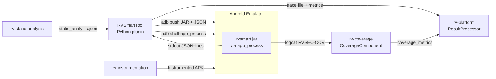

The tool operates in two contexts:
1. **Managed** (via `rv-experiment`): rv-platform manages emulator lifecycle, APK installation, and coverage tracking. CLI: `rv-experiment run --tools rvsmart:mvp`
2. **Standalone**: User manages emulator, rvsmart is executed directly via `adb shell CLASSPATH=... /system/bin/app_process ...`

### Core Architecture

rvsmart is structured into 7 packages, each with a single responsibility. The `Main` class bootstraps service connections and delegates to `AgentLoop`, which orchestrates one iteration per cycle using components from all packages.

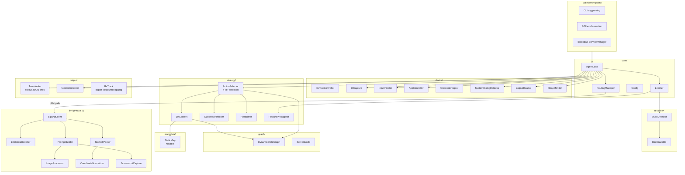

### Main Loop Flow

Each iteration of the `AgentLoop` follows a fixed sequence. The loop exits ONLY on timeout (INV-RSM-01).

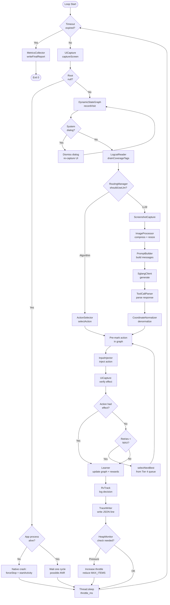

### Four Operational Modes (Graceful Degradation)

rvsmart operates in four degradation modes depending on what data is available. The base algorithm is always the same; additional data sources add scoring layers without changing the core loop.

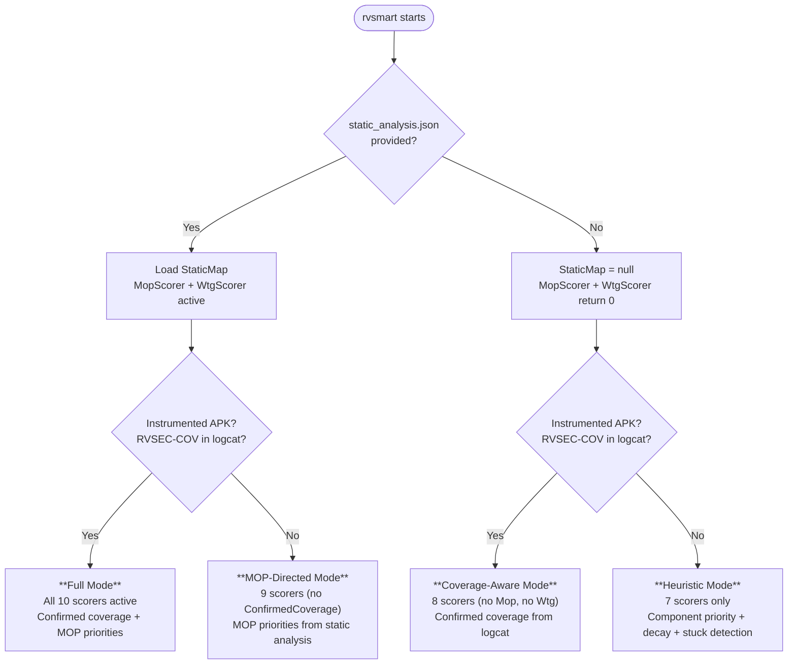

| Mode | StaticMap | LogcatReader | Active Scorers | Use Case |
|------|-----------|--------------|----------------|----------|
| **Full** | loaded | has RVSEC-COV | All 10 | Production: instrumented APK + static analysis |
| **MOP-directed** | loaded | no data | 9 (no ConfirmedCoverage) | Static analysis only, original APK |
| **Coverage-aware** | null | has RVSEC-COV | 8 (no Mop, no Wtg) | Instrumented APK, no static analysis |
| **Heuristic** | null | no data | 7 | Neither: pure DFS with component priority |

### Tiered Action Selection

The `ActionSelector` implements a 4-tier selection with a unified Tier 4 queue (INV-RSM-12). This is an improvement over the Python agent's 5-tier design — BACK and RESTART are synthetic actions competing in the same priority queue as widget actions, eliminating the need for a separate Tier 5 fallback.

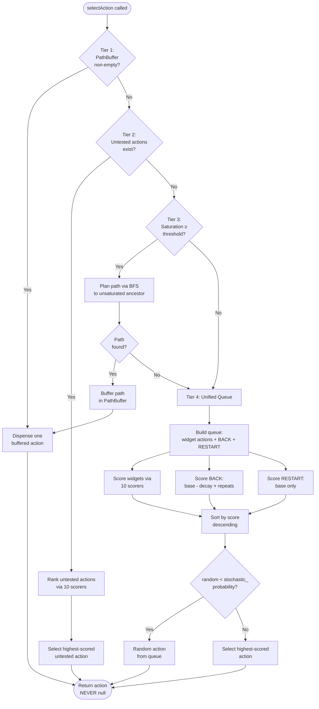

### Multi-Attempt Cycles

When an action has no effect, the agent retries with the next-best action from the Tier 4 queue within the same iteration. This is a key throughput advantage of running inside the emulator — each retry costs ~8ms instead of a full external iteration (~700ms).

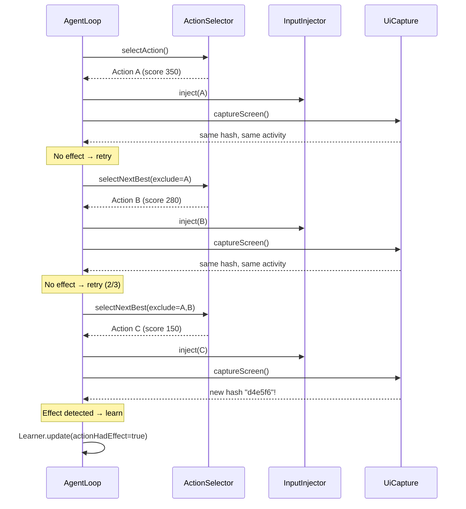

### Two-Level Stuck Detection

Stuck detection is a safety net for cases where the action selection tiers are insufficient — for example, when the app hangs, the UI becomes unresponsive, or the agent is trapped in a cycle of states that are each individually below the saturation threshold but collectively unproductive.

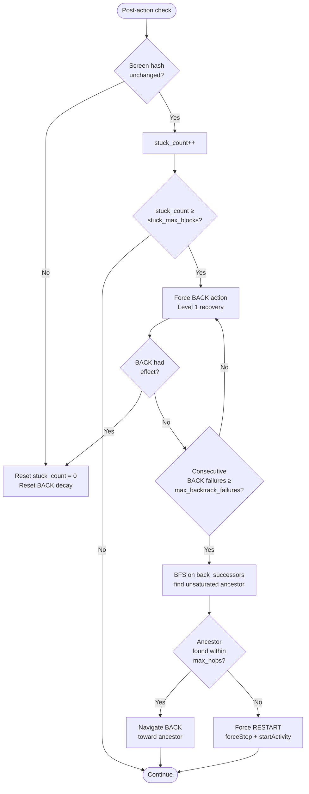

### LLM Hybrid Data Flow (Phase 2)

In `multimode` or `llm_only` mode, the `RoutingManager` decides per iteration whether to use the algorithm path (~1-5ms) or the LLM path (~1.5-3s). The LLM is reached from inside the emulator via the configured `llm_base_url` — the address is deployment-specific (INV-RSM-LLM-01); the emulator must have network routing to the SGLang server.

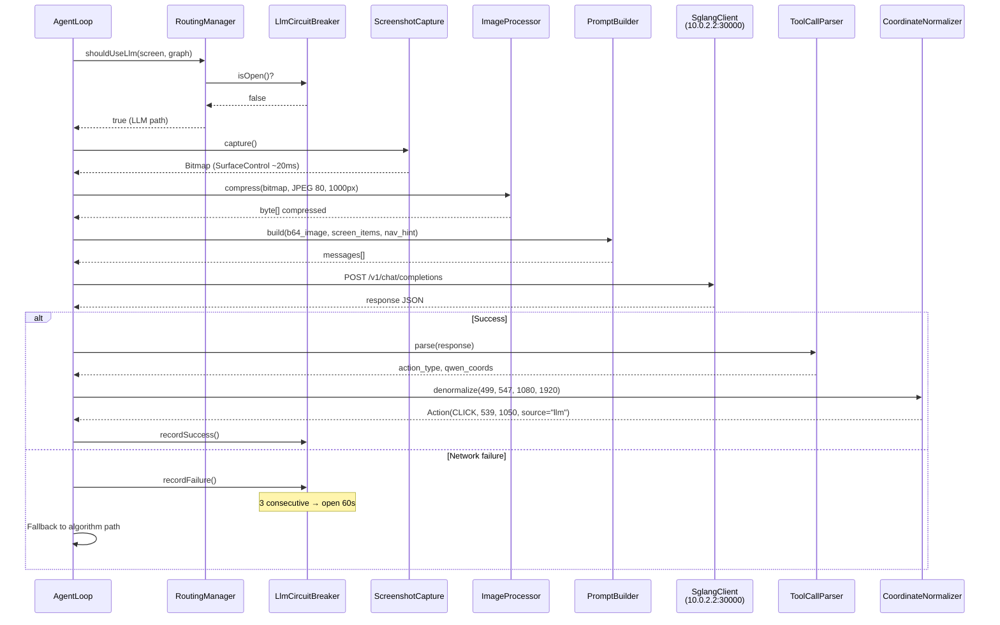

### Key Data Models

```
ScreenState:
  items: List<ScreenItem>          # Parsed UI elements from AccessibilityNodeInfo BFS
  activity: String                 # Current Activity name (from getRunningTasks)
  hash: String                     # Structural hash (SHA-256[:12], INV-RSM-03)

ScreenItem:
  className: String                # Simple class name (e.g., "Button")
  resourceId: String               # View ID resource name (normalized)
  text: String                     # Display text (nullable)
  contentDescription: String       # Accessibility description (nullable)
  bounds: Rect                     # Bounding box in device pixels
  packageName: String              # Owning package
  clickable: boolean               # Widget clickability
  scrollable: boolean              # Widget scrollability
  checkable: boolean               # Widget checkability
  enabled: boolean                 # Widget enabled state
  longClickable: boolean           # Widget long-clickability
  editable: boolean                # Widget editability (EditText)
  parentIndex: int                 # BFS parent for tree reconstruction

Action:
  type: ActionType                 # CLICK | LONG_CLICK | SET_TEXT | SCROLL | SWIPE | BACK | KEY_EVENT | RESTART
  x: int                          # Device pixel X coordinate
  y: int                          # Device pixel Y coordinate
  text: String                     # Text for SET_TEXT (nullable)
  source: String                   # "algorithm" | "llm" (metadata only, INV-RSM-08)
  signature(): String              # Unique identifier: "type@x,y" or "type:text@x,y"

Config:
  # Execution (4)
  timeout: int                     # Execution timeout in seconds (required, CLI)
  throttle_ms: int                 # Inter-iteration sleep (default 50)
  max_retries_per_cycle: int       # Multi-attempt retries (default 3)
  seed: int                        # Random seed for reproducibility (optional)

  # Routing (2)
  mode: String                     # pure_algorithm | multimode | llm_only (default pure_algorithm)
  llm_probability: float           # Multimode LLM probability (default 0.05)

  # Scorer weights (13)
  mop_direct_score: float          # MopScorer direct MOP (default 500.0)
  mop_transitive_score: float      # MopScorer transitive MOP (default 300.0)
  wtg_guided_score: float          # WtgScorer guided (default 150.0)
  gradual_decay_base: float        # GradualDecayScorer base (default 200.0)
  gradual_decay_rate: float        # GradualDecayScorer rate (default 0.7)
  gradual_decay_min_visits: int    # GradualDecayScorer min visits for zero (default 5)
  coverage_density_weight: float   # CoverageDensityScorer weight (default 200.0)
  saturation_bonus: float          # SaturationScorer bonus (default 100.0)
  component_high_priority: float   # ComponentPriorityScorer high (default 50.0)
  component_medium_priority: float # ComponentPriorityScorer medium (default 40.0)
  strength_weight: float           # StrengthScorer weight (default 50.0)
  reward_score_weight: float       # StrengthScorer reward weight (default 1.0)
  visitation_penalty_factor: float # VisitationPenaltyScorer factor (default 15.0)

  # Synthetic actions (3)
  back_base_score: float           # BACK base score (default -100.0)
  restart_base_score: float        # RESTART base score (default -500.0)
  back_decay_per_repeat: float     # BACK decay per consecutive no-effect (default 200.0)

  # Stochastic selection (1)
  stochastic_probability: float    # Probability of random selection (default 0.15)

  # Reward propagation (4)
  reward_gamma: float              # Discount factor (default 0.8)
  reward_propagation_n: int        # N-step lookback (default 5)
  reward_mop_weight: float         # MOP reward value (default 5.0)
  max_cumulative_factor: float     # Cumulative reward clamp factor (default 3.0)

  # Successor tracker (3)
  max_re_enables: int              # Max re-enablements per action (default 6)
  multi_value_saturation_threshold: int  # Multi-value widget saturation (default 4)
  ui_coverage_threshold: float     # Coverage threshold for re-enablement (default 0.8)

  # Path buffer (4)
  path_buffer_strategy_priority: String  # C>B>A ordering (default "coverage,mop,backtrack")
  max_backtrack_hops: int          # Max BFS depth (default 8)
  coverage_path_weight: float      # Coverage path BFS weight (default 1.0)
  mop_path_weight: float           # MOP path BFS weight (default 2.0)

  # Stuck detection (3)
  stuck_max_blocks: int            # Level 1 threshold (default 10)
  max_backtrack_failures: int      # Level 2 escalation (default 5)
  backtrack_saturation_threshold: float  # Tier 3 activation (default 0.8)

  # MOP navigation (3)
  mop_nav_weight: float            # BFS MOP density weight (default 2.0)
  mop_max_input_variations: int    # Max SET_TEXT variations (default 5)
  confirmed_coverage_window_s: float  # Logcat attribution window (default 2.0)

  # LLM inference (10)
  llm_base_url: String             # SGLang URL — deployment-specific, no authoritative default (INV-RSM-LLM-01)
  llm_model: String                # Model ID (default "Qwen/Qwen3-VL-4B-Instruct")
  llm_temperature: float           # Sampling temperature (default 0.01)
  llm_top_p: float                 # Top-p (default 0.6)
  llm_top_k: int                   # Top-k (default 50)
  llm_max_tokens: int              # Max output tokens (default 2048)
  llm_timeout_s: float             # Total HTTP timeout in seconds — connect + read combined (default 30.0)
  llm_multimode_strategy: String   # Multimode strategy: probabilistic|new_screen_only|stuck_only|arrival_first (default "probabilistic")
  llm_prompt_version: String       # Prompt template: v13|v17 (default "v13")
  llm_new_screen_phase2_probability: float  # Phase-2 LLM ratio for arrival_first strategy (default 0.30)

  # Logcat (1)
  logcat_buffer_size: int          # ConcurrentLinkedQueue max (default 10000)

  # Total: ~48 parameters, ~39 calibratable by Optuna

ScreenNode:
  visitCount: int                  # Times this state has been visited
  executedActions: Map<String, Integer>   # action signature → execution count
  failedActions: Map<String, Integer>     # action signature → consecutive failure count
  cumulativeReward: double         # Accumulated reward from propagation
  transitions: Set<String>         # Hashes of reachable states

DynamicStateGraph:
  nodes: LinkedHashMap<String, ScreenNode>  # hash → ScreenNode (insertion-ordered for deterministic BFS with --seed)
  # Methods:
  recordVisit(hash): void          # Increment visit count
  recordTransition(from, to): void # Record edge
  recordAction(hash, signature): void   # Pre-mark action (crash safety)
  recordActionFailure(hash, sig): void  # Record consecutive failure
  getVisitCount(hash): int         # Query visits
  getSaturation(hash): float       # tested / total actions (0.0-1.0)
```

### Relationships with Other Domains

**Consumes:**
- `static_analysis.json` from rv-static-analysis (reachability for MOP scoring, windows for WTG navigation, transitions for path planning) — same format as Python agent
- `RVSEC-COV` logcat tags from rv-instrumentation's AspectJ weaving — ground-truth coverage signal for `ConfirmedCoverageScorer`
- `Command` class from rv-android-core (used by `RVSmartTool` for adb operations)
- `AbstractTool` contract from rv-tools (extended by `RVSmartTool`)

**Produces:**
- Stdout JSON lines (trace): one line per iteration with action, state, and timing data
- `RVSMART_METRICS:` final JSON report on stdout at timeout
- `[RVTRACK:<CATEGORY>]` structured log entries via Android logcat (15 categories)
- Touch/key events injected into the target app via `InputManager`
- App lifecycle operations via `IActivityManager` (force-stop, start-activity)

**Consumed by:**
- `RVSmartTool` (rv-tools plugin): captures stdout trace, extracts metrics JSON
- rv-platform `CoverageComponent`: reads logcat `RVSEC-COV` tags (standard pipeline, no changes)
- rv-platform `ResultProcessorComponent`: reads `coverage_metrics` (standard pipeline, no changes)
- rv-experiment: orchestrates rvsmart tasks via `--tools rvsmart:mvp` CLI
- Optuna calibration scripts: parse `rvsmart_metrics.json` for objective function

### Structural Hash Compatibility (INV-RSM-03)

The structural hash algorithm MUST produce identical output to the Python agent's `compute_screen_hash_from_description()` for the same UI tree. The algorithm canonicalizes the screen state into a deterministic JSON string and computes SHA-256, taking the first 12 hex characters. This is the primary bridge between the Java and Python worlds — both agents produce the same hash for the same UI state, enabling direct comparison of state graphs across runs.

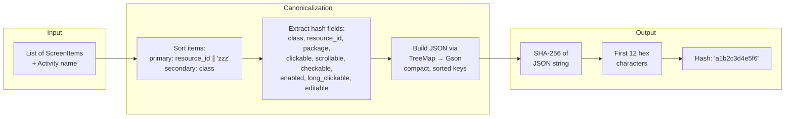

**Canonicalization rules** (must match Python exactly):
1. Items sorted by `(resource_id or "zzz", class)` — empty/null resource_id sorts to end
2. Hash fields: `class`, `resource_id`, `package`, `clickable`, `scrollable`, `checkable`, `enabled`, `long_clickable`, `editable`
3. Null handling for String hash fields: null values serialize as JSON `null` (not empty string `""`), matching Python's `json.dumps` behavior. Empty string `""` and `null` are distinct. `resource_id` null/empty is replaced by `"zzz"` for SORTING only — the actual JSON value remains null or empty string.
4. Top-level JSON structure: `{"activity":"<name>","items":[...]}`
4. JSON serialization: `GsonBuilder().create()` on `TreeMap<String, Object>` for sorted keys at EVERY nesting level — the top-level object AND each ScreenItem object in the `items` array MUST be represented as `TreeMap<String, Object>` (not POJO or HashMap). Gson does not guarantee recursive key ordering for arbitrary objects; using TreeMap at every level ensures sorted keys match Python's `json.dumps(sort_keys=True)`. Compact format (no spaces after separators, equivalent to Python `separators=(",", ":")`).
5. Output: `SHA-256(json_string)[:12]` as hex

### Worked Example: CryptoApp Exploration (Tier Selection)

CryptoApp has 4 Activities. The main screen has a Spinner (algorithm selector), an EditText (text input), and a Button ("GENERATE HASH" — MOP-reaching via `MessageDigest.getInstance()`). This example traces the first ~15 iterations to illustrate tiered action selection.

**Iteration 1-3: First visit to MainActivity (S0)**
- `UiCapture` finds 3 interactive widgets: Spinner (A), EditText (B), Button "GENERATE HASH" (C)
- **Tier 2** activates (3 untested actions)
- MopScorer assigns +500 to C (`directly_reaches_mop=True` from static analysis)
- GradualDecayScorer assigns +200 to all (0 visits)
- ComponentPriorityScorer: C=+50 (Button), A=+50 (Spinner), B=+50 (EditText)
- C scores highest (~800), selected → clicks GENERATE HASH on empty form
- Iteration 2: A and B untested. A (Spinner, +300) selected → navigates to dropdown screen S1
- S1 has 12 algorithm options (SHA-1, MD5, etc.), all untested → Tier 2 picks first

**Iteration 4-6: Dropdown exploration (S1)**
- Agent clicks "MD5" → returns to S0' (new hash — spinner now shows "MD5")
- S0' is a NEW state (different structural hash), so all 3 actions are untested again
- Tier 2 selects C (GENERATE HASH, MOP +500) → triggers `MessageDigest.getInstance("MD5")`
- `ConfirmedCoverageScorer` rewards this action (+500 from logcat RVSEC-COV)
- `RewardPropagator` propagates `mop_reached` reward backward to preceding actions

**Iteration 7-10: Form filling and saturation**
- On S0', B (EditText) still untested → Tier 2 selects B → `SET_TEXT "test123"`
- After B tested, all 3 actions tested (saturation = 33%, below threshold 80%)
- **Tier 4** activates: unified queue scores all actions + BACK + RESTART
- C scores ~800 (MOP +500 + ConfirmedCoverage +200 + ComponentPriority +50)
- Agent re-executes C with MD5 selected AND text filled → valid MOP trigger
- Saturation increases as actions are re-executed

**Iteration 11-15: Backtracking**
- After 6-9 iterations on S0', saturation reaches 80%
- **Tier 3** activates: BFS finds S0 (original spinner state) as unsaturated ancestor
- PathBuffer buffers BACK sequence → Tier 1 dispenses BACK actions
- Agent navigates to S0, selects a different algorithm ("SHA-256") → explores new state S0''
- Cycle repeats with different algorithm + text combinations

This pattern maximizes MOP coverage by systematically combining different input configurations.

## Data Contracts

### Input

- `--package <string>` — Target app package name (required). Passed via CLI. Example: `br.unb.cic.cryptoapp`.
- `--timeout <int>` — Execution timeout in seconds (required). The ONLY exit condition from the main loop.
- `--health-check` — Validate ServiceManager connections and exit with code 0/1 (optional). Used by RVSmartTool for fast failure detection.
- `--static-data <path>` — Path to `static_analysis.json` on device filesystem (optional). When absent, MopScorer and WtgScorer return 0.
- `--config <path>` — Path to `rvsmart.properties` on device filesystem (optional). When absent, internal defaults used for all ~48 parameters.
- `--mode <enum>` — Execution mode: `pure_algorithm` (default), `multimode`, `llm_only`.
- `--seed <int>` — Random seed for reproducibility (optional).

### Output

- **Stdout (JSON lines)**: One JSON line per iteration with: `iteration`, `timestamp_ms`, `hash`, `activity`, `action_type`, `action_source`, `action_had_effect`, `retries`, `unique_states`, `elapsed_s`.
- **Stdout (final report)**: Last line prefixed with `RVSMART_METRICS:` containing a JSON object with sections: `metadata`, `exploration`, `decisions`, `ui_coverage`, `confirmed_coverage`, `llm`.
- **Logcat**: Standard Android logcat entries via `android.util.Log` (tag: `RVSMART`). Includes `[RVTRACK:<CATEGORY>]` structured decision logs.

### Side-Effects

- **[Android System]**: Injects touch/key events into the target app via `InputManager`.
- **[Android System]**: May force-stop and restart the target app on crash or stuck recovery.
- **[Android System]**: Dismisses system dialogs (crash, permission, battery optimization).
- **[Network]**: In multimode/llm_only, makes HTTP POST requests to SGLang API at the deployment-configured `llm_base_url` (INV-RSM-LLM-01).

### Error

- **Bootstrap failure**: If reflection fails to connect to ServiceManager services → stderr message + exit code 1.
- **Runtime crash of agent itself**: Uncaught exception → stack trace to stderr + exit code 1. (Crashes of the target app are handled gracefully via CrashInterceptor.)

### Examples

**Input (CLI)**:
```
CLASSPATH=/data/local/tmp/rvsmart.jar /system/bin/app_process /data/local/tmp/ \
  br.unb.cic.rvsmart.Main --package br.unb.cic.cryptoapp --timeout 60 \
  --static-data /data/local/tmp/static_analysis.json --mode pure_algorithm --seed 42
```

**Output (iteration line)**:
```json
{"iteration":42,"timestamp_ms":15230,"hash":"a1b2c3d4e5f6","activity":"MainActivity","action_type":"CLICK","action_source":"algorithm","action_had_effect":true,"retries":0,"unique_states":12,"elapsed_s":15.2}
```

**Output (final metrics, last line)**:
```
RVSMART_METRICS:{"metadata":{"tool":"rvsmart","package":"br.unb.cic.cryptoapp","mode":"pure_algorithm","timeout":60,"version":"1.0.0"},"exploration":{"iterations":4200,"execution_time_s":60.0,"unique_states":28,"total_transitions":4180,"throughput_evt_per_s":14.2},"decisions":{"total_actions":4200,"algorithm_actions":4200,"llm_actions":0,"multi_attempt_retries":312,"forced_backs":45,"crashes":2,"system_dialogs":3},"ui_coverage":{"unique_activities":5,"unique_hashes":28,"widgets_discovered":142,"widgets_interacted":98,"coverage_ratio":0.69},"confirmed_coverage":{"enabled":true,"unique_methods":12,"total_events":47,"mop_methods_reached":8},"llm":{"total_calls":0,"tokens_in":0,"tokens_out":0,"total_time_s":0,"circuit_breaker_trips":0}}
```

## Invariants

- **INV-RSM-01**: The main loop SHALL exit ONLY when elapsed time exceeds the configured timeout. No other exit condition (saturation, error count, empty action list) SHALL terminate the loop.
- **INV-RSM-02**: Every `AccessibilityNodeInfo` obtained via `getChild()` MUST be recycled via `node.recycle()` in a finally block. Failure to recycle causes Binder reference leaks leading to OOM within minutes at 14 evt/s.
- **INV-RSM-03**: The structural hash algorithm MUST produce identical output to the Python agent's `compute_screen_hash_from_description()` (in `dynamic_state_graph.py`) for the same UI tree. Same fields (class, resource_id, package, clickable, scrollable, checkable, enabled, long_clickable, editable), same ordering (primary sort by resource_id with empty string replaced by `"zzz"` for sort-to-end, secondary sort by class — matching the Python `sort(key=lambda x: (x["resource_id"] or "zzz", x["class"]))`), same JSON canonicalization: Gson with `GsonBuilder().create()` on `TreeMap<String, Object>` at EVERY nesting level (top-level object AND each ScreenItem in the items array) to guarantee sorted keys recursively — Gson does not sort keys for POJOs or HashMaps, only for TreeMap. Compact format with no spaces after separators (equivalent to Python `separators=(",", ":")`) — NOT `setPrettyPrinting()`, NOT custom TypeAdapter. The JSON structure is `{"activity":"<name>","items":[...]}` with sorted keys at all levels. Output format: SHA-256[:12] hex string. Unit tests MUST include a golden test: given a concrete input (hardcoded list of ScreenItems), assert the exact hash output matches a reference value computed by the Python agent.
- **INV-RSM-04**: When `--static-data` is not provided, `StaticMap` SHALL be null and all scorers that depend on static data (MopScorer, WtgScorer) SHALL return 0. The agent MUST continue to function in heuristic mode.
- **INV-RSM-05**: When `LogcatReader` has no `RVSEC-COV` data (original APK or logcat unavailable), `ConfirmedCoverageScorer` SHALL return 0. The agent MUST continue using MopScorer estimates or heuristic scoring.
- **INV-RSM-06**: `CrashInterceptor.appCrashed()` callback MUST immediately mark the preceding action as crash-causing and initiate app restart. The agent MUST NOT attempt to execute additional actions before the restart completes.
- **INV-RSM-07**: Multi-attempt retries within a cycle MUST NOT exceed `MAX_RETRIES_PER_CYCLE`. Actions with ≥3 consecutive failures on the same screen MUST be skipped by `selectNextBest()`.
- **INV-RSM-08**: The `execute` and `learn` phases MUST be action-source-agnostic. The same code path handles actions from both algorithm and LLM origins. The `source` field is metadata only.
- **INV-RSM-09**: `LlmCircuitBreaker` MUST trip after 3 consecutive LLM failures and remain open for 60 seconds. During the open period, `RoutingManager.shouldUseLlm()` MUST return false regardless of mode/strategy.
- **INV-RSM-10**: The `RVSMART_METRICS:` prefix on the final stdout line MUST be present to allow unambiguous extraction of the metrics report from the trace file.
- **INV-RSM-11**: BFS traversal of the UI tree MUST cap at `MAX_ITEMS` (default 2000) nodes to prevent unbounded memory consumption on pathological UI trees. The 2000 limit is based on empirical observation: typical Android screens have 30-200 nodes; complex apps (e.g., RecyclerView with nested layouts) can reach 500-1500; 2000 provides headroom while keeping memory footprint bounded (~2000 × ~200 bytes/node ≈ 400KB). When the cap is reached, nodes SHALL be prioritized by: (1) interactive widgets (clickable, scrollable, checkable, editable) over non-interactive, (2) shallower depth over deeper depth. This ensures that actionable UI elements are retained even in deeply nested layouts.
- **INV-RSM-12**: The candidate action list MUST NEVER be empty. BACK and RESTART are synthetic actions injected into the Tier 4 unified queue alongside widget actions, using their own base scores (NOT scored by the 10 widget scorers — see Ten Weighted Scorers section). Saturated widget actions remain in the list with reduced scores (via GradualDecayScorer) — they are deprioritized, never removed. System elements receive a -5000 penalty but stay in the list. `ActionSelector.selectAction()` MUST NEVER return null. When all widget scores fall below BACK's score, BACK wins naturally. When consecutive BACKs fail to change state, BACK's effective score decreases dynamically (`back_score -= back_decay_per_repeat`, default 200 per consecutive no-effect BACK), making saturated widget actions and eventually RESTART more attractive. This self-correcting mechanism prevents BACK/RESTART infinite loops without special-case escape logic.
- **INV-RSM-13**: `HeapMonitor` MUST check `Runtime.freeMemory()` every 100 iterations and increase `throttle_ms` by 50% when free memory falls below 10% of max heap (critical threshold). Warning threshold at 20%. If pressure persists for 3 consecutive checks, reduce `MAX_ITEMS` cap to 1000 temporarily. This prevents OOM on long runs with large UI trees.
- **INV-RSM-LLM-01**: The `llm_base_url` config parameter SHALL be set to the actual SGLang server address for the deployment environment. No default value is authoritative — the correct address is deployment-specific and must be supplied by the tool variant or experiment configuration.
- **INV-RSM-LLM-02**: LLM SHALL NOT be invoked when `outOfAppCount > 0`. Only the algorithm path may act during out-of-app recovery. This prevents wasting LLM budget on home screen / launcher screenshots.
- **INV-RSM-LLM-03**: `PromptBuilder` SHALL accept a `PromptVersion` parameter and dispatch to the corresponding template. V13 is the baseline (dialog handling, priority rules). V17 is the rich context version (test-status tags, MOP markers, element scores, action history, navigation hints). Unknown version values SHALL raise `IllegalArgumentException` at construction time.
- **INV-RSM-LLM-04**: `PromptContext` SHALL encapsulate all context fields required by any prompt version. Fields required only by V17 (interaction counts, MOP sets, element scores, recent actions, coverage metrics) SHALL be nullable — when null or empty, V17 degrades gracefully to V13-equivalent output for that section.
- **INV-RSM-LLM-05**: The ARRIVAL_FIRST strategy SHALL define "arrival" as: the current screen hash differs from the screen hash of the previous iteration. This fires on every navigation event, including returning to a previously-visited screen.
- **INV-RSM-LLM-06**: In ARRIVAL_FIRST mode, after the first action on a new arrival, subsequent actions on the same screen (hash unchanged) SHALL use the LLM with probability `llm_new_screen_phase2_probability` (default 0.30). The circuit breaker applies to both the arrival action and phase-2 probabilistic actions.

## Requirements

### Requirement: Bootstrap via app_process

rvsmart SHALL bootstrap by connecting to Android system services via `ServiceManager.getService()` using reflection. The bootstrap sequence establishes connections to three critical services that provide the agent's core capabilities: UI capture, event injection, and app lifecycle management.

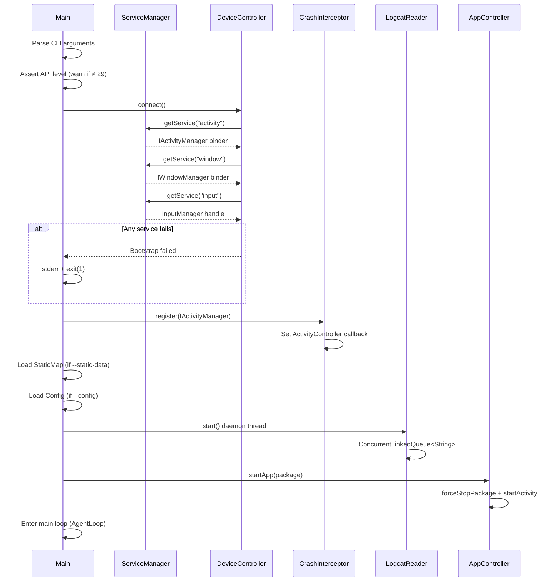

If any ServiceManager connection fails, the agent SHALL log the error to stderr and exit with code 1. This is the Go/No-Go gate — if fundamental APIs are not accessible on the target emulator image, the agent cannot function.

#### Scenario: Successful bootstrap on API 29 emulator
- **WHEN** rvsmart.jar is executed via `app_process` on an API 29 emulator with `--package br.unb.cic.cryptoapp --timeout 60`
- **THEN** Main SHALL connect to ActivityManagerService, WindowManagerService, and InputManager
- **AND** CrashInterceptor SHALL register ActivityController callback
- **AND** the target app SHALL be launched via `IActivityManager.startActivity()`
- **AND** the main loop SHALL begin execution

#### Scenario: Bootstrap with static analysis data
- **WHEN** rvsmart is started with `--static-data /data/local/tmp/static_analysis.json`
- **THEN** StaticMap SHALL load and parse the JSON file
- **AND** MopScorer and WtgScorer SHALL be activated with the loaded data

#### Scenario: Bootstrap without static analysis data
- **WHEN** rvsmart is started without `--static-data`
- **THEN** StaticMap SHALL be null
- **AND** MopScorer and WtgScorer SHALL return 0 for all actions
- **AND** the agent SHALL operate in heuristic mode

#### Scenario: Bootstrap failure on unsupported API level
- **WHEN** `ServiceManager.getService("activity")` returns null or reflection fails
- **THEN** Main SHALL log "Bootstrap failed: cannot connect to ActivityManagerService" to stderr
- **AND** Main SHALL exit with code 1

#### Scenario: Health check mode
- **WHEN** rvsmart is started with `--health-check`
- **THEN** Main SHALL attempt to connect to all three ServiceManager services
- **AND** SHALL perform one UI capture via `UiCapture.captureScreen()` to validate AccessibilityNodeInfo reflection
- **AND** SHALL print status of each connection and the UI capture result (success/failure, element count) to stdout
- **AND** SHALL exit with code 0 if all connections and UI capture succeed, code 1 otherwise
- **AND** SHALL NOT enter the main loop

### Requirement: UI Capture via AccessibilityNodeInfo

rvsmart SHALL capture the current UI state by obtaining the root `AccessibilityNodeInfo` node and traversing the tree via BFS. Each node is parsed into a `ScreenItem` with the following field mapping from `AccessibilityNodeInfo` methods:

| ScreenItem field | AccessibilityNodeInfo method | Hash field? | Notes |
|---|---|---|---|
| `className` | `getClassName()` | Yes (`class`) | Simple class name (e.g., `Button`), stripped from fully-qualified |
| `resourceId` | `getViewIdResourceName()` | Yes (`resource_id`) | Format varies: `package:id/name` or `id/name`. Normalize by taking substring after last `/` if no `:`, or keep full string. Must match Python agent's `resource_id` field from UIAutomator2 XML. Validated in PoC Task 2.8. |
| `text` | `getText()` | No | Used for SET_TEXT, not in hash |
| `contentDescription` | `getContentDescription()` | No | |
| `bounds` | `getBoundsInScreen(Rect)` | No | Used for click coordinates |
| `package` | `getPackageName()` | Yes | Used by SystemElementFilter |
| `clickable` | `isClickable()` | Yes | |
| `scrollable` | `isScrollable()` | Yes | |
| `checkable` | `isCheckable()` | Yes | |
| `enabled` | `isEnabled()` | Yes | |
| `longClickable` | `isLongClickable()` | Yes (`long_clickable`) | |
| `editable` | `isEditable()` | Yes | |
| `parentIndex` | BFS traversal index of parent | No | For tree reconstruction |

The traversal MUST recycle every node after extraction (INV-RSM-02) and MUST cap at `MAX_ITEMS` nodes (INV-RSM-11).

The resulting `ScreenState` contains the list of `ScreenItem` objects, the current Activity name (from `IActivityManager.getRunningTasks(1)`), and a structural hash computed per INV-RSM-03.

#### Scenario: Normal UI capture
- **WHEN** the target app displays a screen with 45 UI elements
- **THEN** `UiCapture.captureScreen()` SHALL return a `ScreenState` with 45 items
- **AND** each `AccessibilityNodeInfo` SHALL be recycled after parsing
- **AND** the structural hash SHALL match the Python agent's hash for the same UI tree
- **AND** latency SHALL be <10ms

#### Scenario: UI capture on pathological UI tree
- **WHEN** the UI tree contains more than 2000 nodes
- **THEN** `UiCapture` SHALL traverse all nodes via BFS but retain only the top 2000 by priority (interactive widgets first, then by shallower depth)
- **AND** remaining nodes SHALL be discarded with a log warning including the total node count

#### Scenario: UI capture returns null root
- **WHEN** `getRootInActiveWindow()` returns null
- **THEN** the agent SHALL check if the target app process is alive via `getRunningTasks()`
- **AND** if the app process is gone, the agent SHALL log a native crash and restart the app
- **AND** if the app process is alive, the agent SHALL wait one cycle (possible ANR)

### Requirement: Event Injection via InputManager

rvsmart SHALL inject touch and key events using `InputManager.injectInputEvent()` via reflection. Supported action types: CLICK, LONG_CLICK, SET_TEXT, SCROLL, SWIPE, BACK, KEY_EVENT, RESTART. Each action carries device pixel coordinates (x, y), optional text (for SET_TEXT), and a source field ("algorithm" or "llm") that is metadata only — the injection path is identical regardless of source (INV-RSM-08).

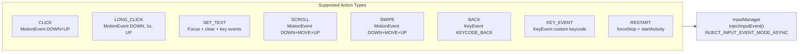

#### Scenario: Click injection
- **WHEN** the strategy selects a CLICK action at coordinates (540, 960) on a 1080x1920 display
- **THEN** `InputInjector` SHALL create a `MotionEvent` (ACTION_DOWN + ACTION_UP) at (540, 960)
- **AND** `InputManager.injectInputEvent()` SHALL be called with `INJECT_INPUT_EVENT_MODE_ASYNC`
- **AND** latency SHALL be <3ms

#### Scenario: SET_TEXT injection
- **WHEN** the strategy selects a SET_TEXT action with text "test@email.com" on an editable field
- **THEN** `InputInjector` SHALL focus the target field (CLICK), clear existing text, then inject key events for each character

#### Scenario: BACK injection
- **WHEN** a BACK action is selected (from stuck recovery or Tier 4 queue)
- **THEN** `InputInjector` SHALL create a `KeyEvent` with `KEYCODE_BACK` (ACTION_DOWN + ACTION_UP)
- **AND** latency SHALL be <1ms

### Requirement: Main Loop and Multi-Attempt Cycles

The main loop SHALL execute iterations until the configured timeout expires (INV-RSM-01). Each iteration follows the sequence: capture UI → update graph → check system dialog → drain logcat coverage → decide route (algorithm or LLM) → pre-mark action → execute → verify effect → multi-attempt if no effect → learn → throttle.

When an action has no effect (screen hash unchanged, same activity, same focused resource), the agent SHALL retry with the next best action from the strategy, up to `MAX_RETRIES_PER_CYCLE` times. This multi-attempt mechanism only applies to algorithm actions — LLM actions are expensive and SHALL NOT be retried. Actions with ≥3 consecutive failures on the same screen SHALL be skipped by `selectNextBest()` (INV-RSM-07).

`selectNextBest()` is a method on `ActionSelector` that returns the next-highest-scoring action from the current Tier 4 unified queue, excluding: (a) the action that just failed, and (b) actions with ≥3 consecutive failures on the current screen. It does NOT re-evaluate tiers — it operates within the already-computed Tier 4 ranked list. If the ranked list is exhausted within the cycle, the multi-attempt loop ends.

The `actionHadEffect` check uses a compound criterion: hash change OR activity change OR focused resource change. This catches SET_TEXT effects (text excluded from hash for EditText) and activity transitions that preserve widget structure.

#### Scenario: Normal iteration with effective action
- **WHEN** the agent is on screen with hash "a1b2c3" and selects a CLICK action
- **THEN** the action SHALL be pre-marked in the graph
- **AND** `InputInjector.inject()` SHALL execute the action
- **AND** post-execution UI capture SHALL detect hash "d4e5f6" (different)
- **AND** `Learner.update()` SHALL record the transition with `actionHadEffect=true`

#### Scenario: Multi-attempt on no-effect action
- **WHEN** an algorithm action has no effect (same hash, same activity, same focus)
- **THEN** the agent SHALL call `strategy.selectNextBest()` for an alternative action
- **AND** the alternative SHALL be executed and verified in the same cycle
- **AND** this SHALL repeat up to `MAX_RETRIES_PER_CYCLE` (default 3) times
- **AND** each no-effect action SHALL be recorded via `graph.recordActionFailure()`

#### Scenario: Multi-attempt exhaustion
- **WHEN** all `MAX_RETRIES_PER_CYCLE` retries produce no effect
- **THEN** the agent SHALL proceed to the learn phase with `actionHadEffect=false`
- **AND** StuckDetector SHALL evaluate whether escalation (BACK or RESTART) is needed

#### Scenario: LLM action not retried
- **WHEN** an LLM-sourced action has no effect
- **THEN** the agent SHALL NOT retry with multi-attempt
- **AND** the agent SHALL proceed directly to the learn phase

### Requirement: Tiered Action Selection (4 Tiers)

rvsmart SHALL implement a tiered action selection based on the Python RVAgentStrategy's 5-tier design, with one key improvement: **BACK and RESTART are synthetic actions in the same priority queue as widget actions in Tier 4** (INV-RSM-12), eliminating the need for a separate Tier 5 fallback. The candidate list is NEVER empty — saturated actions remain with reduced scores, system elements remain with heavy penalty, and BACK/RESTART always participate in Tier 4 scoring.

| Tier | Name | Condition | Action |
|------|------|-----------|--------|
| 1 | PathBuffer | Buffer non-empty | Dispense one buffered action |
| 2 | Untested Actions | Has untested actions on current screen | Select untested action via 10 scorers |
| 3 | Proactive Backtrack | Saturation ≥ threshold (default 0.8) | Plan BACK sequence via BFS to unsaturated ancestor |
| 4 | Unified Queue | All tested (including saturated), or no path found in Tier 3 | Select action with highest score from unified queue (widgets + BACK + RESTART) |

**Unified priority queue (Tier 4)**: All candidate actions — widget actions (even saturated), BACK (synthetic), and RESTART (synthetic) — compete in a single sorted list. Widget actions and synthetic actions use DIFFERENT scoring paths:
- **Widget actions**: scored by the 10 scorers. Saturated actions get low scores from GradualDecayScorer (decays to 0 after min_visits) and VisitationPenaltyScorer, but remain in the queue.
- **BACK** (synthetic): uses ONLY its own base score `back_base_score` (default -100, configurable). Does NOT pass through the 10 widget scorers. Decreases by `back_decay_per_repeat` (default 200) for each consecutive no-effect BACK on the same screen.
- **RESTART** (synthetic): uses ONLY its own base score `restart_base_score` (default -500, configurable). Does NOT pass through the 10 widget scorers. RESTART is the least attractive option but always available.

This design ensures: (1) the list is never empty, (2) consecutive BACKs self-correct because BACK's score drops while widget scores stay stable, (3) RESTART is reached only when BACK has been exhausted, (4) all parameters are calibratable by Optuna.

Tier 4 uses score aggregation as sum of all scorer outputs (for widget actions) or base score (for synthetic actions). With probability `stochastic_probability` (default 0.15), the selection ignores scores and picks a random action from the queue — this matches the Python agent's stochastic selection mechanism (simple random threshold, not Gumbel-max). Deterministic selection picks the highest-scoring action.

#### Scenario: Tier 2 selects untested action
- **WHEN** the agent visits a screen with 8 clickable widgets, 3 already tested
- **THEN** ActionSelector SHALL select one of the 5 untested widgets
- **AND** the selected action SHALL be pre-marked before execution

#### Scenario: Tier 3 proactive backtrack
- **WHEN** the current screen has saturation ≥ 0.8 (80% of actions tested)
- **THEN** ActionSelector SHALL use BacktrackBfs to find an unsaturated ancestor
- **AND** a BACK sequence SHALL be buffered in PathBuffer
- **AND** Tier 1 SHALL dispense the first BACK action

#### Scenario: Tier 4 scored selection with saturated actions
- **WHEN** all widget actions on the current screen are tested (some saturated)
- **THEN** ActionSelector SHALL include all widget actions (even saturated), BACK, and RESTART in the unified queue
- **AND** aggregate scores from all 10 scorers SHALL be computed for widget actions
- **AND** BACK and RESTART SHALL use their base scores (adjusted for consecutive repeats)
- **AND** the action with the highest score SHALL be selected (with random noise if stochastic fires)

#### Scenario: All widgets are system elements — BACK wins naturally (INV-RSM-12)
- **WHEN** all widget actions on the screen are system elements (score -5000 each)
- **THEN** BACK (base score -100) SHALL outscore all widget actions
- **AND** BACK SHALL be selected as the highest-scoring action
- **AND** RVTRACK:SELECT SHALL log tier=4 action=BACK reason=system_elements_only

#### Scenario: Consecutive BACKs self-correct (INV-RSM-12)
- **WHEN** BACK has been selected 3 consecutive times on the same screen with no state change
- **THEN** BACK's effective score SHALL be `back_base_score - (3 × back_decay_per_repeat)` = -100 - 600 = -700
- **AND** saturated widget actions (score ~-50 from decay + penalty) SHALL now outscore BACK
- **AND** the agent SHALL re-execute a saturated widget action instead of looping BACK
- **AND** RVTRACK:STRATEGY SHALL log reason=back_decay_widget_retry

#### Scenario: No interactive widgets on screen (INV-RSM-12)
- **WHEN** the UI tree has zero clickable, scrollable, checkable, or editable elements
- **THEN** the unified queue SHALL contain only BACK and RESTART
- **AND** BACK (score -100) SHALL outscore RESTART (score -500)
- **AND** if consecutive BACKs decay BACK below RESTART, RESTART SHALL be selected
- **AND** RVTRACK:STRATEGY SHALL log reason=no_widgets_restart

#### Scenario: Saturated with no path plan — scored selection continues (INV-RSM-12)
- **WHEN** Tier 3 fires (saturation >= threshold) but BacktrackBfs finds no unsaturated ancestor
- **THEN** ActionSelector SHALL fall through to Tier 4 (unified queue)
- **AND** saturated widget actions, BACK, and RESTART SHALL compete by score
- **AND** the highest-scoring candidate SHALL be selected
- **AND** RVTRACK:STRATEGY SHALL log tier=4 reason=saturated_no_path_scored

### Requirement: Ten Weighted Scorers

rvsmart SHALL implement 10 scorers, each returning an integer score for a candidate action. Scorers are grouped by data dependency:

```mermaid
flowchart LR
    subgraph always["Always Active (7)"]
        GD[GradualDecayScorer<br/>200 × 0.7^visits]
        CD[CoverageDensityScorer<br/>200 × coverage_gap]
        SAT[SaturationScorer<br/>100 × (1 - saturation)]
        CP[ComponentPriorityScorer<br/>+50 buttons, +40 toggles]
        STR[StrengthScorer<br/>50 × success_rate + reward]
        SEF[SystemElementFilter<br/>-5000 for systemui]
        VP[VisitationPenaltyScorer<br/>-15 × log(1 + visits)]
    end

    subgraph static["Require StaticMap (2)"]
        MOP[MopScorer<br/>+500 direct, +300 transitive]
        WTG[WtgScorer<br/>+150 guided transitions]
    end

    subgraph logcat["Require LogcatReader (1)"]
        CC[ConfirmedCoverageScorer<br/>+500 direct, +200 historical]
    end

    always & static & logcat --> SUM["Score = Σ all scorers"]
    SUM --> RANK[Rank actions<br/>by total score]
```

**Always active (7 scorers):**
- `GradualDecayScorer`: `base × decay_rate^visits` (0 after min_visits). Defaults: base=200.0, rate=0.7, min_visits=5.
- `CoverageDensityScorer`: `weight × coverage_gap` (gap in [0.0, 1.0]; 0.5 for unknown destinations). Default weight=200.0.
- `SaturationScorer`: `bonus × (1.0 - saturation)`. Default bonus=100.0.
- `ComponentPriorityScorer`: scores based on Android widget class name (simple class name, not fully qualified). Two priority levels:
  - **High priority** (+50.0): Button, ImageButton, MaterialButton, FloatingActionButton, ExtendedFloatingActionButton, EditText, AutoCompleteTextView, MultiAutoCompleteTextView, TextInputEditText, Spinner, AppCompatSpinner, DrawerLayout, Tab, TabLayout, TabView, ActionBar$Tab, TabItem, BottomNavigationItemView, NavigationBarItemView, NavigationBarView, NavigationRailView, ActionMenuItemView, MenuItemView, OverflowMenuButton, Chip, LinearLayout.
  - **Medium priority** (+40.0): CheckBox, MaterialCheckBox, AppCompatCheckBox, Switch, SwitchCompat, SwitchMaterial, ToggleButton, AppCompatToggleButton, RadioButton, MaterialRadioButton, AppCompatRadioButton, SeekBar, AppCompatSeekBar, Slider, RangeSlider, RatingBar, ViewPager, RecyclerView, CheckedTextView, AppCompatCheckedTextView.
  - All other components: 0.0.
  - ComponentPriorityScorer applies ONLY to widget actions. BACK/RESTART synthetic actions do NOT pass through this scorer.
- `StrengthScorer`: `weight × success_rate + reward_weight × cumulative_reward`. Default weight=50.0, reward_weight=1.0. Untested actions get success_rate=0.5.
- `SystemElementFilter`: -5000.0 for system UI elements (package `com.android.systemui` only — status bar, navigation bar). The `android` package is NOT penalized because system dialogs (permissions, crash alerts) from the `android` package are part of app flow and handled by `SystemDialogDetector` instead. Fixed value, not configurable.
- `VisitationPenaltyScorer`: `-factor × log(1 + visits)`. Default factor=15.0.

**Require static analysis (2 scorers, return 0 when StaticMap is null):**
- `MopScorer`: +500.0 for direct MOP-reaching (`directly_reaches_mop`), +300.0 for transitive MOP-reaching (`reaches_mop`). These are the production defaults — the Java implementation MUST use 500.0/300.0 as hardcoded defaults (matching the Python agent's config defaults in `agent_config.py`, not the lower class-level fallbacks).
- `WtgScorer`: +150.0 for WTG-guided transitions to unvisited screens. Same note: use 150.0 as Java default (Python config default).

**Requires logcat data (1 scorer, new for rvsmart — not present in Python agent, returns 0 when LogcatReader has no data):**
- `ConfirmedCoverageScorer`: +500 if action directly triggered new coverage (logcat RVSEC-COV tag within `confirmed_coverage_window_s` seconds of action execution), +200 if action's screen historically led to coverage events. **Attribution semantics**: when multiple actions execute within the attribution window, coverage is attributed to the **most recent** action only (last-action-wins). "Historically" means any prior execution of this specific action signature on this screen hash that was followed by a coverage event within the window — no recency weighting, binary yes/no. Cross-iteration coverage (action in iteration N, logcat drained in iteration N+1) is handled naturally because `drainCoverageTags()` accumulates between drains and the 2.0s window spans wall-clock time, not iteration boundaries. This scorer is unique to rvsmart — the Python agent does not have real-time logcat access. The 9 other scorers are ported from the Python agent's `ActionRanker`.

**Synthetic action scoring (BACK and RESTART):**

BACK and RESTART are synthetic actions that do NOT pass through the 10 widget scorers above. They use only their own base scores, avoiding unintended interactions (e.g., ComponentPriorityScorer assigning +30 to BACK, or SystemElementFilter penalizing RESTART). In the Python agent, BACK/RESTART do pass through ComponentPriorityScorer (scores +30/+20) because they are in Tier 5 as a separate fallback. In rvsmart's unified Tier 4 queue, synthetic actions compete directly with widget actions, so their scores must be self-contained and independent of widget scorers.

- `BACK`: base score `back_base_score` (default -100). Decays by `back_decay_per_repeat` (default 200) for each consecutive no-effect BACK on the same screen hash. Resets when the screen hash changes (i.e., BACK had effect and navigated to a different screen, or a widget action changed the screen). If BACK navigates away and then the agent returns to the same screen, the decay counter for that screen hash is preserved (not reset). This makes BACK progressively less attractive when looping, naturally promoting re-execution of saturated widget actions.
- `RESTART`: base score `restart_base_score` (default -500). Static — always least attractive. Selected only when all widget actions and BACK have lower effective scores (extreme edge case).

All scorer weights and synthetic action scores are configurable via `rvsmart.properties` and calibratable by Optuna.

#### Scenario: Heuristic mode scoring (no static data, no logcat)
- **WHEN** StaticMap is null and LogcatReader has no RVSEC-COV data
- **THEN** MopScorer, WtgScorer, and ConfirmedCoverageScorer SHALL return 0
- **AND** the remaining 7 scorers SHALL produce non-zero scores
- **AND** action selection SHALL function using only heuristic scores

#### Scenario: Full mode scoring
- **WHEN** StaticMap is loaded and LogcatReader has RVSEC-COV data
- **THEN** all 10 scorers SHALL produce scores
- **AND** MopScorer SHALL return +500 for actions that directly reach a MOP method

#### Scenario: ConfirmedCoverageScorer attribution with multiple actions in window
- **WHEN** action A executes at t=10.0s and action B executes at t=10.5s
- **AND** logcat drains at t=11.0s with RVSEC-COV tag timestamped at t=10.8s
- **AND** `confirmed_coverage_window_s` is 2.0s
- **THEN** coverage SHALL be attributed to action B only (most recent action within window, last-action-wins)
- **AND** action A SHALL NOT receive the +500 direct coverage score for this event

#### Scenario: ConfirmedCoverageScorer historical attribution
- **WHEN** action "CLICK@540,960" on screen hash "a1b2c3d4e5f6" triggered coverage in iteration 5
- **AND** the agent returns to screen "a1b2c3d4e5f6" in iteration 42
- **THEN** "CLICK@540,960" SHALL receive +200 historical score (same action signature + same screen hash + prior coverage event)
- **AND** other actions on the same screen that never triggered coverage SHALL receive +0 historical score

#### Scenario: Cross-iteration coverage attribution
- **WHEN** action executes at t=15.0s in iteration N
- **AND** `drainCoverageTags()` runs at t=15.8s in iteration N+1
- **AND** the RVSEC-COV tag appeared at t=15.3s (within 2.0s window of the action)
- **THEN** coverage SHALL be attributed to the action from iteration N (wall-clock window spans iteration boundaries)

#### Scenario: Concrete scoring example (CryptoApp)
- **WHEN** the agent is on CryptoApp main screen with 3 widgets: Spinner (untested), EditText (untested), Button "GENERATE HASH" (untested, directly_reaches_mop=True)
- **AND** StaticMap is loaded (full mode)
- **THEN** Button score = MopScorer(+500) + GradualDecay(+200) + Saturation(+100) + ComponentPriority(+50) + Strength(+25) = +875
- **AND** Spinner score = GradualDecay(+200) + Saturation(+100) + ComponentPriority(+50) + Strength(+25) = +375
- **AND** EditText score = GradualDecay(+200) + Saturation(+100) + ComponentPriority(+50) + Strength(+25) = +375
- **AND** Button SHALL be selected (highest score)

### Requirement: Crash Detection and Recovery

rvsmart SHALL detect app crashes via two mechanisms:

1. **Java crash callback**: `ActivityController.appCrashed()` fires immediately with the exception and stack trace. The agent marks the preceding action as crash-causing, logs the crash info, and restarts the app via `IActivityManager.forceStopPackage()` + `startActivity()` (INV-RSM-06).

2. **Native crash detection**: At the start of each cycle, if `getRootInActiveWindow()` returns null, the agent checks `IActivityManager.getRunningTasks()`. If the target app process is gone, it is treated as a native crash (SIGSEGV, SIGABRT, OOM-killed). The agent logs the event, restarts the app, and continues.

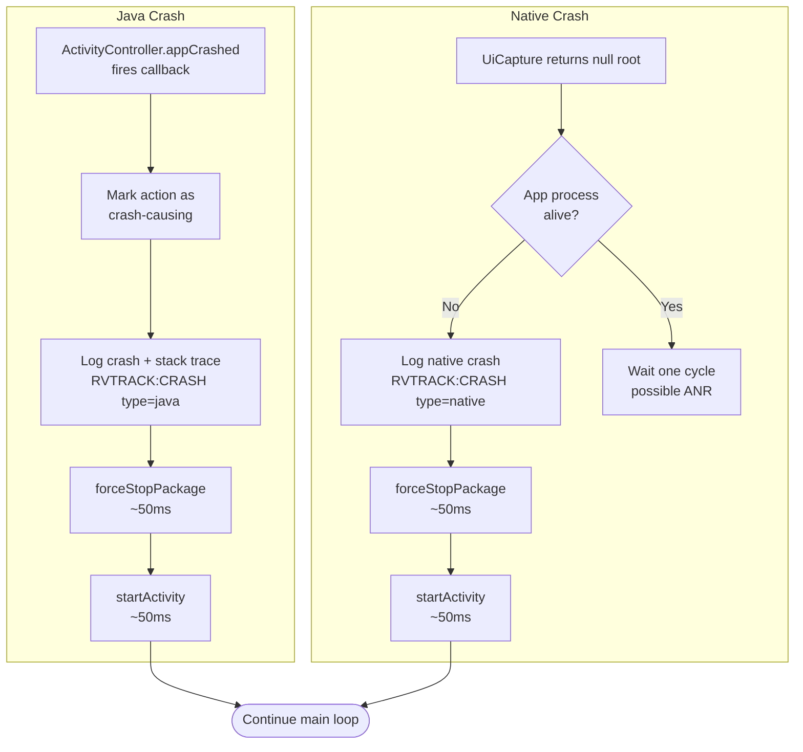

#### Scenario: Java crash detection and recovery
- **WHEN** the target app throws an uncaught exception
- **THEN** `CrashInterceptor.appCrashed()` SHALL fire with the exception
- **AND** the preceding action SHALL be marked as crash-causing in the graph
- **AND** the app SHALL be restarted via forceStopPackage + startActivity (~50-100ms)
- **AND** the agent SHALL continue from the next iteration

#### Scenario: Native crash detection
- **WHEN** the UI tree root is null and `getRunningTasks()` shows the target app is gone
- **THEN** the agent SHALL log "Native crash detected: app process gone"
- **AND** the app SHALL be restarted
- **AND** the agent SHALL continue from the next iteration

### Requirement: System Dialog Handling

rvsmart SHALL detect and dismiss system dialogs (crash dialog, permission requests, battery optimization) at the start of each cycle, before action selection. Detection is by package name: `android`, `com.android.packageinstaller`, `com.google.android.packageinstaller`, `com.android.settings`. Dismissal clicks the appropriate button (OK, Allow, Deny depending on dialog type) and re-captures the UI in the same cycle. Zero iterations wasted.

#### Scenario: Crash dialog dismissal
- **WHEN** the current screen is a system dialog from package `android` with text "has stopped"
- **THEN** `SystemDialogDetector.isSystemDialog()` SHALL return true
- **AND** `SystemDialogDetector.dismiss()` SHALL click the "OK" button
- **AND** the agent SHALL re-capture the UI and continue the iteration

### Requirement: Stuck Detection and Recovery

rvsmart SHALL implement two-level stuck detection:

- **Level 1**: If the screen hash remains unchanged for `stuck_max_blocks` consecutive iterations (default 10), force a BACK action.
- **Level 2**: If Level 1 does not resolve the stuck state, use BFS on the `back_successors` graph to find the nearest unsaturated ancestor. If no unsaturated ancestor is found within `max_backtrack_hops`, force a RESTART via `IActivityManager.forceStopPackage()` + `startActivity()`.

#### Scenario: Level 1 stuck recovery
- **WHEN** the screen hash has been "a1b2c3" for 10 consecutive iterations
- **THEN** StuckDetector SHALL trigger Level 1 recovery
- **AND** the agent SHALL execute a BACK action

#### Scenario: Level 2 stuck recovery with restart
- **WHEN** Level 1 BACK does not change the screen AND BFS finds no unsaturated ancestor within 8 hops
- **THEN** StuckDetector SHALL trigger Level 2 recovery
- **AND** the agent SHALL restart the app via forceStopPackage + startActivity

### Requirement: Heap Monitoring and OOM Prevention

`HeapMonitor` SHALL monitor `Runtime.freeMemory()` every 100 iterations to prevent OOM crashes during long exploration runs. Two thresholds are defined: warning (freeMemory < 20% of max heap) and critical (freeMemory < 10% of max heap).

At the critical threshold, `HeapMonitor` increases `throttle_ms` by 50% to reduce allocation pressure. If memory pressure persists for 3 consecutive checks (300 iterations), `MAX_ITEMS` cap is temporarily reduced to 1000 to limit UI tree memory footprint. When free memory recovers above 20%, throttle and MAX_ITEMS return to their configured values.

#### Scenario: OOM prevention at critical threshold
- **WHEN** `Runtime.freeMemory()` falls below 10% of `Runtime.maxMemory()`
- **THEN** `HeapMonitor` SHALL increase `throttle_ms` by 50%
- **AND** log warning "Memory pressure detected: freeMemory=Xmb (Y%), increasing throttle to Zms"

#### Scenario: Sustained memory pressure
- **WHEN** free memory remains below 10% for 3 consecutive HeapMonitor checks (300 iterations)
- **THEN** `HeapMonitor` SHALL reduce `MAX_ITEMS` cap from 2000 to 1000
- **AND** log warning "Sustained memory pressure: reducing MAX_ITEMS to 1000"

#### Scenario: Memory recovery
- **WHEN** free memory recovers above 20% of `Runtime.maxMemory()`
- **THEN** `HeapMonitor` SHALL restore `throttle_ms` and `MAX_ITEMS` to their configured values
- **AND** log info "Memory pressure resolved, restoring defaults"

### Requirement: Routing Manager (LLM Hybrid)

The `RoutingManager` decides per iteration whether to use the algorithm path or the LLM path. It operates within three top-level modes: `pure_algorithm` (LLM never called), `llm_only` (LLM always attempted, subject to circuit breaker), and `multimode` (LLM/algorithm blend via strategy). The in-app guard applies in all modes: when `outOfAppCount > 0`, the routing manager SHALL return false regardless of mode or strategy (INV-RSM-LLM-02).

Four strategies are supported within `multimode`:

- `probabilistic`: Random threshold against `llm_probability` (default 0.05, configurable, calibratable). The conservative 5% default reflects that algorithm iterations are 10x faster — even at 5%, the LLM provides guidance on ~1 in 20 iterations without bottlenecking throughput. Optuna calibration will find the optimal value. SHALL NOT be used as the default in new tool variants — new variants use `arrival_first` instead.
- `new_screen_only`: LLM only on first-ever visit to a screen (`visitCount == 1` at the time of the check). Retained for backward compatibility and experimentation.
- `stuck_only`: LLM only when `StuckDetector` fires. Retained for targeted recovery experiments.
- `arrival_first` (new): LLM on every screen arrival (hash changed from previous iteration) AND probabilistically with ratio `llm_new_screen_phase2_probability` (default 0.30) when hash is unchanged. See INV-RSM-LLM-05 and INV-RSM-LLM-06.

In `pure_algorithm` mode, `shouldUseLlm()` always returns false. In `llm_only` mode, it always returns true (except when LlmCircuitBreaker is open or `outOfAppCount > 0`).

The LLM path captures a screenshot via `SurfaceControl.screenshot()` (~20ms if available with Shell UID 2000). If `SurfaceControl` is not accessible, two fallback paths exist depending on execution context:
- **Managed mode** (via `RVSmartTool`): the plugin provides screenshot data via `adb exec-out screencap -p` piped to a temporary file on the device before each LLM iteration (~100-200ms, acceptable because LLM inference dominates at ~1.5-3s).
- **Standalone mode** (bare `adb shell`): LLM modes (`multimode`, `llm_only`) are unavailable without `SurfaceControl` — the agent logs a warning at bootstrap and forces `pure_algorithm` mode.

The screenshot is compressed to JPEG quality 80, resized to 1000px longest edge, sent with the UI element list to SGLang, the tool call response is parsed, and Qwen3-VL [0,1000) coordinates are denormalized to device pixels.

#### Scenario: Probabilistic routing in multimode
- **WHEN** mode is `multimode`, strategy is `probabilistic`, llm_probability is 0.05 (default)
- **THEN** ~5% of iterations SHALL use the LLM path
- **AND** ~95% SHALL use the algorithm path

#### Scenario: LLM circuit breaker trips
- **WHEN** 3 consecutive LLM calls fail (network error, timeout, or parse failure)
- **THEN** LlmCircuitBreaker SHALL open
- **AND** `shouldUseLlm()` SHALL return false for 60 seconds
- **AND** the agent SHALL fall back to algorithm path during the cooldown

#### Scenario: New-screen-only routing
- **WHEN** mode is `multimode`, strategy is `new_screen_only`
- **AND** the current screen has `visitCount = 1` (first visit)
- **THEN** `shouldUseLlm()` SHALL return true for this iteration
- **AND** on subsequent visits (`visitCount > 1`), `shouldUseLlm()` SHALL return false

#### Scenario: ARRIVAL_FIRST fires on screen change
- **WHEN** mode is `multimode`, strategy is `arrival_first`, current screen hash differs from previous iteration's hash
- **THEN** `shouldUseLlm()` SHALL return true (subject to circuit breaker)
- **AND** the new hash is recorded as the current screen hash for comparison in the next iteration

#### Scenario: ARRIVAL_FIRST uses phase-2 probability on same screen
- **WHEN** mode is `multimode`, strategy is `arrival_first`, current screen hash equals previous iteration's hash, `llm_new_screen_phase2_probability` is 0.30
- **THEN** `shouldUseLlm()` SHALL return true with probability 0.30 and false with probability 0.70

#### Scenario: LLM skipped when out of app
- **WHEN** `outOfAppCount > 0` (agent is in out-of-app tolerance window), mode is `multimode` or `llm_only`
- **THEN** `shouldUseLlm()` SHALL return false regardless of strategy or circuit breaker state
- **AND** the iteration uses the algorithm path

### Requirement: Prompt Builder

`PromptBuilder` assembles the messages list for LLM exploration requests. It accepts a `PromptVersion` (V13 or V17) and a `PromptContext` object, and dispatches to the appropriate template (INV-RSM-LLM-03).

`PromptContext` is a value object carrying all context fields for any prompt version. Base fields (required by V13 and V17): `base64Screenshot`, `uiElements`, `currentActivity`, `navigationHint` (nullable), `visitedActivities`, `iterationNumber`. V17-only fields (all nullable — graceful degradation per INV-RSM-LLM-04): `elementInteractionCounts`, `directMopElements`, `indirectMopElements`, `elementScores`, `recentActions`.

**V13 template** ports RVAgent's v13 Python prompt. The system message instructs the model to check for blocking dialogs before any other action (permission dialogs, error dialogs, modal popups), describes interaction priority (MOP targets > navigation to new screens > untested elements), and lists available actions. The user message includes: screenshot image, current activity, numbered UI elements (class + text/desc + coordinates), navigation hint if non-null, iteration number.

**V17 template** extends V13 with rich context. Each UI element is annotated with:
- Test-status tag: `[UNTESTED]` (0 interactions), `[TESTED-Nx]` (N interactions, N < 5), `[WELL-TESTED]` (5+ interactions)
- MOP marker: `[DM]` if the element's activity directly reaches a monitored operation per StaticMap; `[M]` if transitively reachable
- Algorithm score: `[score:N]` reflecting the composite scorer value for that element

The V17 user message additionally includes: last 5 actions (type + coordinates + activity), screen info line (`SCREEN: ActivityName | X% coverage (K/N actions) | visit #V`), and a `MOP NAVIGATION:` section when the navigation hint describes MOP-relevant targets.

When V17 context fields are absent (null StaticMap, empty interaction counts, no recent actions), those sections are omitted without error — the output degrades to V13-equivalent for the missing sections (INV-RSM-LLM-04).

Diagnostic logging: when enabled, the full assembled prompt text is written to logcat tag `RVSMART-PROMPT` at DEBUG level. Raw LLM response text from `ToolCallParser` is written to logcat tag `RVSMART-LLM-RESP` at DEBUG level.

#### Scenario: V13 prompt structure
- **WHEN** `PromptVersion.V13`, activity is `com.example.MainActivity`, 3 interactive elements, no navigation hint
- **THEN** system message SHALL contain dialog handling instructions and priority rules
- **AND** user message SHALL contain numbered element list with class, text, and coordinates
- **AND** user message SHALL NOT contain test-status tags, MOP markers, or score annotations

#### Scenario: V17 enriches elements with test-status and MOP markers
- **WHEN** `PromptVersion.V17`, element A has 0 interactions (untested), element B has 2 interactions, element B's activity directly reaches a MOP per StaticMap
- **THEN** element A SHALL be formatted as `[UNTESTED] Button "Submit" at position (500, 416) [score:260]`
- **AND** element B SHALL be formatted as `[TESTED-2x] Button "Encrypt" at position (500, 600) [score:460] [DM]`

#### Scenario: V17 includes action history
- **WHEN** `PromptVersion.V17`, ring buffer contains last 3 actions
- **THEN** user message SHALL contain a `Recent actions (3):` section listing each action's type, coordinates, and activity
- **AND** the section SHALL appear before the MOP NAVIGATION section

#### Scenario: V17 graceful degradation when context absent
- **WHEN** `PromptVersion.V17`, StaticMap is null, interaction counts are empty
- **THEN** elements SHALL be formatted without MOP markers and without test-status tags
- **AND** no exception SHALL be thrown
- **AND** output SHALL match V13 format for those elements

#### Scenario: Diagnostic prompt logging
- **WHEN** an LLM call is made with V13 or V17
- **THEN** the full assembled prompt SHALL be written to logcat tag `RVSMART-PROMPT` at DEBUG level before the HTTP call

### Requirement: Tool Variants (rvsmart-tool)

The Python `RVSmartTool` variant registry SHALL include the following variants:

- `default` (pure_algorithm, throttle_ms=50) — baseline algorithm-only
- `fast` (pure_algorithm, throttle_ms=30) — faster algorithm-only for throughput tests
- `llm_only` (mode=llm_only, llm_base_url=deployment-specific) — diagnostic; maximum LLM exposure
- `arrival_first_v13` (mode=multimode, llm_multimode_strategy=arrival_first, llm_prompt_version=v13, llm_new_screen_phase2_probability=0.30) — default recommendation for LLM-enabled runs
- `arrival_first_v17` (mode=multimode, llm_multimode_strategy=arrival_first, llm_prompt_version=v17, llm_new_screen_phase2_probability=0.30) — full rich-context variant

The `hybrid` variant has been removed (P3: no backward-compatibility aliases). Its configuration is superseded by `arrival_first_v13`.

#### Scenario: arrival_first_v17 passes correct config to Java
- **WHEN** variant `arrival_first_v17` is configured
- **THEN** the properties file pushed to the device SHALL contain `mode=multimode`, `llm_multimode_strategy=arrival_first`, `llm_prompt_version=v17`, `llm_new_screen_phase2_probability=0.30`

#### Scenario: llm_only variant for diagnostics
- **WHEN** variant `llm_only` is used and SGLang is reachable
- **THEN** every iteration (except out-of-app) SHALL attempt an LLM call
- **AND** the trace SHALL show `llm_actions` close to `total_actions` in the metrics report

### Requirement: Configurable Parameters via Properties

rvsmart SHALL load all configurable parameters from a `java.util.Properties` file specified via `--config`. When the file is absent, internal defaults SHALL be used. The file format is standard Java Properties (key=value, `#` comments).

Parameters are organized into 11 groups (see Key Data Models → Config for the complete list of ~48 parameters). All scorer weights, synthetic action scores, reward propagation parameters, and stuck detection thresholds are calibratable by Optuna (~39 of ~48 parameters). The remaining ~9 are infrastructure parameters (llm_base_url, llm_model, timeout, seed, mode, etc.) that are set per-experiment, not calibrated.

#### Scenario: Custom scorer weights via config
- **WHEN** rvsmart.properties contains `mop_direct_score=800.0` and `gradual_decay_base=150.0`
- **THEN** MopScorer SHALL use 800.0 for direct MOP-reaching (instead of default 500.0)
- **AND** GradualDecayScorer SHALL use 150.0 as base (instead of default 200.0)

#### Scenario: Default parameters when no config file
- **WHEN** rvsmart is started without `--config`
- **THEN** all parameters SHALL use their internal defaults
- **AND** the agent SHALL function with the default configuration

### Requirement: Structured Decision Logging (RVTRACK)

rvsmart SHALL implement structured decision logging using the same `[RVTRACK:<CATEGORY>]` prefix convention as the Python RVAgent. This enables automated verification scripts, calibration analysis, and post-mortem debugging using the same tooling. Logs are written to Android logcat via `android.util.Log.i("RVSMART", message)`.

Categories (matching Python agent where applicable):

| Category | Description | Key Fields |
|----------|-------------|------------|
| PARSE | UI capture result | iter, activity, elements, hash, capture_ms |
| ROUTE | LLM/algorithm routing decision | iter, mode, path, reason |
| RANK | Top-N actions with scores | iter, top (top-5 action signatures with scores) |
| SELECT | Final action selection | iter, tier, action, coords, score |
| EXEC | Action executed | iter, action, coords, source, inject_ms |
| STATE | State/activity change | iter, changed, from_hash, to_hash, from_activity, to_activity |
| LEARN | Post-action learning | iter, reward, stuck_level, had_effect |
| STRATEGY | Tier selection reasoning | iter, tier, reason, untested_count, saturation |
| BACKTRACK | Backtrack events | iter, level, from_state, to_state, hops |
| REWARD | Reward propagation | iter, type, value, steps, gamma |
| COVERAGE | Confirmed coverage event | iter, method, source (logcat) |
| LLM | LLM call metrics | iter, tokens_in, tokens_out, time_ms, success |
| STUCK | Stuck detection/recovery | iter, level, hash, consecutive, action |
| CRASH | App crash detected | iter, type (java/native), action, restart_ms |
| OOM | Memory pressure event | iter, free_pct, throttle_ms, max_items |

Format: `[RVTRACK:<CATEGORY>] key1=value1 key2=value2 ...`

Aggregate counters SHALL be maintained for experiment-level metrics (same set as Python agent where applicable): backtrack_count, restart_count, multi_attempt_retries, system_dialogs_dismissed, crash_recoveries, stuck_level1_count, stuck_level2_count, circuit_breaker_trips, oom_throttle_events. These counters are included in the `RVSMART_METRICS:` final report.

#### Scenario: Filtering RVTRACK logs from logcat
- **WHEN** an experiment completes with rvsmart
- **THEN** `adb logcat -s RVSMART | grep "RVTRACK:SELECT"` SHALL show all action selections
- **AND** `adb logcat -s RVSMART | grep "RVTRACK:"` SHALL show all tracked decisions
- **AND** automated scripts SHALL parse key=value pairs for metric extraction

#### Scenario: RVTRACK aggregate counters in final report
- **WHEN** the timeout expires
- **THEN** the `RVSMART_METRICS:` report SHALL include aggregate counters
- **AND** counter values SHALL match the count of corresponding RVTRACK log lines

### Requirement: Trace Output and Final Metrics Report

rvsmart SHALL write per-iteration trace data as JSON lines to stdout, captured by the rv-tools plugin into the task trace file. At timeout, rvsmart SHALL write a final metrics report as the last stdout line, prefixed with `RVSMART_METRICS:` (INV-RSM-10).

The metrics report contains 6 sections: `metadata` (tool, package, mode, timeout, timestamp, version), `exploration` (iterations, execution time, unique states, total transitions, throughput), `decisions` (total actions, LLM/algorithm counts, multi-attempt retries, forced backs, crashes, system dialogs), `ui_coverage` (unique activities, unique hashes, widgets discovered/interacted, coverage ratio), `confirmed_coverage` (enabled flag, unique methods, total events, MOP methods reached), `llm` (total calls, tokens in/out, total time, circuit breaker trips).

#### Scenario: Trace output during execution
- **WHEN** the agent completes iteration 42 at elapsed time 15.2s
- **THEN** stdout SHALL contain a JSON line: `{"iteration":42,"timestamp_ms":15230,"hash":"a1b2c3d4e5f6","activity":"MainActivity","action_type":"CLICK","action_source":"algorithm","action_had_effect":true,"retries":0,"unique_states":12,"elapsed_s":15.2}`

#### Scenario: Final metrics report at timeout
- **WHEN** the configured timeout expires after 4200 iterations
- **THEN** the last stdout line SHALL be prefixed with `RVSMART_METRICS:`
- **AND** the JSON payload SHALL contain all 6 sections with aggregated statistics

### Requirement: Reward Propagation

rvsmart SHALL implement N-step temporal difference reward propagation, matching the Python agent's `RewardPropagator`. When an action produces a meaningful outcome (new activity, new state, MOP coverage), a reward is propagated backward through the last N actions (default N=5) with discount factor gamma (default 0.8).

Reward types: `mop_reached` (5.0), `new_activity` (2.0), `new_state` (1.0), `form_fill` (0.0), `same_state` (-0.1). Cumulative reward per action is clamped at ±(`max_cumulative_factor` × `reward_mop_weight`).

When ConfirmedCoverageScorer detects actual coverage via logcat, `RewardPropagator.propagateConfirmedCoverage()` SHALL propagate a `mop_reached` reward for the coverage-triggering action and its predecessors.

#### Scenario: Reward propagation on new activity discovery
- **WHEN** an action causes a transition from MainActivity to SettingsActivity (new activity)
- **THEN** RewardPropagator SHALL assign reward 2.0 to the current action
- **AND** reward SHALL propagate backward: action[-1] gets 2.0×0.8=1.6, action[-2] gets 2.0×0.64=1.28, etc.
- **AND** propagation SHALL stop at N=5 steps or when the chain runs out

#### Scenario: Confirmed coverage reward from logcat
- **WHEN** `LogcatReader.drainCoverageTags()` returns `["javax.crypto.Cipher.getInstance"]`
- **AND** the tag appeared within `confirmed_coverage_window_s` (2.0s) of the last action
- **THEN** `RewardPropagator.propagateConfirmedCoverage()` SHALL propagate `mop_reached` reward (5.0) for the last action
- **AND** backward propagation with gamma=0.8 for the preceding N actions

### Requirement: Successor Tracker

rvsmart SHALL implement the SuccessorTracker to solve the "combobox problem" — when navigating BACK from a child state reveals untested elements on the parent, the parent action that led to the child SHALL be re-enabled for re-execution. The tracker records `back_successors` (which screens are reachable by pressing BACK from the current screen) for BFS navigation planning.

Re-enablement is limited to `max_re_enables` (default 6) per action. Multi-value widgets (spinners, dropdowns) saturate after `multi_value_saturation_threshold` (default 4) executions.

#### Scenario: Parent re-enablement after BACK
- **WHEN** the agent presses BACK from ChildScreen to ParentScreen
- **AND** ParentScreen now shows an untested widget (coverage < `ui_coverage_threshold`)
- **THEN** SuccessorTracker SHALL re-enable the parent action that led to ChildScreen
- **AND** Tier 2 (untested actions) SHALL pick up the re-enabled action

#### Scenario: Multi-value widget saturation
- **WHEN** a Spinner action has been executed 4 times (reaching `multi_value_saturation_threshold`)
- **THEN** SuccessorTracker SHALL NOT re-enable that action again
- **AND** the action remains saturated in the graph

### Requirement: Dynamic State Graph

rvsmart SHALL maintain a `DynamicStateGraph` using `LinkedHashMap<String, ScreenNode>` where keys are structural hashes. `LinkedHashMap` preserves insertion order, ensuring deterministic BFS traversal when using `--seed` for reproducibility (`HashMap` iteration order is non-deterministic). Each `ScreenNode` stores: visit count, executed actions (with success/failure counts), cumulative reward, and transitions to other states.

The graph supports: `recordVisit()`, `recordTransition()`, `recordAction()`, `recordActionFailure()`, `getVisitCount()`, `getSaturation()`. Actions are pre-marked before execution (crash safety — if the app crashes during execution, the graph still records that the action was attempted).

#### Scenario: Pre-mark for crash safety
- **WHEN** the strategy selects an action on screen "a1b2c3"
- **THEN** `graph.recordAction("a1b2c3", action.signature())` SHALL be called BEFORE execution
- **AND** if the app crashes during execution, the graph SHALL still contain the action record

#### Scenario: Saturation calculation
- **WHEN** screen "a1b2c3" has 10 actions in its `ScreenNode`, 8 of which appear in `executedActions`
- **THEN** `graph.getSaturation("a1b2c3")` SHALL return 0.8
