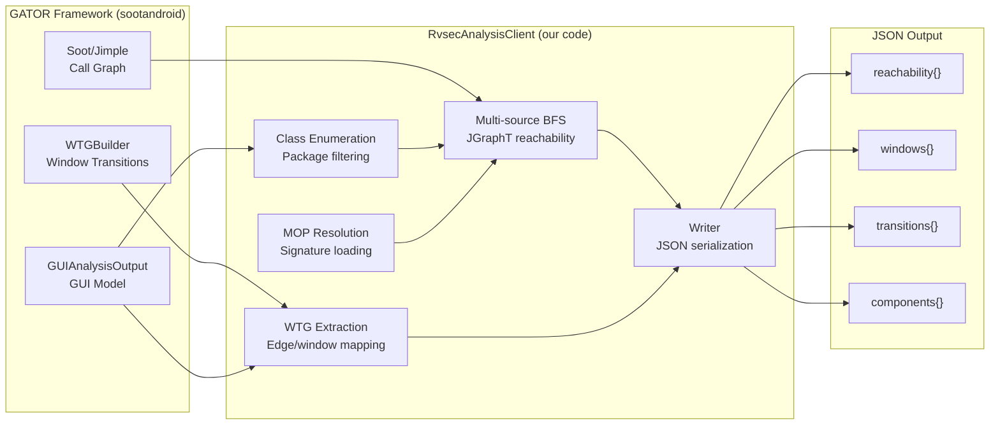
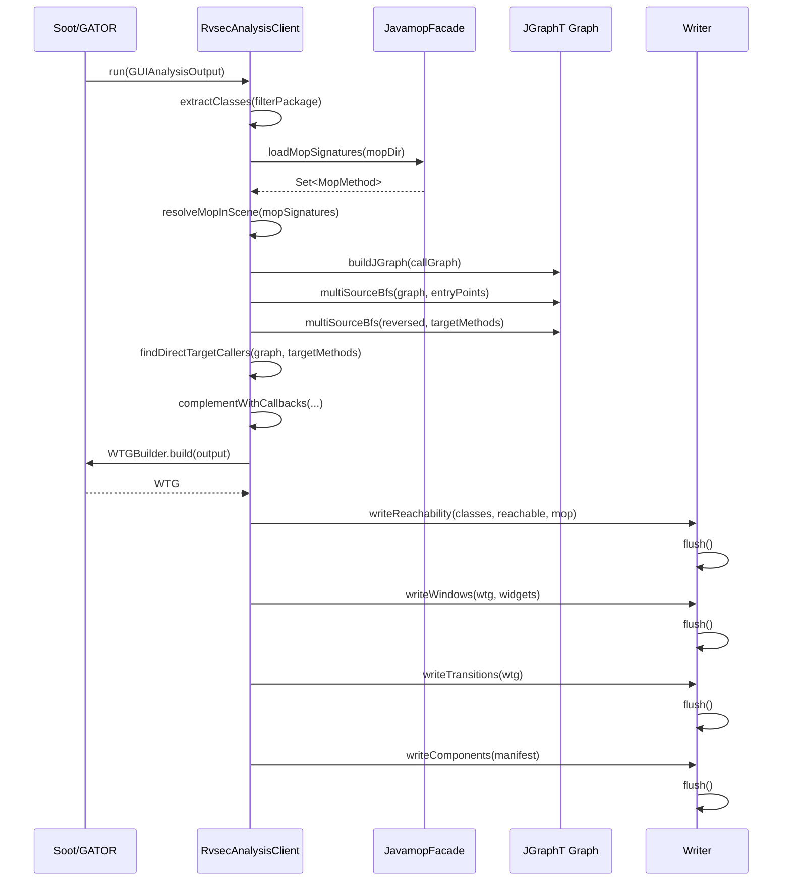
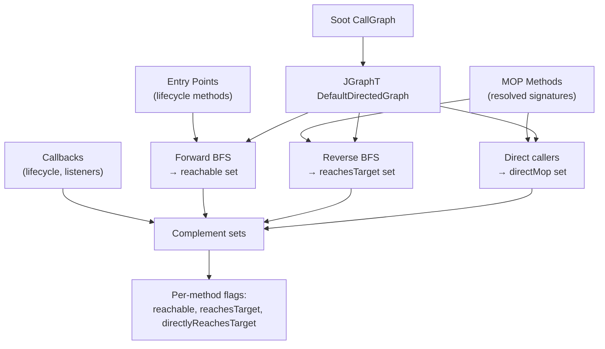
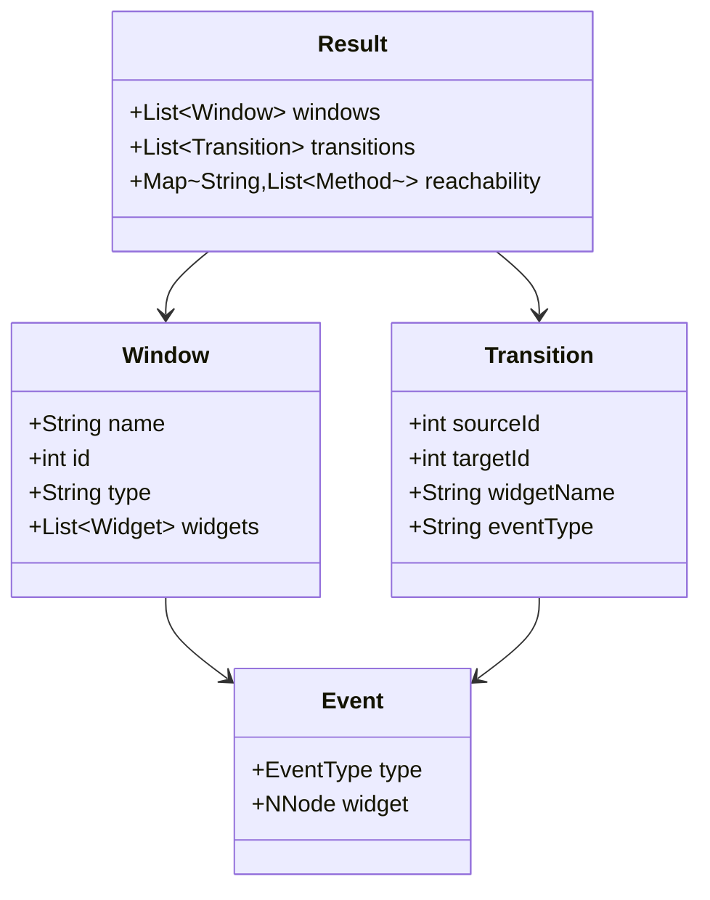

# GATOR Client Architecture

## 1. Overview

The GATOR client (`RvsecAnalysisClient`) is the static analysis component of the
RVSec system. It runs inside the GATOR framework (sootandroid) as a `GUIAnalysisClient`
plugin and produces a unified JSON file containing reachability, windows, transitions,
and component data for Android applications.

This JSON output feeds three downstream consumers: `rv-static-analysis` (Python parser),
`rv-coverage` (coverage denominator), and APE-RV (MOP scoring and WTG navigation).



## 2. Key Architectural Decisions

### AD-1: Unified client replacing three separate tools

Previously, static analysis required running GESDA (reachability), GATOR WTG Client
(transitions), and REACH (MOP reachability) separately. `RvsecAnalysisClient` combines
all three into a single pass.

**Why**: Each separate tool re-runs Soot analysis from scratch (~30-60 seconds per tool).
The unified client runs Soot once and produces all outputs in a single pass, reducing
analysis time by ~3x. Additionally, a single JSON file is simpler to push to the device
and parse in Python.

### AD-2: Priority-ordered JSON sections with flush

Sections are written in priority order (reachability first, then windows, transitions,
components) with explicit `flush()` calls between each section.

**Why**: GATOR has a hard timeout (controlled by the Python rv-static-analysis module).
If analysis times out mid-write, partial JSON preserves the most critical data first.
Reachability is most critical because it provides the coverage denominator. Without it,
coverage metrics cannot be computed. Windows and transitions are useful but not essential
(APE-RV degrades gracefully without them). (Cross-ref: INV-ANA-06)

### AD-3: Multi-source BFS on JGraphT graph

Reachability is computed by building a JGraphT `DefaultDirectedGraph` from Soot's
CallGraph, then running multi-source BFS forward (from entry points) and reverse
(from MOP methods using `EdgeReversedGraph`).

**Why**: Soot's CallGraph is optimized for single-source queries but not for set
reachability. JGraphT's `DefaultDirectedGraph` provides O(1) successor lookup and
supports the `EdgeReversedGraph` adapter for reverse traversal without rebuilding
the graph. Multi-source BFS computes reachability for all MOP methods simultaneously,
avoiding O(n) separate BFS passes.

### AD-4: Package-based class filtering with dual resolution

Classes are filtered by package name. The package is resolved from two sources:
`codePackage` (detected by Python's Androguard-based PackageDetector from component
analysis) takes priority over `manifestPackage` (from AndroidManifest.xml).

**Why**: 27.5% of F-Droid APKs have a manifest package that differs from the actual
code package (e.g., manifest says `com.app` but code is in `org.app.impl`). Using
the wrong package excludes application classes from analysis, producing empty
reachability data. The Python-side PackageDetector runs Androguard component analysis
to find the actual code package, passed via the `codePackage` client parameter.
(Cross-ref: INV-CORE-25)

### AD-5: Lifecycle and listener callback complementation

After the initial BFS, `complementWithCallbacks()` adds lifecycle methods (`onCreate`,
`onResume`, etc.) and listener callbacks registered in the GUI model to the reachable set.

**Why**: Standard call graph analysis misses Android lifecycle callbacks and listener
registrations because they are invoked by the framework, not by application code.
Without complementation, ~30-40% of reachable methods would be missed.

### AD-6: WTG node ID consistency via windowNodeIds map

A `windowNodeIds` map is built from WTG nodes to ensure windows and transitions use
consistent integer IDs. `NObjectNode.id` is used as the canonical identifier.

**Why**: WTG edges reference windows by ID. Without a consistent ID map, the JSON
output would have dangling references where a transition's `sourceId` doesn't match
any window entry, breaking the Python parser's graph construction.

## 3. Analysis Pipeline



## 4. Data Flow

### 4.1 Input data

```
APK → Soot decompilation → CallGraph + GUI Model
MOP specs (.mop files) → JavamopFacade → Set<MopMethod> signatures
AndroidManifest.xml → Package name, components (broadcasts, services)
```

### 4.2 Reachability computation



### 4.3 Output consumption

| Consumer | JSON Section | How |
|----------|-------------|-----|
| rv-static-analysis | All | `StaticAnalysisParser.parse()` → `StaticAnalysisData` domain model |
| rv-coverage | reachability | Methods with `reachable=true` form coverage denominator |
| aperv-tool | Pushed to device | APE-RV `MopData.load()` reads reachability + WTG for scoring |
| rv-agent | reachability | `NavigationGuidance` uses for WTG-guided exploration |

## 5. WTG Model



## 6. Spec Cross-References

| Invariant | Description | Implementation |
|-----------|-------------|----------------|
| INV-ANA-02 | Static analysis produces unified JSON | RvsecAnalysisClient.run() single output |
| INV-ANA-03 | Reachability via BFS on call graph | multiSourceBfs() on JGraphT |
| INV-ANA-06 | Partial JSON on timeout (priority sections) | flush() between each section |
| INV-ANA-11 | Package detection via Androguard | codePackage clientParam from Python |

## 7. Test Structure

```
client/src/test/java/presto/android/gui/clients/
    GatorTestHelper.java          — Test utilities and fixtures
    JsonOutputTest.java           — JSON format validation
    ExtractClassesFilterTest.java — Package filtering logic
    XmlInputTypeTest.java         — XML parsing edge cases
    RvsecAnalysisClientIT.java    — Integration test (full pipeline)
    BaselineComparisonIT.java     — Output comparison against baseline
    ReachabilityBfsTest.java      — BFS correctness on synthetic graphs
    MopSignatureLoaderTest.java   — MOP spec loading and resolution
```

## 8. Build

Part of the rvsec-gator Maven module. The client is packaged alongside sootandroid:

```bash
cd rvsec/rvsec-android/rvsec-gator
mvn package -DskipTests
# Output: target/rvsec-gator-<version>.jar (includes client + sootandroid)
```

The Python `rv-static-analysis` module invokes the GATOR JAR via subprocess, passing
the client class name and APK path as arguments.
