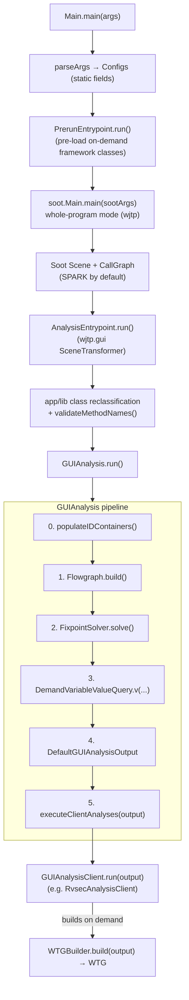

# GATOR `sootandroid` Architecture

## 0. Scope and provenance

This document describes the **`sootandroid`** Maven module — the core of the GATOR
static-analysis framework that RVSec builds on. It is the engine that loads an Android
app into [Soot](https://github.com/soot-oss/soot), builds a GUI model and a Window
Transition Graph (WTG), and exposes both to *client* analyses. The RVSec client
(`RvsecAnalysisClient`, documented in `../../client/docs/architecture.md`) is one such
plugin; `sootandroid` itself is app- and client-agnostic.

Provenance of claims:
- **Transcribed directly from source** (exact signatures/structure verified): the Soot
  bootstrap (`Main`, `AnalysisEntrypoint`), `GUIAnalysis.run()` and client loading, the
  `GUIAnalysisClient` contract, the full `GUIAnalysisOutput` method list (§3.5), the
  verified `XMLParser` methods (§3.6), the `N*` node hierarchy (§4), the `WTGBuilder`
  phases/stages (§5.1), `IntentFilter`/`AuthorityEntry`/`PatternMatcher` (§5.4).
- **Described at the level of responsibility** (role and data flow, not a precise API):
  `Configs`, `Hierarchy`, `Flowgraph`, `FixpointSolver`, `DemandVariableValueQuery`, the
  WTG `ds`/`algo`/`analyzer`/`flowgraph` packages. For these, read the source for exact
  signatures; nothing here is invented, but the method names are illustrative rather than
  exhaustive.

GATOR upstream provenance: the package root is `presto.android` (The Ohio State
University). RVSec adds the `presto.android.gui.clients` RVSec client and a small number
of targeted modifications noted inline (e.g. INV-ANA-16 defensive Soot options, the D15
intent-filter getters).

## 1. Overview



`sootandroid` runs as a Soot whole-program transform. Soot does the heavy lifting
(class loading, Jimple IR, call graph); GATOR contributes (a) a *flow graph* of
GUI-related value flows, (b) a *fixpoint* over that graph that resolves which concrete
GUI objects reach which framework API calls, and (c) a *WTG* that models window-to-window
transitions. Client plugins consume the resulting `GUIAnalysisOutput` (and optionally
build a `WTG`) to produce their own outputs.

## 2. Bootstrap layer (`presto.android`)

### 2.1 `Main` — Soot setup and invocation

`Main.main()` (`src/main/java/presto/android/Main.java`) runs three steps:
`parseArgs(args)` → `checkAndPrintEnvironmentInformation(args)` → `setupAndInvokeSoot()`.

- **`parseArgs`** parses ~40 explicit flags (no flag library, by design) straight into
  static `Configs` fields: `-project`, `-guiAnalysis`, `-cgAlgorithm`, `-client`,
  `-clientParam`/`-cp`, `-manifestFile`, `-resourcePath`, `-libraryPackageName`,
  `-worker`, `-sdkDir`/`-apiLevel`/`-android`/`-jre`, etc. Unknown options throw.
  Finishes with `Configs.processing()`.
- **`setupAndInvokeSoot`** (`Main.java:202`) computes the classpath
  (`Configs.android` + `Configs.jre` + dep jars), then chooses the Soot pack/phase by
  whether a call-graph algorithm is configured:
  - With a CG algorithm → pack **`wjtp`**, phase **`wjtp.gui`** (whole-program mode).
  - Without → pack **`cg`**, phase **`cg.gui`** (legacy, no call graph).

  Fixed Soot args include `-w`, `-f n`, `-keep-line-number`,
  `-search-dex-in-archives`, `-allow-phantom-refs`, `-no-bodies-for-excluded`,
  `-process-dir <bytecodes>`, and the **exclude list** `kotlin.`, `kotlinx.`,
  `androidx.compose.` (`Main.java:225-227`). The CG algorithm switch maps
  `cha` → `cg.cha`, and `rta`/`vta`/`spark` → `cg.spark` (with `rta:true`/`vta:true`
  for the first two); unknown values fall back to CHA with a warning
  (`Main.java:233-251`). `all-reachable:true` is set for CG construction.
- Before Soot runs, `readWidgetMap()` loads
  `Configs.sootAndroidDir/scripts/consts/widgetMap`, and `PrerunEntrypoint.v().run()`
  executes (§2.3).
- **`setupAndInvokeSootHelper`** registers a `SceneTransformer` on the chosen pack whose
  `internalTransform` calls `AnalysisEntrypoint.v().run()`, sets two **defensive Soot
  options (INV-ANA-16)** — `Options.set_ignore_resolution_errors(true)` and
  `Options.set_throw_analysis(throw_analysis_dalvik)` — and finally calls
  `soot.Main.main(sootArgs)` (`Main.java:285-289`).

### 2.2 `Configs` — global configuration

`Configs` is a holder of static configuration fields populated by `parseArgs` and
finalized by `processing()`. It controls: project/APK paths and `bytecodes`; manifest
and resource locations; SDK/`android.jar`/JRE; the analysis switch `guiAnalysis`; the
client list `clients` and `clientParams`; the call-graph algorithm `cgAlgorithm`
(default `spark`); WTG knobs (`workerNum`, `implicitIntent`, `resolveContext`,
`sDepth`, `epDepth`, `allowLoop`, `asyncStrategy`, test-gen strategy); library-package
classification (`libraryPackages`, `isLibraryClass(...)`); the loaded `widgetMap`; and
`flowgraphOutput`. Enumerations include `TestGenStrategy` and `AsyncOpStrategy`.

> The exact field set is large; treat the source as authoritative. The fields named
> above are the ones referenced by the bootstrap and GUI layers described here.

### 2.3 `PrerunEntrypoint` + `PrerunXMLParser` — on-demand pre-loading

`PrerunEntrypoint.run()` executes **before** the main Soot analysis (called from
`Main.setupAndInvokeSoot`). Its job is to make sure framework/widget classes that the
app references only through XML (layouts, menus) are available in the Scene. It drives
`PrerunXMLParser`, which walks layout and menu XML and resolves each GUI element's short
name (e.g. `Button`, `<view class="...">`, `<include>`) to a fully-qualified class name
via `Configs.widgetMap`, registering the results in `Configs.onDemandClassSet`. This is
the lightweight counterpart to `DefaultXMLParser` (§3.6): it collects *class names to
load*, not the full view hierarchy.

### 2.4 `AnalysisEntrypoint` — Scene post-processing then hand-off

`AnalysisEntrypoint.run()` (`src/main/java/presto/android/AnalysisEntrypoint.java`)
runs inside the `wjtp.gui` transform, after the Scene and call graph exist:

1. Unless `PRODUCTION=1`, runs `validate()` → `validateMethodNames()`, a sanity check
   that the expected Android framework methods exist in the loaded Scene
   (`Activity.setContentView`, `LayoutInflater.inflate`, `View.findViewById`,
   `View.setId`, menu/dialog/tab callbacks, etc.). These are the API calls the GUI
   flow graph later models, so their presence is a precondition.
2. If `Configs.libraryPackages` is empty, adds defaults `android.support.*` and
   `com.google.android.gms.*`.
3. Parses `AndroidManifest.xml` directly (DOM) to obtain the app package and the set of
   declared activity class names, then **reclassifies** Soot classes: declared
   activities and classes under the app package are forced to *application* classes;
   classes matching a library package are demoted to *library* classes. This corrects
   Soot's default app/lib partitioning, which matters for what the analysis treats as
   in-scope.
4. If `Configs.guiAnalysis` is set, calls `GUIAnalysis.v().run()` and then
   `System.exit(0)`.

### 2.5 `Hierarchy` — cached type relations

`Hierarchy` (`presto.android.Hierarchy`, singleton `v()`) is built by traversing
`Scene.v().getClasses()` and caches transitive sub/super-type relations plus
category sets (activities, views, menus, menu-items, dialogs). It answers the type
queries the rest of the analysis needs — subclass tests, GUI-class tests
(`isGUIClass`, `isViewClass`, `isActivityClass`, …), virtual-dispatch resolution
(walking the receiver hierarchy to find the overriding method), and enumeration of
framework-managed callback methods on application classes.

### 2.6 Smaller bootstrap helpers

- **`MethodNames`** — interface of constant sub-signatures / signatures for Android
  framework callbacks, centralizing them so the validation in §2.4 and the modeling in
  §3.2 refer to one definition (avoids signature typos).
- **`Debug`** — singleton debug writer + debug-code constants gating verbose dumps.
- **`MultiMapUtil`** — small map-of-sets helper.

## 3. GUI analysis layer (`presto.android.gui`)

### 3.1 `GUIAnalysis` — orchestrator

`GUIAnalysis` (`src/main/java/presto/android/gui/GUIAnalysis.java`) is a singleton
(`v()`) holding `Hierarchy hier`, `XMLParser xmlParser`, the resource-id sets
(`allLayoutIds`, `allMenuIds`, `allWidgetIds`, `allStringIds`), and the analysis
products (`flowgraph`, `fixpointSolver`, `variableValueQueryInterface`). It defines
`DEFAULT_CLIENT_PACKAGE = "presto.android.gui.clients"`.

`run()` executes five numbered stages (`GUIAnalysis.java:81-132`):

| # | Stage | Call |
|---|-------|------|
| 0 | Collect resource IDs from XML | `populateIDContainers()` |
| 1 | Build the GUI flow graph | `new Flowgraph(hier, allLayoutIds, allMenuIds, allWidgetIds, allStringIds); flowgraph.build()` |
| 2 | Solve the fixpoint | `new FixpointSolver(flowgraph); fixpointSolver.solve()` |
| 3 | Wrap a value-query interface | `DemandVariableValueQuery.v(flowgraph, fixpointSolver)` |
| 4 | Build the output facade | `new DefaultGUIAnalysisOutput(this)` |
| 5 | Run client plugins | `executeClientAnalyses(output)` |

If `Configs.flowgraphOutput` is non-empty, the flow graph is dumped at the end.

**Client loading** (`executeClientAnalyses` + `readClientAnalysisSpecification`,
`GUIAnalysis.java:134-191`): for each name in `Configs.clients`, try
`Class.forName(name)`; if that fails and the name is unqualified, retry with
`DEFAULT_CLIENT_PACKAGE + "." + name`; instantiate via no-arg constructor; if it
`instanceof GUIAnalysisClient`, add it. Each client's `run(output)` is then invoked and
timed. Failures are warnings, not fatal.

### 3.2 `Flowgraph` — GUI value-flow graph

`Flowgraph` builds a directed graph whose nodes (the `N*` model, §4) represent Jimple
locals, fields, allocations, resource IDs, string values, and *operation nodes* for the
framework GUI APIs (layout inflation, `findViewById`, `addView`/`setContentView`,
`setId`, `setListener`, `setText`, menu operations, `StringBuilder.append`). `build()`
creates the resource-id nodes, models framework-managed callbacks, then walks
application Jimple statements, adding assignment edges and creating an operation node
for each recognized framework call. The result is the substrate the fixpoint solves
over.

### 3.3 `FixpointSolver` (+ `FixpointComputationOptimized`)

`solve()` runs an iterative fixpoint over the flow graph that resolves, for each
operation node, which concrete GUI objects flow to its receiver, parameters, and result
— e.g. which layout IDs reach an inflate call, which views a `findViewById` can return,
which listener objects are bound by a `setListener`, and which root views belong to each
activity/dialog. Layout/menu inflation is expanded against the parsed XML view tree, and
a propagation loop repeats until no new facts are derived.
`FixpointComputationOptimized` provides single-pass reachability variants
(producer→consumer and window reachability) to avoid recomputing reachability per query.

### 3.4 `VariableValueQueryInterface` + `DemandVariableValueQuery`

An **on-demand** value-query API: given a Jimple `Local`, return the set of values it may
hold — resource IDs (`idVariableValues`), activity objects, GUI/view objects, or listener
objects. `DemandVariableValueQuery` answers these by backward reachability over the flow
graph combined with the solved fixpoint results, computing only what is asked rather than
a global points-to solution.

### 3.5 `GUIAnalysisOutput` / `DefaultGUIAnalysisOutput` — the client contract

`GUIAnalysisOutput` is the **interface every client receives** (full method list
verified from `gui/GUIAnalysisOutput.java`). It groups into:

- **Results / graph access:** `getFlowgraph()`, `getSolver()`,
  `getVariableValueQueryInterface()`, `operationNodes(Class<? extends NOpNode>)`, and the
  per-op-node solution maps `operationNodeAndReceivers()`, `operationNodeAndParameters()`,
  `operationNodeAndResults()`, `operationNodeAndListeners()`
  (`Map<NOpNode, Set<NNode>>`).
- **Activities:** `getActivities()`, `getMainActivity()`, `getActivityRoots(SootClass)`,
  `getLifecycleHandlers(SootClass)`, `getActivityHandlers(SootClass, List<String> subsigs)`.
- **Menus:** `getOptionsMenu(SootClass)`, `getContextMenus(NObjectNode)` (+ the
  result-accumulating overload), `getOnCreateContextMenuMethod(NContextMenuNode)`,
  `getMenuHandlers(SootClass)`, `getMenuCreationHandlers(SootClass)`, and the
  explicit-show predicates `isExplicitShowOptionsMenuCall`/`explicitlyTriggeredOptionsMenus`
  (and the context-menu equivalents).
- **Dialogs:** `getDialogs()`, `getDialogRoots(NDialogNode)`,
  `getDialogCreationHandlers(SootClass)`, the show/dismiss site queries
  (`isDialogShow`/`dialogsShownBy`/`getDialogShows`, `isDialogDismiss`/`dialogsDismissedBy`/
  `getDialogDimisses`), `getDialogLifecycleHandlers`, `getOtherEventHandlersForDialog`.
- **Views & handlers:** `getAllEventsAndTheirHandlers(NObjectNode)` and its
  explicit/implicit variants (`Map<EventType, Set<SootMethod>>`),
  `getAllSupportedEvents`, `getCallbackRegistrations(NObjectNode[, EventType])`,
  `getEventHandlers(NObjectNode, EventType)`, `isCallbackRegistration(Stmt)`,
  `getViewLocal(SootMethod)`, `getListenerLocal(SootMethod)`,
  `getRealHandler(SootMethod fakeHandler)`.
- **Measurements / misc:** `getRunningTimeInNanoSeconds()` /
  `setRunningTimeInNanoSeconds(long)`, `getAppPackageName()`,
  `isLifecycleHandler(SootMethod)`.

`DefaultGUIAnalysisOutput` implements all of this by delegating to the solved fixpoint
and flow-graph maps. `getRealHandler` is notable: the analysis injects synthetic "fake"
handlers in some cases, and this maps them back to the real application method.

### 3.6 `XMLParser` / `DefaultXMLParser` and resource support

`XMLParser` (interface, `Factory.getXMLParser()` → `DefaultXMLParser`) parses the
manifest and resources fully (the heavyweight counterpart to `PrerunXMLParser`).
Verified contract methods include:
- **Manifest components:** `getAppPackageName()`, `getMainActivity()` (→ `SootClass`),
  `getActivities()`/`getServices()`/`getReceivers()`/`getProviders()` (each →
  `Iterator<String>`), `getNumberOfActivities()`, `getLaunchMode(...)`
  (→ `ActivityLaunchMode`).
- **Permissions / provider metadata (D15-relevant):** `getComponentPermission(...)`,
  `getProviderReadPermission(...)`, `getProviderWritePermission(...)`,
  `getProviderAuthorities(...)`.
- **Resources:** R-constant value/name lookups for application and system resources
  (`getApplication*IdValues`, `getSystem*IdValues`, `getStringIdValues`,
  `getApplicationRIdName`, `getSystemRLayoutName`, `getStringValue`, …), the layout/menu
  view hierarchies (`AndroidView` trees, with `<include>` handled by
  `IncludeAndroidView`), and string values.

Intent filters themselves are modeled by `IntentFilter` (§5.4), not exposed as a method
on this interface; the manifest's `<data>` blocks (scheme / authority host+port / path /
mimeType) live there.

`ResourceConstantHelper` loads the system R-constants for the target API level from
`scripts/consts/android-NN/...`. `AndroidView`/`IAndroidView`/`IncludeAndroidView` model
the parsed view tree consumed during inflation in §3.3.

### 3.7 Support utilities and sub-packages

- **`JimpleUtil`** — Jimple accessors (lhs local, receiver, `this`, n-th parameter;
  statement→method recording/lookup).
- **`GraphUtil`** — forward/backward reachability and view-hierarchy descendant traversal
  over `NNode`s.
- **`IDNameExtractor`** — integer resource ID → human-readable R name.
- **`PropertyManager`** — extracts text/hint strings of a view node (resolving string
  constants, string IDs, and `StringBuilder` values).
- **`gui/listener/`** — listener/event specification: which view types expose which
  `EventType`s via which listener interfaces and handler sub-signatures, and where the
  target view sits in a handler's parameters.
- **`gui/rep/`** — a higher-level GUI-hierarchy representation (activities/dialogs/views)
  for clients that want a tree rather than the raw flow graph.

## 4. The flow-graph node model (`presto.android.gui.graph`)

The flow graph is built from the `N*` node classes. **The hierarchy below was verified
directly from the `extends` declarations** (it corrects several common misreadings — e.g.
`NAllocNode`, the constant nodes, `NIdNode`, and `NNullNode` do **not** extend
`NPointerNode`):

```
NNode  (abstract, implements Comparable<NNode>)
├── NPointerNode (abstract)            — pointer/reference cells
│   ├── NVarNode                       — a Jimple Local
│   └── NFieldNode                     — a SootField
├── NObjectNode (abstract)            — concrete object instances
│   ├── NAllocNode                     — an allocation site (new ...)
│   │   ├── NListenerAllocNode         — allocated listener instance
│   │   ├── NViewAllocNode             — allocated View instance
│   │   └── NStringBuilderNode         — StringBuilder value
│   ├── NWindowNode (abstract)         — windows
│   │   ├── NActivityNode
│   │   └── NDialogNode
│   ├── NMenuNode (abstract)
│   │   ├── NContextMenuNode
│   │   └── NOptionsMenuNode
│   ├── NInflNode                      — view created by layout inflation
│   │   └── NMenuItemInflNode          — inflated menu item
│   ├── NIntConstantNode
│   ├── NLongConstantNode
│   ├── NStringConstantNode
│   └── NTabSpecNode
├── NIdNode (abstract)                — resource IDs
│   ├── NLayoutIdNode
│   ├── NMenuIdNode
│   ├── NWidgetIdNode
│   ├── NStringIdNode
│   └── NAnonymousIdNode              — int constants not in any R map
├── NOpNode (abstract)               — modeled framework API calls
│   ├── NInflate1OpNode / NInflate2OpNode      — inflate / setContentView(id)
│   ├── NFindView1OpNode / NFindView2OpNode / NFindView3OpNode
│   ├── NAddView1OpNode / NAddView2OpNode       — setContentView(view) / addView
│   ├── NSetIdOpNode                            — View.setId
│   ├── NSetListenerOpNode                      — set*Listener
│   ├── NSetTextOpNode                          — setText
│   ├── NMenuInflateOpNode                      — MenuInflater.inflate
│   └── NStringBuilderAppendOpNode              — StringBuilder.append
└── NNullNode                         — the null literal
```

Reading the graph: **object nodes** are runtime GUI objects; **pointer nodes** are the
locals/fields that may hold them; **id nodes** are resource IDs from XML; **op nodes**
encode a framework API call and connect the objects that flow into and out of it. The
fixpoint (§3.3) resolves the object sets at each op node's receiver/parameters/result.

## 5. WTG subsystem (`presto.android.gui.wtg`)

The WTG (Window Transition Graph) models navigation between windows (activities,
dialogs, menus) as a graph: **nodes are windows**, **edges are transitions** carrying the
triggering event(s)/handlers, a `RootTag` reason, a callback sequence, and window-stack
operations.

### 5.1 `WTGBuilder` — three phases, six edge-building stages (verified)

`build(GUIAnalysisOutput output)` = `preBuild(output)` → `building()` → `postBuild()`
(`gui/wtg/WTGBuilder.java`):

- **`preBuild`** — checks `output` non-null, sets `flowgraphRebuilder =
  FlowgraphRebuilder.v(guiOutput)`, and constructs `cfgAnalyzer = new
  CFGAnalyzer(guiOutput, flowgraphRebuilder)`.
- **`building`** — a `Multimap<WTGNode, NActivityNode> ownership` is threaded through six
  sequential stages, each `buildEdges` consuming the previous stage's output:

  | Stage | Builder | Produces (category of edges) |
  |-------|---------|------------------------------|
  | 1 | `ExplicitForwardEdgeBuilder` | WTG nodes + explicit forward edges (startActivity, showDialog, open menu) |
  | 2 | `LifecycleForwardEdgeBuilder` | lifecycle-driven forward edges |
  | 3 | `CloseWindowEdgeBuilder` | window-close edges (finish/dismiss/close, self vs owner) |
  | 4 | `CallbackSequenceBuilder` | callback sequences + window-stack push/pop ops |
  | 5 | `BackEdgeBuilder` | back edges (forward↔back pairing) |
  | 6 | `LifecycleCloseEdgeBuilder` | final lifecycle-based close edges |

  All six stage outputs are stored; edges of the **final** stage are added to the graph
  via `wtg.addEdge(...)`, then `ignoreEdges(stageOutput)` does a backward pass to
  "resurrect"/prune edges (dead-edge handling).
- **`postBuild`** — dumps the WTG only when `Configs.debugCodes` contains
  `Debug.DUMP_CCFX_DEBUG`.

### 5.2 Data structures (`wtg/ds/`)

`WTG` (nodes/edges/components/handlers, lazy window-ownership), `WTGNode` (a window, with
in/out edges), `WTGEdge` (src/tgt window, triggering `EventHandler`s, `RootTag`, callback
list, `StackOperation` list; plus a `WTGEdgeSig` for dedup), `WTGComponent` (an activity
plus the dialogs/menus it owns, with boundary edges), `HandlerBean`, and `WTGHelper`
(edge factory + classification helpers).

### 5.3 Edge-building support (`wtg/algo/`, `wtg/analyzer/`, `wtg/flowgraph/`, `wtg/parallel/`)

The stage builders implement a common `Algorithm` (`execute(AlgorithmInput)
→ AlgorithmOutput`); independent per-edge work is parallelized across `Configs.workerNum`
workers via `BuildScheduler`/`BuildWorker`. `CFGAnalyzer` (in `wtg/analyzer/`) traces a
callback method's control flow to find the startActivity/show/finish/dismiss calls that
become edges, using intra-procedural constant propagation and `IntentAnalysis`.
`FlowgraphRebuilder` (in `wtg/flowgraph/`) augments the base flow graph with
Intent-tracking nodes so intents and their content can be followed to `startActivity`
sites.

### 5.4 Intents (`wtg/intent/`) and pattern matching (`wtg/util/`)

`IntentAnalysis` resolves which windows an (implicit) intent can reach, matching
extracted intent content (`IntentAnalysisInfo`, keyed by `IntentField`) against the
manifest's `IntentFilter`s (registered in `IntentFilterManager`). An `IntentFilter`
(verified) holds: `mActions`, `mCategories`, `mDataTypes` (MIME), `mDataSchemes`,
`mDataPaths` (`List<PatternMatcher>` — the matcher's `mType` distinguishes
literal/prefix/glob, so there is no separate prefix/pattern list), `mDataAuthorities`
(`List<AuthorityEntry>`, each carrying `mHost`/`mWild`/`mPort`), and a `mHasPartialTypes`
flag for `"type/*"` MIME matching. `isLauncherFilter()` detects the MAIN+LAUNCHER entry.

Note on matching scope: the **active** `IntentFilter.match(IntentAnalysisInfo)` handles
only *simple* implicit intents — it returns `false` if either side declares any data
field, then checks action + category. The fuller URI/MIME matching logic
(`matchData`, `matchDataAuthority`, `findMimeType`) exists in the source but the
data-aware path is currently not the one `match()` invokes.

`PatternMatcher` (`wtg/util/PatternMatcher.java`, verified) implements Android's
three matching modes — `PATTERN_LITERAL = 0`, `PATTERN_PREFIX = 1`,
`PATTERN_SIMPLE_GLOB = 2` — over `(mPattern, mType)`.

> **RVSec D15 link (2026-05-29):** `IntentFilter` exposes data-block getters
> (`getDataSchemes`, `getDataMimeTypes`, `getDataAuthorities`, `getDataPaths`),
> `AuthorityEntry` exposes `getHost`/`getPort`, and `PatternMatcher` exposes
> `getPattern`/`getType`. These were added so `RvsecAnalysisClient` can serialize the
> intent `<data>` block for downstream component triggering — see the client doc's AD-7.

### 5.5 Path feasibility and output

`WindowStack` simulates the modal window stack along a candidate path: an edge is
feasible only if, after applying its push/pop `StackOperation`s, the edge's target sits
at the top of the stack. `WTGAnalysisOutput` is the WTG-side facade clients use to query
the graph and enumerate feasible paths.

## 6. Client extension point

`GUIAnalysisClient` (verified) is the entire plugin contract:

```java
public interface GUIAnalysisClient {
  void run(GUIAnalysisOutput output);
}
```

A client is registered by class name in `Configs.clients` (`-client` flag) and loaded by
reflection (§3.1). Classes in `presto.android.gui.clients` may be named unqualified.
RVSec's client is `presto.android.gui.clients.RvsecAnalysisClient`; it consumes
`GUIAnalysisOutput`, builds a `WTG` via `WTGBuilder`, computes reachability against
loaded MOP signatures, and serializes the unified JSON described in
`../../client/docs/architecture.md`.

## 7. Key architectural decisions

| ID | Decision | Why |
|----|----------|-----|
| AD-1 | Run as a Soot **whole-program** transform (`wjtp.gui`) with a real call graph | The GUI flow graph and WTG both need interprocedural reachability; the legacy `cg.gui` (no CG) path exists only as a fallback |
| AD-2 | **SPARK** is the default call-graph algorithm (`cgAlgorithm = spark`), `cha`/`rta`/`vta` selectable | SPARK's points-to precision keeps the GUI fixpoint tractable; CHA is the safe fallback for unknown values |
| AD-3 | **Exclude** `kotlin.`, `kotlinx.`, `androidx.compose.` from Soot bodies | These framework packages are large and not needed as analysis bodies; excluding them bounds load time/memory |
| AD-4 | Two-pass class loading: `PrerunXMLParser` collects XML-referenced widget classes into `onDemandClassSet` before Soot | Views referenced only from layout/menu XML would otherwise be missing from the Scene |
| AD-5 | `AnalysisEntrypoint` **reclassifies** app/lib classes from the manifest after the Scene is built | Corrects Soot's default app/lib partition so declared components and app-package classes are in scope |
| AD-6 | **On-demand** value queries (`DemandVariableValueQuery`) instead of a global points-to map | Clients query a handful of locals; computing only what is asked avoids a full whole-program solution |
| AD-7 | WTG built as a **staged pipeline** (6 ordered edge builders) with per-edge **parallel** workers | Each transition category depends on the previous stage's edges; independent per-edge CFG analysis parallelizes across `workerNum` |
| AD-8 | Defensive Soot options `ignore_resolution_errors` + `throw_analysis_dalvik` (INV-ANA-16) | Real-world APKs have unresolvable refs and DEX throw semantics; without these, analysis aborts on otherwise-analyzable apps |

## 8. Spec cross-references

| Invariant | Where in `sootandroid` |
|-----------|------------------------|
| INV-ANA-16 | `Main.setupAndInvokeSootHelper` — `set_ignore_resolution_errors(true)`, `set_throw_analysis(throw_analysis_dalvik)` |
| INV-ANA-11 | App/lib reclassification in `AnalysisEntrypoint.run()`; the RVSec client additionally receives `codePackage` (see client doc AD-4) |
| RVSec D15 | `IntentFilter` data getters, `AuthorityEntry.getHost/getPort`, `PatternMatcher.getPattern/getType` (§5.4; client doc AD-7) |

## 9. Build and test

`sootandroid` is a Maven module of `rvsec-gator`; the RVSec client is packaged alongside
it (see `../../client/docs/architecture.md` §8 for the combined jar). Tests under
`src/test/java/presto/android/` include `TestMain.java` and
`util/JimpleDefUtilsTest.java`.

```bash
cd rvsec/rvsec-android/rvsec-gator
mvn package -DskipTests        # build
mvn -pl sootandroid test       # run sootandroid unit tests
```
