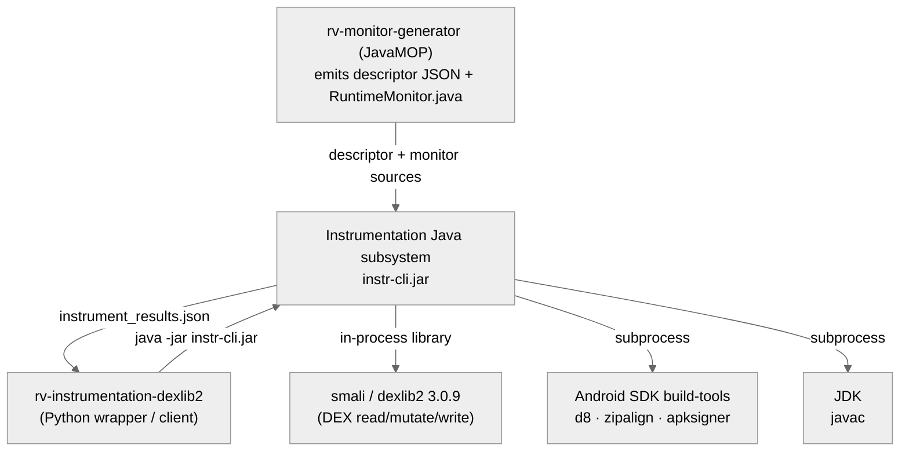
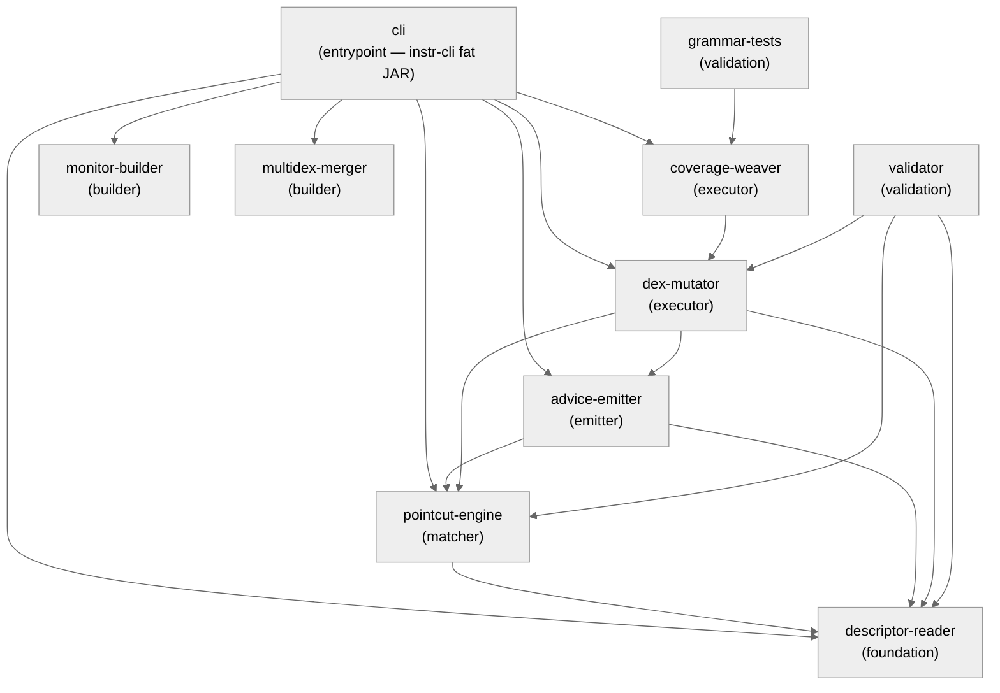
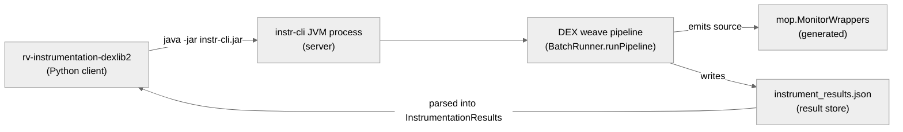

# Architecture — Instrumentation (Java/dexlib2 subsystem)

> Scope: **subsystem** · Generated by `rv-doc-arch` · Source model: `out/arch/subsystem-instrumentation-java/architecture-model.json`
> Languages: Java only — 10 Maven modules, ~12,907 LOC of main code.

## Table of Contents

- [Part I — Beyond Views](#part-i--beyond-views)
  - [1. Documentation overview](#1-documentation-overview)
  - [2. Conceptual primer](#2-conceptual-primer)
  - [3. System overview and context](#3-system-overview-and-context)
  - [4. How it works — end to end](#4-how-it-works--end-to-end)
  - [5. Core components](#5-core-components)
  - [6. Mapping between views](#6-mapping-between-views)
  - [7. Rationale](#7-rationale)
  - [8. Output artifacts](#8-output-artifacts)
  - [9. Directory](#9-directory)
- [Part II — Views](#part-ii--views)
  - [Module view](#module-view)
  - [Component-and-connector view](#component-and-connector-view)
  - [Allocation view](#allocation-view)
- [Appendices](#appendices)
- [Specification traceability](#specification-traceability)

---

## Part I — Beyond Views

### 1. Documentation overview

This document describes the **Java/Maven instrumentation backend** of RV-Android — the
subsystem that physically rewrites Android APK bytecode to install runtime-verification
monitors. It is the DEX-native instrumentation variant introduced under gh#52
(`artifactId rvsec-instrumentation-dexlib2`, version `0.9.2-SNAPSHOT`), packaged as a single
fat JAR (`instr-cli.jar`) and driven through a picocli command line. The audience is a **new
engineer with no prior exposure to this subsystem**: read it top to bottom and you will
understand what it does, how a single APK flows through it, and why it is built the way it is.

The scope is the ten Java modules under
`../rvsec/rvsec-android/rvsec-instrumentation-dexlib2`. The Python wrapper that invokes this
JAR (`rv-instrumentation-dexlib2`) and the JavaMOP monitor generator that feeds it descriptors
are documented as **external systems** here — they bound the subsystem but live in other trees.

**How to read this document:** Part I builds your mental model — what the subsystem is
([primer](#2-conceptual-primer)), how it behaves end to end
([walkthrough](#4-how-it-works--end-to-end)), and why it is shaped this way
([rationale](#7-rationale)). Part II documents the selected views in detail.

### 2. Conceptual primer

This subsystem is the Java/Maven backend that physically rewrites Android APK bytecode to
install runtime-verification monitors. Given a compiled APK and a JSON descriptor (emitted by
JavaMOP) that says "whenever code calls `javax.crypto.Cipher.getInstance(String)`, notify the
monitor", it edits the DEX bytecode inside the APK so those calls also fire monitor events at
runtime, then rebuilds and re-signs the APK. It is a multi-module Maven project
(`rvsec-instrumentation-dexlib2`, `0.9.2-SNAPSHOT`) packaged as a single fat JAR named
`instr-cli.jar` and driven entirely through a picocli command line.

**Why this approach.** The earlier RV-Android instrumentation pipeline (the `ajc` variant,
still shipped as `rv-instrumentation-ajc`) converted DEX to JVM bytecode with dex2jar, wove
aspects with the AspectJ compiler (`ajc`), then recompiled to DEX with d8. That round-trip is
lossy and fragile: dex2jar mis-translates some modern bytecode shapes (Kotlin coroutines,
R8-optimized classes), inflating method counts and producing on-device VerifyError crashes,
and it instruments through `Coverage.aj` which caps coverage faithfulness. This subsystem
(gh#52) instead edits DEX directly with the smali/dexlib2 library: it never leaves the DEX
representation, so it preserves the app's exact multidex partitioning and bytecode shape. The
price is that everything dex2jar+ajc handled for free now has to be implemented by hand at the
register level (register allocation under DEX's 4-bit operand fields, try/catch range
splitting, `<clinit>` synthesis) — which is exactly what the **dex-mutator** module exists to do.

**Key concepts**

- **DEX** — The Dalvik Executable bytecode format Android runs. An APK contains one or more
  `classes<N>.dex` files. DEX is register-based (not stack-based like JVM bytecode), and many
  instruction formats pack a register index into a 4-bit field, so a method can only address
  `v0..v15` directly without wider instruction variants.
- **dexlib2** — The smali project's library (`com.android.tools.smali:smali-dexlib2`) for
  reading, mutating, and writing DEX files. It models a `DexFile` as an immutable tree of
  `ClassDef -> Method -> Instruction`; mutation happens through a `MutableMethodImplementation`
  builder, and `DexPool` serializes the result back to a `.dex`.
- **pointcut / advice** — AspectJ vocabulary carried over from JavaMOP. A *pointcut* is a
  predicate selecting join points in the program (e.g. `call(* Cipher.getInstance(..))`);
  *advice* is the code that runs there (before / after / after-returning). Here the advice body
  is a call into the generated runtime monitor.
- **descriptor** — The JSON file (`MultiSpec_<N>MonitorAspect.json`) that JavaMOP emits
  alongside the `.aj` aspect under `--emit-descriptor`. It is the canonical machine-readable
  contract for this subsystem (INV-INS-56): a strongly-typed tree of aspect name, common
  pointcut, imports, and advices with their pointcut expressions and `monitorCall` lists.
  Parsing the textual `.aj` is explicitly forbidden.
- **weaving** — The act of injecting advice into matched join points. Here it means rewriting
  DEX instructions: either replacing a call site's method reference with a generated static
  wrapper, inserting an inline invoke before/after an instruction, or wrapping a region in a
  try/catch.
- **register aliasing** — The core hazard this subsystem manages. An inline after-advice must
  read the original call's argument registers, but the compiler may have reused those registers
  for the call's result (`move-result` overwrites them). Reading them afterwards yields the
  wrong value and the DEX verifier rejects the class with VerifyError on-device. The wrapper
  strategy (INV-INS-66) sidesteps this.

### 3. System overview and context

The subsystem sits between two external producers and consumers. Upstream,
**rv-monitor-generator (JavaMOP)** produces the JSON descriptor
(`MultiSpec_<N>MonitorAspect.json`, emitted under `--emit-descriptor`, INV-INS-56) and the
`MultiSpec_*RuntimeMonitor.java` monitor sources the engine consumes. Downstream and as the
caller, the **rv-instrumentation-dexlib2 Python wrapper** invokes `instr-cli.jar` via
`java -jar` and parses the resulting `instrument_results.json` into an `InstrumentationResults`
model tagged `variant=dexlib2`. Internally, the executor is built entirely on the third-party
**smali / dexlib2 library** (`com.android.tools.smali 3.0.9`), which provides the DEX
read/mutate/write model. Two external toolchains are shelled out to as subprocesses: the
**Android SDK build-tools** supply `d8` (DEX compile), `zipalign` (alignment), and `apksigner`
(signing), while the **JDK's `javac`** compiles the generated monitor/wrapper/Coverage Java
sources before `d8` runs.

**Constraints:** woven APKs must verify and run on-device (no VerifyError); the original
multidex partitioning must be preserved exactly (INV-INS-52); the JSON descriptor — never the
textual `.aj` — is the only contract source (INV-INS-56); register frames must stay
verifier-valid under DEX's 4-bit operand fields.

**System context diagram** (external actors and systems — every view refers back to this):



### 4. How it works — end to end

The following walks through a concrete example: **instrumenting an app call to
`javax.crypto.Cipher.getInstance(String)` so the JCA monitor receives a `getInstance` event,
ending with a signed instrumented APK.** It is driven by:
`java -jar instr-cli.jar batch <apks-dir> --descriptor MultiSpec_1MonitorAspect.json --monitor-src-dir <mop> ...`

**Stage 1 — descriptor read.** `BatchRunner.runPipeline` phase 1 calls `DescriptorReader.read`
on the `--descriptor` path and gets back an `AspectDescriptor`: a pure POJO (descriptor-reader
module, design D1 — no DEX, no pointcut logic, only Jackson) carrying the aspect name, the
`commonPointcut`, the import list, and the list of `AdviceDescriptor` entries. Each advice
carries its pointcut expression string and its `monitorCall` list (which monitor event to fire
with which bound arguments). Concretely, the advice for our example has expression
`call(* javax.crypto.Cipher.getInstance(..))` and a `monitorCall` naming the `RuntimeMonitor`
event method; `descriptor.getCommonPointcut()` returns the class-level exclusions like
`!within(RVMObject+) && !adviceexecution() && BaseAspect.notwithin()`.

**Stage 2 — type resolution + Android index.** Phase 2 builds a `TypeResolver` from the
descriptor's imports (so short names like `Cipher` resolve to `javax/crypto/Cipher`) and an
`AndroidClassIndex` over the supplied `android.jar`. The index lets `WrapperEmitter` enumerate
the real Android API overloads of `getInstance` so generated wrappers carry the actual
parameter types instead of guessed ones. Concretely,
`AndroidClassIndex(cfg.androidJar())` indexes `android.jar`, and
`TypeResolver(descriptor.getImports())` resolves `Cipher -> Ljavax/crypto/Cipher;`.

**Stage 3 — DEX extraction.** Phase 3 (`BatchRunner.extractDexes`) opens the APK as a ZIP and
reads every `classes<N>.dex` entry into an in-memory `DexBackedDexFile`, keeping the original
entry name so the merger can later drop the woven version back into the same slot. Entries are
sorted so `classes.dex` precedes `classes2.dex`, preserving multidex order. The result is an
`ExtractedDex[]` — e.g. `{classes.dex, classes2.dex}`; an APK with zero `classes*.dex` entries
fails fast with `phase=apk_read`.

**Stage 4 — wrapper generation + APK-wide inheritance.** Still in phase 4 setup,
`WrapperEmitter.generate` writes `mop/MonitorWrappers.java` — one public static wrapper per
advice whose hook would otherwise alias registers (the canonical after-returning case). It
returns `WrapperEntry` metadata telling the `DexWeaver` which call-site signatures to redirect.
A single `InheritanceResolver` is built across **every** DEX of the APK first, then
`weaver.expandWrapperReplacementsForApk` widens each instance wrapper's lookup map to include
app-internal subtypes of the target class (so a `CustomCipher extends Cipher` call site in
`classes2.dex` resolves to the same wrapper as a call in `classes.dex`). For `getInstance` (a
static factory) `WrapperEmitter` emits a static wrapper keyed
`Ljavax/crypto/Cipher;#getInstance(Ljava/lang/String;)Ljavax/crypto/Cipher; -> Lmop/MonitorWrappers;.<name>(...)`.

**Stage 5 — advice weave (per DEX).** `DexWeaver.weave` walks `ClassDef × Method × Instruction`
of each `DexFile`. It parses the `commonPointcut` once and, because that pointcut is
class-invariant, hoists it to a per-class gate (§4.PERF.P2.1): a class the `commonPointcut`
rejects is skipped entirely. For each remaining method it runs two passes. **Pass 1 (wrapper
substitution):** every invoke whose `MethodReference` matches a wrapper key is rewritten in
place via `InstructionInjector.replaceInvoke` — size-stable, so indices stay valid. **Pass 2
(inline advice, iterating right-to-left so insertions never shift unvisited indices):** for
each non-substituted instruction it AND-composes the advice pointcut with the `commonPointcut`,
runs `PointcutMatcher`, and on a match asks `EmitterDispatch` for the right emitter, which
returns an `EmitPlan`. In our example, the `getInstance` call site matches the wrapper key in
pass 1, so the `invoke-static` is rewritten to
`invoke-static Lmop/MonitorWrappers;.<wrapperName>(Ljava/lang/String;)Ljavax/crypto/Cipher;`
and pass 2 skips that index; `wrappersSubstituted` is incremented in the `WeaveReport`.

**Stage 6 — register allocation + injection.** When an `EmitPlan` *is* applied inline (the
non-wrapper case), `RegisterAllocator.allocate` supplies scratch registers; if the frame must
grow it returns a fresh MMI (via `RegisterShifter.spillLowRegisters` / `bumpRegisterCount`,
which clone the method, re-home every label and try-block, and shift operands up — widening
4-bit formats to `/from16` variants when `v15` would overflow). The caller swaps the cached MMI
and notifies the `MutableImplSupplier` so serialization sees the grown frame
(INV-INS-87 / design D5). `InstructionInjector` then inserts the monitor invoke at the
BEFORE / AFTER / METHOD_ENTRY / TRY_CATCH_WRAP point. Concretely, `spillLowRegisters` frees `v0`
as scratch by shifting every register reference up by 1 and growing `registerCount`; without
it, a method with no locals VerifyErrors with
*"tried to get class from non-reference register vN (type=Undefined)"*.

**Stage 7 — coverage weave + serialize.** If `--coverage` is on (default), `CoverageWeaver.weave`
prepends `invoke-static Lmop/Coverage;.log(Ljava/lang/String;)V` to every non-excluded
application method, using the same spill strategy. Then `DexFileMutator.toDexFile` materializes
the mutated `DexFile` and `DexPool.writeTo` serializes each woven DEX under the work dir, keyed
by its original entry name. Concretely, `woven_classes.dex` and `woven_classes2.dex` land under
`workDir`; `coverageInstrumented` / `coverageSpillFailed` are recorded.

**Stage 8 — monitor build (optional).** If `--monitor-src-dir` and the `javac`/`d8`/`rt.jar`
paths are configured, phase 5 emits `mop/Coverage.java`, then `MonitorBuilder` runs `javac` over
the rv-monitor sources + `MonitorWrappers` + `Coverage` and `d8` over the result to produce
monitor `classes<N>.dex` (d8 auto-splits past the 65,536 method-id limit). If those paths are
absent the pipeline stops at written DEXes and reports `phase=dex_only`. `MonitorBuilder.build`
returns the list of monitor `.dex`; failure surfaces as `CommandException` tagged `tool=javac`
or `tool=d8`.

**Stage 9 — merge + sign (optional).** If the signing config and `--output` are present, phase 6
runs `MultidexMerger.merge`: it rewrites the APK ZIP copying every non-DEX entry verbatim,
replaces `classes<N>.dex` with the woven versions, appends each monitor DEX into the next free
`classes<N>.dex` slot (never silently merging — INV-INS-52), then `zipalign -p 4` and
`apksigner sign` with the keystore. The result is a signed instrumented APK in the output dir;
`PerApkResult` is `phase=signed, success=true`. The signed APK lands at
`outputDir/<apkName>`; the aggregate is written to `instrument_results.json` with
`variant=dexlib2`, which the Python wrapper parses into `InstrumentationResults`.

### 5. Core components

A reader navigating the live system will encounter four runtime/structural elements repeatedly.
The **instr-cli JVM process** is the OS process the Python wrapper launches per `java -jar` to
run the weave pipeline. At runtime this is a short-lived JVM started by the Python
`DexlibInstrumentation` wrapper as `java -jar instr-cli.jar <subcommand> <flags>`. In batch mode
one JVM processes an entire `apks-dir` (the fast path); when a strict `apk_paths` subset is
requested the wrapper spawns one JVM per APK via the `instrument` subcommand. The process reads
the descriptor + APK(s), runs the in-process pipeline, writes `instrument_results.json`, and
exits — there is no daemon and no shared state across invocations. There is intentionally no
wallclock timeout on this subprocess (instrumentation is CPU-bound, not hang-prone).

Inside that process, the **DEX weave pipeline** is the six-phase in-process transformation from
APK + descriptor to woven DEXes (and optionally a signed APK). `BatchRunner.runPipeline` is the
conductor: it threads one `AspectDescriptor`, one `TypeResolver`, one `AndroidClassIndex`, and
one APK-wide `InheritanceResolver` through the per-DEX loop. For each DEX it constructs a fresh
`DexFileMutator` (the per-method mutable-view cache) and runs `DexWeaver.weave` then
`CoverageWeaver.weave` against it, accumulating a `WeaveReport` of counters (`matchesApplied`,
`wrappersSubstituted`, the `plansSkipped*` family, `coverageInstrumented`). Those counters are
the observable contract: they land in `instrument_results.json` and downstream `jq` guards fail
the build on regressions (e.g. `plansSkippedUnresolvedBinding > 0` means cryptoapp regressed).

The third element, **`mop.MonitorWrappers` (generated)**, is the structural answer to register
aliasing. `WrapperEmitter` writes this Java source at weave time; monitor-builder later compiles
it to DEX and the merger injects it. Each wrapper is a public static method that calls the
original API, invokes the `RuntimeMonitor` events from the advice's `monitorCall` list, and
returns the original result — all in its own register frame. Because the dex-mutator rewrites a
matched call site's invoke to `invoke-static MonitorWrappers.<name>(...)` keeping the original
register list and `move-result` intact, the caller's registers are byte-identical before and
after the substitution. This is the reason most JCA hooks need no inline injection at all
(INV-INS-66).

The fourth, **`instrument_results.json`**, is the cross-language result contract. `BatchRunner`
serializes a root object `{variant: dexlib2, results: [PerApkResult...]}` where each
`PerApkResult` records `apkName`, `success`, `message`, the `phase` reached, and the
`weaveCounts` map. This file *is* the interface the Python wrapper parses into an
`InstrumentationResults` Pydantic model (INV-INS-55); the `phase` field lets the Python side
distinguish a clean signed result from a partial `dex_only` / `build_only` result and from a
hard failure, and route the experiment accordingly.

| Component | Realized by | Responsibility |
|-----------|-------------|----------------|
| instr-cli JVM process | `cli/InstrumentationCli`, `cli/BatchRunner` | The short-lived OS process the Python wrapper launches per `java -jar` to run the weave pipeline. |
| DEX weave pipeline | `cli/BatchRunner.runPipeline`, `dex-mutator/DexWeaver`, `coverage-weaver/CoverageWeaver` | The six-phase in-process transformation from APK + descriptor to woven DEXes (and optionally signed APK). |
| `mop.MonitorWrappers` (generated) | `advice-emitter/WrapperEmitter` | Generated static wrappers that fire monitor events without aliasing the caller's registers. |
| `instrument_results.json` | `cli/BatchRunner.writeResultsJson`, `cli/BatchRunner.PerApkResult` | The cross-language result contract: per-APK phase, success flag, message, and weave counters. |

### 6. Mapping between views

The module view and the component-and-connector view describe the same artifact at two
altitudes, and the install view explains how that artifact physically reaches its caller. The
ten Maven modules **realize** the runtime components: the `cli` module realizes both the
*instr-cli JVM process* (`InstrumentationCli`, `BatchRunner`) and, together with `dex-mutator`
and `coverage-weaver`, the *DEX weave pipeline* (`BatchRunner.runPipeline` orchestrating
`DexWeaver.weave` and `CoverageWeaver.weave`). The `advice-emitter` module realizes the
*generated `mop.MonitorWrappers`* via `WrapperEmitter`, and the `cli` module also realizes the
*`instrument_results.json`* store via `BatchRunner.writeResultsJson`. There is no daemon: every
runtime component lives and dies within one short-lived JVM invocation.

The one boundary that crosses a language and a process is the link between the Python wrapper and
this subsystem. The Python `rv-instrumentation-dexlib2` module **depends on** the
*instr-cli JVM process* through a subprocess mechanism: `java -jar instr-cli.jar {instrument|batch} ... --results-json`.
What crosses that boundary is argv in one direction (the descriptor path, `android.jar`,
toolchain paths, keystore, output/work dirs, the coverage toggle) and `instrument_results.json`
in the other (per-APK `phase`, `success`, `message`, `weaveCounts`). Three further dependencies
cross out of the JVM into native toolchains: `dex-mutator` depends on the in-process
**smali-dexlib2** library for DEX read/mutate/write, while `monitor-builder` shells out to the
**JDK + Android SDK** (`javac` + `d8`) and `multidex-merger` shells out to the **Android SDK**
(`zipalign` + `apksigner`). The install view closes the loop: the fat JAR
(`instr-cli.jar`) is auto-copied into the Python module's `lib/` so the wrapper resolves it by
relative path — that copy is the physical bridge across the language boundary.

### 7. Rationale

The decisions that shaped this architecture, each with the tension behind it and the failure
mode it avoids.

**DEX-native weaving instead of dex2jar + ajc + d8.** The `ajc` pipeline converts
DEX → JVM bytecode (dex2jar) → woven (`ajc`) → DEX (d8). dex2jar mis-translates modern bytecode
shapes (Kotlin coroutines, R8-optimized classes), inflating method counts and crashing
instrumented apps with VerifyError, and the AspectJ `Coverage.aj` path caps coverage
faithfulness. The rejected alternative was to keep improving the `ajc` round-trip; it was
rejected because the lossy DEX↔JVM conversion is structural, not a bug to patch. Editing DEX
directly keeps the app's exact multidex partitioning and bytecode shape (INV-INS-52). Without
this decision the subsystem would inherit the `ajc` variant's category-specific regressions on
Compose/Kotlin apps; with it, the cost moves to hand-written register management, which is
contained in dex-mutator.

**Wrapper substitution for register-aliasing-prone advice (INV-INS-66).** An inline
after / after-returning hook must read the matched call's argument registers, but the compiler
may reuse those registers for the call's result (`move-result` overwrites them) — reading them
afterwards yields the wrong value and the DEX verifier rejects the class on-device. The rejected
alternative was inline injection plus register-juggling everywhere; it was abandoned after the
2026-05-08 VerifyError campaign showed it failed on every constructor + returning advice. The
wrapper makes a static method call the original *and* fire the monitor events in its own register
frame, and the weaver rewrites the call site to `invoke-static` keeping the register list and
`move-result` untouched, so the caller's registers are byte-identical. Without this,
after-returning advice on static factories (the canonical JCA case) would be uninstrumentable
safely; inline AFTER is now reserved for the one safe case (constructor invokes, which return
void and have no `move-result`). The wrapper set is bounded by the pointcut with full
fixed-prefix fidelity (INV-INS-103): for a trailing-varargs `call(...)` the parser's
`paramSpecs` is exactly the fixed head (`(byte[], ..)` → head `[byte[]]`, varargs flag), and
`WrapperEmitter.expandCallTarget` admits an android.jar overload only if it has at least that
many parameters and every fixed parameter — including the last — matches positionally; a `..`
that survives in the head is a non-trailing wildcard with no finite lowering, so the whole
pointcut is skipped rather than guessed. This is what keeps `doFinal(byte[], ..)` from wrapping
the zero-arg `doFinal()` and, for subtype aliasing (INV-INS-68 phase 2), guarantees the aliased
subtype keys inherit an already-correct overload set.

**Frame growth by MMI clone, with mandatory supplier notification (INV-INS-80 / INV-INS-87).**
dexlib2 declares `MutableMethodImplementation.registerCount` private final with no setter, so the
frame cannot be grown in place. `RegisterShifter.bumpRegisterCount` allocates a fresh MMI of the
new size and copies every instruction, re-homing branch/switch labels and try-blocks. Two failure
modes drive the rules: (1) operand shifts can overflow 4-bit fields mid-stream, so the clone is
built up-front and the source MMI is never mutated — if a shift throws, the abandoned clone is
GC'd and the cache stays pristine (INV-INS-80), avoiding a half-shifted method that VerifyErrors
at every entry; (2) the per-method cache (`DexFileMutator`) would keep handing out the stale
pre-grow MMI, so the caller MUST call `supplier.replaceImpl` after a grow (INV-INS-87 /
design D5) or serialization silently drops the frame growth and the injected instructions. The
rejected alternative (reflection on the private field) was invisible to the `DexPool` writer on
the Docker JDK.

**Class-invariant `commonPointcut` hoisted to a per-class gate (§4.PERF.P2.1).** The
`commonPointcut` (`!within(RVMObject+) && !adviceexecution() && BaseAspect.notwithin()`) carries
class-level exclusions that must gate every match (§4.D.0) — but its verdict depends only on the
`ClassDef`. `DexWeaver.isClassInvariant` detects when the parsed tree contains only class-only
clauses (within/notwithin/the class-only named refs) and, if so, evaluates it once at the top of
the per-class loop: a rejected class skips every method, instruction, and advice. If the tree
ever carries an instruction-dependent clause it falls back to per-instruction AND-composition for
correctness. The rejected naive approach AND-composed the `commonPointcut` into every match,
multiplying the matcher cost by the instruction count; without the hoist, large APKs blew the
weave budget. `commonAstEvals` is exposed for the performance non-regression test.

**Phase-tagged partial results (well-formed failure).** Instrumentation runs over hundreds of
APKs; a single malformed APK or a missing `javac` path must not abort the whole batch.
`BatchRunner` catches `IOException` and `RuntimeException` and returns a `PerApkResult` tagged
`signed` / `dex_only` / `build_only` / `apk_read` / `io_error` / `config_validation` / `uncaught`,
with `success=false` for the partial/failed phases. The Python wrapper parses these into
`InstrumentationResults` (INV-INS-55) and continues to the next APK. The rejected alternative
(throwing out of the batch) would lose every successful APK after the first failure and force a
full re-run; the phase tag also lets `dex_only`/`build_only` artifacts be consumed downstream for
debugging.

**Decisions at a glance**

| Decision | Drivers | Invariant / ADR |
|----------|---------|-----------------|
| DEX-native weaving instead of dex2jar + ajc + d8 | bytecode fidelity, multidex preservation, coverage faithfulness, avoid Kotlin/R8 VerifyError | INV-INS-52 |
| Wrapper substitution for register-aliasing-prone advice | eliminate register aliasing, keep caller registers byte-identical, avoid after-returning VerifyError | INV-INS-66 |
| Frame growth by MMI clone + mandatory supplier notification | registerCount is private final, atomic spill, serialization must see grown frame | INV-INS-80 (also INV-INS-87) |
| Class-invariant `commonPointcut` hoisted to per-class gate | weave performance O(classes) not O(classes×methods×instr×advices); correctness equivalence | — (§4.PERF.P2.1) |
| Phase-tagged partial results (well-formed failure) | batch resilience, cross-language error routing | INV-INS-55 |

**Patterns and styles**

At the **module** level the subsystem is **layered** (high confidence): a strict acyclic ordering
`descriptor-reader` (foundation) ← `pointcut-engine` (matcher) ← `advice-emitter` (emitter) ←
`dex-mutator` (executor) ← `coverage-weaver`, with `cli` on top and `validator` / `grammar-tests`
beside, enforced by the Maven reactor and each pom's `br.unb.cic` dependencies. It is also a
clean **decomposition** (high): a single Maven aggregator (`packaging=pom`) with 10 child modules
each owning one pipeline stage. The **uses** relation (high) confirms the dependencies form a DAG
— e.g. `dex-mutator` declares `advice-emitter` + `pointcut-engine` + `descriptor-reader`, while
`coverage-weaver` declares only `dex-mutator`. At the **component-and-connector** level the
runtime essence is **pipe-and-filter** (high): `BatchRunner.runPipeline` streams one APK through
six sequential transformation stages, each feeding the next; layered over it is a
**client-server** relationship (medium) where the Python wrapper is the client and the
`instr-cli` JVM is the server invoked per `java -jar` with an argv request and a JSON response.
At the **allocation** level the **install** style (high) is the fat-JAR auto-copy into the Python
module's `lib/`, and the **deployment** style (medium) is the Docker image build that gates on
`instr-cli.jar` presence so `RV_INSTRUMENTATION_VARIANT=dexlib2` never crashes mid-experiment.

**NFRs served**

*Compatibility (NFR07).* The whole point of DEX-native weaving is that instrumented APKs still
verify and run on-device. `RegisterShifter` recomputes register counts and widens 4-bit
instruction formats to `/from16` variants when `v15` would overflow, so woven methods present a
verifier-valid frame; the wrapper strategy (INV-INS-66) keeps caller registers byte-identical so
no after-advice site corrupts a binding; and `MultidexMerger` preserves the original multidex
partitioning (INV-INS-52) so dex method-id assumptions hold. `BootValidator` (Layer 2) installs
and monkey-launches instrumented APKs and fails on any VerifyError, gating the result against the
ajc baseline.

*Configurability (NFR05).* Every external dependency is a flag with a documented precedence:
`ConfigResolver` resolves explicit flag → environment variable → built-in default into an
`EffectiveConfig`, and all flags are picocli `INHERIT`-scoped so they apply uniformly to both
subcommands. Optional stages degrade cleanly: omitting `--monitor-src-dir` stops at
`phase=dex_only`; omitting the signing config stops at `build_only`. The `--coverage` toggle
(negatable, default true) selects whether `CoverageWeaver` runs.

*Observability (NFR06).* Weaving emits a rich `WeaveReport` of counters (`classesSeen`,
`methodsSeen`, `matchesApplied`, `wrappersSubstituted`, `wrappersAliasedToSubtype`,
`plansSkipped`, `plansSkippedAliasing`, `plansSkippedHighRegister`,
`plansSkippedUnresolvedBinding`, `constructorInline*`, `staticInitSynthesized/Prepended`,
`coverageInstrumented/SpillFailed`) that `BatchRunner` writes into `instrument_results.json`.
These are not just logs: downstream `jq` guards in `run_phase5_validators.sh` fail the build when
a regression counter is non-zero (e.g. `plansSkippedUnresolvedBinding` signals the cryptoapp
VerifyError regression).

*Testability (NFR03).* The matcher/emitter/mutator separation makes each stage independently
testable: an `EmitPlan` is plain data, the matcher returns a `Match` with bindings, and
`DexFileMutator`'s `MutableImplSupplier` has default no-op methods so in-process test suppliers
need no frame-growth wiring. A dedicated grammar-tests module asserts per-construct woven
bytecode shapes, and the validator module quantifies dexlib2-vs-ajc equivalence across five
layered gates (`FeatureMappingChecker` enforces INV-INS-54 — every AspectJ construct in the
mapping table has a test). The 12,907 LOC of main code is matched by 12,759 LOC of tests.

*Resilience (NFR04).* Failures are contained at three levels: a malformed pointcut or
`commonPointcut` degrades to matching the advice alone (`parseCached`/`parseCommonPointcut` return
null rather than throwing); a binding that cannot be encoded or resolved is skipped under a
counter (`HighRegisterNonContiguous`, `UnresolvedBindingException`) instead of emitting a
verifier-invalid `v0`; and a per-APK exception becomes a phase-tagged `PerApkResult` so the batch
continues. A spill that overflows an unwidenable format vetoes that one method, leaving the rest
of the class intact.

| NFR | PRD ID | Architectural support |
|-----|--------|-----------------------|
| Compatibility | NFR07 | `RegisterShifter` verifier-valid frames; wrapper strategy INV-INS-66; `MultidexMerger` INV-INS-52; `BootValidator` |
| Configurability | NFR05 | `ConfigResolver` flag→env→default; INHERIT-scoped options; `canBuild`/`canMerge` gating |
| Observability | NFR06 | `DexWeaver.WeaveReport`; `BatchRunner` counts map; INV-INS-71 guard |
| Testability | NFR03 | grammar-tests module; `FeatureMappingChecker` (INV-INS-54); `MutableImplSupplier` default methods |
| Resilience | NFR04 | `parseCommonPointcut` + catch blocks; `MonitorInvokeBuilder` exceptions; `BatchRunner` phase tagging |

### 8. Output artifacts

The pipeline produces a graded set of artifacts depending on how far it runs. The terminal
deliverable is the signed APK; the intermediate DEXes and generated sources are useful both as
inputs to later stages and as debugging artifacts when a partial phase is reached; and the
results JSON is the contract the caller consumes regardless of outcome.

| Artifact | Location | Notes |
|----------|----------|-------|
| instrumented + signed APK | `outputDir/<apkName>` | the deliverable; produced only when monitor-src + signing config are supplied (`phase=signed`) |
| woven DEX files | `workDir/woven_classes<N>.dex` | intermediate; the terminal artifact when `phase=dex_only` |
| monitor DEX files | `workDir/monitor-build/dex/` | compiled monitor + MonitorWrappers + Coverage classes; merged into new `classes<N>.dex` slots |
| `mop/MonitorWrappers.java` + `mop/Coverage.java` | `monitorSrcDir` (or `workDir/monitor-src`) | generated Java sources `WrapperEmitter` / `CoverageSourceEmitter` emit for monitor-builder |
| `instrument_results.json` | `results_dir` | the cross-language result contract: `{variant, results:[{apkName,success,message,phase,weaveCounts}]}` |

### 9. Directory

**Glossary / acronyms**

- **DEX** — Dalvik Executable bytecode; register-based, 4-bit operand fields in many formats.
- **MMI** — `MutableMethodImplementation`, dexlib2's mutable method builder.
- **PCD** — Pointcut Designator; an AspectJ pointcut node kind (`call`, `execution`, `within`…).
- **CPS** — Continuation-Passing Style; the shape Kotlin coroutines compile to (see `CpsDetector`).
- **ajc** — the AspectJ compiler, used by the legacy `rv-instrumentation-ajc` variant.
- **JCA** — Java Cryptography Architecture; the canonical specification set instrumented here.
- **TOST** — Two One-Sided Tests; the statistical non-inferiority test in the validator (Layer 4).
- **F1 / kappa** — trace-equivalence metrics in `TraceComparator` (Layer 3).

**References**

- SDD spec: `openspec/specs/instrumentation/spec.md` (domain `instrumentation`, FR01–FR03).
- Per-module 4+1 docs: `modules/<m>/docs/architecture.md` (Python wrapper side).
- ADRs: `modules/<m>/docs/adr/`.
- PRD: `docs/PRD.md`.
- Feature mapping audit surface: `AJ_TO_DEXLIB2_MAPPING.md` (enforced by `FeatureMappingChecker`,
  INV-INS-54).

---

## Part II — Views

### Module view

*Style(s): layered, decomposition*

This view shows the static structure a maintainer must respect when changing code: the
foundation → matcher → emitter → executor → entrypoint tiers and the acyclic Maven dependency
DAG. Two styles overlap here. The **layered** style explains *why* the dependency arrows point
the way they do — each tier may depend only on tiers below it. The **decomposition** style
explains *what* each of the ten child modules owns: the project is a single Maven aggregator
(`packaging=pom`) and every child module owns exactly one pipeline stage or cross-cutting
concern. Together they answer "where does my change go, and what may it depend on".

**Primary presentation**



**Element catalog**

The **descriptor-reader** is the foundation. `DescriptorReader.read` deserializes
`MultiSpec_<N>MonitorAspect.json` (emitted by patched JavaMOP under `--emit-descriptor`) with
Jackson into an `AspectDescriptor` exposing the aspect name, the `commonPointcut` string, the
import list (consumed by `TypeResolver`), the `baseAspectExclusions`, and a list of
`AdviceDescriptor` (each carrying its raw pointcut expression and a list of
`MonitorCallDescriptor`). The whole module is intentionally inert: it queries JSON and hands
downstream modules a strongly-typed tree they never re-parse. It is separate (design D1) so the
contract type sits at the bottom of the dependency graph — pointcut-engine, advice-emitter, and
dex-mutator all share one canonical model and none can couple to the raw JSON shape or to each
other through it; it also pins the rv-monitor-generator ↔ engine contract (INV-INS-56) to one
place. *Gotchas:* the JSON descriptor — not the textual `.aj` — is the canonical contract
(INV-INS-56); and `commonPointcut` is a separate field carrying class-level exclusions that the
weaver must AND-compose (§4.D.0) or they silently never apply.

The **pointcut-engine** is the matcher. `PointcutExpressionParser` turns a pointcut string into a
PCD AST (`CallPC`, `ExecutionPC`, `StaticInitPC`, `WithinPC`/`NotWithinPC`, `ArgsPC`, `TargetPC`,
`IfPC`, `NamedRefPC`, `NegationPC`, composed by `CombinedPC`). `PointcutMatcher` evaluates that
AST against a `(ClassDef, Method, Instruction, index)` tuple and, on a match, returns a `Match`
carrying argument and target register bindings. `TypeResolver` expands short names from the
descriptor imports; `InheritanceResolver` answers subtype queries across all DEXes of the APK
plus `android.jar`; `AndroidClassIndex` enumerates real API overloads; and a CPS-aware pass
(`CpsDetector`, INV-INS-61) unwraps Kotlin coroutine state machines so naming-based matchers see
the user-facing suspend owner. It is separate because pointcut semantics are a distinct concern
from bytecode mutation — the matcher decides "does this join point match and what are the
bindings" with no knowledge of how a hook is emitted, which is what makes per-construct grammar
testing and the validator's feature-mapping audit (INV-INS-54) tractable. *Gotchas:* `ArgsPC` and
the binding form of `target(o)` are inert collectors (they gather bindings, never fail a match in
isolation), while `target(Cipher)` does constrain the receiver type; `IfPC`/`NamedRefPC` match-
true at the matcher level (guards are realized later by `IfGuardEmitter`); and the matcher peeks
`instructions[i+1]` for a trailing `move-result*` to record the synthetic `$return` binding
(INV-INS-72), skipped for constructors.

The **advice-emitter** is the emitter. `EmitterDispatch.select` picks an `AdviceEmitter` by the
advice kind (before / after / after-returning / after-throwing / staticinitialization). Each
emitter, given an `EmitContext`, builds an `EmitPlan`: the `BuilderInstruction`s to inject, the
scratch-register demand (`RegisterRequest`), the `InsertionPoint`
(BEFORE/AFTER/METHOD_ENTRY/TRY_CATCH_WRAP/REPLACE), and any guard spec. `MonitorInvokeBuilder`
constructs the actual invoke into the `RuntimeMonitor`, choosing Format35c (4-bit) or Format3rc
(range) and throwing `HighRegisterNonContiguous` or `UnresolvedBindingException` when bindings
cannot be encoded or resolved. `WrapperEmitter` is the strategic piece: it writes
`mop/MonitorWrappers.java` with one public static wrapper per register-aliasing-prone advice. The
module is separate because it decides *what* to inject (an `EmitPlan` is pure data) while
dex-mutator decides *how* and *where*. *Gotchas:* `MonitorInvokeBuilder` throws two checked-shape
exceptions the weaver catches and counts rather than crashing — `HighRegisterNonContiguous`
(bindings > v15 and non-contiguous, INV-INS-69) and `UnresolvedBindingException` (gh56
INV-INS-71); the previous literal-`v0` fallback caused the 2026-05-08 VerifyError campaign — there
is no zero default anymore. Instance-target advice still emits a static wrapper that prepends the
receiver as its first formal.

The **dex-mutator** is the executor. `DexWeaver.weave` walks `ClassDef × Method × Instruction`,
runs the per-class hoisted `commonPointcut` gate, then a two-pass per-method loop (pass 1 wrapper
substitution via `InstructionInjector.replaceInvoke`; pass 2 right-to-left inline advice). The
hard part is register management under DEX's 4-bit operand fields: `RegisterShifter` grows a
frame by cloning the MMI (`registerCount` is private final), copying every instruction,
re-homing all labels and try-blocks, and shifting operands up — widening 4-bit formats to
`/from16` and vetoing the spill when a format cannot be widened. `StaticInitSynthesizer` creates a
fresh `<clinit>` when a class needs static-init advice but has none (§4.Y). `DexFileMutator` is
the `MutableImplSupplier`: it caches per-method mutable views and exposes `replaceImpl` so
frame-growth clones replace the stale cached MMI. It is separate as the pure executor: plans come
in, mutations go out, and all DEX-format hazard is concentrated here. *Gotchas:* `registerCount`
has no setter — the only safe grow is `bumpRegisterCount` (clones the whole MMI) and the caller
MUST call `supplier.replaceImpl` after a grow (INV-INS-87/D5) or serialization drops the growth;
inline AFTER advice on a non-constructor invoke is skipped defensively (`plansSkippedAliasing`)
because the `move-result*` overwrites the binding registers; pass 2 iterates right-to-left so each
insertion shifts only already-processed indices; and `spillLowRegisters` is atomic-by-clone
(INV-INS-80) so a mid-stream overflow never leaves a half-shifted method in the cache.

The **coverage-weaver** is a second, orthogonal executor. `CoverageWeaver.weave` prepends
`invoke-static Lmop/Coverage;.log(...)V` to every method the canonical `PackageFilter`
(INV-INS-53) does not exclude — the DEX-native equivalent of the legacy `Coverage.aj` exclusion
rule, so the two variants measure coverage over the same app-code population. `SignatureFormatter` precomputes the
signature string at weave time (no runtime reflection) in the Soot-style shape the legacy aspect
emitted, so Layer-5 RVSEC-COV recall comparisons line up. It reuses dex-mutator's
`RegisterShifter.spillLowRegisters` for the scratch register. It is separate because it is gated
by a different `--coverage` flag and a different exclusion filter, so the advice weave and the
coverage weave evolve and test independently while sharing the spill machinery. *Gotchas:*
naively calling `bumpRegisterCount` alone (without `spillLowRegisters`) on a zero-local method
produces VerifyError — this was the gh52 smoke boot crash on cryptoapp; and the generated
`mop.Coverage` uses `ConcurrentHashMap.newKeySet()` for thread-safety (INV-INS-60), with the
runtime class itself emitted by monitor-builder's `CoverageSourceEmitter`.

The **monitor-builder** compiles the generated Java sources to DEX. `MonitorBuilder.build` runs
`javac` over the rv-monitor sources + `MonitorWrappers` + `Coverage` using the `BuilderConfig`
classpath, then `d8` to produce monitor `classes<N>.dex` (d8 auto-splits past the 65,536 method-
id limit). `CoverageSourceEmitter` writes `mop/Coverage.java`. It is separate because it shells
out to external JDK/Android-SDK binaries — a different category from in-process DEX mutation — so
the weaver modules stay free of toolchain assumptions and the pipeline can skip this stage
(`phase=dex_only`) when build paths are absent. *Gotchas:* the `javac` classpath must be narrowed
to the jars the monitor sources reference (`rv-monitor-rt`, `rvsec-core`,
`rvsec-logger-logcat`) — the Python wrapper computes this narrowed list; and a silent
`javac`/`d8` failure (zero exit, no `.dex`) is caught downstream by the Python wrapper.

The **multidex-merger** repacks and signs. `MultidexMerger.merge` rewrites the APK ZIP copying
every non-DEX entry verbatim, replaces each `classes<N>.dex` with its woven version, appends each
monitor DEX into the next free `classes<N>.dex` slot, then runs `zipalign -p 4` and
`apksigner sign`. It is separate as the final purely-IO stage with its own external-tool
dependencies and the multidex-preservation invariant; it is the only module that produces the
deliverable APK, so the merge/sign policy (INV-INS-52) lives in one auditable place. *Gotchas:*
the original multidex partitioning is preserved exactly (INV-INS-52) — monitor DEXes only go into
NEW slots, never silently merged; and `zipalign` runs before `apksigner` because apksigner v3
expects pre-aligned input.

The **cli** is the entrypoint and orchestrator, built as the `instr-cli` fat JAR.
`InstrumentationCli` is the picocli root command (`br.unb.cic.rv.cli.InstrumentationCli`) with
`instrument <apk>` and `batch <apks-dir>` subcommands; all flags are `INHERIT`-scoped.
`ConfigResolver` applies explicit flag → env var → default to produce an `EffectiveConfig`, and
`BatchRunner.runPipeline` executes the six phases, tagging each `PerApkResult` with the phase it
reached. It is separate because it is the process boundary — the single artifact the Python world
invokes via `java -jar` and the only module that knows the full phase sequence and flag surface.
*Gotchas:* the maven-shade-plugin builds `finalName=instr-cli` and a maven-resources-plugin
execution (design D9) auto-copies `instr-cli.jar` into `rv-android/modules/rv-instrumentation-dexlib2/lib`
at every package; and phase outcomes are encoded in `PerApkResult.phase`, with the
`InheritanceResolver` built once across ALL DEXes before the per-DEX loop so wrapper subtype
expansion sees cross-DEX subclasses.

The two validation modules sit beside the production tiers. The **validator** is a research-grade
equivalence harness: `ValidationCli` exposes layered gates — `BaksmaliDiffer` (Layer 1, per-spec
static hook recall), `BootValidator` (Layer 2, install + monkey-launch + VerifyError scan),
`TraceComparator` (Layer 3, F1 + Cohen's kappa against mandatory oracles, INV-INS-59),
`BatchValidator` (Layer 4, JCA-400 × 3 tools × 3 reps + Wilcoxon TOST non-inferiority,
INV-INS-58), `CoverageValidator` (Layer 5, RVSEC-COV recall), and `FeatureMappingChecker`
(enforces the AspectJ-construct → dexlib2-component mapping, INV-INS-54). It is separate so it
never ships in the runtime hot path and carries its own heavier dependencies (commons-math3).
*Gotchas:* every row of `AJ_TO_DEXLIB2_MAPPING.md` must have a validator test (INV-INS-54); and
when `cryptoapp.apk` is in scope, Layer 3 must run with `--mandatory` (INV-INS-73) — any event-
count deviation fails the build. The **grammar-tests** module is a JUnit 5 test-only module that
exercises pointcut-engine, advice-emitter, dex-mutator, and coverage-weaver against a grammar-
coverage corpus parsed from Markdown tables (commonmark + commonmark-ext-gfm-tables) with
junit-pioneer for parameterized cases. It is separate because grammar coverage is an aggregate
cross-module concern that does not belong inside any single weave module. *Gotcha:* it has no
main-source artifact — it is a surefire-driven test module.

| Element | Responsibility | Relations / interfaces |
|---------|----------------|------------------------|
| descriptor-reader (foundation) | Parse the JavaMOP JSON descriptor into a typed POJO tree. | depended on by pointcut-engine, advice-emitter, dex-mutator, cli, validator |
| pointcut-engine (matcher) | Parse AspectJ pointcuts and match them against DEX tuples. | uses descriptor-reader; used by advice-emitter, dex-mutator, validator |
| advice-emitter (emitter) | Translate a matched advice into an `EmitPlan`; generate static wrappers. | uses pointcut-engine + descriptor-reader; used by dex-mutator |
| dex-mutator (executor) | Apply EmitPlans to a DexFile; substitute wrappers; allocate/grow registers; serialize. | uses advice-emitter + pointcut-engine + descriptor-reader; used by coverage-weaver, validator |
| coverage-weaver (executor) | Prepend a `Coverage.log(signature)` call to every non-excluded method. | uses dex-mutator; used by grammar-tests |
| monitor-builder (builder) | Compile generated monitor/wrapper/Coverage Java to DEX via `javac` + `d8`. | used by cli; shells out to JDK + Android SDK |
| multidex-merger (builder) | Repack woven + monitor DEXes into the APK; `zipalign` + `apksigner`. | used by cli; shells out to Android SDK |
| cli (entrypoint) | Picocli entry point + pipeline orchestrator; the `instr-cli` fat JAR. | uses all weave/build modules; invoked via `java -jar` |
| validator (validation) | Layered dexlib2-vs-ajc equivalence harness. | uses dex-mutator + pointcut-engine + descriptor-reader |
| grammar-tests (validation) | Markdown-driven per-construct grammar coverage test suite. | uses coverage-weaver (test-only, no main artifact) |

**Context** — see [system context](#3-system-overview-and-context).

**Variability guide**

The dependency DAG is the hard constraint: a new pointcut construct adds a PCD class in
pointcut-engine; a new advice kind adds an emitter in advice-emitter plus an `EmitterDispatch`
case; a new injection mechanism is contained in dex-mutator. No tier may depend upward, and
coverage-weaver may depend only on dex-mutator. The `--coverage` toggle selects whether
coverage-weaver participates; the monitor-builder and multidex-merger stages are independently
optional (their absence yields `dex_only` / `build_only`). The validation modules are never on
the production path and may carry dependencies (commons-math3, commonmark) that production
modules must not.

**Rationale**

The layering exists so that bytecode-format hazard stays in one module (dex-mutator) and pointcut
semantics in another (pointcut-engine), letting the rest of the subsystem reason in terms of
plans and matches rather than `Format35c` vs `Format3rc`. The decomposition into ten single-
responsibility modules is what makes the per-construct grammar-tests suite and the validator's
five-layer audit tractable: each can target one stage in isolation. Keeping descriptor-reader at
the bottom (design D1) pins the cross-tool contract (INV-INS-56) to one canonical model nothing
else can bypass.

### Component-and-connector view

*Style(s): pipe-and-filter, client-server*

This view shows the subsystem in motion. The dominant **pipe-and-filter** style traces how a
single APK streams through six sequential transformation stages — descriptor read → type
resolution → DEX extraction → weave + serialize → `javac`/`d8` → repack/sign — each stage's
output feeding the next. Layered over it is the **client-server** style that exposes the
Python↔Java process boundary: the Python `rv-instrumentation-dexlib2` wrapper is the client, the
`instr-cli` JVM is the server invoked per `java -jar` with an argv request and an
`instrument_results.json` response. Reading this view tells you what runs at runtime and how the
subsystem is invoked.

**Primary presentation**



**Element catalog**

| Component / connector | Type | Responsibility |
|-----------------------|------|----------------|
| rv-instrumentation-dexlib2 (Python client) | external client | Launches the JVM per `java -jar`, supplies argv, parses the results JSON. |
| instr-cli JVM process | subprocess (server) | Short-lived JVM that runs the weave pipeline for one APK or a whole batch, then exits. |
| DEX weave pipeline | service | Six-phase in-process transformation from APK + descriptor to woven DEXes (and optionally signed APK). |
| `mop.MonitorWrappers` (generated) | class | Static wrappers that fire monitor events in their own frame, keeping caller registers byte-identical. |
| `instrument_results.json` | store | The cross-language result contract: per-APK `phase`, `success`, `message`, `weaveCounts`. |
| `java -jar … --results-json` | connector (subprocess) | The process+language boundary; argv in, results JSON out. |

**Context** — see [system context](#3-system-overview-and-context).

**Variability guide**

The client invokes the server in two modes: `batch <apks-dir>` runs one JVM over an entire
directory (the fast path), while a strict `apk_paths` subset spawns one JVM per APK via
`instrument <apk>`. The pipeline length is variable: it always runs through weave + serialize, but
the `javac`/`d8` stage runs only when `--monitor-src-dir` and toolchain paths are present, and the
repack/sign stage runs only when signing config and `--output` are present — otherwise the run
terminates at `dex_only` or `build_only`. The `--coverage` toggle inserts or omits the coverage
filter within the weave stage.

**Scenarios**

*WHEN* an app calls a static factory like `javax.crypto.Cipher.getInstance(String)` and the JCA
descriptor has an after-returning advice on it, *THEN* the weaver rewrites the `invoke-static` to
`invoke-static Lmop/MonitorWrappers;.<name>(Ljava/lang/String;)Ljavax/crypto/Cipher;` in pass 1
and increments `wrappersSubstituted`, and pass 2 skips that index, *AND* the caller's registers
and the trailing `move-result` stay byte-identical, so no inline post-call hook is emitted and the
class verifies on-device. *Why:* an inline after-returning hook would read argument registers the
`move-result` may have overwritten (register aliasing), producing VerifyError; the wrapper fires
events in its own frame instead (INV-INS-66).

*WHEN* a method selected for coverage instrumentation has zero local registers (every register is
a parameter — e.g. a one-line getter), *THEN* `CoverageWeaver` calls
`RegisterShifter.spillLowRegisters` to shift every register reference up by 1 and grow
`registerCount`, freeing `v0` as scratch for the const-string + `invoke-static log` call, *AND*
params end up at `registerCount-paramRegs..registerCount-1`, exactly where the runtime
initializes them under the new count, so the method verifies. *Why:* naively bumping
`registerCount` alone leaves the new param slots uninitialized at entry, which the verifier
rejects with *"tried to get class from non-reference register vN (type=Undefined)"* — the gh52
cryptoapp boot crash.

*WHEN* an advice binding occupies a register above `v15` and the bindings are non-contiguous so
neither Format35c (4-bit) nor Format3rc (contiguous range) can encode the monitor invoke, *THEN*
`MonitorInvokeBuilder` throws `HighRegisterNonContiguous`, `DexWeaver` catches it, increments
`plansSkippedHighRegister`, and continues to the next match, *AND* the rest of the method and
class are woven normally; the skip is surfaced as a counter, not a crash. *Why:* emitting an
invalid invoke would VerifyError on-device; a counted defensive skip preserves the batch and flags
the gap for a future move-from16-preamble fix (INV-INS-69).

*WHEN* the caller invokes `instr-cli batch` but supplies neither `--monitor-src-dir` nor the
`javac`/`d8` paths, *THEN* the pipeline weaves and serializes the DEXes, then returns
`PerApkResult` with `phase=dex_only` and `success=false`, leaving `woven_classes<N>.dex` under the
work dir, *AND* the Python wrapper records the partial result and the artifacts remain available
for inspection or downstream consumption. *Why:* the monitor build and merge are optional stages
gated on their config (`canBuild`/`canMerge`); degrading to `dex_only` is more useful than
failing, and lets the weave be validated independently of the toolchain.

*WHEN* a `staticinitialization(T+)` advice matches a class that has no `<clinit>`, *THEN* the §4.Y
pre-pass synthesizes a fresh `<clinit>` via `StaticInitSynthesizer` carrying the Signature-
delivery body in a 2-register frame and registers it through `addSynthesizedMethod`
(`staticInitSynthesized++`); a class *with* a `<clinit>` instead gets the delivery prepended after
spilling two low registers (`staticInitPrepended++`), *AND* the per-method weave loop skips
staticinit advice entirely, so a class with no `<clinit>` (never visited by that loop) is still
covered and a class with one is not double-emitted. *Why:* static-init join points fire in the
class initializer, which may not exist; the pre-pass is the only place that can both synthesize a
missing `<clinit>` and uniformly handle existing ones.

*WHEN* an app-internal subclass `CustomCipher extends javax.crypto.Cipher` and the call site lives
in a different DEX than the subclass declaration, *THEN* `expandWrapperReplacementsForApk` (run
once before the per-DEX loop, using an `InheritanceResolver` built across ALL DEXes) registers an
extra wrapper lookup key for the subtype's signature and increments `wrappersAliasedToSubtype`,
*AND* a virtual/interface dispatch on `CustomCipher` resolves to the same parent-typed wrapper
(the DEX verifier accepts the substitution because subtypes are assignable to supertypes); static
wrappers are skipped to avoid over-matching. *Why:* instance-method calls dispatch through
subtypes, and the subclass and call site can be in different `classes<N>.dex`; a single-DEX
inheritance view would miss the subtype and under-instrument (INV-INS-68 phase 2).

**Rationale**

Pipe-and-filter is the natural shape for a transformation that has a single direction of flow and
no shared mutable state between stages — it makes each stage independently testable and lets the
pipeline truncate cleanly at any optional stage boundary. The client-server framing isolates the
cross-language contract to exactly one connector (`java -jar … --results-json`), so the Python
side never needs to know the internal phase structure beyond the `phase` tag it reads back. The
generated `MonitorWrappers` class appears in this view because it is materialized at runtime by
the pipeline and consumed by both the weave (which redirects call sites to it) and the build
(which compiles it).

### Allocation view

*Style(s): install, deployment*

This view explains how the software maps onto deliverable artifacts and where they physically
live — the bridge that lets a Python process invoke a Java engine. The **install** style is the
core: the entire subsystem ships as one fat JAR (`instr-cli.jar`) that is auto-copied into the
Python module's `lib/` directory at build time. The **deployment** style covers the Docker image
build that guarantees the JAR is present before any experiment selects the dexlib2 variant.

**Primary presentation**

```mermaid
%%{init: {'theme': 'neutral'}}%%
flowchart TB
  reactor["Maven reactor<br/>(10 modules)"]
  shade["maven-shade-plugin<br/>finalName=instr-cli"]
  jar["instr-cli.jar<br/>(fat JAR)"]
  libdir["rv-android/modules/<br/>rv-instrumentation-dexlib2/lib/"]
  docker["Docker image<br/>(docker/rvandroid/Dockerfile)"]

  reactor --> shade
  shade --> jar
  jar -->|maven-resources-plugin (D9) auto-copy| libdir
  jar -->|presence gate| docker
```

**Element catalog**

| Software element | Allocated to | Notes |
|------------------|--------------|-------|
| 10 Maven modules | Maven reactor | Built together; `cli` produces the runnable artifact, the rest are libraries. |
| `instr-cli.jar` (fat JAR) | maven-shade-plugin (`finalName=instr-cli`) | The single artifact the Python world invokes via `java -jar`. |
| `instr-cli.jar` copy | `rv-android/modules/rv-instrumentation-dexlib2/lib/` | Auto-copied by a maven-resources-plugin execution (design D9) at every `package`; the Python wrapper resolves it by relative path. |
| Docker image | `docker/rvandroid/Dockerfile` | Build gates on `instr-cli.jar` presence so `RV_INSTRUMENTATION_VARIANT=dexlib2` never crashes mid-experiment with `FileNotFoundError`. |

**Context** — see [system context](#3-system-overview-and-context).

**Variability guide**

The install location is fixed by the D9 maven-resources-plugin execution so the Python wrapper can
use a relative path; changing it requires updating both the pom execution and the wrapper's path
resolution. The Docker presence gate is what makes the dexlib2 variant safe to select at
experiment time — without it, a missing JAR would surface only as a mid-run `FileNotFoundError`.

**Rationale**

Packaging the whole subsystem as one fat JAR collapses ten modules and their transitive
dependencies (notably smali-dexlib2) into a single file with no classpath assembly for the caller,
which is the simplest possible cross-language contract: one file, one `java -jar` invocation. The
auto-copy (D9) removes a manual deployment step that, if forgotten, would leave the Python wrapper
pointing at a stale or absent JAR; the Docker presence gate turns a late runtime failure into an
early build failure.

---

## Appendices

### A. Dependencies

This subsystem is Java-only; its notable dependencies are one in-process library and three
external toolchains. The in-process library is **smali / dexlib2**
(`com.android.tools.smali:smali-dexlib2`, version **3.0.9**), on which the entire executor
(`dex-mutator`) is built — it provides the `DexFile`/`ClassDef`/`Method`/`Instruction` model, the
`MutableMethodImplementation` builder, and the `DexPool` serializer. Serialization-side concerns
(`registerCount` being private final; the `DexPool` writer ignoring reflection-set fields) come
directly from this library's design and motivate the clone-based frame-growth decision.

The three external toolchains are invoked as subprocesses, not linked: the **JDK** supplies
`javac` to compile the generated monitor/wrapper/Coverage sources; the **Android SDK build-tools**
supply `d8` (DEX compile, used by `monitor-builder`), `zipalign` (4-byte alignment), and
`apksigner` (signing, both used by `multidex-merger`). Two further libraries are confined to the
validation tier and must never reach the production path: **commons-math3** (the Wilcoxon TOST and
Cohen's kappa statistics in `validator`) and **commonmark** + **commonmark-ext-gfm-tables** plus
**junit-pioneer** (the Markdown-driven `grammar-tests` corpus). Common infrastructure across all
modules is **Jackson** (descriptor JSON), **slf4j** (logging), and **picocli** (the CLI).

### B. Data model

The model defines no separate data-entity set: the descriptor POJO tree (`AspectDescriptor` →
`AdviceDescriptor` → `MonitorCallDescriptor` → `ParameterDescriptor`) and the result contract
(`PerApkResult` with its `weaveCounts` map) are documented inline in the
[walkthrough](#4-how-it-works--end-to-end), [core components](#5-core-components), and the
descriptor-reader element of the [module view](#module-view). No standalone ER view is warranted
for this transformation-centric subsystem.

---

## Specification traceability

Domain: **instrumentation** · Spec: `openspec/specs/instrumentation/spec.md`

This subsystem realizes the instrumentation domain's three functional requirements end to end and
enforces a large set of instrumentation invariants in code. The mapping below ties each
requirement and invariant to the module or unit that realizes or enforces it; NFR realization is
narrated in the [Rationale](#7-rationale) section above.

| Type | IDs | Where realized |
|------|-----|----------------|
| Functional requirements | FR01, FR02, FR03 | the full weave pipeline: `cli/BatchRunner.runPipeline` orchestrating descriptor-reader → pointcut-engine → advice-emitter → dex-mutator → coverage-weaver → monitor-builder → multidex-merger |
| Invariants | INV-INS-52, INV-INS-53, INV-INS-54, INV-INS-55, INV-INS-56, INV-INS-58, INV-INS-59, INV-INS-60, INV-INS-66, INV-INS-68, INV-INS-69, INV-INS-71, INV-INS-72, INV-INS-73, INV-INS-80, INV-INS-87, INV-INS-103 | INV-INS-52 `multidex-merger/MultidexMerger`; INV-INS-53 `coverage-weaver/PackageFilter` (canonical Coverage exclusion filter); INV-INS-54/58/59/73 `validator/{FeatureMappingChecker,BatchValidator,TraceComparator}`; INV-INS-55 `cli/BatchRunner.PerApkResult`; INV-INS-56 `descriptor-reader/DescriptorReader`; INV-INS-60 `coverage-weaver`/`monitor-builder` (`mop.Coverage`); INV-INS-66/68 `dex-mutator/DexWeaver` + `advice-emitter/WrapperEmitter`; INV-INS-69/71 `advice-emitter/MonitorInvokeBuilder`; INV-INS-72 `pointcut-engine/PointcutMatcher`; INV-INS-80/87 `dex-mutator/RegisterShifter` + `DexFileMutator`; INV-INS-103 `advice-emitter/WrapperEmitter.expandCallTarget` |
| NFRs | NFR03, NFR04, NFR05, NFR06, NFR07 | see [Rationale](#7-rationale) |

**Related documentation:** per-module 4+1 docs (`modules/<m>/docs/architecture.md`), ADRs
(`modules/<m>/docs/adr/`), PRD (`docs/PRD.md`).
